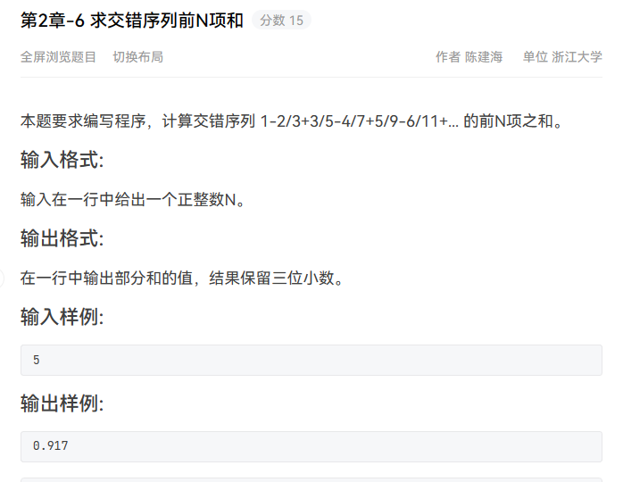
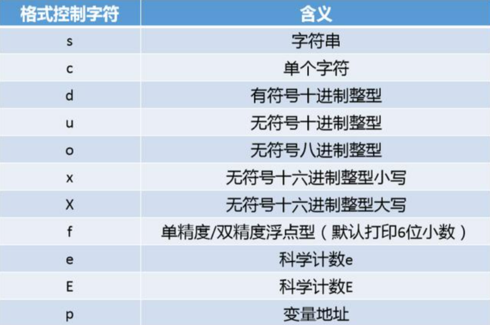

# 10.5_learn

## 字符串的split

在 Python 中，字符串的 `split()` 方法用于将字符串按照指定的分隔符进行分割，并返回一个由分割后的子字符串组成的==列表==。

不指定分隔符，默认情况下 `split()` 方法会以空格作为分隔符。


## 序列解包

在 Python 中，序列解包（Sequence Unpacking）是一种快捷的赋值方式，可以同时将一个序列中的元素分别赋值给多个变量。它可以应用于任何可迭代对象，如列表、元组、字符串等。

```python
a,b,c = input("请输入三个值（以空格分隔）：").split()
a=int(a)
b=int(b)
c=int(c)
print(a+b+c)
```

注意事项

> 1. 元素数量匹配：序列解包的元素数量必须与变量数量完全匹配，否则会引发 `ValueError` 异常。这意味着如果你有一个包含三个元素的可迭代对象，你必须使用三个变量进行解包。
>
> 2. 占位符：在某些情况下，你可能只需要解包部分元素，而不需要使用全部的元素。为了达到这个目的，你可以使用占位符 `_` 来忽略解包的特定元素。例如：
>
>    ```python
>    pythonCopy Codea, _, c = [1, 2, 3]
>    ```
>
>    在这个例子中，我们忽略了第二个元素，将第一个和第三个元素分别赋值给变量 `a` 和 `c`。
>
> 3. ==**星号表达式**==：当解包的元素数量不确定时，你可以使用星号表达式来==收集剩余的元素==。星号表达式用于指定一个变量名，==在解包时它将被赋值为一个列表==，其中包含所有剩余的元素。例如：
>
>    ```python
>    a, *rest ="helloworld"
>    print(a)
>    print(rest)  
>    # h
>    # ['e', 'l', 'l', 'o', 'w', 'o', 'r', 'l', 'd']
>    ```
>
>    在这个例子中，变量 `a` 接收第一个元素，而变量 `rest` 接收剩余的元素作为列表。
>
> 4. 可迭代对象类型：序列解包可以应用于任何可迭代对象，如列表、元组、字符串等。确保你正在使用一个可迭代对象来进行解包操作。

## range

range(m,n)

得到一个序列[m,n-1]

> 1. 范围：`a` 是序列的起始值，`b` 是序列的结束值。生成的序列包含的整数范围是 `[a, b)`，也就是从 `a` 开始，直到 `b-1` 结束。
> 2. 步长：`range()` 函数还可以接受一个可选的第三个参数 `step`，用于指定每个元素之间的步长。默认步长为 1。例如，`range(1, 5, 2)` 将生成 1、3 这两个数。
> 3. 迭代器：`range()` 返回的是一个迭代器对象，而不是一个列表。==这意味着它并不会立即生成整个序列，而是在每次迭代时生成序列的下一个值。这样可以节省内存空间。==
> 4. 转换为列表：如果需要将序列转换为列表，可以使用 `list()` 函数，例如 `list(range(1, 5))`。
> 5. 使用技巧：`range()` 函数在循环中经常使用，特别是当你需要迭代一定次数的时候。

```python
# a=int(input())
for i in range(1,11,2):
    print("%d "%(i),end="")
    # 13579

```

**当 `range()` 函数只有一个参数 `n` 时，它将生成一个从 0 开始、步长为 1、不包含 `n` 的整数序列。换句话说，生成的范围是 `[0, n-1]`。**

## float

Python 中的整数转换为小数时，通常使用内置函数 `float()` 将其转换为浮点数（floating-point number），==而不是使用 `double` 类型。==

因为 Python 的浮点数类型默认使用双精度浮点数（double-precision floating-point number），它能够表示的范围和精度已经非常高了，因此在一般情况下没有必要使用更高精度的数据类型。

Python 的浮点数采用 IEEE 754 标准表示，使用 64 位二进制数来表示一个浮点数。由于 Python 中整数的数值范围相对较大，在 64 位浮点数的范围内，整数转换为浮点数时不会出现精度问题。

**在 Python 中，默认情况下，整数转换为浮点数时会以添加 `.0` 的形式表示。转换后的浮点数会保留与整数相同的数值，只是类型变为了浮点数。**

对于浮点数的小数部分，Python 会根据需要自动进行舍入和精度处理。默认情况下，Python 的浮点数类型可表示大约 15 位的有效数字。然而，具体的精度可能因底层计算机硬件和操作系统等因素而有所差异。

## 字符串的乘法

可以使用字符串乘法操作符 `*` 来将一个字符串重复多次。

`string` 表示要重复的字符串，`n` 表示要重复的次数。例如：

```python
def func(m,n):
    return int(str(m)*n)

```

得到n个m的数据

mmmmmmmmm.>>>>>n个

```python
def func(m,n):
    return int(str(m)*n)
def funcplus(m,n):
    result=''
    for _ in range(n):
        result+=str(m)
    return int(result)

a,b=input().split()
a=int(a)
b=int(b)
c=range(1,b+1)
sum=0
for i in c:
    sum+=funcplus(a,i)

print(sum)


```


## _占位符,哑巴变量

Python 中，下划线 `_` 通常用作一个临时的占位符或哑变量。它的具体用法和含义取决于上下文。

> 1. 作为临时变量名：
> 2. 不关心的变量

Python 中的 `_` 并没有特殊的语法意义，它只是一个普通的变量名，因此它的值可以被重新赋值，并且可以在代码中使用。但是约定俗成地，将 `_` 视为一个通用的占位符是一种常见的做法。

```python

for _ in range(10):
    print(1)
    #打印十次1
```

## python的1/2和从c/c++的1/2

```python
n=int(input())
# 2*n+1
a=None
sum=0
for i in range(n):
    a=1/(2*i+1)
    sum+=a
print("%.6f"%(sum)) 
```

****


## **



```python
n=int(input())
sum=0
for i in range(n):
    a=i+1
    b=2*i+1
    c=(-1)**(a+1)
    result=c*(a/b)
    sum+=result
print("%.3f"%(sum))
```

## 转化为十进制

- `str(m)`：将整数 `m` 转换为字符串类型。这一步是为了将整数转换为可以在指定进制下表示的字符串。

- `int(str(m), n)`：将字符串 `str(m)` 以进制 `n` 解析为一个十进制的整数。这一步是将指定进制下的字符串转换为十进制的整数。

  > 1. `int(x)`：将对象 `x` 转换为整数。如果 `x` 是一个字符串，则会尝试将其解析为整数。如果 `x` 是一个浮点数，则会将其转换为整数并丢弃小数部分。如果 `x` 是一个布尔值 `True`，则会转换为整数 `1`，如果是布尔值 `False`，则会转换为整数 `0`。如果 `x` 是一个其他类型的对象，则会调用 `x.__int__()` 方法来进行转换。
  > 2. `int(x, base)`：将字符串 `x` 以 `base` 进制解析为一个整数。`base` 的取值范围是 2 到 36，表示进制的基数。字符串 `x` 必须是合法的在进制 `base` 下的表示，否则会引发 `ValueError` 异常。

```python
num,base=input().split()
num=int(num)
base=int(base)

diget=0#初始化最终的十进制数
m=0#初始化幂

while num>0:
    temp=num%10#得到当前位的数
    num//=10#去掉当前位的数字开始为下一位准备
    diget+=temp*(base**m)#将当前位的数字乘以对应的进制幂加到十进制结果中
    m=m+1
print(diget)
```


## 递增区别

Python 没有像 C++ 那样的自增运算符 ++。在 Python 中，你可以使用变量本身进行递增，例如：`x += 1`


## 三个数比较大小

```python
a,b,c=input().split()
a=int(a)
b=int(b)
c=int(c)
if a>b:
    t=a
    a=b
    b=t
if a>c:
    t=a
    a=c
    c=t
if b>c:
    t=b
    b=c
    c=t
print("%d->%d->%d"%(a,b,c))
```

## Print的格式化



3）宽度：用十进制数来表示输出数据的最小位数，若实际位数少于定义的宽度则补0或者空格。

注：使用的时候注意对齐方式。printf默认右对齐。

（4）精度：精度格式以字符“.”开头，后面跟上十进制整数，主要作用于浮点型数据，表示输出小数后面的尾数，如果作用于正数数据则按照一定的宽度输出数据，左侧空缺填充0。如果超出精度就会截取超出部分（四舍五入）

注：精度和宽度混用会如何？？

对于整数类型混用精度和宽度，在右对齐的情况下，宽度情况下实际长度小于宽度则前面以空格填充；精度则是以0填充。

若果是左对齐的情况下，在宽度的情况下后面以空格填充，精度的情况下则还是以0填充

对于浮点数类型混用，则有些麻烦注意不要混用就好了
