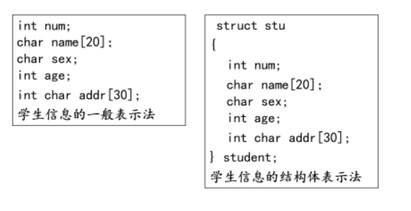
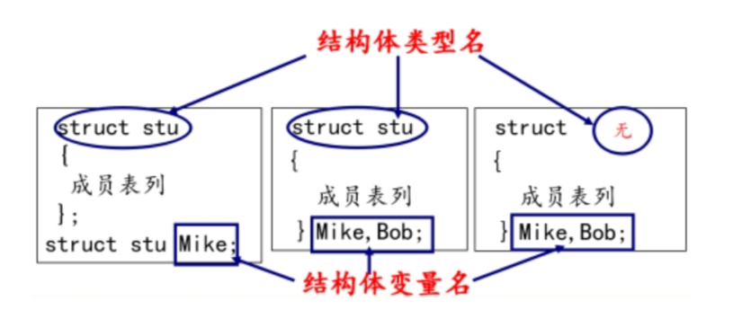
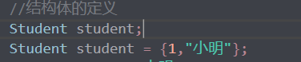
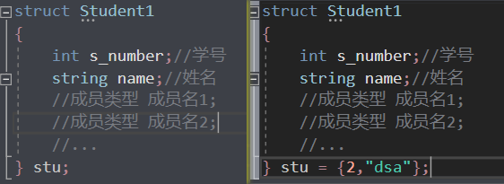
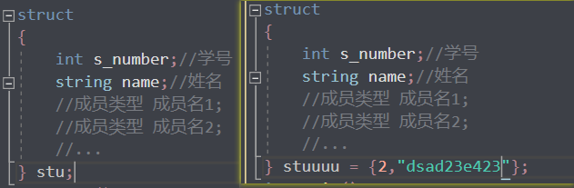
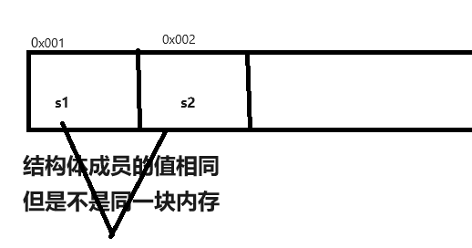

# 结构体

## 结构体的引入

数组：描述的是**一组具有相同类型数据的有序集合，用于处理大量相同类型的数据运算。**

有时我们需要将不同类型的数据组合成一个有机的整体

如：一个学生有学号/姓名/性别/年龄/地址等属性。显然单独定义以上变量比较繁琐，数据不便于管理。

Ｃ语言中给出了另一种构造数据类型——结构体。

 


## 结构体的定义和初始化

### 结构体的定义

定义一个我们想要的结构体

```c++
struct Student
{
	int s_number;//学号
	string name;//姓名
	//成员类型 成员名1;
	//成员类型 成员名2;
	//...
};
```

结构体类型是一种复合类型，说得更直白一些就是自定义类型，通过上面的语法将结构体类型定义出来之后，就可以基于这种类型定义变量了。

然后我们可以用自己定义的类型去声明对应类型的变量

#### 定义结构体变量的三种方式

+ 先声明结构体类型，再定义相应的变量
+ 在声明类型的同时定义变量
+ 直接定义结构体类型变量（无类型名）



#### 结构体类型和结构体变量关系

结构体类型和结构体变量关系

> **结构体类型**：**指定了一个结构体类型**，它相当于一个模型，但其中**并无具体数据**，系统对之也**不分配实际内存单元**。
>
> 结构体变量：系统根据结构体类型（内部成员状况）为之分配空间。

---

最常用的



定义结构的时候顺便声明结构体变量



匿名结构体用于结构体变量

 

 

```c
// 结构体类型的定义
struct Student
{
	char name[50];
	int age;
};
// 先定义类型，再定义变量（常用）
//Student s1 = { "tom", 18 };
struct Student s1 = { "tom", 18 };

// 定义类型同时定义变量
struct Student2
{
	char name[50];
	int age;
}s2 = { "lily", 22 };

struct
{
	char name[50];
	int age;
}s3 = { "jack", 25 };

```

> 三种方式定义了三个结构体变量s1、s2、s3，并通过{}对结构体变量中的各个成员依次进行了初始化。

### 定义结构体变量

定义结构体变量的语法为：

> 在C语言中，定义结构体变量时，`struct`关键字是可选的。
>
> ---
>
> 因为C语言的语法规定允许在**声明结构体类型时**使用`struct`关键字，但在**声明结构体变量时**可以选择省略`struct`关键字。

```c++
struct 结构体类型 结构体变量;
```

### 访问结构体成员

```c
结构体变量名.成员名
```

通过上面的方式我们就可以读出结构体变量中各个成员的值，或者给结构体变量的成员进行赋值操作。

```c
#include <stdio.h>
#include <string.h>

//结构体类型的定义
struct Student
{
    char name[50];
    int age;
};

int main()
{
    struct Student s1;
    // 如果是普通变量，通过点运算符操作结构体成员
    strcpy(s1.name, "luffy");
    s1.age = 18;
    printf("s1.name = %s, s1.age = %d\n", s1.name, s1.age);

    // 结构体变量赋值
    struct Student s2 = s1;
    printf("s2.name = %s, s2.age = %d\n", s2.name, s2.age);

    return 0;
}

```

**相同类型的两个结构体变量，可以相互赋值，**上面代码中把s1变量各个成员的值拷贝到了s2变量的各个成员对应的内存中。**s1和s2只是成员变量的值一样而已，它们对应的是不同的两块内存。**

 


###  结构体嵌套使用

开始套娃:!

结构体是一种复合类型，有时候需要通过一个结构体来描述相对复杂的数据，此时可能就需要让多个结构体之间进行嵌套。

```c
#include <stdio.h>
#include <string.h>

struct Person
{
    char name[20];
    char sex;    // M-Man, W-Woman
};

struct Student
{
    int id;
    struct Person info;
};

int main()
{
    struct Student s;
    s.id = 1;
    s.info.sex = 'W';
    strcpy(s.info.name, "Lucy");
    struct Student s1 = { 2, "Tom", 'M'};

    printf("s.id = %d, s.info.name=%s, s.info.sex=%c\n",
           s.id, s.info.name, s.info.sex);
    printf("s1.id = %d, s1.info.name=%s, s1.info.sex=%c\n",
           s1.id, s1.info.name, s1.info.sex);

    return 0;
}

```

> 每个Student变量中都包含一个Person变量，二者之间是父子节点的关系。


## 结构体数组和指针

### malloc()、realloc()和calloc()

> 在C语言中，`malloc()`、`realloc()`和`calloc()`是用于动态内存分配的三个函数，它们分别用于在程序运行时分配内存，具体功能如下：
>
> 1. **malloc()**：
>    - 函数原型：`void* malloc(size_t size);`
>    - 功能：动态分配指定大小的内存空间，并返回一个指向该内存空间的指针。
>    - 参数：`size`为要分配的内存空间的字节数。
>    - 返回值：分配成功时，返回指向分配内存的指针；分配失败时，返回`NULL`。
>
> 2. **realloc()**：
>    - 函数原型：`void* realloc(void* ptr, size_t size);`
>    - 功能：重新分配已分配内存的大小，可以增加或减少内存大小。
>    - 参数：`ptr`为指向已分配内存的指针，`size`为重新分配的内存大小。
>    - 返回值：重新分配成功时，返回指向重新分配内存的指针；重新分配失败时，返回`NULL`。
>
> 3. **calloc()**：
>    - 函数原型：`void* calloc(size_t num, size_t size);`
>    - 功能：分配指定数量和大小的内存空间，并将其初始化为零。
>    - 参数：`num`为要分配的元素数量，`size`为每个元素的大小。
>    - 返回值：分配成功时，返回指向分配内存的指针；分配失败时，返回`NULL`。
>
> 这些函数在使用完动态分配的内存后，应当使用`free()`函数释放内存，以避免内存泄漏问题。

### 结构体数组

如果想要记录某个学生的信息可以使用结构体，如果想要记录班级或者小组的学生信息就需要定义多个结构体变量，此时就可以使用结构体数组。

用结构体数组对小组中的学生成绩进行统计

```c
// 统计学生成绩
struct Student
{
    int num;
    char name[20];
    char sex;
    float score;
};

int main()
{
    //定义一个含有5个元素的结构体数组并将其初始化
    struct Student stu[5] = {
        { 101, "Li ping", 'M', 45 },
        { 102, "Zhang ping", 'M', 62.5 },
        { 103, "He fang", 'W', 93 },
        { 104, "Cheng ling", 'W', 87 },
        { 105, "Wang ming", 'M', 58 } 
    };

    int loser = 0;
    float avg, total = 0;
    for (int i = 0; i < 5; i++)
    {
        total += stu[i].score;    // 计算总分
        if (stu[i].score < 60)
        {
            loser += 1;           // 统计不及格人的分数
        }
    }

    printf("total = %.2f\n", total);// 打印总分数
    avg = total / 5;                // 计算平均分数
    printf("average = %.2f, loser count = %d\n", avg, loser);

    for (int i = 0; i < 5; i++)
    {
        printf("  name = %s, score = %.2f\n", stu[i].name, stu[i].score);
    }

    return 0;
}

```

> **结构体数组的使用方式和非结构体数组相同**，都是**通过[]对数组中的元素进行访问**，只不过结构体数组元素更加复杂，还需要使用该元素再通过.的方式对结构体成员进行数据的读或写操作。

### 结构体指针

####  普通结构体指针

如果定义了一个结构体变量，我们可以**再定义一个相同类型的指针，使用这个指针指向结构体变量的地址**，示例代码如下：

```c
#include<stdio.h>

//结构体类型的定义
struct Student
{
    char name[50];
    int age;
};

int main()
{
    struct Student s1 = { "lily", 18 };
    // 如果是指针变量，通过->操作结构体成员
    struct Student* p = &s1;
    printf("p->name = %s, p->age=%d\n", p->name, p->age);
    printf("(*p).name = %s, (*p).age=%d\n", (*p).name, (*p).age);

    return 0;
}

```

<font color="#87c">关于结构体内部成员的访问有两种情况：</font>

> **基于结构体变量进行访问，语法为：变量名.成员名**
> **基于结构体指针进行访问，语法为：指针名->成员名**


> 如果对结构体指针通过*进行了解引用（比如代码中的 *p），那么它们的组合将不再是指针，在访问结构体成员的时候需要通过.进行操作（比如：(*p).name）


#### 堆区结构体指针

**如果在函数体内部定义结构体变量，那么该变量对应的内存位于栈区**

**如果在函数体外部定义结构体变量，那么该变量对应的内存位于全局数据区**

除此之外我们还可以在**函数体内部使用malloc动态申请一块堆区内存**，并将这块内存的地址保存到一个**指针变量**中。

内存分区(#https://xu-runbo.gitee.io/xu-runbo/post/a77e947a.html#1-%E5%86%85%E5%AD%98%E5%88%86%E5%8C%BA%E6%A8%A1%E5%9E%8B)


如何给结构体动态申请一块堆内存：

```c
#include <stdio.h>
#include <string.h>
#include <stdlib.h>

//结构体类型的定义
struct Student
{
    char name[50];
    int age;
};

int main()
{
    struct Student* p;
    p = (struct Student*)malloc(sizeof(struct Student));
    // 如果是指针变量，通过->操作结构体成员
    strcpy(p->name, "Monkey·D·Luffy");
    p->age = 22;

    printf("p->name = %s, p->age = %d\n", p->name, p->age);
    printf("(*p).name = %s, (*p).age = %d\n", (*p).name, (*p).age);

    free(p);
    p = NULL;

    return 0;
}
```

在C语言中，通过malloc/calloc/realloc函数动态申请的堆内存是不会自动释放的，在使用完毕之后需要手动进行释放，**释放函数是free。**

free(对应的指针,或者开辟的空间)


#### 结构体嵌套指针

在定义结构体的时候，结构体成员可以是基础数据类型，可以是结构体类型，也可以是指针。

如果是指针，它自身占4字节或者8字节的存储空间并且指针指向的位置是随机的

在使用指针的时候需要让它指向一个正确的、合法的地址。

结构体嵌套指针示例代码：

```c
#include <stdio.h>
#include <string.h>
#include <stdlib.h>

//结构体类型的定义
struct Student
{
    char* name; // 一级指针
    int age;
};

int main()
{
    char* str = "Monkey·D·Luffy";
    
    struct Student* p = (struct Student*)malloc(sizeof(struct Student));
    
    
    p->name = (char*)malloc(strlen(str) + 1);
    
    strcpy(p->name, "Monkey·D·Luffy");
    
    p->age = 22;

    printf("p->name = %s, p->age = %d\n", p->name, p->age);
    printf("(*p).name = %s, (*p).age = %d\n", (*p).name, (*p).age);

    if (p->name != NULL)
    {
        free(p->name);
        p->name = NULL;
    }

    if (p != NULL)
    {
        free(p);
        p = NULL;
    }

    return 0;
}
```

> 在上面的程序中，一共手动申请了两块堆内存：
>
> **结构体指针 p，通过malloc操作，该指针指向的内存大小为4+4=8字节**
>
> + age 整形变量，4字节
> + name 整形指针，Win32平台4字节（Win64平台8字节），不能存储数据
>
> ---
>
> 结构体成员 p->name，如果想要通过指针来存储数据，那么指针必须要指向一块有效的存储空间，这块存储空间默认是没有的，所以**需要再通过malloc分配出这块堆内存，并把得到的地址保存到p->name指针中**。
> 所以**在释放内存的时候，需要对这两个指针依次进行判断，然后再调用free函数，手动的将堆内存还给操作系统。**
>
> 好的习惯
>
> ```c
> if (p != NULL)
> {
>     free(p);
>     p = NULL;
> }
> ```


## 结构体做函数参数

####  普通结构体变量

在定义函数的时候，可以**将形参指定为结构体类型**，示例代码如下：

```c
#include <stdio.h>
#include <string.h>

// 结构体类型的定义
struct Student
{
    char name[50];
    int age;
};

//函数参数为结构体普通变量
void initStudent(struct Student tmp)
{
    strcpy(tmp.name, "robin");
    tmp.age = 35;
    printf("tmp.name = %s, tmp.age = %d\n", tmp.name, tmp.age);
}

int main()
{
    struct Student s = { "Luffy", 20 };
    initStudent(s);
    printf("s.name = %s, s.age = %d\n", s.name, s.age);

    return 0;
}

```

```c
tmp.name = robin, tmp.age = 35
s.name = Luffy, s.age = 20
```

> 上面程序中定义了一个函数`initStudent(struct Student tmp)`
>
> 通过该函数来设置结构体变量中的初始值，但是通过输出的信息可以看出外部变量s中的值并没有被修改，原因是这样的：
>
> **结构体变量的传递方式是值传递**，**值传递过程中会发生数据的拷贝**，在 initStudent 函数内部修改是形参对应的内存中的值，**对实参变量的内存数据没有任何影响，想要解决这个问题需要将参数修改为结构体指针类型。**

#### 结构体指针变量

修改一下上面的代码，将参数的类型由结构体类型替换为结构体指针类型

```c
#include <stdio.h>
#include <string.h>

// 结构体类型的定义
struct Student
{
    char name[50];
    int age;
};

//函数参数为结构体普通变量
void initStudent(struct Student* tmp)
{
    strcpy(tmp->name, "robin");
    tmp->age = 35;
    printf("tmp.name = %s, tmp.age = %d\n", tmp->name, tmp->age);
}

int main()
{
    struct Student s = { "Luffy", 20 };
    printf("s.name = %s, s.age = %d\n", s.name, s.age);
    initStudent(&s);
    printf("s.name = %s, s.age = %d\n", s.name, s.age);

    return 0;
}

```

程序的输出

```c
s.name = Luffy, s.age = 20
tmp.name = robin, tmp.age = 35
s.name = robin, s.age = 35
```

可以看到，调用了initStudent函数之后，实参s中的数据确实被修改了，因为函数参数传递的是地址，在函数体内部形参指针指向的内存和实参变量对应的内存是同一块，通过这种方式就可以在函数体内部来修改函数体外部的变量数据了。

如果函数的**形参是指针类型**，我们还可以使用const关键字对其进行修饰，这样就可以限制使用者只能通过形参读

读内存数据，而不能修改内存数据。

```c
// 结构体类型的定义
struct Student
{
    char name[50];
    int age;
};

void func1(struct Student* const p)
{
    p->age = 10; // ok
    p = NULL;    // error
}

void func2(const struct Student* p)
{
    p = NULL;    // ok
    p->age = 10; // error
}

void func3(const struct Student* const p)
{
    p = NULL;    // error
    p->age = 10; // error
}


```

> 在上面的示例代码中一共定义了三个函数，每个函数的参数类型都不同：
>
> + ` void func1(struct Student* const p)`
>
> + const 在 * 号右侧，修饰指针
> + 指针指向的地址不可变，指向的地址中的值可变
> + `void func2(const struct Student* p)`
> + const 在 * 号左侧，修饰指针指向的内存地址中的值
> + 指针指向的地址可变，指向的地址中的值不可变
> + `void func3(const struct Student* const p)`
> + const 在 * 号左右两侧，修饰指针和指针指向的内存地址中的值
> + 指针指向的地址不可变，指向的地址中的值也不可变

#### 结构体数组

结构体数组名也可以作为函数的形参，示例代码如下：

```c
#include <stdio.h>
#include <string.h>

//结构体类型的定义
struct Student
{
    char name[50];
    int age;
};

// void initStudent(struct Student tmp[100], int n)
// void initStudent(struct Student* tmp, int n)
void initStudent(struct Student tmp[], int n)
{
    int i = 0;
    for (i = 0; i < n; i++)
    {
        sprintf(tmp->name, "name-%d", i);
        tmp->age = 20 + i;
        tmp++;
    }
}

int main()
{
    struct Student s[3] = { 0 };
    int i = 0;
    int size = sizeof(s) / sizeof(s[0]);
    initStudent(s, size); //数组名传递

    for (i = 0; i < size; i++)
    {
        printf("%s, %d\n", s[i].name, s[i].age);
    }

    return 0;
}


```

> 在上面的代码中将initStudent函数的形参指定为了结构体数组类型，其实它有两种书写形式：
>
> `void initStudent(struct Student tmp[], int n)`
> 不指定数组的容量，通过实参进行推导
> `void initStudent(struct Student tmp[100], int n)`
> 指定实参的容量，数组大小需要和实参数组的大小一致

不论将数组参数指定为何种形式，**最终都将退化为指针**，也就是这种形式：

```c
void initStudent(struct Student* tmp, int n);
```


<font color="red">因此，在函数体内部是不能通过sizeof运算符计算出指针指向的内存所占用的内存地址的大小的，如果需要在函数体内部使用这个值，则需要额外添加参数来进行数据的传递，这就是参数n的由来。</font>