# SSM框架—容器，bean，依赖注入

> 先应用后理解的模式


## 为什么要学Spring？

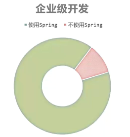 

> 框架整合：高效整合其他技术，提高企业级应用开发与运行效率
>
> 简化开发：降低企业级开发的复杂性


## 学习哪些内容

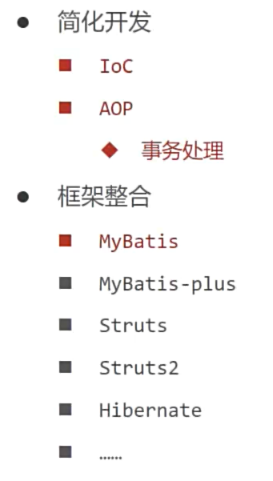 


## 怎么学好？

+ 学习Spring框架设计思想
+ 学习基础操作思考操作与思想间的联系
+ 学习案例，熟练应用操作的同时，体会思想


## 认识一下Spring

[spring.io](https://spring.io/)

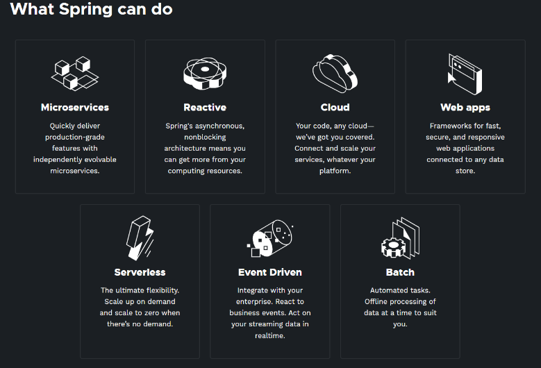

用大家庭的不同部分来完成一个项目 

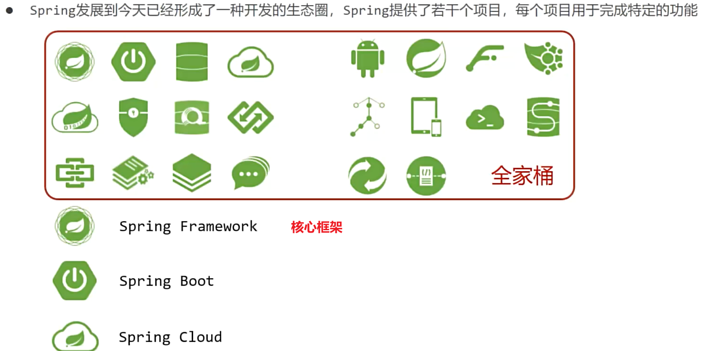


### 发展史

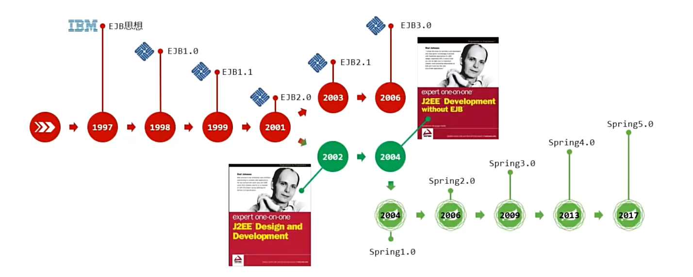 


## ==Spring Framework==

### Spring系统架构

> **SpringFramework是Spring生态圈中最基础的项目，是其他项目的根基**

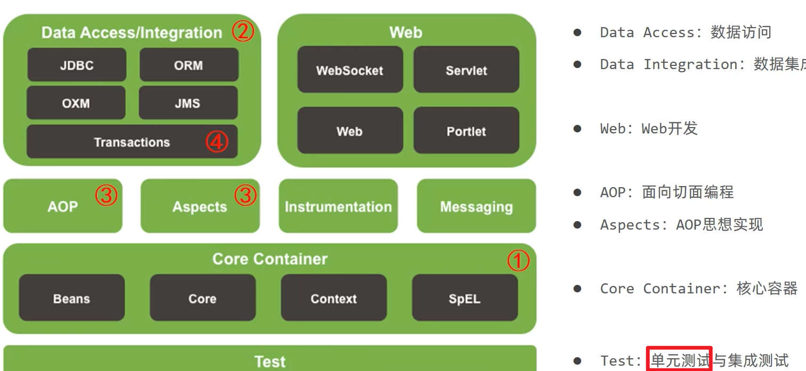  


### Spring学习路线

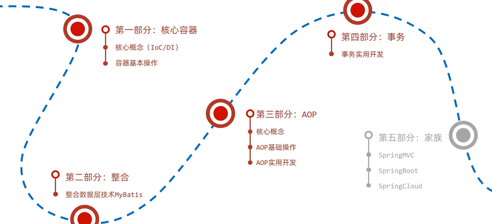 


### 核心概念

#### IOC，IOC容器。Bean

**我们追求低耦合的代码**

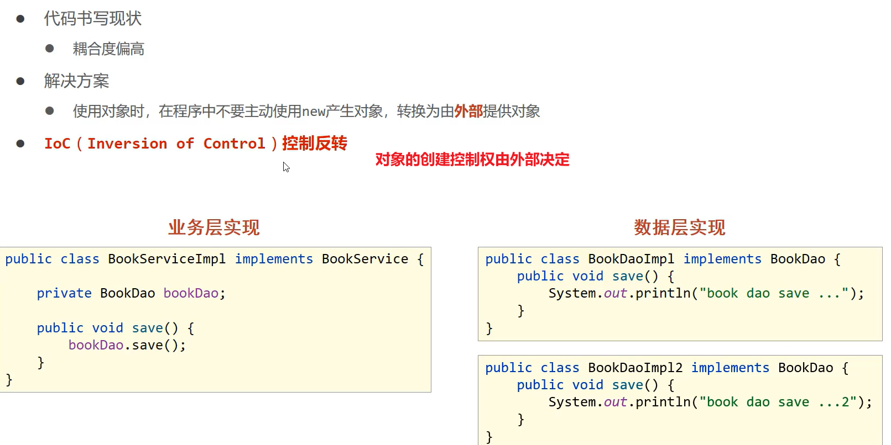 

> **由主动new产生对象转换为由ioc容器提供对象**
>
> IOc要管理对象的创建和初始化的过程

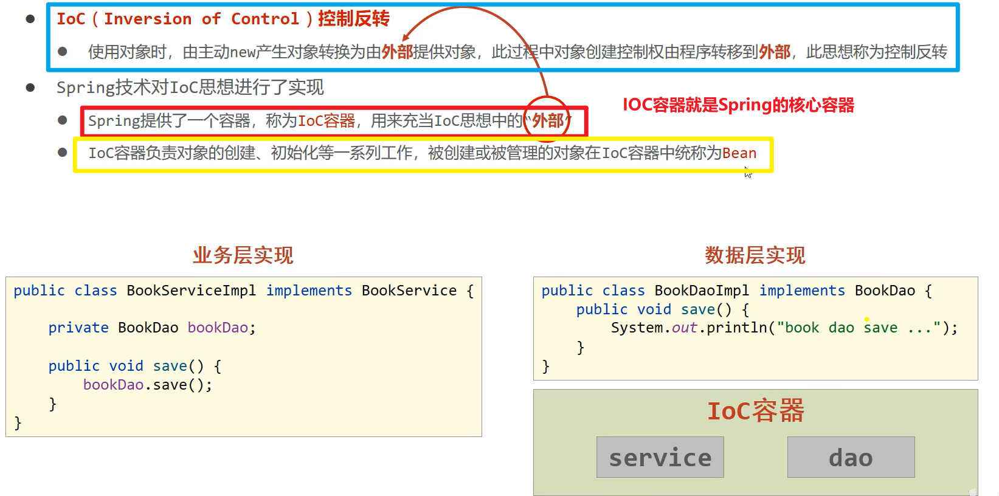 


#### DI依赖注入

> 在容器中建立bean与bean之间的依赖关系的整个过程，称为依赖注入

容器内的两个bean存在依赖关系

那么ioc就会把他俩绑定在一起

> 例如service依赖dao运行 
>
>   


#### 目的：充分解耦

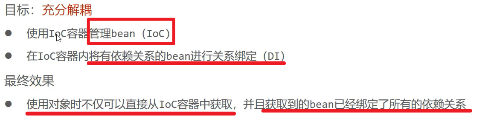 


### IoC入门案例

> 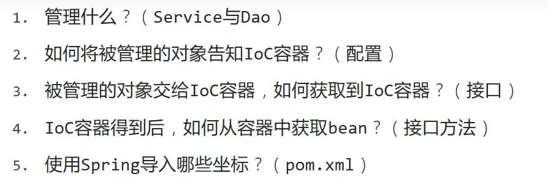 

1. 导入maven坐标

   ```xml
       <dependencies>
           <dependency>
               <groupId>org.springframework</groupId>
               <artifactId>spring-context</artifactId>
               <version>5.2.10.RELEASE</version>
           </dependency>
       </dependencies>
   ```

2. 新建Spring配置文件`ApplicationContext.xml`

    

3. 编辑`ApplicationContext.xml`

   ```xml
   <?xml version="1.0" encoding="UTF-8"?>
   <beans xmlns="http://www.springframework.org/schema/beans"
          xmlns:xsi="http://www.w3.org/2001/XMLSchema-instance"
          xsi:schemaLocation="http://www.springframework.org/schema/beans http://www.springframework.org/schema/beans/spring-beans.xsd">
   
       <bean id="bookDao" class="com.hello.dao.impl.BookDaoimpl"/>
   
       <!--2.配置bean-->
       <!--bean标签标示配置bean
       id属性标示给bean起名字,get的时候要用
       cLass属性表示给bean定义类型-->
       <bean id="bookService" class="com.hello.service.impl.BookServiceimpl"/>
   
   
   
   </beans>
   ```

4. 测试代码

   ```java
   package com.hello;
   
   import com.hello.dao.BookDao;
   import com.hello.service.BookService;
   import com.hello.service.impl.BookServiceimpl;
   import org.springframework.context.ApplicationContext;
   import org.springframework.context.support.ClassPathXmlApplicationContext;
   
   public class App1 {
       public static void main(String[] args) {
           ApplicationContext applicationContext=new ClassPathXmlApplicationContext("ApplicationContext.xml");
   
           BookService bookService= (BookService) applicationContext.getBean("bookService");
           bookService.save();
       }
   }
   ```

5. 案例结构

   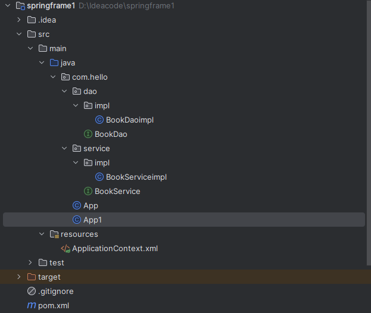

   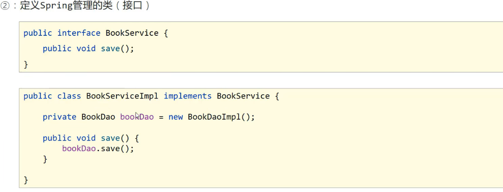

   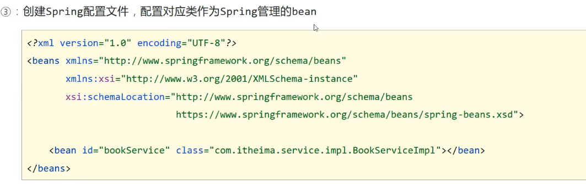

   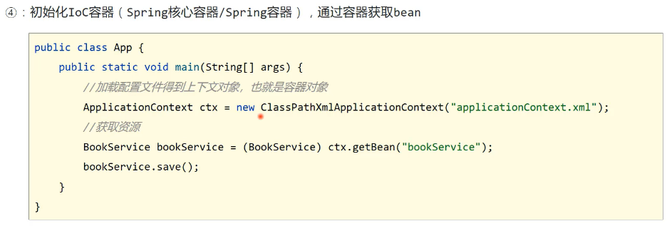   

但是现在还是new在床架对象的

### DI入门案例

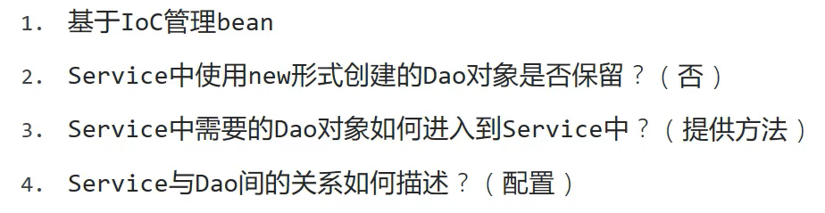 

删除业务层中使用new的方式创建的dao对象

> 原来是service里面有一个bookdao

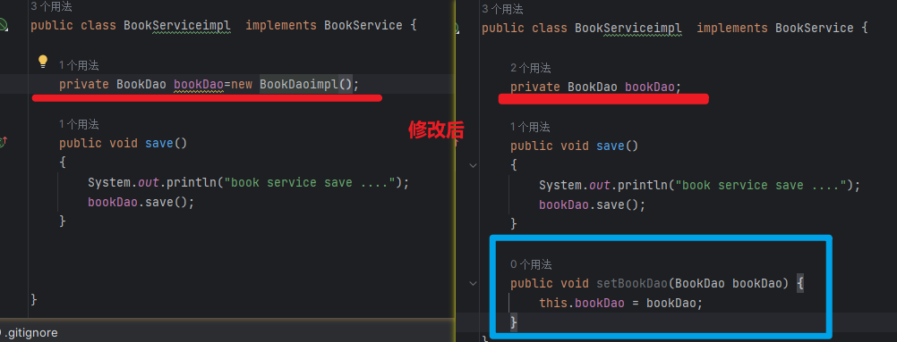

但是IOC是如何知道你俩有关系呢？

配置`ApplicationContext.xml`

```xml
<?xml version="1.0" encoding="UTF-8"?>
<beans xmlns="http://www.springframework.org/schema/beans"
       xmlns:xsi="http://www.w3.org/2001/XMLSchema-instance"
       xsi:schemaLocation="http://www.springframework.org/schema/beans http://www.springframework.org/schema/beans/spring-beans.xsd">

    <bean id="bookDao" class="com.hello.dao.impl.BookDaoimpl"/>

    <!--2.配置bean-->
    <!--bean标签标示配置bean
    id属性标示给bean起名字,get的时候要用
    cLass属性表示给bean定义类型-->

<!--    因为是service包含(依赖)bookdao
那么bookservice也同样-->
    <bean id="bookService" class="com.hello.service.impl.BookServiceimpl">

        <property name="bookDao" ref="bookDao"/>
<!--        property表示配置当前bean的属性-->
<!--        name表示配置的是哪一个具体的属性？-->
<!--        ref表示参照哪一个bean？-->
    </bean>


</beans>
```

#### 步骤

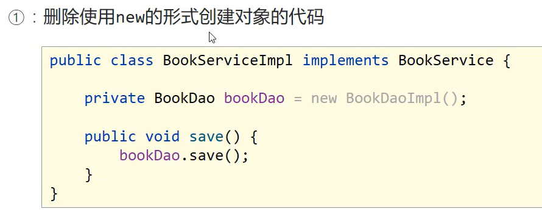 

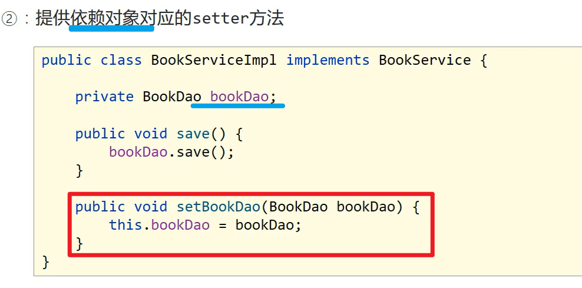 

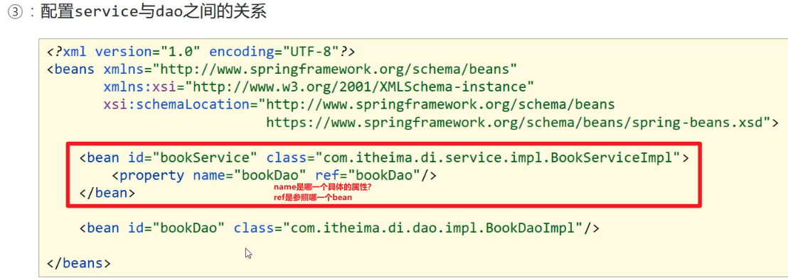 


### bean配置

#### bean基础配置

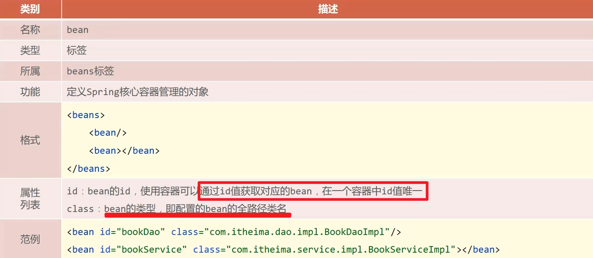 

#### bean别名配置

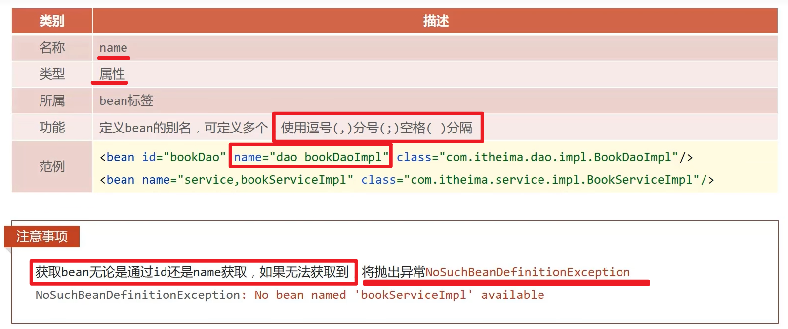 

name可以指定更多的名称,多个别名用用逗号，分号，空格分隔

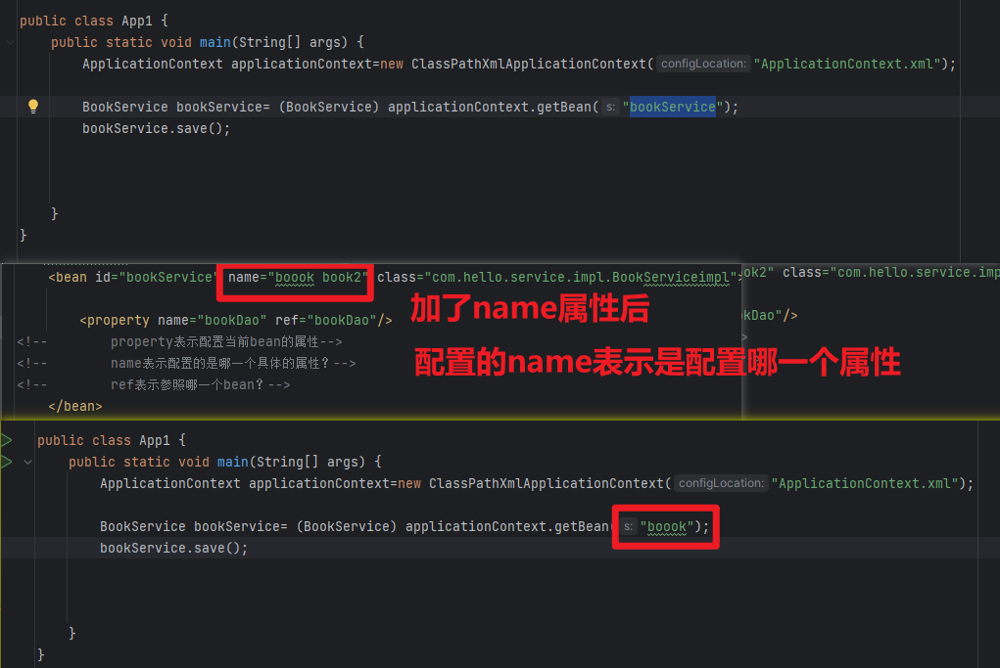 

#### bean作用范围配置

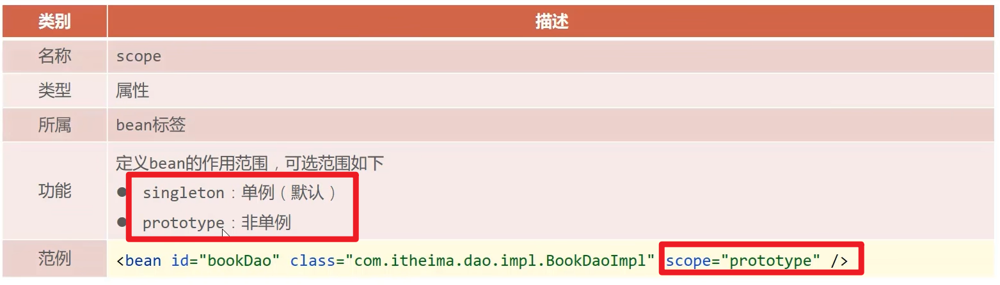 

默认情况下

```java
package com.hello;

import com.hello.dao.BookDao;
import com.hello.service.BookService;
import com.hello.service.impl.BookServiceimpl;
import org.springframework.context.ApplicationContext;
import org.springframework.context.support.ClassPathXmlApplicationContext;

public class App1 {
    public static void main(String[] args) {
        ApplicationContext applicationContext=new ClassPathXmlApplicationContext("ApplicationContext.xml");

        BookService bookService= (BookService) applicationContext.getBean("boook");
        System.out.println(bookService);
        BookService bookService1= (BookService) applicationContext.getBean("boook");
        System.out.println(bookService1);
//        bookService.save();


    }
}

```

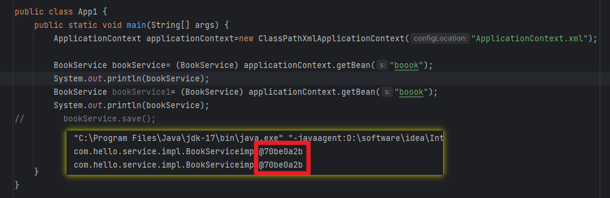

说明ioc默认给我们创建的bean是一个单例的

引出bean作用范围配置

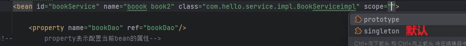 

当修改为

```xml
    <bean id="bookService" name="boook book2" class="com.hello.service.impl.BookServiceimpl" scope="prototype">

        <property name="bookDao" ref="bookDao"/>
<!--        property表示配置当前bean的属性-->
<!--        name表示配置的是哪一个具体的属性？-->
<!--        ref表示参照哪一个bean？-->
    </bean>
```

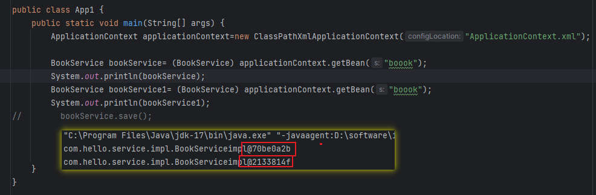 

> 为什么bean默认为单例？
>
> 减少内存压力，管理可以复用的对象，效率更高

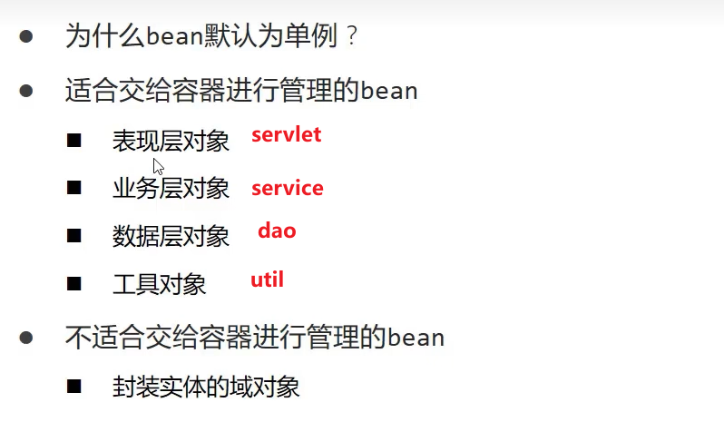 

### bean实例化&生命周期

#### 实例化bean的三种方式

##### 1.构造方法(常用)

###### ApplicationContext.xml

```java
    <bean id="BookDao" class="com.hello.dao.impl.BookDaoimpl"/>
```


###### BookDao.java接口

```java
package com.hello.dao;

public interface BookDao {
    void save();
}

```

###### BookDaoimpl.java

```java
package com.hello.dao.impl;

import com.hello.dao.BookDao;

public class BookDaoimpl implements BookDao {


    public BookDaoimpl() {
        System.out.println("构造方法被调用了");
    }

    public void save()
    {
        System.out.println("book dao save");
    }
}

```


###### 测试方法

```java
package com.hello;

import com.hello.dao.BookDao;
import com.hello.service.BookService;
import com.hello.service.impl.BookServiceimpl;
import org.springframework.context.ApplicationContext;
import org.springframework.context.support.ClassPathXmlApplicationContext;

public class App1 {
    public static void main(String[] args) {
        ApplicationContext applicationContext=new ClassPathXmlApplicationContext("ApplicationContext.xml");

       BookDao bookService= (BookDao) applicationContext.getBean("BookDao");


       bookService.save();


    }
}

```

执行效果

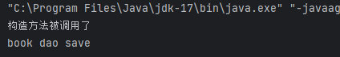 

###### 总结

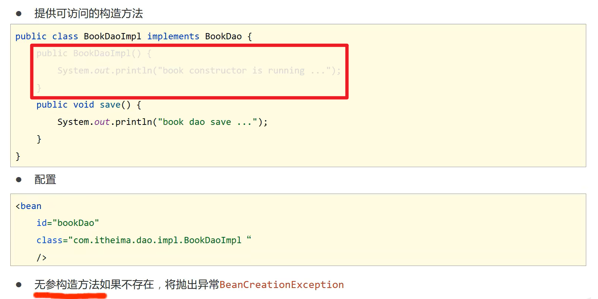 

> 1. bean本质上是对象，创建方法是构造函数完成的
> 2. 而且无论构造函数是**私有还是公共**，都可以被利用
> 3.  异常的看法，最后一个基本可以找到问题了
> 4. 无参构造方法不存在就会报错（默认提供的构造函数也是ok的）

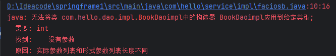 

##### 2.静态工厂(了解)

######  OrderDao.java接口

```java
package com.hello.dao;

public interface OrderDao {
    void save();
}

```


###### OrderDaoimpl.java实现

```java
package com.hello.dao.impl;

import com.hello.dao.OrderDao;

public class OrderDaoimpl implements OrderDao {
    public OrderDaoimpl() {
    }

    @Override
    public void save() {
        System.out.println("order. save....");
    }
}

```


###### OrderDaoFactory.java静态工厂

```java
package com.hello.factory;

import com.hello.dao.OrderDao;
import com.hello.dao.impl.OrderDaoimpl;

public class OrderDaoFactory {
    public static OrderDao getOrder()
    {
        return new OrderDaoimpl();
    }
}

```

###### 早些年就这样使用

测试

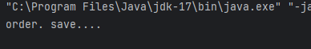 

```java
package com.hello;

import com.hello.dao.OrderDao;
import com.hello.factory.OrderDaoFactory;

public class App2 {
    public static void main(String[] args) {

        OrderDao orderDao= OrderDaoFactory.getOrder();

        orderDao.save();
    }
}

```

###### 使用静态工厂实例化bean

###### ApplicationContext.xml

```java

    <bean id="OrderDao" class="com.hello.factory.OrderDaoFactory"></bean>
<!--    现在得到的是OrderDaoFactory类，因为配的是什么返回的就是什么类的产物-->
    <bean id="OrderDao" class="com.hello.factory.OrderDaoFactory" factory-method="getOrder"></bean>
<!--    这才是得到是OrderDao的实现类-->
```

###### 测试代码

```java
package com.hello;

import com.hello.dao.BookDao;
import com.hello.dao.OrderDao;
import com.hello.factory.OrderDaoFactory;
import org.springframework.context.ApplicationContext;
import org.springframework.context.support.ClassPathXmlApplicationContext;

public class App2 {
    public static void main(String[] args) {

//        OrderDao orderDao= OrderDaoFactory.getOrder();
//
//        orderDao.save();
        //早些年。。。。。。。。。。


        //静态工厂的实现，》，，。《的，，
        ApplicationContext applicationContext=new ClassPathXmlApplicationContext("ApplicationContext.xml");

        OrderDao orderDao1= (OrderDao) applicationContext.getBean("OrderDao");


        orderDao1.save();
    }
}

```

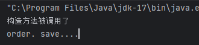


###### 总结 

兼容早期的老东西，注意静态

class配置的是工厂的类名，

然后还要配置工厂中真正造类的方法

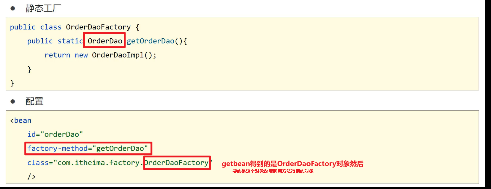 


##### 3.非静态工厂(了解)

###### UserDao.java接口

```java
package com.hello.dao;

public interface UserrDao {
    void save();
}

```


###### UserDaoimpl.java实现类

```java
package com.hello.dao.impl;

import com.hello.dao.OrderDao;
import com.hello.dao.UserrDao;

public class UserDaoimpl implements UserrDao {
    public UserDaoimpl() {
    }

    @Override
    public void save() {
        System.out.println("userdao save....");
    }
}

```


###### UserDaoFactory.java非静态工厂

```java
package com.hello.factory;

import com.hello.dao.OrderDao;
import com.hello.dao.UserrDao;
import com.hello.dao.impl.OrderDaoimpl;
import com.hello.dao.impl.UserDaoimpl;

public class UserDaoFactory {
    public  UserrDao getUserDao()
    {
        return new UserDaoimpl();
    }
}

```


###### 原始测试类

多了一行，需要创一个工厂对象，，

```java
package com.hello;

import com.hello.dao.OrderDao;
import com.hello.dao.UserrDao;
import com.hello.factory.UserDaoFactory;
import org.springframework.context.ApplicationContext;
import org.springframework.context.support.ClassPathXmlApplicationContext;

public class App3 {
    public static void main(String[] args) {


        UserDaoFactory userDaoFactory=new UserDaoFactory();


        UserrDao userrDao=userDaoFactory.getUserDao();

        userrDao.save();


    }
}

```

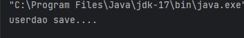 

###### ApplicationContext.xml

```java
    <bean id="userDaoFactory" class="com.hello.factory.UserDaoFactory"></bean>
<!--    先造工厂bean-->
    <bean factory-bean="userDaoFactory" factory-method="getUserDao" id="userrDao"></bean>
<!--    非静态工厂得到USerDao-->
```


###### spring管理bean测试

```java
package com.hello;

import com.hello.dao.UserDao;
import org.springframework.context.ApplicationContext;
import org.springframework.context.support.ClassPathXmlApplicationContext;

public class App3 {
    public static void main(String[] args) {


        ApplicationContext applicationContext=new ClassPathXmlApplicationContext("ApplicationContext.xml");

       UserDao userDao= (UserDao) applicationContext.getBean("UserDao");

       userDao.save();
    }
}
```

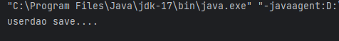 

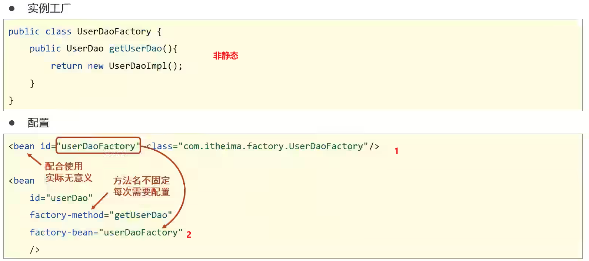

###### ------FactoryBean-----------(实用)

工厂方法名不固定，固定get方法

###### UserDaoFactoryBean.java

```java
package com.hello.factory;

import com.hello.dao.UserDao;
import com.hello.dao.impl.UserDaoimpl;
import org.springframework.beans.factory.FactoryBean;

public class UserDaoFactoryBean implements FactoryBean<UserDao> {
    @Override
    public UserDao getObject() throws Exception {
        return new UserDaoimpl();
    }

    @Override
    public Class<?> getObjectType() {
        return UserDao.class;
    }
}
```


###### ApplicationContext.xml

```java
    <bean class="com.hello.factory.UserDaoFactoryBean" id="UserDao"></bean>
```

   

###### 测试

```java
package com.hello;

import com.hello.dao.UserDao;
import org.springframework.context.ApplicationContext;
import org.springframework.context.support.ClassPathXmlApplicationContext;

public class App4 {
    public static void main(String[] args) {


        ApplicationContext applicationContext=new ClassPathXmlApplicationContext("ApplicationContext.xml");

       UserDao userDao= (UserDao) applicationContext.getBean("UserDao");

       userDao.save();
    }
}
```

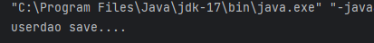 


###### 造的对象是单例的吗？？？

测试类

```java
package com.hello;

import com.hello.dao.UserDao;
import org.springframework.context.ApplicationContext;
import org.springframework.context.support.ClassPathXmlApplicationContext;

public class App4 {
    public static void main(String[] args) {


        ApplicationContext applicationContext=new ClassPathXmlApplicationContext("ApplicationContext.xml");

       UserDao userDao1= (UserDao) applicationContext.getBean("UserDao");

        UserDao userDao2= (UserDao) applicationContext.getBean("UserDao");

        System.out.println(userDao1);
        System.out.println(userDao2);
    }
}
```

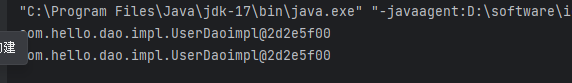 

默认是单例 的 的哦 

UserDaoFactoryBean.java

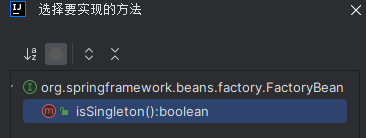 

```java
package com.hello.factory;

import com.hello.dao.UserDao;
import com.hello.dao.impl.UserDaoimpl;
import org.springframework.beans.factory.FactoryBean;

public class UserDaoFactoryBean implements FactoryBean<UserDao> {
    @Override
    public UserDao getObject() throws Exception {
        return new UserDaoimpl();
    }

    @Override
    public boolean isSingleton() {
        return false;
        //默认是true代表单例
        //修为false就是非单例了
    }

    @Override
    public Class<?> getObjectType() {
        return UserDao.class;
    }
}

```

 修改为false后测试

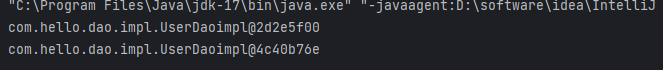 

一般都是单例。所以只是了解一下，。。，，。


##### 三种方法小结

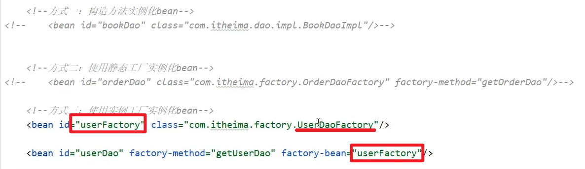

FactoryBean。。。。

```xml
    <bean class="com.hello.factory.UserDaoFactoryBean" id="UserDao"></bean>
```

有一点就是会执行所有配置bean的构造方法。，。。。。

ALT+7查看类的所有方法

#### Bean的生命周期


如何配置bean的生命周期？

##### 自己写函数并配置

###### Userdaoimpl.java实现

```java
package com.hello.dao.impl;

import com.hello.dao.UserDao;

public class UserDaoimpl implements UserDao {
    public UserDaoimpl() {
    }

    @Override
    public void save() {
        System.out.println("userdao save....");
    }
    
    public void init()
    {
        System.out.println("初始化，。。，");
    }
    
    public void destory()
    {
        System.out.println("销毁，的，，撒..");
    }
}
```

###### UserDao.java接口

```java
package com.hello.dao;

public interface BookDao {
    void save();
}
```


###### ApplicationContext.xml

```xml
    <bean class="com.hello.dao.impl.UserDaoimpl" id="UserDao" init-method="init" destroy-method="destory"></bean>
```


###### 测试代码

```java
package com.hello;

import com.hello.dao.UserDao;
import org.springframework.context.ApplicationContext;
import org.springframework.context.support.ClassPathXmlApplicationContext;

public class App5 {
    public static void main(String[] args) {


        ApplicationContext applicationContext=new ClassPathXmlApplicationContext("ApplicationContext.xml");

       UserDao userDao= (UserDao) applicationContext.getBean("UserDao");

       userDao.save();

    }
}

```


###### 测试效果

 


###### 测试destory方法

CTRL+H查看结构

ALT+7查看方法

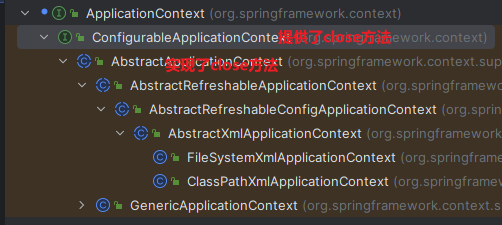 

```java
package com.hello;

import com.hello.dao.UserDao;
import org.springframework.context.ApplicationContext;
import org.springframework.context.support.ClassPathXmlApplicationContext;

public class App5 {
    public static void main(String[] args) {


//        ApplicationContext applicationContext=new ClassPathXmlApplicationContext("ApplicationContext.xml");
        //这里面没有close方法

        ClassPathXmlApplicationContext applicationContext=new ClassPathXmlApplicationContext("ApplicationContext.xml");

       UserDao userDao= (UserDao) applicationContext.getBean("UserDao");

       userDao.save();

        applicationContext.close();

    }
}

```

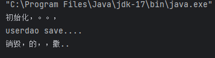 

> **关闭容器**才能看到destory方法，。，，但是**过于暴力**
>
> ---
>
> **设置关闭钩子**
>
> `类似于锤石仍灯笼，灯笼在地上得人点了才收回去`
>
> 都可以实现，。，
>
> ```java
> //        applicationContext.close();
>         applicationContext.registerShutdownHook();
> ```


##### 因为自己写的方法，Spring帮你写好了接口，自己实现吧，。，

`implements InitializingBean, DisposableBean `

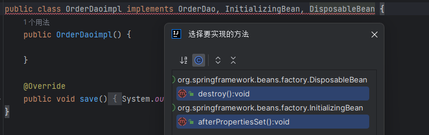 


###### OrderDaoimpl.java

```java
package com.hello.dao.impl;

import com.hello.dao.OrderDao;
import org.springframework.beans.factory.DisposableBean;
import org.springframework.beans.factory.InitializingBean;

public class OrderDaoimpl implements OrderDao, InitializingBean, DisposableBean {
    public OrderDaoimpl() {

    }

    @Override
    public void save() {
        System.out.println("order. save....");
    }

    @Override
    public void destroy() throws Exception {
        System.out.println("destory。。。。。");

    }

    @Override
    public void afterPropertiesSet() throws Exception {
        System.out.println("初始化？？？》》。。。。。");
    }
}
```

###### OrderDao.java

```java
package com.hello.dao;

public interface OrderDao {
    void save();
}
```


###### 测试方法

```java
package com.hello;

import com.hello.dao.OrderDao;
import org.springframework.context.ApplicationContext;
import org.springframework.context.support.ClassPathXmlApplicationContext;

public class App6 {
    public static void main(String[] args) {


        ClassPathXmlApplicationContext applicationContext=new ClassPathXmlApplicationContext("ApplicationContext.xml");

        OrderDao orderDao1= (OrderDao) applicationContext.getBean("OrderDao");


        orderDao1.save();

        applicationContext.registerShutdownHook();
    }
}

```

###### 运行效果

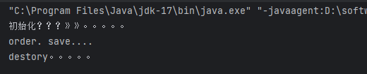 


----

##### 用DI实现

###### 	ApplicationContext.xml

```xml
    <bean id="bookService" name="boook book2" class="com.hello.service.impl.BookServiceimpl">

        <property name="bookDao" ref="BookDao"/>
<!--        property表示配置当前bean的属性-->
<!--        name表示配置的是哪一个具体的属性？-->
<!--        ref表示参照哪一个bean？-->
    </bean>


    <bean id="BookDao" class="com.hello.dao.impl.BookDaoimpl" init-method="init" destroy-method="destory"/>
```


###### BookDaoimpl.java

```java
package com.hello.dao.impl;

import com.hello.dao.BookDao;

public class BookDaoimpl implements BookDao{
    public void destory(){
        System.out.println("bookdao销毁");
    }

    public void init(){
        System.out.println("bookdao初始化");
    }

    private BookDaoimpl() {
        System.out.println("bookdao构造方法被调用了");
    }

    public void save()
    {
        System.out.println("book dao save");
    }
}
```


###### BookDao.java

```java
package com.hello.dao;

public interface BookDao {
    void save();
}
```


###### bookservice.java

```java
package com.hello.service;

public interface BookService {
    void save();
}
```

###### BookServiceimpl.java

```java
package com.hello.service.impl;

import com.hello.dao.BookDao;
import com.hello.dao.impl.BookDaoimpl;
import com.hello.service.BookService;
import org.springframework.beans.factory.DisposableBean;
import org.springframework.beans.factory.InitializingBean;

public class BookServiceimpl  implements BookService, InitializingBean, DisposableBean {
    @Override
    public void destroy() throws Exception {
        System.out.println("service销毁");
    }

    @Override
    public void afterPropertiesSet() throws Exception {
        System.out.println("service初始化");
    }

    private BookDao bookDao;

    public void save()
    {
        System.out.println("book service save ....");
        bookDao.save();
    }

    public void setBookDao(BookDao bookDao) {
        this.bookDao = bookDao;
    }
}
```

###### 测试代码

```java
package com.hello;

import com.hello.dao.BookDao;
import com.hello.service.BookService;
import com.hello.service.impl.BookServiceimpl;
import org.springframework.context.ApplicationContext;
import org.springframework.context.support.ClassPathXmlApplicationContext;

public class App {
    public static void main(String[] args) {

        ClassPathXmlApplicationContext applicationContext=new ClassPathXmlApplicationContext("ApplicationContext.xml");

        BookDao bookDao= (BookDao) applicationContext.getBean("BookDao");

        bookDao.save();

        applicationContext.registerShutdownHook();
    }
}
```

效果

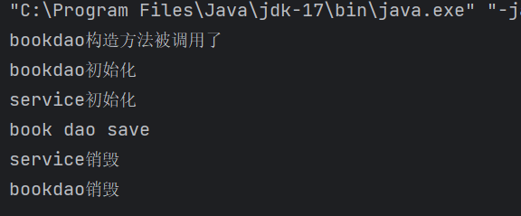 

在BookServiceimpl的set方法里面加一个。效果为

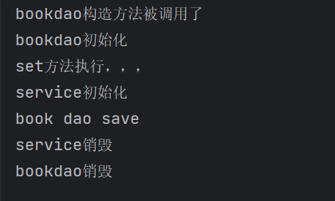 

再给Service也添加构造函数

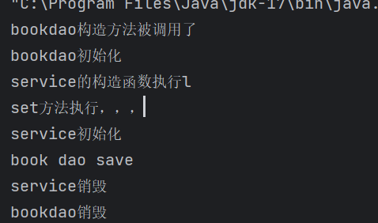 

##### 总结

> 1. 首先，Spring 容器会实例化并构造 `DAO` 对象（比如 `BookDAO`）。
> 2. 接下来，Spring 容器会实例化并构造 `Service` 对象。
> 3. 在 `Service` 对象被构造后，Spring 容器会执行依赖注入，这通常是通过调用相应的 Setter 方法来完成的。
> 4. 然后，Spring 容器会执行 `DAO` 对象和 `Service` 对象的初始化操作。这可能包括一些配置、初始化连接池、准备数据库等操作。
> 5. 一旦所有对象都被初始化完成，业务层的方法（例如 `save`）就可以被调用了。
> 6. 最后，当 Spring 容器关闭时，它会销毁所有被管理的 Bean。通常情况下，会执行一些清理工作，例如关闭数据库连接等。
>
> 这样的顺序确保了对象的依赖关系被正确初始化，并在需要时进行注入。

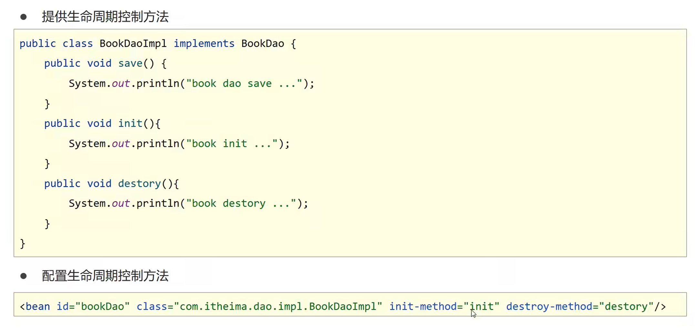 

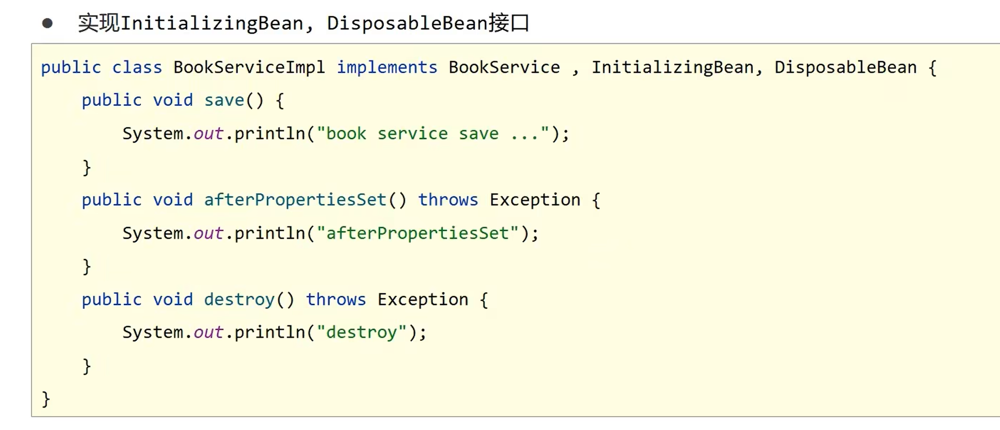

所以前者更实用。。。

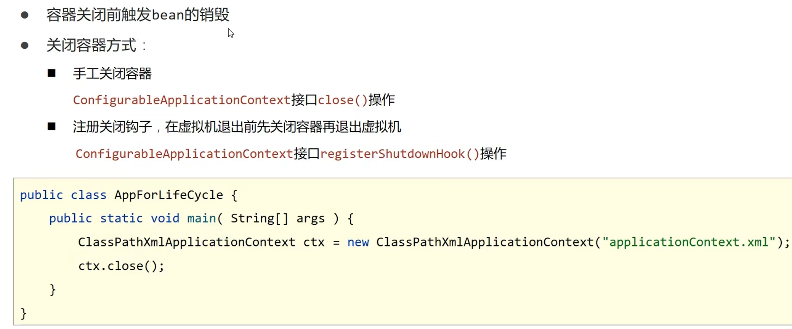 

## 依赖注入


### 思考

普通方法（set方法）

构造方法

> 依赖注入描述了在容器中建立bean与bean之间依赖关系的过程，如果bean运行需要的是数字或字符串呢？
>
> 1. 简单类型
> 2. 引用类型(DAO类型)，可以多个

配置多个引用类型的时候

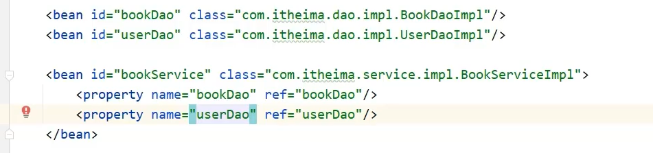 

### 普通注入（setter注入）

#### setter做引用类型的注入

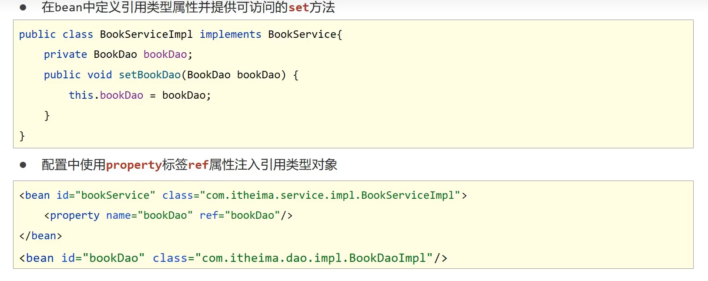 

多个注入的时候

##### ApplicationContext.xml

```xml
    <bean id="BookDao" class="com.hello.dao.impl.BookDaoimpl" init-method="init" destroy-method="destory"/>
    <bean id="UserDao" class="com.hello.dao.impl.UserDaoimpl"></bean>
<bean id="bookService" name="boook book2" class="com.hello.service.impl.BookServiceimpl">

    <property name="bookDao" ref="BookDao"/>
    <property name="userDao" ref="UserDao"/>

</bean>
```

##### UserDaoimpl.java

```java
package com.hello.dao.impl;

import com.hello.dao.UserDao;

public class UserDaoimpl implements UserDao {
    public UserDaoimpl() {
    }

    @Override
    public void save() {
        System.out.println("userdao save....");
    }

    public void init()
    {
        System.out.println("初始化，。。，");
    }

    public void destory()
    {
        System.out.println("销毁，的，，撒..");
    }
}
```

##### BookDaoimpl.java

```java
package com.hello.dao.impl;

import com.hello.dao.BookDao;

public class BookDaoimpl implements BookDao{
    public void destory(){
        System.out.println("bookdao销毁");
    }

    public void init(){
        System.out.println("bookdao初始化");
    }

    private BookDaoimpl() {
        System.out.println("bookdao构造方法被调用了");
    }

    public void save()
    {
        System.out.println("book dao save");
    }
}
```

##### BookService.java

```java
package com.hello.service;

public interface BookService {
    void save();
}
```

##### BookServiceimpl.java

```java
package com.hello.service.impl;

import com.hello.dao.BookDao;
import com.hello.dao.UserDao;
import com.hello.dao.impl.UserDaoimpl;
import com.hello.service.BookService;
import org.springframework.beans.factory.DisposableBean;
import org.springframework.beans.factory.InitializingBean;

public class BookServiceimpl  implements BookService, InitializingBean, DisposableBean {
    @Override
    public void destroy() throws Exception {
        System.out.println("service销毁");
    }

    @Override
    public void afterPropertiesSet() throws Exception {
        System.out.println("service初始化");
    }

    private BookDao bookDao;

    private UserDao userDao;

    public BookServiceimpl() {
        System.out.println("service的构造函数执行l");
    }

    public void save()
    {
        System.out.println("servcice执行.----------");
        bookDao.save();
        userDao.save();
    }

    public void setBookDao(BookDao bookDao) {

        System.out.println("set方法执行，，，");
        this.bookDao = bookDao;
    }

    public void setUserDao(UserDaoimpl userDao) {
        this.userDao = userDao;
    }
}
```

##### 测试代码

```java
package com.hello;

import com.hello.dao.BookDao;
import com.hello.service.BookService;
import com.hello.service.impl.BookServiceimpl;
import org.springframework.context.ApplicationContext;
import org.springframework.context.support.ClassPathXmlApplicationContext;

public class App {
    public static void main(String[] args) {

        ClassPathXmlApplicationContext applicationContext=new ClassPathXmlApplicationContext("ApplicationContext.xml");


        BookService bookService= (BookService) applicationContext.getBean("bookService");

      bookService.save();

        applicationContext.close();
//        applicationContext.registerShutdownHook();
    }
}
```

##### 效果

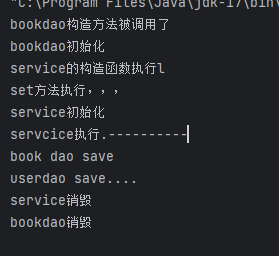 

#### setter做普通类型的注入

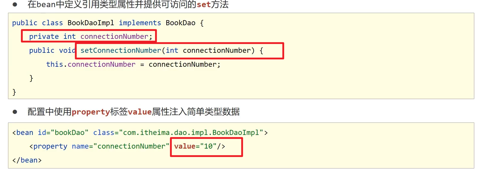 

##### BookServiceimpl.java

```java
package com.hello.service.impl;

import com.hello.dao.BookDao;
import com.hello.dao.UserDao;
import com.hello.dao.impl.UserDaoimpl;
import com.hello.service.BookService;
import org.springframework.beans.factory.DisposableBean;
import org.springframework.beans.factory.InitializingBean;

public class BookServiceimpl  implements BookService, InitializingBean, DisposableBean {
    @Override
    public void destroy() throws Exception {
        System.out.println("service销毁");
    }

    @Override
    public void afterPropertiesSet() throws Exception {
        System.out.println("service初始化");
    }

    public String database;
    public String name;

    public BookServiceimpl() {
        System.out.println("service的构造函数执行l");
    }

    public void save()
    {
        System.out.println("servcice执行.database"+database+"name是"+name);

    }

    public void setDatabase(String database) {
        this.database = database;
    }

    public void setName(String name) {
        this.name = name;
    }
}
```

##### ApplicationContext.xml

```xml
    <bean id="bookService" name="boook book2" class="com.hello.service.impl.BookServiceimpl">

<!--        <property name="bookDao" ref="BookDao"/>-->
<!--        <property name="userDao" ref="UserDao"/>-->


        <property name="name" value="小光"/>
        <property name="database" value="mysql"/>

    </bean>
```


> 测试代码不变

> `注意要写setter方法`
>
> 配置的时候如果是引用就用`ref`
>
> 如果是普通变量那么就用`value`

##### 效果

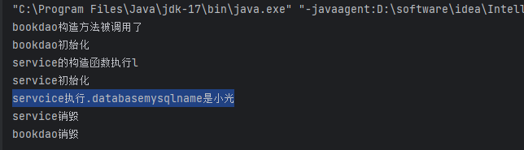


**配置属性的时候，没有顺序而言。**


### 构造方法(构造器注入)了解


> 删掉setter方法
>
> 用构造方法，内容差不多，就是配置写法区别
>

#### 构造器做引用类型的注入

##### xml

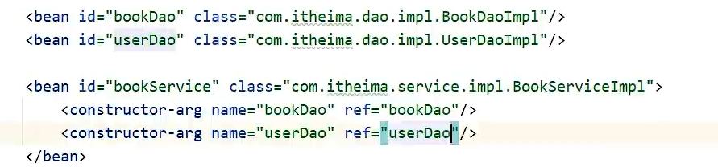 

##### BookServiceimpl.java

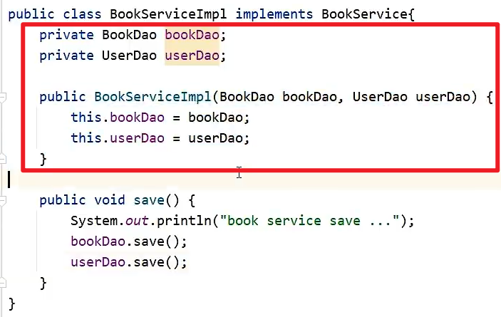 

##### 测试代码

```java
package com.hello;

import com.hello.dao.BookDao;
import com.hello.service.BookService;
import com.hello.service.impl.BookServiceimpl;
import org.springframework.context.ApplicationContext;
import org.springframework.context.support.ClassPathXmlApplicationContext;

public class App {
    public static void main(String[] args) {

        ClassPathXmlApplicationContext applicationContext=new ClassPathXmlApplicationContext("ApplicationContext.xml");


        BookService bookService= (BookService) applicationContext.getBean("bookService");
      bookService.save();

    }
}
```

##### 效果

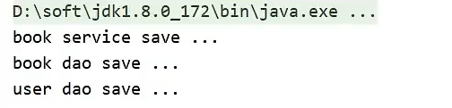  

#### 构造器做普通类型的注入

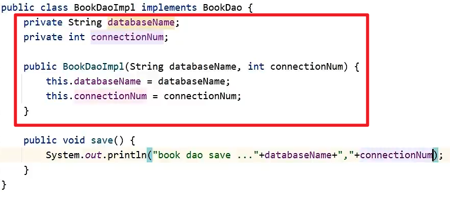  

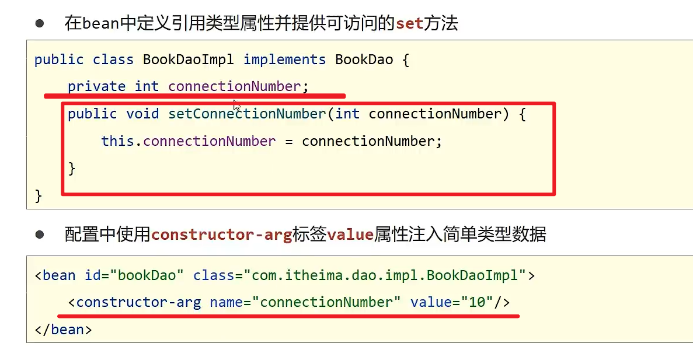 

`constructor-arg`

**同理ref换成value就ok了** 

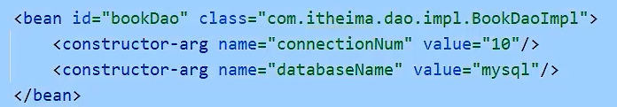 


#### 发展历史

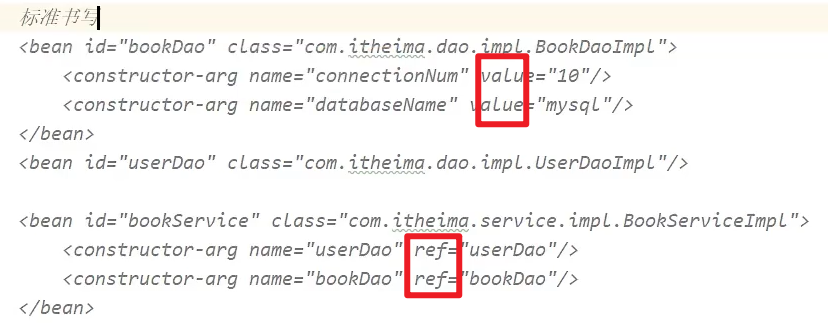 

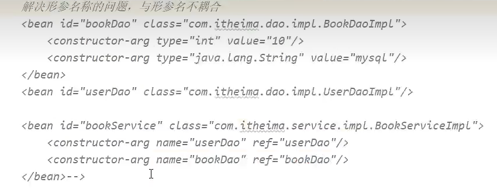 

两个同类型的参数的时候？

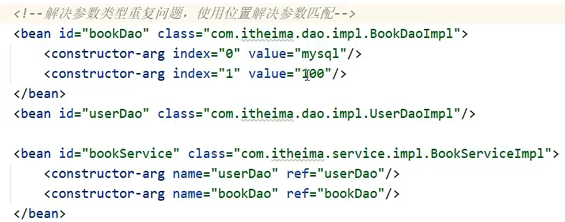  


#### 总结

> 强制依赖的类用构造器注入，会提醒没有初始化都无法创建对象
>
> setter肯呢个会造成对象创建好了但是是值空的null
>
> 可选的依赖用setter，灵活
>
> 严谨的话就是构造器，严谨
>
> 灵活分析，没有setter方法，就只能用构造器了，。，setter大部分都提供
>
> ··················**自己开发就用setter注入**························

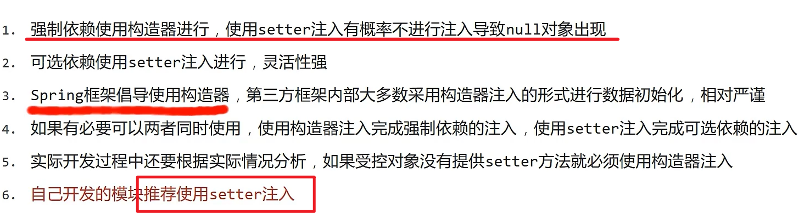 

### ------------------

### 依赖自动装配

#### 概念

> **Ioc容器根据bean所依赖的资源在容器中自动查找并注入到bean中的过程称为自动装配** 

#### 按类型（常用！）

保留setter方法

但是xml里面只需要

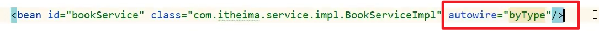 

而不是之前的

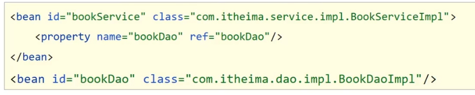 

> 注意：`需要setter方法`+`autowire="byType"`
>
> 还要有装配的对象的bean

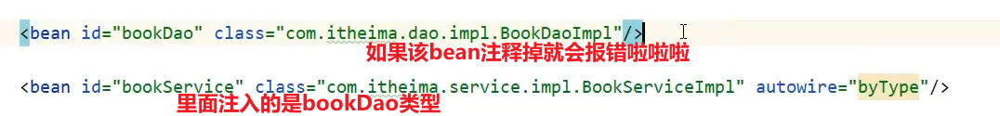

**配置的bean的id要和注入的参数一样才ok**

 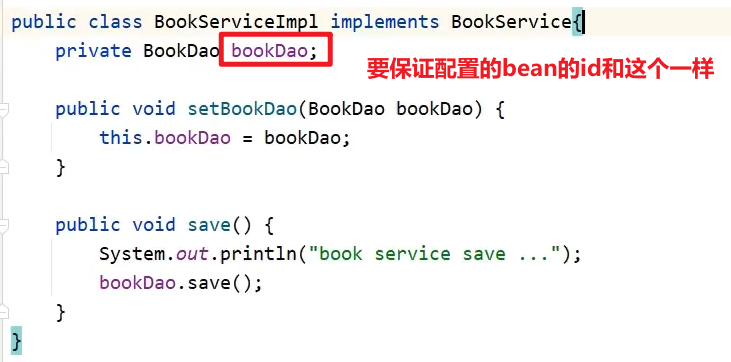

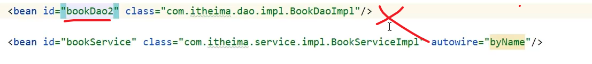

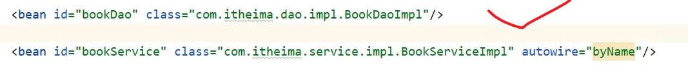

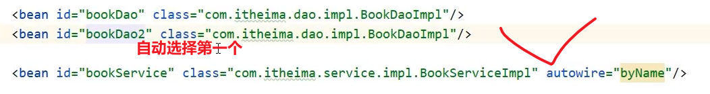

---

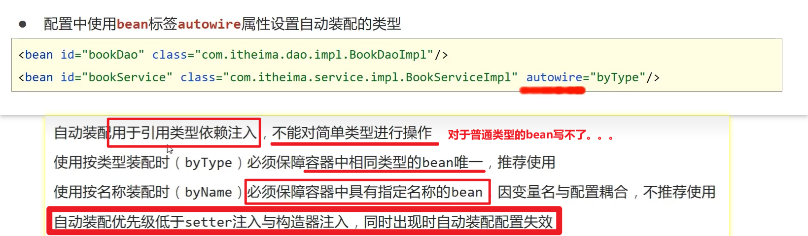 


开发不写，而是用注解开发

### 集合注入

> 用的很少

##### BookDaoimpl

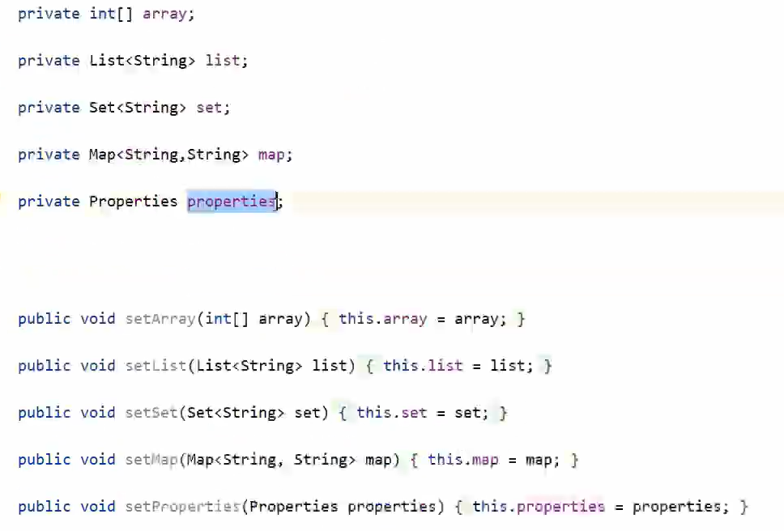

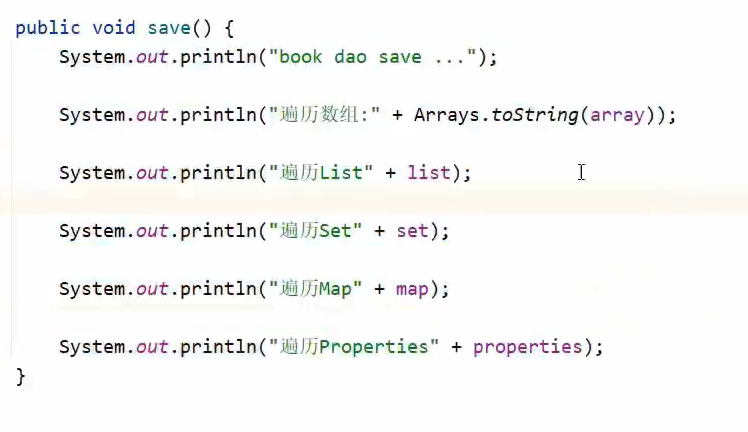  

##### 测试代码

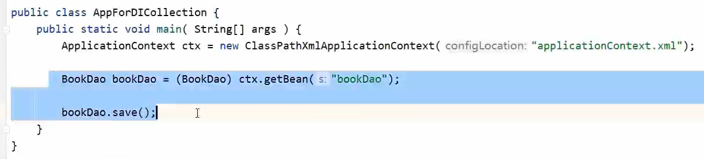 

##### applicationcontext.xml

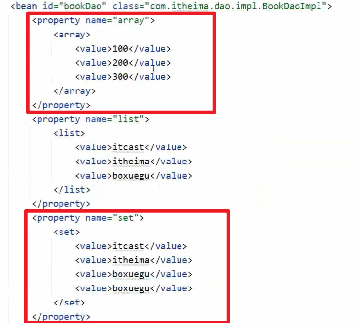 

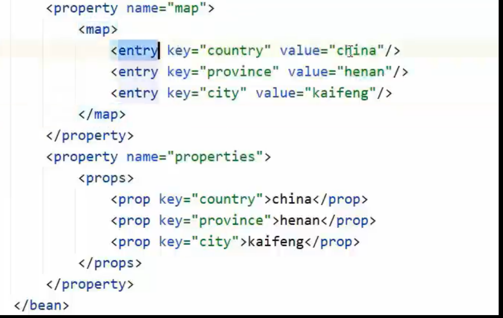 

##### 效果

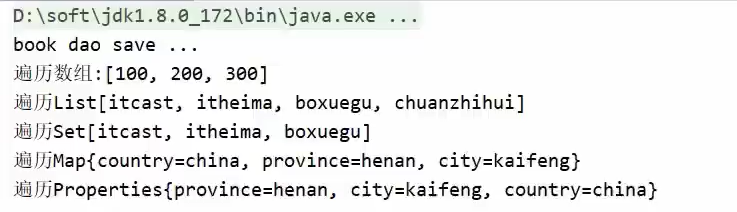 


## 加载properties文件

变化


jdbc.properties

```xml
jdbc.driver=com.mysql.jdbc.Driver
jdbc.url=jdbc:mysql://127.0.0.1:3306/spring_db
jdbc.username=root
jdbc.password=xurunbo
```

#### 步骤

1. 开启context命名空间

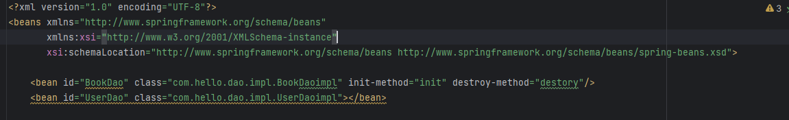

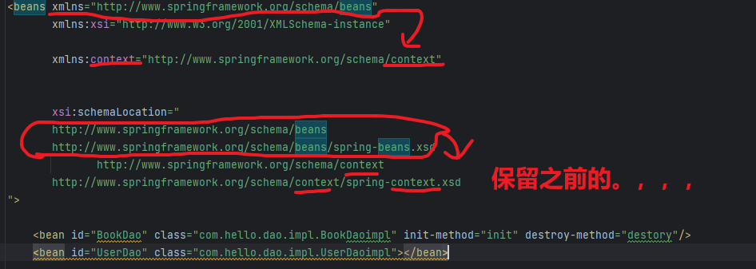  

```xml
<beans xmlns="http://www.springframework.org/schema/beans"
       xmlns:xsi="http://www.w3.org/2001/XMLSchema-instance"

       xmlns:context="http://www.springframework.org/schema/context"

       xsi:schemaLocation="
       http://www.springframework.org/schema/beans
       http://www.springframework.org/schema/beans/spring-beans.xsd
                           
       http://www.springframework.org/schema/context
       http://www.springframework.org/schema/context/spring-context.xsd
">

    <bean id="BookDao" class="com.hello.dao.impl.BookDaoimpl" init-method="init" destroy-method="destory"/>
    <bean id="UserDao" class="com.hello.dao.impl.UserDaoimpl"></bean>
```

 

2. 使用context命名空间加载propertises文件(属性占位符)

   加载的文件从resource，src都会读取

   在ApplicationContext.xml

   ```xml
       <context:property-placeholder location="jdbc.properties"/>
   ```

   

3. 如何使用配置文件里面的属性？用${}读取properties文件中的属性

   ```xml
       <bean id="datasource" class="com.alibaba.druid.pool.DruidDataSource">
   <property name="driverClassName" value="com.mysql.jdbc.Driver"/>
   <property name="url" value="jdbc:mysql://localhost:3306/db"/>
   <property name="username" value="root"/>
   <property name="password" value="xurunbo"/>
       </bean>
   ```

   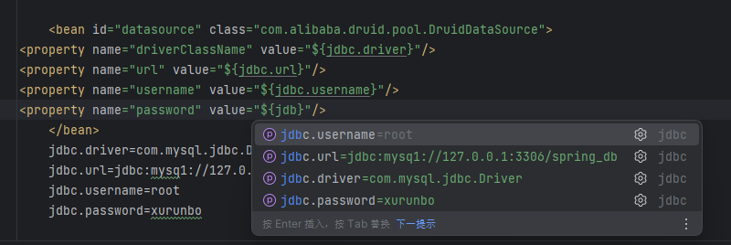 

   ```xml
       <bean id="datasource" class="com.alibaba.druid.pool.DruidDataSource">
   <property name="driverClassName" value="${jdbc.driver}"/>
   <property name="url" value="${jdbc.url}"/>
   <property name="username" value="${jdbc.username}"/>
   <property name="password" value="${jdbc.password}"/>
       </bean>
   ```


#### 小结

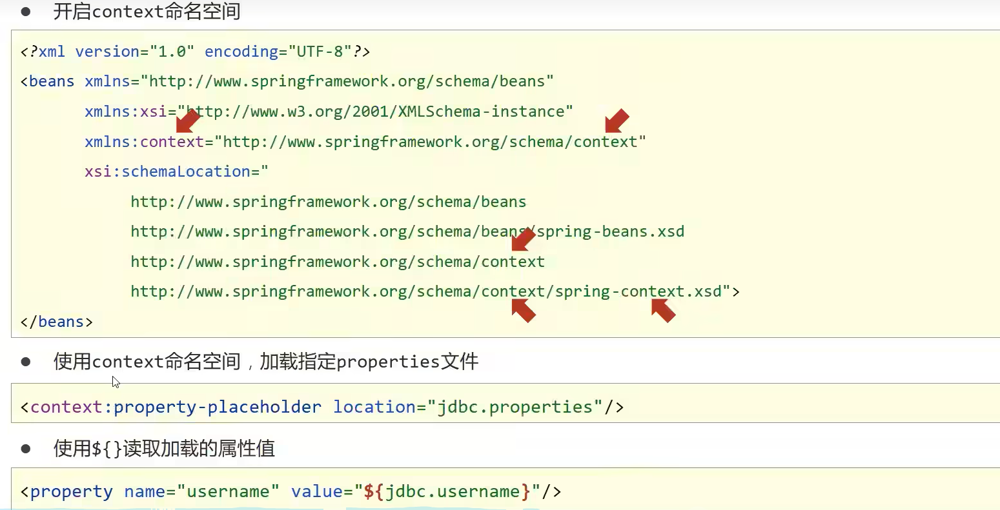 


加上新的属性`system-properties-mode="NEVER"`系统属性模式

可以不加载系统属性，系统环境变量就不会加载了。。了解一下

```xml
    <context:property-placeholder location="jdbc.properties" system-properties-mode="NEVER""/>
```

#### 如果有多个配置文件怎么加入呢？？？

1. 写多个

   ```xml
       <context:property-placeholder location="jdbc1.properties" system-properties-mode="NEVER""/>
           <context:property-placeholder location="jdbc2.properties" system-properties-mode="NEVER""/>
   ```

2. 用，隔开

   ```xml
       <context:property-placeholder location="jdbc1.properties,jdbc2.properties"system-properties-mode="NEVER""/>
   ```

3. 用*号表示加载所有的properties文件

   ```xml
       <context:property-placeholder location="*.properties,jdbc2.properties"system-properties-mode="NEVER""/>
   ```

4. 加上类路径，更完美更规范了

   ```xml
       <context:property-placeholder location="classpath:*.properties" system-properties-mode="NEVER""/>
   ```

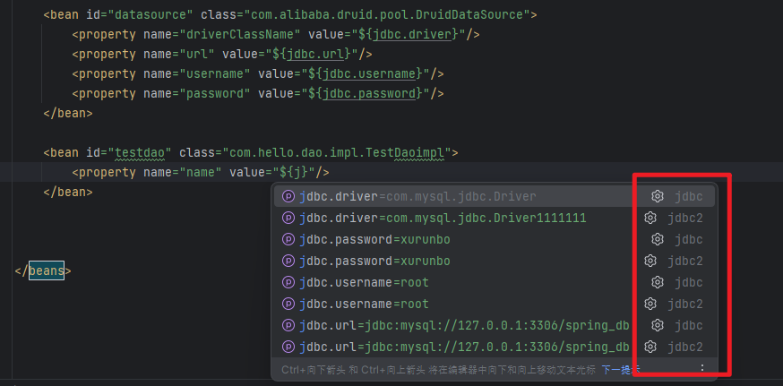 

只能读取当前工程里的配置文件

框架里的jar包如何读呢？

再加一个*，所以这才是最终的写法

```xml
<context:property-placeholder location="classpath*:*.properties"/>
```

#### 小结：

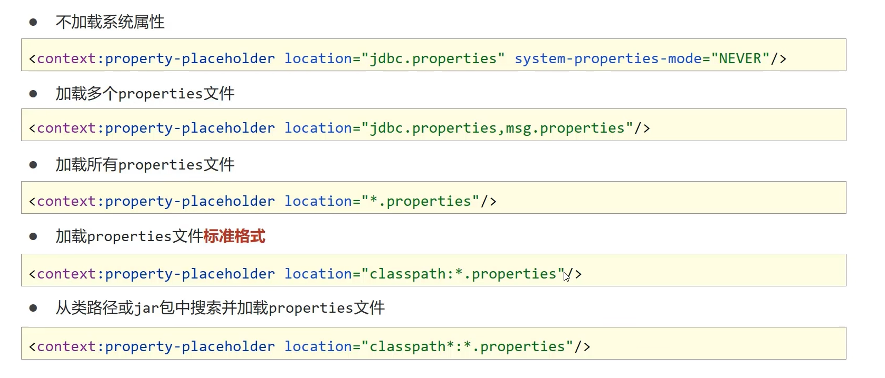 


## 容器

### 创建容器

1. 用类路径去找（最常用）

`ClassPathXmlApplicationContext applicationContext=new      ClassPathXmlApplicationContext("ApplicationContext.xml");`

2. 文件系统去找

` ApplicationContext applicationContext=new FileSystemXmlApplicationContext("D:\\Ideacode\\springframe1\\src\\main\\resources\\ApplicationContext.xml");`

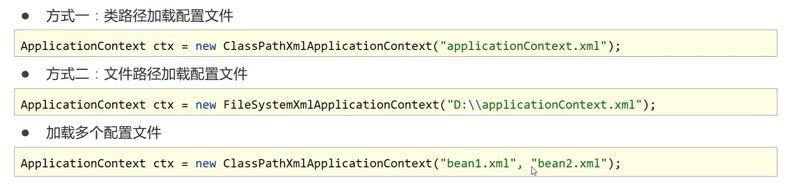 

### 获取bean的方式

```java
1        BookDao bookService= applicationContext.getBean("BookDao",BookDao.class);
2        BookDao bookService= (BookDao) applicationContext.getBean("BookDao");
 3       BookDao bookService= applicationContext.getBean(BookDao.class);
```

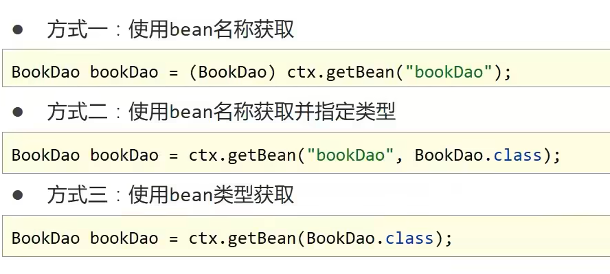

按照类型获取的时候，要确保 这个类型的bean只有一个

### 容器的类层次结构

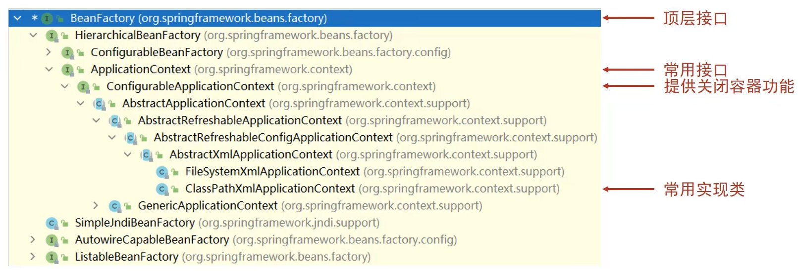 

BeanFactory初始化和`ClassPathXmlApplicationContext applicationContext=new ClassPathXmlApplicationContext("ApplicationContext.xml");`的区别

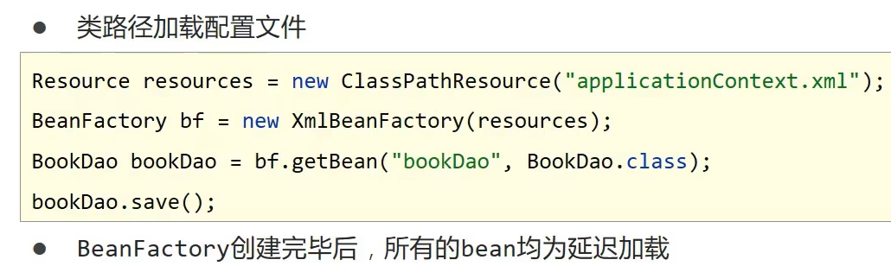 


### bean相关的配置

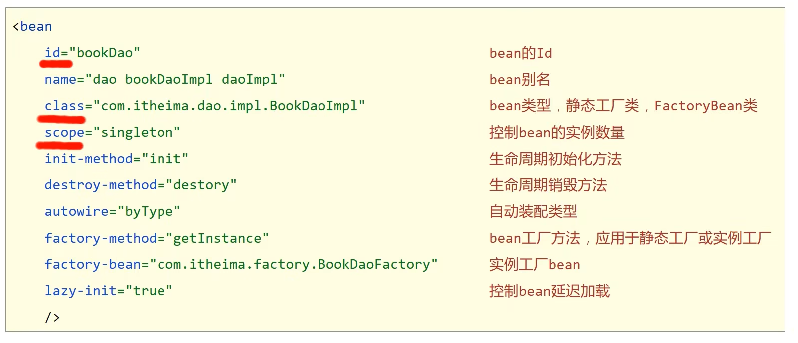 


### 依赖注入的相关

 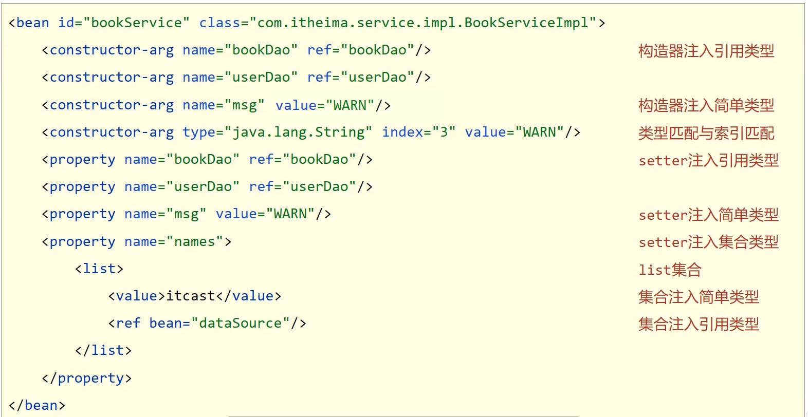 

setrter注入是最重要的


