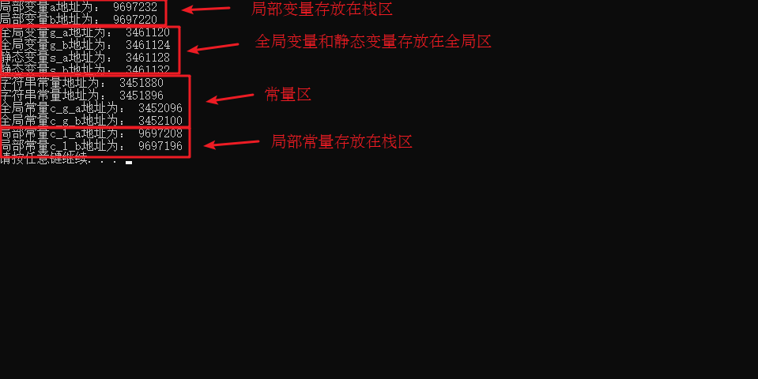
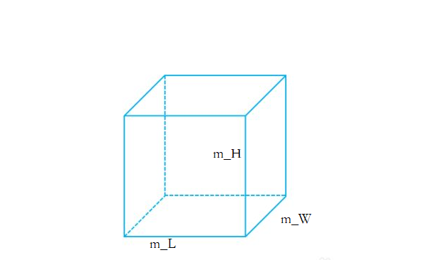

# C++核心编程

本阶段主要针对C++==面向对象==编程技术做详细讲解，探讨C++中的核心和精髓。


## 1 内存分区模型

C++程序在执行时，将内存大方向划分为**4个区域**

- 代码区：存放**函数体**的**二进制代码**，由**操作系统**进行管理的
- 注释不在代码区
- 全局区：存放**全局变量和静态变量以及常量**
- 栈区：由**编译器自动分配释放**, 存放**函数的参数值**,**局部变量**等
- 堆区：由**程序员分配和释放,******若程序员不释放,程序结束时由操作系统回收****


**内存四区意义：**

不同区域存放的数据，**赋予不同的生命周期**, 给我们更大的**灵活编程**


### 1.1 程序运行前

​	**在程序编译后，生成了exe可执行程序**，**未执行该程序前**分为两个区域

​	**代码区：**

​		存放 CPU 执行的机器指令

​		代码区是**共享**的，共享的目的是对于频繁被执行的程序，**只需要在内存中有一份代码即可**

​		代码区是**只读**的，使其只读的原因是防止程序意外地修改了它的指令,**金币变点券**

​	**全局区：**

​		**全局变量 和 静态变量**存放在此.

​		全局区还包含了**常量区**, **字符串常量和全局常量**存放在此.

==**局部常量也局部变量都在栈区**==

​		==该区域的数据在程序结束后由操作系统释放==.


---

(int)指针的地址，是不被定义的行为.

```c++
#include <iostream>

using namespace std;

int main()
{
    int a=10;
    int b=10;
    cout<<reinterpret_cast<unsigned long long int>(&a)<<endl;
    cout<<reinterpret_cast<unsigned long long int>(&b)<<endl;

}

```


`reinterpret_cast` 是 C++ 中的一种类型转换操作符，用于在不同类型之间进行强制转换。

它可以将一个==指针或引用转换为另一种类型的指针或引用==，而不进行任何类型检查或转换操作。

```c++
reinterpret<new type>(指针或者变量)
```


`static_cast`

```c++
static_cast<目标类型>(表达式)
```

`static_cast` 并不会进行运行时的类型检查，因此在进行指针或引用的转换时，必须确保转换是安全和合理的。


**示例：**

```c++
#include <iostream>

using namespace std;

//全局变量
int g_a = 10;
int g_b = 10;

//全局常量
const int c_g_a = 10;
const int c_g_b = 10;

int main() {

    //局部变量
    int a = 10;
    int b = 10;

    //打印地址
    cout << "局部变量a地址为： " << reinterpret_cast<unsigned long long int>(&a) << endl;
    cout << "局部变量b地址为： " << reinterpret_cast<unsigned long long int>(&b) << endl;

    cout << "全局变量g_a地址为： " <<  reinterpret_cast<unsigned long long int>(&g_a) << endl;
    cout << "全局变量g_b地址为： " <<  reinterpret_cast<unsigned long long int>(&g_b) << endl;

    //静态变量
    static int s_a = 10;
    static int s_b = 10;

    cout << "静态变量s_a地址为： " << reinterpret_cast<unsigned long long int>(&s_a) << endl;
    cout << "静态变量s_b地址为： " << reinterpret_cast<unsigned long long int>(&s_b) << endl;

    cout << "字符串常量地址为： " << reinterpret_cast<unsigned long long int>(&"hello world") << endl;
    cout << "全局常量c_g_a地址为： " << reinterpret_cast<unsigned long long int>(&c_g_a) << endl;
    cout << "全局常量c_g_b地址为： " << reinterpret_cast<unsigned long long int>(&c_g_b) << endl;

    const int c_l_a = 10;
    const int c_l_b = 10;
    cout << "局部常量c_l_a地址为： " << reinterpret_cast<unsigned long long int>(&c_l_a) << endl;
    cout << "局部常量c_l_b地址为： " << reinterpret_cast<unsigned long long int>(&c_l_b) << endl;

    system("pause");

    return 0;
}


```

打印结果：

**局部变量**a地址为： 6422044
**局部变量**b地址为： 6422040
全局变量g_a地址为： 4206608
全局变量g_b地址为： 4206612
静态变量s_a地址为： 4206616
静态变量s_b地址为： 4206620
字符串常量地址为： 4210842
全局常量c_g_a地址为： 4210692
全局常量c_g_b地址为： 4210696
**局部常量**c_l_a地址为： 6422036
**局部常量**c_l_b地址为： 6422032
请按任意键继续. . .




总结：

* C++中在**程序运行前**分为全局区和代码区
* 代码区特点是**共享和只读**
* 全局区中存放==全局变量、静态变量、常量==,**不包括局部常量和局部变量**
* 常量区中存放 const修饰的**全局常量  和 字符串常量**


### 1.2 程序运行后


​	**栈区：******编译器的天下.****

​		由**编译器**自动分配释放, 存放**函数的参数值,局部变量**等

​		注意事项：**不要返回局部变量的地址，栈区开辟的数据由编译器自动释放**


**示例：**

```c++
#include <iostream>

using namespace std;

int * func()
{
    int a = 10;
    return &a;
}

int main() {

    int *p = func();

    cout << *p << endl;//理论上第一次打印10
    cout << *p << endl;//第二次打印乱码，就是因为编译器帮你做了一次保留，栈区的数据由编译器主宰。

    system("pause");

    return 0;
}

///////////////////////////
#include <iostream>

using namespace std;

int* func()
{
    int *a =new int(10);
    return a;
}

int main() {

    int* p = func();

    cout << *p << endl;//理论上第一次打印10
    cout << *p << endl;//第二次打印乱码，就是因为编译器帮你做了一次保留，栈区的数据由编译器主宰。

    system("pause");

    return 0;
}


```

在函数 `func()` 中，你创建了一个局部变量 `a`，然后返回了它的地址。但是，当函数执行完毕后，`a` 的生命周期结束，它所占用的内存会被释放。因此，==返回的指针 `p` 指向的是一个无效的内存地址==。


​	**堆区：**

​		由**程序员分配释放,若程序员不释放,程序结束时由操作系统回收**

​		在C++中**主要利用new在堆区开辟内存**	

​		==并且返回new出来内存的地址，也就是指针！==


**示例：**

```c++
int* func()
{
	int* a = new int(10);
	return a;
}

int main() {

	int *p = func();

	cout << *p << endl;
	cout << *p << endl;//都是10，因为堆区的数据只有点击了x才被释放。在此之前一直存在。不像堆区离开了局部（函数）就被释放了，虽然编译器会帮你保留一次，但第二次就要出问题了。
    cout << *p << endl;
    cout << *p << endl;
    
	system("pause");

	return 0;
}
```


**总结：**

==堆区数据由程序员管理开辟和释放==

==堆区数据利用new关键字进行开辟内存==


### 1.3 new操作符


​	C++中利用==new==操作符在堆区开辟数据

​	堆区开辟的数据，**由程序员手动开辟，手动释放**，释放利用操作符 ==delete==

​	语法：` new 数据类型`(初始值)

​	利用new创建的数据，**会返回该数据对应的类型的指针(地址)**

int *a=new int(10)

​	==最后需要delete对应的指针！==加new返回的 指针！

> 

​	==**释放的空间不可访问**==


**示例1： 基本语法**

```c++
int* func()
{
	int* a = new int(10);
	return a;
}

int main() {

	int *p = func();

	cout << *p << endl;
	cout << *p << endl;

	//利用delete释放堆区数据
	delete p;

	//cout << *p << endl; //报错，释放的空间不可访问

	system("pause");

	return 0;
}
//10
//10
//15735568
```


**示例2：开辟数组**

```c++
#include <iostream>

using namespace std;
//堆区开辟数组
int main() {

    int* arr = new int[10];
    //开辟字符串,开辟字符串数组的时候换成[]再加个数
    string* str=new string("hello world");
    cout<<*str;

    for (int i = 0; i < 10; i++)
    {
        arr[i] = i + 100;
    }

    for (int i = 0; i < 10; i++)
    {
        cout << arr[i] << endl;
    }
    delete []  arr;
    delete str;

    system("pause");

    return 0;
}


```


`system("pause")`：这是一个用于在程序结束前暂停的系统命令。它可以让程序在控制台窗口中停留，直到用户按下任意键。这样可以方便查看程序的输出结果。


## 2 引用

### 2.1 引用的基本使用

**作用： **给**变量**起别名

土豆，马铃薯都是。。

**语法：** `数据类型 &别名 = 原名`

类型得相同


**示例：**

```C++
int main() {

	int a = 10;
	int &b = a;

	cout << "a = " << a << endl;
	cout << "b = " << b << endl;

	b = 100;

	cout << "a = " << a << endl;
	cout << "b = " << b << endl;

	system("pause");

	return 0;
}
```


### 2.2 引用注意事项

* **引用必须初始化**
* **引用在初始化后，不可以改变也就是**
* 一旦引用被初始化绑定到一个对象上，它将一直引用该对象，无法改变引用所绑定的对象。

示例：


```C++
int main() {

	int a = 10;
	int b = 20;
	//int &c; //错误，引用必须初始化
	int &c = a; //一旦初始化后，就不可以更改
	c = b; //这是赋值操作，不是更改引用
    //实际上是操作a的值。。

	cout << "a = " << a << endl;
	cout << "b = " << b << endl;
	cout << "c = " << c << endl;

	system("pause");

	return 0;
}
```


因为引用是一个别名，它必须引用一个实际存在的对象。

```c++
int& b = 20;
```

20 是一个临时的非常量值,它没有一个具体的内存位置。

如果想要将一个非常量的引用绑定到一个临时值上

```c++
const int & b=20;
```

`因为常量引用可以绑定到临时值上。常量引用可以用来访问临时值，但不能修改它们。`

如果想要将一个非常量的引用绑定到一个==变量==上，可以使用变量的地址。

```c++
int a=10;
int &b=a;
```


### 2.3 引用做函数参数

**作用：**函数传参时，可以利**用引用的技术让形参修饰实参**

**优点：**可以简化指针修改实参


**示例：**

```C++
#include <iostream>

using namespace std;
void sp1(int a,int b)
{
    int temp=a;
    a=b;
    b=temp;

}
void sp2(int* a,int* b)
{
    int temp=*a;
    *a=*b;
    *b=temp;
}
void sp3(int& a,int &b)
{
    int temp=a;
    a=b;
    b=temp;
}
int main()
{
    cout<<"请输入两个数"<<endl;
    int a,b;
    cin>>a>>b;

cout<<"值传递，不可以修改实参的本身"<<endl;
      sp1(a,b);
cout<<"a="<<a<<endl;
cout<<"b="<<b<<endl;
cout<<"地址传递--指针，可以修改实参的本身"<<endl;
    sp2(&a,&b);
cout<<"a="<<a<<endl;
cout<<"b="<<b<<endl;

cout<<"地址传递--引用，可以修改实参的本身"<<endl;
    sp3(a,b);
cout<<"a="<<a<<endl;
cout<<"b="<<b<<endl;

    return  0;
}

```


> 总结：**通过引用参数产生的效果同按地址传递是一样的**。引用的语法更清楚简单
>
> ##### 当引用作为一个函数形参时，它所引用的变量的生命周期必须保证在函数的执行期间内是有效的。在函数执行期间内，对于引用所指向的变量所进行的任何修改都将影响到函数调用方式中的原始变量。
>
> 引用和指针操作最大的区别在于，指**针的方式借助的形参会占用栈区空间**，而用引用则不会，**因此引用节省了栈区空间！**

****


### 2.4 引用做函数返回值


作用：引用是可以**作为函数的返回值**存在的


注意：**==不要返回局部变量引用和地址==**

**也要用引用的形式去接受**

**变量有可以同时存在多个别名，别名与别名与变量之间的操作是共通的**

```c++
#include <iostream>

using namespace std;

int main() {

    int a=10;
    int &b=a;
    int &c=a;
    cout<<"b="<<b<<endl;
    cout<<"c="<<c<<endl;
    return 0;
}

```

用法：*函数调用作为左值*

---

在 C++ 中，**不建议返回指向局部变量的引用，因为局部变量在函数执行完毕后会被销毁，而引用仍然指向该变量的内存地址。**这样会导致返回的引用指向一个无效的内存位置，==访问该引用可能会导致未定义行为。==


**而静态变量是在程序运行期间一直存在的，不会在函数执行完毕后被销毁。**因此，返回静态变量的引用是安全的，因为静态变量的生命周期超出了函数的作用域。

---

**示例：**

```C++
//返回局部变量引用
int& test01() {
	int a = 10; //局部变量
	return a;
}
//返回a的引用

//返回静态变量引用
int& test02() {
	static int a = 20;//全局区，在整个程序运行完才释放
	return a;
}

int main() {

	//不能返回局部变量的引用
    //返回的a是以类型“int&”返回的，所以必须要以类型“int&”去接收，这里用ref去接收，即int& ref = a  ，即ref为a的别名
	int& ref = test01();
	cout << "ref = " << ref << endl;
	cout << "ref = " << ref << endl;

	//如果函数做左值，那么必须返回引用,ref2也是a的别名
	int& ref2 = test02();
    
    
	cout << "ref2 = " << ref2 << endl;
	cout << "ref2 = " << ref2 << endl;
    
    
    ////
    //int &别名=1000 也相当于是a的别名只不过是函数
	test02() = 1000;
	////
    
    
	cout << "ref2 = " << ref2 << endl;
	cout << "ref2 = " << ref2 << endl;

	system("pause");

	return 0;
}
```


###### ==//修改为静态变量，返回静态变量的引用是ok的==


> int &a=返回引用的函数()
>
> 引用作为函数参数的时候，传入变量就ok了


​	

int * const 变量名字=


费曼学习法，先学面向过程C，在学面向对象CSharp，然后又滚来学C++面向对象过程（滑稽）


### 2.5 引用的本质

本质：**引用的本质在c++内部实现是一个指针常量.**

> 常量指针是指 指针指向的数据不可更改
>
> const指针常量是值 指针的指向不可更改

讲解示例：

```C++
//发现是引用，转换为 int* const ref = &a;
void func(int& ref){
	ref = 100; // ref是引用，转换为*ref = 100
}
int main(){
	int a = 10;
    
    //自动转换为 int* const ref = &a; 指针常量是指针指向不可改，也说明为什么引用不可更改
	int& ref = a; 
	ref = 20; //内部发现ref是引用，自动帮我们转换为: *ref = 20;
    
	cout << "a:" << a << endl;
	cout << "ref:" << ref << endl;
    
	func(a);
	return 0;
}
```

结论：C++推荐用引用技术，因为语法方便，引用本质是指针常量，但是所有的指针操作编译器都帮我们做了

```c++
int a=10;
int &b=a;
其实就是int * const b=&a;
当用调用b的时候其实就是在用*b
```


### 2.6 常量引用


**作用：**常量引用**主要用来修饰形参，防止误操作**

`当我们用引用作为函数参数时候，进入函数后我们这个数不想被修改就const int&a作为形参`

在函数形参列表中，可以加改变实参


引用必须引用一块合法的内存空间

int& a=10;  不可以

const int& a=10  可以

相当于，编译器帮助这样处理.

{

int temp=10;

const int& a=temp;

}


**示例：**


```C++
//引用使用的场景，通常用来修饰形参
void showValue(const int& v) {
	//v += 10;
	cout << v << endl;
} 
//相当于
//void showValue(const int* const name) {
	//v += 10;
//	cout << v << endl;
//}

int main() {

	//int& ref = 10;  引用本身需要一个合法的内存空间，因此这行错误
	//加入const就可以了，编译器优化代码，int temp = 10; const int& ref = temp;
	const int& ref = 10;

	//ref = 100;  //加入const后不可以修改变量
	cout << ref << endl;

	//函数中利用常量引用防止误操作修改实参
	int a = 10;
	showValue(a);

	system("pause");

	return 0;
}
```


## 3 函数提高

### 3.1 函数默认参数


在C++中，函数的形参列表中的形参是可以有默认值的。

语法：` 返回值类型  函数名 （参数= 默认值）{}`

==如果某个位置参数有默认值，那么从这个位置往后，从左向右，必须都要有默认值==


###### ==如果函数**声明有默认值**，函数实现的时候就不能有默认参数==

```c++
int func2(int a = 10, int b = 10);
int func2(int a, int b) {
	return a + b;
}
func2()//20
```

**示例：**

```C++
int func(int a, int b = 10, int c = 10) {
	return a + b + c;
}

//1. 如果某个位置参数有默认值，那么从这个位置往后，从左向右，必须都要有默认值
//2. 如果函数声明有默认值，函数实现的时候就不能有默认参数
int func2(int a = 10, int b = 10);
int func2(int a, int b) {
	return a + b;
}

int main() {

	cout << "ret = " << func(20, 20) << endl;
	cout << "ret = " << func(100) << endl;

	system("pause");

	return 0;
}
```


### 3.2 函数占位参数


C++中函数的形参列表里可以有占位参数，用来做占位，调用函数时必须填补该位置


**语法：** `返回值类型 函数名 (数据类型){}`

占一个位置，可以接受实参。

**占位参数必须填补**

在现阶段函数的占位参数存在意义不大，但是后面的课程中会用到该技术


**示例：**

```C++
//函数占位参数 ，占位参数也可以有默认参数
void func(int a, int =10) {
	cout << "this is func" << endl;
}

int main() {

	func(10,10); //占位参数必须填补

	system("pause");

	return 0;
}
```


### 3.3 函数重载

#### 3.3.1 函数重载概述


==**作用：**函数名可以相同，提高复用性==


**函数重载满足条件：**

* 同一个作用域下

* 函数名称相同

* 函数参数**类型不同**  或者 **个数不同** 或者 **顺序不同**（前提是参数类型不同！！！）

* > 函数的返回值类型不可以重载！！！


**注意:**  **函数的返回值不可以作为函数重载的条件**


**示例：**

```C++
//函数重载需要函数都在同一个作用域下
void func()
{
	cout << "func 的调用！" << endl;
}
void func(int a)
{
	cout << "func (int a) 的调用！" << endl;
}
void func(double a)
{
	cout << "func (double a)的调用！" << endl;
}
void func(int a ,double b)
{
	cout << "func (int a ,double b) 的调用！" << endl;
}
void func(double a ,int b)
{
	cout << "func (double a ,int b)的调用！" << endl;
}

//函数返回值不可以作为函数重载条件
//int func(double a, int b)
//{
//	cout << "func (double a ,int b)的调用！" << endl;
//}


int main() {

	func();
	func(10);
	func(3.14);
	func(10,3.14);
	func(3.14 , 10);
	
	system("pause");

	return 0;
}
```


#### 3.3.2 函数重载注意事项


* **引用作为重载条件**
* 函数重载碰到**函数默认参数**


**示例：**

```C++
//函数重载注意事项
//1、引用作为重载条件

void func(int &a)
{
	cout << "func (int &a) 调用 " << endl;
}

void func(const int &a)
{
	cout << "func (const int &a) 调用 " << endl;
}


//2、函数重载碰到函数默认参数

void func2(int a, int b = 10)
{
	cout << "func2(int a, int b = 10) 调用" << endl;
}

void func2(int a)
{
	cout << "func2(int a) 调用" << endl;
}

int main() {
	
	int a = 10;
	func(a); //调用无const
	func(10);//调用有const
    相当于弄了一个临时变量
      //  int &a=10 不可以
      //  const int &a=10;可以


	//func2(10); //碰到默认参数产生歧义，需要避免 二义性！~！！

	system("pause");

	return 0;
}
```


## ==**4** 类和对象==


C++面向对象的三大特性为：==封装、继承、多态==


C++认为==万事万物都皆为对象==，对象上有其属性和行为


> **类里面的属性和行为都是成员！**
>
> **创建具体的对象的过程叫做类的实例化！**


**例如：**

​	人可以作为对象，属性有姓名、年龄、身高、体重...，行为有走、跑、跳、吃饭、唱歌...

​	车也可以作为对象，属性有轮胎、方向盘、车灯...,行为有载人、放音乐、开空调...

​	具有相同性质的==对象==，我们可以抽象称为==类==，人属于人类，车属于车类

### 4.1 封装--1

#### 4.1.1  封装的意义

封装是C++面向对象三大特性之一

封装的意义：

* 将属性和行为作为一个整体，表现生活中的事物 
* 将属性和行为**加以权限控制**


**封装意义一：**

​	在设计类的时候，属性和行为写在一起，表现事物

**语法：** `class 类名{   访问权限： 属性  / 行为  };`


**示例1：**设计一个圆类，求圆的周长

**示例代码：**

```C++
//圆周率
const double PI = 3.14;

//1、封装的意义
//将属性和行为作为一个整体，用来表现生活中的事物

//封装一个圆类，求圆的周长
//class代表设计一个类，后面跟着的是类名
class Circle
{
public:  //访问权限  公共的权限

	//属性
	int m_r;//半径

	//行为
	//获取到圆的周长
	double calculateZC()
	{
		//2 * pi  * r
		//获取圆的周长
		return  2 * PI * m_r;
	}
};

int main() {

	//通过圆类，创建圆的对象
	// c1就是一个具体的圆
	Circle c1;
	c1.m_r = 10; //给圆对象的半径 进行赋值操作

	//2 * pi * 10 = = 62.8
	cout << "圆的周长为： " << c1.calculateZC() << endl;

	system("pause");

	return 0;
}
```


**示例2：**设计一个学生类，属性有姓名和学号，可以给姓名和学号赋值，可以显示学生的姓名和学号


**示例2代码：**

```C++

#include <iostream>

using namespace std;
//学生类
class student
{
public:
    void setname(string name)
    {
        this->name=name;
    }
    void setid(string number)
    {
        this->number=number;
    }
    void showmessage()
    {
        cout<<this->name<<"----"<<this->number<<endl;
    }


public:
    string name;
    string number;

};

int main() {

    student xrb;
    xrb.setname("徐润波");
    xrb.setid("542207230725");
    xrb.showmessage();
    system("pause");

    return 0;
}

```


**封装意义二：**

类在设计时，可以把属性和行为放在不同的权限下，加以控制

访问权限有三种：


1. public        公共权限  
2. protected 保护权限
3. private      私有权限


> 在C++中，类的成员可以不同的访问权限，包括私有（private）、保护（protected）和公共（public）权限。这些权限决定了类的成员对于**类内部和类外部**的**可见性和可访问性。**
>
> **私有权限（private）是最严格的权限**，它表示**只有类内部的成员函数可以访问该成员，**类外部的代码无法直接访问私有成员。私有成员对于类外部的用户是隐藏的，只有类内部的函数可以直接访问和操作私有成员。私有成员常用于封装类的实现细节，以确保数据的安全性和一致性。
>
> 保护权限（protected）**介于私有权限和公共权限之间。**保护成员**可以被类内部的成员函数和派生类的成员函数访问**，但对于类外部的代码是不可见的。**保护成员常用于实现继承中的数据共享和派生类的访问控制。**
>
> 区别总结如下：
> - **私有权限（private）：只有类内部的成员函数可以访问，类外部的代码无法直接访问。**
> - **保护权限（protected）：类内部的成员函数和派生类的成员函数可以访问，类外部的代码无法直接访问。*
> - **公共权限（public）：类内部的成员函数和类外部的代码都可以访问。**
>
> 需要注意的是，这些**访问权限只是在编译时进行的静态检查**，***而不是运行时的限制***。因此，通过类的**公共成员函数可以间接地访问私有和保护成员**。
>


**示例：**

```C++
//三种权限
//公共权限  public     类内可以访问  类外可以访问
//保护权限  protected  类内可以访问  类外不可以访问
//私有权限  private    类内可以访问  类外不可以访问

class Person
{
	//姓名  公共权限
public:
	string m_Name;

	//汽车  保护权限
protected:
	string m_Car;

	//银行卡密码  私有权限
private:
	int m_Password;

public:
	void func()
	{
		m_Name = "张三";
		m_Car = "拖拉机";
		m_Password = 123456;
	}
};

int main() {

	Person p;
	p.m_Name = "李四";
	//p.m_Car = "奔驰";  //保护权限类外访问不到
	//p.m_Password = 123; //私有权限类外访问不到

	system("pause");

	return 0;
}
```


#### 4.1.2 struct和class区别


在C++中 struct和class唯一的**区别**就在于 **默认的访问权限不同**

区别：

> * #### struct 默认权限为公共
>
> * #### class   默认权限为私有


```C++
class C1
{
	int  m_A; //默认是私有权限
};

struct C2
{
	int m_A;  //默认是公共权限
};

int main() {

	C1 c1;
	c1.m_A = 10; //错误，访问权限是私有

	C2 c2;
	c2.m_A = 10; //正确，访问权限是公共

	system("pause");

	return 0;
}
```


#### 4.1.3 ==成员属性设置为私有==


**优点1：**将所有成员属性设置为私有，可以**自己控制读写权限**

**优点2：**对于写权限，我们可以检测数据的有效性

---

*在 C++ 中，私有成员是类的成员，**只有类的成员函数可以直接访问和修改私有成员。**其他函数或代码块无法直接访问和修改私有成员。*

*然而，**可以通过指针间接访问和修改私有成员**。如果你有一个指向类对象的指针，你可以使用指针来访问和修改私有成员。这是因为**指针可以具有与类成员函数相同的访问权限。***

```c++
#include <iostream>
#include <cmath>
using namespace std;
class MyClass {
private:
    int privateMember;

public:
    void setPrivateMember(int value) {
        privateMember = value;
    }

    int getPrivateMember() {
        return privateMember;
    }
};

int main() {
    MyClass obj;
    MyClass* ptr = &obj;

    ptr->setPrivateMember(200);
    int value = ptr->getPrivateMember();
    cout<<value<<endl;

    return 0;
}

```


**示例：**

```C++

#include <iostream>

using namespace std;
class Person {
public:

    //姓名设置可读可写
    void setName(string name) {
        m_Name = name;
    }
    string getName()
    {
        return m_Name;
    }


    //获取年龄
    int getAge() {
        return m_Age;
    }
    //设置年龄
    void setAge(int age) {
        if (age < 0 || age > 150) {
            cout << "你个老妖精!" << endl;
            return;
        }
        m_Age = age;
    }

    //情人设置为只写
    void setLover(string lover) {
        m_Lover = lover;
    }

private:
    string m_Name; //可读可写  姓名

    int m_Age; //只读  年龄

    string m_Lover; //只写  情人
};


int main() {

    Person p;
    //姓名设置
    p.setName("张三");
    cout << "姓名： " << p.getName() << endl;

    //年龄设置
    p.setAge(50);
    cout << "年龄： " << p.getAge() << endl;

    //情人设置
    p.setLover("苍井");
//    cout << "情人： " << p.m_Lover << endl;  //只写属性，不可以读取

    system("pause");

    return 0;
}

```


**练习案例1：设计立方体类**

设计立方体类(Cube)

求出立方体的面积和体积

分别用全局函数和成员函数判断两个立方体是否相等。





```C++
#include <iostream>
using namespace std;


class cubic{
public:
    int getwidth()
    {
        return this->width;
    }
    void setwidth(int width)
    {
        this->width=width;
    }

    int getlength()
    {
        return this->length;
    }
    void setlength(int length)
    {
        this->length=length;
    }

    int getheight()
    {
        return this->height;
    }
    void setheight(int height)
    {
        this->height=height;
    }


    int caculateV()
    {
        return this->length*this->height*this->width;
    }
private:
    int width;
    int height;
    int length;
};

int main() {

    cubic abc;
    abc.setwidth(3);
    cout<<"得到立方体的宽度"<<abc.getwidth()<<endl;

    abc.setlength(4);
    cout<<"得到立方体的长度"<<abc.getlength()<<endl;

    abc.setheight(5);
    cout<<"得到立方体的高度"<<abc.getheight()<<endl;

    cout<<"得到立方体的体积V="<<abc.caculateV()<<endl;

    system("pause");

    return 0;
}

//得到立方体的宽度3
//得到立方体的长度4
//得到立方体的高度5
//得到立方体的体积V=60
//请按任意键继续. .

```


```

```


**练习案例2：点和圆的关系**

设计一个圆形类（Circle），和一个点类（Point），计算点和圆的关系。


```c++
#include <iostream>
#include <cmath>
using namespace std;
class point{
public:
    int getx()
    {
        return this->x;
    }
    void setx(int x)
    {
        this->x=x;
    }
    int gety()
    {
        return this->y;
    }
    void sety(int y)
    {
        this->y=y;
    }
private:
    int x;
    int y;

};
class circle{
public:
    void setx(int x)
    {
        this->c_x=x;
    }
    void sety(int y)
    {
        this->c_y=y;
    }
    void setr(int r)
    {
        this->c_r=r;
    }
    int getr()
    {
        return this->c_r;
    }

    int CaculateTheRelationshipBetweenCircleAndPoint(point abc)
    {
        int p_x=abc.getx();
        int p_y=abc.gety();
        int distance=static_cast<int>(sqrt((p_x-this->c_x)*(p_x-this->c_x)-(p_y-this->c_y)*(p_y-this->c_y)));
        return distance;

    }


private:
    int c_x;
    int c_y;
    int c_r;
};


int main() {

    circle circle;
    circle.setx(0);
    circle.sety(1);
    circle.setr(1);

    point point;

    point.setx(2);
    point.sety(1);

    int result=circle.CaculateTheRelationshipBetweenCircleAndPoint(point);
    if(result==circle.getr())
    {
        cout<<"点在圆上！！！"<<endl;
    }
    else if(result>circle.getr())
    {
        cout<<"点在园外!!!"<<endl;
    }
    else {
        cout<<"点在园内！！！"<<endl;
    }

    system("pause");

    return 0;
}
//点在园外!!!

```

#### ***static_cast<>和reinterpret_cast<>***

> ## static_cast<>
>
> `static_cast<>` 是 C++ 中的一种**类型转换运算符**，用于在编译时进行类型转换。它可以用于将一种类型转换为另一种类型，包括基本类型、类类型和指针类型。
>
> `static_cast<>` 的语法如下：
>
> ```cpp
> static_cast<目标类型>(表达式)
> ```
>
> 其中，`目标类型` 是你希望将表达式转换为的类型，而 `表达式` 则是要进行转换的值或**变量**。
>
> 下面是一些示例用法：
>
> 1. 将整数转换为浮点数：
>
> ```cpp
> int num = 10;
> double result = static_cast<double>(num);
> ```
>
> 2. 将浮点数转换为整数：
>
> ```cpp
> double num = 3.14;
> int result = static_cast<int>(num);
> ```
>
> 3. *将指针类型转换为另一种指针类型*：
>
> ```cpp
> int* ptr = new int(10);
> char* result = static_cast<char*>(ptr);
> ```
>
> 需要注意的是，`static_cast<>` **不会执行运行时的类型检查**，因此转换的安全性需要由开发者自行保证。如果转换是不安全的，建议使用更加安全的类型转换运算符，如 `dynamic_cast<>` 或 `reinterpret_cast<>`。
>
> 总结起来，`static_cast<>` 是 C++ 中一种常用的类型转换运算符，**用于在编译时进行类型转换**。它可以将一种类型转换为另一种类型，但需要开发者自行确保转换的安全性。
>
> ---
>
> ---
>
> ---
>
> ## reinterpret_cast<>
>
> `reinterpret_cast<>` 是 C++ 中的一种类型转换运算符，用**于执行底层的强制类型转换**。它可以将一个指针或引用转换为另一种指针或引用类型，甚至可以将指针或引用转换为整数类型。
>
> `reinterpret_cast<>` 的语法如下：
>
> ```cpp
> reinterpret_cast<目标类型>(表达式)
> ```
>
> 其中，`目标类型` 是你希望将表达式转换为的类型，而 `表达式` 则是要进行转换的值或变量。
>
> 下面是一些示例用法：
>
> 1. 将指针类型转换为另一种指针类型：
>
> ```cpp
> int* ptr = new int(10);
> char* result = reinterpret_cast<char*>(ptr);
> ```
>
> 2. 将指针类型转换为整数类型：
>
> ```cpp
> int* ptr = new int(10);
> uintptr_t result = reinterpret_cast<uintptr_t>(ptr);
> ```
>
> 3. 将整数类型转换为指针类型：
>
> ```cpp
> uintptr_t num = 12345;
> int* result = reinterpret_cast<int*>(num);
> ```
>
> 需要注意的是，`reinterpret_cast<>` 执行的是一种底层的强制类型转换，**它可以绕过编译器的类型检查**，因此需要开发者自行确保转换的安全性。使用 `reinterpret_cast<>` 进行类型转换时应该非常小心，确保转换的结果在语义上是合理的。
>
> 总结起来，`reinterpret_cast<>` 是 C++ 中一种类型转换运算符，用于执行底层的强制类型转换。它可以将指针或引用转换为另一种指针或引用类型，甚至可以将指针或引用转换为整数类型。使用 `reinterpret_cast<>` 进行类型转换时需要非常小心，确保转换的安全性和语义正确性。

```c++
#include <iostream>

using namespace std;

int main()
{
    int a=10;
    int b=10;
    cout<<reinterpret_cast<unsigned long long int>(&a)<<endl;
    cout<<reinterpret_cast<unsigned long long int>(&b)<<endl;

}

```


### 4.2 对象的初始化和清理


*  生活中我们买的电子产品都基本会有**出厂设置**，在某一天我们不用时候也会删除一些自己信息数据保证安全
*  C++中的**面向对象来源于生活，**每个对象也都会有**初始设置**以及 对象销毁前的**清理数据**的设置。


 

#### 4.2.1 构造函数和析构函数

对象的**初始化和清理**也是两个非常重要的安全问题


**多个对象的时候，先构造的后析构！！**

**在类外调用类的成员**

**类名::成员**

> ​	一个对象或者变量没有初始状态，对其使用后果是未知
>
> ​	同样的使用完一个对象或变量，没有及时清理，也会造成一定的安全问题


c++利用了**构造函数**和**析构函数**解决上述问题，这**两个函数将会被编译器自动调用**，完成对象初始化和清理工作。

对象的初始化和清理工作是编译**器强制要我们做的事情**，因此如果**我们不提供构造和析构，编译器会提供**

**编译器提供的构造函数和析构函数是-=空实现-=。**


* 构造函数：主要作用在于创建对象时**为对象的成员属性赋值**，**构造函数由编译器自动调用**，无须手动调用。
* 析构函数：主要作用在于对象**销毁前***系统自动调用*，执行一些**清理工作**。

可以写在类内


**构造函数语法：**`类名(){}`

> 1. **构造函数，没有返回值也写void**
> 2. **函数名称与类名相同**
> 3. **构造函数可以有参数，因此可以发生重载**
> 4. 程序在**调用对象时候会自动调用构造**，无须手动调用**,而且只会调用一次**


**析构函数语法：** `~类名(){}`

> 1. ##### 析构函数，没有返回值也写void
>
> 2. ##### 函数名称是类名，但前面要加个~
>
> 3. ##### 函数不可以有参数，不能发生重载
>
> 4. ##### 程序在*对象销毁前*对自动调用析构函数，无需手动调用，且只会调用一次

---

C++ 类的构造函数和析构函数可以在类的定义外部进行定义和实现。这样做的目的是将类的声明和实现分离，使代码更加清晰和可维护。

**构造函数和析构函数的定义和实现可以放在类的定义之后的任何地方，通常会放在类的定义之后的源文件中。**

以下是一个示例：

```cpp
// MyClass.h 头文件
class MyClass {
private:
    int privateMember;

public:
    MyClass(); // 构造函数的声明

    ~MyClass(); // 析构函数的声明

    void someMethod();
};

// MyClass.cpp 源文件
#include "MyClass.h"

MyClass::MyClass() {
    // 构造函数的实现
    privateMember = 0;
}

MyClass::~MyClass() {
    // 析构函数的实现
    // 可以进行资源的释放等清理工作
}

void MyClass::someMethod() {
    // 方法的实现
}
```

在上面的示例中，`MyClass` 类的构造函数和析构函数的声明放在了头文件 `MyClass.h` 中，而定义和实现则放在了源文件 `MyClass.cpp` 中。这样可以使类的接口和实现分离，提高代码的可读性和可维护性。

**如果构造函数和析构函数的定义和实现在类的定义内部，编译器会隐式地将它们声明为内联函数。**而将它们定义在类的定义外部时，不会自动成为内联函数，需要显式地在定义中加上 `inline` 关键字来指示编译器将其作为内联函数处理。

> **当编译器将函数的定义插入到调用它的地方时，这被称为内联展开**。相比于生成函数调用，内联展开具有以下优点和缺点：
>
> 优点：
>
> 1. **减少函数调用的开销**：函数调用涉及到保存和恢复寄存器、跳转到函数代码、返回地址等操作，这些操作会消耗一定的时间和空间。通过内联展开，可以避免这些开销，从而提高程序的执行效率。
> 2. **优化循环和递归**：内联展开可以优化循环和递归函数的性能。将循环或递归函数内联展开，可以减少函数调用的次数，避免重复的栈帧创建和销毁，从而加快循环或递归的执行速度。
> 3. **提高编译器优化的机会**：内联展开可以**提供更多的代码上下文信息给编译器**，使其有更多的优化机会。例如，编译器可以进行常量折叠、循环展开、代码复制等优化，从而进一步提高程序的执行效率。
>
> 缺点：
>
> 1. **增加代码的体积**：内联展开会将函数的定义插入到调用它的地方，这会增加代码的体积。如果函数体很大，内联展开可能会导致代码膨胀，**增加可执行文件的大小。**
> 2. 增加编译时间：内联展开会增加编译器的工作量，因为编译器需要将函数的定义插入到每个调用它的地方。**如果程序中有大量的函数调用，内联展开可能会导致编译时间的增加。**
> 3. 可读性下降：内联展开会使代码变得更加冗长，可读性可能会下降。特别是对于复杂的函数体，将其内联展开可能会使代码难以理解和维护。
>
> 综上所述，**内联展开可以提高程序的执行效率，特别是对于频繁调用的小型函数和循环或递归函数。**然而，内联展开也会增加代码的体积和编译时间，并可能降低代码的可读性。因此，在使用内联展开时需要权衡这些优缺点，并根据具体的情况进行选择。

---

```C++
#include <iostream>
#include <cmath>
using namespace std;
class Person
{
public:
    //构造函数
    Person(){
        cout<<"我是构造函数，调用对象前会自动执行，只执行一次，没有返回值也不写void，可以有参数也就说我一般用于创建对象的同时对其成员进行赋值"<<endl;
    }
    //析构函数
    ~Person(){
        cout<<"我是析构函数，对象销毁前会被自动执行，没有返回值也不写void，不可以有参数"<<endl;
    }

};

void test01()
{
    Person p;
}

int main() {
    cout<<"begin"<<endl;
    test01();

    cout<<"end"<<endl;
    system("pause");

    return 0;
}

//begin
//我是构造函数，调用对象前会自动执行，只执行一次，没有返回值也不写void，可以有参数也就说我一般用于创建对象的同时对其成员进行赋值
//我是析构函数，对象销毁前会被自动执行，没有返回值也不写void，不可以有参数
//end
```


#### 4.2.2 构造函数的分类及调用

两种分类方式：

​	按参数分为： 无参构造和有参构造

​	按类型分为： 普通构造（简单的有参无参）和拷贝构造

三种调用方式：

​	括号法

​	显示法

​	隐式转换法

---

**注意1：调用无参构造函数不能加括号，如果加了编译器认为这是一个函数声明**


---

> C++ 中的构造函数可以分为以下几种类型：
>
> 1. 无参构造(默认构造)（Default Constructor）：没有参数的构造函数。如果一个类没有定义任何构造函数，编译器会自动生成一个默认构造函数。默认构造函数用于创建对象时不需要提供任何参数。
>
> 2. 有参构造（Parameterized Constructor）：带有参数的构造函数，可以在**创建对象时传递参数来初始化对象的成员变量。**
>
> 3. 拷贝构造函数（Copy Constructor）：**用于创建一个新对象并将其初始化为已有对象的副本。****拷贝构造函数的参数是 > **同类型的对象的引用****。
>
> 4. 深拷贝构造函数（Move Constructor）：用于将一个对象的资源（如动态分配的内存）转移到另一个对象中，通常用于提高程序的性能。
>
> 构造函数的调用方式有以下几种：
>
> 1. 直接调用：通过类名和参数列表直接调用构造函数来创建对象。例如：`MyClass obj(10);`
>
> 2. 隐式调用：在不显式调用构造函数的情况下，使用类的对象声明来创建对象。例如：`MyClass obj = 10;`
>
> 3. 拷贝初始化：使用一个已存在的对象来初始化新对象，会调用拷贝构造函数。例如：`MyClass obj2 = obj1;`
>
> 4. 动态创建对象：使用 `new` 运算符在堆上动态创建对象，会调用构造函数。例如：`MyClass* ptr = new MyClass();`
>
> 需要注意的是，**构造函数在对象创建时自动调用，无法手动调用构造函数来重新初始化已经存在的对象**。构造函数的调用顺序是**先调用基类的构造函数，再调用成员对象的构造函数，最后调用派生类的构造函数**。析构函数的调用顺序与构造函数相反，先调用派生类的析构函数，再调用成员对象的析构函数，最后调用基类的析构函数。

推荐使用括号

了解匿名对象

有参构造函数直接Person（10）的时候创了一个匿名对象。

相当于没人接受这个对象。

要想利用拷贝构造函数，先有一个自己同类型的对象，然后再以引用的形式传入就ok了


**示例：**

```C++
//1、构造函数分类
// 按照参数分类分为 有参和无参构造   无参又称为默认构造函数
// 按照类型分类分为 普通构造和拷贝构造

class Person {
public:
	//无参（默认）构造函数
	Person() {
		cout << "无参构造函数!" << endl;
	}
	//有参构造函数
	Person(int a) {
		age = a;
		cout << "有参构造函数!" << endl;
	}
	//拷贝构造函数
	Person(const Person& p) {
		age = p.age;
		cout << "拷贝构造函数!" << endl;
	}
	//析构函数
	~Person() {
		cout << "析构函数!" << endl;
	}
public:
	int age;
};

//2、构造函数的调用
//调用无参构造函数
void test01() {
	Person p; //调用无参构造函数
}

//调用有参的构造函数
void test02() {

	//2.1  括号法，常用
	Person p1(10);
	//注意1：调用无参构造函数不能加括号，如果加了编译器认为这是一个函数声明
	//Person p2();

	//2.2 显式法
	Person p2 = Person(10); 
	Person p3 = Person(p2);
	//Person(10)单独写就是匿名对象  当前行结束之后，马上析构，直接构造析构然后立马销毁

	//2.3 隐式转换法
	Person p4 = 10; // Person p4 = Person(10); 
	Person p5 = p4; // Person p5 = Person(p4); 

	//注意2：不能利用 拷贝构造函数 初始化匿名对象 编译器认为是对象声明
	//Person p5(p4);
    ///数声明和对象定义的语法非常相似，都可以使用括号来表示。
    //使用额外的括号：可以在匿名对象的括号外面再加一对括号，这样编译器就不会将其解释为函数声明。
//MyClass obj((MyClass())); // 使用括号明确告诉编译器我们要定义一个对象
}

int main() {

	test01();
	//test02();

	system("pause");

	return 0;
}
```


#### 4.2.3 拷贝构造函数调用时机

```c++
Person(const Person& p) {
	cout << "拷贝构造函数!" << endl;
	mAge = p.mAge;
	默认的简单拷贝
}
```

C++中拷贝构造函数调用时机通常有三种情况

* 使用一个已经创建完毕的对象来初始化一个新对象

* **值传递**的方式给函数参数传值

* >  
  >
  > 全局函数的形参与自定义的拷贝构造函数的类型不一样，就会导致编译器认为我们没有拷贝构造函数，然后他就自己弄了个。。。然后就爆掉咯
  >
  > 错误示
  >
  > ```c++
  > void MYprint(Myarray<int> p)
  > 加不加const也没用
  > 少个&
  > ./...
  > ```
  >
  > 

* 以**值方式**返回局部对象

  

> 1. `Person newman3 = man;` 和 `Person newman3; newman3 = man;` 是有区别的。
>
>    1. `Person newman3 = man;` 使用**拷贝初始化的方式创建了一个新的对象** `newman3`，并将 `man` 对象的值复制给 `newman3`。这里会**调用拷贝构造函数来完成对象的复制初始化。**
>    2. ///////////////////////////////////////
>    2. `Person newman3; newman3 = man;` 首先创建了一个新的对象 `newman3`，但它**是通过默认构造函数创建的**，并不包含任何数据。然后，通**过赋值操作符 `=` 将 `man` 对象的值赋给了 `newman3`**。这里会调用**赋值运算符重载函数来完成对象的赋值操作。**
>
>    总体来说，两种形式都会将 `man` 对象的值复制到 `newman3` 对象中，但是在实现细节上有所不同。**拷贝初始化会调用==拷贝构造函数==**，**而赋值操作会调用==赋值运算符重载函数==**。在某些情况下，拷贝构造函数和赋值运算符重载函数的实现可能会有差异，因此两种形式可能具有不同的行为。**在一般情况下**，如果需要创建并初始化一个新对象，**建议使用拷贝初始化的方式**，而不是先创建对象再赋值的方式。
>
> 
>
> 2. **值传递是指将实参的值**复制一份传递给函数的形参。**在函数调用时，会创建一个新的变量（形参），并将实参的值复制到形参中。**==在函数内部，对形参的修改不会影响到实参的值。==当函数执行完毕后，形参的生命周期结束**，它所占用的内存会被释放。**
>
>    text02()在你的例子中，`doWork` 函数的形参 `p1` 是通过值传递的方式进行传递的。当你调用 `doWork(p)` 时，会创建一个新的 `Person` 对象 `p1`，并将 `p` 对象的值复制给 `p1`。
>
> 3. 
>
>    可以以值方式返回**局部对象**。当函数返回一个对象时，编***译器会执行对象的拷贝构造函数来创建一个临时对象，并将其作为返回值*。这个临时对象是在函数调用栈上分配的**，==**它的生命周期与函数的返回值绑定。**==
>
>    //
>    
>    **假如说我用a来接受这个局部对象，那么这个临时对象将会在a的销毁的时候同时销毁**
>    
>    


**示例：**

```C++
class Person {
public:
	Person() {
		cout << "无参构造函数!" << endl;
		mAge = 0;
	}
	Person(int age) {
		cout << "有参构造函数!" << endl;
		mAge = age;
	}
	Person(const Person& p) {
		cout << "拷贝构造函数!" << endl;
		mAge = p.mAge;
	}
	//析构函数在释放内存之前调用
	~Person() {
		cout << "析构函数!" << endl;
	}
public:
	int mAge;
};

//1. 使用一个已经创建完毕的对象来初始化一个新对象
void test01() {

	Person man(100); //p对象已经创建完毕
	Person newman(man); //调用拷贝构造函数
	Person newman2 = man; //拷贝构造

	//Person newman3;
	//newman3 = man; //不是调用拷贝构造函数，赋值操作
}

//2. 值传递的方式给函数参数传值
//相当于Person p1 = p;
void doWork(Person p1) {}
void test02() {
	Person p; //无参构造函数
	doWork(p);
}

//3. 以值方式返回局部对象
Person doWork2()
{
	Person p1;
	cout << (int *)&p1 << endl;
	return p1;
    //
    //此时return *this;也会拷贝一个
}

void test03()
{
	Person p = doWork2();
	cout << (int *)&p << endl;
}


int main() {

	//test01();
	//test02();
	test03();

	system("pause");

	return 0;
}
```


#### 4.2.4 构造函数调用规则

默认情况下，创建一个类的时候，c++编译器至少给一个类添加3个函数,

1．默认构造函数(无参，函数体为空)

2．默认析构函数(无参，函数体为空)

3．默认拷贝构造函数，对属性进行值拷贝


构造函数调用规则如下：

* 如果用户定义**有参构造函数**，c++**不在提供默认无参构造**，但是会提供**默认拷贝构造**


* 如果用户定义**拷贝构造函数**，c++**不会再提供其他构造函数**


示例：

```C++
class Person {
public:
	//无参（默认）构造函数
	Person() {
		cout << "无参构造函数!" << endl;
	}
	//有参构造函数
	Person(int a) {
		age = a;
		cout << "有参构造函数!" << endl;
	}
	//拷贝构造函数
	Person(const Person& p) {
		age = p.age;
		cout << "拷贝构造函数!" << endl;
	}
	//析构函数
	~Person() {
		cout << "析构函数!" << endl;
	}
public:
	int age;
};

void test01()
{
	Person p1(18);
	//如果不写拷贝构造，编译器会自动添加拷贝构造，并且做浅拷贝操作
	Person p2(p1);

	cout << "p2的年龄为： " << p2.age << endl;
}

void test02()
{
	//如果用户提供有参构造，编译器不会提供默认构造，会提供拷贝构造
	Person p1; //此时如果用户自己没有提供默认构造，会出错
	Person p2(10); //用户提供的有参
	Person p3(p2); //此时如果用户没有提供拷贝构造，编译器会提供

	//如果用户提供拷贝构造，编译器不会提供其他构造函数
	Person p4; //此时如果用户自己没有提供默认构造，会出错
	Person p5(10); //此时如果用户自己没有提供有参，会出错
	Person p6(p5); //用户自己提供拷贝构造
}

int main() {

	test01();

	system("pause");

	return 0;
}
```


```c++
void test01()
{
    Person p1(18);
    //如果不写拷贝构造，编译器会自动添加拷贝构造，并且做浅拷贝操作
    Person p2(p1);

    cout << "p2的年龄为： " << p2.age << endl;//18
}
```


#### 4.2.5 深拷贝与浅拷贝


**深浅拷贝是面试经典问题，也是常见的一个坑**


浅拷贝：**简单的赋值拷贝操作**  编译器提供的那个拷贝构造函数，浅拷贝


深拷贝：**在堆区重新申请空间，进行拷贝操作**


**这是编译器帮忙写的浅拷贝**


**示例：**

```C++
#include <iostream>
using namespace std;
class Person {
public:
	//无参（默认）构造函数
	Person() {
		cout << "无参构造函数!" << endl;
	}
	//有参构造函数
	Person(int age, int height) {

		cout << "有参构造函数!" << endl;

		m_age = age;
		m_height = new int(height);

	}
	//拷贝构造函数  
	Person(const Person& a)
	{
		cout << "拷贝构造函数" << endl;
		m_age = a.m_age;
		//m_height = a.m_height;
		//利用拷贝对象的数据来开辟一个新的空间。
		m_height = new int(*a.m_height);
	}

	//析构函数
	~Person() {
		cout << "析构函数!" << endl;
		if (m_height != NULL)
		{
			delete m_height;
		}
	}
public:
	int m_age;
	int* m_height;
};

void test01()
{
	Person p1(18, 160);
	Person p2(p1);
	//Person p2 = p1;
	cout << "p1的年龄： " << p1.m_age << " 身高： " << *p1.m_height << endl;

	cout << "p2的年龄： " << p2.m_age << " 身高： " << *p2.m_height << endl;
}

int main() {

	test01();

	system("pause");

	return 0;
}
```

> 总结：**如果属性有在堆区开辟的，一定要自己提供拷贝构造函数，防止浅拷贝带来的问题**

1. 自己写拷贝构造函数，用拷贝对象的数据来开辟对应的空间

2. ```c++
   //拷贝构造函数  
   Person(const Person& a)
   {
   	cout << "拷贝构造函数" << endl;
   	m_age = a.m_age;
   	//m_height = a.m_height;
   	//利用拷贝对象的数据来开辟一个新的空间。
   	m_height = new int(*a.m_height);
   }
   ```

3. 析构函数PLUS！

4. ```c++
   //析构函数
   ~Person() {
   	cout << "析构函数!" << endl;
   	if (m_height != NULL)
   	{
   		delete m_height;
   	}
   }
   ```

只有new出来的空间才能用delete，而且只能delete一次！


#### 4.2.6 初始化列表


**作用：**

C++提供了初始化列表语法，用来初始化属性


**语法：**`构造函数()：属性1(值1),属性2（值2）... {}`

`//初始化列表方式初始化`

`Person(int a, int b, int c) :m_A(a), m_B(b), m_C(c){}`

**示例：**

```C++
#include <iostream>
using namespace std;
class Person {
public:

	////传统方式初始化
	//Person(int a, int b, int c) {
	//	m_A = a;
	//	m_B = b;
	//	m_C = c;
	//}

	//初始化列表方式初始化
	Person(int a, int b, int c) :m_A(a), m_B(b), m_C(c) {}
    
    
	void PrintPerson() {
		cout << "mA:" << m_A << endl;
		cout << "mB:" << m_B << endl;
		cout << "mC:" << m_C << endl;
	}
private:
	int m_A;
	int m_B;
	int m_C;
};

int main() {

	Person p(4, 5, 6);
	p.PrintPerson();


	system("pause");

	return 0;
}
```


#### ==4.2.7 类对象作为类成员==


C++类中的成员可以是另一个类的对象，我们称该成员为 对象成员


例如：

```C++
class A {};
class B
{
    A a；
};
```


B类中有对象A作为成员，A为对象成员


那么当创建B对象时，A与B的构造和析构的顺序是谁先谁后？


> **//构造的顺序是 ：先调用*对象成员*的构造，再调用本类构造**
> **//析构顺序与构造相反**


**示例：**

```C++
class Phone
{
public:
	Phone(string name)
	{
		m_PhoneName = name;
		cout << "Phone构造" << endl;
	}

	~Phone()
	{
		cout << "Phone析构" << endl;
	}

	string m_PhoneName;

};


class Person
{
public:

	//初始化列表可以告诉编译器调用哪一个构造函数
	Person(string name, string pName) :m_Name(name), m_Phone(pName)
	{
		cout << "Person构造" << endl;
	}

	~Person()
	{
		cout << "Person析构" << endl;
	}

	void playGame()
	{
		cout << m_Name << " 使用" << m_Phone.m_PhoneName << " 牌手机! " << endl;
	}

	string m_Name;
    
    //用到了隐式调用构造函数
	Phone m_Phone;

};
void test01()
{
	//当类中成员是其他类对象时，我们称该成员为 对象成员
	//构造的顺序是 ：先调用对象成员的构造，再调用本类构造
	//析构顺序与构造相反
	Person p("张三" , "苹果X");
	p.playGame();

}


int main() {

	test01();

	system("pause");

	return 0;
}
```


调试一下！

```c++
#include<iostream>
using namespace std;
class Son
{
public:
	Son();
	~Son();

private:
};

class Father
{
public:
	Father();
	~Father();

private:
	Son* a;
};

Father::Father()
{
	a = new Son;
	cout << "父亲被构造了" << endl;
	
}

Father::~Father()
{
	cout << "父亲被析构了" << endl;
	delete a;
}

Son::Son()
{
	cout << "儿子被构造了" << endl;


}

Son::~Son()
{
	cout << "儿子被析构了" << endl;
}
int main()
{
	
	Father father;
	return 0;

}
```


```c++
#include<iostream>
using namespace std;
class Son
{
public:
	Son();
	~Son();

private:
};

class Father
{
public:
	Father();
	~Father();

private:
	Son a;
};

Father::Father()
{
	cout << "父亲被构造了" << endl;
	
}

Father::~Father()
{
	cout << "父亲被析构了" << endl;
}

Son::Son()
{
	cout << "儿子被构造了" << endl;


}

Son::~Son()
{
	cout << "儿子被析构了" << endl;
}
int main()
{
	
	Father father;
	return 0;

}
```

> 成员对象的构造函数会在包含它们的类的构造函数中自动被调用，这**确保了成员对象在使用之前都会被正确初始化。**
>
> 具体的调试过程如下：
>
> 1. 先跳转到Father的构造函数但是没有执行输出语句
> 2. 而是直接跳转到了Son的构造函数
> 3. 然后再构造Fathe
> 4. 然后析构Father
> 5. 析构Son
>
> 在对象被销毁时，析构函数的调用顺序正好相反，首先是包含成员对象的类的析构函数，然后是成员对象的析构函数。这确保了在对象销毁时，先执行与构造相对应的析构操作。

#### 4.2.8 静态成员

**静态成员就是在成员变量和成员函数前加上关键字static，称为静态成员**

----------------------------------------*可以通过类名访问静态成员*-------------------------------------------------

***静态成员分为*：**


*  **静态成员变量**
   *  **所有对象共享同一份数据**
   *  **在编译阶段分配内存**（全局区运行前）
   *  **==类内声明，类外初始化==**（记得加作用域！！！！）
*  **静态成员函数**
   *  **所有对象共享同一个函数**
   *  **静态成员函数只能访问静态成员变量**

> **静态成员变量也有私有的时候。外部不能直接访问**
>
> **可以通过类名访问静态成员**
>
> **普通的成员public变量不可以直接用类名：：变量名访问！！！**


---

》》》》》》》》》》》》》》》》》》》

#### ==作用域操作符==

> 公共（public）成员（包括静态成员变量）可以通过**类名**和**作用域操作符**`::`来访问。这意味着你可以使用类名和`::`来访问类的公共成员变量，而不需要创建类的对象实例。在你的示例中，你可以这样访问`m_A`：
>
> ```cpp
> int valueA = Person::m_A;
> ```
>
> 但是对于私有（private）成员变量（如`m_B`），你不能直接通过类名和`::`来访问，因为私有成员只能在类的成员函数内部访问。如果你希望在类的成员函数中使用私有成员变量，你可以在类的成员函数中进行访问，如下所示：
>
> ```cpp
> class Person
> {
> public:
>     static int m_A; // 公共静态成员变量
> private:
>     static int m_B; // 私有静态成员变量
> 
> public:
>     // 成员函数可以访问私有成员变量
>     static int GetMB()
>     {
>         return m_B;
>     }
> };
> ```
>
> 然后，你可以通过成员函数来访问私有静态成员变量：
>
> ```cpp
> int valueB = Person::GetMB();
> ```
>


《《《《《《《《《《《《《《《《《《《《《《

**示例1 ：**静态成员变量

```C++
class Person
{
	
public:

	static int m_A; //静态成员变量

	//静态成员变量特点：
	//1 在编译阶段分配内存
	//2 类内声明，类外初始化
	//3 所有对象共享同一份数据

private:
	static int m_B; //静态成员变量也是有访问权限的
};
int Person::m_A = 10;
int Person::m_B = 10;

void test01()
{
	//静态成员变量两种访问方式

	//1、通过对象
	Person p1;
	p1.m_A = 100;
	cout << "p1.m_A = " << p1.m_A << endl;

	Person p2;
	p2.m_A = 200;
	cout << "p1.m_A = " << p1.m_A << endl; //共享同一份数据
	cout << "p2.m_A = " << p2.m_A << endl;

	//2、通过类名
	cout << "m_A = " << Person::m_A << endl;


	//cout << "m_B = " << Person::m_B << endl; //私有权限访问不到
}

int main() {

	test01();

	system("pause");

	return 0;
}
```


**示例2：**静态成员函数

```C++
class Person
{

public:

	//静态成员函数特点：
	//1 程序共享一个函数
	//2 静态成员函数只能访问静态成员变量
	
	static void func()
	{
		cout << "func调用" << endl;
		m_A = 100;
		//m_B = 100; //错误，不可以访问非静态成员变量
        
        
        //静态static成员函数它只属于类本身不属于每一个对象实例，独立存在。非静态成员，仅当实例化对象之后才存在。静态成员函数产生在前，非静态成员函数产生在后，静态函数无法访问一个不存在的东西。也就是静态成员函数离不能用this指针
	}

	static int m_A; //静态成员变量
	int m_B; // 
private:

	//静态成员函数也是有访问权限的
	static void func2()
	{
		cout << "func2调用" << endl;
	}
};
int Person::m_A = 10;


void test01()
{
	//静态成员变量两种访问方式

	//1、通过对象
	Person p1;
	p1.func();

	//2、通过类名
	Person::func();


	//Person::func2(); //私有权限访问不到
}

int main() {

	test01();

	system("pause");

	return 0;
}
```


### 4.3 C++对象模型和this指针


#### 4.3.1 成员变量和成员函数分开存储


在C++中，**类内的成员变量和成员函数分开存储**

只有**非静态成员变量才属于类的对象上**

> ##### 只有非静态成员变量在真正属于类！！！！！
>
> ##### 空对象占用1字节，为了区分空对象。
>
> ##### 也就是类的大小是根据非静态成员变量的

```C++
#include <iostream>
using namespace std;
class Person {
public:
	Person() {
		mA = 0;
	}
	//非静态成员变量占对象空间
	int mA;
	//静态成员变量不占对象空间
	static int mB;
	//函数也不占对象空间，所有函数共享一个函数实例
	void func() {
		cout << "mA:" << this->mA << endl;
	}
	//静态成员函数也不占对象空间
	static void sfunc() {
	}
};

int main() {

	cout << sizeof(Person) << endl;

	system("pause");

	return 0;
}
//4
```


#### 4.3.2 this指针概念


> 对象.对象成员
>
> 指向对象的指针p
>
> p->.对象成员

通过4.3.1我们知道在C++中成员变量和成员函数是分开存储的

每一个非静态成员函数只会诞生一份函数实例，也就是说多个同类型的对象会共用一块代码

那么问题是：这一块代码是如何区分那个对象调用自己的呢？


c++通过提供特殊的对象指针，this指针，解决上述问题。***this指针指向被调用的成员函数所属的对象***


> **this指针是隐含每一个非静态成员函数内的一种指针**
>
> **this指针不需要定义，直接使用即可**
>
> **静态成员函数没有this指针**
>
> 因为静态成员是属于类的，不属于某个对象
>
> 本质是指针常量！！！	，已经指向了a，不可以修改指向，但可以修改值
>
> ```c++
> #include <iostream>
> using namespace std;
> class Person
> {
> public:
> 	void showperson() const
> 	{
> 
> 		this = NULL;
> 	}
> 	int m_a = 10;
> };
> 
> int main() {
> 
> 	Person a;
> 	a.showperson();
> 	system("pause");
> 
> 	return 0;
> }
> ```
>
> 


this指针的用途：

==this指针是指向对象的指针常量==

*  当形参和成员变量同名时，可用this指针来区分
*  **在类的非静态成员函数中返回对象本身，可使用return *this**

##### ==**链式编程思想！！！**==

```C++
class Person
{
public:

	Person(int age)
	{
		//1、当形参和成员变量同名时，可用this指针来区分
		this->age = age;
	}

	Person& PersonAddPerson(Person p)
	{
		this->age += p.age;
		//返回对象本身
		return *this;
	}

	int age;
};

void test01()
{
	Person p1(10);
	cout << "p1.age = " << p1.age << endl;

	Person p2(10);
    ///////////////////////////////////////////////////////////////
	p2.PersonAddPerson(p1).PersonAddPerson(p1).PersonAddPerson(p1);
	cout << "p2.age = " << p2.age << endl;
}

int main() {

	test01();

	system("pause");

	return 0;
}
```


#### 4.3.3==空指针==访问成员函数


C++中空指针也是可以调用成员函数的，但是也要注意有没有用到this指针


如果用到this指针，需要加以判断保证代码的健壮性

> 类类型的指针，在成员里this就是指针。

但不能用空指针访问里面的属性，可以用函数。

**示例：**

```C++
#include <iostream>
using namespace std;
class Person
{
public:

	void showperosn() {
		cout << "我是person类" << endl;
	}


	void showpp() {
        //代码健壮！！！
		if (this == NULL)
		{
			return;
		}
		else
		{
			cout << "sdadasdassdasdasdasdsda" << endl;
		}
	}
};

void test01()
{
	Person* p = NULL;
	p->showperosn(); //空指针，可以调用成员函数
	p->showpp(); //但是如果成员函数中用到了this指针，就不可以了
}

int main() {

	test01();

	system("pause");

	return 0;
}
```


#### 4.3.4 const修饰成员函数


**常函数：**

> * **成员函数后**加const后我们称为这个函数为**常函数**
> * **常函数内不可以修改成员属性**
> * **成员属性声明时加关键字mutable后，在常函数中依然可以修改**


**常对象：**

* **声明对象前加const称该对象为常对象**
* **==常对象只能调用常函数==**
* **常对象可以修改静态变量的值**


**示例：**

```C++
class Person {
public:
	Person() {
		m_A = 0;
		m_B = 0;
	}

	//this指针的本质是一个指针常量，指针的指向不可修改
	//如果想让指针指向的值也不可以修改，需要声明常函数
	void ShowPerson() const {
		//const Type* const pointer;
		//this = NULL; //不能修改指针的指向 Person* const this;
		//this->mA = 100; //但是this指针指向的对象的数据是可以修改的

		//const修饰成员函数，表示指针指向的内存空间的数据不能修改，除了mutable修饰的变量
		this->m_B = 100;
	}

	void MyFunc() const {
		//mA = 10000;
	}

public:
	int m_A;
	mutable int m_B; //可修改 可变的
};


//const修饰对象  常对象
void test01() {

	const Person person; //常量对象  
	cout << person.m_A << endl;
	//person.mA = 100; //常对象不能修改成员变量的值,但是可以访问
	person.m_B = 100; //但是常对象可以修改mutable修饰成员变量

	//常对象访问成员函数
	person.MyFunc(); //常对象不能调用const的函数

}

int main() {

	test01();

	system("pause");

	return 0;
}
```


### 4.4 友元


生活中你的家有客厅(Public)，有你的卧室(Private)

客厅所有来的客人都可以进去，但是你的卧室是私有的，也就是说只有你能进去

但是呢，你也可以允许你的好闺蜜好基友进去。


在程序里，有些私有属性 也想让类外特殊的一些函数或者类进行访问，就需要用到友元的技术


友元的目的就是**让一个函数或者类 访问另一个类中私有成员**


友元的关键字为  ==friend==


友元的三种实现

* 全局函数做友元
* 类做友元
* 成员函数做友元


#### 4.4.1 全局函数做友元

```C++
#include <iostream>
using namespace std;

class building
{
	friend void goodgay(building* building);//写在类里面就ok，最好在上面


public:
	building()
	{
		m_sittingrom = "客厅";
		m_bedroom = "卧室";
	}
public:
	string m_sittingrom;
private:
	string m_bedroom;

private:

};


void goodgay(building* building)
{
	cout << "好基友 全局函数正在访问:" <<building->m_sittingrom<< endl;
	cout << "好基友 全局函数正在访问:" << building->m_bedroom<< endl;

}


void text01()
{
	building b;
	goodgay(&b);
}


int main() {
	text01();
	system("pause");

	return 0;
}
```


#### 4.4.2 类做友元


```C++
class Building;
class goodGay
{
public:

	goodGay();
	void visit();

private:
	Building *building;
};


class Building
{
	//告诉编译器 goodGay类是Building类的好朋友，可以访问到Building类中私有内容
	friend class goodGay;

public:
	Building();

public:
	string m_SittingRoom; //客厅
private:
	string m_BedRoom;//卧室
};

Building::Building()
{
	this->m_SittingRoom = "客厅";
	this->m_BedRoom = "卧室";
}

goodGay::goodGay()
{
	building = new Building;
}

void goodGay::visit()
{
	cout << "好基友正在访问" << building->m_SittingRoom << endl;
	cout << "好基友正在访问" << building->m_BedRoom << endl;
}

void test01()
{
	goodGay gg;
	gg.visit();

}

int main(){

	test01();

	system("pause");
	return 0;
}
```


#### 4.4.3 成员函数做友元


```C++
#include <iostream>
using namespace std;


class Building;
//你可以在goodGay类的定义之前提供一个Building类的前向声明来解决编译错误。
//但是，在这种情况下，你不能直接在goodGay类的构造函数中使用new来创建Building对象，因为编译器仍然无法识别Building类的具体定义。

class goodGay
{
public:

	goodGay();
	void visit();
	void visit2();


private:
	Building* building;
};


class Building
{
	//告诉编译器 goodGay类是Building类的好朋友，可以访问到Building类中私有内容
	friend class goodGay;

public:
	Building()
	{
		m_SittingRoom = "客厅";
		m_BedRoom = "卧室";
	}

public:
	string m_SittingRoom; //客厅
private:
	string m_BedRoom;//卧室
};

void goodGay::visit()
{
	cout << "好基友正在访问" << building->m_SittingRoom << endl;
	cout << "好基友正在访问" << building->m_BedRoom << endl;
}

void goodGay::visit2()
{
	cout << "好基友正在访问" << building->m_SittingRoom << endl;
	//cout << "好基友正在访问" << building->m_BedRoom << endl;
}
goodGay::goodGay()
{
	building = new Building;
}


void test01()
{
	goodGay gg;
	gg.visit();

}

int main() {

	test01();

	system("pause");
	return 0;
}
```


> 	//friend void Say();
> 	friend class goodGay;


### 4.5 运算符重载


运算符重载概念：对==已有的运算符==重新进行定义，赋予其另一种功能，以适应不同的数据类型


#### 4.5.1 加号运算符重载


作用：实现两个自定义数据类型相加的运算

> 通过成员函数重载

```c++
#include <iostream>
using namespace std;

class person
{
public: 
	person(int a, int b):m_a(a),m_b(b){}
	person operator+(person& p)
	{
		person p3(0, 0);
		p3.m_a = this->m_a + p.m_a;
		p3.m_b = this->m_b + p.m_b;
		return p3;
	}

public:
	int m_a;
	int m_b;
};


int main()
{

	person p1(10, 10);
	person p2(20, 20);
	person p3=p1+(p2);
	cout << p3.m_a << endl;
	cout << "------------------" << endl;
	cout << p3.m_b << endl;
	


	return 0;
}
```

> 通过全局函数重载

```c++
#include <iostream>
using namespace std;

class person
{
public:
	person(int a, int b)
	{
		this->m_a = a;
		this->m_b = b;
	}

public:
	int m_a;
	int m_b;
};


//person fucn(person& p1, person& p2)
//{
//	person p3(0,0);
//	p3.m_a = p1.m_a + p2.m_a;
//	p3.m_b = p3.m_b + p2.m_b;
//	return p3;
//}
person operator+(person& p1, person& p2)
{
	person p3(0, 0);
	p3.m_a = p1.m_a + p2.m_a;
	p3.m_b = p1.m_b + p2.m_b;
	return p3;
}

int main()
{

	person p1(10, 10);
	person p2(20, 20);

	//person p3 = func(p1, p2);
    //可以简写为这样！
	person p3 = p1 + p2;

	cout << p3.m_a << endl;
	cout << "_------------------" << endl;
	cout << p3.m_b << endl;
	


	return 0;
}
```

---

运算符对应的函数重载

```c++
#include <iostream>
using namespace std;

class person
{
public:
	person(int a, int b)
	{
		this->m_a = a;
		this->m_b = b;
	}

public:
	int m_a;
	int m_b;
};

person operator+(person& p1, person& p2)
{
	person p3(0, 0);
	p3.m_a = p1.m_a + p2.m_a;
	p3.m_b = p1.m_b + p2.m_b;
	return p3;
}

person operator+(person& p1, int num)
{
	person p3(0, 0);
	p3.m_a = p1.m_a + num;
	p3.m_b = p1.m_b + num;
	return p3;
}
int main()
{

	person p1(10, 10);
	person p2(20, 20);

	//person p3 = operator+(p1, p2);
	person p3 = p1 + p2;


	//现在如果
	person p4 = p1 + 100;//person + int


	cout << p3.m_a << endl;
	cout << p3.m_b << endl;
	cout << "_------------------" << endl;
	cout << p4.m_a << endl;
	cout << p4.m_b << endl;
	


	return 0;
}
```


> 1. 通过成员函数或者全局函数写一个目标重载运算符的作用函数,然后把函数的名字改为operator+就可以说使用+号来重载了
> 2. 不把函数名改写为operator+之前的加号还默认是原来的样子!!!!
> 3. 熟练之后直接函数名字就是operator+
> 4. 如果二者同时存在的时候就会报错

> 总结1：对于**内置的数据类型**的表达式的的运算符是不可能改变的1+1=2,变成1+1=0?不可以

> 总结2：不要滥用运算符重载,加号运算符重载,实现就不要用减号..


#### ==4.5.2 左移运算符重载==


作用：可以输出自定义数据类型

加个cosnt最好，引用作为函数参数传递的时候不修改最好加上cosnt！！！！！！！！！

```c++
ostream& operator<<(ostream& cout, const person& p) //本质operator<<(cout,p) 简化cout<<p;
{
	cout << p.m_a ;
	cout << p.m_b;
	return cout;
}
//链式思想,返回cout对应的
ostream& operator<<(ostream& out, const person& p) //本质operator<<(cout,p) 简化cout<<p;
{
	cout << p.m_a ;
	cout << p.m_b;
	return out;
}
//也是ok的因为,引用本来就是起别名,而真正传入的实参确实cout所以
```


```C++
class Person {
	friend ostream& operator<<(ostream& out, Person& p);

public:

	Person(int a, int b)
	{
		this->m_A = a;
		this->m_B = b;
	}

	//成员函数 实现不了  p << cout 不是我们想要的效果
	//void operator<<(Person& p){
	//}

private:
	int m_A;
	int m_B;
};

//全局函数实现左移重载
//ostream对象只能有一个,所以要用引用的形式修改,否则覆盖不了原来的cout
ostream& operator<<(ostream& out, Person& p) {
	out << "a:" << p.m_A << " b:" << p.m_B;
	return out;
}


因为访问了Private所以要把该函数添加为友元

void test() {

	Person p1(10, 20);

	cout << p1 << "hello world" << endl; //链式编程
}

int main() {

	test();

	system("pause");

	return 0;
}
```

> 使用friend关键字可以将一个函数声明为友元函数，使得该函数可以访问类的私有成员。在上述代码中，ostream& operator<<(ostream& out, Person& p)函数被声明为Person类的友元函数，因此可以在函数中访问Person类的私有成员m_A和m_B。这样，在函数中就可以通过引用访问Person对象的私有成员。

> 总结**：重载左移运算符配合友元可以实现输出自定义数据类型**

```c++
#include <iostream>
using namespace std;

class person
{
	friend ostream& operator<<(ostream& cout, person& p);
public:
	person(int a,int b)
	{
		this->m_a = a;
		this->m_b = b;
	}
	//cout对象和我的p对象
	//void operator<<(cout)  // p.operator<<(cout)  简化为p<<cout
private:
	int m_a;
	int m_b;
};
ostream& operator<<(ostream& cout, person& p) //本质operator<<(cout,p) 简化cout<<p;
{
	cout << p.m_a ;
	cout << p.m_b;
	return cout;
}

int main()
{
	person p(1, 2);
	cout << p << endl << "helloworld" << endl;

	return 0;
}
```


#### 4.5.3 递增运算符重载


作用： 通过重载递增运算符，实现自己的整型数据

但用引用可以节省空间，而且不怕拷贝函数有错误。

> ```c++
> class MyClass {
> public:
>  MyClass& operator++() {  // 前置递增运算符重载
>      // 执行递增操作
>      return *this;  // 返回递增后的对象
>  }
> 
>  MyClass operator++(int) {  // 后置递增运算符重载
>      MyClass temp = *this;  // 创建一个临时对象保存当前对象的值
> 
>      // 执行递增操作
> 
>      return temp;  // 返回之前的对象
>  }
> };
> 
> 
> //class MyClass {
> //    // 类定义
> //};
> 
> MyClass& operator++(MyClass& obj) {  // 前置递增运算符重载
>  // 执行递增操作
> 
>  return obj;  // 返回递增后的对象
> }
> 
> MyClass operator++(MyClass& obj, int) {  // 后置递增运算符重载
>  MyClass temp = obj;  // 创建一个临时对象保存当前对象的值
> 
>  // 执行递增操作
> 
>  return temp;  // 返回之前的对象
> }
> 
> 
> 
> 
> 
> //注意conse，会有一定的影响，如果引用做函数参数的时候确认是不修改的 话就加上const！！！
> 
> ostream& operator<<(ostream& cout, const person& p)
> {
> 	cout << p.m_a;
> 	return cout;
> }
> ```
>
> 


> 前置++
>
> 返回引用！！可以链式

```c++
#include <iostream>
using namespace std;

class person
{
	friend ostream& operator<<(ostream& cout, person& p);
public:
	person()
	{
		this->m_a = 0;
	}

	//p.operator++(person& p)
	person& operator++()
	{
		this->m_a++;
		return *this;
	}

private:
	int m_a;
};
//全局函数重载的时候
person& operator++(person &p)
{
	p.m_a++;
	return p;
}


//注意conse，会有一定的影响，如果引用做函数参数的时候确认是不修改的 话就加上const！！！
ostream& operator<<(ostream& cout, const person& p)
{
	cout << p.m_a;
	return cout;
}

int main()
{
	person p;
	cout << ++(++p);
	return 0;
}
```


> 后置递增！
>
> 返回同类，不可以用链式

```c++
#include <iostream>
using namespace std;

class person
{
	friend ostream& operator<<(ostream& cout, const person& p);
	friend person operator++(person& obj, int);
public:
	person()
	{
		this->m_a = 0;
	}


private:
	int m_a;
};

person operator++(person& obj, int) {  // 后置递增运算符重载
	person temp = obj;  // 创建一个临时对象保存当前对象的值

	// 执行递增操作
	obj.m_a++;=

	return temp;  // 返回之前的对象
}
//注意conse，会有一定的影响，如果引用做函数参数的时候确认是不修改的 话就加上const！！！
ostream& operator<<(ostream& cout, const person& p)
{
	cout << p.m_a;
	return cout;
}


void test02() {
	person myInt;
	cout << myInt++ << endl;
	cout << myInt << endl;
}

int main()
{
	person p;
	test01();
	cout << "--------------------" << endl;
	test02();
	return 0;
}
```


---

---


> #### 总结： 前置递增返回引用，后置递增返回值

递减！！的成员函数 的 写法

```c++
#include <iostream>
using namespace std;

class person
{
	friend ostream& operator<<(ostream& cout, const person& p);
public:
	person()
	{
		this->m_a = 5;
	}

	person& operator--()
	{
		this->m_a--;
		return *this;
	}
	person operator--(int)
	{
		person temp = *this;
		this->m_a--;
		return temp;
	}


private:
	int m_a;
};


ostream& operator<<(ostream& cout, const person& p)
{
	cout << p.m_a;
	return cout;
}

void test01() {
	person myInt;
	cout << --myInt << endl;
	cout << myInt << endl;
}

void test02() {
	person myInt;
	cout << myInt--<< endl;
	cout << myInt << endl;
}

int main()
{
	person p;
	test01();
	cout << "--------------------" << endl;
	test02();
	return 0;
}
```


递减的全局函数重载写法！！

```c++
#include <iostream>
using namespace std;

class person
{
	friend ostream& operator<<(ostream& cout, const person& p);
	friend person& operator--(person& p);

	friend person operator--(person& p, int);
public:
	person()
	{
		this->m_a = 5;
	}


private:
	int m_a;
};


ostream& operator<<(ostream& cout, const person& p)
{
	cout << p.m_a;
	return cout;
}


person& operator--(person& p)
{
	p.m_a--;
	return p;
}


person operator--(person& p,int)
{
	person temp = p;
	p.m_a--;
	return temp;

}

void test01() {
	person myInt;
	cout << --myInt << endl;
	cout << myInt << endl;
}

void test02() {
	person myInt;
	cout << myInt--<< endl;
	cout << myInt << endl;
}

int main()
{
	person p;
	test01();
	cout << "--------------------" << endl;
	test02();
	return 0;
}
```


#### 4.5.4 赋值运算符重载


c++编译器至少给一个类添加4个函数

> 1. ##### 默认构造函数(无参，函数体为空)
>
> 2. ##### 默认析构函数(无参，函数体为空)
>
> 3. ##### 默认拷贝构造函数，对属性进行值拷贝
>
> 4. ##### 赋值运算符 operator=, 对属性进行值拷贝

1. 也是浅拷贝

**如果类中有属性指向堆区，做赋值操作时也会出现深浅拷贝问题**

类中有属性指向堆区，就要考虑深拷贝了

---

**思考，指出那里出现了问题????**

```c++
#include <iostream>
using namespace std;

class person
{
public:
	person(int a)
	{
		this->p = new int(a);
	}

	~person()
	{
		if (this->p != NULL)
		{
			delete this->p;
			this->p = NULL;
		}
	}


	int* p;
};

void test()
{
	person p1(10);
	person p2(20);
    //此处使用拷贝构造函数的隐式转换
    //person p3=p1
    //由于我们并没有写自己的深拷贝,也就是说还用的是编译器帮我们写的浅拷贝,造成了简单的赋值操作,让我么两个指针都指向了同一块数据,然后释放了两次就鸡; 
    //我们只是写了自己的=的重载.
    //避免了重载的时候释放两次同一个位置
    //p2=p1这样的操作不会有问题
	person p3 = p1;
	cout << *p1.p << endl;
	cout << *p2.p << endl;
	cout << *p3.p << endl;

}

int main()
{
	test();
	return 0;
}
```


**示例：**

```C++
class Person
{
public:

	Person(int age)
	{
		//将年龄数据开辟到堆区
		m_Age = new int(age);
	}

	//重载赋值运算符 
	Person& operator=(Person &p)
	{
		if (m_Age != NULL)
		{
			delete m_Age;
			m_Age = NULL;
		}
		//编译器提供的代码是浅拷贝
		//m_Age = p.m_Age;

		//提供深拷贝 解决浅拷贝的问题
		m_Age = new int(*p.m_Age);

		//返回自身
		return *this;
	}


	~Person()
	{
		if (m_Age != NULL)
		{
			delete m_Age;
			m_Age = NULL;
		}
	}

	//年龄的指针
	int *m_Age;

};


void test01()
{
	Person p1(18);

	Person p2(20);

	Person p3(30);

	p3 = p2 = p1; //赋值操作

	cout << "p1的年龄为：" << *p1.m_Age << endl;

	cout << "p2的年龄为：" << *p2.m_Age << endl;

	cout << "p3的年龄为：" << *p3.m_Age << endl;
}

int main() {

	test01();

	//int a = 10;
	//int b = 20;
	//int c = 30;

	//c = b = a;
	//cout << "a = " << a << endl;
	//cout << "b = " << b << endl;
	//cout << "c = " << c << endl;

	system("pause");

	return 0;
}
```

> #### 可以是实现这样的操作，从右到左赋值！！！

```c++
int main()
{
	//test();

	int a = 1;
	int b = 2;
	int c = 3;
	a = b = c;
	cout << "a=" << a  <<endl;
	cout << "b=" << b  <<endl;
	cout << "c=" << c << endl;
	//3
	//3
	//3

	return 0;
}
```

**给=进行链式思想实连等**

```c++
#include <iostream>
using namespace std;

class person
{
public:
	person(int a)
	{
		this->p = new int(a);
	}

	~person()
	{
		if (this->p != NULL)
		{
			delete this->p;
			this->p = NULL;
		}
	}


	person& operator=(const person& pp)
	{
		//需要看原来的堆区是否有数据，如果有需要先释放干净，然后再利用数据开辟空间

		if (this->p != NULL)
		{
			delete p;
			this->p = new int(*pp.p);
			
		}
		return *this;
		
	}

	int* p;
};

void test()
{
	person p1(10);
	person p2(20);
	person p3 =(30);
	p3 = p2 = p1;
	cout << *p1.p << endl;
	cout << *p2.p << endl;
	cout << *p3.p << endl;

}

int main()
{
	test();

	return 0;
}
```

---

#### 4.5.5 关系运算符重载---返回BOOL


**作用：**重**载关系运算符，可以让两个自定义类型对象进行对比操作**

> ```C++
> 
> 	bool operator==(person& p2)
> 	{
> 		if (this->name == p2.name && this->age == p2.age)
> 			return true;
> 		else
> 			return false;
> 	}
> ////////
> 	bool operator!=(person& p2)
> 	{
> 		return !(*this == p2);
> 	}
> ///////
> 
> 	bool operator!=(person& p2)
> 	{
> 		if (this->name != p2.name && this->age != p2.age)
> 			return false;
> 		return true;
> 	}
> 
> 
> ///////全局函数重载的时候
> bool operator==(person& p1, person& p2)
> {
> 	if (p1.name == p2.name && p1.age == p2.age)
> 		return true;
> 	else
> 		return false;
> }
> 
> bool operator!=(person& p1, person& p2)
> {
> 	if (p1.name == p2.name && p1.age == p2.age)
> 		return false;
> 	else
> 		return true;
> }
> //全局记得加上友元!!!@#@#@#@#@#!#!
> ```
>
> 

**示例：**

```C++
#include <iostream>
using namespace std;

class person
{
public:
	person(string name, int age):name(name), age(age)
	{
	}

	bool operator==(person& p2)
	{
		if (this->name == p2.name && this->age == p2.age)
			return true;
		else
			return false;
	}


private:
	string name;
	int age;
};

void test()
{
	person p1("tom", 16);
	person p2("tom", 16);
	person p3 = person("jerry",20);
	///erson p4 = p2;//浅拷贝！！！危险，如果指针操纵他—+析构释放，就要考虑深拷贝！！！
	if (p1==p2)
	{
		cout << "p1和p2是相等的" << endl;
	}
	else
	{
		cout << "p1和p2是不相等的" << endl;
	}

}

int main()
{
	test();

	return 0;
}
```


#### 4.5.6 函数调用运算符重载()


* 函数调用运算符 ()  也可以重载
* 由于重载后使用的方式非常像函数的调用，因此称为仿函数
* 仿函数没有固定写法，非常灵活

> #### 刚试了一下，operator（）（）只能在类里面定义，报错说不允许他为全局函数。


**示例：**

```C++
#include <iostream>
using namespace std;
//重载的（）操作符 也称为仿函数
//重载的（）操作符 也称为仿函数
//重载的（）操作符 也称为仿函数
//重载的（）操作符 也称为仿函数
class person
{
public:
	void operator()(string text) {
		cout << text << endl;
	}


private:
	string name;
	int age;
};


class Myadd
{
public:
	int operator()(int a, int b)
	{
		return a+1 + b+1;
	}

private:

};

void test()
{
	//匿名对象调用  
//有参构造Person(10)单独写就是匿名对象  当前行结束之后，马上析构，直接构造析构然后立马销毁
//Person()单独写就是匿名对象  当前行结束之后，马上析构，直接构造析构然后立马销毁
	person p;
	p("你好啊）OP");
	cout << "-----匿名函数----------" << endl;
	person()("你好啊匿名函数");

	cout << "-------------------" << endl;
	Myadd add;
	cout<<add(1, 30)<<endl;
	cout << "-----匿名函数----------" << endl;
	cout << Myadd()(90, 100) << endl;
}


int main()
{
	test();

	return 0;
}
```


### 4.6  继承--2

**继承是面向对象三大特性之一**

有些类与类之间存在特殊的关系，例如下图中：


我们发现，定义这些类时，下级别的成员除了拥有上一级的共性，还有自己的特性。

这个时候我们就可以考虑利用继承的技术，减少重复代码


#### 4.6.1 继承的基本语法

重要但不难

例如我们看到很多网站中，都有公共的头部，公共的底部，甚至公共的左侧列表，只有中心内容不同

接下来我们分别利用普通写法和继承的写法来实现网页中的内容，看一下继承存在的意义以及好处


**普通实现：**

```C++
//Java页面
class Java 
{
public:
	void header()
	{
		cout << "首页、公开课、登录、注册...（公共头部）" << endl;
	}
	void footer()
	{
		cout << "帮助中心、交流合作、站内地图...(公共底部)" << endl;
	}
	void left()
	{
		cout << "Java,Python,C++...(公共分类列表)" << endl;
	}
	void content()
	{
		cout << "JAVA学科视频" << endl;
	}
};
//Python页面
class Python
{
public:
	void header()
	{
		cout << "首页、公开课、登录、注册...（公共头部）" << endl;
	}
	void footer()
	{
		cout << "帮助中心、交流合作、站内地图...(公共底部)" << endl;
	}
	void left()
	{
		cout << "Java,Python,C++...(公共分类列表)" << endl;
	}
	void content()
	{
		cout << "Python学科视频" << endl;
	}
};
//C++页面
class CPP 
{
public:
	void header()
	{
		cout << "首页、公开课、登录、注册...（公共头部）" << endl;
	}
	void footer()
	{
		cout << "帮助中心、交流合作、站内地图...(公共底部)" << endl;
	}
	void left()
	{
		cout << "Java,Python,C++...(公共分类列表)" << endl;
	}
	void content()
	{
		cout << "C++学科视频" << endl;
	}
};

void test01()
{
	//Java页面
	cout << "Java下载视频页面如下： " << endl;
	Java ja;
	ja.header();
	ja.footer();
	ja.left();
	ja.content();
	cout << "--------------------" << endl;

	//Python页面
	cout << "Python下载视频页面如下： " << endl;
	Python py;
	py.header();
	py.footer();
	py.left();
	py.content();
	cout << "--------------------" << endl;

	//C++页面
	cout << "C++下载视频页面如下： " << endl;
	CPP cp;
	cp.header();
	cp.footer();
	cp.left();
	cp.content();

}

int main() {

	test01();

	system("pause");

	return 0;
}
```


**继承实现：**

```C++
//公共页面
class BasePage
{
public:
	void header()
	{
		cout << "首页、公开课、登录、注册...（公共头部）" << endl;
	}

	void footer()
	{
		cout << "帮助中心、交流合作、站内地图...(公共底部)" << endl;
	}
	void left()
	{
		cout << "Java,Python,C++...(公共分类列表)" << endl;
	}

};

//Java页面
class Java : public BasePage
{
public:
	void content()
	{
		cout << "JAVA学科视频" << endl;
	}
};
//Python页面
class Python : public BasePage
{
public:
	void content()
	{
		cout << "Python学科视频" << endl;
	}
};
//C++页面
class CPP : public BasePage
{
public:
	void content()
	{
		cout << "C++学科视频" << endl;
	}
};

void test01()
{
	//Java页面
	cout << "Java下载视频页面如下： " << endl;
	Java ja;
	ja.header();
	ja.footer();
	ja.left();
	ja.content();
	cout << "--------------------" << endl;

	//Python页面
	cout << "Python下载视频页面如下： " << endl;
	Python py;
	py.header();
	py.footer();
	py.left();
	py.content();
	cout << "--------------------" << endl;

	//C++页面
	cout << "C++下载视频页面如下： " << endl;
	CPP cp;
	cp.header();
	cp.footer();
	cp.left();
	cp.content();


}

int main() {

	test01();

	system("pause");

	return 0;
}
```


**总结：**

继承的好处：==可以减少重复的代码==

> class A : public B; 
>
> **A 类称为子类 或 派生类**
>
> **B 类称为父类 或 基类**

**派生类中的成员，包含两大部分**：

**一类是从基类继承过来的，一类是自己增加的成员。**

从基类继承过过来的表现其共性，而新增的成员体现了**其个性**。


#### 4.6.2 继承方式


继承的语法：`class 子类 : 继承方式  父类`


**继承方式一共有三种：**

> * #### 公共继承,原来是啥还是啥，只不过不可以访问父亲的私有的
>
> * #### 保护继承  除了private都变成protected
>
> * #### 私有继承 全变成private；
>
> 在C++中，**派生类确实继承了基类的所有成员，包括私有成员。**但是，**私有成员在派生类中是不可访问的。**这**意味着==派生类无法直接访问或继承基类的私有成员==。**
>
> **==私有成员只能在基类内部访问==**，派生类无法直接访问或继承私有成员。这是因为==**私有成员被设计为只能在基类内部使用，对外部是不可见的==。****派生类只能通过基类的公有和保护成员来访问和操作私有成员**。
>
> **`只是编译器把父类的private给隐藏了，子类不可访问`**


**示例：**

```C++
class Base1
{
public: 
	int m_A;
protected:
	int m_B;
private:
	int m_C;
};

//公共继承
class Son1 :public Base1
{
public:
	void func()
	{
		m_A; //可访问 public权限
		m_B; //可访问 protected权限
		//m_C; //不可访问
	}
};

void myClass()
{
	Son1 s1;
	s1.m_A; //其他类只能访问到公共权限
}

//保护继承
class Base2
{
public:
	int m_A;
protected:
	int m_B;
private:
	int m_C;
};
class Son2:protected Base2
{
public:
	void func()
	{
		m_A; //可访问 protected权限
		m_B; //可访问 protected权限
		//m_C; //不可访问
	}
};
void myClass2()
{
	Son2 s;
	//s.m_A; //不可访问
}

//私有继承
class Base3
{
public:
	int m_A;
protected:
	int m_B;
private:
	int m_C;
};
class Son3:private Base3
{
public:
	void func()
	{
		m_A; //可访问 private权限
		m_B; //可访问 private权限
		//m_C; //不可访问
	}
};
class GrandSon3 :public Son3
{
public:
	void func()
	{
		//Son3是私有继承，所以继承Son3的属性在GrandSon3中都无法访问到
		//m_A;
		//m_B;
		//m_C;
	}
};
```


#### ==4.6.3 继承中的对象模型==


**问题：**从父类继承过来的成员，哪些属于子类对象中？


> **在C++中，子类继承了父类的函数，但子类函数和父类函数并不指向同一块地址。**
>
> **当子类继承父类的函数时，子类会创建一个新的函数，该函数与父类的函数具有相同的名称和参数列表，但是可以有不同的实现（重写）或相同的实现（继承）。**
>
> **子类函数和父类函数是两个独立的函数，它们具有不同的地址。子类对象可以通过子类函数来调用子类的实现，而父类对象可以通过父类函数来调用父类的实现。**
>
> ---
>
> **在C++中，子类继承了父类的成员变量，但子类的成员变量和父类的成员变量并不指向同一块地址。**
>
> **==子类对象包含了父类对象的所有成员变量，但它们在内存中是独立存储的。==**


```c++
#include <iostream>

class Parent {
public:
    int parentVar;
};

class Child : public Parent {
public:
};

int main() {
    Parent parent;
    Child child;

    // 打印父类成员变量地址
    std::cout << "父类成员变量地址：" << &(parent.parentVar) << std::endl;

    // 打印子类成员变量地址
    std::cout << "子类成员变量地址：" << &(child.parentVar) << std::endl;

    return 0;
}
```


**示例：**

```C++
class Base
{
public:
	int m_A;
protected:
	int m_B;
private:
	int m_C; //私有成员只是被隐藏了，但是还是会继承下去
};

//公共继承
class Son :public Base
{
public:
	int m_D;
};

void test01()
{
	cout << "sizeof Son = " << sizeof(Son) << endl;
}
//16

int main() {

	test01();

	system("pause");

	return 0;
}
```


利用工具查看：


打开工具窗口后，定位到当前CPP文件的盘符


然后输入： cl /d1 reportSingleClassLayout查看的类名   所属文件名

table


效果如下图：


> 结论： 父类中私有成员也是被子类继承下去了，只是由==编译器给隐藏后访问不到==


#### 4.6.4 继承中构造和析构顺序


子类继承父类后，当创建子类对象，也会调用父类的构造函数


问题：父类和子类的构造和析构顺序是谁先谁后？

**因为是继承，肯定要先创建一个父类**

**先父亲后儿子，和之前的类里面有别的类的时候，**

4.2.7 类对象作为类成员是有区别的

类里面有类的时候是先构造成员类然后再构造主类的！！！


**示例：**

```C++
class Base 
{
public:
	Base()
	{
		cout << "Base构造函数!" << endl;
	}
	~Base()
	{
		cout << "Base析构函数!" << endl;
	}
};

class Son : public Base
{
public:
	Son()
	{
		cout << "Son构造函数!" << endl;
	}
	~Son()
	{
		cout << "Son析构函数!" << endl;
	}

};


void test01()
{
	//继承中 先调用父类构造函数，再调用子类构造函数，析构顺序与构造相反
	Son s;
}

int main() {

	test01();

	system("pause");

	return 0;
}
```


> #### 总结：继承中 先调用父类构造函数，再调用子类构造函数，析构顺序与构造相反


#### 4.6.5 继承同名成员处理方式


问题：当子类与父类出现同名的成员，如何通过子类对象，访问到子类或父类中同名的数据呢？


> * #### 访问子类同名成员   直接访问即可
>
> * #### 访问父类同名成员 ==需要加作用域==
>
> * 直接调用就是儿子的，
>
>   **//当子类与父类拥有同名的成员函数，子类会隐藏父类中所有版本的同名成员函数**
>   **//如果想访问父类中被隐藏的同名成员函数，需要加父类的作用域**


**示例：**

```C++
#include <iostream>
using namespace std;
class Base1
{

public:
	Base1()
	{
		cout << "这是父类的构造函数" << endl;
	}
	~Base1()
	{
		cout << "这是父类的析构函数" << endl;
	}


	void func()
	{
		cout << "我是父亲！" << endl;
	}
	int func(int a)
	{
		return a;
	}
public:
	int m_A=100;
protected:
	int m_B ;
private:
	int m_C;
};

//公共继承
class Son1 :public Base1
{
public:
	void func()
	{
		cout << "我是儿子！" << endl;
	}
	Son1()
	{
		cout << "这是子类的构造函数" << endl;
	}
	~Son1()
	{
		cout << "这是子类的析构函数" << endl;
	}
	int m_A=10;
};

//当子类与父类拥有同名的成员函数，子类会隐藏父类中所有版本的同名成员函数
//如果想访问父类中被隐藏的同名成员函数，需要加父类的作用域
int main()
{
	Son1 s1;
	cout <<"子类的同名是"<< s1.m_A << endl;
	cout << "父类的同名是" << s1.Base1::m_A << endl;
	cout << "----------------" << endl;
	s1.func();
	s1.Base1::func();


	cout << "----------------" << endl;
	cout << s1.Base1::func(100) << endl;

	cout << "----------------" << endl;


	cout << sizeof(Son1) << endl;
	//16
}

```

总结：

> 1. ##### 子类对象可以直接访问到子类中同名成员
>
> 2. ##### 子类对象加作用域可以访问到父类同名成员
>
> 3. ##### 当子类与父类拥有同名的成员函数，子类会隐藏父类中同名成员函数,包括重载的，都没用，*加作用域*可以访问到父类中同名函数


#### 4.6.6 继承同名静态成员处理方式

**1.静态成员可以通过类名来访问！**

问题：继承中同名的静态成员在子类对象上如何进行访问？


**静态成员和非静态成员出现同名，处理方式一致**


想要使用父亲的就加作用域就欧克了！！！

> ##### 访问子类同名成员   直接访问即可
>
> ##### 访问父类同名成员   需要加作用域

```c++
	Son::Base::func();
////////////////////////////////////////////////////////////////////
	//出现同名，子类会隐藏掉父类中所有同名成员函数，需要加作作用域访问
    //第一个双冒号：代表通过类名方式访问，第二个双冒号是，代表访问父类的作用域下！！！！
	Son::Base::func(100);
/////////////////////////////////////////////////////////////////////////

void test01()
{
	//通过对象访问
	cout << "通过对象访问： " << endl;
	Son s;
	cout << "默认是Son  下 m_A = " << s.m_A << endl;
	cout << "要想用父亲的就加作用域Base 下 m_A = " << s.Base::m_A << endl;

	//通过类名访问
	cout << "通过类名访问： " << endl;
	cout << "Son  下 m_A = " << Son::m_A << endl;
	cout << "Son  下 m_A = " << Base::m_A << endl;
	//想要用子类来访问父类的静态成员变量就得用这种
	cout << "Base 下 m_A = " << Son::Base::m_A << endl;
}


void test02()
{
	//通过对象访问
	cout << "通过对象访问： " << endl;
	Son s;
	s.func();
	s.Base::func();

	cout << "通过类名访问： " << endl;
	Son::func();
	Son::Base::func();
	Son::Base::func();
	//出现同名，子类会隐藏掉父类中所有同名成员函数，需要加作作用域访问
	Son::Base::func(100);
}
```

**示例：**

```C++
#include <iostream>
using namespace std;


class Base {
public:
	static void func()
	{
		cout << "Base - static void func()" << endl;
	}
	static void func(int a)
	{
		cout << "Base - static void func(int a)" << endl;
	}

	static int m_A;
};

int Base::m_A = 100;


class Son : public Base {
public:
	static void func()
	{
		cout << "Son - static void func()" << endl;
	}
	static int m_A;
};

int Son::m_A = 200;

//同名成员属性
void test01()
{
	//通过对象访问
	cout << "通过对象访问： " << endl;
	Son s;
	cout << "默认是Son  下 m_A = " << s.m_A << endl;
	cout << "要想用父亲的就加作用域Base 下 m_A = " << s.Base::m_A << endl;

	//通过类名访问
	cout << "通过类名访问： " << endl;
	cout << "Son  下 m_A = " << Son::m_A << endl;
	cout << "Son  下 m_A = " << Base::m_A << endl;
	//想要用子类来访问父类的静态成员变量就得用这种
	cout << "Base 下 m_A = " << Son::Base::m_A << endl;
}

//同名成员函数
void test02()
{
	//通过对象访问
	cout << "通过对象访问： " << endl;
	Son s;
	s.func();
	s.Base::func();

	cout << "通过类名访问： " << endl;
	Son::func();
	Son::Base::func();
	//出现同名，子类会隐藏掉父类中所有同名成员函数，需要加作作用域访问
    //第一个双冒号：代表通过类名方式访问，第二个双冒号是，代表访问父类的作用域下！！！！
	Son::Base::func(100);
}
int main() {

	test01();
	//test02();

	system("pause");

	return 0;
}
```

> 总结：同名静态成员处理方式和非静态处理方式一样，只不过有两种访问的方式（通过对象 和 通过类名）


#### 4.6.7 多继承语法


C++允许**一个类继承多个类**

---

语法：` class 子类 ：继承方式 父类1 ， 继承方式 父类2...`

---

多继承可能会引发父类中有同名成员出现，需要加作用域区分


**C++实际开发中不建议用多继承**


子类想用自己的 就类名.使用

子类想用爹爹们的 就用 子类名.父类::对应的数据


**示例：**

```C++
class Base1 {
public:
	Base1()
	{
		m_A = 100;
	}
public:
	int m_A;
};

class Base2 {
public:
	Base2()
	{
		m_A = 200;  //开始是m_B 不会出问题，但是改为mA就会出现不明确
	}
public:
	int m_A;
};

//语法：class 子类：继承方式 父类1 ，继承方式 父类2 
class Son : public Base2, public Base1 
{
public:
	Son()
	{
		m_C = 300;
		m_D = 400;
	}
public:
	int m_C;
	int m_D;
};


//多继承容易产生成员同名的情况
//通过使用类名作用域可以区分调用哪一个基类的成员
void test01()
{
	Son s;
	cout << "sizeof Son = " << sizeof(s) << endl;
	cout << s.Base1::m_A << endl;
	cout << s.Base2::m_A << endl;
}

int main() {

	test01();

	system("pause");

	return 0;
}
```


> 总结： 多继承中如果父类中出现了同名情况，子类使用时候要加作用域


#### 4.6.8 菱形继承


**菱形继承概念：**

​	两个派生类继承同一个基类

​	又有某个类同时继承者两个派生类

​	这种继承被称为菱形继承，或者钻石继承

二者即当父亲又当儿子

**典型的菱形继承案例：**


**菱形继承问题：**


1.     羊继承了动物的数据，驼同样继承了动物的数据，当草泥马使用数据时，就会产生二义性。

2. ==草泥马继承自动物的数据继承了两份，其实我们应该清楚，这份数据我们只需要一份就可以==。


**示例：**

```C++
class Animal
{
public:
	int m_Age;
};

//继承前加virtual关键字后，变为虚继承
//此时公共的父类Animal称为虚基类
class Sheep : virtual public Animal {};
class Tuo   : virtual public Animal {};
class SheepTuo : public Sheep, public Tuo {};

void test01()
{
	SheepTuo st;
	st.Sheep::m_Age = 100;
	st.Tuo::m_Age = 200;

	cout << "st.Sheep::m_Age = " << st.Sheep::m_Age << endl;
	cout << "st.Tuo::m_Age = " <<  st.Tuo::m_Age << endl;
	cout << "st.m_Age = " << st.m_Age << endl;
}


int main() {

	test01();

	system("pause");

	return 0;
}
```

 


 

总结：

* 菱形继承带来的主要问题是==子类继承两份相同的数据，导致资源浪费以及毫无意义==
* 利用==虚继承==可以解决菱形继承问题

> **解释虚继承（virtual inheritance）的概念**
>
> 在C++中，当一个类被继承时，子类会包含父类的成员变量和成员函数。
>
> 如果一个类被多个子类继承，那么每个子类==都会包含一份父类的成员变量和成员函数==，这可能会导致冗余和浪费。
>
> 为了解决这个问题，C++引入了**虚继承**。
>
> 虚继承可以确保在多继承中，对于公共的基类，只有一份实例存在于继承体系中。通过使用`virtual`关键字来声明虚继承。
>
> 在您的代码中，`Sheep`和`Tuo`类都使用了虚继承，它们都继承自==虚基类==`Animal`。而`SheepTuo`类继承自`Sheep`和`Tuo`类。
>
> 在加入虚继承之前，`SheepTuo`类中会包含两份`m_Age`成员变量，分别来自于`Sheep`和`Tuo`类。而加入虚继承后，==`SheepTuo`类中只会包含一份`m_Age`成员变量，来自于虚基类`Animal`。==
>
> 因此，加入虚继承后，`SheepTuo`对象的大小（占用的字节数）会减小。在您的代码中，输出`sizeof(st)`可以看到`SheepTuo`对象的大小变为4。
>
> 另外，由于虚继承的特性，通过类名作用域来访问虚基类的成员变量。在您的代码中，使用`st.Sheep::m_Age`和`st.Tuo::m_Age`来访问`Sheep`和`Tuo`类中的`m_Age`成员变量。
>
> 最后，注释掉的`cout << "st.m_Age = " << st.m_Age << endl;`语句会导致编译错误，因为在虚继承中，访问虚基类的成员变量需要使用类名作用域。
>
> ---
>
> 在虚继承中，除了会包含虚基类的成员变量，还会包含一些额外的信息来处理虚继承的相关操作，比如虚基类指针或虚基类表。这些额外的信息会导致对象的大小增加。
>
> ---
>
> **确定虚基类的大小？想吧你哈哈**
>
> 确定虚基类指针或虚基类表所占字节的具体方法是依赖于编译器和系统的实现细节的。不同的编译器和系统可能会有不同的实现方式。
>
> 在虚继承中，编译器会为每个包含虚基类的类生成一个虚基类表（vtable）。
>
> ==虚基类表是一个数据结构==，用于存储虚基类的相关信息，比如==**虚基类的偏移量==(字节)等。
>
> 虚基类指针是一个指向虚基类表的指针，用于在运行时动态查找虚基类的成员。虚基类指针的大小通常是一个指针的大小，即在32位系统中通常是4个字节，在64位系统中通常是8个字节。
>
> 虚基类表的大小取决于虚基类的数量和虚基类的成员变量和成员函数的数量。每个虚基类在虚基类表中占据一定的空间，用于存储虚基类的相关信息。


### 4.7  多态--3

#### 4.7.1 多态的基本概念


**多态是C++面向对象三大特性之一**

多态分为两类

* 静态多态: **函数重载 和 运算符重载属于静态多态，复用函数名**
* 动态多态: **派生类和虚函数实现运行时多态**


静态多态和动态多态区别：

* **静态多态的函数地址早绑定  -  编译阶段确定函数地址**
* **动态多态的函数地址晚绑定**  -  运行阶段确定函数地址

---

**等号左边编译类型右边运行类型，早绑定看编译类型，晚绑定看运行类型**

**Animal& animal与传入的东西**

---


==就相当于重载函数，本来必须在同一作用域下才能重载，vritual允许父子类之间函数重载==

下面通过案例进行讲解多态

> /函数前面加上virtual关键字，变成虚函数，那么编译器在编译的时候就不能确定函数调用了。
>
> //我们希望传入什么对象，那么就调用什么对象的函数
> //如果函数地址在编译阶段就能确定，那么静态联编
> //如果函数地址在运行阶段才能确定，就是动态联编
>
> ---
>
> //多态满足条件： 
> //1、有继承关系
> //2、子类重写父类中的虚函数,,此时加不加 virtual都欧克
> //多态使用：
> **---------------------------------------------//父类指针或引用指向子类对象**----------------------------------------------------
>
> 父亲类 *pointer=new 子类名;
>
> 父亲类&p=子类具体对象
>
> ```c++
> 	Caculator* suan = new Add_Caculator();
> 	Add_Caculator add;
> 	Caculator& jisuan = add;
> 
> 
> //	Caculator& jisuan = new Add_Caculator();
> 	new返回的指针！
> ```
>
> 
>
> ```c++
> //创建+法计算器
> addCalculator add;
> AbstractCalculator& abc = add;
> 
> abc.a = 10;
> abc.b = 10;
> cout << abc.getresult() << endl;
> ////////////////////////
> 	//创建+法计算器
> 	AbstractCalculator* abc = new addCalculator();
> 
> 	abc->a = 10;
> 	abc->b = 10;
> 	cout << abc->getresult() << endl;
> 	//释放对应的数据
> 	delete abc;
> ```

在Animal类中，定义了一个虚函数say()，表示动物的叫声。Cat类继承自Animal类，并重写了say()函数，表示猫的叫声。在main函数中，创建了一个Animal对象和一个Cat对象，并调用了jiao()函数，传入这两个对象。由于jiao()函数的参数是==Animal类型的引用==，因此可以接受Animal对象和Animal的派生类对象。在jiao()函数中，调用了对象的say()函数，由于==say()函数是虚函数，==会根据对象的实际类型来调用相应的函数。所以在jiao(animal)中输出的是"狗叫！"，在jiao(cat)中输出的是"喵喵喵"。这就是多态的体现，同一种操作（调用say()函数），对于不同的对象（Animal对象和Cat对象），可以有不同的行为（输出不同的叫声）。

```C++
#include <iostream>
using namespace std;
class Animal
{
public:
	//Speak函数就是虚函数
//函数前面加上virtual关键字，变成虚函数，那么编译器在编译的时候就不能确定函数调用了。
	virtual void Speak()
	{
		cout << "动物在叫！" << endl;
	}

private:

};


class Cat :public Animal
{
public:
	void Speak()
	{
		cout << "喵喵喵！" << endl;
	}


private:

};
//早绑定，编译阶段就把函数地址给绑定了
void speak(Animal& animal)
{
	animal.Speak();
}

//我们希望传入什么对象，那么就调用什么对象的函数
//如果函数地址在编译阶段就能确定，那么静态联编
//如果函数地址在运行阶段才能确定，就是动态联编
void test01()
{
	Animal am;
	Cat cat;
	speak(am);
	speak(cat);
}
//多态满足条件： 
//1、有继承关系
//2、子类重写父类中的虚函数
//多态使用：
//父类指针或引用指向子类对象
int main() {

	test01();

	system("pause");

	return 0;
}
```

**没有重写speak函数的时候，通过继承，把父亲的虚函数也也继承下来了，而且在虚基表里是父类的函数**


重写后

```c++
class Cat :public Animal
{
public:
	void Speak()
	{
		cout << "喵喵喵！" << endl;
	}


private:

};
```


总结：

> C++中的多态是通过**虚函数实现的**。当**==基类指针或引用指向派生类对象时==**，可以通过**该指针或引用调用虚函数时，会根据对象的实际类型来确定调用哪个类的虚函数。**
>
> 在C++中，**==每个包含虚函数的类都有一个虚函数表（vtable）==**。**虚函数表是一个存储指向虚函数地址的指针数组。****==每个对象都有一个指向其类的虚函数表的指针，称为虚函数指针（vptr）==**
>
> **当对象被创建时，编译器会在对象的内存布局中添加一个==隐藏的虚函数指针==。**这个指针指向该类的虚函数表。**==如果类没有虚函数，那么它也不会有虚函数表和虚函数指针。==**
>
> 当调用一个虚函数时，**编译器会根据对象的虚函数指针找到对应的虚函数表，**然**后根据函数在虚函数表中的索引找到要调用的函数地址。**这个过程是**在运行时动态确定的**，因此可以实现多态。
>
> 继承和重写是多态的基础。**当派生类继承基类时，==它会继承基类的虚函数==，并可以选择==写这些虚函数==。**
>
> .**通过重写，派生类可以为基类的虚函数提供自己的实现**。
>
> 当使用基类指针或引用调用虚函数时，根据对象的实际类型，将调用派生类的虚函数。

多态满足条件

* **有继承关系**
* **子类重写父类中的虚函数**

多态使用条件

* **父类指针或引用指向子类对象**

重写：**函数返回值类型  函数名 参数列表 完全一致称为重写**


#### 4.7.2 多态案例一-计算器类

**''字符,""字符串**

**delete会把指针指向的内存权限释放，让这块内存可以被其他进程使用**

案例描述：

分别利用普通写法和多态技术，设计实现两个操作数进行运算的计算器类


多态的优点：

* 代码组织结构清晰
* 可读性强
* 利于前期和后期的扩展以及维护

```c++
#include <iostream>
using namespace std;

class Caculator
{
public:
	int getresult(char c)
	{
		//+是一个字符串const char*
		//或者strcmp(c,'+')==0
		if (c == '+')
			return a + b;
		else if (c == '-')
			return a - b;
		else if (c == '*')
			return a * b;
		else if (c == '/')
			return a / b;
	}

	int a;
	int b;
};

void test01()
{
	Caculator caculator;
	caculator.a = 10;
	caculator.b = 10;

	cout << caculator.getresult('+') << endl;
	cout << caculator.getresult('-') << endl;
	cout << caculator.getresult('*') << endl;
	cout << caculator.getresult('/') << endl;

}
int main()
{
	test01();
	system("pause");

	return 0;
}
```

**示例：**

```C++
#include <iostream>
using namespace std;
//多态实现
//抽象计算器类
//多态优点：代码组织结构清晰，可读性强，利于前期和后期的扩展以及维护}

class Caculator {
public:

	int virtual getresult() {
		return 0;
	}

	int m_a;
	int m_b;
};
class Add_Caculator :public Caculator {
	int virtual getresult() {
		return m_a + m_b;
	}
};

class Reduce_Caculator :public Caculator {
	int virtual getresult() {
		return m_a - m_b;
	}
};


//void caculate(Caculator &c) {
	//cout << c.getresult(1, 2) << endl;
//}
int main()
{
	//Add_Caculator add;
	//Reduce_Caculator reduce;
	//caculate(add);
	//caculate(reduce);


	//父类指针指向不同的派生类
	Caculator* suan = new Add_Caculator();
	suan->m_a = 30;
	suan->m_b = 20;
	//Caculator& jisuan = new Add_Caculator();
	cout<<"现在是指针用加法"<<suan->getresult()<<endl;
	delete suan;


	suan = new Reduce_Caculator();
	suan->m_a = 30;
	suan->m_b = 20;
	cout << "现在是指针用减法" << suan->getresult()<<endl;

	cout << "------------------" << endl;

	Add_Caculator add;


	Caculator& jisuan = add;

	jisuan.m_a = 30;
	jisuan.m_b = 20;

	cout << "现在用父类的引用做加法" << jisuan.getresult() << endl;
	Reduce_Caculator reduce;
	Caculator& newjisuan = reduce;
	newjisuan.m_a = 30;
	newjisuan.m_b = 20;
	cout << "现在用父类的引用做减法" << newjisuan.getresult() << endl;
	//使用父类指针和引用的区别在于，指针需要使用 new 关键字进行动态分配内存，需要手动释放内存，而引用则不需要进行内存的动态分配和释放。
	//此外，指针可以指向空地址，而引用必须指向一个已经存在的对象。


}
```

> `delete` 操作==**只会释放指针所指向的内存**==，而==不会删除指针本身==。
>
> 因此，在释放内存后，指针仍然可以指向其他内存区域，或者被赋值为 `nullptr` 空指针。
>
> 在使用指针时，需要确保指针指向的内存区域已经被分配，
>
> 并且在释放内存后，不要再使用该指针指向的内存区域，否则会导致程序崩溃或者其他错误。
>
> 在释放内存后，最好将指针赋值为 `nullptr` 空指针，以避免出现野指针的问题。
>
> ​	//既然释放了某空间,紧接着给该空间的指针赋值为NULL或者指向一个地方,养成良好的编程风格**


> 如果在释放指针所指向的内存后，不将指针重新指向有效的位置或者将其重置为 `nullptr`，那么这个指针就会成为野指针。
>
> 野指针是指==指向已经释放==或者无效的内存区域的指针。当程序尝试使用野指针时，可能会导致未定义的行为，如访问非法内存、崩溃或产生难以预测的结果。
>
> 为了避免野指针的问题，应该在释放指针所指向的内存后，及时将指针赋值为 `nullptr`，或者将其指向有效的内存区域。这样可以避免在后续的代码中误用野指针，提高程序的稳定性和安全性。


#### ==4.7.3 纯虚函数和抽象类==


在多态中，通常父类中虚函数的实现是毫无意义的，主要都是调用子类重写的内容

> **抽象类不能实例化，但是能定义一个指向该类的指针**
>
> > 要创建一个抽象类，需要在类定义中包含至少一个==纯虚函数==。纯虚函数使用`virtual`关键字和`= 0`来声明
>
> 因此可w以将虚函数改为**纯虚函数**


> 抽象类是一种特殊的类，它不能被实例化，只能作为其他类的基类使用。
>
> 抽象类通常用于定义一组共同的接口和行为，而不关注具体的实现细节。
>
> 抽象类中可以包含==纯虚函数，即没有实现的虚函数==，这些纯虚函数需要在派生类中进行具体的实现。
>
> 它允许不同类型的对象对同一消息作出不同的响应。通过使用父类的指针或引用指向派生类的对象，可以实现多态性。
>
> 抽象类在多态中起到了重要的作用，因为它定义了一组接口和行为，可以通过父类的指针或引用来访问这些接口和行为。
>
> 抽象类不能被实例化，也就是不能创建抽象类的对象。但是，可以定义一个指向该抽象类的指针。这是因为抽象类作为其他类的基类，可以通过指向派生类的指针来访问派生类的成员和方法。

纯虚函数语法：`virtual 返回值类型 函数名 （参数列表）= 0 ;`

---


**当类中有了纯虚函数，这个类也称为==抽象类==**

**纯虚函数是在*基类*中声明为纯虚函数的虚函数，它没有实现，只是用来作为接口的占位符，要求派生类必须实现这个函数。**

抽象的父亲，抽象的儿子.........................


**抽象类特点**：

 * **无法实例化对象**
 * **子类必须重写抽象类中的纯虚函数，否则也属于抽象类**

> 纯虚函数来自
>
> 1. **纯虚函数语法：`virtual 返回值类型 函数名 （参数列表）= 0 ;`**
> 2. **继承抽象类但不重写对应的纯虚函数！！！！！！！**
> 3. 有虚析构函数或者纯虚析构函数


**示例：**

```C++
class Base
{
public:
	//纯虚函数
	//类中只要有一个纯虚函数就称为抽象类
	//抽象类无法实例化对象
	//子类必须重写父类中的纯虚函数，否则也属于抽象类
	virtual void func() = 0;
};

class Son :public Base
{
public:
	virtual void func() 
	{
		cout << "func调用" << endl;
	};
};

void test01()
{
	Base * base = NULL;
	//base = new Base; // 错误，抽象类无法实例化对象
	base = new Son;
	base->func();
	delete base;//记得销毁
}

int main() {

	test01();

	system("pause");

	return 0;
}
```


#### 4.7.4 多态案例二-制作饮品

**案例描述：**

制作饮品的大致流程为：煮水 -  冲泡 - 倒入杯中 - 加入辅料


利用多态技术实现本案例，提供抽象制作饮品基类，提供子类制作咖啡和茶叶


**示例：**

```C++
#include <iostream>
using namespace std;

class Makedrink
{
public:
	virtual void zhushui() = 0;
	virtual void chongru() = 0;
	virtual void daorubeizhong() = 0;
	virtual void jiaruzuoliao() = 0;

	//规定流程
	void Makeit() {
		zhushui();
		chongru();
		daorubeizhong();
		jiaruzuoliao();
	}
private:

};


class MakeCha :public Makedrink
{
public:
	void zhushui()
	{
		cout << "做茶的时候煮水" << endl;
	}
	void chongru()
	{
		cout << "冲泡茶叶" << endl;
	}
	void daorubeizhong()
	{
		cout << "倒入杯子" << endl;

	};
	void jiaruzuoliao()
	{
		cout << "加柠檬" << endl;
	};

};


class Makecoffee :public Makedrink
{
public:
	void zhushui()
	{
		cout << "做咖啡的时候煮水" << endl;
	}
	void chongru()
	{
		cout << "冲泡咖啡" << endl;
	}
	void daorubeizhong()
	{
		cout << "倒入杯子" << endl;

	};
	void jiaruzuoliao()
	{
		cout << "加牛奶和冰糖" << endl;
	};

};

void Dowork(Makedrink* abc)
{
	abc->Makeit();
	delete abc;
}


void test01()
{

	Makedrink* mc = new MakeCha();
	Dowork(mc);
	Dowork(new MakeCha);
	cout << "现在开始制作咖啡" << endl;
	Makedrink* cf = new Makecoffee();
	Dowork(cf);
	Dowork(new MakeCha);


}

int main() {

	test01();

	system("pause");

	return 0;
}
```


#### 4.7.5 虚析构和纯虚析构


**多态使用时，如果子类中有属性开辟到堆区，那么父类指针在释放时无法调用到子类的析构代码**


**也就是说不运行子类的析构函数！！！造成内存泄漏**


解决方式：将父类中的析构函数改为**虚析构**或者**纯虚析构**

​						**如果改成纯虚析构的话需要在函数外部进行 函数实现**

​						**或者就是简单的弄一个虚析构函数就ok了**


虚析构和纯虚析构共性：

* **可以解决父类指针释放子类对象**
* **都需要有具体的函数实现**，纯虚析构函数的实现必须在外部！

虚析构和纯虚析构区别：

* **==如果是纯虚析构，该类属于抽象类，无法实例化对象==**
* ==抽象类本身不能实例化，但派生类可以==

**虚析构函数通常在希望通过基类指针或引用来删除派生类对象时使用。这样可以确保派生类的析构函数被正确调用，避免内存泄漏。**


会继承基类的析构函数，但是如果像现在子类有在堆区开辟的内存就需要特殊的析构，就去重写继承下来的析构哈数.


虚析构语法：

`virtual ~类名(){}`

纯虚析构语法：

` virtual ~类名() = 0;`

**必须需要有外部实现！！！**


`类名::~类名(){}`


**示例：**

```C++
#include <iostream>
using namespace std;

class Animal {
public:

	virtual void say() = 0;
	virtual ~Animal() = 0;
};
//要是没用虚析构函数的外部实现就会报错
Animal::~Animal()
{
	cout << "Animal 纯虚析构函数调用！" << endl;
}
class Cat :public Animal {

public:
	Cat(string name);
	~Cat();
	virtual void say() {
		cout << "小猫在狗叫" << endl;
	}

private:
	string* name;
};

Cat::Cat(string name) {
	this->name = new string(name);
	cout << "Cat类的构造" << endl;
}

Cat::~Cat() {
	cout << "Cat的完整析构" << endl;
	if (this->name != NULL)
	{
		delete this->name;
		this->name = NULL;
	}
}
int main() {


	Cat *cat = new Cat("tom");
	
	cat->say();
	delete cat;

	return 0;
}
```


总结：

> #### 	1. 虚析构或纯虚析构就是用来解决通过父类指针释放子类对象
>
> #### 	2. 如果子类中没有堆区数据，可以不写为虚析构或纯虚析构
>
> #### 	3. 拥有纯虚析构函数的类也属于抽象类


动态分配的内存需要手动释放，否则会导致内存泄漏。从而触发析构函数的执行

==虚析构函数必须要有外部实现==


#### ==4.7.6 多态案例三-电脑组装==


**案例描述：**


电脑主要组成部件为 CPU（用于计算），显卡（用于显示），内存条（用于存储）

将每个零件封装出抽象基类，并且提供不同的厂商生产不同的零件，例如Intel厂商和Lenovo厂商

创建电脑类提供让电脑工作的函数，并且调用每个零件工作的接口

测试时组装三台不同的电脑进行工作


**示例：**

```C++
#include<iostream>
using namespace std;

//抽象CPU类
class CPU
{
public:
	//抽象的计算函数
	virtual void calculate() = 0;
};

//抽象显卡类
class VideoCard
{
public:
	//抽象的显示函数
	virtual void display() = 0;
};

//抽象内存条类
class Memory
{
public:
	//抽象的存储函数
	virtual void storage() = 0;
};

//电脑类
class Computer
{
public:
	Computer(CPU* cpu, VideoCard* vc, Memory* mem)
	{
		m_cpu = cpu;
		m_vc = vc;
		m_mem = mem;
	}

	//提供工作的函数
	void work()
	{
		//让零件工作起来，调用接口
		m_cpu->calculate();

		m_vc->display();

		m_mem->storage();
	}

	//提供析构函数 释放3个电脑零件
	~Computer()
	{

		//释放CPU零件
		if (m_cpu != NULL)
		{
			delete m_cpu;
			m_cpu = NULL;
		}

		//释放显卡零件
		if (m_vc != NULL)
		{
			delete m_vc;
			m_vc = NULL;
		}

		//释放内存条零件
		if (m_mem != NULL)
		{
			delete m_mem;
			m_mem = NULL;
		}
	}

private:

	CPU* m_cpu; //CPU的零件指针
	VideoCard* m_vc; //显卡零件指针
	Memory* m_mem; //内存条零件指针
};

//具体厂商
//Intel厂商
class IntelCPU :public CPU
{
public:
	virtual void calculate()
	{
		cout << "Intel的CPU开始计算了！" << endl;
	}
};

class IntelVideoCard :public VideoCard
{
public:
	virtual void display()
	{
		cout << "Intel的显卡开始显示了！" << endl;
	}
};

class IntelMemory :public Memory
{
public:
	virtual void storage()
	{
		cout << "Intel的内存条开始存储了！" << endl;
	}
};

//Lenovo厂商
class LenovoCPU :public CPU
{
public:
	virtual void calculate()
	{
		cout << "Lenovo的CPU开始计算了！" << endl;
	}
};

class LenovoVideoCard :public VideoCard
{
public:
	virtual void display()
	{
		cout << "Lenovo的显卡开始显示了！" << endl;
	}
};

class LenovoMemory :public Memory
{
public:
	virtual void storage()
	{
		cout << "Lenovo的内存条开始存储了！" << endl;
	}
};


void test01()
{
	//第一台电脑零件
	CPU* intelCpu = new IntelCPU;
	VideoCard* intelCard = new IntelVideoCard;
	Memory* intelMem = new IntelMemory;

	cout << "第一台电脑开始工作：" << endl;
	//创建第一台电脑
	Computer* computer1 = new Computer(intelCpu, intelCard, intelMem);
	computer1->work();
	delete computer1;

	cout << "-----------------------" << endl;
	cout << "第二台电脑开始工作：" << endl;
	//第二台电脑组装
	Computer* computer2 = new Computer(new LenovoCPU, new LenovoVideoCard, new LenovoMemory);
	computer2->work();
	delete computer2;

	cout << "-----------------------" << endl;
	cout << "第三台电脑开始工作：" << endl;
	//第三台电脑组装
	Computer* computer3 = new Computer(new LenovoCPU, new IntelVideoCard, new LenovoMemory);
	computer3->work();
	delete computer3;

}
int main()
{
	test01();
}
```


## 5 文件操作


程序运行时产生的数据都属于临时数据，程序一旦运行结束都会被释放

通过**文件可以将数据持久化**

C++中对文件操作需要包含头文件 ==&lt; fstream &gt;==


文件类型分为两种：

1. **文本文件**     -  文件以文本的**ASCII码**形式存储在计算机中
2. **二进制文件** -  文件以文本的**二进制**形式存储在计算机中，用户一般不能直接读懂它们


操作文件的三大类:

1. ofstream：写操作out
2. ifstream： 读操作in
3. fstream ： 读写操作


### 5.1文本文件

#### 5.1.1写文件

   写文件步骤如下：

1. 包含头文件   

     \#include <fstream\>

2. 创建流对象  

   ofstream ofs;

3. 打开文件

   ofs.open("文件路径",打开方式);

4. 写数据

   ofs << "写入的数据";

5. 关闭文件

   ofs.close();

   

文件打开方式：

| 打开方式    | 解释                       |
| ----------- | -------------------------- |
| ios::in     | 为读文件而打开文件         |
| ios::out    | 为写文件而打开文件         |
| ios::ate    | 初始位置：文件尾           |
| ios::app    | 追加方式写文件             |
| ios::trunc  | 如果文件存在先删除，再创建 |
| ios::binary | 二进制方式                 |

**注意：** 文件打开方式可以配合使用，利用|操作符

**例如：**用二进制方式写文件 `ios::binary |  ios:: out`

> 在C++中，`|` 是位运算符中的按位或运算符。当它用于两个整数时，它将对这两个整数的每个位执行逻辑或操作。
>
> 在文件操作中，`|` 运算符通常用于将多个标志（flag）组合在一起。在你提供的例子中，`ios::binary | ios::out` 将 `ios::binary` 和 `ios::out` 这两个标志进行按位或运算，以便将它们组合在一起。
>
> `ios::binary` 是 `ios` 类中的一个标志，表示以二进制模式打开文件。在二进制模式下，文件将以字节流的形式进行读写，而不会进行任何文本转换。
>
> `ios::out` 是另一个 `ios` 类中的标志，表示以写入模式打开文件。在写入模式下，文件将被打开以供写入操作。
>
> 通过将这两个标志使用 `|` 运算符组合在一起，你可以同时指定二进制模式和写入模式来打开文件。


**示例：**

```C++
#include <iostream>
#include <fstream>

using namespace std;


int main()
{
	ofstream file;
	//创建文件操作对象
	//具体的对象

	file.open("./test.txt", ios::out);
	//先打开
	file << "dasdasddas" << endl;
	//用完关闭
	file.close();


}
```

总结：

* 文件操作必须包含头文件 fstream
* 读文件可以利用 ofstream  ，或者fstream类
* 打开文件时候需要指定操作文件的路径，以及打开方式
* 利用<<可以向文件中写数据
* 操作完毕，要关闭文件

```c++
#include <iostream>

//1.包含fstream头文件
#include <fstream>
using namespace std;
int main()
{

	//1.测试写操作ooooo

	//1.1创建对象!
    
	fstream a;
	//也是ok的，为了区分，先引入总的头文件fstream，再用其分类ostream创建具体要写的对象
	//1.2打开文件
	a.open("E:/PROPORECODE/文件的读写操作/12.txt", ios::out);
	//1.3写入操作
	a << "你好啊" << endl;
	//1.4关闭文件
	a.close();


	return 0;
}
```


#### 5.1.2读文件


读文件与写文件步骤相似，但是读取方式相对于比较多


读文件步骤如下：

1. 包含头文件   

     \#include <fstream\>

2. 创建流对象  

   ifstream ifs;

3. 打开文件并判断文件是否打开成功

   ifs.open("文件路径",打开方式);

4. 读数据

   四种方式读取

5. 关闭文件

   ifs.close();


**示例：**

```C++
#include <iostream>
#include <string>
//1.包含fstream头文件
#include <fstream>
using namespace std;
int main()
{

	//1.测试写操作ooooo

	//1.1创建对象!
	//fstream a;
	//也是ok的，为了区分，先引入总的头文件fstream，再用其分类ostream创建具体要写的对象
	ofstream a;
	//1.2打开文件
	a.open("E:/PROPORECODE/文件的读写操作/11.txt", ios::out | ios::binary);
	//1.3写入操作
	//"你好啊" << endl;都被写进去了
	a << "你好啊dasdad " << endl;
	//1.4关闭文件
	a.close();


	//2.测试读文件
	//2.1创建读的对象iiii
	fstream b;
	b.open("E:/PROPORECODE/文件的读写操作/11.txt", ios::in);
	if (b.is_open())
	{
		cout << "打开成功！" << endl;
	}
	else
		cout << "打开失败！，草！" << endl;
	//读取1

	char bufer[1024];
	while (b>>bufer)
	{
		cout << bufer;
	}
	//读取2类内的getline
	//char bufer[1024] = { 0 };
	//while (b.getline(bufer, sizeof(bufer)))
	//{
	//	cout << bufer << endl;
	//}
	//读取3全局getline
	//string str;
	//while (getline(b,str))
	//{
	//	cout << str << endl;
	//}
	char c;
	while (c=b.get()!=EOF)
	{
		cout << c;
	}
	//从右到左！

	return 0;
}
```

总结：

> - **读文件可以利用 ifstream  ，或者fstream类**
> - **利用is_open函数可以判断文件是否打开成功**
> - **close 关闭文件** 


### 5.2 二进制文件

以二进制的方式对文件进行读写操作

打开方式要指定为 ==ios::binary==


#### 5.2.1 写文件

二进制方式写文件主要利用流对象调用成员函数write

函数原型 ：`ostream& write(const char * buffer,int len);`

参数解释：字符指针buffer指向内存中一段存储空间。len是读写的字节数


**示例：**

```C++
#include <iostream>
#include <string>
#include <fstream>
using namespace std;
struct MyStruct
{
public:
	int age;
	char name[1024];
};
int main()
{
	fstream a("E:/PROPORECODE/文件的读写操作/21.txt", ios::out | ios::binary);

	MyStruct xrb = { 18,"李四" };
	//结构体的实例化
	const char* str = "张三";
	a.write((const char *)&xrb, sizeof(str));

	a.close();


	return 0;
}
```

总结：

* 文件输出流对象 可以通过write函数，以二进制方式写数据


#### 5.2.2 读文件

二进制方式读文件主要利用流对象调用成员函数read

函数原型：`istream& read(char *buffer,int len);`

参数解释：字符指针buffer指向内存中一段存储空间。len是读写的字节数

示例：

```C++
#include <iostream>
#include <string>
#include <fstream>
using namespace std;
struct MyStruct
{
public:
	int age;
	char name[1024];
};
int main()
{
	fstream a("E:/PROPORECODE/文件的读写操作/21.txt", ios::out | ios::binary);

	MyStruct xrb = { 18,"李四" };
	//结构体的实例化
	const char* str = "张三";
	a.write((const char *)&xrb, sizeof(xrb));

	a.close();
	fstream b;
	b.open("E:/PROPORECODE/文件的读写操作/21.txt", ios::in | ios::binary);
	if (b.is_open())
	{
		cout << "读取成功！" << endl;
		MyStruct l;
		b.read((char*)&l, sizeof(l));
		cout << l.age << l.name << endl;
	}
	else
		cout << "打开失败" << endl;
	return 0;
}
```


- 文件输入流对象 可以通过read函数，以二进制方式读数据 


## 职工管理系统


> c++，+多态


 

### 系统界面

对应功能0-------------7


### 创建管理类

 

workerManager

C++的抽象类没有默认的构造函数。抽象类是一种不能被实例化的类


```c++
Worker**=new Worker*[5];
指向指针的指针！;
员工可以用父类的指针来
```

指针数组的本质是数组  二级指针是指针的指针

 

不定长数组指的是数组的长度在运行时才确定，而不是在编译时确定。通常情况下，数组的长度是在编译时确定的，即在定义数组时就需要指定数组的大小。但是有时候我们需要根据实际情况来确定数组的大小，这时就可以使用不定长数组。

C++中实现不定长数组的方式有多种，其中比较常用的方式是使用==动态内存分配==。通过使用关键字`new`来在堆上分配一块内存空间，然后将其指针赋值给数组指针，从而实现不定长数组。

```c++
int size;
cout << "请输入数组的大小：";
cin >> size;

int* arr = new int[size]; // 动态分配数组空间

// 使用数组

delete[] arr; // 释放数组空间

```


EOF == End Of File


fstream对象的eof方法是用来判断文件是否已经到达文件末尾的方法。该方法返回一个bool类型的值，如果文件已经到达文件末尾，返回true，否则返回false。

使用eof方法可以在读取文件时判断是否已经读取完整个文件。例如，在使用while循环读取文件时，可以使用eof方法作为循环条件，当文件已经到达文件末尾时退出循环。

下面是一个使用fstream对象的eof方法读取文件的示例代码：

```cpp
#include <iostream>
#include <fstream>

using namespace std;

int main()
{
    ifstream infile("test.txt");
    if (!infile.is_open()) {
        cout << "Failed to open file." << endl;
        return 1;
    }

    char ch;
    while (!infile.eof()) {
        infile.get(ch);
        cout << ch;
    }

    infile.close();

    return 0;
}
```

在上面的示例代码中，使用了while循环读取文件，循环条件为!infile.eof()，即文件未到达文件末尾时继续循环。在循环体中，使用了fstream对象的get方法读取文件中的字符，并输出到控制台。最后，关闭了文件流。


ifs是ifstream类对象(从istream类派生出来的类似于cin），所有的输入流对象功能都类似，cin>>在读取的时候默认以空格、tab,换行为分隔符，ifs>>也一样。
