# Git

## 写在前面

> ==Git==
>
> git介绍
>
> git安装
>
> git命令
>
> git分支
>
> idea 继承git
>
> ---
>
> ==Github==
>
> 创建远程库
>
> 代码推送 push
>
> 代码拉取 pull
>
> 代码克隆 clone
>
> SSH免密登录
>
> idea继承github
>
> ---
>
> ==Gitee码云==
>
> 码云创建远程库
>
> idea继承gitee码云
>
> 码云连接github进行代码的复制和迁徙
>
> ---
>
> ==Gitlab==
>
> GitLab服务器的搭建和部署
>
> Idea继承GitLab


## Git介绍

[git-scm.com](https://git-scm.com/)

Git是一个==**分布式版本控制系统**==，用于跟踪文件和代码的修改。

它最初由Linus Torvalds创建，用于管理Linux内核的开发。

Git的设计目标是速度、数据完整性和支持分布式、非线性工作流程。

Git与其他==**[版本控制系统](#版本控制)**==（如SVN）的主要区别在于它是==**分布式**==的。

这意味着==**每个开发者都可以在本地完整地拥有代码库的副本**==

***并可以在没有网络连接的情况下进行工作*。**

分布式架构使得Git在协作开发和并行开发方面更加灵活，有助于**避免单点故障**和提高开发效率。

使用Git，可以：

1. 创建代码仓库（repository）：Git将您的项目存储为一个代码仓库，可以**跟踪文件和目录的变化**。
2. 记录版本历史：**Git会记录每次提交（commit），包括更改的内容、作者、时间等信息，形成一个完整的版本历史**。history
3. 分支和合并：**Git允许您创建不同的分支，以便并行开发不同的功能或解决不同的问题，并能够合并分支的更改。**
4. 远程仓库协作：Git支持与远程仓库进行协作，方便团队成员之间的**代码共享**和**合作开发**。

> 通过学习Git，您可以更好地跟踪和管理代码的变化，协作开发，避免代码冲突，并且在需要时轻松回滚到之前的版本。无论是个人开发者还是团队成员，掌握Git都是很有价值的技能。

*git可以随意使用Linux命令*


### <a name="版本控制">版本控制</a>

==**个人开发过度到团队协作**==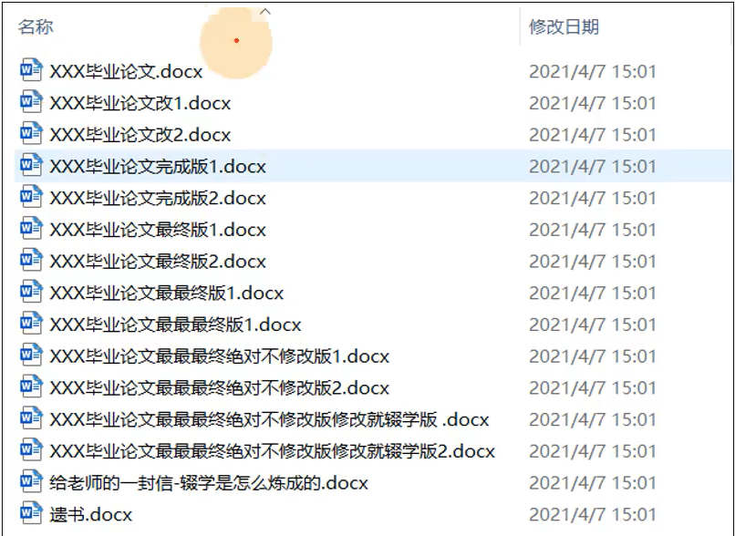

1. 集中式版本控制工具

   > 集中式版本控制工具（Centralized Version Control System，简称CVCS）是一种软件工具，用于==**管理和控制文件的版本**==。它具有以下特点：
   >
   > 1. 中央服务器：CVCS使用一个中央服务器作为代码仓库，所有开发者从该服务器拉取代码，并将代码提交到服务器上。服务器存储所有文件的历史版本和变更记录。
   > 2. 协作开发：开发者可以从中央服务器上获取最新版本的代码，并在自己的工作副本上进行修改。他们可以将修改后的代码提交到服务器，**以便其他人可以获取并==继续开发==**。
   > 3. 文件锁定：CVCS通常支持文件级别的锁定机制，**即当一个开发者正在编辑某个文件时，其他开发者无法同时编辑该文件**，以避免冲突和覆盖修改。
   > 4. 必须联网：CVCS需要开发者与中央服务器进行通信，因此必须处于联网状态才能正常使用。
   >
   > 一些常见的集中式版本控制工具包括SVN（Subversion）和Perforce。
   >
   > > 如果服务器单点故障，如果服务器宕机一个小时，那么一个小时内谁都不能个更新，无法协同工作。
   >
   > 尽管集中式版本控制工具在过去被广泛使用，但随着分布式版本控制系统（如Git）的兴起，越来越多的开发者转向了分布式方式，因为分布式版本控制系统具有更强大的分支和合并功能，并且更适用于协作开发和灵活的工作流程。

2. 分布式版本控制系统

   > 分布式版本控制工具（Distributed Version Control System，简称DVCS）是一种软件工具，用于管理和控制文件的版本。相比于集中式版本控制工具（如SVN），它具有以下特点：
   >
   > 1. 分布式架构：==每个开发者都可以在本地拥有完整的代码仓库，并能够处理版本控制操作。==
   >
   > 2. 没有文件锁定：因为**每个开发者都拥有完整的代码仓库，所以他们可以同时进行修改而无需锁定文件。**系统可以自动合并代码变更。
   >
   > 3. 离线工作：由于每个开发者都有本地版本库，因此他们可以脱机工作，对代码进行修改，然后在联网时将变更推送到其他人。
   >
   > 4. 易于分支和合并：DVCS具有强大的分支和合并功能，使得开发者可以创建和管理多个分支，以便开发新特性、修复问题或测试代码，而且合并变得更加容易和安全。
   >
   > 一些常见的DVCS版本控制工具包括Git、Mercurial和Bazaar。
   >
   > 总体而言，DVCS比CVCS更适合于大型项目和分布式团队开发，因为它具有**更强大的分支和合并能力**，以及更好的**离线工作方式和版本库备份机制。**

3. ==二者区别==

   > 集中式版本控制系统（Centralized Version Control System，CVCS）和分布式版本控制系统（Distributed Version Control System，DVCS）区别:
   >
   > 1. 架构：CVCS采用集中式架构，==所有的代码库和版本历史都保存在中央服务器上==，开发者通过连接到服务器进行操作。而DVCS采用==**分布式架构，每个开发者都有一个完整的本地代码库**==，包含完整的版本历史和所有文件。
   >
   > 2. 依赖性：==CVCS对中央服务器有较大的依赖性，开发者需要实时连接服务器才能进行版本控制操作。==而DVCS不依赖于中央服务器，开发者可以在本地进行版本控制操作，只在需要与他人协作或推送变更时才连接服务器。
   >
   > 3. 并发性：==CVCS在处理并发修改时存在文件锁定的机制==，即同一时间只能有一个开发者对某文件进行修改。而DVCS没有文件锁定，==开发者可以同时对同一个文件进行修改，并通过合并操作将修改结果合并到共享的代码库中。==
   >
   > 4. 分支和合并：CVCS的分支和合并功能相对较弱，需要通过服务器的支持进行操作，并且合并过程可能较为复杂。而DVCS具有强大的分支和合并功能，开发者可以随时创建和管理本地分支，并轻松进行分支合并操作。
   >
   > 5. 灵活性和离线工作：`CVCS在没有网络连接时无法进行版本控制操作，`**依赖于中央服务器**。而DVCS由于每个开发者都有完整的代码库，可以在离线状态下进行版本控制操作，只需要在联网时将变更推送到其他人。
   >
   > 总体而言，DVCS相比CVCS更加灵活、强大和适应分布式团队开发，而CVCS适用于中小团队或者需要严格控制权限和集中管理的项目。选择使用哪种版本控制系统取决于项目的规模、团队协作方式和开发流程的需求。


### Git发展历史

Git是由Linux之父Linus Torvalds在2005年创立的分布式版本控制系统。Git的历史可以追溯到2002年，当时开源版本控制系统BitKeeper公司禁止Linux社区继续使用免费的BitKeeper工具。此时，Linus Torvalds开始着手开发自己的版本控制系统。

以下是Git的主要发展历程：

1. 2005年：Git项目正式启动，==**Linus Torvalds**==发布了Git的第一版，并开始为Linux内核的管理和维护使用Git。

2. 2008年：GitHub网站上线，Git得到了广泛的应用和推广。GitHub提供了一个基于Git的代码托管平台，允许开发者协作开发和分享代码。

3. 2010年：Git成为了Apache软件基金会的顶级项目之一，进一步推动了Git的普及和应用。

4. 2012年：GitHub的用户数量超过一百万，Git在开源社区和商业领域都变得越来越流行。

5. 2016年：Git 2.0发布，引入了一些新功能和改进，并且进一步提高了Git的性能和稳定性。

6. 2018年：微软宣布收购GitHub，这标志着Git作为全球最大的代码托管平台进入了一个新的发展阶段。


### Git工作机制

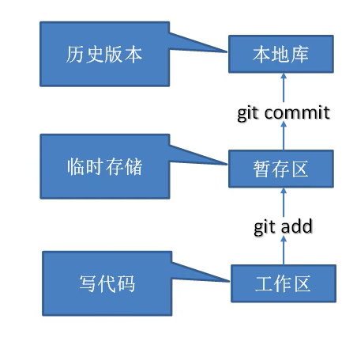 

工作区: 我们代码在本地磁盘的位置


暂存区：git**追踪到我们工作区**，也就是把工作区添加到暂存区git add,**这个时候还没有历史版本**


**[本地库](#本地库): git commit到本地库之后，就有了历史版本啦！**


==工作区和暂存区都是自己可以想删就删的==

> 1. 本地仓库：每个开发者都有一个本地仓库，用于保存项目的完整历史记录和文件版本。本地仓库包含了项目的所有文件、文件夹以及与项目相关的元数据，如提交历史、分支信息等。
> 2. 提交：在 Git 中，你可以通过将文件的修改内容提交（commit）到本地仓库来记录项目的变更。提交是一个原子操作，它会生成一个唯一的标识符（SHA-1 值）来标记这个提交对象，并记录作者、时间戳、提交消息等相关信息。
> 3. 分支：Git 使用分支（branch）来管理不同的代码版本。默认情况下，每个 Git 仓库都有一个主分支（通常命名为 "master"），其他分支则可以基于主分支衍生出来。通过创建和切换分支，你可以在不破坏主分支的前提下进行实验性的开发或并行开发。
> 4. 远程仓库：除了本地仓库，Git 还支持远程仓库，用于团队协作和代码共享。远程仓库通常位于网络上的服务器上，开发者可以与其进行交互，例如推送（push）自己的本地提交到远程仓库，或者从远程仓库拉取（pull）最新的更新到本地。
> 5. 分布式：Git 的分布式特性使得每个开发者都可以具备完整的项目历史记录和文件版本，不依赖于中央服务器。这意味着即使没有网络连接，你仍然可以对代码进行提交、切换分支等操作。当网络恢复后，你可以将本地仓库与远程仓库同步。
> 6. 版本合并和冲突解决：当多个开发者在不同的分支上进行开发，并且试图将它们的修改合并到一起时，可能会出现冲突。Git 提供了强大的合并和冲突解决机制，可以帮助开发者协调共享的代码变更。

本地仓库<a name="本地库"></a>

在 Git 中，**本地仓库是指存储在您的计算机上的代码仓库**。它不是虚拟的，而是实际存在于您的文件系统中的目录。

当您克隆（或初始化）一个 Git 仓库时，Git 将在您的计算机上创建一个==**包含项目所有历史记录和代码的目录**==。**这个目录就是本地仓库**。

**它包含了存储在 `.git` 子目录下的各种文件和子目录，这些文件和子目录记录了项目的元数据、分支、提交历史等信息。**

==**本地仓库是与远程仓库（例如 GitHub、GitLab）同步的基础。**==

本地仓库中进行代码修改、创建新分支、提交更改等操作，然后将这些更改推送到远程仓库或从远程仓库拉取最新的更改。

`及时的进行git add和commit`提交到本地库


### ==Git和代码托管中心==

[团队协作](#团队协作)

代码托管中心是基于网络服务器的远程代码仓库==远程库==

在本地库之后可以推送到远程库push

---

> 局域网：GitLab
>
> 互联网:Github，Gitee码云


## Git安装

[淘宝镜像Git](https://registry.npmmirror.com/binary.html?path=git-for-windows/)

[git安装教程](https://blog.csdn.net/qq_38952352/article/details/127656385?ops_request_misc=&request_id=&biz_id=102&utm_term=git的安装&utm_medium=distribute.pc_search_result.none-task-blog-2~all~sobaiduweb~default-2-127656385.nonecase&spm=1018.2226.3001.4187)

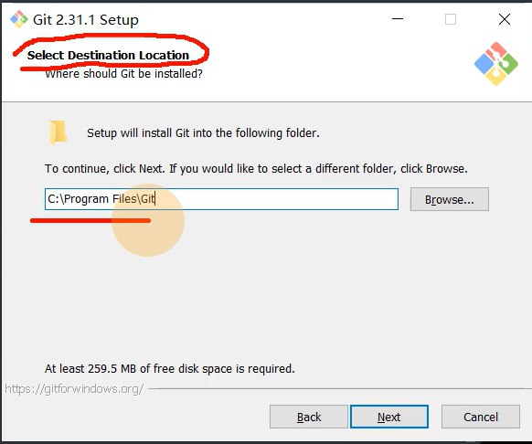 

==**非中文的，没有空格的！路径**==

 

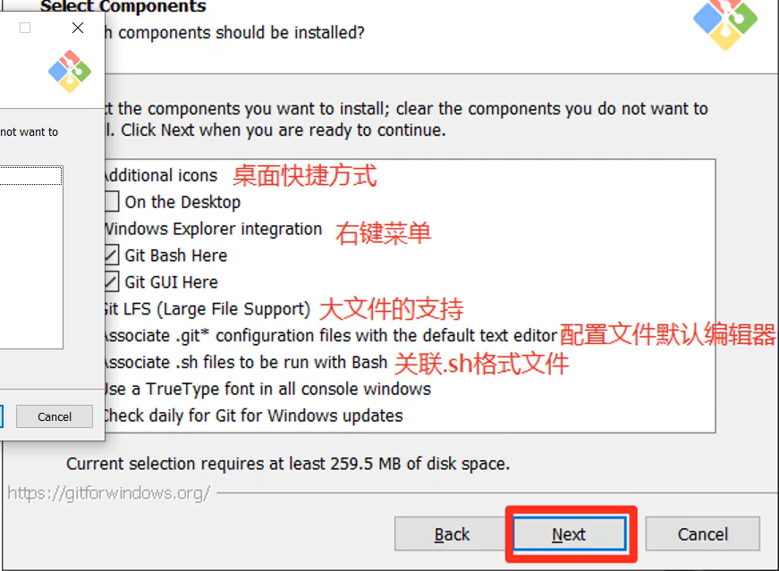 

默认好了

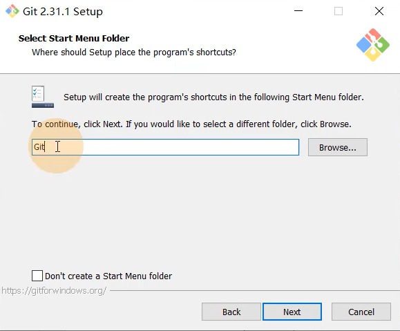 再次确认是否在Git下

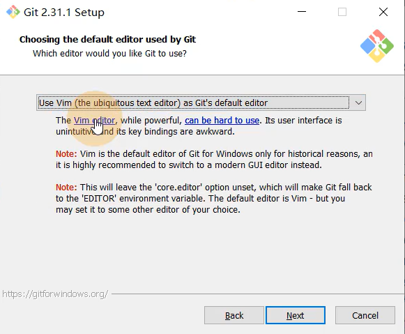 选择默认的编辑器VIM好了

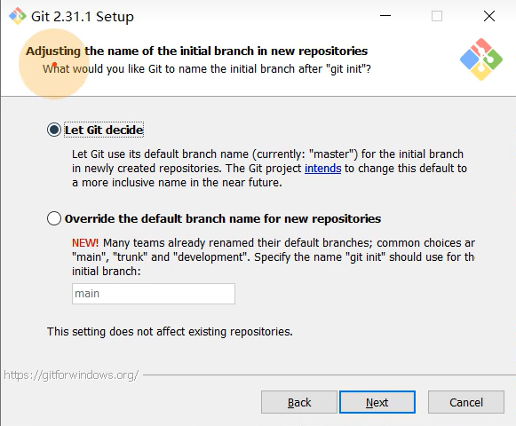 是否要修改初始化分支的名

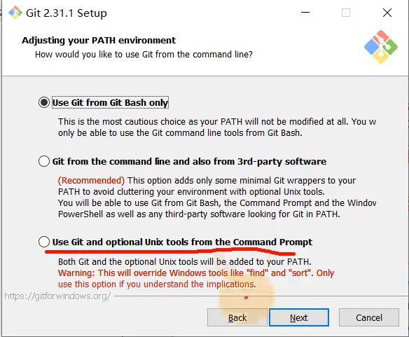 

第二个是在cmd里面也可以用git，

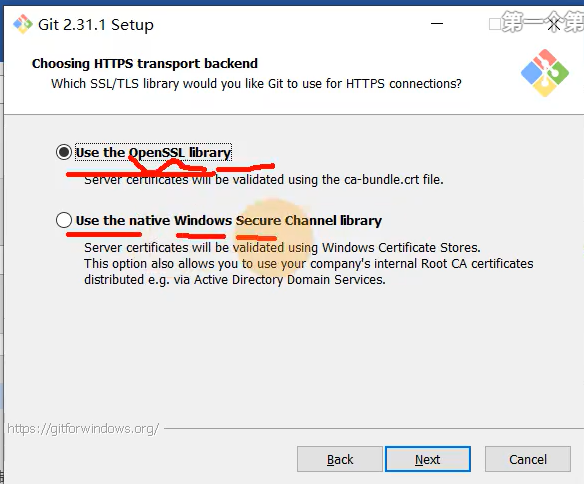 默认的协议

```
git --version
```

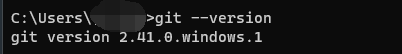 

检查是否安装成功，和版本

```
where git
```

就能看到我们git安装的位置了

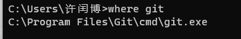 

## Git的常用命令

**最好用github的邮箱，git不会检查你的邮箱格式是否正确**

==**签名的作用就是区分不同操作者身份**==

**去windows的用户下面找到.gitconfig**就能看到我们的信息

```
[user]
	name = xurunbo
	email = 1982830095@qq.com
[credential "https://gitee.com"]
	provider = generic
[http]
	sslverify = false
[gui]
	recentrepo = D:/gitBOx/j3dr
[credential]
	helper = cache

```

### 设置用户签名 git cfg

| 命令名称                                | 作用           |
| --------------------------------------- | -------------- |
| git config --global user.name 用户名    | 设置用户签名   |
| git config --global user.email 用户邮箱 | 设置用户签名   |
| **git init**                            | 初始化本地库   |
| **git status**                          | 查看本地库状态 |
| **git add 文件名**                      | 添加到暂存区   |
| **git commit -m "日志信息" 文件名**     | 提交到本地库   |
| **git reflog**                          | 查看历史记录   |
| **git reset --hard 版本号**             | 版本穿梭       |

想在哪里使用git

> 1. cd到相关路径
> 2. 在目标路径下右键git

### git init初始化本地库

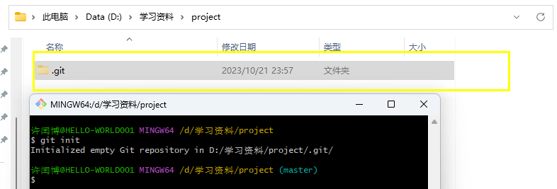 

git init就可以初始化本地库了

默认是隐藏的

Linux语法 -a看到隐藏的文件

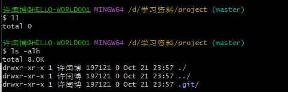 

### git status 查看本地库的状态

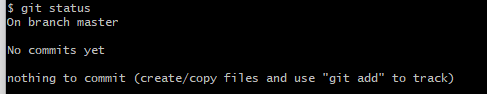 

on branch master默认在主分支上

no commits yet没有任何提交过

nothiing to commit 也没有什么东西需要提交

现在我们修改一下

```
vim hello.txt
```

输入一些内容

再次查看本地库的状态

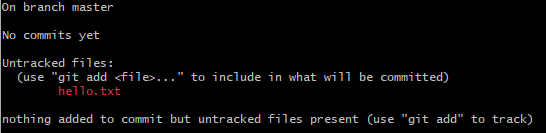 

说明发现了未被追踪的文件，没有追踪，只是在工作区

没有添加任何东西，但是已经有一个未被追踪的文件

---

### git add 文件添加到暂存区

换行？windows是crlf，Linux是lf

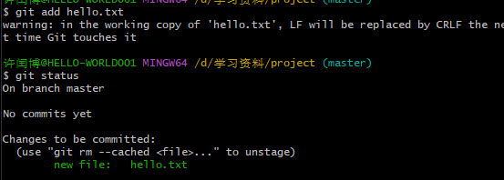 

说明git知道你的hello.txt,git已经追踪这个文件了。也可以删除

```
git rem --cached 文件
```

把暂存区的给删除了


### git commit -m "日志信息" 文件

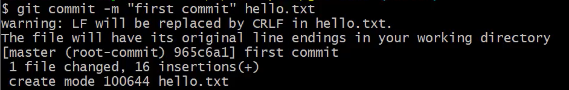 

965c6a1就是版本号

 

跳过了，工作树是干净的


### ==查看日志git reflog/log==

```
git reflog
```

> `git reflog` 命令可以列出所有本地仓库中的 Git 引用的修改历史，==**包括分支、标签和 HEAD 引用。它显示的是每个引用上的操作历史，**==哪些提交对该引用进行了修改以及何时进行了修改。这些操作包括新建、删除、重命名或移动引用等。

领导的身份查看，能看不同分支的提交

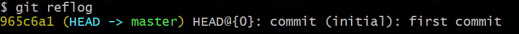

```
git log
```

更详细，能看到谁提交的以及日期

==看的是当前分支当前HEAD指向的版本以前的提交记录==

假如说我的master提交了两次

我现在新建了一个分支a

我在分支a上相当于复制了master的两次提交，是独立的.

但是当我reset 让head指向master带来的第一次提交时候

git log就只能看到第一次提交了

我reset让head指向master带来的第二次提交时候

git log就看到第一和第二次提交了

同理，我让head指向我现在所在分支的new 提交的时候就能看所有的提交了，包括从master带来的

总之让HEAD指向你所在分支的最新一次提交，就能看到所有的log记录了

==**通过 `git reset` 命令移动 HEAD 指针可以让您查看不同的提交记录。当您让 HEAD 指向某个分支或提交时，Git 会重新计算从该提交版本开始的提交历史，并将其作为新的基准点。这样，之前隐藏的提交记录就会被包含在 Git 日志中。**==

> `git log` 命令用于查看==**指定分支的提交历史（或者默认情况下查看当前分支的历史）**==，它会按照时间倒序列出所有的提交记录，并显示每个提交的 SHA-1 校验和、作者、提交时间、提交注释等信息。您还可以使用 `git log` 命令的一些选项来限制要查看的提交数量、显示特定的文件变更等。


### 修改文件

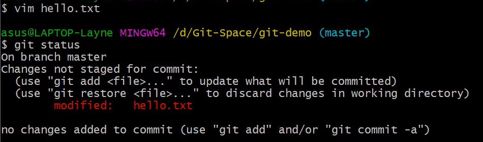

说明我们现在工作区的文件还==**没有被git追踪没有添加到暂存区**==

```
git add hello.txt
git status
```

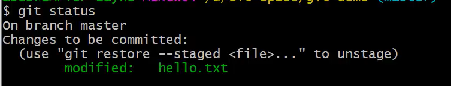 

被添加到暂存区了，然后开始提交到远程库

```
git commit -m "第二次提交" hello.txt
```

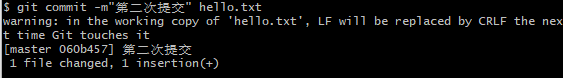 

```
git reflog
```

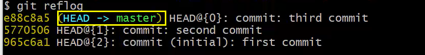

说明当前指针指向的是第三个版本

直接cat 看的就是第三个版本的内容


> 工作区文件被修改
>
> ```
> git status
> ```
>
> 就会冒红
>
> 把被修改的文件添加到暂存区就变绿了
>
> ```
> git add 文件
> ```
>
> ，就可以提交到远程库了
>
> ```
> git commit -m"第n次提交" 文件
> ```
>
> 提交历史中每个提交都有一个唯一的标识符，这个标识符通常称为 "提交哈希值" 或 "提交ID"。它是一个由40个十六进制字符组成的字符串，用于唯一标识一个提交。
>
> 提交哈希值
>
> 060b457964e4daa7b8c4445445521b473d802f6f
>
> 前7位 `060b457` 是这个提交的简短版本号,用来快速识别提交


### 历史版本

```
git reflog
```

能看到有多少个版本号

```
git log
```

**更详细的日志，能看到谁提交的.以及提交日期**

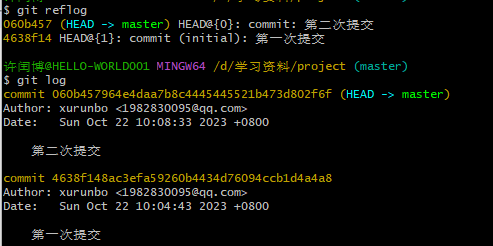 


### 版本穿梭 git reset --hard 版本号

1. 先查看版本号信息

   ```
   git reflog
   ```

   直接就看到七位的

   ```
   git log
   ```

   ==当前分支下==拿到版本号*前七位*

2. ```
   git reset --hard 要穿梭的版本号
   ```

   指针就实现了要穿梭的版本

   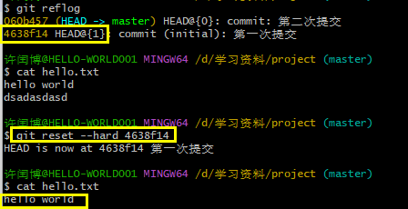 

   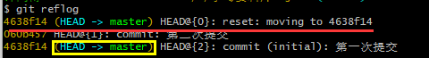 

   ==**第一行是说明我们的命令要穿梭到4638f14这个版本**==

3. 此时cat就可以看到历史的版本内容了

文件的变化

> 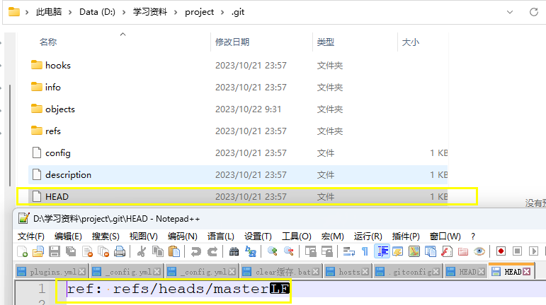
>
> 当前是在master这个分支下
>
> 哪个版本呢？
>
> 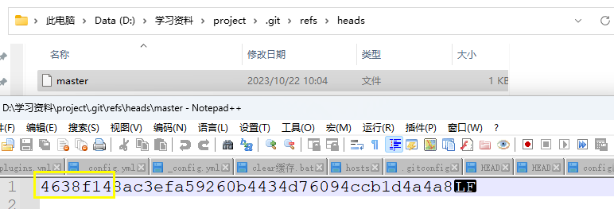
>
> git切换版本，==**底层是移动的HEAD指针**==：
>
> 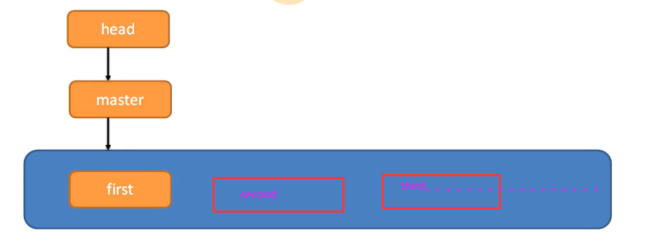
>
>  
>
> 在 Git 中，`git checkout` 命令可以通过两种方式指定要切换的提交：
>
> *一种是使用简短版本号，另一种是使用完整的提交哈希值。*
>
> 当您使用简短版本号（通常是提交哈希值的前几位字符）作为参数执行 `git checkout` 命令时，Git 会尝试根据提供的简短版本号匹配到唯一的提交。如果找到了唯一的匹配项，Git 就会将 HEAD 指向该提交，并切换到该提交。
>
> 例如，如果有一个提交哈希值为 `060b457964e4daa7b8c4445445521b473d802f6f`，那么您可以使用 `git checkout 060b457` 或 `git checkout 060b4579` 来切换到该提交。
>
> **使用完整的提交哈希值作为参数执行 `git checkout` 命令则更加明确和精确。无论提交哈希值有多长（通常是40个字符），Git 都可以直接定位到对应的提交，并进行切换。**
>
> 使用简短版本号或完整的提交哈希值都可以用于 `git checkout` 命令来切换到特定的提交。简短版本号是提交哈希值的一部分，用于快速识别提交，而完整的提交哈希值则是唯一且精确地标识一个提交。
>
> ---
>
>  `git checkout` 命令提供一个具体的提交哈希值时，Git 会将 HEAD 指向该提交，并处于 "detached HEAD" 状态。这意味着**不在位于任何分支上**，而是直接位于特定的提交上。
>
> 为了防止在 "detached HEAD" 状态下进行的提交被丢失，Git 帮您自动创建了一个临时分支，以便保留您所做的更改。
>
> 这个临时分支没有名称，通常称为 "无名分支" 或 "匿名分支"。它只存在于您当前的工作区中，不会影响到其他分支的进展。
>
> 您可以在这个 "无名分支" 上进行实验性的更改和提交。如果您希望保留这些提交，可以随时将其转换为具有名称的分支，如命令输出中所示：
>
> ```
> git switch -c <new-branch-name>
> ```
>
> 这将创建一个新的分支，并将它指向当前的 "无名分支"。然后，您可以在新分支上继续进行提交，并且这些提交将得到保留。
>
> 如果您希望放弃当前的 "无名分支"，可以使用以下命令撤销操作：
>
> ```
> git switch -
> ```
>
> 这将使 HEAD 返回到之前的位置，即切换回原来分支的状态。
>
> 请注意，创建临时分支的目的是为了保护您在 "detached HEAD" 状态下所做的更改，以防止意外丢失。在实际开发中，建议基于这个临时分支创建一个具有合适名称的新分支，并在那里继续工作，以确保提交的持久性和可追溯性。

### Git快速复制和粘贴

鼠标左键两下    复制

鼠标中键    粘贴


### Git删除跟踪

删除已经被 Git 跟踪的这些文件。您可以使用以下命令将这些文件从 Git 的跟踪中移除（注意，这不会删除实际的文件）：

```
git rm --cached -r .idea
git rm --cached -r *.iml
```


## Git分支操作

### 分支的介绍

在版本控制过程中，同时推进多个任务，为了每个都可以独立的玩

开启副本,(分支)

:同时并行推进多个功能开发，提高效率

### 分支的操作

| 命令名称            | 作用                             |      |
| ------------------- | -------------------------------- | ---- |
| git branch 分支名   | 创建分支                         |      |
| git branch -v       | 查看分支                         |      |
| git checkout 分支名 | 切换分支                         |      |
| git merge 分支名    | 把指定的分支**合并到当前分支上** |      |


### 查看分支git branch -v

```
git branch -v
```

 

*代表我们当前所在的分支

后面代表的是HEAD指针当前指的本本，和对应的日志信息


### 创建分支git branch 分支名

```
git branch hot-fix
```

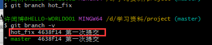 

> 新分支会在当前所在的提交上创建。
>
> 这意味着新分支将包含==**与当前分支相同的代码快照**==（即**相同的提交历史和文件内容**）。
>
> 创建分支后，默认情况下，您仍然停留在当前分支，新分支并未成为当前活动分支。
>
> ==**每个分支都有自己独立的提交历史和文件状态**==

### 切换分支git chekout 分支名

```
git checkout 要切换到的分支
```

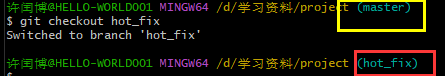 

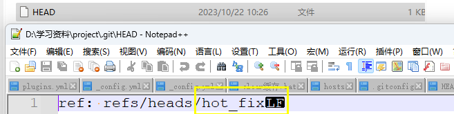 

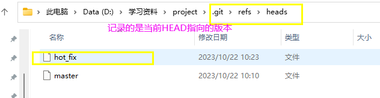 

### 合并分支git merge 分支名

#### 正常合并

```
git merge 要合并到当前分支的分支
```

 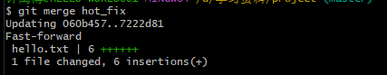 

git merge后git的历史记录的基点还在原来的位置

#### 冲突合并

> 两次修改
>
> 两次提交
>
> 一次merge
>
> 

==**两个分支在同一个位置出有两套完全不同的修改**==Git无法选择的时候,需要人为的修改

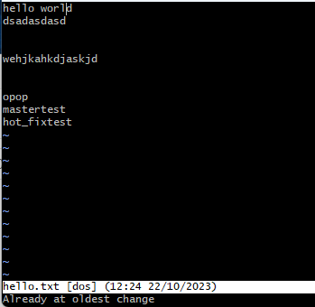 原来的状态

1. 在master下对hello.txt文件的第一行进行修改

    

2. 提交到暂存区和本地库

   ```
   git add hello.txt
   git commit -m "mastertest" hello.txt
   ```

   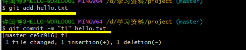 

3. 切换到hot_fix分支

4. 也对同一个文件进行编辑

    

   ```
   vim hello.txt
   在第一行也修改
   ```

5. 提交到暂存区和本地库

   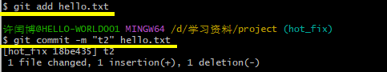 

6. 回到master分支进行合并

   ```
   git merge hot_fix
   ```

   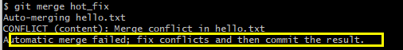 

   Git帮我i们自动合并不了了

   此时会进入master|merge状态

7. 编辑冲突的文件

   ```
   vim hello.txt
   ```

    

   <<<<<和=包起来的是当前分支的内容，=和>>>>>>抱起来的是和过来的分支的内容

   手动保留并且删掉现在用于区分的行

   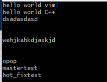 

8. ==**然后提交暂存区和本地库**==

   ```
   git add hello.txt
   ```

   ★★★★★★

   ```
   git commit -m "mergecommit"
   ```

    

   ```
   # 完成合并并解决冲突
   git merge <branch-name>
   
   # 确保所有更改都正确添加到工作区
   
   # 提交整个合并结果
   git commit -m "Merge branch <branch-name>"
   ```

   这时不需要指定文件名

   如果指定了就会报错

   ```
   git commit -m "mergecommit" hello.txt
   ```

    

   并且会合并一个分支在master下

   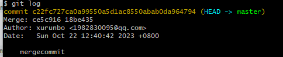 

   **但是不影响hot_fix下的内容，独立哦**智慧修改合并的分支不会修改来合并的那个


#### 合并的原理

> HEAD是指向那个分支的指针 
>
> refs下单分支名文件存的是对应的版本号


## <a name="团队协作">Git团队协作</a>

团队协作

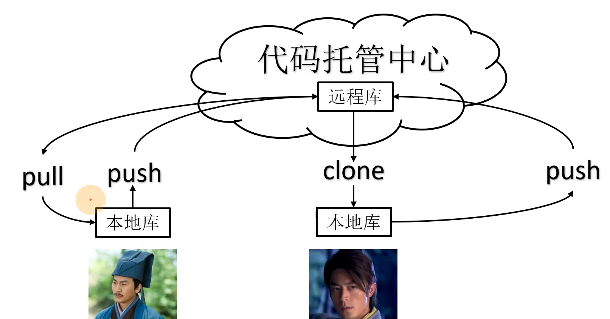

跨团队协作

作为团队外 的人修改。

先fork再clone修改

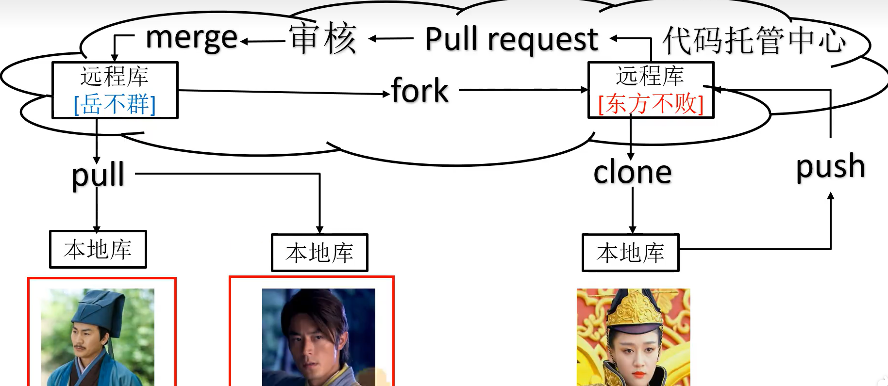

## GitHub操作

### 创建远程仓库

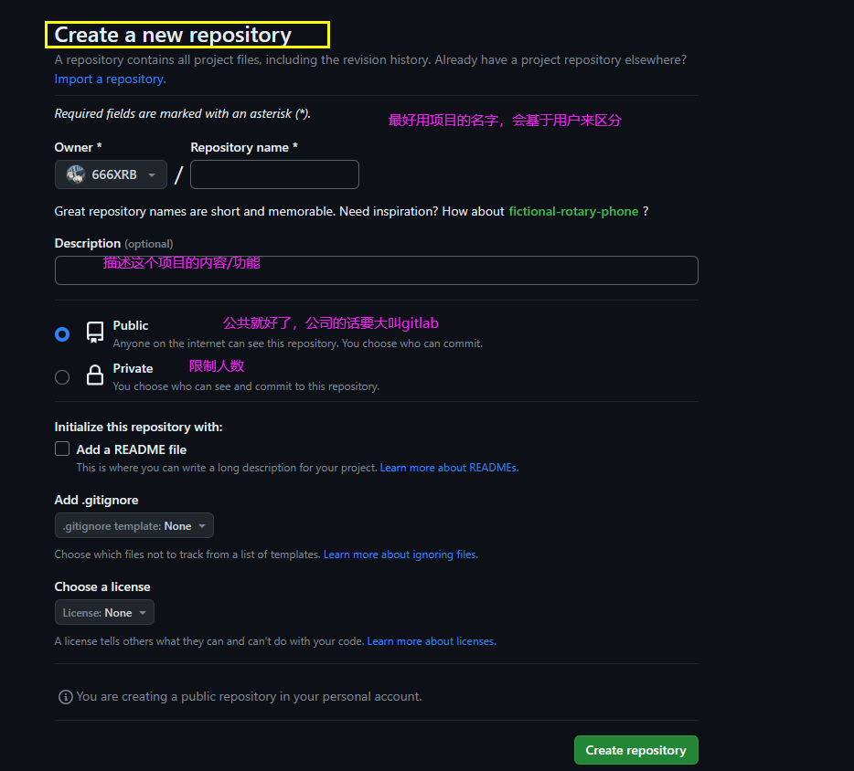


创建好后

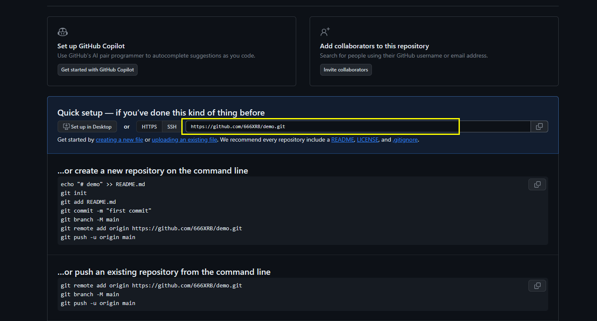

得到远程库的链接


### 创建别名

前提确保当前所在的目录是一个 Git 仓库

```
git remote add 别名 远程库链接
```

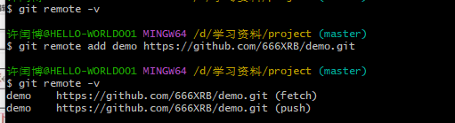 

```
git remote -v
```

查看别名


### 本地库推送到远程库push

不是谁都可以push的，一是我们自己，[加入成员](#V)的成员

```
git push 别名/远程库链接 分支
```

最小单位是分支

不是文件

然后刷新网页久能看到

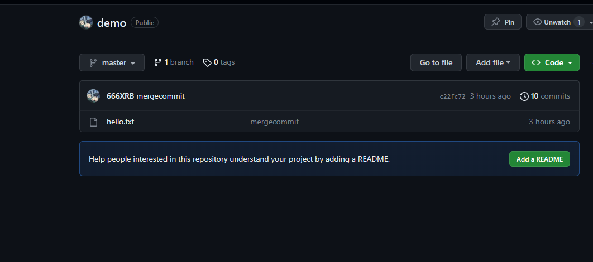


### 更新(拉取远程库到)本地库pull

拉取是在原有基础上合并当前代码，克隆是克隆到文件夹，前者要登录

修改内容

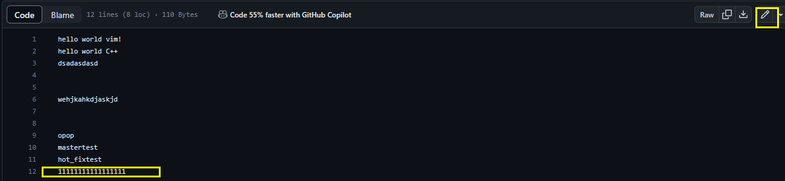

拉取本地库

```
git pull 远程库别名/链接 分支
```

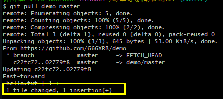 

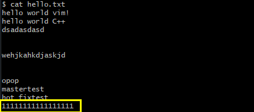 

拉取动作会自动帮我们提交本地库

 

### 克隆远程库到本地

==**克隆是不需要登录账号的**，也没有认证，也不需要加入团队，Public==

克隆是我们现在本地库没有的

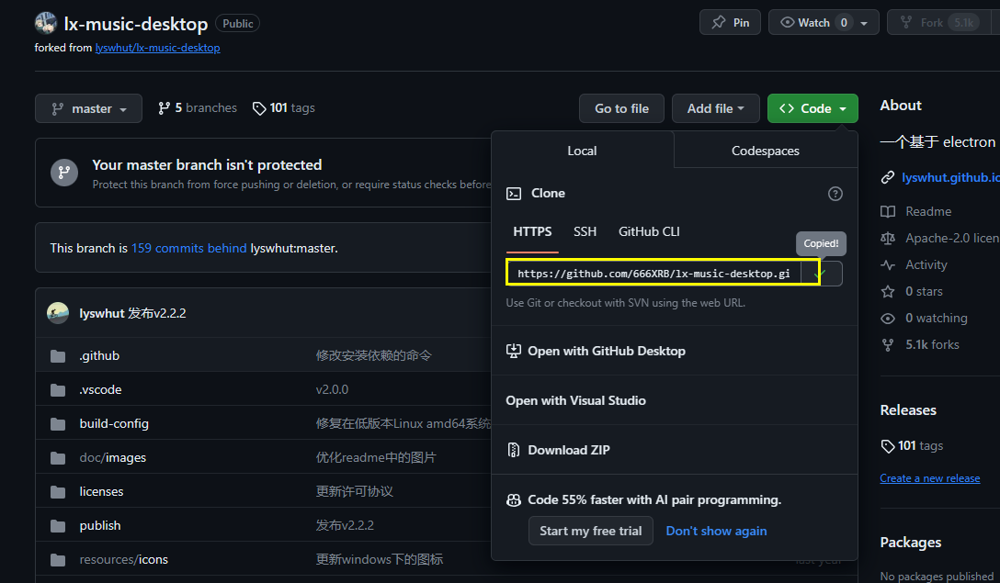 

先拿到项目的远程库链接

```
git clone 远程库的链接
```

起别名需要我们当前目录下是个git仓库，也就是有.git文件夹

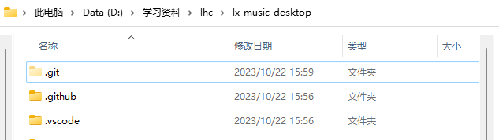 

 


Git clone会帮我们干三件事

> 1. 拉取源代码
>
>     
>
> 2. 初始化本地仓库
>
>     
>
> 3. origin作为这个远程库的别名
>
>     


### <a name="加入团队">github加入团队</a>


创建一个团队工作的项目在github上

进入项目

 

只需要对方的名就可以了


然后复制这个邀请函给对方就可以了

对方点击后

 就可以选择接受和委婉拒绝了


### ssh免密登录

==**个人的windows连接到github就不需要频繁登录了**==

> 要在本地生成 SSH 密钥对，可以按照以下步骤进行操作：
>
> 1. 打开终端或命令提示符窗口。
>
> 2. 输入以下命令来生成 SSH 密钥：
>
>    ```
>    shellCopy Codessh-keygen -t rsa -b 4096 -C "your_email@example.com"
>    ```
>
>    这里将 `your_email@example.com` 替换为**您关联的电子邮件地址**。此邮箱将作为 SSH 密钥标识符的一部分。
>
>    > 这两个参数是用于生成 SSH 密钥对时指定密钥类型和密钥长度的。`-t` 参数指定密钥类型，常见的有 RSA、DSA 和 ECDSA；`-b` 参数指定密钥长度。4096 是一般安全性设置下的推荐值，可以提供更加安全的密钥。的机器资源有限或者您要求更快的操作速度，也可以使用更短的密钥长度。
>
> 3. 按 Enter 键接受默认的文件保存路径和文件名（通常是 `~/.ssh/id_rsa`）。
>
> 4. 接下来，您可以选择为密钥对设置一个密码。如果您希望在使用私钥时输入密码以提高安全性，请设置密码，并确保记住它。如果不想设置密码，直接按 Enter 跳过。
>
> 5. 此时，`ssh-keygen` 命令会生成两个文件：私钥文件（`id_rsa`）和公钥文件（`id_rsa.pub`）。
>
> 6. 公钥 (`id_rsa.pub`) 是需要在远程服务器上进行配置的部分。使用文本编辑器打开公钥文件，将其中的内容复制到粘贴板中。
>
> 7. 登录到您要访问的远程服务器的帐户（例如 GitHub、GitLab 或其他主机）。
>
> 8. 在远程服务器的用户设置或配置页面上，找到 SSH 密钥相关的选项，然后添加公钥。

  

在~/.ssh生成两个钥

 

 

就可以免密登录了，使用ssh来pull

```
git pull ssh的协议链接
```


## Git跨团队协作

作为团队外的人

先fork有问题的项目

然后增添修改，可以在github上修改

也可以clone，在本地库上修改.


 

可以发起pull请求

 

可留下一段话，可以看哪里被修改了

然后就发起pull request


## [2023最新版IntelliJ IDEA安装教程](https://blog.csdn.net/Javachichi/article/details/131302807?ops_request_misc=%7B%22request%5Fid%22%3A%22169796587616800225570949%22%2C%22scm%22%3A%2220140713.130102334..%22%7D&request_id=169796587616800225570949&biz_id=0&utm_medium=distribute.pc_search_result.none-task-blog-2~all~top_positive~default-1-131302807-null-null.142^v96^control&utm_term=idea安装教程2023&spm=1018.2226.3001.4187)


## IDEA集成Git

### 配置Git忽略文件

### 什么是ignore文件

> `.gitignore` 文件（通常称为 "ignore 文件"）是 Git 版本控制系统中的一个文件。它用于指定哪些文件和目录应该被 Git 忽略，从而使 Git 在执行诸如提交、合并等操作时不会将这些文件包含在内。
>
> 例如，您可能需要忽略以下文件或目录：
>
> - 临时文件或日志文件
> - 编译生成的二进制文件
> - IDE 或编辑器生成的配置文件
> - 敏感信息、密码或机密信息的配置文件
>
> 如果这些文件被包含在 Git 版本库中，会导致版本库变得庞大且难以维护。使用 `.gitignore` 文件，您可以确保这些文件被 Git 忽略，同时保持版本库的清洁和可维护性。

为什么忽略？


 不想要这些东西

与项目的实际功能无关。不参与在服务器的运行.

屏蔽掉久能忽略IDE之间的差异


创建xxx.ignore文件

```
.jar
.zip
.gzip
.xml
###忽略.json文件
*.json
```

### IDEA继承git步骤

1. 先找到我们git安装的位置

   ```
   whiere git
   ```

2. idea配置

   

3.  

   VCS 是 Version Control System

   这一步是

   ```
   git init
   ```

   本地库的初始化,生成.git文件

4.  

   选择文件/文件进行add或者commit

5.  

6. 外部git验证

    

### ignore的作用

 

上传后没有idea什么的文件


idea创建新的 分支

 


### 分支合并


### Idea添加github


权限拉满-生成


### 分享项目到GitHub


### 克隆远程库到本地


## 码云

### IDEa继承码云

操作同github


## GitHlab


