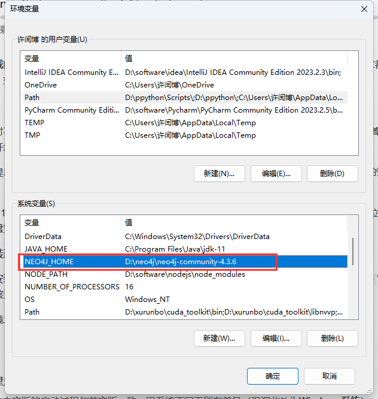
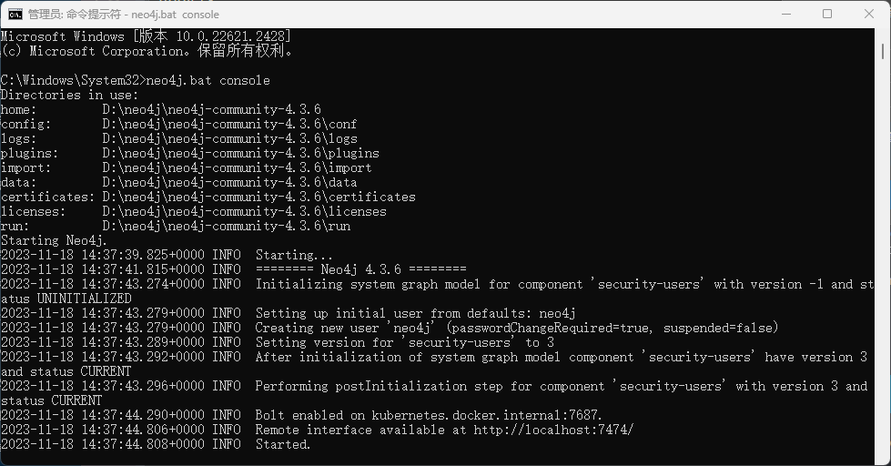
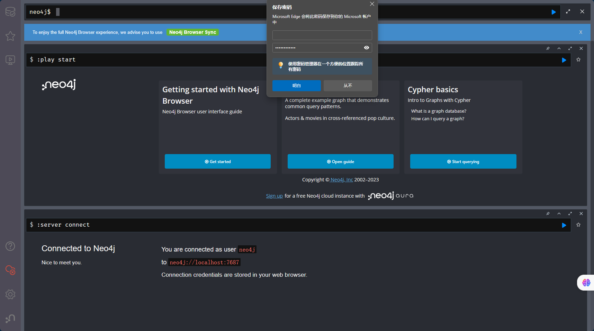
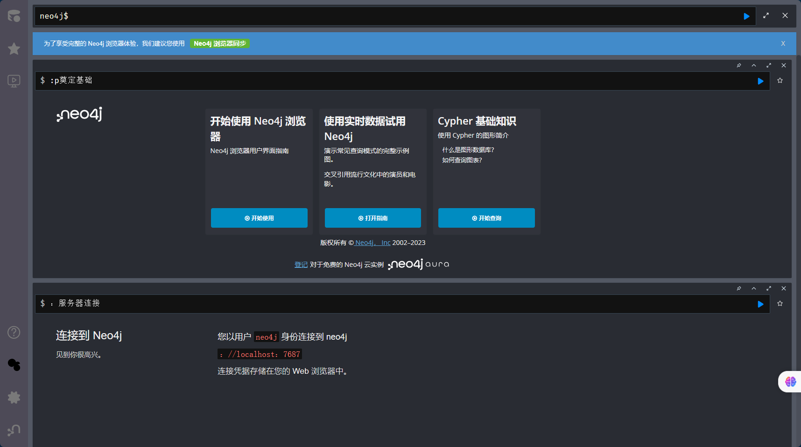

# Graph


---

图数据库    是   基于   图模型    的    数据库  。

图数据库的主要功能是 ：管理图数据，支持 ==高效的顶点/边查询和更新==;

通常需要添加事务支持，以保证==并发操作==的正常运行


> **图数据库的功能是传统关系型数据库的延伸。**与关系型数据库相比，
>
> 图数据支持的图结构更加灵活。图数据库在基于图的数据增删、查询和修改等方面与其他数据库不同。在图数据的运算抽象上，**采用基于顶点的透视，例如，一个顶点通过其所有传出边访问其相邻的顶点。**这种操作也是图数据库系统设计的核心。

### 性能:

处理数据之间的关系，在关系型数据库中不可避免地会使用表JOIN操作，这对性能有很大的影响。

==图数据库是一种直接访问，类似于指针访问，==它对关联数据的**操作效率更高**，相比关系数据库**性能提升**了2到4个数量级。

### 兼容

数据的内容甚至格式都在不断变化。在关系数据库中，这意味着表结构的更改或多个新表的创建会显著更改源数据。==在图形数据库中，只需添加新的顶点、边和属性，并将它们设置为相应的类型即可。==从本质上讲，表代表一种数据类型，一个顶点代表一种特定的数据，这意味着关系型数据库更关注数据类型，而图数据库更关注数据的个体，识别它们的关联关系。

### 直观

如果使用关系数据，则需要高度抽象的思维，首先构建字符表，然后是关系表，最后是数据映射。在分析和查询图数据时，

**点边连接拓扑直观地交互式找到需要的数据，无需任何专业知识。**

| 分类       | 型     | 优势                               | 缺点                                   | 例             |
| ---------- | ------ | ---------------------------------- | -------------------------------------- | -------------- |
| 关系数据库 | 表结构 | 数据高度结构化、一致，软件成熟度高 | 多跃点关联查询效率低下或不受支持       | MySQL、预言机  |
| 图形数据库 | 图结构 | 建模和操作关联非常有效             | 高度结构化的数据处理不如关系数据库强大 | Neo4j、TuGraph |


### 。。。》》》

面对海量数据存储和处理问题，==传统的关系型数据库已经无法满足大部分日常数据存储需求。图数据库技术可以将关系信息存储为实体，灵活扩展数据模型。==因为它提供了相关数据最直接的表达，而且图模型对异构数据具有天然的容忍度。未来，==图数据库技术将成为最流行的技术之一，将为企业存储和分析大规模图数据提供有力支撑。==

### TuGraph 社区版的主要特点和特点，以及 TuGraph 企业版和社区版的区别。


图数据库是一种==非关系型数据库==，按顶点和边存储数据。它可用于存储复杂的数据网络模型，例如社交网络和交易网络。TuGraph是蚂蚁集团开发的图数据库。本手册介绍了 TuGraph 的功能和使用方法。

社区版是 TuGraph 的全功能版本，适用于单实例部署。它提供了完整的图数据库基本功能，例如ACID兼容事务、编程API和相关工具。它是学习 TuGraph 和实施小型项目的理想选择。


 

支持的数据类型

| **类型** | **最小值**                 | **麦克斯**                 | **描述**                                         |
| -------- | -------------------------- | -------------------------- | ------------------------------------------------ |
| 布尔值   | 假                         | 真                         | 布尔                                             |
| INT8的   | -128                       | 127                        | 8 位整数                                         |
| INT16的  | -32768                     | 32767                      | 16 位整数                                        |
| INT32的  | - 2^31                     | 2^31 - 1                   | 32 位整数                                        |
| INT64的  | - 2^63                     | 2^63 - 1                   | 64 位整数                                        |
| 日期     | 0000-00-00                 | 9999-12-31                 | “YYYY-MM-DD” 格式日期                            |
| 日期时间 | 0000-00-00 00:00:00.000000 | 9999-12-31 23:59:59.999999 | “YYYY-MM-DD hh：mm：ss[.ffffff]”日期和时间的格式 |

| 浮     |      |      | 32 位浮点数      |
| ------ | ---- | ---- | ---------------- |
| 双     |      |      | 64 位浮点数      |
| 字符串 |      |      | 可变长度的字符串 |
| 斑点   |      |      | 二进制数据       |

 


---


### 功能性

部署方式 TuGraph 目前提供三种部署方式：

+ 云部署、
+ Docker 部署和
+ 本地包部署。

用户可以根据自己的实际情况选择合适的部署方式。

### 软硬件环境

TuGraph 核心是用 **C++ 开发的**，默认使用的编译器是 **GCC8.4**，**使用 c++14 标准。有些函数使用其他编译器**，例如基于 ApacheLucene 的全文索引，它使用 JNI 接口并需要 Java 编译器。此外，存储过程中提供了 Python 过程 API，这需要 Python 环境。==TuGraph 不需要 GPU 等特殊硬件，可以自然适配高时延、低带宽的 RDMA、HBM 等通用硬件升级。==

TuGraph 已经在基于 X86 和 ARM 的 CPU 上进行了测试，包括 Intel、AMD、鲲鹏、海光、飞腾等，还可以运行在多种操作系统上，包括 Ubuntu、CentOS、SUSE、银河麒麟、中标麒麟、UOS 等主流版本，==对操作系统和 CPU 没有特殊要求。==

软件和硬件环境还包括==**依赖库的环境。由于 TuGraph 存储层默认的 KV 存储是 LMDB，因此文件系统需要支持 POSIX 接口。**==

不同环境下的编译和参数配置会略有不同。例如，在图存储中打包点边数据时，应匹配操作系统的页表大小，默认为4KB，建议将系统的页表大小设置为4KB。                           


### 存储层

从存储层的角度来看，==TuGraph 采用直观的多层树模型，没有跨子图的标签，也没有跨标签的属性，只保留了图模型的核心逻辑。==在子图存储方面，TuGraph 对多个图进行了数据物理隔离，每个图对应一个 LMDB 实例。多个图的元数据描述信息保存在一个名为 meta 的特殊公共 LMDB 实例中。顶点和边缘标签及其属性的存储自适应地将图形数据映射到 KV 键值对，从而最大限度地提高读取性能。同时，在KV层实现了多线程写入，解决了LMDB写入性能低下的缺点。主键索引和二级索引对应LMDB中的B+表，支持基于比较的索引值增删、查询和修改。

存储层还保留了一些其他非核心功能数据，包括权限数据、预编译插件数据、监控数据等。

 

### 核心功能

TuGraph 提供遵循 OpenCypher 标准的 Cypher 图查询语言。

- 支持过程嵌入。
- 支持具有各种优化功能的可插拔优化框架。
- 支持 Cypher 的可扩展安全检查框架。


当用户需要表达 Cypher 无法描述的复杂查询/更新逻辑时，或者需要高性能时，TuGraph 的存储过程（Procedure）是比调用多个 REST 请求并在客户端完成整个处理流程更简洁高效的选择。


虽然 TuGraph 支持数据插入，但批量导入可以大大提高效率。导入功能可分为导入到空数据库（离线导入）和增量导入。前者是指在子图为空时导入，附加的假设可以大大提高导入性能。在 TuGraph 中，空数据库导入和增量导入的吞吐率相差 10 倍。数据导出时需要考虑数据一致性，这是基于快照导出数据。

TuGraph 可以使用命令行工具对已经存储在 TuGraph 中的图数据进行数据导出。导出格式支持 CSV 和 JSON。


TuGraph 的备份功能可分为主动/定时备份、离线/在线备份和全量/增量备份。目标是以尽可能小的存储和计算成本完成备份。Restore 功能可以恢复到最新状态或历史标记的时间点，确保数据库处于一致状态。

TuGraph 是一个基于磁盘的图形数据库，只有在访问数据时才会将数据加载到内存中。因此，在服务器打开后的第一个周期内，由于频繁的IO操作，系统性能可能会下降。我们可以通过提前预热数据来改善这个问题。

客户端工具 客户端工具主要包括各种编程语言的 SDK、OGM 和命令行工具。

客户端SDK主要用于二次开发，可以通过RPC或REST协议链接到服务器。RPC基于长链接具有更好的性能，数据需要通过protobuf统一序列化。TuGraph 使用 brpc，它支持 Java、Python 和 C++ 中的 rpc 客户端。REST的协议更加灵活，可以很容易地适应更多样化的环境，不同的编程语言可以很容易地连接起来。TuGraph 提供了一个 Python REST 客户端实例，命令行交互也是使用 REST 实现的。

OGM（Object Graph Mapping）是TuGraph的图对象映射工具，支持将JAVA对象（POJO）映射到TuGraph。JAVA 中的类映射到图中的节点，类中的集合映射到边，类的属性映射到图对象的属性。它还提供了相应的功能来操作图数据库。因此，JAVA 开发人员可以在熟悉的生态系统中轻松使用 TuGraph 数据库。

命令行工具是一个查询客户端，可用于向 TuGraph 服务器提交 OpenCypher 请求。 客户端有两种执行模式：单命令模式和交互模式。


| **场景**       | **描述**                                                     |
| -------------- | ------------------------------------------------------------ |
| 贷款审查       | 通过分析申请人的关系和交易历史等，辅助判断申请人的还款能力和意愿。可应用于零售贷款审核、小微贷款审核、供应链金融等。该方法可以补充基于申请人自身信息的传统审计机制，对于个人信息覆盖率较低的小微贷款审计尤为有用。 |
| 贷后           | 通过分析借款人的交易历史，有助于分析借款人是否存在违约风险。相较于传统仅当借贷资金流向特定用户时发出告警的方法，该方法可以为每个账户分配一个风险值，并在借款流向高风险账户时发出告警。 |
| 缺少恢复       | 通过分析失踪借款人的社交和购物数据，可以找到其他联系方式。这种方法可以显著提高失踪借款人的回收率。 |
| 担保回路检测   | 在担保关系图中可以找到循环、链式、家族式、交叉等特殊担保结构，以暴露潜在风险。与关系型数据库的JOIN方法相比，基于图算法的求解效率更高，可以检测任意长度的保证循环，可以实现更复杂的有限条件检测。 |
| 信用卡欺诈检测 | 构建信用卡申请信息中的地址、联系方式等关系网络，在应用关系网络中运行社区发现算法，检测疑似诈骗团伙，从而驳回疑似诈骗申请，减少经济损失。 |
| 反洗钱         | 可疑的洗钱行为和链接可以通过交易网络和媒介网络找到。洗钱是一个涉及多方的复杂过程。通过在交易和社交网络中进行图分析，我们可以更准确地检测洗钱行为。 |
| 车险反欺诈     | 对于涉及维修店的保险欺诈，通过分析被保险人、案件所在地、维修店之间的关系，可以更准确地识别欺诈性理赔，减少经济损失。 |

| 供应链管理   | 供应链数据主要涉及产品、元器件与零部件之间的对应关系，零部件与供应商之间的对应关系，以及零部件中的敏感零部件。与传统的BOM系统相比，采用图数据库的解决方案可以更便捷地维护多组件层级和多供应商层级的复杂网络，从而为贯穿供应链提供基础支撑。 |
| ------------ | ------------------------------------------------------------ |
| 文档管理     | 使用图数据库可以根据不同的关系将不同类型的文档有机地组织在一起。例如，可以将组件的设计文档、组件-零件关系、组件测试文档、相关经验文档等组织在一起，以便在需要时可以轻松获得组件的所有相关信息。 |
| 研发流程管理 | 在产品开发和验证过程中需要进行大量的仿真、实验和测试。每个测试过程涉及许多不同的步骤，步骤之间的连接、每个步骤中使用的数据版本以及算法版本都构成了一个复杂的关系网络。使用图数据库可以更好地管理这种关系网络，为研发过程中的数据复用和流程改进提供良好的基础。 |
| 设备信息管理 | 制造业需要管理大量的设备，这些设备相互关联（供电、供电、空间关系）形成一个复杂的网络。传统的数据库很难反映这种复杂的关系。使用图形数据库可以很容易地表示这些关系，从而更好地管理设备信息。 |

| 智慧交通 | 基于道路拓扑、道路通行能力、当前交通流量，进行智能交通信号调度，提高交通效率。 |
| -------- | ------------------------------------------------------------ |
| 智能排水 | 根据排水系统信息和当前降雨量，可以对排水系统进行调度，以减少内涝的发生。 |
| 管道管理 | 整理管道的生产、安装、拓扑信息、历史状态信息，可以帮助我们对管道进行全生命周期的管理，包括故障诊断、寿命评估等。 |
| 人群疏散 | 当需要大量人员疏散时，需要考虑公交、地铁、出租车、共享单车等多种交通方式，以及道路承载能力。使用图数据库有机地整合这些信息可以帮助我们做出更好的决策，并为大型公共活动提供更好的支持。 |

| 犯罪团伙           | 阴谋团伙不可避免地会通过某种方式进行接触，包括面对面的会面（出现在同一个地方）、电话或网络联系，他们也可能有经济往来。如果我们将所有这些数据存储在一个统一的图中，我们可以使用图分析算法来识别紧密关联的群体，然后发现和识别整个犯罪团伙。 |
| ------------------ | ------------------------------------------------------------ |
| 利害关系人个案调查 | 利害关系人案例，尤其是利害关系人经济案例，往往涉及大量的人员和要素（资金、地点、事件等）。如何有效地整理这些信息，为办案提供证据，是利害关系人案件调查的难点。利用图数据库对这些信息进行存储和分析，可以帮助我们快速定位数据，分析人员结构，为案件调查提供更好的技术支持。 |
| 非法网站识别       | 非法网站、钓鱼网站、黄色网站等，往往使用不同的域名和IP来避免被屏蔽。基于黑名单的过滤方式只能屏蔽已知的非法网站，无法有效识别新的域名和IP。基于IP-域名网络映射关系，我们可以创建一个图，然后利用图计算建立域名和IP的“可信度”模型，以确定一个网站是否属于非法网站。 |
| 法院档案管理       | 案卷往往很复杂，不同的案件可能通过当事人、地点、案件性质、法官等进行关联。这些链路构成了一个复杂的网络。使用图数据库，我们可以更方便地管理这些复杂的关系，提高案例处理和查询效率。 |

| **场景**         | **描述**                                                     |
| ---------------- | ------------------------------------------------------------ |
| ID 映射          | 图数据库可以将所有与用户相关的信息，包括用户之间的关系，存储在一个数据库中，也可以利用这些关系来识别一个人拥有多个账号或多人共享一个账号的情况，从而为未来的风控、建议等业务提供决策支持。 |
| 好友推荐         | 基于对社交网络的分析，我们可以提供“朋友的朋友”和“共同的朋友”等朋友推荐。 |
| 产品推荐         | 基于用户-产品关系图谱，我们可以找到兴趣相近的用户，并推荐类似用户选择的其他产品。 |
| 垃圾邮件用户识别 | 传统的垃圾邮件用户识别主要基于用户账户信息，如注册信息、发布信息等，但这些类型的信息相对容易伪造。另一方面，基于网络的信息没有这个问题：很难伪造。因此，基于网络信息的垃圾邮件用户识别可以更加准确和高效。 |


### 快速入手


#### TuGraph 的介绍、功能、安装和使用。

 

#### 支持的平台

TuGraph 支持物理、虚拟和容器化环境中的 X86_64 和 ARM64 架构。


#### 硬件要求

*建议您使用具有大内存配置的 NVMe SSD 以获得最佳性能。*

| 硬件       | 最低配置    | 推荐配置                 |
| ---------- | ----------- | ------------------------ |
| 中央处理器 | X86_64      | 至强 E5 2670 v4          |
| 记忆       | 4GB接口     | 256GB接口                |
| 磁盘       | 100GB接口   | 1TB NVMe 固态硬盘        |
| 系统       | Linux 2.6的 | Ubuntu 18.04、CentOS 7.3 |

TuGraph 可以通过 Docker Image 快速安装，也可以通过 RPM /deb 包在本地安装。此外，TuGraph 在阿里云计算 Nest 上提供社区版服务，无需购买自己的云主机即可快速部署 TuGraph 服务并实现运行监控，从而构建自己的图应用


#### docker

```
docker pull tugraph/tugraph-runtime-centos7
```


```
docker run -d -p 7070:7070 -p 9090:9090 --name tugraph_demo tugraph/tugraph-runtime-centos7 lgraph_server
```

默认账号，默认密码`admin``73@TuGraph`


[TuGraph DB — TuGraph 文档 (tugraph-db.readthedocs.io)](https://tugraph-db.readthedocs.io/en/latest/index.html)

[TuGraph-family/tugraph-db：TuGraph 是一个高性能的图数据库。 (github.com)](https://github.com/TuGraph-family/tugraph-db)


## 正式开始

[neo4j下载安装配置步骤_云边的快乐猫的博客-CSDN博客](https://blog.csdn.net/m0_52861000/article/details/132941545)

[neo4j图数据库 - 知乎 (zhihu.com)](https://zhuanlan.zhihu.com/p/589336779)

[Neo4j学习-CSDN博客](https://blog.csdn.net/weixin_43217498/article/details/107947654?ops_request_misc=%7B%22request%5Fid%22%3A%22170031171616800225516202%22%2C%22scm%22%3A%2220140713.130102334..%22%7D&request_id=170031171616800225516202&biz_id=0&utm_medium=distribute.pc_search_result.none-task-blog-2~all~sobaiduend~default-2-107947654-null-null.142^v96^control&utm_term=neo4j学习&spm=1018.2226.3001.4187)

[==帮助文档==](https://we-yun.com/doc/neo4j-chs-doc/#_关于本指南)

---

---

[Neo4j下载！](https://we-yun.com/doc/neo4j/)

[Neo4j 产品 - Neo4j 产品 - 微云数聚 (we-yun.com)](https://we-yun.com/blog/prod-56.html)

`3.X 支持 1.8jdk；4.X 支持 11jdk`

 

解压！




### 下载java11

[Java11](https://www.oracle.com/cn/java/technologies/downloads/#java11-windows)


```
neo4j.bat console
```

 



 