# 会话追踪技术

## 会话&会话跟踪

会话：用户打开浏览器，**访问web服务器的资源，会话建立**，**直到有一方断开连接，会话结束**。在**一次会话中可以包含多次请求和响应**

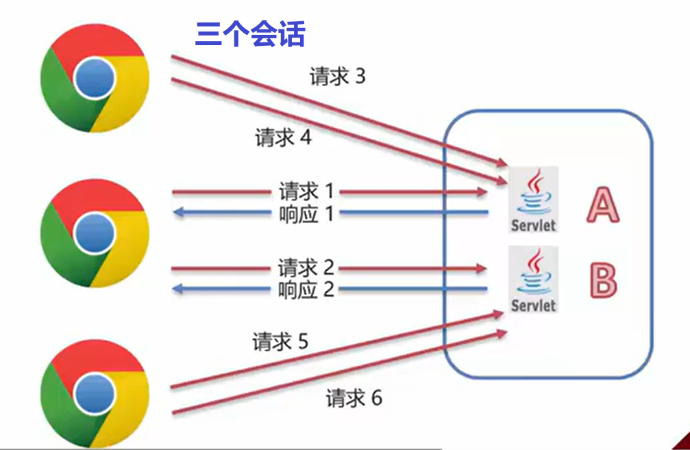

>  服务器是不知道请求1和请求2是否来自同一个会话
>
> 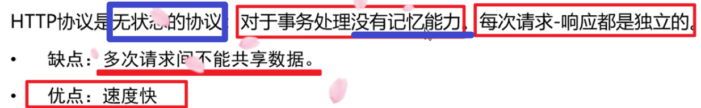 

会话跟踪：一种维护浏览器状态的方法，服务器需要识别多次请求是否来自于同一浏览器，以便在**同一次会话的多次请求间共享数据**

> 实现方式
>
> 1. 客户端会话跟踪技术Cookie
> 2. 服务端会话跟踪技术Session

## 通俗的描述

**会话：** 在互联网上，**会话**通常指的是**用户在一段时间内与一个网站或应用程序的交互**。

**一个会话可以包括用户打开网站、浏览多个页面、进行交互、提交表单等一系列动作**。

**会话跟踪技术：** 会话跟踪技术是**一组用于在Web应用程序中追踪用户活动和状态的方法**。这些技术允许开发人员在用户访问不同页面或执行不同操作时保持一致的用户状态。

1. **Cookies（Cookie会话跟踪）：**
   - **描述：** 就像是给用户贴上一个小标签，标签上记录了一些信息，随着用户访问不同页面，浏览器会把这个标签带上，服务器通过这个标签认出用户，知道用户是谁。
   - **比喻：** 就好像在商店里拿了一个小卡片，上面有你的信息，每次你走到不同的部门，店员都能通过这个卡片知道你是同一个顾客。
2. **URL重写（URL Rewriting）：**
   - **描述：** 就像是在用户访问网站的时候，在URL后面夹带一些信息，告诉服务器这个请求是属于哪个用户的，服务器通过解析URL中的信息来追踪用户。
   - **比喻：** 就好像在邮件中夹带了一封信，信上写着你的名字，快递员通过信上的信息知道这个包裹是送给你的。
3. **隐藏表单域（Hidden Form Fields）：**
   - **描述：** 就像是在一个看不见的表单中放了一些信息，当用户提交表单时，这些信息会被一同发送到服务器，服务器通过这些信息来辨认用户。
   - **比喻：** 就好像在寄信的信封里放了一张纸条，里面写着你的名字，邮局收到信件时通过这张纸条知道是你寄的信。
4. **会话管理器（Session Management）：**
   - **描述：** 就像是在服务器上给每个用户分配了一个专属的房间，用户在网站上活动时，信息都被存储在这个房间里，服务器通过这个房间来管理用户。
   - **比喻：** 就好像在商店里有一个专门的休息室，你在休息室里的活动都被记录下来，店员通过休息室来追踪你的活动。


## 学习准备

[HTTP&TomCat&Servelet | cout<<"金缕衣"; ](https://xu-runbo.gitee.io/xu-runbo/post/fefee16a.html)

1. 创建web项目框架

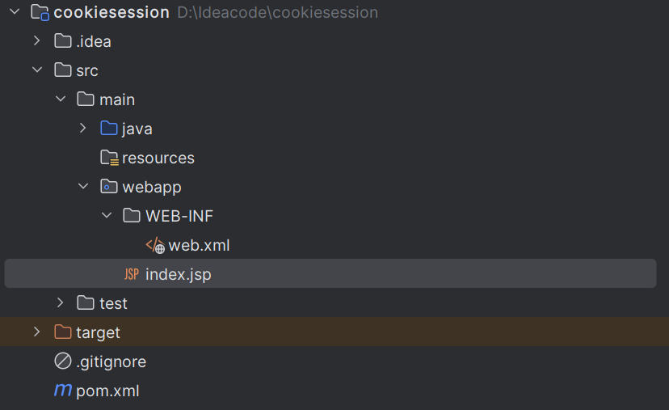 

## Cookie

### Cookie的见解

> 当我们谈论“Cookie发来发去”时，指的是在Web应用中，客户端（通常是浏览器）和服务器之间传递和使用Cookie的过程。让我们通过一个类比来理解这个过程：
>
> ### 场景：邮递员和信件
>
> 1. **邮递员（浏览器）：** 想象浏览器就像是一位邮递员，用户在网络上浏览不同的网站就相当于在城市中行走，而**浏览器负责在用户和不同网站之间传递信息**。
>
> 2. **信件（Cookie）：** **Cookie就像是一封信，里面可能包含了一些信息**，比如用户的偏好、登录状态等。这封信由一个站点（服务器）发给另一个站点，随着用户的浏览活动被传递。
>
> 3. **寄信（服务器设置Cookie）：** **当用户访问一个网站时，服务器可能会给浏览器发一封信**（设置Cookie）。这封信可能包含了用户的标识、偏好设置等信息。
>
> 4. **携带信件（用户浏览其他网站）：** 用户在这个网站上浏览一会儿，然后**转到了另一个网站**。就像邮递员一样，浏览器会携带这封信（Cookie）继续用户的行程。
>
> 5. **接收信件（另一个站点的服务器接收Cookie）：** 当用户到达另一个站点时，这个站点的服务器会接收到之前站点设置的信（Cookie）。这使得不同站点之间能够共享一些信息。
>
> 6. **打开信件查看信息（服务器读取Cookie）：** 服务器可以打开这封信（读取Cookie），里面的信息可能帮助服务器了解用户的偏好、登录状态等，以提供更好的用户体验。
>
> 解释Cookie在**不同站点之间传递和共享信息的过程**。通过Cookie，**服务器可以在用户的不同请求之间保持一些状态信息，使得用户的互动更加连贯**
>
> 例如在购物网站中保持购物车的内容，或者在社交媒体中保持用户的登录状态。

### Cookie的基本使用

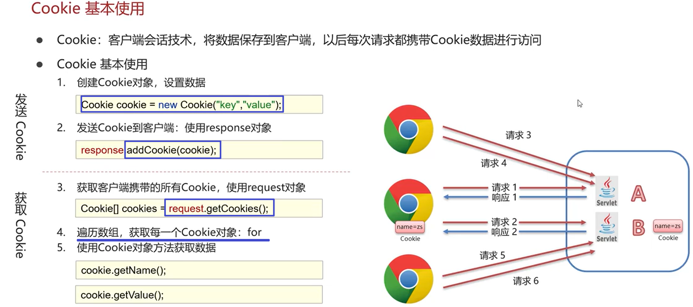 

Cookie是一种在**客户端存储信息的小型文本文件**，用于在**Web浏览器和服务器之间存储和传递信息。**

通常被用来**跟踪用户的状态、存储用户首选项以及实现一些其他的客户端和服务器之间的通信**。

Cookie使用方法：

1. **设置Cookie：** **服务器通过HTTP响应头将Cookie信息发送给浏览器**，浏览器会将这些信息存储在本地。

    在HTTP响应头中使用 `Set-Cookie` 字段：

    ```http
    Set-Cookie: name=value; expires=Sat, 31 Dec 2022 23:59:59 GMT; path=/; domain=example.com; secure; HttpOnly
    ```

    - `name=value`：设置Cookie的键值对。
    - `expires`：设置Cookie的过期时间。
    - `path`：指定Cookie的路径。
    - `domain`：指定Cookie的域。
    - `secure`：仅在通过HTTPS连接时发送Cookie。
    - **`HttpOnly`：禁止通过JavaScript访问Cookie，提高安全性。**

2. **读取Cookie：** 浏览器会在每个请求中通过HTTP头部将Cookie信息发送给服务器。

    在HTTP请求头中，包含了 `Cookie` 字段：

    ```http
    Cookie: name=value; anotherCookie=anotherValue
    ```

3. **JavaScript中的操作：** 在JavaScript中，可以通过 **`document.cookie` 来读取和设置Cookie。**

    ```javascript
    // 设置Cookie
    document.cookie = "username=John Doe; expires=Thu, 18 Dec 2023 12:00:00 UTC; path=/";

    // 读取Cookie
    let userCookie = document.cookie;
    ```

    注意：JavaScript中的 `document.cookie` 操作有一些限制，因为安全性考虑，**不能直接访问所有Cookie。**

4. **服务器端处理：** 在服务器端，可以通过读取HTTP请求头中的 `Cookie` 字段来获取客户端发送的Cookie信息。

Cookie通常用于存储用户会话标识、首选项、跟踪用户活动等信息。 要注意使用Cookie时的安全性和隐私保护。

### 发送cookie

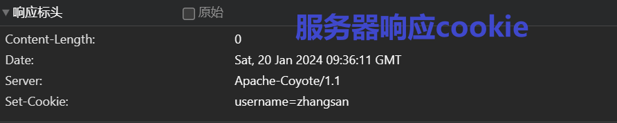 

Aservlet.java

```java
package com.hello.service;

import javax.servlet.ServletException;
import javax.servlet.annotation.WebServlet;
import javax.servlet.http.Cookie;
import javax.servlet.http.HttpServlet;
import javax.servlet.http.HttpServletRequest;
import javax.servlet.http.HttpServletResponse;
import java.io.IOException;

@WebServlet("/hello")
public class Aservlet extends HttpServlet {
    @Override
    protected void doGet(HttpServletRequest req, HttpServletResponse resp) throws ServletException, IOException {

        //我们创建会话
        Cookie cookie=new Cookie("username","zhangsan");

        //发送cookie
        resp.addCookie(cookie);
    }

    @Override
    protected void doPost(HttpServletRequest req, HttpServletResponse resp) throws ServletException, IOException {
       doGet(req, resp);
    }
}

```

[localhost:9527/cookiesession_war/hello](http://localhost:9527/cookiesession_war/hello)

F12网络活动检测

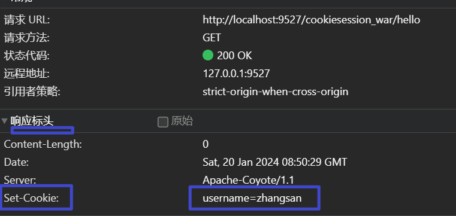

或者到浏览器设置里 

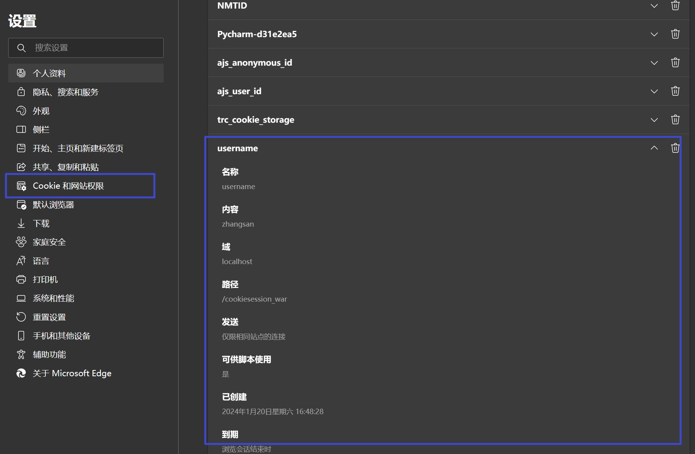

默认是浏览会话结束就销毁了

### 获取cookies

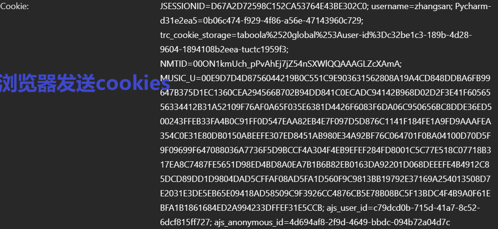 

Bservlet.java

```java
package com.hello.service;

import javax.servlet.ServletException;
import javax.servlet.annotation.WebServlet;
import javax.servlet.http.Cookie;
import javax.servlet.http.HttpServlet;
import javax.servlet.http.HttpServletRequest;
import javax.servlet.http.HttpServletResponse;
import java.io.IOException;

@WebServlet("/world")
public class Bservlet extends HttpServlet {
    @Override
    protected void doGet(HttpServletRequest req, HttpServletResponse resp) throws ServletException, IOException {
        //获取浏览器发过来的所有cookies
        Cookie[] cookies=req.getCookies();
        //遍历！
        for(Cookie c:cookies)
        {
            String name=c.getName();
            if(name.equals("username"))
            {
                String value=c.getValue();
                System.out.println("name是"+name+"值是"+value);
            }
        }
    }

    @Override
    protected void doPost(HttpServletRequest req, HttpServletResponse resp) throws ServletException, IOException {
       doGet(req, resp);
    }
}

```

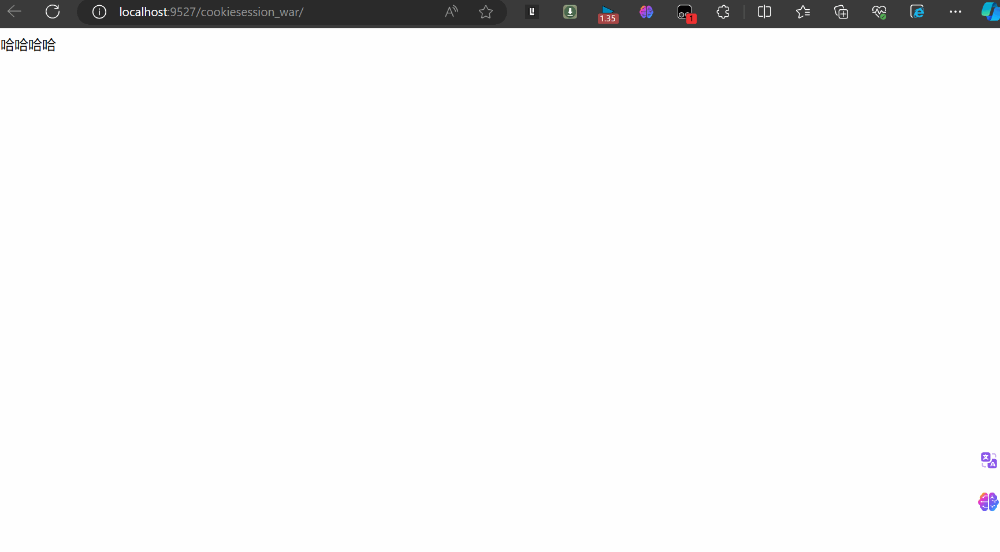

当浏览器访问一个站点时，它会**将与该站点相关的所有Cookie信息包含在HTTP请求头中的 `Cookie` 字段中**。这些Cookie信息是由之前访问的站点设置的，并且通常包含了一些用户状态或其他需要在不同请求之间共享的数据。 

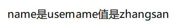 

### Cookie原理

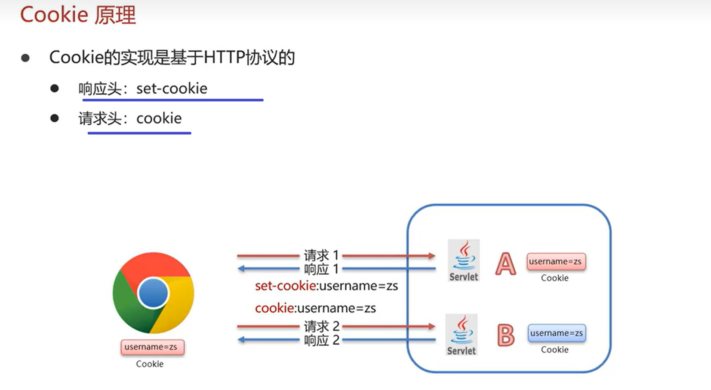 

Cookie的核心原理非常简单，它基于HTTP协议，用于在客户端（通常是浏览器）和服务器之间传递和存储少量数据。以下是Cookie的核心原理：

1. **创建Cookie：** 当用户访问一个网站时，服务器可以通过**HTTP响应头的 `Set-Cookie` 字段**在用户的浏览器中创建一个Cookie。这个**Cookie包含了一些键值对，通常用于存储用户的状态、偏好设置等信息**。

   ```http
   Set-Cookie: username=John; expires=Sat, 31 Dec 2022 23:59:59 GMT; path=/; domain=example.com; secure; HttpOnly
   ```

   上述示例中，创建了一个名为 `username` 的Cookie，值为 `John`。

2. **存储在客户端：** 浏览器在接收到这个Cookie后，会将它存储在本地，通常是在用户的Cookie存储区域。

3. **发送到服务器：** 当用户再次访问同一站点时，浏览器会将之前存储的Cookie信息通过HTTP请求头的 `Cookie` 字段发送给服务器。

   ```http
   Cookie: username=John
   ```

4. **服务器读取Cookie：** 服务器在接收到请求后，通过读取 `Cookie` 字段，可以获取之前设置的Cookie信息。

   ```java
    protected void doGet(HttpServletRequest req, HttpServletResponse resp) throws ServletException, IOException {
           //获取浏览器发过来的所有cookies
           Cookie[] cookies=req.getCookies();
           //遍历！
        for(Cookie c:cookies)
           {
               String name=c.getName();
               if(name.equals("username"))
               {
                String value=c.getValue();
                   System.out.println("name是"+name+"值是"+value);
               }
           }
       }
```

总体来说，**Cookie的核心原理就是通过HTTP响应头在服务器端创建**，然后由浏览器存储，之后在每次HTTP请求中通过**请求头发送给服务器**。实现了客户端和服务器之间的状态共享和信息传递。

### Cookie使用细节


#### Cookie的存活时间

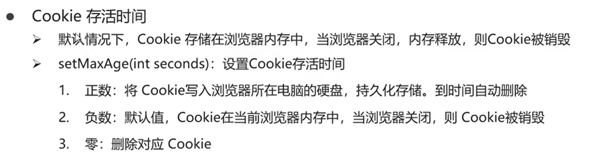 

---

对于会话cookie

cookie是存储在浏览器的内存中的，会随着浏览器的关闭而销毁，所以

我们先去访问hello让服务器给浏览器发送一个cookie

现在我们关闭浏览器然后

去访问world的适合，就不会看到任何输出了

---

Cookie的存活时间不仅与浏览器是否关闭有关，还与Cookie本身的设置有关。

1. **会话Cookie：** 如果创建Cookie时没有设置 `Expires` 或 `Max-Age` 字段，这个Cookie就是**会话Cookie**。**会话Cookie的生命周期仅在用户会话期间有效。**当用户关闭浏览器时，这些Cookie通常会被删除。

    ```http
    Set-Cookie: username=John; // 会话Cookie
```

    上述例子中，`username=John` 是一个会话Cookie，它将在**用户关闭浏览器时失效。**

2. **持久性Cookie：** 如果创建Cookie时设置了 **`Expires` 或 `Max-Age` 字段**，这个Cookie是**持久性Cookie**。它将在**指定的过期时间之后失效，而不受浏览器关闭的影响。**

    ```http
    Set-Cookie: username=John; expires=Sat, 31 Dec 2022 23:59:59 GMT; // 持久性Cookie
    ```

    上述例子中，`username=John` 是一个持久性Cookie，它将在2022年12月31日23时59分59秒（GMT时间）之后失效，不受浏览器关闭的影响。


#### ==方法测试==

发送cookie的适合就设置

```java
package com.hello.service;

import javax.servlet.ServletException;
import javax.servlet.annotation.WebServlet;
import javax.servlet.http.Cookie;
import javax.servlet.http.HttpServlet;
import javax.servlet.http.HttpServletRequest;
import javax.servlet.http.HttpServletResponse;
import java.io.IOException;

@WebServlet("/hello")
public class Aservlet extends HttpServlet {
    @Override
    protected void doGet(HttpServletRequest req, HttpServletResponse resp) throws ServletException, IOException {

        //我们创建会话
        Cookie cookie=new Cookie("username","zhangsan");
        //只能是字符串，字符串，可以有多个cookie
        //当然也可与给多个cookie设置存活时间

        cookie.setMaxAge(60*60*24*60);
        //一周，需要转换为秒
        //发送cookie
        resp.addCookie(cookie);
    }

    @Override
    protected void doPost(HttpServletRequest req, HttpServletResponse resp) throws ServletException, IOException {
       doGet(req, resp);
    }
}

```

效果

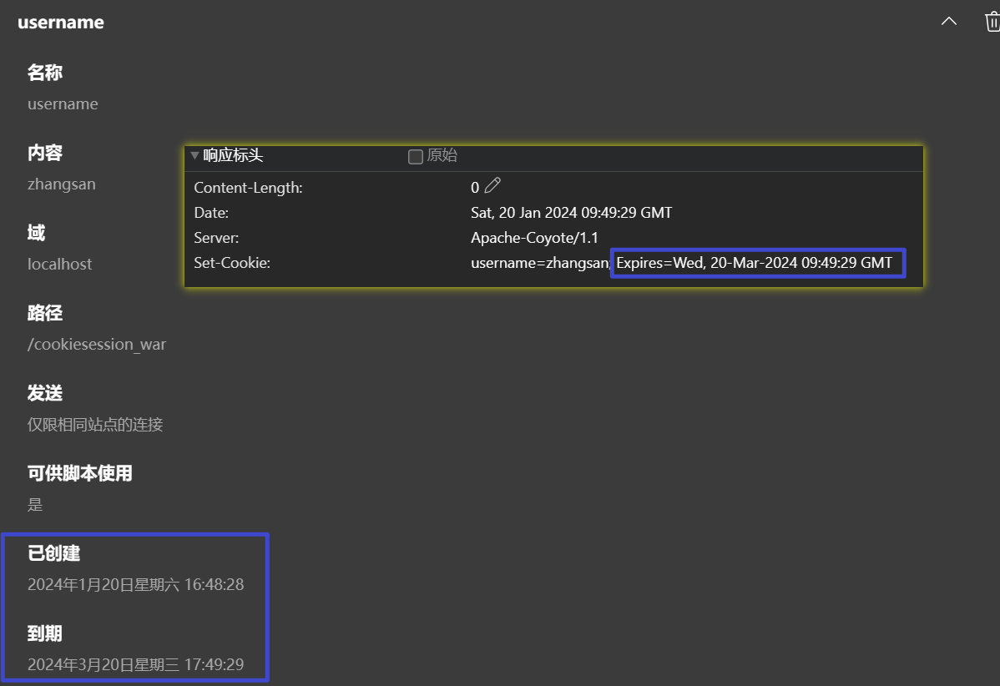 

#### Cookie存储中文

cookie的键值对存储一个中文的时候是个怎么情况呢？

答案是。。

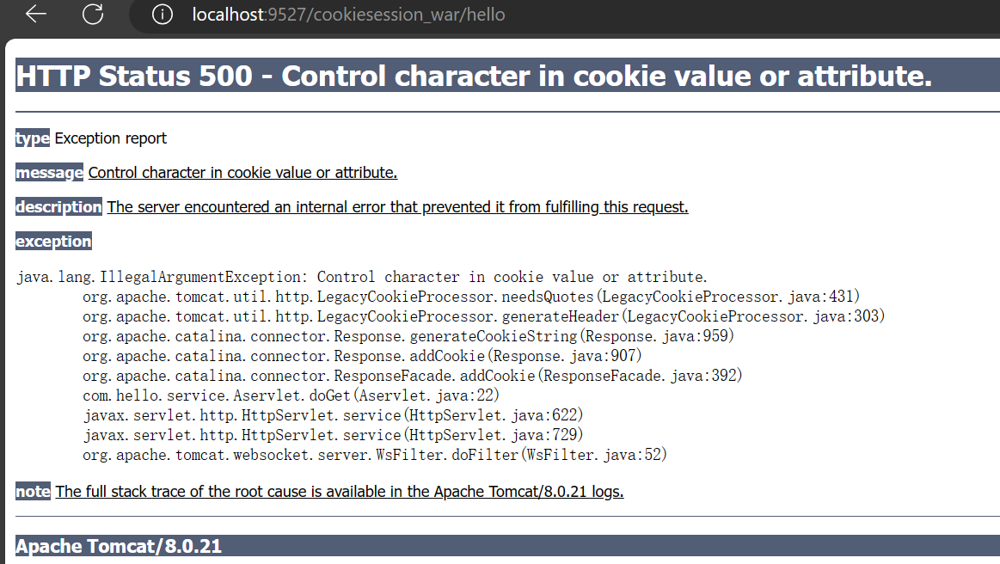 

默认是不可以存储中文的

如何存储中文呢？

#### 如何解决呢

发送cookie的时候

```java
package com.hello.service;

import javax.servlet.ServletException;
import javax.servlet.annotation.WebServlet;
import javax.servlet.http.Cookie;
import javax.servlet.http.HttpServlet;
import javax.servlet.http.HttpServletRequest;
import javax.servlet.http.HttpServletResponse;
import java.io.IOException;
import java.net.URLDecoder;
import java.net.URLEncoder;

@WebServlet("/hello")
public class Aservlet extends HttpServlet {
    @Override
    protected void doGet(HttpServletRequest req, HttpServletResponse resp) throws ServletException, IOException {

        //我们创建会话
        String value= URLEncoder.encode("张三","UTF-8");
        Cookie cookie=new Cookie("username",value);

        System.out.println("cookie里的username是"+value);
        cookie.setMaxAge(60*60*24*60);
        //一周，需要转换为秒
        //发送cookie
        resp.addCookie(cookie);
    }

    @Override
    protected void doPost(HttpServletRequest req, HttpServletResponse resp) throws ServletException, IOException {
       doGet(req, resp);
    }
}

```


---

world的servlet

```java
package com.hello.service;

import javax.servlet.ServletException;
import javax.servlet.annotation.WebServlet;
import javax.servlet.http.Cookie;
import javax.servlet.http.HttpServlet;
import javax.servlet.http.HttpServletRequest;
import javax.servlet.http.HttpServletResponse;
import java.io.IOException;
import java.net.URLDecoder;
import java.net.URLEncoder;
import java.util.Map;

@WebServlet("/world")
public class Bservlet extends HttpServlet {
    @Override
    protected void doGet(HttpServletRequest req, HttpServletResponse resp) throws ServletException, IOException {
        //获取浏览器发过来的所有cookies
        Cookie[] cookies = req.getCookies();
        //遍历！
        for (Cookie c : cookies) {
            String name = c.getName();
            if (name.equals("username")) {
                String value = c.getValue();

                value= URLDecoder.decode(value,"UTF-8");
                System.out.println("name是" + name + "值是" + value);
            }
        }
        String s=req.getParameter("Cookie");
        System.out.println(s);
    }

    @Override
    protected void doPost(HttpServletRequest req, HttpServletResponse resp) throws ServletException, IOException {
       doGet(req, resp);
    }
}

```

我们访问[localhost:9527/cookiesession_war/hello](http://localhost:9527/cookiesession_war/hello)

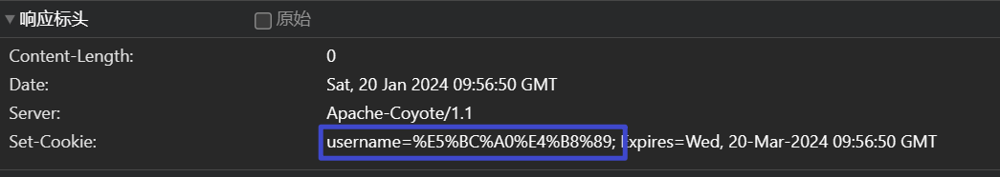

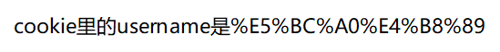 

再访问[localhost:9527/cookiesession_war/world](http://localhost:9527/cookiesession_war/world)

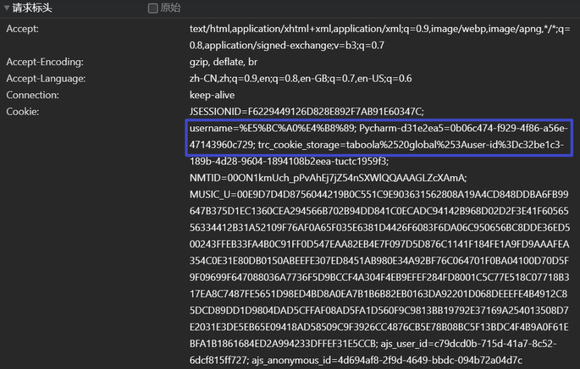

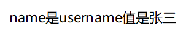 

虽然浏览器传递的进制，服务端解码后就可以得到真正的汉字了！！！

## Session

### Session引入

> 服务端会话跟踪技术：将数据保存到服务端
>
> JavaEE提供HttpSession接口，实现一次会话的多次请求间数据共享功能


#### Session概念和作用

> Session 是一种用于在Web应用中跟踪用户状态、维护用户身份和存储临时数据的机制。

#### Seesion的生命周期

> Session 的生命周期包括创建、维护和销毁，通常始于用户访问应用并在一段时间后结束。

#### 会话标识符

> 会话标识符是一种唯一的标志，用于标识用户在一个会话期间的身份和状态，通常通过Cookie、Token或其他机制来实现。

### Session的基本使用

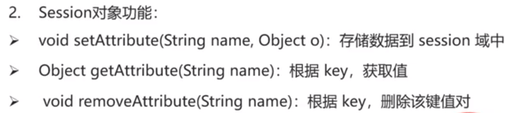 

**Session 可以实现在一次会话的多次请求之间共享数据**，当用户首次访问服务器时，服务器会为该用户创建一个唯一的**会话标识符**。在**服务器端分配存储空间用于存储与该会话相关的数据**。接下来的每个用户请求中，**该会话标识符会被包含在请求中**

服务器通**过这个标识符来识别用户**，在服务器端，可以存储用户的登录状态、购物车内容、用户首选项等信息。这样，**无需在每个请求中都重新验证用户或重新获取这些数据**，实现了在一次会话的多次请求之间共享数据的目的。

比如基于 Cookie 的 Session，会话数据可能存储在服务器端的内存、数据库或其他持久化存储中。而基于 Token 的 Session 则可能将数据加密在令牌中，并在每个请求中传递该令牌以实现状态的共享。

---

Sessiondemo1.java

```java
package com.hello.service.sessions;

import javax.servlet.ServletException;
import javax.servlet.annotation.WebServlet;
import javax.servlet.http.HttpServlet;
import javax.servlet.http.HttpServletRequest;
import javax.servlet.http.HttpServletResponse;
import javax.servlet.http.HttpSession;
import java.io.IOException;
@WebServlet("/s1")
public class Sessiondemo1 extends HttpServlet {
    @Override
    protected void doGet(HttpServletRequest req, HttpServletResponse resp) throws ServletException, IOException {

        //   获取 HttpSession 对象，如果不存在则创建一个新的
        HttpSession httpSession=req.getSession();

        // 将用户名 "zs" 存储在 HttpSession 中的 "username" 属性中
        httpSession.setAttribute("username", "zs");


    }

    @Override
    protected void doPost(HttpServletRequest req, HttpServletResponse resp) throws ServletException, IOException {

        doGet(req, resp);
    }
}

```

Sessiondemo2.java

```java
package com.hello.service.sessions;

import javax.servlet.ServletException;
import javax.servlet.annotation.WebServlet;
import javax.servlet.http.HttpServlet;
import javax.servlet.http.HttpServletRequest;
import javax.servlet.http.HttpServletResponse;
import javax.servlet.http.HttpSession;
import java.io.IOException;

@WebServlet("/s2")
public class Sessiondemo2 extends HttpServlet {
    @Override
    protected void doGet(HttpServletRequest req, HttpServletResponse resp) throws ServletException, IOException {
        // 获取 HttpSession 对象，如果不存在则创建一个新的
        HttpSession httpSession=req.getSession();

        // 从 HttpSession 中获取之前存储的 "username" 属性
        Object object = httpSession.getAttribute("username");

        // 打印获取到的用户名信息
        System.out.println("session中的用户名：" + object);


    }

    @Override
    protected void doPost(HttpServletRequest req, HttpServletResponse resp) throws ServletException, IOException {

        doGet(req, resp);
    }
}

```

效果就是

先访问[localhost:9527/cookiesession_war/s1](http://localhost:9527/cookiesession_war/s1)

> 通过`req.getSession()`获取`HttpSession`对象时，**Servlet容器会检查请求中是否包含会话标识符**。如果请求中包含有效的会话标识符，它将返回与该标识符相关联的 `HttpSession` 对象；如果没有会话标识符，它将创建一个新的 `HttpSession` 对象，**并将相应的会话标识符发送给客户端**。这样就确保了在整个会话期间，`HttpSession` 对象能够在**多次请求之间共享数据**。

访问[localhost:9527/cookiesession_war/s2](http://localhost:9527/cookiesession_war/s2)

现在访问就能用到创建好的session对象了,并且可以读取我们存入的信息

> 会话标识符在客户端和服务器之间传递，通过这种机制，Servlet容器能够识别并关联同一用户的多个请求，从而创建或获取相应的 `HttpSession` 对象。
>
> **两次获取的是同一个session**

控制台输出

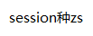 

### Session原理

为什么**两次获取的是同一个session**？

服务器如何做到识别同一次会话里的不同请求呢？

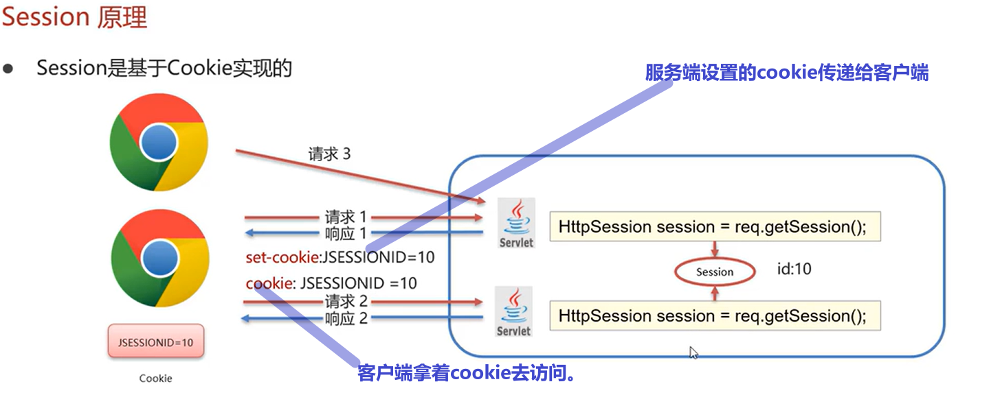

代码演示：

当我们访问[localhost:9527/cookiesession_war/s1](http://localhost:9527/cookiesession_war/s1)

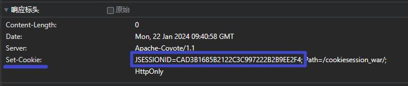

 然后访问[localhost:9527/cookiesession_war/s2](http://localhost:9527/cookiesession_war/s2)

浏览器拿着cookie去访问服务器了

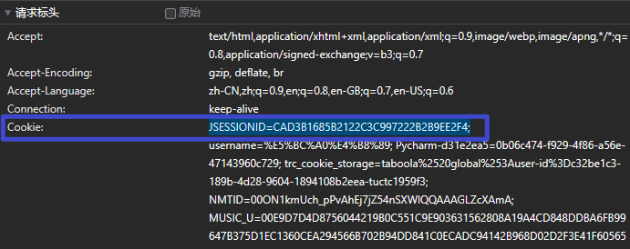

> 解释
>
> 涉及到 Session 的创建、标识符传递以及在后续请求中如何利用这个标识符来找回相应的 Session。以下是您描述的两次请求、两个 Servlet、一个 Session 的逻辑关系：
>
> 1. **请求一：**
>    - 用户首次访问服务器，请求 Servlet1。
>    - Servlet1 通过 `req.getSession()` 获取 `HttpSession` 对象。
>    - 因为这是用户的第一次访问，服务器发现请求中没有包含会话标识符（例如，没有包含会话Cookie）。
>    - **服务器为用户创建**一个新的 `HttpSession` 对象，并生成一个唯一的会话标识符（例如，ID=10）。
>    - 服务器将这个会话标识符通过响应的 Set-Cookie 头部发送给客户端浏览器，例如：`Set-Cookie: id=10`。
>    - 客户端浏览器收到响应后，将这个 Cookie 存储起来，以便在后续的请求中发送给服务器。
>
> 2. **请求二：**
>    - 用户再次访问服务器，请求 Servlet2。
>    - Servlet2 通过 `req.getSession()` 获取 `HttpSession` 对象。
>    - 此时，请求中包含了之前存储的会话标识符（Cookie: id=10）。
>    - 服务器根据这个会话标识符找到了之前创建的 `HttpSession` 对象，因此这次获取的 `HttpSession` 与请求一中创建的是同一个。
>    - Servlet2 可以从这个 `HttpSession` 中获取先前存储的数据。
>
> 3. **另一个请求（没有携带会话标识符的情况）：**
>    - 如果另一个用户或客户端发起请求，但是请求中没有包含之前设置的会话标识符（Cookie: id=10）。
>    - 服务器将认为这是一个新的会话，会为该请求创建一个新的 `HttpSession` 对象，并为其生成一个新的唯一会话标识符。
>    - 这个请求的 `HttpSession` 将与之前的会话无关，无法获取之前存储的数据。
>
> 总体而言，**会话标识符的传递是通过 Cookie 来实现的**，客户端浏览器在请求中携带这个 Cookie，服务器通过这个标识符来关联和获取相应的 `HttpSession` 对象，从而实现在一次会话中共享数据。

### Session使用细节

---


> 1. **创建 Session：** 通过 `HttpServletRequest` 的 `getSession()` 方法可以获取或创建一个 `HttpSession` 对象。如果客户端请求中包含有效的会话标识符，该方法会返回与该标识符关联的 `HttpSession` 对象，否则将创建一个新的 `HttpSession`。
>
>    ```java
>    HttpSession session = request.getSession();
>    ```
>
> 2. **设置和获取 Session 属性：** 使用 `HttpSession` 对象的 `setAttribute(String name, Object value)` 方法来设置 Session 属性，使用 `getAttribute(String name)` 方法来获取属性的值。
>
>    ```java
>    // 设置 Session 属性
>    session.setAttribute("username", "John");
>
>    // 获取 Session 属性
>    String username = (String) session.getAttribute("username");
>    ```
>
> 3. **Session 过期时间：** 可以**通过配置或在代码中设置 Session 的过期时间**。默认情况下，Session 将持续到浏览器关闭，但可以通过以下方式设置超时时间（以秒为单位）：
>
>    ```java
>    // 设置 Session 过期时间为30分钟
>    session.setMaxInactiveInterval(1800);
>    ```
>
> 4. **手动使 Session 失效：** 在某些情况下，您可能希望**手动使 Session 失效**。可以通过调用 `invalidate()` 方法来实现：
>
>    ```java
>    // 手动使 Session 失效
>    session.invalidate();
>    ```
>
> 5. **检查 Session 是否存在：** 可以使用 `isNew()` 方法**检查当前请求的 `HttpSession` 是否是新创建的**，即是否是用户的第一次访问。
>
>    ```java
>    if (session.isNew()) {
>        // 处理新会话的逻辑
>    }
>    ```
>
> 6. **Cookie 配置：** 默认情况下，Servlet容器会自动为每个新的 Session 创建一个包含会话标识符的 Cookie。如果需要更改 Cookie 的配置，可以使用 `Cookie` 对象进行调整。
>
> 7. **Session 监听器：** 可以通过实现 `HttpSessionListener` 接口来创建 Session 监听器，监听 Session 的创建和销毁事件。这对于执行某些操作（例如记录日志）非常有用。
>
>    ```java
>    public class MySessionListener implements HttpSessionListener {
>        // 实现监听器的方法
>    }
>    ```
>
> 8. **分布式环境：** 在分布式系统中，确保多个服务器之间能够共享 Session 数据可能需要使用一些外部的存储机制，例如数据库或缓存系统。
>
> 9. **安全性：** 避免在 Session 中存储敏感信息，因为 **Session 数据通常存储在服务器端**，但仍然可能受到某些攻击。确保使用 HTTPS 协议来加密数据传输，以增加安全性。
>

---

#### session钝化，活化：

> 服务器重启后，session种的数据是否还在？
>
> 钝化：在服务器正常关闭后，tomcat会自动将Session数据写入硬盘的文件种
>
> 活化：再次启动服务器后，从文件中加载数据到Session中
>
> > 将 Session 对象存储到外部存储介质（例如磁盘或数据库）和从外部存储介质中读取 Session 对象的过程
> >
> > 会有一个.sar文件的存在和删除，由tomcat自动完成的
>
> 服务器关闭，session 数据不会丢失
>
> 但是浏览器不能关闭，才能实现共享数据。
>
> id是通过cookie发送给浏览器的，在浏览器的内存里
>
> 浏览器一旦关闭，session就没了，session的id就随着cookie的销毁而销毁

#### Session的销毁

默认是无操作，会造30mins自动销毁

```xml
    <session-config>
        <session-timeout>30</session-timeout>
    </session-config>
```

tomcat里的配置是写死的

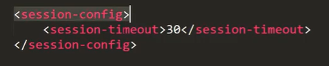

调用Session对象的invalidate方法，可以让session对象自动销毁 


## 总结

> Cookie 和 Session 是 Web 开发中常用的两种机制，用于在客户端和服务器之间保持状态信息。
>
> ### Cookie：
>
> 1. **定义：** Cookie 是一小段存**储在客户端浏览器中的数据**，由服务器发送到浏览器，并在后续的请求中被包含在请求头中发送给服务器。
>
> 2. **用途：** 主要用于跟踪用户的状态、识别用户，实现用户个性化设置，以及在客户端存储少量数据。
>
> 3. **存储位置：** 存储在客户端浏览器中，每个 Cookie 都有一个过期时间。
>
> 4. **安全性：** Cookies 可以被禁用或删除，因此不适合存储敏感信息。可以设置 HttpOnly 属性来增加安全性，防止被恶意脚本访问。
>
> 5. **容量：** 单个 Cookie 大小有限，通常为4KB左右。
>
> ### Session：
>
> 1. **定义：** Session 是**在服务器端保存的关联于用户的信息**，通过会话标识符在客户端和服务器之间传递。
>
> 2. **用途：** 用于在一次用户访问期间跟踪用户状态、维护用户身份和存储临时数据。
>
> 3. **存储位置：** 存储在服务器端，通常在内存中，可以选择存储到数据库或文件系统中，具体取决于服务器的配置。
>
> 4. **安全性：** 相对于 Cookie 更安全，因为 Session 数据存储在服务器端，客户端只有一个会话标识符。
>
> 5. **容量：** 理论上没有特定大小限制，但实际上受服务器配置和性能的影响。
>
> ### Cookie 和 Session 的关系：
>
> 1. **会话管理：** **Session 通常使用 Cookie 来传递会话标识符**。客户端浏览器会保存这个标识符，并在后续的请求中将其发送给服务器。
>
> 2. **共同点：** 两者都用于在无状态的 HTTP 协议中保持用户状态，但存储的位置和安全性不同。
>
> 3. **合理使用：** Cookie 适合存储少量信息，而 **Session 更适合存储大量、敏感的用户数据**。
>

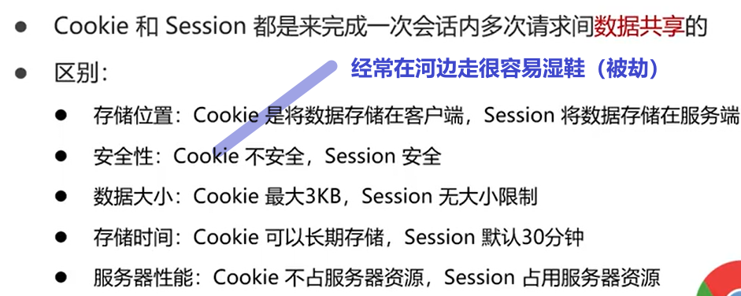 

## 综合案例

### 案例要求

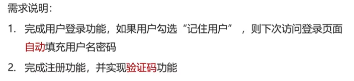 

### web框架准备

1. 用maven创建项目

   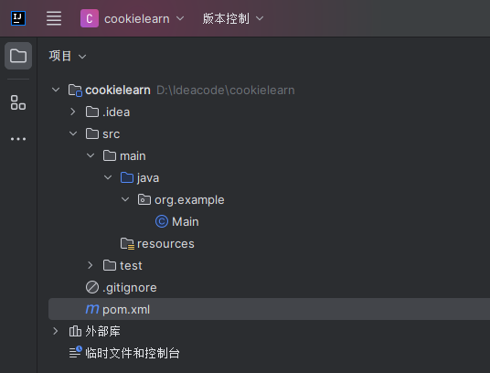 

2. pom.xml加入`<packaging>war</packaging>`并且刷新

3. 加入web框架(webapp)

#### pojo下的User.java

```java
package com.hello.pojo;

public class User {
    Integer id;

    @Override
    public String toString() {
        return "User{" +
                "id=" + id +
                ", username='" + username + '\'' +
                ", password='" + password + '\'' +
                '}';
    }

    public Integer getId() {
        return id;
    }

    public void setId(Integer id) {
        this.id = id;
    }

    public String getUsername() {
        return username;
    }

    public void setUsername(String username) {
        this.username = username;
    }

    public String getPassword() {
        return password;
    }

    public void setPassword(String password) {
        this.password = password;
    }

    String username ;
    String password ;
}

```

#### pojo下的Brad.java

```java
package com.hello.pojo;

//推荐使用包装的类型，因为没有M默认值
public class Brand {

    private Integer  id           ;
    private String  rand_name    ;
    private String  company_name ;
    private Integer ordered      ;
    private String  description  ;
    //0禁用，1正常
    private Integer   status       ;

    public Brand(Integer id, String rand_name, String company_name, Integer ordered, String description, Integer status) {
        this.id = id;
        this.rand_name = rand_name;
        this.company_name = company_name;
        this.ordered = ordered;
        this.description = description;
        this.status = status;
    }

    public Brand() {

    }

    public Integer getId() {
        return id;
    }

    public void setId(Integer id) {
        this.id = id;
    }

    public String getRand_name() {
        return rand_name;
    }

    public void setRand_name(String rand_name) {
        this.rand_name = rand_name;
    }

    public String getCompany_name() {
        return company_name;
    }

    public void setCompany_name(String company_name) {
        this.company_name = company_name;
    }

    public Integer getOrdered() {
        return ordered;
    }

    public void setOrdered(Integer ordered) {
        this.ordered = ordered;
    }

    public String getDescription() {
        return description;
    }

    public void setDescription(String description) {
        this.description = description;
    }

    public Integer getStatus() {
        return status;
    }

    public void setStatus(Integer status) {
        this.status = status;
    }

    @Override
    public String toString() {
        return "Brand{" +
                "id=" + id +
                ", rand_name='" + rand_name + '\'' +
                ", company_name='" + company_name + '\'' +
                ", ordered=" + ordered +
                ", description='" + description + '\'' +
                ", status=" + status +
                '}';
    }
}


```

#### service下的UserService.java

```java
package com.hello.service;

import com.hello.mapper.UserMapper;
import com.hello.pojo.User;
import com.hello.utils.Getfactory;
import org.apache.ibatis.session.SqlSession;
import org.apache.ibatis.session.SqlSessionFactory;

public class UserService {
    private SqlSessionFactory factory= Getfactory.getsqlsessionfactory();


    public User login(String username,String password)
    {
        //获取sqlsession
        SqlSession sqlSession=factory.openSession(true);
        //获取usermapper
        UserMapper userMapper=sqlSession.getMapper(UserMapper.class);
        //执行方法
        User user=userMapper.select(username,password);

        //释放资源
        sqlSession.close();

        return user;

    }


}

```

service下的BrandService.java

```java
package com.hello.service;

import com.hello.mapper.BrandMapper;
import com.hello.pojo.Brand;
import com.hello.utils.Getfactory;
import com.hello.utils.Getfactory;
import org.apache.ibatis.session.SqlSession;
import org.apache.ibatis.session.SqlSessionFactory;

import java.util.List;

public class BrandService {
    private SqlSessionFactory Factory= Getfactory.getsqlsessionfactory();


    public List<Brand> selectAll()
    {
        //获取sqlsession对象
        SqlSession sqlsession=Factory.openSession(true);

        //获取mapper对象
        BrandMapper brandMapper=sqlsession.getMapper(BrandMapper.class);

        //执行sql语句
        List<Brand> brands=brandMapper.selectall();
        sqlsession.close();
        return brands;

    }

    public void add(Brand brand)
    {
        SqlSession sqlsession=Factory.openSession(true);

        //获取mapper对象
        BrandMapper brandMapper=sqlsession.getMapper(BrandMapper.class);

        brandMapper.add(brand);

        sqlsession.close();
    }
    public Brand selectById(int id)
    {
        SqlSession sqlsession=Factory.openSession(true);

        //获取mapper对象
        BrandMapper brandMapper=sqlsession.getMapper(BrandMapper.class);

        Brand brand=brandMapper.selectById(id);
        sqlsession.close();
        return brand;

    }

    public void update(Brand brand)
    {
        SqlSession sqlsession=Factory.openSession(true);

        //获取mapper对象
        BrandMapper brandMapper=sqlsession.getMapper(BrandMapper.class);

        brandMapper.update(brand);

        sqlsession.close();
    }
}

```


#### mybatis-config.xml

```xml
<?xml version="1.0" encoding="UTF-8" ?>
<!DOCTYPE configuration
        PUBLIC "-//mybatis.org//DTD Config 3.0//EN"
        "https://mybatis.org/dtd/mybatis-3-config.dtd">
<configuration>
    <environments default="development">
        <environment id="development">
            <transactionManager type="JDBC"/>

            <!--            数据库的连接信息-->
            <dataSource type="POOLED">
                <property name="driver" value="com.mysql.cj.jdbc.Driver"/>
                <property name="url" value="jdbc:mysql:///db"/>
                <property name="username" value="root"/>
                <property name="password" value="xurunbo"/>
            </dataSource>


        </environment>
    </environments>

    <!--    加载SQl的映射文件-->
    <mappers>
        <package name="com.hello.mapper"/>
    </mappers>
</configuration>

```

#### pom.xml

```xml
<?xml version="1.0" encoding="UTF-8"?>
<project xmlns="http://maven.apache.org/POM/4.0.0"
         xmlns:xsi="http://www.w3.org/2001/XMLSchema-instance"
         xsi:schemaLocation="http://maven.apache.org/POM/4.0.0 http://maven.apache.org/xsd/maven-4.0.0.xsd">
    <modelVersion>4.0.0</modelVersion>

    <groupId>org.example</groupId>
    <artifactId>untitled23</artifactId>
    <version>1.0-SNAPSHOT</version>

    <packaging>war</packaging>
    <properties>
        <maven.compiler.source>8</maven.compiler.source>
        <maven.compiler.target>8</maven.compiler.target>
        <project.build.sourceEncoding>UTF-8</project.build.sourceEncoding>
    </properties>
    <dependencies>
        <dependency>
            <groupId>org.mybatis</groupId>
            <artifactId>mybatis</artifactId>
            <version>3.5.13</version>
        </dependency>
        <dependency>
            <groupId>mysql</groupId>
            <artifactId>mysql-connector-java</artifactId>
            <version>8.0.32</version>
        </dependency>


        <dependency>
            <groupId>junit</groupId>
            <artifactId>junit</artifactId>
            <version>4.13.2</version>
        </dependency>

        <dependency>
            <groupId>javax.servlet</groupId>
            <artifactId>servlet-api</artifactId>
            <version>2.5</version>
            <scope>provided</scope>
        </dependency>
        <dependency>
            <groupId>org.apache.tomcat</groupId>
            <artifactId>tomcat-servlet-api</artifactId>
            <version>7.0.47</version>
        </dependency>

        <dependency>
            <groupId>jstl</groupId>
            <artifactId>jstl</artifactId>
            <version>1.2</version>
        </dependency>
    </dependencies>


</project>
```

servlet-api必须是provided，要不会出错！！！

#### UserMapper接口

```java
package com.hello.mapper;

import com.hello.pojo.User;
import org.apache.ibatis.annotations.Insert;
import org.apache.ibatis.annotations.Param;
import org.apache.ibatis.annotations.Select;

import java.util.List;

public interface UserMapper {
    @Select("select * from tb_user where username=#{username} and password=#{password}")
    User select(@Param("username") String username, @Param("password") String password);

    @Select("select * from tb_user;")
    List<User> selectall();

    @Insert("insert into tb_user(username,password) values(#{username},#{password});")
    void adduser(@Param("username") String username, @Param("password") String password);


}


```

#### seervlet下的LoginServlet.java

```java
package com.hello.servlet;


import com.hello.mapper.UserMapper;
import com.hello.pojo.User;
import com.hello.utils.Getfactory;
import org.apache.ibatis.io.Resources;
import org.apache.ibatis.session.SqlSession;
import org.apache.ibatis.session.SqlSessionFactory;
import org.apache.ibatis.session.SqlSessionFactoryBuilder;

import javax.servlet.ServletException;
import javax.servlet.annotation.WebServlet;
import javax.servlet.http.HttpServlet;
import javax.servlet.http.HttpServletRequest;
import javax.servlet.http.HttpServletResponse;
import java.io.IOException;
import java.io.InputStream;

@WebServlet("/login")
public class LoginServlet extends HttpServlet {
    @Override
    protected void doGet(HttpServletRequest req, HttpServletResponse resp) throws ServletException, IOException {


//        String path=req.getContextPath();
//        resp.getWriter().println(path);

        System.out.println("先获取信息");
        resp.setHeader("Content-Type", "text/html;charset=utf-8");
        String username=req.getParameter("username");
        String password=req.getParameter("password");

//        String resource = "mybatis-config.xml";
//        InputStream inputStream = Resources.getResourceAsStream(resource);
//        SqlSessionFactory sqlSessionFactory = new SqlSessionFactoryBuilder().build(inputStream);
//
//        //获取Sqlsussion对象
//        SqlSession sqlSession=sqlSessionFactory.openSession();

//        优化为
        SqlSession sqlSession= Getfactory.getsqlsessionfactory().openSession(true);


        UserMapper userMapper=sqlSession.getMapper(UserMapper.class);
        User user=userMapper.select(username,password);
        //调用完SQL就可以关闭了
        sqlSession.close();
        System.out.println("username:"+username);
        System.out.println("password:"+password);
        if(user==null)
        {
            resp.getWriter().write("密码错误！");
        }
        else
        {
            resp.getWriter().write("登录成功！！");
        }

    }

    @Override
    protected void doPost(HttpServletRequest req, HttpServletResponse resp) throws ServletException, IOException {
        System.out.println("post!");
        doGet(req, resp);
    }
}


```

#### seervlet下的RegisterServlet.java

```java
package com.hello.servlet;

import com.hello.mapper.UserMapper;
import com.hello.pojo.User;
import com.hello.utils.Getfactory;
import org.apache.ibatis.io.Resources;
import org.apache.ibatis.session.SqlSession;
import org.apache.ibatis.session.SqlSessionFactory;
import org.apache.ibatis.session.SqlSessionFactoryBuilder;

import javax.servlet.ServletException;
import javax.servlet.annotation.WebServlet;
import javax.servlet.http.HttpServlet;
import javax.servlet.http.HttpServletRequest;
import javax.servlet.http.HttpServletResponse;
import java.io.IOException;
import java.io.InputStream;

@WebServlet("/register")
public class RegisterServlet extends HttpServlet {
    @Override
    protected void doGet(HttpServletRequest req, HttpServletResponse resp) throws ServletException, IOException {
        System.out.println("先获取用户填写的信息");
        resp.setHeader("Content-Type", "text/html;charset=utf-8");
        String username=req.getParameter("username");
        String password=req.getParameter("password");

//        String resource = "mybatis-config.xml";
//        InputStream inputStream = Resources.getResourceAsStream(resource);
//        SqlSessionFactory sqlSessionFactory = new SqlSessionFactoryBuilder().build(inputStream);
//
//        //获取Sqlsussion对象
//        SqlSession sqlSession=sqlSessionFactory.openSession(true);
        SqlSession sqlSession= Getfactory.getsqlsessionfactory().openSession(true);


        UserMapper userMapper=sqlSession.getMapper(UserMapper.class);
        //检查是否已经有这个用户了
        User user=userMapper.select(username,password);

        if(user==null)
        {
            //没有这个用户就创建这个用户
            userMapper.adduser(username,password);
            resp.getWriter().write("创建成功！");
        }
        else {
            //注册失败！
            resp.getWriter().write("已经有这个账户拉");
        }
    }

    @Override
    protected void doPost(HttpServletRequest req, HttpServletResponse resp) throws ServletException, IOException {
        doGet(req, resp);
    }
}

```

#### login.html

```html
<!DOCTYPE html>
<html lang="en">
<head>
    <meta charset="UTF-8">
    <meta name="viewport" content="width=device-width, initial-scale=1.0">
    <title>Login Page</title>
    <style>
        body {
            font-family: Arial, sans-serif;
            background-color: #f4f4f4;
            text-align: center;
            margin: 100px;
        }
        .login-container {
            max-width: 400px;
            margin: auto;
            background: #fff;
            padding: 20px;
            border-radius: 8px;
            box-shadow: 0 0 10px rgba(0, 0, 0, 0.1);
        }
        input {
            width: 100%;
            padding: 10px;
            margin: 8px 0;
            box-sizing: border-box;
        }
        button {
            background-color: #4caf50;
            color: #fff;
            padding: 10px 15px;
            border: none;
            border-radius: 4px;
            cursor: pointer;
        }
        button:hover {
            background-color: #45a049;
        }
        a {
            text-decoration: none;
            color: #4caf50;
        }
    </style>
</head>
<body>
<div class="login-container">
    <h2>Login</h2>
    <form id="loginForm" action="/untitled23_war/login">
        <label for="username">Username:</label>
        <input type="text" id="username" name="username" required>

        <label for="password">Password:</label>
        <input type="password" id="password" name="password" required>

        <button type="submit">Login</button>
        <button type="reset">Reset</button>
    </form>
    <p>Don't have an account? <a href="register.html">Register</a></p>
</div>
</body>
</html>

```

#### regiser.html

```html
<!DOCTYPE html>
<html lang="en">
<head>
    <meta charset="UTF-8">
    <meta name="viewport" content="width=device-width, initial-scale=1.0">
    <title>Register Page</title>
    <style>
        body {
            font-family: Arial, sans-serif;
            background-color: #f4f4f4;
            text-align: center;
            margin: 100px;
        }
        .register-container {
            max-width: 400px;
            margin: auto;
            background: #fff;
            padding: 20px;
            border-radius: 8px;
            box-shadow: 0 0 10px rgba(0, 0, 0, 0.1);
        }
        input {
            width: 100%;
            padding: 10px;
            margin: 8px 0;
            box-sizing: border-box;
        }
        button {
            background-color: #4caf50;
            color: #fff;
            padding: 10px 15px;
            border: none;
            border-radius: 4px;
            cursor: pointer;
        }
        button:hover {
            background-color: #45a049;
        }
    </style>
</head>
<body>
<div class="register-container">
    <h2>Register</h2>
    <form id="registerForm" action="/untitled23_war/register">
        <label for="username">Username:</label>
        <input type="text" id="username" name="username" required>

        <label for="password">Password:</label>
        <input type="password" id="password" name="password" required>

        <button type="submit">Register</button>
        <button type="reset">Reset</button>
    </form>
    <p>Already have an account? <a href="login.html">Login</a></p>
</div>
</body>
</html>

```


#### brand.jsp

```jsp
<%@ page language="java" contentType="text/html; charset=UTF-8" pageEncoding="UTF-8"%>
<%@ taglib uri="http://java.sun.com/jsp/jstl/core" prefix="c" %>

<!DOCTYPE html>
<html>
<head>
    <meta charset="UTF-8">
    <title>Brand List</title>
    <style>
        table {
            border-collapse: collapse;
            width: 80%;
            margin: 20px;
        }

        th, td {
            border: 1px solid #dddddd;
            text-align: left;
            padding: 8px;
        }

        th {
            background-color: #f2f2f2;
        }
    </style>
</head>
<body>

<h2>Brand List</h2>
<input type="button" id="add" value="添加">
<table>
    <thead>
    <tr>
        <th>ID</th>
        <th>Name</th>
        <th>Company Name</th>
        <th>Ordered</th>
        <th>Description</th>
        <th>Status</th>
        <th>状态</th>
        <th>操作</th>
    </tr>
    </thead>
    <tbody>
    <c:forEach var="brand" items="${brands}" varStatus="status">
        <tr>
            <td>${status.count}</td>
            <td>${brand.rand_name}</td>
            <td>${brand.company_name}</td>
            <td>${brand.ordered}</td>
            <td>${brand.description}</td>
            <td>${brand.status}</td>
            <c:if test="${brand.status==1}">
                <td>启用</td>
            </c:if>
            <c:if test="${brand.status!=1}">
                <td> 禁用</td>
            </c:if>
            <td><a href="/untitled23_war/selectById?id=${brand.id}">修改</a> <a href="#">删除</a></td>
        </tr>
    </c:forEach>
    </tbody>
</table>

</body>
<script>
    document.getElementById("add").onclick=function (){
        location.href="/untitled23_war/add.jsp";
    }
</script>
</html>

```

#### update.jsp

```jsp
<%@ page language="java" contentType="text/html; charset=UTF-8" pageEncoding="UTF-8"%>
<!DOCTYPE html>
<html>
<head>
    <meta charset="UTF-8">
    <title>Add Brand</title>
    <!-- 引入Bootstrap样式文件，确保文件路径正确 -->
    <link rel="stylesheet" href="https://maxcdn.bootstrapcdn.com/bootstrap/4.0.0/css/bootstrap.min.css">
    <style>
        body {
            padding: 20px;
        }

        form {
            max-width: 400px;
            margin: 0 auto;
        }

        label {
            margin-bottom: 0.5rem;
        }

        textarea {
            resize: vertical;
        }
    </style>
</head>
<body>

<div class="container">
    <h2 class="mt-4">Add Brand</h2>

    <form action="/anli_war/update" method="post">
<%--        隐藏域--%>
        <input type="hidden" name="id" value="${brand.id}">
        <div class="form-group">
            <label for="randName">Brand Name:</label>
            <input type="text" class="form-control" id="randName" name="rand_name" required value="${brand.rand_name}">
        </div>

        <div class="form-group">
            <label for="companyName">Company Name:</label>
            <input type="text" class="form-control" id="companyName" name="company_name" required value="${brand.company_name}">
        </div>

        <div class="form-group">
            <label for="ordered">Ordered:</label>
            <input type="number" class="form-control" id="ordered" name="ordered" required value="${brand.ordered}">
        </div>

        <div class="form-group">
            <label for="description">Description:</label>
            <textarea class="form-control" id="description" name="description" rows="4" required>
                ${brand.description}
            </textarea>
        </div>

        <div class="form-group">
            <label for="status">Status:</label>
            <input type="number" class="form-control" id="status" name="status" required>
        </div>

        <button type="submit" class="btn btn-primary">Add Brand</button>
    </form>
</div>

<!-- 引入Bootstrap的JavaScript文件，确保文件路径正确 -->
<script src="https://code.jquery.com/jquery-3.2.1.slim.min.js"></script>
<script src="https://cdnjs.cloudflare.com/ajax/libs/popper.js/1.12.9/umd/popper.min.js"></script>
<script src="https://maxcdn.bootstrapcdn.com/bootstrap/4.0.0/js/bootstrap.min.js"></script>

</body>
</html>

```

#### add.jsp

```jsp
<%@ page language="java" contentType="text/html; charset=UTF-8" pageEncoding="UTF-8"%>
<!DOCTYPE html>
<html>
<head>
    <meta charset="UTF-8">
    <title>Add Brand</title>
    <!-- 引入Bootstrap样式文件，确保文件路径正确 -->
    <link rel="stylesheet" href="https://maxcdn.bootstrapcdn.com/bootstrap/4.0.0/css/bootstrap.min.css">
    <style>
        body {
            padding: 20px;
        }

        form {
            max-width: 400px;
            margin: 0 auto;
        }

        label {
            margin-bottom: 0.5rem;
        }

        textarea {
            resize: vertical;
        }
    </style>
</head>
<body>

<div class="container">
    <h2 class="mt-4">Add Brand</h2>

    <form action="/untitled23_war/add" method="post">
        <div class="form-group">
            <label for="randName">Brand Name:</label>
            <input type="text" class="form-control" id="randName" name="rand_name" required>
        </div>

        <div class="form-group">
            <label for="companyName">Company Name:</label>
            <input type="text" class="form-control" id="companyName" name="company_name" required>
        </div>

        <div class="form-group">
            <label for="ordered">Ordered:</label>
            <input type="number" class="form-control" id="ordered" name="ordered" required>
        </div>

        <div class="form-group">
            <label for="description">Description:</label>
            <textarea class="form-control" id="description" name="description" rows="4" required></textarea>
        </div>

        <div class="form-group">
            <label for="status">Status:</label>
            <input type="number" class="form-control" id="status" name="status" required>
        </div>

        <button type="submit" class="btn btn-primary">Add Brand</button>
    </form>
</div>

<!-- 引入Bootstrap的JavaScript文件，确保文件路径正确 -->
<script src="https://code.jquery.com/jquery-3.2.1.slim.min.js"></script>
<script src="https://cdnjs.cloudflare.com/ajax/libs/popper.js/1.12.9/umd/popper.min.js"></script>
<script src="https://maxcdn.bootstrapcdn.com/bootstrap/4.0.0/js/bootstrap.min.js"></script>

</body>
</html>

```


#### utils下的Getfactory.java

```java
package com.hello.utils;

import org.apache.ibatis.io.Resources;
import org.apache.ibatis.session.SqlSessionFactory;
import org.apache.ibatis.session.SqlSessionFactoryBuilder;

import java.io.IOException;
import java.io.InputStream;

public class Getfactory {
    private static SqlSessionFactory sqlSessionFactory;
    static {

        String resource = "mybatis-config.xml";
        InputStream inputStream = null;
        try {
            inputStream = Resources.getResourceAsStream(resource);
        } catch (IOException e) {
            throw new RuntimeException(e);
        }
        sqlSessionFactory = new SqlSessionFactoryBuilder().build(inputStream);

    }

    public static SqlSessionFactory getsqlsessionfactory(){
        return  sqlSessionFactory;
    }
}


```

现在可以实现之前的简单登录和注册

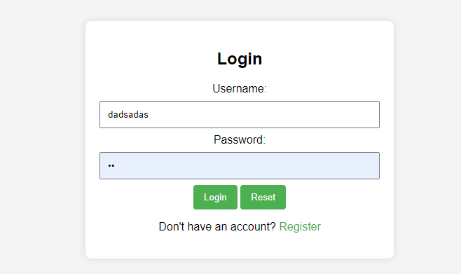 

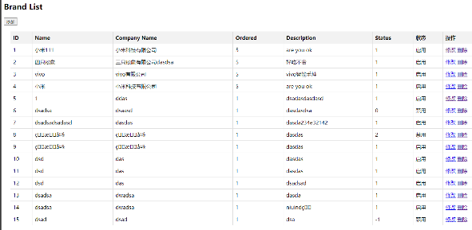 

通常情况下，资源间转发用于普通的数据传输，而会话转发用于对网络流量进行安全检查和管理。

### [Request请求转发](https://xu-runbo.gitee.io/xu-runbo/post/e770816f.html?highlight=request#Request%E8%AF%B7%E6%B1%82%E8%BD%AC%E5%8F%91)

[Request请求转发](https://xu-runbo.gitee.io/xu-runbo/post/e770816f.html?highlight=request#Request%E8%AF%B7%E6%B1%82%E8%BD%AC%E5%8F%91)


### JSTL标签

[JSTL标签](https://xu-runbo.gitee.io/xu-runbo/post/681c540e.html?highlight=jstl#EL%E8%A1%A8%E8%BE%BE%E5%BC%8F)


### 用户登录

#### 实现XXX用户欢迎

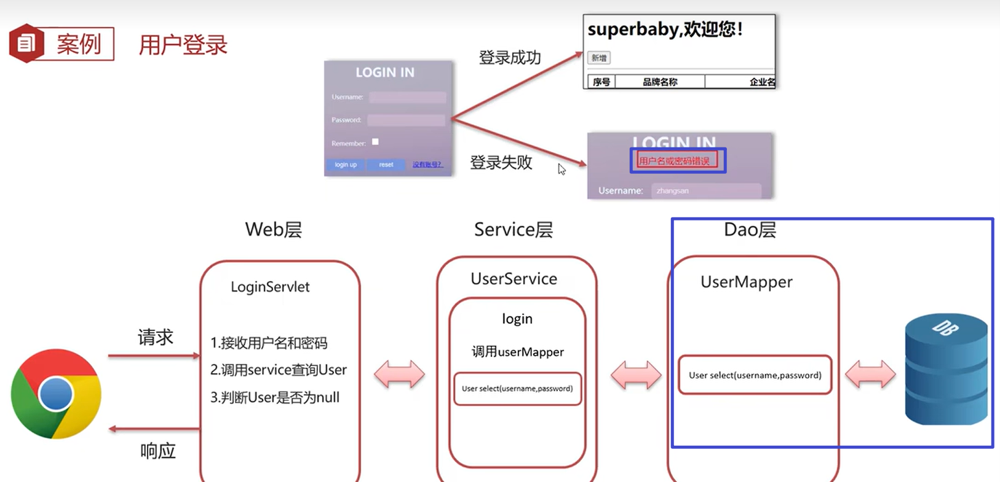 

我们想要在登录后的 页面显示是谁登录了

XXX欢迎你！

登录成功是一个servlet

接下来我们重定向到新的servlet

不同的servlet之间共享信息

一次会话的两次请求之间，我们要共享信息


#### LoginServlet.java

```java
package com.hello.servlet;


import com.hello.mapper.UserMapper;
import com.hello.pojo.User;
import com.hello.service.UserService;
import com.hello.utils.Getfactory;
import org.apache.ibatis.io.Resources;
import org.apache.ibatis.session.SqlSession;
import org.apache.ibatis.session.SqlSessionFactory;
import org.apache.ibatis.session.SqlSessionFactoryBuilder;

import javax.servlet.ServletException;
import javax.servlet.annotation.WebServlet;
import javax.servlet.http.HttpServlet;
import javax.servlet.http.HttpServletRequest;
import javax.servlet.http.HttpServletResponse;
import javax.servlet.http.HttpSession;
import java.io.IOException;
import java.io.InputStream;

@WebServlet("/login")
public class LoginServlet extends HttpServlet {

    private UserService userService=new UserService();
    @Override
    protected void doGet(HttpServletRequest req, HttpServletResponse resp) throws ServletException, IOException {

        System.out.println("先获取信息");
        resp.setHeader("Content-Type", "text/html;charset=utf-8");
        String username=req.getParameter("username");
        String password=req.getParameter("password");


//        优化为
        User user=userService.login(username,password);


        if(user==null)
        {
            resp.getWriter().write("密码错误！");
        }
        else
        {
            resp.getWriter().write("登录成功！！");

            // --------------------------------------------
            //登陆成功后我们把用户的信息传递给session
            HttpSession httpSession=req.getSession();
            httpSession.setAttribute("user",user);
           // --------------------------------------------


            String contextPath=req.getContextPath();
            resp.sendRedirect(contextPath+"/selectall");
        }

    }

    @Override
    protected void doPost(HttpServletRequest req, HttpServletResponse resp) throws ServletException, IOException {
        System.out.println("post!");
        doGet(req, resp);
    }
}


```


#### brand.jsp

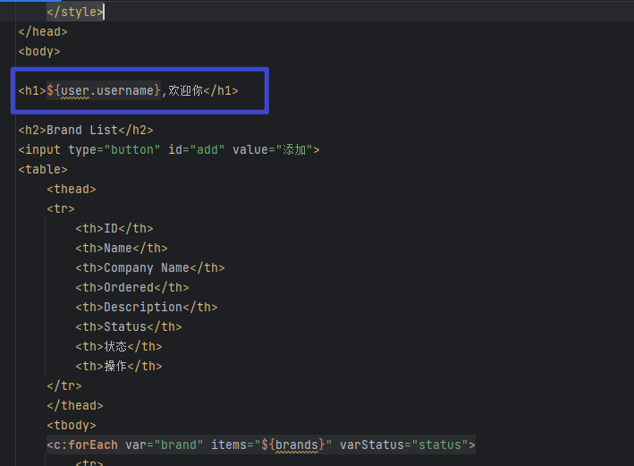 

就可以实现不同用户登陆显示不同

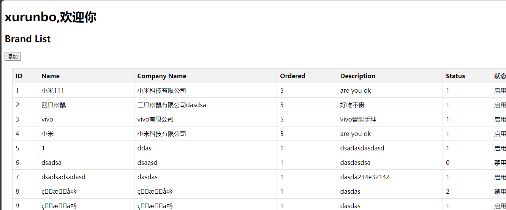 


#### session和req域

Session和存入req域**都是用来在不同的Servlet之间传递数据**的方式。但它们有一些不同之处：

1. 生命周期：**Session的生命周期是整个会话期间**，而存入**req域的数据只在请求处理期间有效**。

2. 共享范围：**Session可以在不同的Servlet之间共享数据**，而存入req域的数据**只能在当前请求的处理期间共享。**

当在一个Servlet中将数据存入Session或者req域中，这些数据会被保存在服务器端，然后在跳转到另一个Servlet时，可以通过Session或者req域来获取之前存入的数据。


#### 提示错误信息

实现，当用户密码不匹配的时候提示一下

因为要用到el表达式，我们把html修改为jsp

只需要前面加上这两句

```jsp
<%@ page language="java" contentType="text/html; charset=UTF-8" pageEncoding="UTF-8"%>
防止乱码
<%@ taglib uri="http://java.sun.com/jsp/jstl/core" prefix="c" %>
```

login.jsp

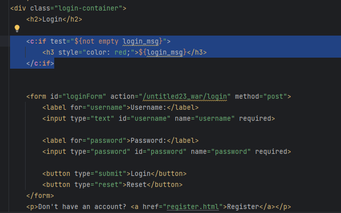 

```jsp
    <c:if test="${not empty login_msg}">
        <h3 style="color: red;">${login_msg}</h3>
    </c:if>
```


现在的loginservlet.java

```java
package com.hello.servlet;


import com.hello.mapper.UserMapper;
import com.hello.pojo.User;
import com.hello.service.UserService;
import com.hello.utils.Getfactory;
import org.apache.ibatis.io.Resources;
import org.apache.ibatis.session.SqlSession;
import org.apache.ibatis.session.SqlSessionFactory;
import org.apache.ibatis.session.SqlSessionFactoryBuilder;

import javax.servlet.ServletException;
import javax.servlet.annotation.WebServlet;
import javax.servlet.http.HttpServlet;
import javax.servlet.http.HttpServletRequest;
import javax.servlet.http.HttpServletResponse;
import javax.servlet.http.HttpSession;
import java.io.IOException;
import java.io.InputStream;

@WebServlet("/login")
public class LoginServlet extends HttpServlet {

    private UserService userService=new UserService();
    @Override
    protected void doGet(HttpServletRequest req, HttpServletResponse resp) throws ServletException, IOException {

        System.out.println("先获取信息");
        resp.setHeader("Content-Type", "text/html;charset=utf-8");
        String username=req.getParameter("username");
        String password=req.getParameter("password");


//        优化为
        User user=userService.login(username,password);


        if(user==null)
        {
            resp.getWriter().write("密码错误！");
            
            
            //------------------------------------
            //存入req域
            req.setAttribute("login_msg","用户密码不匹配");
            //请求转发
            req.getRequestDispatcher("/login.jsp").forward(req,resp);
            //------------------------------------ 

        }
        else
        {
            resp.getWriter().write("登录成功！！");


            //登陆成功后我们把用户的信息传递给session
            HttpSession httpSession=req.getSession();
            httpSession.setAttribute("user",user);


            String contextPath=req.getContextPath();
            resp.sendRedirect(contextPath+"/selectall");
        }

    }

    @Override
    protected void doPost(HttpServletRequest req, HttpServletResponse resp) throws ServletException, IOException {
        System.out.println("post!");
        doGet(req, resp);
    }
}


```


### 记住用户 

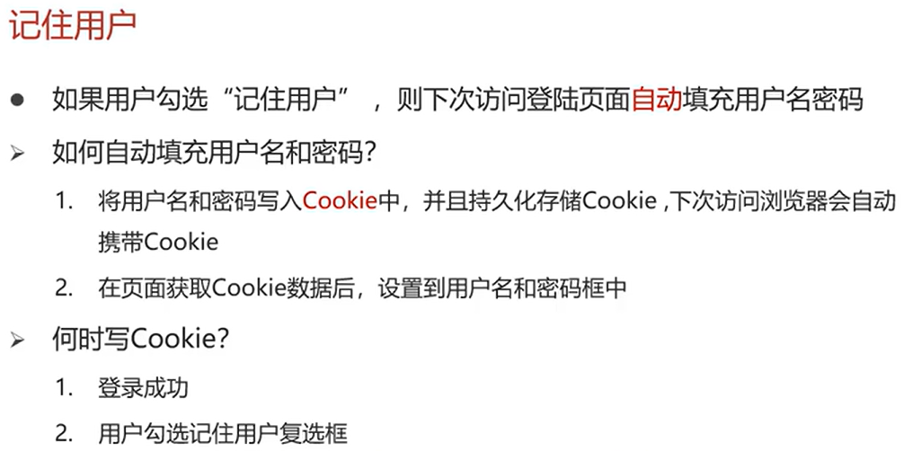 


----

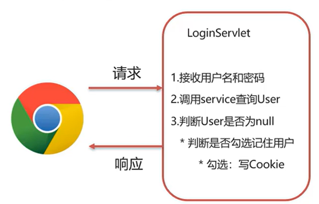 

#### login.jsp


```html
<!DOCTYPE html>
<html lang="en">
<head>
    <meta charset="UTF-8">
    <meta name="viewport" content="width=device-width, initial-scale=1.0">
    <title>Login Page</title>
    <style>
        body {
            font-family: Arial, sans-serif;
            background-color: #f4f4f4;
            text-align: center;
            margin: 100px;
        }
        .login-container {
            max-width: 400px;
            margin: auto;
            background: #fff;
            padding: 20px;
            border-radius: 8px;
            box-shadow: 0 0 10px rgba(0, 0, 0, 0.1);
        }
        input {
            width: 100%;
            padding: 10px;
            margin: 8px 0;
            box-sizing: border-box;
        }
        button {
            background-color: #4caf50;
            color: #fff;
            padding: 10px 15px;
            border: none;
            border-radius: 4px;
            cursor: pointer;
        }
        button:hover {
            background-color: #45a049;
        }
        a {
            text-decoration: none;
            color: #4caf50;
        }
    </style>
</head>
<body>
<div class="login-container">
    <h2>Login</h2>
    <h3 style="color: red;">用户密码不匹配</h3>


    <form id="loginForm" action="/untitled23_war/login" method="post">
        <label for="username">Username:</label>
        <input type="text" id="username" name="username" required>

        <label for="password">Password:</label>
        <input type="password" id="password" name="password" required>

<%--////////////////////////////////////////////////////////////--%>
        <div style="margin-bottom: 10px;">
            <label for="rememberMe" style="margin: 0;">rememberMe</label>
            <input type="checkbox" id="rememberMe" name="remember" value="1" style="display:inline; width: 20px; margin: 0;">
        </div>
    <%--////////////////////////////////////////////////////////////--%>


        <button type="submit">Login</button>
        <button type="reset">Reset</button>
    </form>

    <p>Don't have an account? <a href="register.html">Register</a></p>
</div>
</body>
</html>

```

说明，我们等下根据getparmater来获取到复选框的值来判断是否被选中

获取到的remember的值是1说明被选中了

> 定义了一个复选框元素。
>
> 它有一个id属性为"rememberMe"，name属性为"remember"，以及一个value属性为"1"。
>
> 当用户勾选了这个复选框后，我们可以使用JavaScript或者**后端的Java代码**来获**取这个复选框的值**。
>
> 在后端的Java代码中，我们可以使用request.getParameter("remember")来获取复选框的值。如果复选框被选中，那么返回的值就是"1"；如果没有被选中，那么返回的值就是null。

> 这种前后端的交互方式可以用于用户提交表单时，后端根据用户的输入来做出相应的处理，比如保存用户的选择或者进行其他操作。


#### 细节

`if("1".equals(checkvalue))`是在检查`checkvalue`的值是否等于字符串"1"。

如果`checkvalue`是null或空的话，调用它的`equals`方法

也就是`if(checkvalue.equals("1"))`

会导致`NullPointerException`。通过确保在进行比较之前`checkvalue`不为null或空，可以避免这个潜在问题。

注释强调了处理`checkvalue`可能为null或空值的重要性，作为代码设计中的细节。这有助于确保代码按预期方式运行，并避免意外错误。 

所以，让前者为字符串常量好啊啊啊啊


#### 改造loginservlet

```java
package com.hello.servlet;


import com.hello.mapper.UserMapper;
import com.hello.pojo.User;
import com.hello.service.UserService;
import com.hello.utils.Getfactory;
import org.apache.ibatis.io.Resources;
import org.apache.ibatis.session.SqlSession;
import org.apache.ibatis.session.SqlSessionFactory;
import org.apache.ibatis.session.SqlSessionFactoryBuilder;

import javax.servlet.ServletException;
import javax.servlet.annotation.WebServlet;
import javax.servlet.http.*;
import java.io.IOException;
import java.io.InputStream;

@WebServlet("/login")
public class LoginServlet extends HttpServlet {

    private UserService userService=new UserService();
    @Override
    protected void doGet(HttpServletRequest req, HttpServletResponse resp) throws ServletException, IOException {

        System.out.println("先获取信息");
        resp.setHeader("Content-Type", "text/html;charset=utf-8");
        String username=req.getParameter("username");
        String password=req.getParameter("password");
//---------------------------------------------------------------------------------
        //获取我们前端传来的东西
        String checkvalue=req.getParameter("remember");
//---------------------------------------------------------------------------------        

//        优化为
        User user=userService.login(username,password);


        if(user==null)
        {
            resp.getWriter().write("密码错误！");
            //存入req域
            req.setAttribute("login_msg","用户密码不匹配");
            //请求转发
            req.getRequestDispatcher("/login.jsp").forward(req,resp);

        }
        else
        {
            resp.getWriter().write("登录成功！！");

            //登录成功且勾选了复选框
            
 //---------------------------------------------------------------------------------
            if("1".equals(checkvalue))//细节在于，前这一直不为空，可以避免一些问题
            {

                //发送cookie
                Cookie username_cookie=new Cookie("username",username);
                Cookie password_cookie=new Cookie("password",password);


                username_cookie.setMaxAge(60*60*24);
                password_cookie.setMaxAge(60*60*24);

                resp.addCookie(username_cookie);
                resp.addCookie(password_cookie);

            }

//---------------------------------------------------------------------------------
            //登陆成功后我们把用户的信息传递给session
            HttpSession httpSession=req.getSession();
            httpSession.setAttribute("user",user);


            String contextPath=req.getContextPath();
            resp.sendRedirect(contextPath+"/selectall");
        }

    }

    @Override
    protected void doPost(HttpServletRequest req, HttpServletResponse resp) throws ServletException, IOException {
        System.out.println("post!");
        doGet(req, resp);
    }
}


```

当登陆成功而且还选中了复选框

F12检索就可以看到

服务端拿到了密码和账户，并且发送了cookie

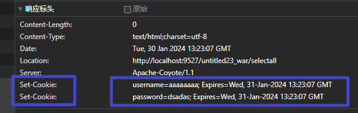 


----

把cookie存储在我们的浏览器

以后的访问就会带着cookie头去请求

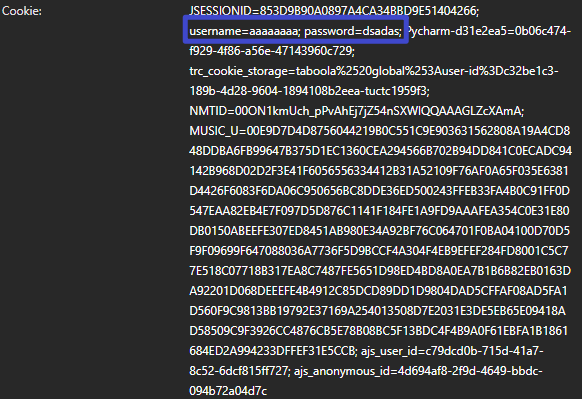 


#### 获取cookie数据

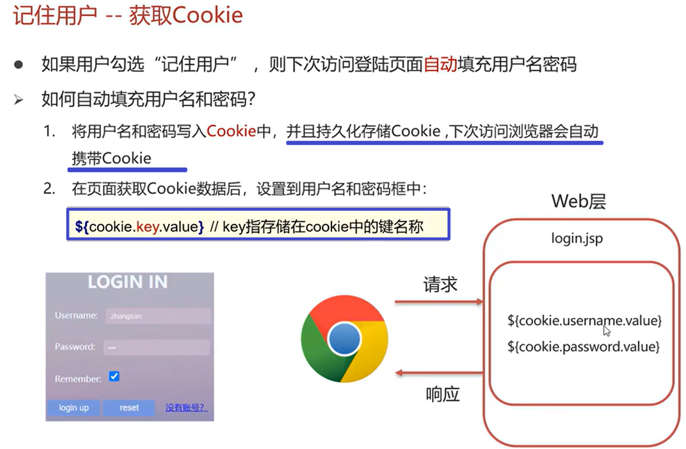 

以后既然都携带cookie了，那我们在前端页面用cookie里的数据填充就好了！


```jsp
<%@ page language="java" contentType="text/html; charset=UTF-8" pageEncoding="UTF-8"%>
<!DOCTYPE html>
<html lang="en">
<head>
    <meta charset="UTF-8">
    <meta name="viewport" content="width=device-width, initial-scale=1.0">
    <title>Login Page</title>
    <style>
        body {
            font-family: Arial, sans-serif;
            background-color: #f4f4f4;
            text-align: center;
            margin: 100px;
        }
        .login-container {
            max-width: 400px;
            margin: auto;
            background: #fff;
            padding: 20px;
            border-radius: 8px;
            box-shadow: 0 0 10px rgba(0, 0, 0, 0.1);
        }
        input {
            width: 100%;
            padding: 10px;
            margin: 8px 0;
            box-sizing: border-box;
        }
        button {
            background-color: #4caf50;
            color: #fff;
            padding: 10px 15px;
            border: none;
            border-radius: 4px;
            cursor: pointer;
        }
        button:hover {
            background-color: #45a049;
        }
        a {
            text-decoration: none;
            color: #4caf50;
        }
    </style>
</head>
<body>
<div class="login-container">
    <h2>Login</h2>
    <h3 style="color: red;">用户密码不匹配</h3>


    <form id="loginForm" action="/untitled23_war/login" method="post">
        <label for="username">Username:</label>
        
        
        
        <%-----------------------------------------------------------------------%>
        <input type="text" id="username" name="username" required value="${cookie.username.value}">
        <%-----------------------------------------------------------------------%>

        <label for="password">Password:</label>
        
        
        <%-----------------------------------------------------------------------%>
        <input type="password" id="password" name="password" required value="${cookie.password.value}">
        <%-----------------------------------------------------------------------%>


        <div style="margin-bottom: 10px;">
            <label for="rememberMe" style="margin: 0;">rememberMe</label>
            <input type="checkbox" id="rememberMe" name="remember" value="1" style="display:inline; width: 20px; margin: 0;">
        </div>


        <button type="submit">Login</button>
        <button type="reset">Reset</button>
    </form>

    <p>Don't have an account? <a href="register.html">Register</a></p>
</div>
</body>
</html>

```


#### 效果

google没有自动填补，edge自动填补

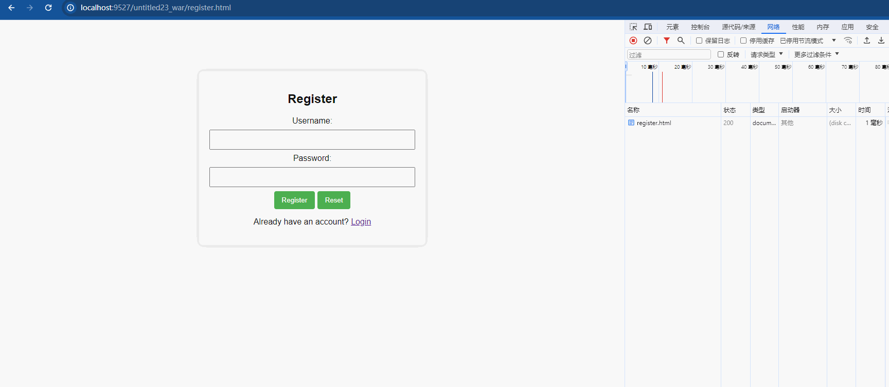


### 注册案例

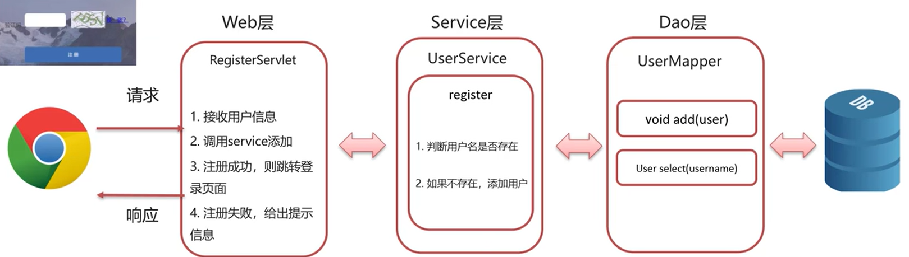 

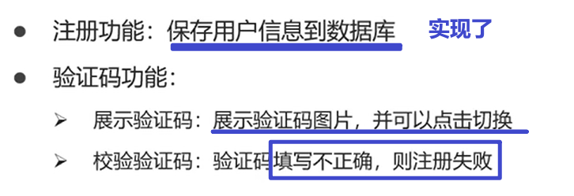 


#### UserService.java添加registter方法，优化

```java
package com.hello.service;

import com.hello.mapper.UserMapper;
import com.hello.pojo.User;
import com.hello.utils.Getfactory;
import org.apache.ibatis.session.SqlSession;
import org.apache.ibatis.session.SqlSessionFactory;

public class UserService {
    private SqlSessionFactory factory= Getfactory.getsqlsessionfactory();


    public User login(String username,String password)
    {
        //获取sqlsession
        SqlSession sqlSession=factory.openSession(true);
        //获取usermapper
        UserMapper userMapper=sqlSession.getMapper(UserMapper.class);
        //执行方法
        User user=userMapper.select(username,password);

        //释放资源
        sqlSession.close();

        return user;

    }
    public boolean register(String username,String password)
    {
        //获取sqlsession
        SqlSession sqlSession=factory.openSession(true);
        //获取usermapper
        UserMapper userMapper=sqlSession.getMapper(UserMapper.class);
        //执行方法检查是否重复
        User user=userMapper.select(username,password);


        if(user== null)
        {
            userMapper.adduser(username,password);
        }

        //释放资源
        sqlSession.close();
        return user == null;

    }


}

```


#### registerServlet.java修改

```java
package com.hello.servlet;

import com.hello.mapper.UserMapper;
import com.hello.pojo.User;
import com.hello.service.UserService;
import com.hello.utils.Getfactory;
import org.apache.ibatis.io.Resources;
import org.apache.ibatis.session.SqlSession;
import org.apache.ibatis.session.SqlSessionFactory;
import org.apache.ibatis.session.SqlSessionFactoryBuilder;

import javax.servlet.ServletException;
import javax.servlet.annotation.WebServlet;
import javax.servlet.http.HttpServlet;
import javax.servlet.http.HttpServletRequest;
import javax.servlet.http.HttpServletResponse;
import java.io.IOException;
import java.io.InputStream;

@WebServlet("/register")
public class RegisterServlet extends HttpServlet {
    private UserService userService=new UserService();
    @Override
    protected void doGet(HttpServletRequest req, HttpServletResponse resp) throws ServletException, IOException {
        System.out.println("先获取用户填写的信息");
        resp.setHeader("Content-Type", "text/html;charset=utf-8");


        //获取用户信息
        String username=req.getParameter("username");
        String password=req.getParameter("password");


        boolean flag=userService.register(username,password);


        if(flag)
        {
            req.setAttribute("register_msg","注册成功，请登录");
            req.getRequestDispatcher("/login.jsp").forward(req,resp);
        }
        else
        {
            req.setAttribute("register_msg","用户名已经存在");
            req.getRequestDispatcher("/register.jsp").forward(req,resp);
        }

    }

    @Override
    protected void doPost(HttpServletRequest req, HttpServletResponse resp) throws ServletException, IOException {
        doGet(req, resp);
    }
}

```


#### regiset.jsp

```jsp
<%@ page language="java" contentType="text/html; charset=UTF-8" pageEncoding="UTF-8"%>
<!DOCTYPE html>
<html lang="en">
<head>
    <meta charset="UTF-8">
    <meta name="viewport" content="width=device-width, initial-scale=1.0">
    <title>Register Page</title>
    <style>
        body {
            font-family: Arial, sans-serif;
            background-color: #f4f4f4;
            text-align: center;
            margin: 100px;
        }
        .register-container {
            max-width: 400px;
            margin: auto;
            background: #fff;
            padding: 20px;
            border-radius: 8px;
            box-shadow: 0 0 10px rgba(0, 0, 0, 0.1);
        }
        input {
            width: 100%;
            padding: 10px;
            margin: 8px 0;
            box-sizing: border-box;
        }
        button {
            background-color: #4caf50;
            color: #fff;
            padding: 10px 15px;
            border: none;
            border-radius: 4px;
            cursor: pointer;
        }
        button:hover {
            background-color: #45a049;
        }
    </style>
</head>
<body>
<div class="register-container">
    <h2>Register</h2>
    <form id="registerForm" action="/untitled23_war/register">
        <label for="username">Username:</label>
        <input type="text" id="username" name="username" required>

        <label for="password">Password:</label>
        <input type="password" id="password" name="password" required>

        <p>${register_msg}</p>>

        <button type="submit">Register</button>
        <button type="reset">Reset</button>
    </form>
    <p>Already have an account? <a href="login.jsp">Login</a></p>
</div>
</body>
</html>

```


#### login.jsp

```jsp
<%@ page language="java" contentType="text/html; charset=UTF-8" pageEncoding="UTF-8"%>
<!DOCTYPE html>
<html lang="en">
<head>
    <meta charset="UTF-8">
    <meta name="viewport" content="width=device-width, initial-scale=1.0">
    <title>Login Page</title>
    <style>
        body {
            font-family: Arial, sans-serif;
            background-color: #f4f4f4;
            text-align: center;
            margin: 100px;
        }
        .login-container {
            max-width: 400px;
            margin: auto;
            background: #fff;
            padding: 20px;
            border-radius: 8px;
            box-shadow: 0 0 10px rgba(0, 0, 0, 0.1);
        }
        input {
            width: 100%;
            padding: 10px;
            margin: 8px 0;
            box-sizing: border-box;
        }
        button {
            background-color: #4caf50;
            color: #fff;
            padding: 10px 15px;
            border: none;
            border-radius: 4px;
            cursor: pointer;
        }
        button:hover {
            background-color: #45a049;
        }
        a {
            text-decoration: none;
            color: #4caf50;
        }
    </style>
</head>
<body>
<div class="login-container">
    <h2>Login</h2>
    <h3 style="color: red;">${login_msg} ${register_msg}</h3>


    <form id="loginForm" action="/untitled23_war/login" method="post">
        <label for="username">Username:</label>
        <input type="text" id="username" name="username" required value="${cookie.username.value}">

        <label for="password">Password:</label>
        <input type="password" id="password" name="password" required value="${cookie.password.value}">

        <div style="margin-bottom: 10px;">
            <label for="rememberMe" style="margin: 0;">rememberMe</label>
            <input type="checkbox" id="rememberMe" name="remember" value="1" style="display:inline; width: 20px; margin: 0;">
        </div>


        <button type="submit">Login</button>
        <button type="reset">Reset</button>
    </form>

    <p>Don't have an account? <a href="register.jsp">Register</a></p>
</div>
</body>
</html>

```


#### 效果展示

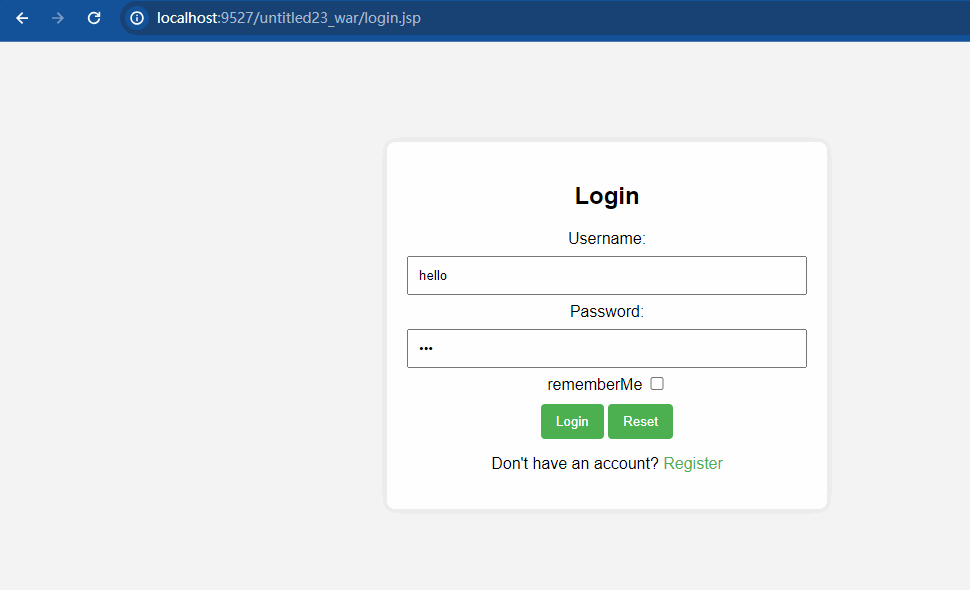

因为我们比对的是用户名和用户密码，也就是只有这俩都不一样的时候才是不一样

只有用户名一样密码不一样，也是可以创建的。

自行修改，。。。
