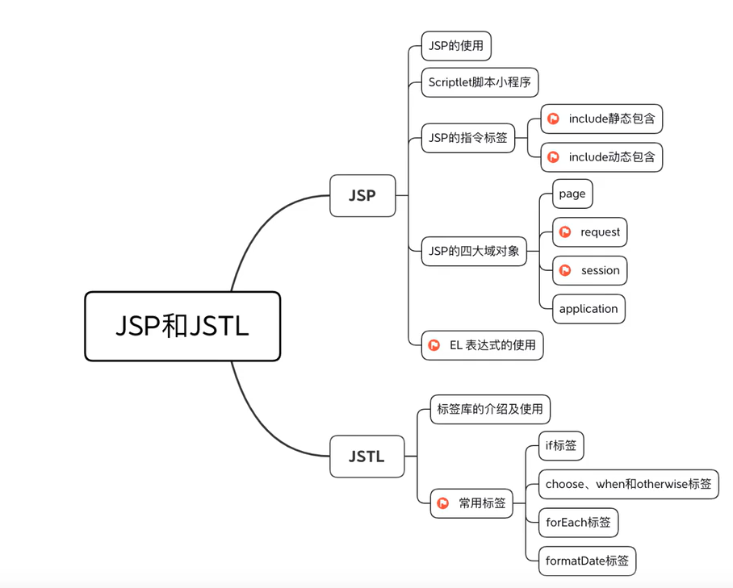

# JSP和JSTL

## 概论

 

## 为什么学习JSP，能干嘛？

> 1. 动态网页开发：JSP是一种用于创建动态网页的技术，它允许开发者在HTML页面中嵌入Java代码，从而实现动态内容的展示和交互。
> 2. 开发效率和维护性：JSP可以将业务逻辑和页面展示分离，使得开发更加模块化和清晰

## JSP的基础语法

### 简介

Java Server Page是java web服务端的动态资源

