#  JavaWeb_MySQL

涉及哪些知识 

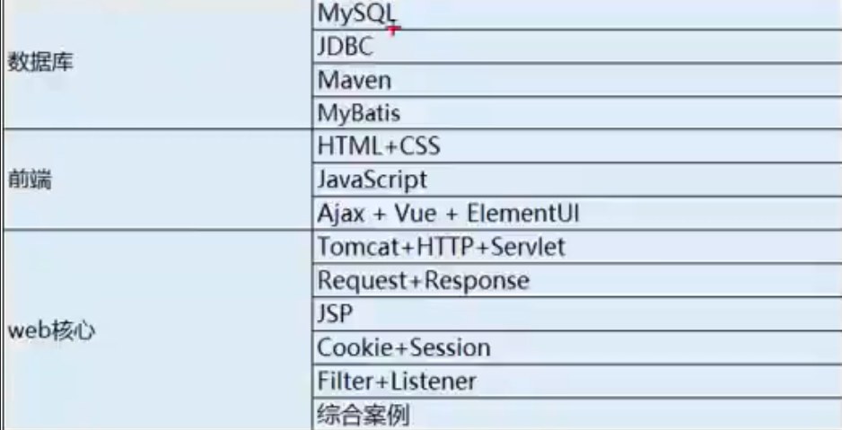 

> 1. MySql:数据库
> 2. JDBC:是java操作数据库API
> 3. Maven :管理项目很方便的东西
> 4. Mybaties:简化JDBC的框架
> 5. vue和Elementui是前端的框架，。，
>
> ---
>
> Maven（也称为Apache Maven）是一个用于**项目管理和构建的开源工具**。它提供了一种管理项目的方式，可以帮助开发团队更有效地构建、发布和管理软件项目。

## Java Web简介

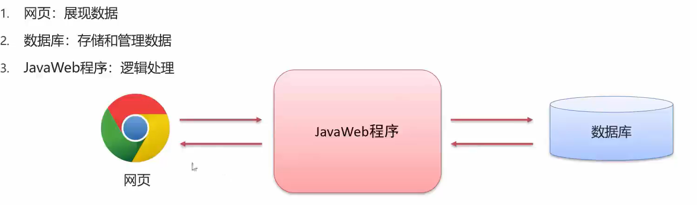

> 网页那些东西是前端的
>
> java web和数据库是后端

## 数据库MySql

### 关于数据库

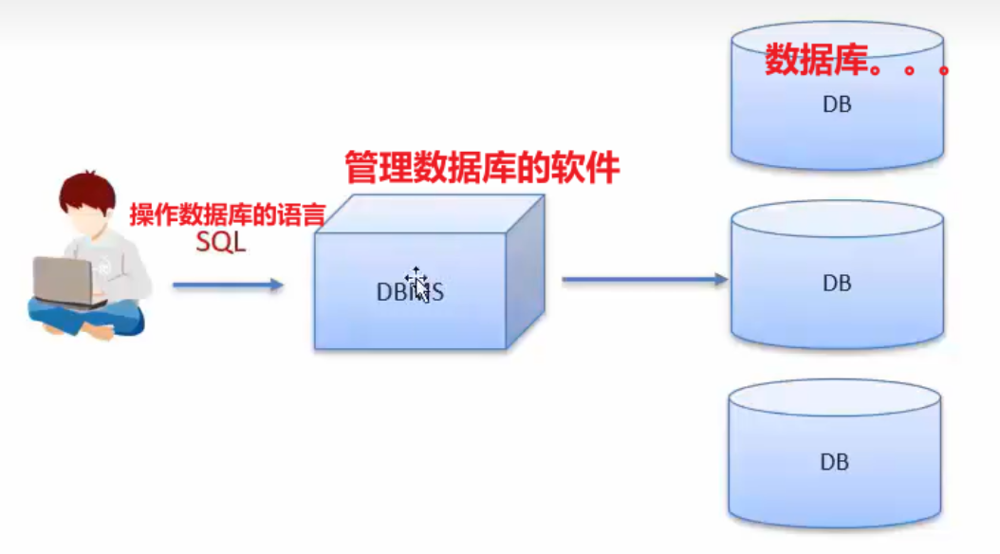  

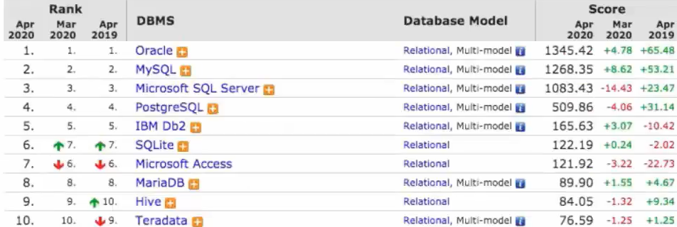

数据库管理系统：MySql。。。

### 数据库了解

> 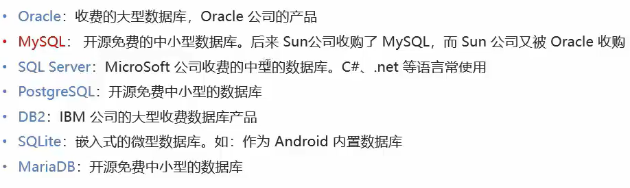 

**SQL就是去操作-花里胡哨-的==关系型==数据库的语言**


### MySql数据模型

> 关系型数据库
>
> 非关系型数据库

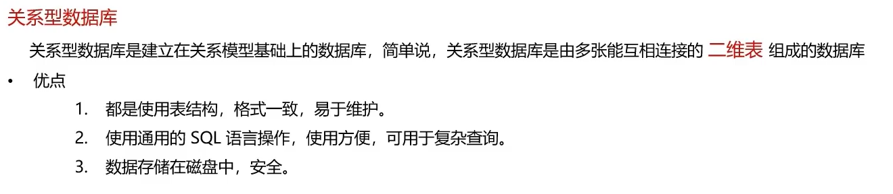 

多张有关系的二维表组成的数据库！

而且数据存储在硬盘里

不易丢失

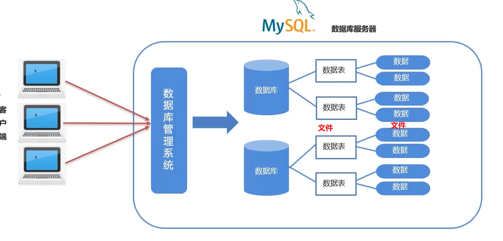 

表frm，，数据myd

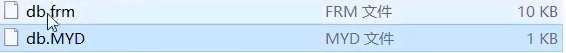 


## SQL

### SQL简介

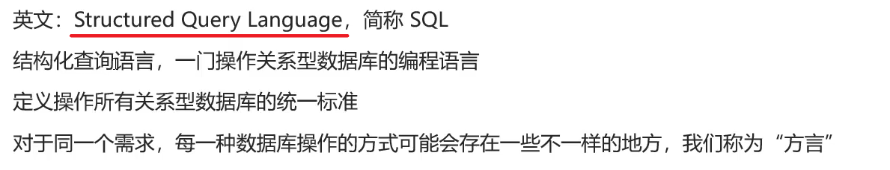 

### SQL分类

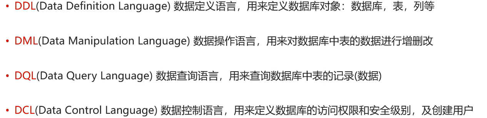 


### SQL的通用语法

> 1. **分号结尾**
>
> 2. 不区分大小写CREAT和creat是同理的--建议关键字用大写
>
> 3. 注释
>
>    **`-- 注释内容`两个-和一个空格，后面是注释的语句(SQL的特有)**
>
>    `#注释内容`#紧跟着注释内容
>
>    `/*注释内容*/`中间被抱起来的就是注释内容

演示

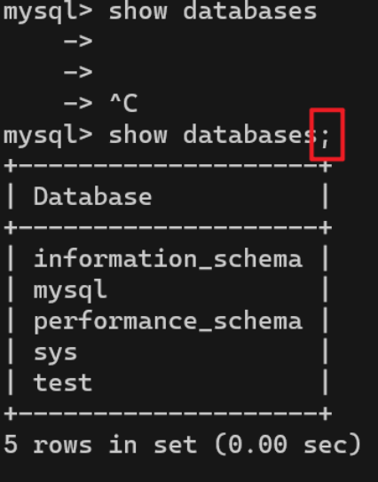 

 

### DDL(Data Definition Language)数据定义

 

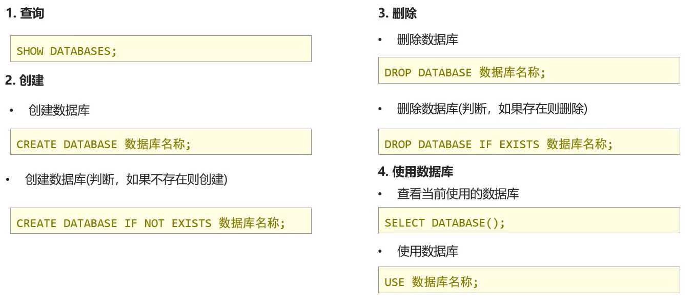

找规律：数据库名一般在最后 

exist加s

只有show的时候database才+s

特殊的是查询当前数据库的时候要加();emmmm理解为函数吧，暂时。。

#### 查询数据库show

> `SHOW DATABASES;`

代码演示:

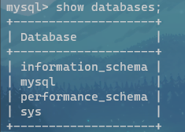 

自带的四个数据库：

---

特殊的表，视图，是逻辑表。

性能数据库，，，的信息，

玩我们自己的数据库

#### 创建数据库(条件)create

> 无脑创建
>
> `CREATE DATABASE 数据库名;`
>
> 条件创建
>
> `CREATE IF NOt EXISTS 数据库名;`
>
> 为什么需要条件创建呢？
>
> 如果存在了你再去创建就给你报错。。
>
>  

代码演示:

 

创建数据库

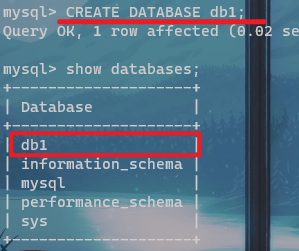 

条件创建数据库

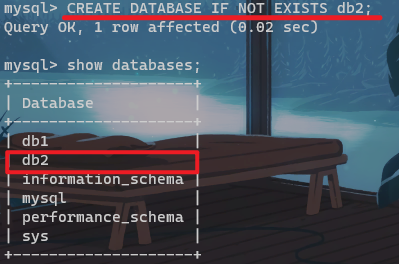 

#### 删除数据库(条件)drop

> 无脑删除
>
> `DROP DATABASE 数据库名;`
>
> 条件删除
>
> `DROP DATABASE IF EXISIS 数据库名;`
>
> 存在的意义就是防止删除一个不存在的数据库报错，，

代码演示 

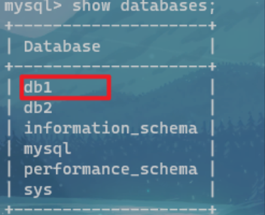 

普通删除

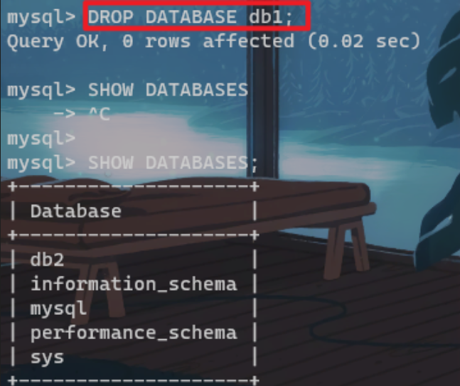 

条件删除

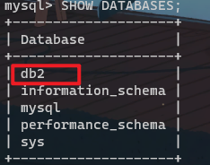 

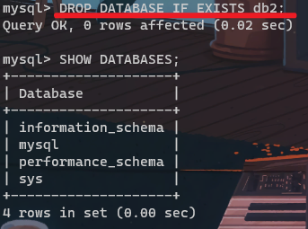 

#### ==使用数据库(当前，想要)select use==

> 查看当前用的哪个数据库
>
> `SELECT DATABASE();`
>
> 要使用数据库
>
> `USE 数据库名;`

代码演示:

查询当前使用的数据库:

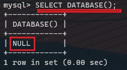  

使用数据库

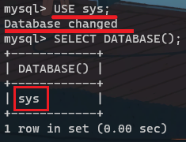 

#### TEST

> 用优雅的方式完成下列操作:
>
> 1. 创建一个db1的数据库
> 2. 使用创建的数据库
> 3. 删除创建的数据库
> 4. 展示当前正在使用数据库

#### --------------------------------

#### 查询表/表结构

> 先进入一个数据库
>
> ---
>
> 查询数据库有哪些表
>
> `SHOW tables;`
>
> 想看哪一个表的结构description描述
>
> `desc 表名;`
>
> ---
>
> ==**desc查的是表的结构，而不是数据**== 
>
> `SELECT * from 表名;`才是看表的数据
>
> 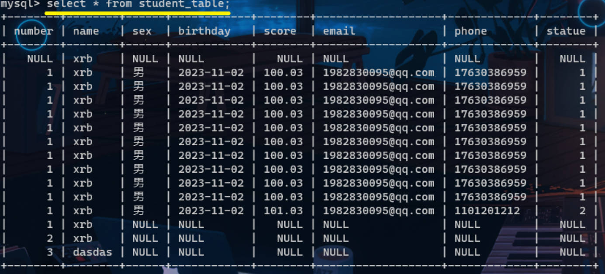  

代码演示;

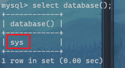 

使用的sys数据库

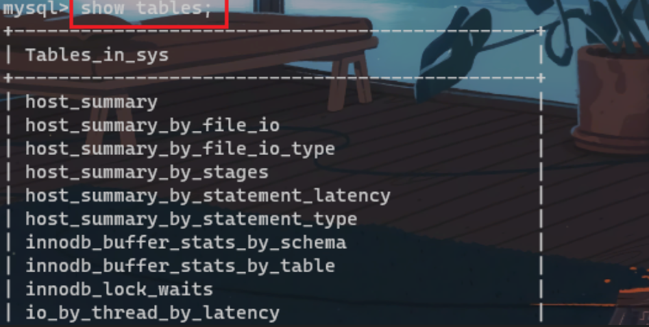 

得到数据库的所有表

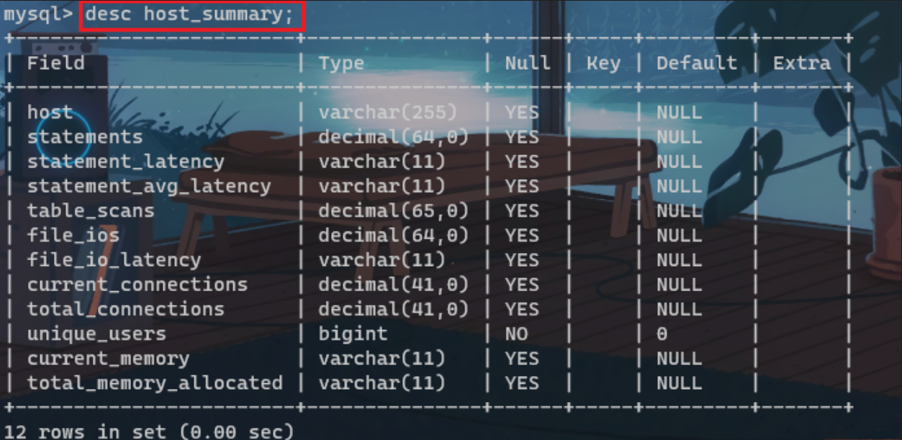

查看第一张**表的结构**！

==**desc查的是表的结构，而不是数据**==

#### ==创建表==

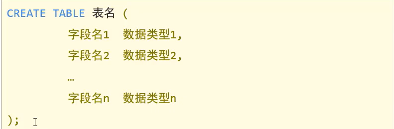 

最后一行末尾不能有,

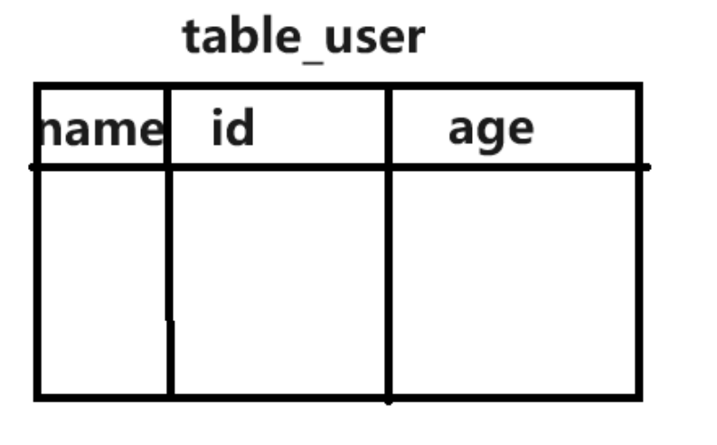 

代码演示: 

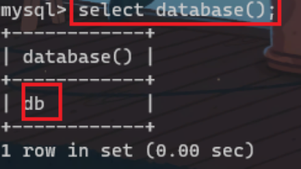 

切换库 

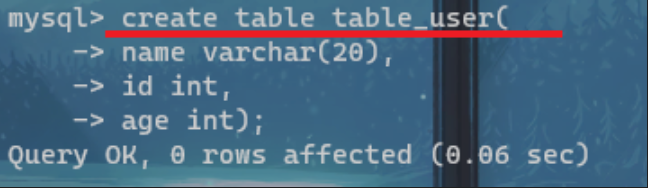 

创建表 

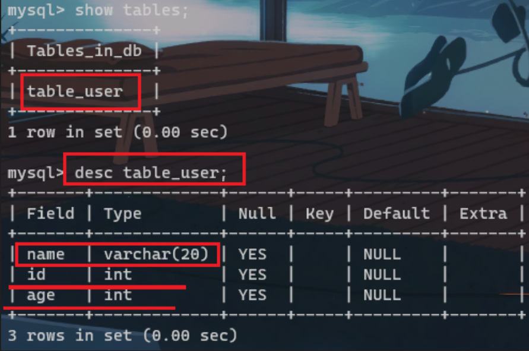 

查看创建的表的结构

==查看的是表的结构==

##### 案例

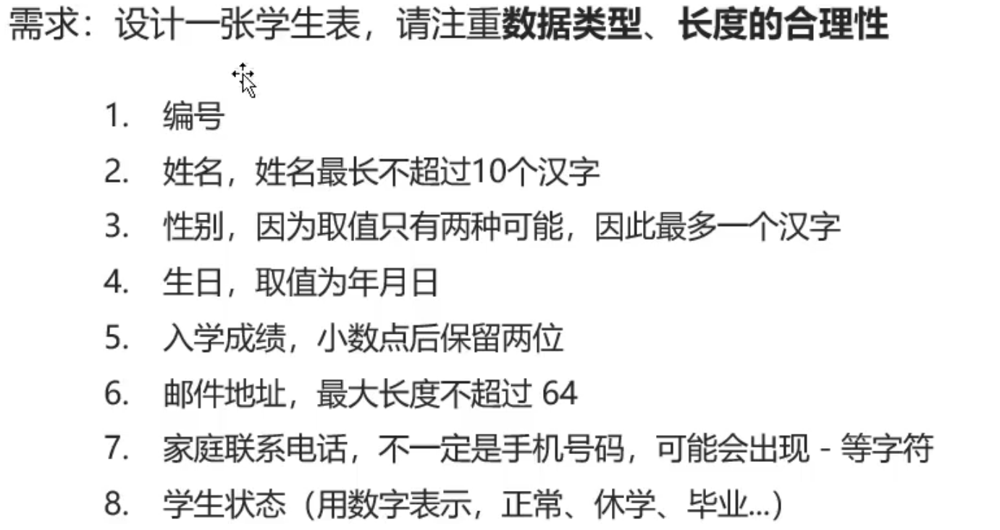   

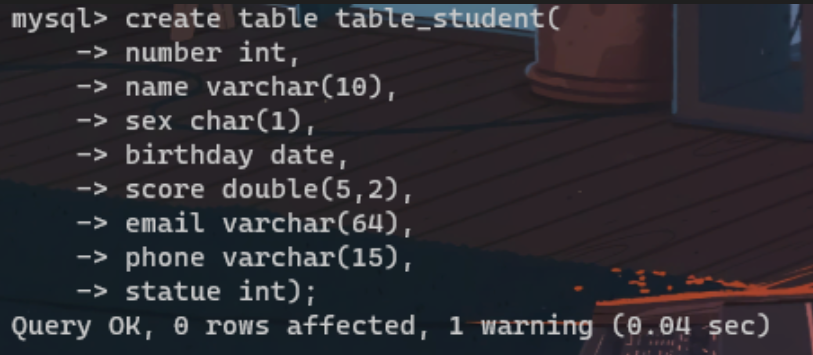  

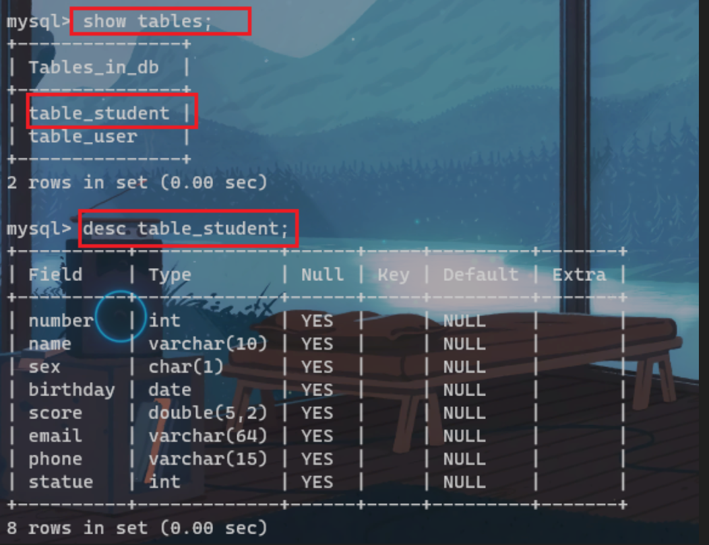 

更正》》》

学生状态因为只有一个数字可以用tinyint


----

#### 删除表

> 无脑删除
>
> `DROP TABLE 表名;`
>
> 条件删除
>
> `DROP TABLE IF EXISTS 表名;`
>
> 也是为了防止删除不存在的表的时候报错;

代码演示:

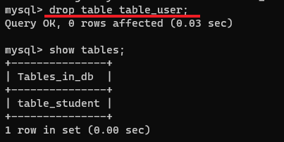 

#### ==修改表==

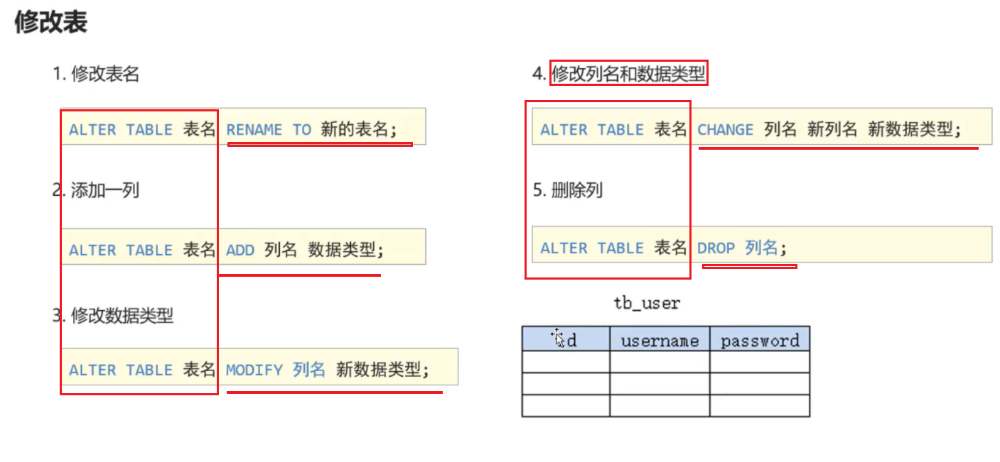  

##### 修改表名称

> `ALTER TABLE 表名 RENAME TO 新的表名;`

代码演示:

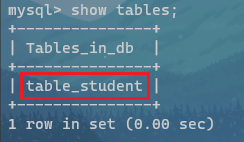 

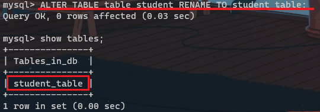 

##### 添加新列

> `ALTER TABLE 表名 ADD 列名 列数据类型;`

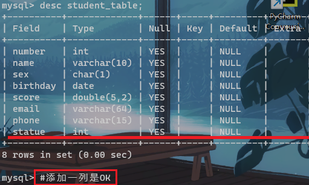 

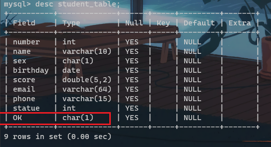 

##### 修改某一列的数据类型

> `ALTER TABLE 表名 MODIFY 列名 新的数据类型;`

代码演示

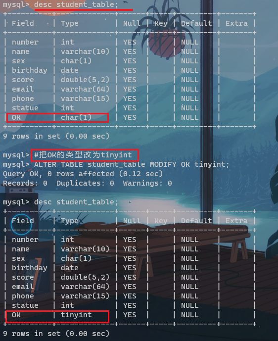 

##### 修改列名并顺手改数据类型

> `ALTER TABLE 表名 CHANGE 列 新列名 数据类型;`

代码演示：

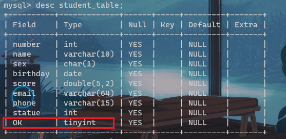 

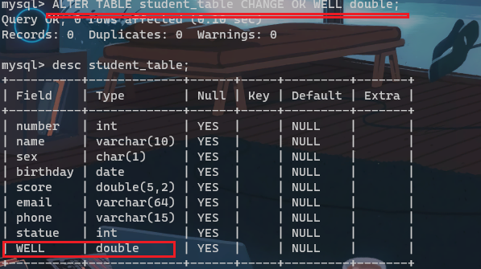 

经过测试，不能不写新的数据类型。

##### 删除列

> `ALTER TABLE 表名 DROP 列名; `

代码演示:

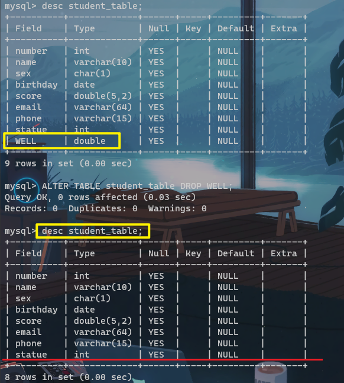 

#### SQL的数据类型

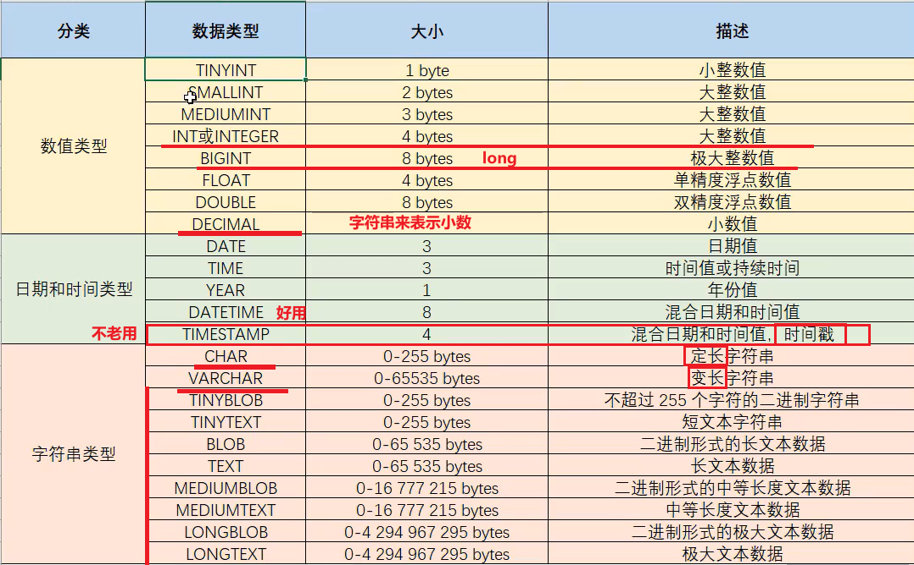

用法

>  age int
>
> score double(分数值的总长度，小数点后保留的位数)
>
> 0-100分，保留两位小数；score double(5,2)
>
> birthday date;
>
> 字符串
>
> name char(10);字符个数不可以超过十个
>
> name varchar(10);;字符个数不可以超过十个
>
> > 定长和变长的区别
> >
> > varchar先去计算实际数据的空间来决定实际占用
> >
> > 张三存在varchgar(10) 占了2个字符
> >
> > 张三存在char(10)里面占了10个，其他的都用空格
> >
> > ---
> >
> > varchar节约空间但是存储性能低
> >
> > char浪费空间但是存储性能高

> 保留两位小数89.020,100.02,9.0900

### DML(Data Manipulation Language)==数据操作==

 

#### 添加数据INSERT INTO

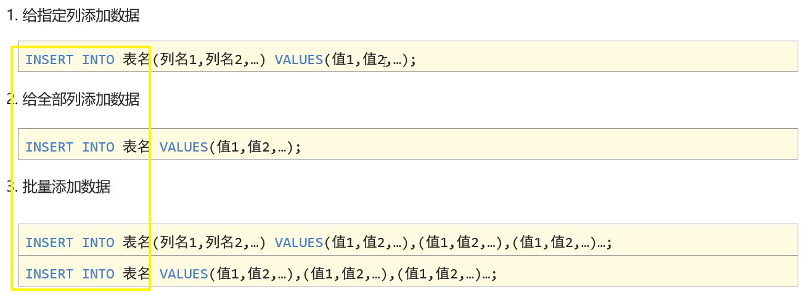 

##### 给指定列添加数据

> `INSERT INTO 表名(列名1,列名2,...) VALUES(值1,值2...);`

代码演示：

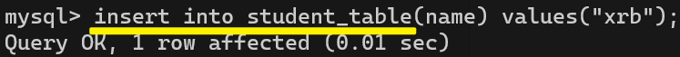 

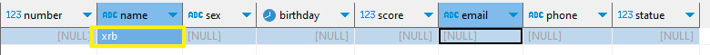 

##### 给全部列都添加数据

> `INSERT INTO 表明 VALUES(值1,值2,,,,,,)`
>
> 值是一一对应的

代码演示:


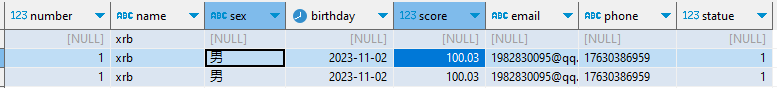 

##### 批量添加数据

> `INSERT INTO 表名(列1,列2,...) VALUES(值1，值2....),(值1，值2....),(值1，值2....)...;`
>
> `INSERT INTO 表名 VALUES(值1，值2....),(值1，值2....),(值1，值2....)....;`

代码演示:

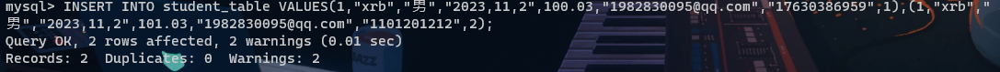 

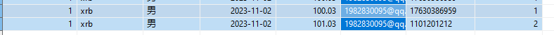 

---

 

 

> 推荐把对应的列名写出来，而不是暗中默默对应。。。。

#### *修改数据UPDATE

> `UPDATE 表名 set 列=值，列2=值......[where 条件];`
>
> 判断相等是=
>
> ----
>
> **如果不写条件的话，默认把所有数据都改掉;**

代码演示:


  

  

 

这里的where理解为if就好了...

或者。。在哪里改呢，在分数为101.03哪一行改

神踏马定语从句hh


#### *删除数据DELETE FROM

> `DELETE FROM 表名 [where 条件];`
>
> 如果不加条件，默认把表弄为空！

代码演示:

 

 

---

 

空空如也

#### 条件

 

### DQL(Data Query Language)==数据查询==

 

  

#### 基础查询

> `SELECT 列，列1,列2...(*全部列) FROM 表名;`
>
> 去除重复的结果
>
> `SELECT DISTINCT 列，列1,列2...(*全部列) FROM 表名;`

代码演示：

  

---

 

---

起别名

  

---

  

去除重复

  


#### 条件查询WHERE

> `SELECT 列表 FROM 表名 WHERE 条件列表;`
>
> ==**基础查询加了WHERE 条件列表**==
>
> 注意where不要省略
>
> 推荐用and而不是&&

代码演示

 

 

 

==推荐使用and==;

 

  

> > > 注意null不能用= !=
> > >
> > > 而是用is null和is not null

 


----

##### ==模糊查询like==

> 记住_匹配一个字符
>
> %匹配人一个字符
>
> 再配合like使用
>
> 加上""
>
> 食用更佳

  

  

  

  


##### 条件

  

#### 分组查询GROUP BY

##### 聚合函数

概念:将一列作为一个整体，进行纵向计算。

 

==**null都不参与聚合函数的运算**==

> `SELECT 聚合函数名(列名) FROM 表;`

代码演示

  

  

 

---

##### 分组查询

 

> 要查的东西必须是
>
> 分组字段，聚合函数。
>
> 其他的没有意义。
>
>  
>
> 
>
> 会直接报错！

代码演示: 

 

 现在需求

  

 

需求
 

因为having是能对聚合函数进行操作的，而where不可以。

 

> 分组查询：
>
> 那些聚合函数会默认的去对分完组的列表进行计算，而不是对整张表。。。

#### 排序查询ORDER BY

 

==**如果有多个排序条件，只有前面的条件值一样的时候才根据第二条件排序**==

代码演示：

 

  

**前面查询表结构的desc是describe的缩写，这里降序的desc是descend的缩写** 

> 现在我想让根据mathscore降序且mathscore相等的时候，id进行升序；
>
>  
>
> 代码演示
>
>  

#### ==分页查询LIMIT==

效果：

 

> `SELECT 列表 FROM 表名 LIMIT 起始索引，查询条目数;`
>
> 起始索引是从0开始的
>
> ==**起始索引=(当前页码-1)*每页显示的条数**==
>
>  

 代码演示:

 


### DCL(Data Control Language)数据权限控制

 

#### 约束

##### 概念&分类

> 作用于列上的规则，限制加入表的数据
>
> 保证了数据的正确性，有效性，完整性

 

==**MySQL不支持检查约束**==

> 主键是指在一个表中用来唯一标识每一行数据的字段或字段组合。
>
> 主键的作用是**确保表中的每一行都有一个唯一的标识符**。
>
> 非空且唯一

##### 约束的使用

```sql
create table stuff(
id int primary key,
name varchar(20) unique,
birthday date not null,
salary double(7,2) not null,
bonus double(7,2) default 0
);
```

主键约束:非空唯一

 

  

唯一约束

  

默认约束


主键自增

当列是数字类型并且唯一约束的时候会自己增加；

 

#####  ==外键约束==

>   
>
> 如果有这样的两张表，mysql会认为这是两张独立的表，
>
> 我们认为是有逻辑关系但是没有物理联系
>
> 如何外键连接起来呢。
>
> ---
>
> 现在可以删除郑州那一行，是没问题的
>
> 但实际中，要删除郑州这个部门，是要先把张三和李四给开除掉，然后再删除郑州部门。
>
> ---
>
> 如何实现呢
>
> > `CREAT TABLE 表(`
> >
> > `	   			列名 数据类型,`	   			
> >
> > `.......`
> >
> > `CONSTRAINT 外键名称 FRREIGN KEY(外键列名，从表的列) REFERENCES 主表(主列表名))`
> >
> > RFOREIGN KEY后面的是从表的列，REFERENCES 后面的主表和主表的列;
> >
> > 创建外键的时候要保证主表已经创建好了。。。
> >
> >   

代码演示:

在创建外键约束时，主表的列通常需要有索引以提高查询性能。

**primary**  key

```sql
create table stuff(
id int,
name varchar(20),
depid int,
constraint forekey foreign key(depid) references dep(did)
);
insert into stuff(id,name,depid) values(1,"张三",1);
insert into stuff(id,name,depid) values(2,"李四",1);
insert into stuff(id,name,depid) values(3,"王五",2);


create table dep(
did int primary key auto_increment,
address varchar(10)
);
insert  into dep(address) values("郑州");
insert  into dep(address) values("杭州");

select * from stuff;
select * from dep;

delete from stuff where depid=1;
delete from dep where address="郑州";
```

 

利用外键建立depid和did之间的物理联系 


 

  

> 涉及的问题
>
> 在创建外键约束时，被引用的列(主表的列)通常**需要有主键**或**唯一约束**。
>
> 需要确保(主)`dep` 表中的 `did` 列有**主键**或唯一约束，这样才能成功创建**外键约束**。
>
> 建表后的添加外键
>
> `ALTER TABLE 次表名 ADD CONSTRAINT FOREIGN KEY(次表的列) REFERENCES 主表(主表的列);`

##### 删除外键

> 外键是表和表的关系
> `ALTER TABLE 次表 DROP FOREIGN KEY 外键名;`

代码演示:

 

##### 小结

---

 

 

  

> 最好用的就是
>
> `alter table 表名 modify 列名 去掉约束的数据类型;`
>
> varchar(20) unique->varchar(20);

### 数据库设计

> 对于软件的开发很有用
>
> 软件研发步骤:\
>
> +   
>
> + 数据库设计概念
>
>   根据业务系统的具体需求，结合DDBMS，为业务系统选择最好的数据存储模型
>
>   建立数据库中的表结构和表与表之间的关联关系的过程
>
>   哪些表，哪些列，表和表之间的关系
>
> + 数据库设计 的步骤
>
>    

#### 表关系

> 1. 一对一

人和身份证

+ 一对一关系多用于表的拆分，将一个实体中常用到的字段放到一张表，不经常使用的字段放到另一张表提升查询性能

> 1. 一对多(很多)，多对一

部门和员工

从部门来看是一对多

从员工来看是多对一

> 1. 多对多

商品和订单

一个商品对应多个订单

一个订单对应多个商品

---

#### MYSQL实现表关系

##### 一对多/多对一

 

代码演示

```sql
create table dep(
id int primary key auto_increment,
func varchar(10),
address varchar(20)
);

insert into dep(func,address) values("研发部","郑州"),("销售部","洛阳");
select * from dep;


create table stuff(
stuff_id int primary key auto_increment,
name varchar(10),
depid int,
constraint forekey foreign key(depid) references dep(id)
)

insert into stuff(name,depid) values("张三",1);
insert into stuff(name,depid) values("李四",2);
insert into stuff(name,depid) values("王五",2);
insert into stuff(name,depid) values("赵六",1);
select  * from stuff; 
select  * from dep; 
```

##### 多对多

 

代码实现:

```sql
create table tb_order(
id int primary key auto_increment,
payment double(10,2),
payment_type varchar(10),
status varchar(10)
);


create table tb_goods(
id int primary key auto_increment,
title varchar(20),
price double(10,2)
);


insert into tb_order(payment,payment_type,status) values(1234,"微信支付","未付款");
insert into tb_order(payment,payment_type,status) values(234,"微信支付","未付款");
insert into tb_order(payment,payment_type,status) values(104,"支付宝支付","已付款");


insert into tb_goods(title,price) values("华为P90",9999);
insert into tb_goods(title,price) values("华为P80",1111);
insert into tb_goods(title,price) values("华为P70",2222);
insert into tb_goods(title,price) values("华为P60",7777);
insert into tb_goods(title,price) values("华为P30",8888);


create table tb_middle(
id int primary key auto_increment,
order_id int,
goods_id int,
count int
);

alter table tb_middle add constraint middle_order foreign key(order_id) references tb_order(id);
alter table tb_middle add constraint middle_goods foreign key(goods_id) references tb_goods(id);

select * from tb_goods;
select * from tb_order;
select * from tb_middle;
```

 

##### 一对一

代码实现

```sql
create table qq_user(
id int primary key auto_increment,
nickname varchar(10),
age int,
sex varchar(5)
);


create table qq_user_desc(
id int primary key auto_increment,
city varchar(10),
edu varchar(5),
income double(10,2),
status varchar(5),
detail varchar(5) default "---"
);

insert  into qq_user(nickname,age,sex) values("马车",19,"男");
insert  into qq_user(nickname,age,sex) values("赵晕",39,"男");
insert  into qq_user(nickname,age,sex) values("张飞",29,"女");
#_---
insert  into qq_user_desc(city,edu,income,status) values("广州","博士",3000,"单身狗");
insert  into qq_user_desc(city,edu,income,status) values("湖南","高中",23000,"已婚");
insert  into qq_user_desc(city,edu,income,status) values("湖北","小学",13000,"离异带俩娃");

select * from qq_user;
select * from qq_user_desc;

alter table qq_user add desc_id int primary key;


alter table qq_user drop desc_id;
alter table qq_user add constraint qqkey foreign key(id) references qq_user_desc(id);
alter table qq_user drop foreign key qqkey;
```

 

 

#### 数据库设计案例

 

### 多表查询

引入:

> `select * from 表1,表2;`
>
> 笛卡尔积：A，B两个集合，去A，B的所有组合情况

测试代码

```sql
create table dep(
id int primary key auto_increment,
func varchar(10),
address varchar(20)
);

insert into dep(func,address) values("研发部","郑州"),("销售部","洛阳");

create table stuff(
stuff_id int primary key auto_increment,
name varchar(10),
depid int,
constraint forekey foreign key(depid) references dep(id)
)

insert into stuff(name,depid) values("张三",1);
insert into stuff(name,depid) values("李四",2);
insert into stuff(name,depid) values("王五",2);
insert into stuff(name,depid) values("赵六",1);
select  * from stuff;
select * from dep;
select * from stuff,dep;
select * from stuff,dep where stuff.depid=dep.id;
```

 

`select * from stuff,dep;`

 

`select * from stuff,dep where depid=id;`

 

#### 连接查询

##### 内连接(交集)

> -- 隐式内连接
>
> `seect 字段列表 from 表1，表2 where 条件;`
>
> 查询AB**交集的数据**
>
> -- 显示内连接
>
> `select 字段列表 from 表1 [inner] join 表2 on 条件;`
>
> Inner可以省略/。。。。。

> **select** * **from** stuff,dep **where** stuff.depid=dep.id;
>
> **select** * **from** stuff **inner** **join** dep **on** stuff.depid=dep.id;
>
>   

现在我要求：

 

代码实现:

```sql
create table dep(
id int primary key auto_increment,
func varchar(10),
address varchar(20)
);

insert into dep(func,address) values("研发部","郑州"),("销售部","洛阳");


create table stuff(
stuff_id int primary key auto_increment,
name varchar(10),
depid int,
addr varchar(20)
);

insert into stuff(name,depid,addr) values("张三",1,"日本");
insert into stuff(name,depid,addr) values("李四",2,"日本");
insert into stuff(name,depid,addr) values("王五",2,"日本");
insert into stuff(name,depid,addr) values("赵六",1,"日本");
insert into stuff(name,depid,addr) values("赵六",999,"日本");

select  * from stuff;
select * from dep;
select * from stuff,dep;

select * from stuff,dep where stuff.depid=dep.id;
select * from stuff inner join dep on stuff.depid=dep.id;
select stuff.stuff_id,stuff.name,dep.func,dep.address from stuff inner join dep on stuff.depid=dep.id;
select sf.stuff_id,sf.name,dp.func,dp.address from stuff sf inner join dep dp on sf.depid=dp.id;
select sf.stuff_id,sf.name,dp.func,dp.address from stuff sf,dep dp where sf.depid=dp.id;

select * from stuff left join dep on stuff.depid=dep.id;

select * from stuff right join dep on stuff.depid=dep.id;
drop table stuff;
```

 

给表起别名，字段起别名；

 


##### 外连接

> 左外连接：
>
> `select 字段列表 from 表1 left [outer] join 表2 on 条件;`
>
> 右外连接：
>
> `select 字段列表 from 表1 right [outer] join 表2 on 条件;`

+ 左外连接

  查询A表所有数据+交集数据

   

+ 右外连接

  查询B表所有数据+交集数据

    


代码演示：

 

 

左外连接

 

右外连接

 

##### 子查询

问题引入：

 

查出工资高于李四的人员信息

1. 李四的工资

     

2. 查询高于2000的人员信息

    

如何把这两个步骤合二为一？？？

 

> 字查询
>
> 查询中嵌套语句，称嵌套查询为子查询.

+ 单行单列


上面问题引入就是 

+ 多行单列

> `select 字段列表 from where 字段名 in (子查询)`
>
> 作为条件之，使用in关键字进行条件判断


如果要查询郑州和杭州的呢？

  

+ 多行多列

> `select 字段列表 from(子查询得到的虚拟表) where 条件;`
>
> 作为虚拟表

 

 

#### 多表查询的案例

[10多表查询案例](https://www.bilibili.com/video/BV1Qf4y1T7Hx?p=28&vd_source=45cf0df1cf29fd12377b442a74b95876)


### 事务

#### 事务简介


问题引入 

 

语法

> 开启事务
>
> `START TRANSACTION;`or`BEGIN;`
>
> 提交事务
>
> `COMMIT;`
>
> 回滚事务
>
> `ROLLBACK;`

#### 事务操作

1. 查询李四的余额
2. 李四金额-500
3. 张三金额+500


begin之后开启事务，先是在模拟操作一样

自己这里在扣，与此同时其他端还是初始状态

当遇到错误了，rollback就回到初始状态了 

 

现在

 

 

在另一端还是看到的是初始状态，因为没有提交


---

现在修改了问题，，完成整个事务

就真正完成了转账操作


测试代码：

```sql
create table account(
id int primary key auto_increment,
name varchar(10),
money int
);

insert into account(name,money) values("张三",1000);
insert into account(name,money) values("李四",1000);

select * from account;

update account set money=1000;

begin;
update account set money=500 where name="李四";
-- 出错了
update account set money=1500 where name="张三";
-- rollback;
commit;
```

#### 事物四大特征

面试问题？：

 

mysql默认写一句sql语句就是默认自带执行的，后面尾随了commit

 

```sql
select @@autocommit;
```

修改为手动提交

```sql
set @@sautocommit=0;
```

之后的操作都是临时的，没有真正的改掉数据，需要commit才能真正修改硬盘上的数据.
