# JSP和黄金案例

## JSP简介

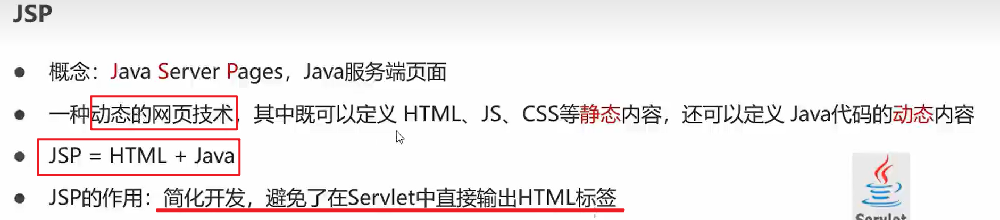 

JSP（JavaServer Pages）是一种用于构建动态Web页面的Java技术。以下是一些通俗易懂的概念：

1. **JSP是什么？**
   - JSP是一种技术，它**允许开发者在HTML页面中嵌入Java代码，以便动态生成网页内容。**它是在服务器端执行的，最终生成的是普通的HTML页面发送到浏览器。

2. **为什么需要JSP？**
   - JSP使得开发者能够在页面中嵌入Java代码，这样就可以根据用户请求和其他条件动态生成页面内容。这样可以更灵活地展示信息，提高用户体验。

3. **JSP的工作原理是什么？**
   - 当用户请求一个JSP页面时，服务器会先执行嵌入在JSP页面中的Java代码，生成HTML内容，然后再将最终的HTML发送给用户的浏览器。这个过程被称为**服务器端的动态页面生成**。

4. **JSP与Servlet的关系是什么？**
   - **JSP本质上是通过Servlet实现的**。**当JSP页面第一次被访问时，容器（如Tomcat）会将其转换为对应的Servlet**，并在后续请求中直接执行已生成的Servlet，提高性能。

5. **JSP中的Java代码怎么写？**
   - **在JSP中，可以使用`<% %>`标签嵌入Java代码，这段代码会在服务器端执行**。例如，你可以在JSP中使用这样的标签来获取用户的输入、进行逻辑判断等。

6. **JSP的优势是什么？**
   - **JSP使得前端开发者可以方便地与Java后端进行交互，动态生成页面内容**。同时，它允许开发者**在HTML中嵌套Java代码，提高了页面的可维护性和灵活性**。

JSP是一种**使得Java与HTML结合的技术，允许在页面中嵌入Java代码，实现动态生成Web页面的目的**。


## JSP快速入门

### maven导入jsp坐标

```xml
        <dependency>
            <groupId>javax.servlet.jsp</groupId>
            <artifactId>jsp-api</artifactId>
            <version>2.2</version>
        </dependency>
```

### index.jsp

```jsp
<%--
  Created by IntelliJ IDEA.
  User: 许闰博
  Date: 2024/1/2
  Time: 16:14
  To change this template use File | Settings | File Templates.
--%>
<%@ page contentType="text/html;charset=UTF-8" language="java" %>
<html>
<head>
    <title>helo jsp</title>
</head>
<body>
<%
    System.out.println("hello world");
%>
</body>
</html>
```

访问[helo jsp](http://localhost:9527/untitled20_war/index.jsp)

### 代码效果

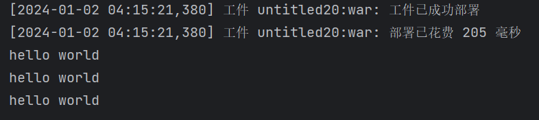 

## JSP 原理

本质上就是Servlet！

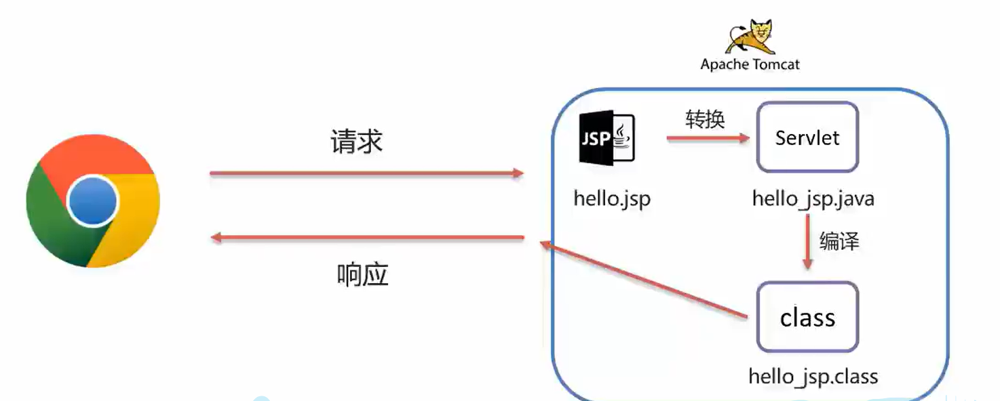 

JSP（JavaServer Pages）是用于构建动态Web页面的Java技术。以下是JSP的核心原理的简要介绍：

1. JSP是Servlet的一种简化形式：
   - JSP本质上是Servlet的一种简化形式，用于**更方便地生成动态Web页面**。JSP文件中**可以包含HTML代码和嵌套的Java代码片段**。

2. **JSP的生命周期：**
   - 当用户访问一个JSP页面时，**Web容器（如Tomcat）首先将其翻译成一个Servlet。**
   - 这个Servlet的生命周期与**JSP的请求-响应生命周期相对**应，包括初始化、服务处理和销毁阶段。
   
3. **翻译和编译：**
   - 当JSP页面第一次被访问时，容器将其翻译成Java Servlet，并进行编译**。生成的Servlet类文件存储在工作目录中**，以便在以后的请求中直接使用，提高性能。

4. **嵌套的Java代码：**
   - 在JSP中，可以使用`<% %>`标签嵌套Java代码。这些代码片段在翻译成Servlet时会被插入到Servlet的`service`方法中，用于处理请求和生成动态内容。

5. **==隐含对象==：**
   - **JSP提供了一些隐含对象，如`request`、`response`、`session`等，这些对象使得在JSP中能够方便地访问与请求和会话相关的信息，而不需要显式声明这些对象。**

6. **输出内容到客户端：**
   - JSP最终生成的Servlet负责将动态生成的HTML内容输出到客户端浏览器。这样，用户就能够看到根据请求动态生成的页面。

JSP允许在HTML中嵌套Java代码，使得动态Web页面的生成变得更加简单和灵活。JSP文件在被访问时，由容器翻译成Servlet，然后编译执行，最终生成动态内容响应给客户端。

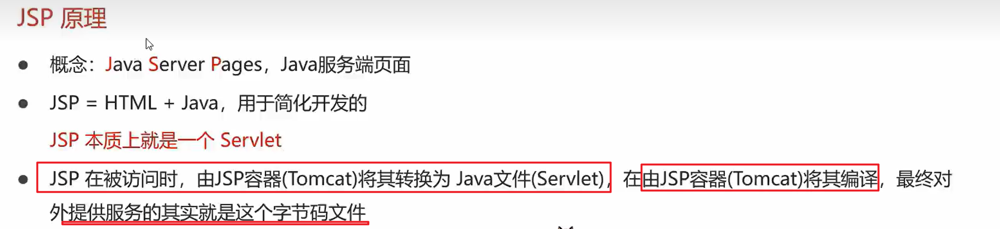 

## JSP 脚本

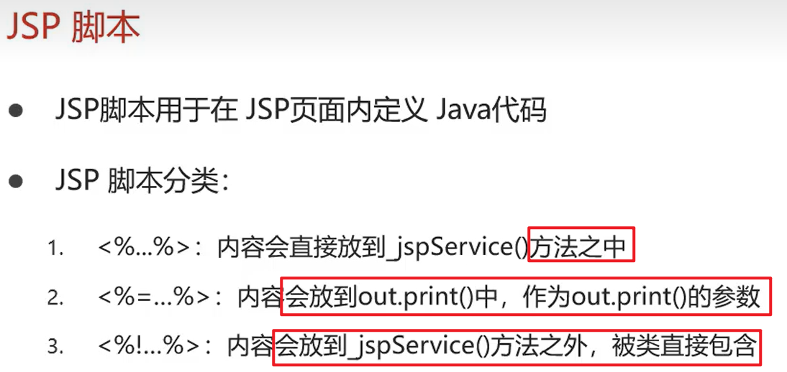 

> 在JSP（JavaServer Pages）中，有三种主要的脚本元素，它们用于在JSP页面中插入Java代码。这三种脚本元素分别是：声明、脚本表达式和脚本片段。以下是它们的详细介绍：
>
> 1. **声明（Declaration）: `<%! ... %>`**
>    - **用途：** 用于声明类成员，如变量和方法。声明中的内容在生成的**Servlet类的成员部分**。
>    - **示例：**
>      ```jsp
>      <%!
>          int counter = 0;
>          String getMessage() {
>              return "Hello, World!";
>          }
>      %>
>      ```
>    - **注意：** 声明中的变量和方法可以在整个JSP页面的任何地方使用。
>
> 2. **脚本表达式（Expression）: `<%= ... %>`**
>    
>    - **用途：** **用于输出表达式的结果到客户端浏览器。通常用于在HTML中插入动态数据。**
>    - **示例：**
>      
>      ```jsp
>      <p>Welcome, <%= userName %>!</p>
>      ```
>    - **注意：** 脚本表达式会将表达式的结果直接输出到页面，可以用于输出变量、调用方法等。
>    
> 3. **脚本片段（Scriptlet）: `<% ... %>`**
>    
>    - **用途：** 用于插入任意的Java代码块，如条件语句、循环等。在这个标签中可以包含任意的Java代码。
>    - **示例：**
>      ```jsp
>      <% 
>          int x = 10;
>          if (x > 5) {
>              out.println("x is greater than 5");
>          } else {
>              out.println("x is not greater than 5");
>          }
>      %>
>      ```
>    - **注意：** 脚本片段中的代码**会被转化为Servlet的 `service()` 方法中的代码，可以包含任何有效的Java代码。**
>
> 这些脚本元素可以结合使用，使得在JSP页面中可以嵌入Java代码，并以动态的方式生成HTML内容。然而，为了提高可维护性和可读性，应该尽量避免在JSP中编写大量的Java代码，而是将业务逻辑分离到JavaBean等组件中。这有助于保持代码的清晰性和可维护性。

### 代码

```java
<%@ page contentType="text/html;charset=UTF-8" language="java" %>
<html>
<head>
    <title>Table Example</title>
</head>
<body>

<h2>Dynamic Table Generation</h2>

<table border="1">
    <thead>
    <tr>
        <th>Name</th>
        <th>Age</th>
        <th>Country</th>
    </tr>
    </thead>
    <tbody>
    <%
        // Simulating data retrieval or processing logic
        String[] names = {"John Doe", "Jane Smith", "Bob Johnson"};
        int[] ages = {30, 25, 35};
        String[] countries = {"USA", "Canada", "UK"};

        for (int i = 0; i < names.length; i++) {
    %>
    <tr>
        <td><%= names[i] %></td>
        <td><%= ages[i] %></td>
        <td><%= countries[i] %></td>
    </tr>
    <%
        }
    %>
    </tbody>
</table>

</body>
</html>

```

### 效果

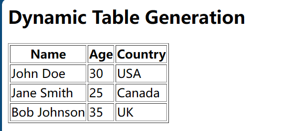 

## JSP缺点

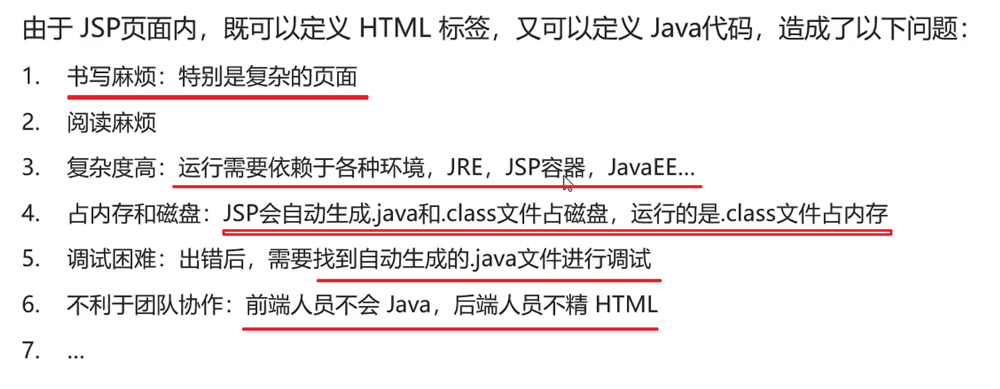 

退出了历史的舞台！

### 学牛魔

新的皇帝：html+ajax


 

 现在是Servlet+Jsp

 

## EL表达式

### 语法

 

EL（Expression Language）是一种用于在JSP、JSF和其他JavaEE技术中访问和操作数据的简洁表达式语言。它提供了一种轻量级的方式来访问JavaBean组件的属性、数组、集合等数据。

以下是一些关于EL表达式的基本知识：

1. **语法：** EL表达式通常使用 `${}` 括起来，例如 `${user.name}`。在括号中，你可以放置任意合法的Java表达式或标识符。

2. **访问属性：** EL表达式允许你直接访问JavaBean中的属性。例如，`${user.name}` 将访问名为 `name` 的 `user` 对象的属性。

3. **调用方法：** 你可以在EL表达式中调用JavaBean中的方法。例如，`${user.getName()}` 将调用 `user` 对象的 `getName` 方法。

4. **集合和数组访问：** EL表达式支持对集合和数组的访问。例如，`${list[0]}` 将获取列表中的第一个元素，`${array[1]}` 将获取数组中的第二个元素。

5. **运算符：** EL表达式支持一些基本的算术、关系和逻辑运算符，如 `+`、`-`、`*`、`/`、`==`、`!=`、`<`、`>` 等。

6. **空值检查：** EL表达式提供了一种避免空指针异常的方式**，使用 `empty` 关键字检查集合或对象是否为空。**

7. **隐式对象：** **在JSP中，有一些隐式对象，如 `pageScope`、`requestScope`、`sessionScope`、`applicationScope`，允许你在EL表达式中访问页面、请求、会话和应用程序的作用域中的属性。**

8. **EL函数：** 你可以定义自己的EL函数，然后在EL表达式中使用这些函数。这可以通过标签库或在配置文件中进行配置。

以下是一个简单的例子，演示了EL表达式的使用：

```jsp
<%@ page contentType="text/html;charset=UTF-8" language="java" %>
<html>
<head>
    <title>EL Example</title>
</head>
<body>

    <h2>EL Example</h2>

    <%-- Assuming 'user' is a JavaBean with 'name' property --%>
    <p>User Name: ${user.name}</p>

    <%-- Assuming 'list' is a List in the request scope --%>
    <p>First Item in List: ${list[0]}</p>

    <%-- EL运算符和函数 --%>
    <p>Sum: ${2 + 3}</p>
    <p>Length of String: ${fn:length(user.name)}</p>

</body>
</html>
```

这个例子中展示了如何在JSP页面中使用EL表达式访问JavaBean的属性、集合的元素，以及进行一些简单的算术运算和函数调用。EL表达式使得JSP页面更加简洁，减少了Java代码的嵌套。


### JavaWeb的四大域对象

在JavaWeb开发中，域对象是用于在不同范围内共享数据的一种机制。JavaWeb的四大域对象分别是：请求域（Request）、会话域（Session）、应用程序域（Application）和页面域（Page）。

1. **请求域（Request）：**
   - **范围：** 请求域是在一次HTTP请求过程中有效的，即在同一个请求中的多个Servlet之间共享数据。
   - **使用场景：** 主要用于在请求的多个阶段或多个Servlet之间传递数据。
   - **使用方法：** 可以使用`request.setAttribute(String name, Object value)`设置属性，然后通过`request.getAttribute(String name)`获取属性值。

2. **会话域（Session）：**
   - **范围：** 会话域是在用户会话期间有效的，即在用户登录到退出这段时间内的多次请求中共享数据。
   - **使用场景：** 用于在同一个用户的不同请求之间传递数据，通常用于用户登录状态的维护等。
   - **使用方法：** 可以使用`session.setAttribute(String name, Object value)`设置属性，然后通过`session.getAttribute(String name)`获取属性值。

3. **应用程序域（Application）：**
   - **范围：** 应用程序域是在整个Web应用程序中有效的，即在同一个Web应用程序的不同用户会话之间共享数据。
   - **使用场景：** 主要用于在整个应用程序中共享全局数据，如一些配置信息等。
   - **使用方法：** 可以使用`application.setAttribute(String name, Object value)`设置属性，然后通过`application.getAttribute(String name)`获取属性值。

4. **页面域（Page）：**
   - **范围：** 页面域是在JSP页面中有效的，即在同一个JSP页面的不同部分之间共享数据。
   - **使用场景：** 用于在同一个JSP页面的不同部分传递数据，不同于其他域对象，页面域是JSP特有的。
   - **使用方法：** 可以使用 `<jsp:useBean>` 或 `<jsp:setProperty>` 等标签设置属性，然后使用 `<jsp:getProperty>` 获取属性值。

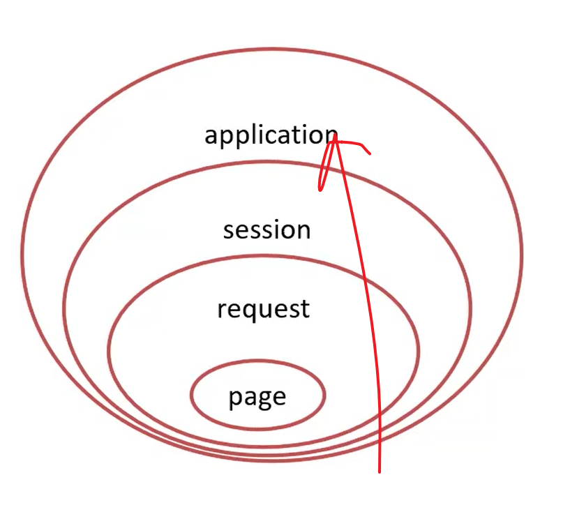 

**el表达式获取数据会依次从这4个域中寻找直到找到为止**

太小的page和太大的application作用域不常用


## JSTL标签

### 语法

JSTL（JavaServer Pages Standard Tag Library）是一组在JSP页面中使用的标准标签，用于简化和增强Java EE应用程序的开发。

#### 导入maven坐标

```xml
        <dependency>
            <groupId>jstl</groupId>
            <artifactId>jstl</artifactId>
            <version>1.2</version>
        </dependency>
        <dependency>
            <groupId>taglibs</groupId>
            <artifactId>standard</artifactId>
            <version>1.1.2</version>
        </dependency>
```

测试代码

```jsp
<%--
  Created by IntelliJ IDEA.
  User: 许闰博
  Date: 2024/1/3
  Time: 10:03
  To change this template use File | Settings | File Templates.
--%>
<%@ page contentType="text/html;charset=UTF-8" language="java" %>
<%@ taglib uri="http://java.sun.com/jsp/jstl/core" prefix="c" %>
<%@ taglib uri="http://java.sun.com/jsp/jstl/fmt" prefix="fmt" %>
<html>
<head>
    <title>Title</title>
</head>
<body>
<c:if test="true">
    <h1>ture才显示</h1>
</c:if>

<c:if test="false">
    <h1>false不显示</h1>
</c:if>
</body>
</html>

```

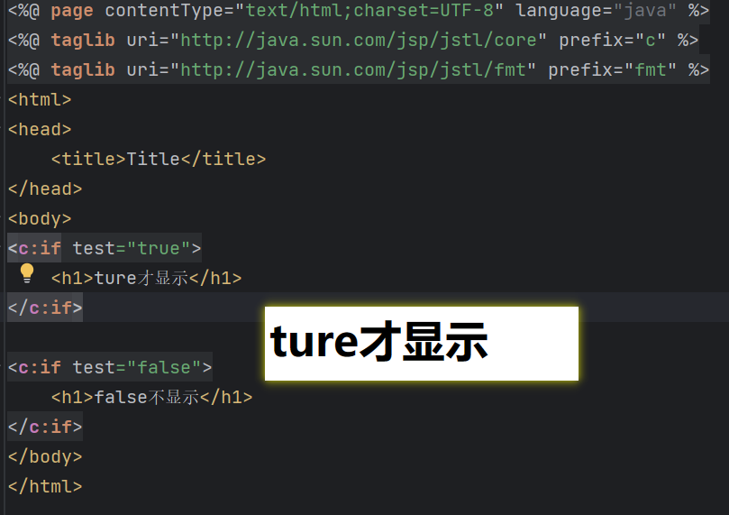 

1. **导入JSTL库：**
   在使用JSTL标签之前，首先需要在JSP页面中导入JSTL库。使用以下标签导入核心标签库和格式化标签库：
   
   ```jsp
       <%@ taglib uri="http://java.sun.com/jsp/jstl/core" prefix="c" %>
       <%@ taglib uri="http://java.sun.com/jsp/jstl/fmt" prefix="fmt" %>
   ```
   
2. **核心标签库（c标签）：**
   - **迭代标签：** `<c:forEach>` 用于循环迭代集合或数组。
   - **条件判断标签：** `<c:if>`, `<c:choose>`, `<c:when>`, `<c:otherwise>` 用于条件判断。
   - **变量设置标签：** `<c:set>` 用于设置变量。
   - **URL处理标签：** `<c:import>`, `<c:url>`, `<c:redirect>` 用于处理URL。
   - **其他：** `<c:out>`, `<c:catch>`, `<c:remove>` 等其他标签。

3. **格式化标签库（fmt标签）：**
   - **日期和时间格式化：** `<fmt:formatDate>`, `<fmt:parseDate>` 用于日期和时间格式化。
   - **数字格式化：** `<fmt:formatNumber>`, `<fmt:parseNumber>` 用于数字格式化。
   - **其他：** `<fmt:setLocale>`, `<fmt:bundle>`, `<fmt:message>` 等其他标签。

4. **EL（Expression Language）与JSTL结合使用：**
   - JSTL通常与EL结合使用，通过EL表达式访问JSTL标签库中设置的变量。
   - 示例：`${c:out value="${someVariable}"}`

5. **国际化和本地化：**
   - 使用 `<fmt:setLocale>` 设置页面的语言环境。
   - 使用 `<fmt:bundle>` 和 `<fmt:message>` 进行国际化和本地化处理。

6. **JSTL函数库：**
   - JSTL提供了一组内建的函数库，可用于字符串操作、集合操作等。
   - 示例：`${fn:length(someList)}`, `${fn:toUpperCase(someString)}`

7. **错误处理：**
   - `<c:catch>` 用于捕获和处理异常。

8. **JSTL的常用标签和属性：**
   - 了解常用标签的使用方式，以及标签的常见属性。
   - 需要注意的是，不同版本的JSTL可能有些许差异。 

### c:foreach

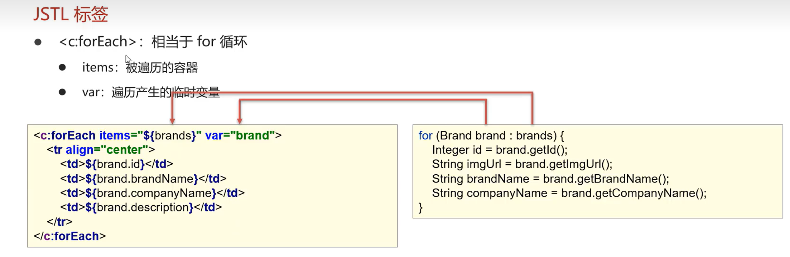 

> ```jsp
> <%@ page contentType="text/html;charset=UTF-8" language="java" %>
> <%@ taglib uri="http://java.sun.com/jsp/jstl/core" prefix="c" %>
> <%@ taglib uri="http://java.sun.com/jsp/jstl/fmt" prefix="fmt" %>
> <html>
> <head>
>     <title>forEach Example</title>
> </head>
> <body>
> 
>     <h2>forEach Example</h2>
> 
>     <%-- 示例1：迭代数组 --%>
>     <c:forEach var="item" items="${myArray}">
>         ${item}<br>
>     </c:forEach>
> 
>     <%-- 示例2：迭代集合 --%>
>     <c:forEach var="person" items="${personList}">
>         Name: ${person.name}, Age: ${person.age}<br>
>     </c:forEach>
> 
>     <%-- 示例3：指定开始和结束值进行迭代 --%>
>     <c:forEach var="i" begin="1" end="5">
>         ${i}<br>
>     </c:forEach>
> 
>     <%-- 示例4：使用 step 属性指定步长 --%>
>     <c:forEach var="j" begin="0" end="10" step="2">
>         ${j}<br>
>     </c:forEach>
> 
> </body>
> </html>
> 
> ```
>
> 代码效果
>
> 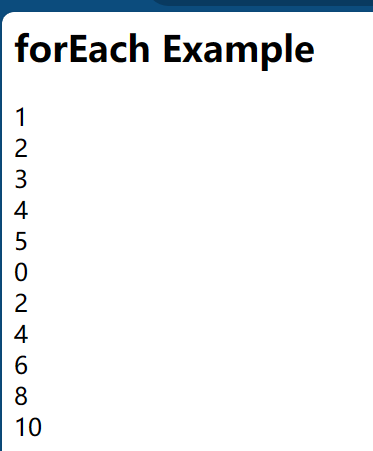 

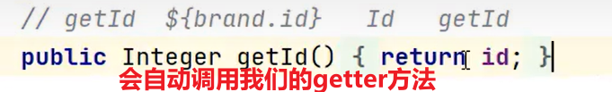 


### varstatus属性

`varStatus` 属性是 `<c:forEach>` 标签中的一个属性，用于获取循环状态信息。通过 `varStatus`，你可以获取有关迭代的一些附加信息，如当前迭代的索引、是否为第一次迭代、是否为最后一次迭代等。

- `index`：当前迭代的索引，从0开始。
- `count`：当前迭代的计数，从1开始。
- `first`：是否为第一次迭代（true/false）。
- `last`：是否为最后一次迭代（true/false）。
- `even`：是否为偶数次迭代（true/false）。
- `odd`：是否为奇数次迭代（true/false）。

通过使用 `varStatus`，你可以更灵活地控制和显示循环迭代的状态信息。

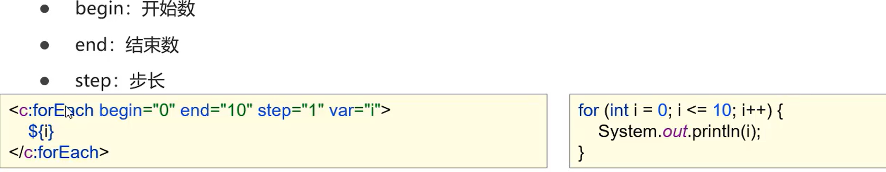

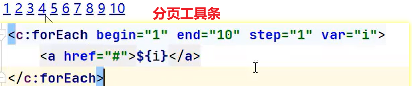  


## MVC模式和三层架构

MVC（Model-View-Controller）模式和三层架构是两种**常用于软件设计和开发的架构模式**。它们旨在提高应用程序的可维护性、可扩展性和代码复用性。以下是对这两者的简要介绍：

### MVC模式（Model-View-Controller）

 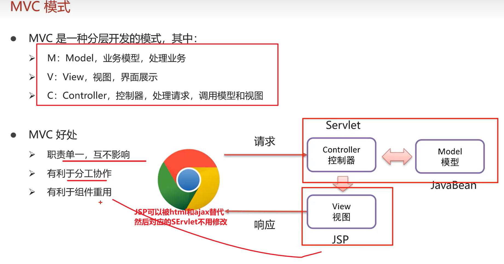

MVC是一种设计模式，将应用程序划分为三个主要组件：

1. **模型（Model）：**
   - 负责处理应用程序的数据逻辑，通常包括数据的获取、处理和存储。
   - 不直接处理用户界面，而是提供数据和方法供控制器使用。

2. **视图（View）：**
   - 负责用户界面的呈现和显示。
   - 从模型中获取数据以展示给用户，同时也可以向控制器发送用户输入的事件。

3. **控制器（Controller）：**
   - 负责处理用户的输入、业务逻辑和控制数据流向模型或视图。
   - 接收用户输入并对其进行处理，然后相应地更新模型或视图。

MVC的优势在于分离了应用程序的关注点，使得修改一个组件不会对其他组件造成影响。这种分层结构有助于提高代码的可维护性和可扩展性。

### 三层架构

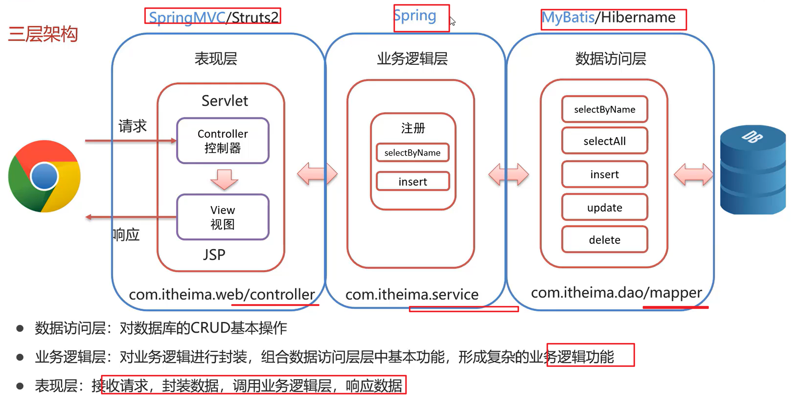 

三层架构是一种软件架构模式，将应用程序划分为三个主要层次：

1. **表示层（Presentation Layer）：**
   - 负责处理用户界面的显示和用户输入的处理。
   - 通常包括用户界面、用户输入的验证和处理逻辑。

2. **业务逻辑层（Business Logic Layer）：**
   - 包含应用程序的业务逻辑和规则。
   - 处理应用程序的业务规则，调用数据访问层来获取和保存数据。

3. **数据访问层（Data Access Layer）：**
   - 负责处理与数据存储的交互，包括数据库或其他数据存储系统。
   - 提供数据的访问、操作和持久化。

三层架构的优势在于将应用程序划分为明确定义的层次，使得不同层次的模块可以相对独立地进行开发和维护。这种分层结构有助于提高系统的可维护性、可扩展性和灵活性。

### 总结

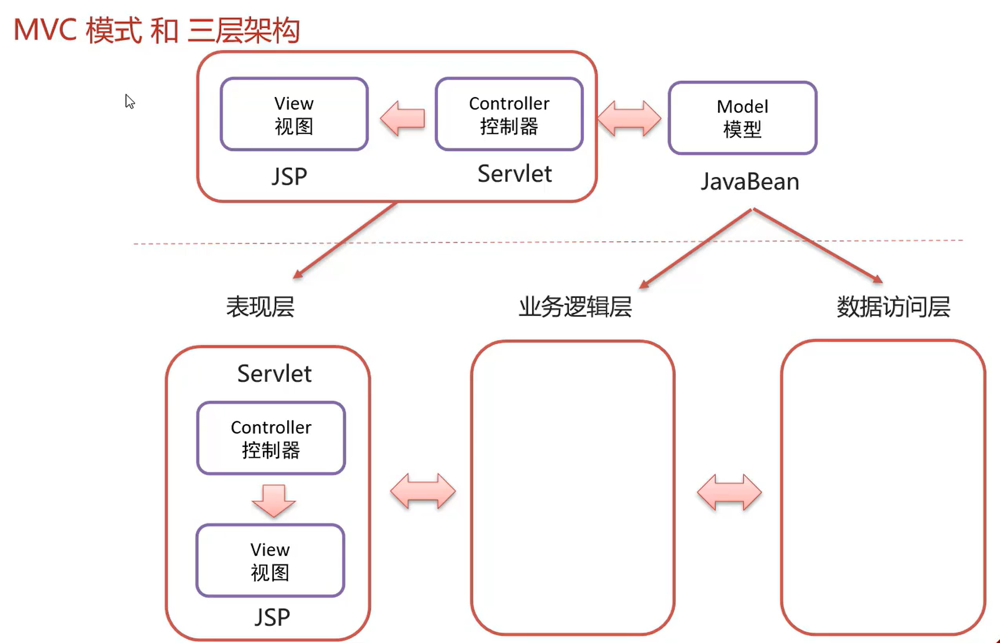 

MVC模式和三层架构都是为了更好地组织和管理软件系统而设计的。MVC关注于应用程序的内部设计，强调模型、视图和控制器之间的分离；而三层架构关注于整个应用程序的结构，强调表示层、业务逻辑层和数据访问层之间的分离。这两者可以结合使用，以实现更清晰、更灵活的软件架构。

 总结前端view层，后端control层和model层，前端发送请求，control层接收到请求向model层获取数据，control层将获取到的数据返回给view层

## ==黄金案例==

### 环境准备

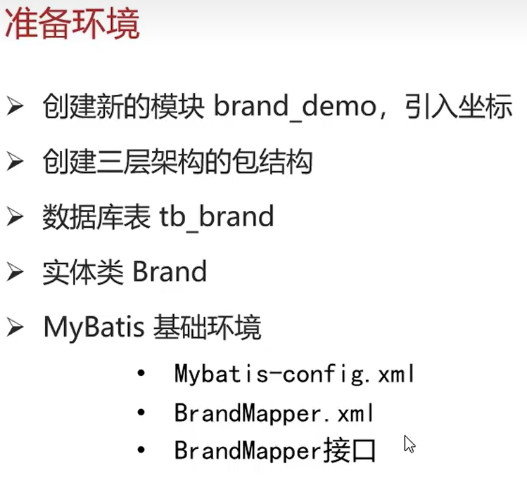

#### 创建maven项目+web框架

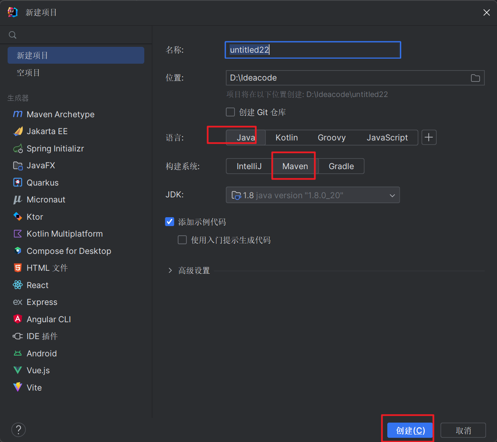 

#### 导入war坐标

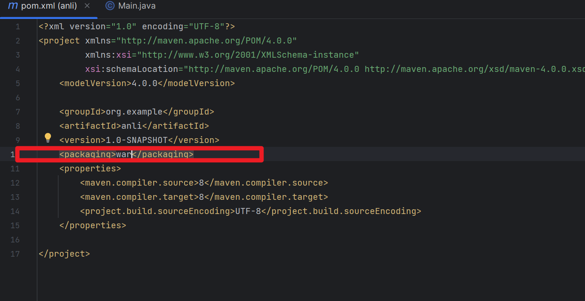 

刷新maven

#### 加入web框架

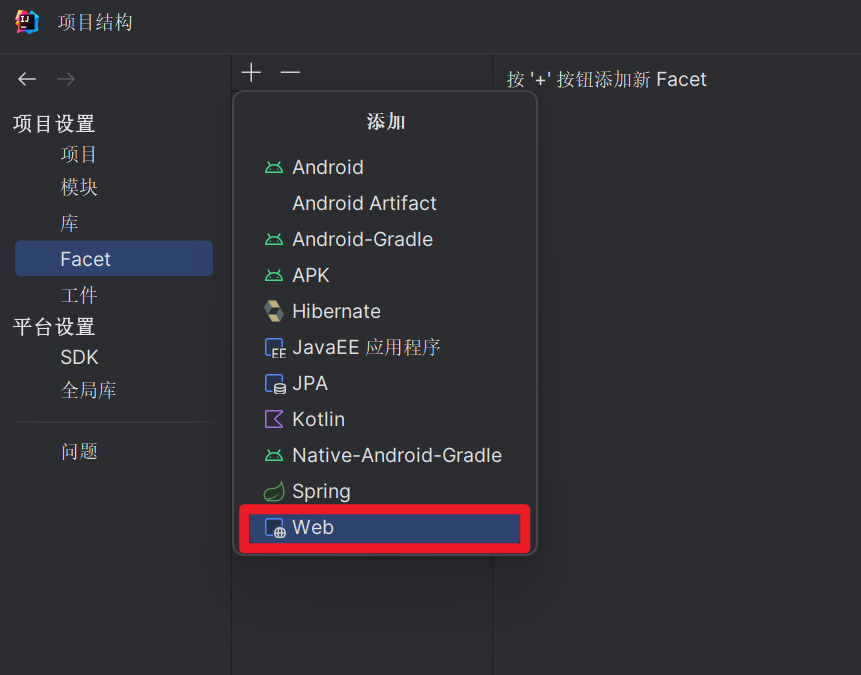 

默认是web目录，要重构为webapp目录，并且移动到main下面

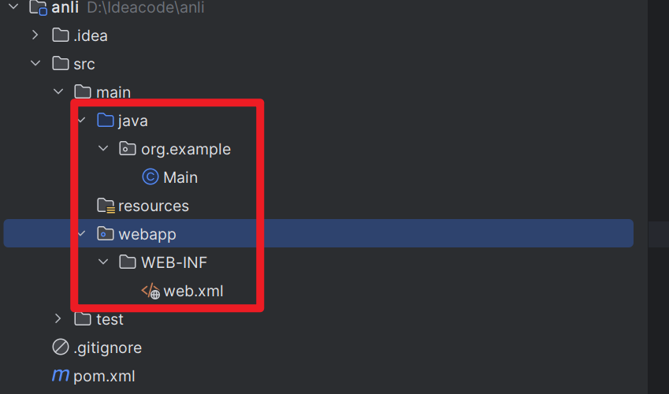 

#### 配置tomcat服务

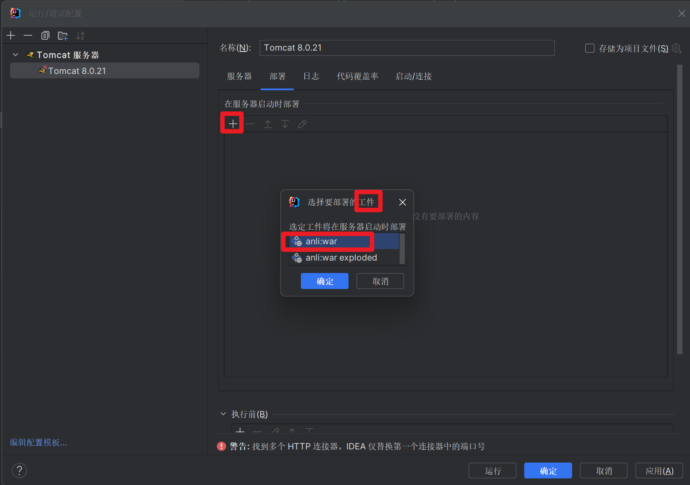

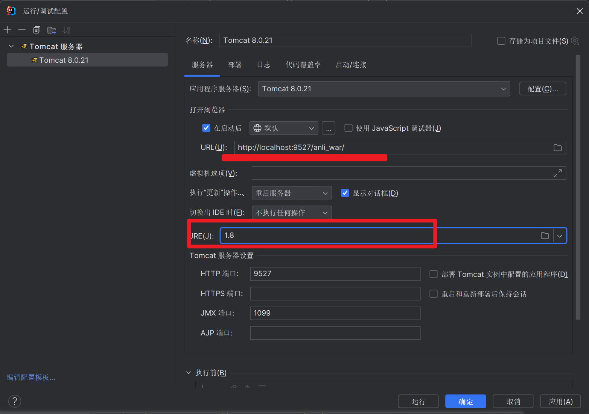

要点：maven打包为war并且刷新maven才会有工件提示

jre选择后就没有x了

#### 导入mybatis坐标

```xml
    <dependencies>
        <dependency>
            <groupId>org.mybatis</groupId>
            <artifactId>mybatis</artifactId>
            <version>3.5.13</version>
        </dependency>

        <dependency>
            <groupId>mysql</groupId>
            <artifactId>mysql-connector-java</artifactId>
            <version>8.0.32</version>
        </dependency>
        <dependency>
            <groupId>junit</groupId>
            <artifactId>junit</artifactId>
            <version>4.13.2</version>
        </dependency>
        
    </dependencies>
```


#### 配置mybatis-config.xml

```xml
<?xml version="1.0" encoding="UTF-8" ?>
<!DOCTYPE configuration
        PUBLIC "-//mybatis.org//DTD Config 3.0//EN"
        "https://mybatis.org/dtd/mybatis-3-config.dtd">
<configuration>
    <environments default="development">
        <environment id="development">
            <transactionManager type="JDBC"/>

            <!--            数据库的连接信息-->
            <dataSource type="POOLED">
                <property name="driver" value="com.mysql.cj.jdbc.Driver"/>
                <property name="url" value="jdbc:mysql:///db"/>
                <property name="username" value="root"/>
                <property name="password" value="xurunbo"/>
            </dataSource>
        </environment>
    </environments>

    <!--    加载SQl的映射文件-->
    <mappers>
    </mappers>
</configuration>
```

等下写mapper映射处


#### 创建BrandMapper接口

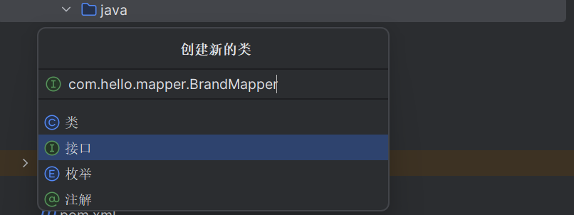 


#### 创建对应同目录下的Mapper.xml映射

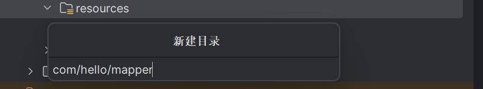 

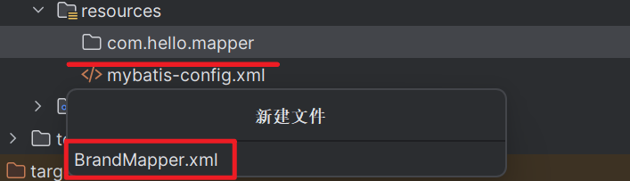 

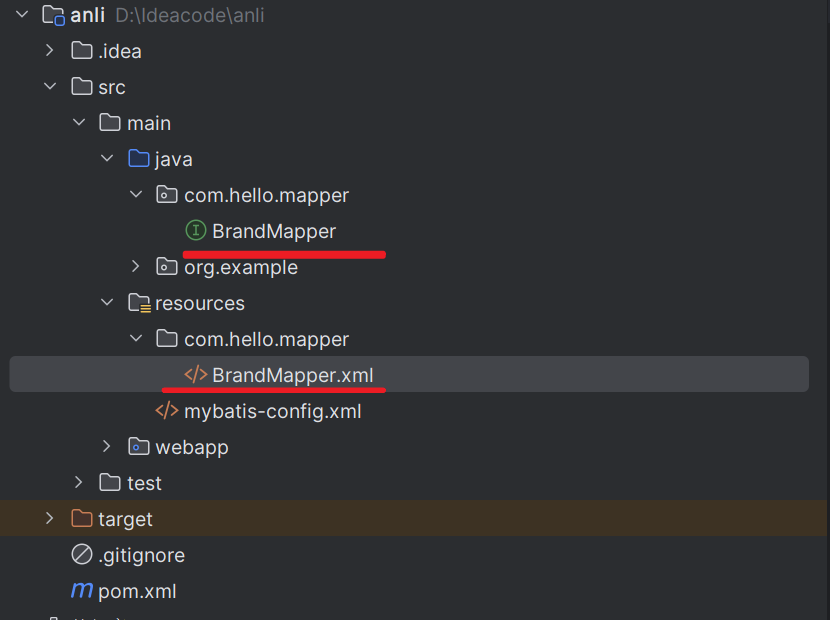 

最后就大功告成了！

#### 导入Servlet坐标

```java
       <dependency>
            <groupId>javax.servlet</groupId>
            <artifactId>servlet-api</artifactId>
            <version>2.5</version>
            <scope>provided</scope>
        </dependency>
```

不加scope控制就报错！

#### 三层架构准备

创建软件包com.hello.pojo/web/service/mapper;

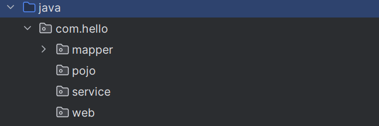 

#### 数据库准备

```sql
show tables;
create table tb_brand
(
id int primary key auto_increment,
rand_name varchar(20),
company_name varchar(20),
ordered int,
description varchar(100),
status int
);
insert into tb_brand(rand_name,company_name,ordered,description,status) values("小米","小米科技有限公司",5,"are you ok",1);
insert into tb_brand(rand_name,company_name,ordered,description,status) values("三只松鼠","三只松鼠有限公司",5,"好吃不贵",0);
insert into tb_brand(rand_name,company_name,ordered,description,status) values("华为","华为技术有限公司",5,"华为让生活更幸福",1);
insert into tb_brand(rand_name,company_name,ordered,description,status) values("vivo","vivo有限公司",5,"vivo智能手坤",1);

select * from tb_brand;
```


#### 实体类pojo下的Brand类

```java
package com.hello.pojo;

public class Brand {
   Integer id            ;
   String rand_name     ;

    @Override
    public String toString() {
        return "Brand{" +
                "id=" + id +
                ", rand_name='" + rand_name + '\'' +
                ", company_name='" + company_name + '\'' +
                ", ordered=" + ordered +
                ", description='" + description + '\'' +
                ", status=" + status +
                '}';
    }

    String company_name  ;

    public Brand(Integer id, String rand_name, String company_name, int ordered, String description, int status) {
        this.id = id;
        this.rand_name = rand_name;
        this.company_name = company_name;
        this.ordered = ordered;
        this.description = description;
        this.status = status;
    }

    public Integer getId() {
        return id;
    }

    public void setId(Integer id) {
        this.id = id;
    }

    public String getRand_name() {
        return rand_name;
    }

    public void setRand_name(String rand_name) {
        this.rand_name = rand_name;
    }

    public String getCompany_name() {
        return company_name;
    }

    public void setCompany_name(String company_name) {
        this.company_name = company_name;
    }

    public int getOrdered() {
        return ordered;
    }

    public void setOrdered(int ordered) {
        this.ordered = ordered;
    }

    public String getDescription() {
        return description;
    }

    public void setDescription(String description) {
        this.description = description;
    }

    public int getStatus() {
        return status;
    }

    public void setStatus(int status) {
        this.status = status;
    }

    int ordered       ;
   String description   ;
   int status        ;
}

```


#### mybatis.xml的mapper配置

```xml
    <mappers>
        <package name="com.hello.mapper"/>
    </mappers>
```


#### BrandMapper.xml

```xml
<?xml version="1.0" encoding="UTF-8" ?>
<!DOCTYPE mapper
        PUBLIC "-//mybatis.org//DTD Mapper 3.0//EN"
        "https://mybatis.org/dtd/mybatis-3-mapper.dtd">


<mapper namespace="com.hello.mapper.BrandMapper">
    <select id="selectall" resultType="com.hello.pojo.Brand">
        select * from tb_user;
    </select>
</mapper>
```

#### 导入工具获取sqlsession工厂工具包

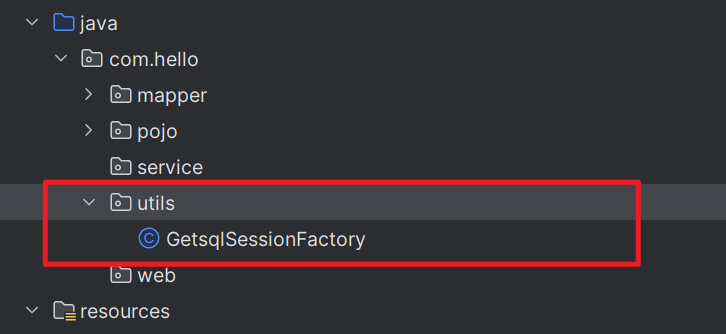 

```java
package com.hello.utils;

import org.apache.ibatis.io.Resources;
import org.apache.ibatis.session.SqlSessionFactory;
import org.apache.ibatis.session.SqlSessionFactoryBuilder;

import java.io.IOException;
import java.io.InputStream;

public class GetsqlSessionFactory {
    private static SqlSessionFactory sqlSessionFactory;
    static {

        String resource = "mybatis-config.xml";
        InputStream inputStream = null;
        try {
            inputStream = Resources.getResourceAsStream(resource);
        } catch (IOException e) {
            throw new RuntimeException(e);
        }
        sqlSessionFactory = new SqlSessionFactoryBuilder().build(inputStream);

    }

    public static SqlSessionFactory getsqlsessionfactory(){
        return  sqlSessionFactory;
    }
}

```

#### maven导入JSTL坐标

```xml
        <dependency>
            <groupId>jstl</groupId>
            <artifactId>jstl</artifactId>
            <version>1.2</version>
        </dependency>
        <dependency>
            <groupId>taglibs</groupId>
            <artifactId>standard</artifactId>
            <version>1.1.2</version>
        </dependency>
```


### 查询所有并且展示信息

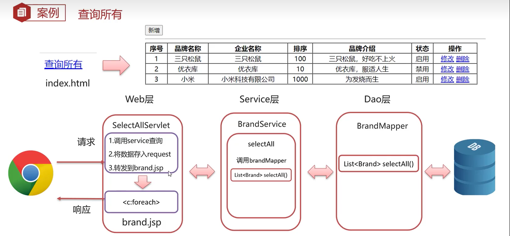 

#### service下的BrandService.java

```java
package com.hello.service;

import com.hello.mapper.BrandMapper;
import com.hello.pojo.Brand;
import com.hello.utils.GetsqlSessionFactory;
import org.apache.ibatis.session.SqlSession;
import org.apache.ibatis.session.SqlSessionFactory;

import java.util.List;

public class BrandService {
    private SqlSessionFactory Factory=GetsqlSessionFactory.getsqlsessionfactory();


    public List<Brand> selectAll()
    {
        //获取sqlsession对象
        SqlSession sqlsession=Factory.openSession(true);

        //获取mapper对象
        BrandMapper brandMapper=sqlsession.getMapper(BrandMapper.class);

        //执行sql语句
        List<Brand> brands=brandMapper.selectall();
              sqlsession.close();
        return brands;


    }
}

```

#### 对应的web下的SelectAllservlet.java

```java
package com.hello.web;

import com.hello.pojo.Brand;
import com.hello.service.BrandService;

import javax.jws.WebService;
import javax.servlet.ServletException;
import javax.servlet.annotation.WebServlet;
import javax.servlet.http.HttpServlet;
import javax.servlet.http.HttpServletRequest;
import javax.servlet.http.HttpServletResponse;
import java.io.IOException;
import java.util.List;

@WebServlet("/selectall")
public class SelectAllServlet extends HttpServlet {
    @Override
    protected void doGet(HttpServletRequest req, HttpServletResponse resp) throws ServletException, IOException {
        resp.setHeader("Content-Type", "text/html;charset=utf-8");
        BrandService brandService=new BrandService();
        List<Brand> brands=brandService.selectAll();
        resp.getWriter().println(brands);
    }

    @Override
    protected void doPost(HttpServletRequest req, HttpServletResponse resp) throws ServletException, IOException {
        super.doPost(req, resp);
    }
}

```

返回数据乱码的时候

```java
        resp.setHeader("Content-Type", "text/html;charset=utf-8");
```


#### index.html

```html
<!DOCTYPE html>
<html lang="en">
<head>
    <meta charset="UTF-8">
    <meta name="viewport" content="width=device-width, initial-scale=1.0">
    <title>abc</title>
</head>
<body>
<a href="/anli_war/selectall">查询全部</a>

</body>
</html>

```

#### 代码效果

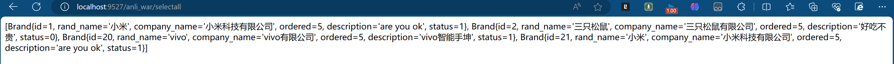


#### 现在要把数据存到req里然后转发给jsp玩

```jsp
<%@ page language="java" contentType="text/html; charset=UTF-8" pageEncoding="UTF-8"%>
<%@ taglib uri="http://java.sun.com/jsp/jstl/core" prefix="c" %>

<!DOCTYPE html>
<html>
<head>
    <meta charset="UTF-8">
    <title>Brand List</title>
    <style>
        table {
            border-collapse: collapse;
            width: 80%;
            margin: 20px;
        }

        th, td {
            border: 1px solid #dddddd;
            text-align: left;
            padding: 8px;
        }

        th {
            background-color: #f2f2f2;
        }
    </style>
</head>
<body>

<h2>Brand List</h2>

<table>
    <thead>
    <tr>
        <th>ID</th>
        <th>Name</th>
        <th>Company Name</th>
        <th>Ordered</th>
        <th>Description</th>
        <th>Status</th>
        <th>状态</th>
        <th>操作</th>
    </tr>
    </thead>
    <tbody>
    <c:forEach var="brand" items="${brands}" varStatus="status">
        <tr>
            <td>${status.count}</td>
            <td>${brand.rand_name}</td>
            <td>${brand.company_name}</td>
            <td>${brand.ordered}</td>
            <td>${brand.description}</td>
            <td>${brand.status}</td>
            <c:if test="${brand.status==1}">
                <td>启用</td>
            </c:if>
            <c:if test="${brand.status!=1}">
                <td> 禁用</td>
            </c:if>
            <td><a href="#">修改</a> <a href="#">删除</a></td>
        </tr>
    </c:forEach>
    </tbody>
</table>

</body>
</html>

```


#### 现在对应的web下的SelectAllservlet.java

```java
package com.hello.web;

import com.hello.pojo.Brand;
import com.hello.service.BrandService;

import javax.jws.WebService;
import javax.servlet.ServletException;
import javax.servlet.annotation.WebServlet;
import javax.servlet.http.HttpServlet;
import javax.servlet.http.HttpServletRequest;
import javax.servlet.http.HttpServletResponse;
import java.io.IOException;
import java.util.List;

@WebServlet("/selectall")
public class SelectAllServlet extends HttpServlet {
    @Override
    protected void doGet(HttpServletRequest req, HttpServletResponse resp) throws ServletException, IOException {
        resp.setHeader("Content-Type", "text/html;charset=utf-8");
        BrandService brandService=new BrandService();
        List<Brand> brands=brandService.selectAll();
        
        //存入req域
        req.setAttribute("brands",brands);

        //请求转发给jsp
        req.getRequestDispatcher("/brand.jsp").forward(req,resp);

    }

    @Override
    protected void doPost(HttpServletRequest req, HttpServletResponse resp) throws ServletException, IOException {
        super.doPost(req, resp);
    }
}

```


#### 常见的问题

没有加scope就报错！

```xml
       <dependency>
            <groupId>javax.servlet</groupId>
            <artifactId>servlet-api</artifactId>
            <version>2.5</version>
            <scope>provided</scope>
        </dependency>
```

在 Maven 的 `pom.xml` 文件中，`<scope>` 元素定义了依赖的范围，其中 `provided` 表示这个依赖在编译时和测试时需要，但在运行时由目标环境（例如Servlet容器，如Tomcat）提供。这通常用于Servlet API等在运行时由Servlet容器提供的库。

如果你不将 `<scope>provided</scope>` 加入到 Servlet API 的依赖项中，当你部署到Servlet容器时，可能会发生以下两种情况之一：

1. **版本冲突：** 你的项目中包含了Servlet API，但是Servlet容器中也包含了它的版本。这可能导致版本冲突，因为在运行时，系统将使用Servlet容器提供的版本，而不是你的项目中的版本。这可能会导致不一致性和潜在的错误。

2. **类重复：** 由于Servlet容器提供了相同的API，如果在项目中也包含了这些API，可能会导致类重复。这也可能导致不一致性和潜在的错误。

因此，为了避免这些问题，推荐使用 `provided` 范围来声明Servlet API的依赖。这告诉Maven在编译和测试阶段使用指定版本的Servlet API，但在运行时依赖于Servlet容器提供的版本。这有助于确保在不同的环境中使用相同的Servlet API 版本，避免潜在的冲突和问题。

##### 如果mysql的字段和pojo实体类的属性冲突

[mybatis简单入土 | cout<<"金缕衣"; (gitee.io)](https://xu-runbo.gitee.io/xu-runbo/post/59a318a.html)

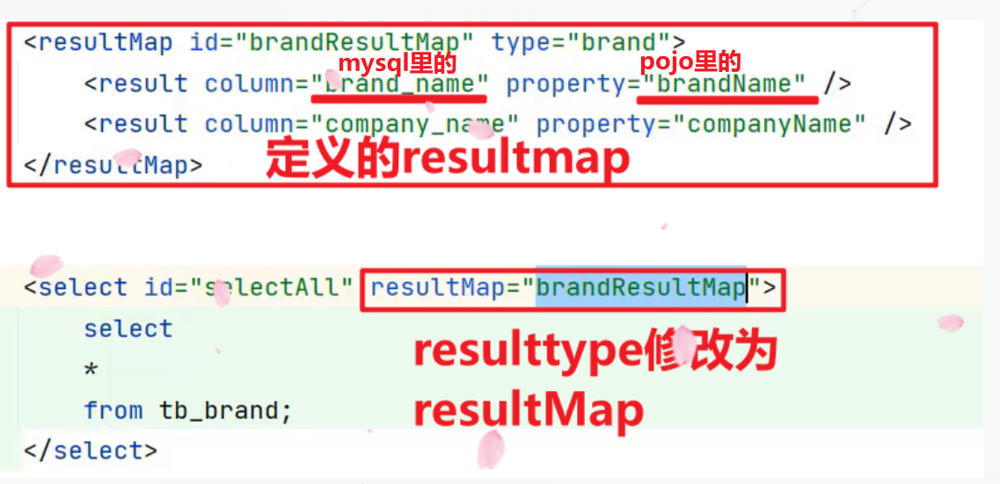 

#### 代码效果

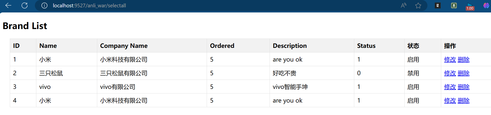 


### 添加

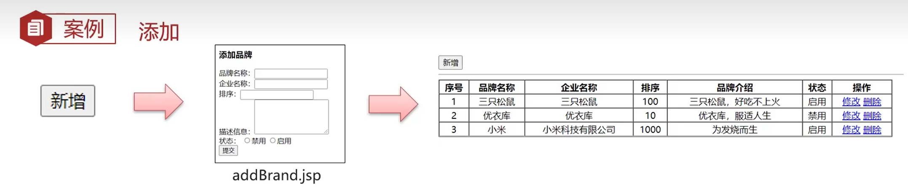 

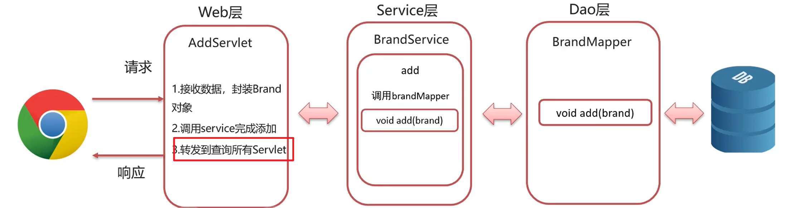 

#### pojo下的Brand类调整

```java
package com.hello.pojo;

//推荐使用包装的类型，因为没有M默认值
public class Brand {

    private Integer  id           ;
    private String  rand_name    ;
    private String  company_name ;
    private Integer ordered      ;
    private String  description  ;
    //0禁用，1正常
    private Integer   status       ;

    public Brand(Integer id, String rand_name, String company_name, Integer ordered, String description, Integer status) {
        this.id = id;
        this.rand_name = rand_name;
        this.company_name = company_name;
        this.ordered = ordered;
        this.description = description;
        this.status = status;
    }

    public Brand() {

    }

    public Integer getId() {
        return id;
    }

    public void setId(Integer id) {
        this.id = id;
    }

    public String getRand_name() {
        return rand_name;
    }

    public void setRand_name(String rand_name) {
        this.rand_name = rand_name;
    }

    public String getCompany_name() {
        return company_name;
    }

    public void setCompany_name(String company_name) {
        this.company_name = company_name;
    }

    public Integer getOrdered() {
        return ordered;
    }

    public void setOrdered(Integer ordered) {
        this.ordered = ordered;
    }

    public String getDescription() {
        return description;
    }

    public void setDescription(String description) {
        this.description = description;
    }

    public Integer getStatus() {
        return status;
    }

    public void setStatus(Integer status) {
        this.status = status;
    }

    @Override
    public String toString() {
        return "Brand{" +
                "id=" + id +
                ", rand_name='" + rand_name + '\'' +
                ", company_name='" + company_name + '\'' +
                ", ordered=" + ordered +
                ", description='" + description + '\'' +
                ", status=" + status +
                '}';
    }
}


```


#### 编写add.jsp

```jsp
<%@ page language="java" contentType="text/html; charset=UTF-8" pageEncoding="UTF-8"%>
<!DOCTYPE html>
<html>
<head>
    <meta charset="UTF-8">
    <title>Add Brand</title>
    <!-- 引入Bootstrap样式文件，确保文件路径正确 -->
    <link rel="stylesheet" href="https://maxcdn.bootstrapcdn.com/bootstrap/4.0.0/css/bootstrap.min.css">
    <style>
        body {
            padding: 20px;
        }

        form {
            max-width: 400px;
            margin: 0 auto;
        }

        label {
            margin-bottom: 0.5rem;
        }

        textarea {
            resize: vertical;
        }
    </style>
</head>
<body>

<div class="container">
    <h2 class="mt-4">Add Brand</h2>

    <form action="/anli_war/add" method="post">
        <div class="form-group">
            <label for="randName">Brand Name:</label>
            <input type="text" class="form-control" id="randName" name="rand_name" required>
        </div>

        <div class="form-group">
            <label for="companyName">Company Name:</label>
            <input type="text" class="form-control" id="companyName" name="company_name" required>
        </div>

        <div class="form-group">
            <label for="ordered">Ordered:</label>
            <input type="number" class="form-control" id="ordered" name="ordered" required>
        </div>

        <div class="form-group">
            <label for="description">Description:</label>
            <textarea class="form-control" id="description" name="description" rows="4" required></textarea>
        </div>

        <div class="form-group">
            <label for="status">Status:</label>
            <input type="number" class="form-control" id="status" name="status" required>
        </div>

        <button type="submit" class="btn btn-primary">Add Brand</button>
    </form>
</div>

<!-- 引入Bootstrap的JavaScript文件，确保文件路径正确 -->
<script src="https://code.jquery.com/jquery-3.2.1.slim.min.js"></script>
<script src="https://cdnjs.cloudflare.com/ajax/libs/popper.js/1.12.9/umd/popper.min.js"></script>
<script src="https://maxcdn.bootstrapcdn.com/bootstrap/4.0.0/js/bootstrap.min.js"></script>

</body>
</html>

```


#### 给对应的BrandService添加方法和BrandMapper接口

```Java
package com.hello.mapper;

import com.hello.pojo.Brand;
import org.apache.ibatis.annotations.Insert;

import java.util.List;

public interface BrandMapper {
    List<Brand> selectall();

    @Insert("insert into tb_brand(rand_name,company_name,ordered,description,status) values(#{rand_name},#{company_name},#{ordered},#{description},#{status})")
    void add(Brand brand);
}

```


```java
package com.hello.service;

import com.hello.mapper.BrandMapper;
import com.hello.pojo.Brand;
import com.hello.utils.GetsqlSessionFactory;
import org.apache.ibatis.session.SqlSession;
import org.apache.ibatis.session.SqlSessionFactory;

import java.util.List;

public class BrandService {
    private SqlSessionFactory Factory=GetsqlSessionFactory.getsqlsessionfactory();


    public List<Brand> selectAll()
    {
        //获取sqlsession对象
        SqlSession sqlsession=Factory.openSession(true);

        //获取mapper对象
        BrandMapper brandMapper=sqlsession.getMapper(BrandMapper.class);

        //执行sql语句
        List<Brand> brands=brandMapper.selectall();
        sqlsession.close();
        return brands;

    }

    public void add(Brand brand)
    {
        SqlSession sqlsession=Factory.openSession(true);

        //获取mapper对象
        BrandMapper brandMapper=sqlsession.getMapper(BrandMapper.class);

        brandMapper.add(brand);

        sqlsession.close();
    }
}

```

> 在典型的Java Web应用中，经常使用MVC（Model-View-Controller）架构来组织代码。下面我将解释 `service` 包下的 `BrandService`，以及 `web` 包下的 `AddServlet` 和 `SelectAllServlet`，并说明如何理解MVC。
>
> ### `BrandService`
>
> - `BrandService` 通常属于**服务层**，负责处理业务逻辑。在这里，它可能与数据库进行交互，执行关于 `Brand` 对象的操作，例如添加、查询等。
> - `BrandService` 可能包含一些业务方法，比如 `selectAll` 方法，用于从数据库中查询所有品牌信息。
>
> ### `AddServlet`
>
> - `AddServlet` 是一个Servlet，属于**控制器层**。Servlet 接收来自客户端的请求，处理请求中的数据，然后调用服务层的业务方法执行相应的业务逻辑。
> - 在 `doPost` 方法中，`AddServlet` 可能会解析提交的表单数据，创建 `Brand` 对象，然后调用 `BrandService` 完成品牌信息的添加。
>
> ### `SelectAllServlet`
>
> - `SelectAllServlet` 同样是一个Servlet，负责处理查询所有品牌的请求。
> - 在 `doGet` 方法中，它可能调用 `BrandService` 的 `selectAll` 方法获取所有品牌信息，然后将这些信息传递给视图层进行展示。
>
> ### MVC（Model-View-Controller）
>
> - **Model（模型）：** `BrandService` 中的业务逻辑部分负责处理数据，即模型。它封装了关于品牌的业务规则和数据操作。
>   
> - **View（视图）：** 视图通常是表示层（例如JSP页面），负责展示数据给用户。在这里，可能有一个用于显示品牌信息的 JSP 页面。
>
> - **Controller（控制器）：** `AddServlet` 和 `SelectAllServlet` 是控制器的一部分。它们接受用户的输入（请求），处理输入，然后调用相应的服务（模型）来执行业务逻辑。控制器还负责将模型的结果传递给视图进行显示。
>
> 通过这种方式，MVC 将应用程序分为三个主要的组件，每个组件都有不同的责任。这种模块化的设计有助于代码的可维护性和扩展性，同时也符合分层设计的思想。


#### 编写对应addServlet

```java
package com.hello.web;

import com.hello.pojo.Brand;
import com.hello.service.BrandService;

import javax.servlet.ServletException;
import javax.servlet.annotation.WebServlet;
import javax.servlet.http.HttpServlet;
import javax.servlet.http.HttpServletRequest;
import javax.servlet.http.HttpServletResponse;
import java.io.IOException;
import java.util.Map;
@WebServlet("/add")
public class AddServlet extends HttpServlet {
    @Override
    protected void doGet(HttpServletRequest req, HttpServletResponse resp) throws ServletException, IOException {

        System.out.println("获取所有参数的map集合");
        BrandService brandService=new BrandService();

        String randname=req.getParameter("rand_name");
        System.out.println("用户输入的"+randname);
        String companyname=req.getParameter("company_name");
        System.out.println("用户输入的"+companyname);
        int ordered= Integer.parseInt(req.getParameter("ordered"));
        System.out.println("用户输入的"+ordered);
        String desc=req.getParameter("description");
        System.out.println("用户输入的"+desc);
        int status= Integer.parseInt(req.getParameter("status"));

        Brand brand=new Brand();
        brand.setRand_name(randname);
        brand.setCompany_name(companyname);
        brand.setOrdered(ordered);
        brand.setDescription(desc);
        brand.setStatus(status);


        System.out.println(brand);
        brandService.add(brand);


        req.getRequestDispatcher("/selectall").forward(req,resp);


    }

    @Override
    protected void doPost(HttpServletRequest req, HttpServletResponse resp) throws ServletException, IOException {
        System.out.println("post....");
        doGet(req, resp);

    }
}

```

#### 效果

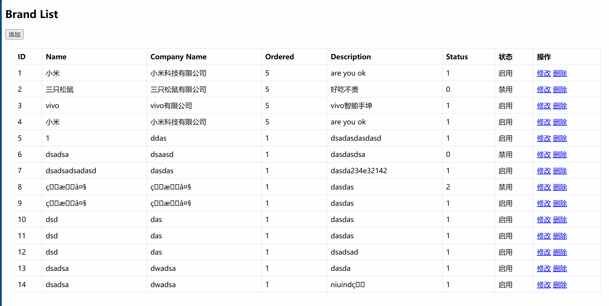


#### 如何理解Service和Servlet呢

你的比喻是相当贴切的，让我们进一步解释：

1. **Service（服务层）：**
   - **角色比喻：** 服务员
   - **责任：** 负责提供服务，执行业务逻辑，处理数据的增、删、改、查等操作。服务层类似于餐厅中的服务员，负责为顾客提供所需的服务，但并不直接涉及菜肴的制作。
   - **关联代码：** `BrandService` 负责处理品牌相关的业务逻辑，例如从数据库中查询品牌信息、添加新品牌等。

2. **Servlet（控制器层）：**
   - **角色比喻：** 处理数据的封装和数据库的更改，类似于厨房中的厨师。
   - **责任：** 接收来自用户的请求，处理请求中的数据，协调服务层执行相应的业务逻辑。Servlet 类似于餐厅中的厨师，接受服务员传递过来的菜单（用户请求），准备菜肴（处理数据）并最终提供给服务员（返回响应给用户）。
   - **关联代码：** `AddServlet` 处理添加品牌的请求，而 `SelectAllServlet` 处理查询所有品牌的请求。

通过这个比喻，服务层（服务员）专注于业务逻辑和数据处理，而控制器层（厨师）负责接收请求、处理数据，然后协调服务层执行相应的业务操作。这种分工协作的设计有助于代码的清晰性和可维护性。

Jsp就是展现层了


### 修改

#### 查

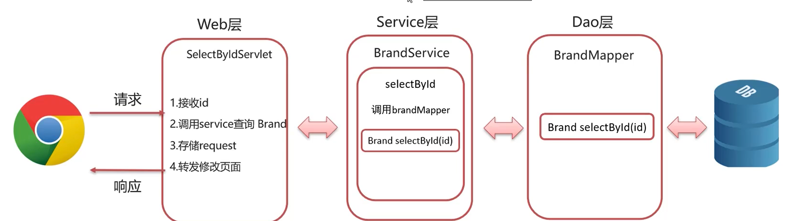 

##### 修改Brand Mapper.xml

```java
    @Update("update tb_brand set rand_name=#{rand_name},company_name=#{company_name},ordered=#{ordered},description=#{description},status=#{status} where id=#{id}")
    void update(Brand brand);
```


##### BrandService

```java
    public Brand selectById(int id)
    {
        SqlSession sqlsession=Factory.openSession(true);

        //获取mapper对象
        BrandMapper brandMapper=sqlsession.getMapper(BrandMapper.class);

        Brand brand=brandMapper.selectById(id);
        sqlsession.close();
        return brand;

    }
```


##### selectByIdservlet

```java
package com.hello.web;

import com.hello.pojo.Brand;
import com.hello.service.BrandService;

import javax.servlet.ServletException;
import javax.servlet.annotation.WebServlet;
import javax.servlet.http.HttpServlet;
import javax.servlet.http.HttpServletRequest;
import javax.servlet.http.HttpServletResponse;
import java.io.IOException;
@WebServlet("/selectById")
public class SelectByIdServlet extends HttpServlet {
    private static BrandService brandService=new BrandService();
    @Override
    protected void doGet(HttpServletRequest req, HttpServletResponse resp) throws ServletException, IOException {

        //接受id
        int id= Integer.parseInt(req.getParameter("id"));


        Brand brand=brandService.selectById(id);

        req.setAttribute("brand",brand);

        req.getRequestDispatcher("/update.jsp").forward(req,resp);


    }

    @Override
    protected void doPost(HttpServletRequest req, HttpServletResponse resp) throws ServletException, IOException {
        doGet(req, resp);
    }
}

```


##### update.jsp

```jsp
<%@ page language="java" contentType="text/html; charset=UTF-8" pageEncoding="UTF-8"%>
<!DOCTYPE html>
<html>
<head>
    <meta charset="UTF-8">
    <title>Add Brand</title>
    <!-- 引入Bootstrap样式文件，确保文件路径正确 -->
    <link rel="stylesheet" href="https://maxcdn.bootstrapcdn.com/bootstrap/4.0.0/css/bootstrap.min.css">
    <style>
        body {
            padding: 20px;
        }

        form {
            max-width: 400px;
            margin: 0 auto;
        }

        label {
            margin-bottom: 0.5rem;
        }

        textarea {
            resize: vertical;
        }
    </style>
</head>
<body>

<div class="container">
    <h2 class="mt-4">Add Brand</h2>

    <form action="/anli_war/update" method="post">
<%--        隐藏域--%>
        <input type="hidden" name="id" value="${brand.id}">
        <div class="form-group">
            <label for="randName">Brand Name:</label>
            <input type="text" class="form-control" id="randName" name="rand_name" required value="${brand.rand_name}">
        </div>

        <div class="form-group">
            <label for="companyName">Company Name:</label>
            <input type="text" class="form-control" id="companyName" name="company_name" required value="${brand.company_name}">
        </div>

        <div class="form-group">
            <label for="ordered">Ordered:</label>
            <input type="number" class="form-control" id="ordered" name="ordered" required value="${brand.ordered}">
        </div>

        <div class="form-group">
            <label for="description">Description:</label>
            <textarea class="form-control" id="description" name="description" rows="4" required>
                ${brand.description}
            </textarea>
        </div>

        <div class="form-group">
            <label for="status">Status:</label>
            <input type="number" class="form-control" id="status" name="status" required>
        </div>

        <button type="submit" class="btn btn-primary">Add Brand</button>
    </form>
</div>

<!-- 引入Bootstrap的JavaScript文件，确保文件路径正确 -->
<script src="https://code.jquery.com/jquery-3.2.1.slim.min.js"></script>
<script src="https://cdnjs.cloudflare.com/ajax/libs/popper.js/1.12.9/umd/popper.min.js"></script>
<script src="https://maxcdn.bootstrapcdn.com/bootstrap/4.0.0/js/bootstrap.min.js"></script>

</body>
</html>

```

#### 改


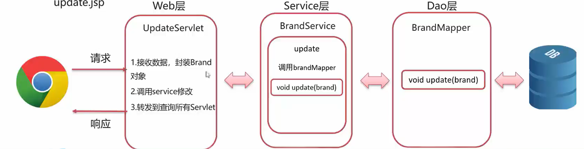 

##### 修改BrandMapper

```java
    @Update("update tb_brand set rand_name=#{rand_name},company_name=#{company_name},ordered=#{ordered},description=#{description},status=#{status} where id=#{id}")
    void update(Brand brand);
```

##### BrandService

```java
    public void update(Brand brand)
    {
        SqlSession sqlsession=Factory.openSession(true);

        //获取mapper对象
        BrandMapper brandMapper=sqlsession.getMapper(BrandMapper.class);

        brandMapper.update(brand);

        sqlsession.close();
    }
```


##### updateServlet

```java
package com.hello.web;

import com.hello.pojo.Brand;
import com.hello.service.BrandService;

import javax.servlet.ServletException;
import javax.servlet.annotation.WebServlet;
import javax.servlet.http.HttpServlet;
import javax.servlet.http.HttpServletRequest;
import javax.servlet.http.HttpServletResponse;
import java.io.IOException;
@WebServlet("/update")
public class UpdateServlet extends HttpServlet {
    private static BrandService brandService=new BrandService();
    @Override
    protected void doGet(HttpServletRequest req, HttpServletResponse resp) throws ServletException, IOException {
        req.setCharacterEncoding("utf-8");
        System.out.println("获取所有参数的map集合");

        int id= Integer.parseInt(req.getParameter("id"));
        String randname=req.getParameter("rand_name");
        System.out.println("用户输入的"+randname);
        String companyname=req.getParameter("company_name");
        System.out.println("用户输入的"+companyname);
        int ordered= Integer.parseInt(req.getParameter("ordered"));
        System.out.println("用户输入的"+ordered);
        String desc=req.getParameter("description");
        System.out.println("用户输入的"+desc);
        int status= Integer.parseInt(req.getParameter("status"));

        Brand brand=new Brand();
        brand.setId(id);
        brand.setRand_name(randname);
        brand.setCompany_name(companyname);
        brand.setOrdered(ordered);
        brand.setDescription(desc);
        brand.setStatus(status);


        System.out.println(brand);

        brandService.update(brand);

        req.getRequestDispatcher("/selectall").forward(req,resp);


    }

    @Override
    protected void doPost(HttpServletRequest req, HttpServletResponse resp) throws ServletException, IOException {
        doGet(req, resp);
    }
}
package com.hello.web;

import com.hello.pojo.Brand;
import com.hello.service.BrandService;

import javax.servlet.ServletException;
import javax.servlet.annotation.WebServlet;
import javax.servlet.http.HttpServlet;
import javax.servlet.http.HttpServletRequest;
import javax.servlet.http.HttpServletResponse;
import java.io.IOException;
@WebServlet("/update")
public class UpdateServlet extends HttpServlet {
    private static BrandService brandService=new BrandService();
    @Override
    protected void doGet(HttpServletRequest req, HttpServletResponse resp) throws ServletException, IOException {
        req.setCharacterEncoding("utf-8");
        System.out.println("获取所有参数的map集合");

        int id= Integer.parseInt(req.getParameter("id"));
        String randname=req.getParameter("rand_name");
        System.out.println("用户输入的"+randname);
        String companyname=req.getParameter("company_name");
        System.out.println("用户输入的"+companyname);
        int ordered= Integer.parseInt(req.getParameter("ordered"));
        System.out.println("用户输入的"+ordered);
        String desc=req.getParameter("description");
        System.out.println("用户输入的"+desc);
        int status= Integer.parseInt(req.getParameter("status"));

        Brand brand=new Brand();
        brand.setId(id);
        brand.setRand_name(randname);
        brand.setCompany_name(companyname);
        brand.setOrdered(ordered);
        brand.setDescription(desc);
        brand.setStatus(status);


        System.out.println(brand);

        brandService.update(brand);

        req.getRequestDispatcher("/selectall").forward(req,resp);


    }

    @Override
    protected void doPost(HttpServletRequest req, HttpServletResponse resp) throws ServletException, IOException {
        doGet(req, resp);
    }
}

```


##### 最终功能演示

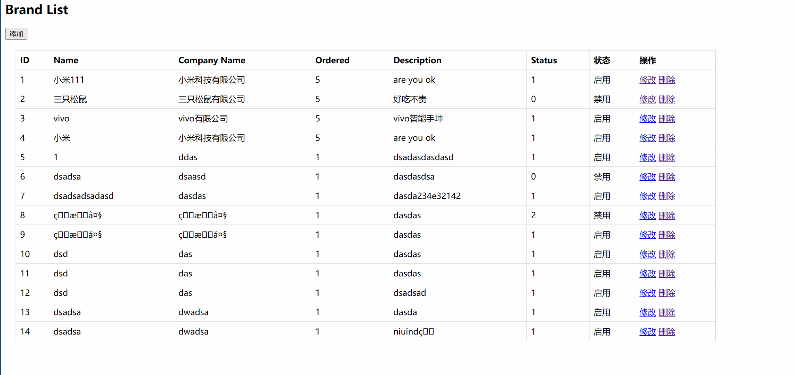

