# Mybatis

## Mybatis简介

MyBatis是一种用于**Java语言的持久层框架**

它**简化了数据库交互的过程**。与直接使用JDBC相比

MyBatis提供了**更为简洁的方式来执行数据库操作**，**并将SQL语句与Java代码进行解耦。**

==**MyBatis的核心思想是通过XML或注解来配置SQL语句，将Java对象与数据库表之间的映射关系描述清晰**==

1. **SQL映射文件（XML或注解）：** MyBatis使用XML文件或注解来定义数据库操作的SQL语句。这样，你可以将SQL语句与Java代码分离，使得代码更易读、易维护。

2. **参数映射：** MyBatis能够**自动将Java对象的属性映射到SQL语句中的参数**，简化了参数传递的过程。无需手动处理PreparedStatement等操作，MyBatis会自动完成这些工作。

3. **结果集映射：** MyBatis可以将查询结果映射到Java对象，消除了手动处理ResultSet的麻烦。这样，你可以直接通过Java对象来操作数据库查询结果，而无需关心数据库的具体实现。

4. **动态SQL：** **MyBatis支持动态SQL，允许你在XML文件中编写动态的SQL语句**，根据不同的条件生成不同的SQL。这提高了SQL语句的灵活性。

5. **事务管理：** MyBatis能够与Java的事务管理机制集成，确保数据库操作的原子性和一致性。

**只需关注SQL语句的编写和Java对象的设计**，而不必过多关心数据库连接、结果集处理等细节。

 ## Mybatis有什么用

ibatis->mybatis

简化JDBC的开发

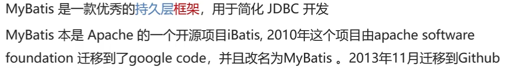

[The MyBatis Blog](https://blog.mybatis.org/)

[mybatis – MyBatis 3 | 简介](https://mybatis.org/mybatis-3/zh_CN/index.html) 

> 1. 负责将数据报道迟到数据库的那一层代码
> 2. javaee三层架构
>    1. 表现层 ：页面展示
>    2. 业务层 ：逻辑处理的
>    3. **持久层 ：保存到数据库的 +++**

框架：

+ 框架是一个半成品的软件，是一套可以宠用的，通用的，软件基础代码模型
+ 在框架的基础上构建软件编写更加高效，规范，通用，可拓展性。

举例：石膏娃娃就是框架，然后涂颜色就是在框架的基础上开发。


## JDBC的缺点 

JDBC代码

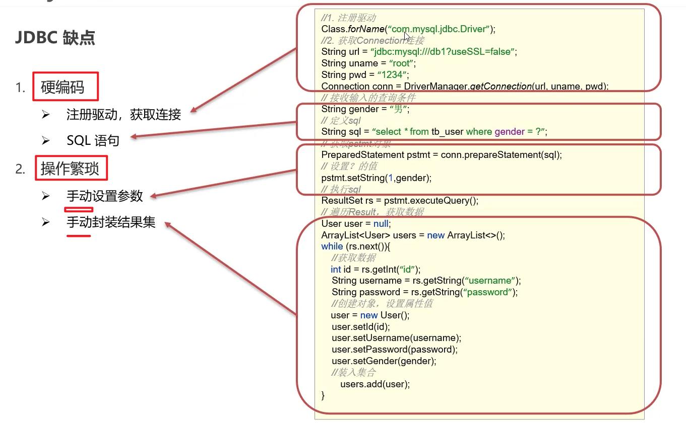  

## Mybatis是如何简化的？

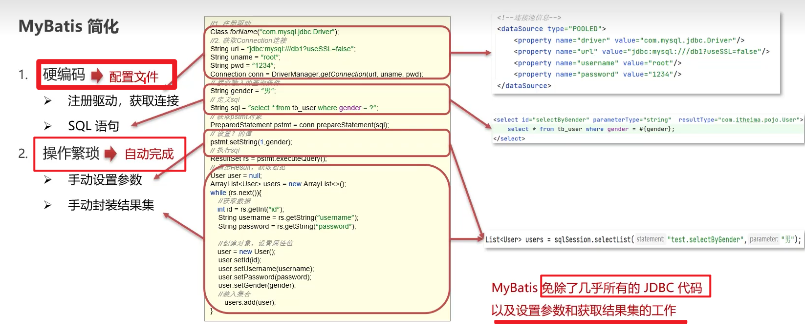 

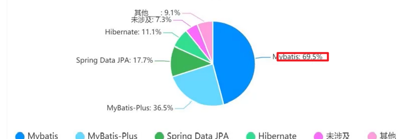 


## MyBatis快速入手

[mybatis – MyBatis 3 | 入门](https://mybatis.org/mybatis-3/zh_CN/getting-started.html) 

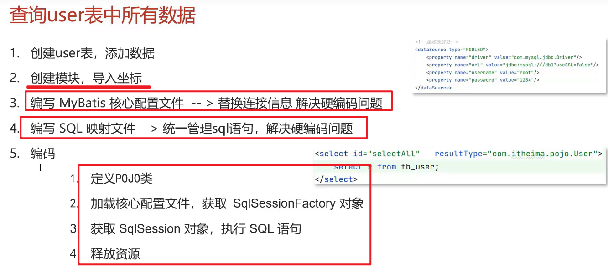 

### 创建user表，添加数据

```sql

show databases;
show tables;
create database mybatis;
select database();
use mybatis;
show tables;
create table tb_user(
id int primary key auto_increment,
username varchar(20),
password varchar(20),
gender char(1),
addr varchar(30) 
);

insert into tb_user(username,password,gender,addr) values("张三","123456","男","东京北海道");
insert into tb_user(username,password,gender,addr) values("李四","abcd","男","科学大道");
insert into tb_user(username,password,gender,addr) values("王五","123","女","金水区");

select * from tb_user;


```

### 创建模块，导入坐标

创建一个maven项目

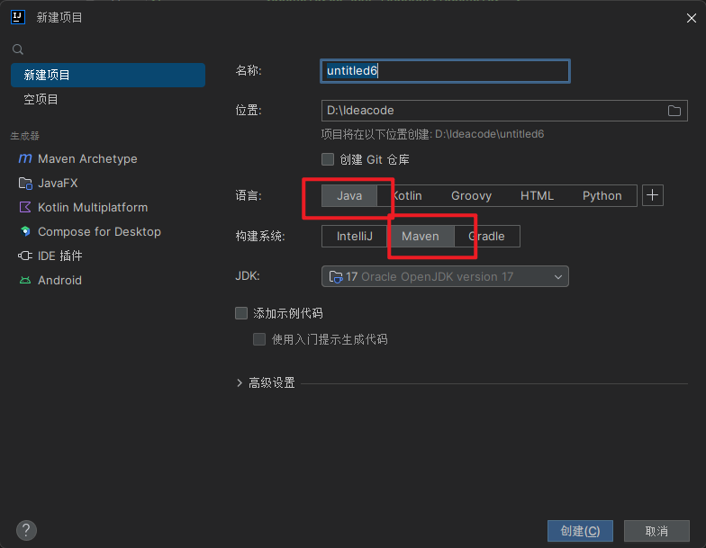 

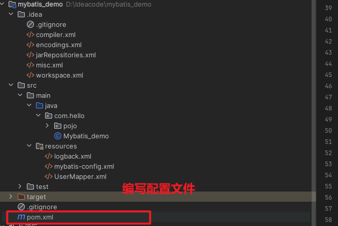 

```
        <dependency>
            <groupId>org.mybatis</groupId>
            <artifactId>mybatis</artifactId>
            <version>3.5.13</version>
        </dependency>

        <dependency>
            <groupId>mysql</groupId>
            <artifactId>mysql-connector-java</artifactId>
            <version>8.0.32</version>
        </dependency>
        <dependency>
            <groupId>junit</groupId>
            <artifactId>junit</artifactId>
            <version>4.13.2</version>
        </dependency>
```

添加jar包

### 配置Mybatis核心配置文件

[mybatis – MyBatis 3 | 入门](https://mybatis.org/mybatis-3/zh_CN/getting-started.html) 

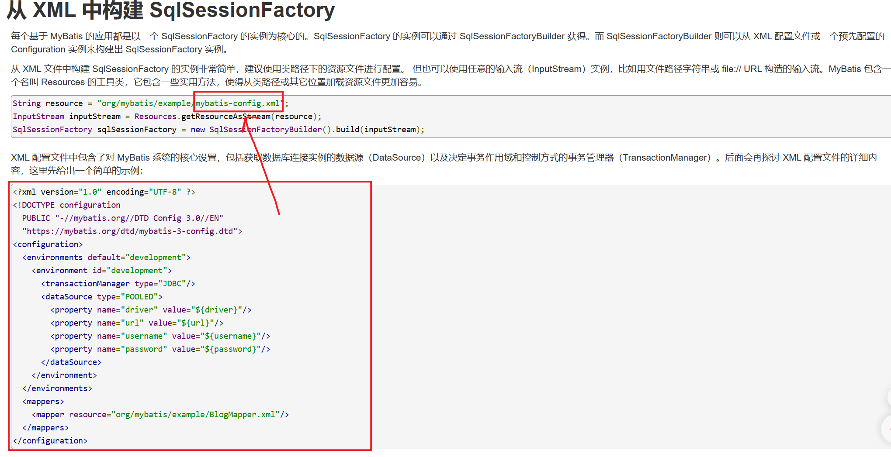 

创建mybatis-config.xml

```xml
<?xml version="1.0" encoding="UTF-8" ?>
<!DOCTYPE configuration
        PUBLIC "-//mybatis.org//DTD Config 3.0//EN"
        "https://mybatis.org/dtd/mybatis-3-config.dtd">
<configuration>
    <environments default="development">
        <environment id="development">
            <transactionManager type="JDBC"/>

<!--            数据库的连接信息-->
            <dataSource type="POOLED">
                <property name="driver" value="com.mysql.cj.jdbc.Driver"/>
                <property name="url" value="jdbc:mysql:///mybatis"/>
                <property name="username" value="root"/>
                <property name="password" value="xurunbo"/>
            </dataSource>


        </environment>
    </environments>

<!--    加载SQl的映射文件-->
    <mappers>
        <mapper resource="UserMapper.xml"/>
    </mappers>
</configuration>
```

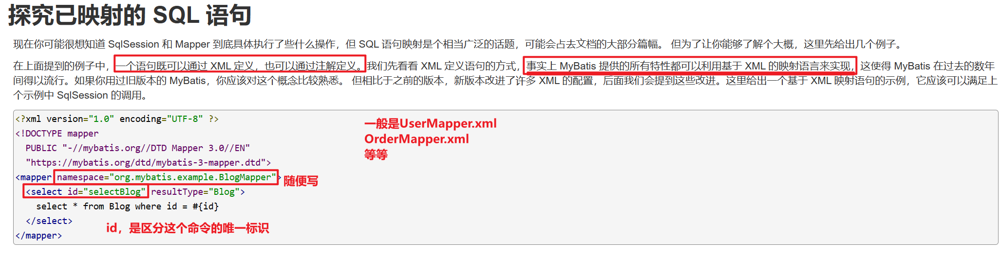 

编写UserMapper.xml

```xml
<?xml version="1.0" encoding="UTF-8" ?>
<!DOCTYPE mapper
        PUBLIC "-//mybatis.org//DTD Mapper 3.0//EN"
        "https://mybatis.org/dtd/mybatis-3-mapper.dtd">


<!--命名空间随便-->
<mapper namespace="test">
    <select id="selectall" resultType="com.hello.pojo.User">
        select * from tb_user;
    </select>
</mapper>
```

### 定义实体类在pojo模块下

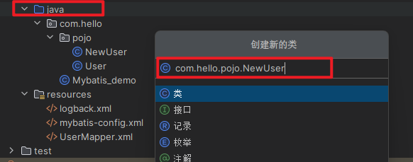 

我们用User，NewUser是举例

```java
package com.hello.pojo;

public class User {


    private Integer id;
    private String username ;
    private String password ;
    private String gender   ;
    private String addr     ;

    public User(Integer id, String username, String password, String gender, String addr) {
        this.id = id;
        this.username = username;
        this.password = password;
        this.gender = gender;
        this.addr = addr;
    }


    public Integer getId() {
        return id;
    }

    public void setId(Integer id) {
        this.id = id;
    }

    public String getUsername() {
        return username;
    }

    public void setUsername(String username) {
        this.username = username;
    }

    public String getPassword() {
        return password;
    }

    public void setPassword(String password) {
        this.password = password;
    }

    public String getGender() {
        return gender;
    }

    public void setGender(String gender) {
        this.gender = gender;
    }

    public String getAddr() {
        return addr;
    }

    public void setAddr(String addr) {
        this.addr = addr;
    }

    @Override
    public String toString() {
        return "User{" +
                "id=" + id +
                ", username='" + username + '\'' +
                ", password='" + password + '\'' +
                ", gender='" + gender + '\'' +
                ", addr='" + addr + '\'' +
                '}';
    }
}

```

数据库对应的属性搬过来，然后添加setter和getter和tostring方法和构造方法。

#### xiaotips

> 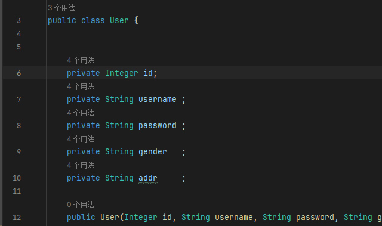

### 编码测试类

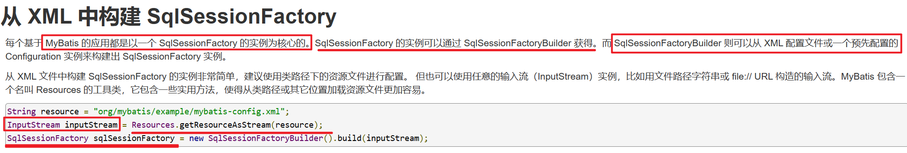 

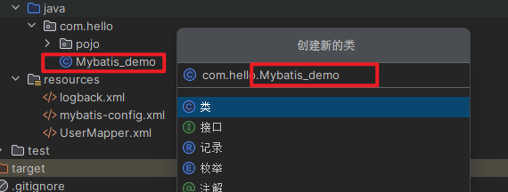 

```java
package com.hello;

import com.hello.pojo.User;
import org.apache.ibatis.io.Resources;
import org.apache.ibatis.session.SqlSession;
import org.apache.ibatis.session.SqlSessionFactory;
import org.apache.ibatis.session.SqlSessionFactoryBuilder;

import java.io.IOException;
import java.io.InputStream;
import java.util.List;

public class Mybatis_demo {
    public static void main(String[] args) throws IOException {
        //加载mybatis的核心配置文件，获取
        String resource = "mybatis-config.xml";
        InputStream inputStream = Resources.getResourceAsStream(resource);
        SqlSessionFactory sqlSessionFactory = new SqlSessionFactoryBuilder().build(inputStream);


        //获取Sqlsussion对象
        SqlSession sqlSession=sqlSessionFactory.openSession();


        //执行SQL
        List<User> users=sqlSession.selectList("test.selectall");


        //打印结果

        System.out.println(users);

        //清理资源

        sqlSession.close();
    }
}

```

xml文件的路径问题

> 对于 Maven 项目或者其他构建工具，资源文件（比如 XML 文件）通常会被复制到输出目录（如 `target/classes`）下，这个目录就成了类加载器（ClassLoader）的搜索路径之一。
>
> 在运行时，类加载器会从这些路径中寻找资源文件，因此 Java 程序中的类可以直接访问这些资源。
> 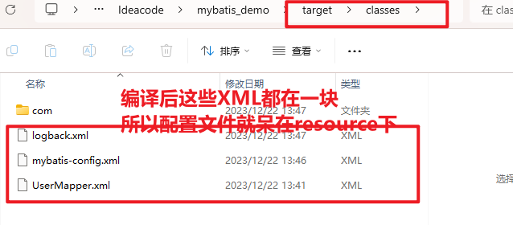 


### 代码效果

最终

一张表可以i看作一个类，然后各个属性就是表的字段。

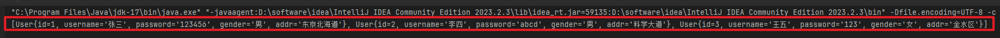

在关系型数据库中，可以将数据库中的表映射为程序中的类，这个映射的概念称为对象关系映射（ORM）。

 每个表可以被看作是一个类，表的每一列就是这个类的属性。例如，考虑一个名为 `User` 的表，包含 `id`、`username`、`email` 等列，可以用一个类来表示：

```java
public class User {
    private Long id;
    private String username;
    private String email;

    // 构造方法、getter和setter等
}
```

ORM 框架（如 Hibernate、MyBatis 等）可以更方便地在数据库表和类之间进行映射，使得编程时可以直接使用面向对象的思维来操作数据库，而不用关心底层的 SQL 语句和数据库细节。


### IDEA数据库插件

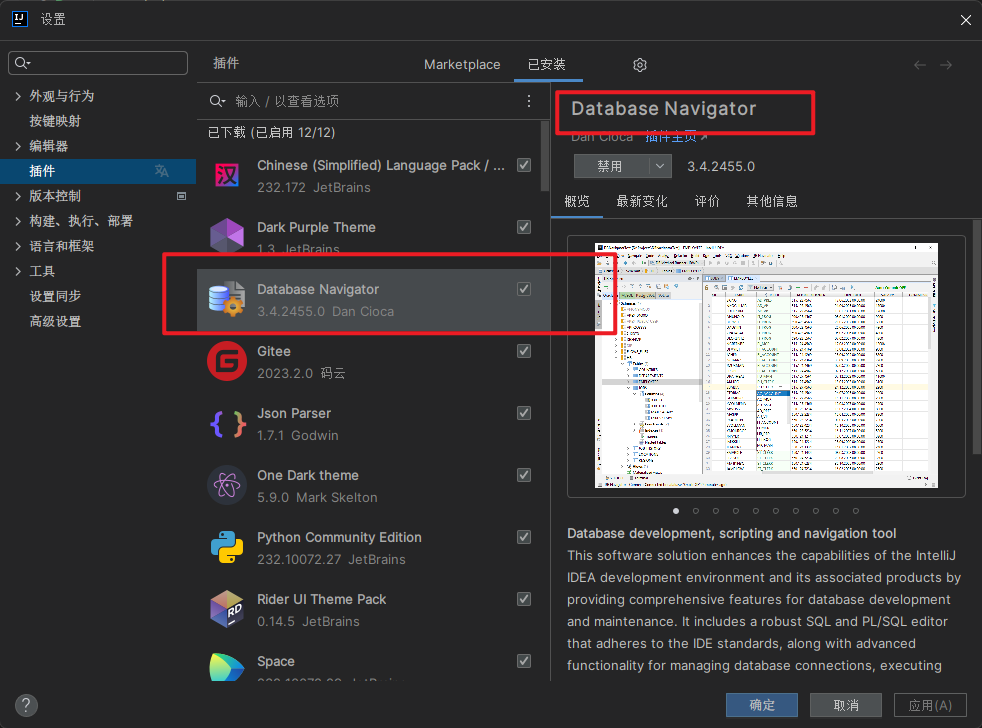 

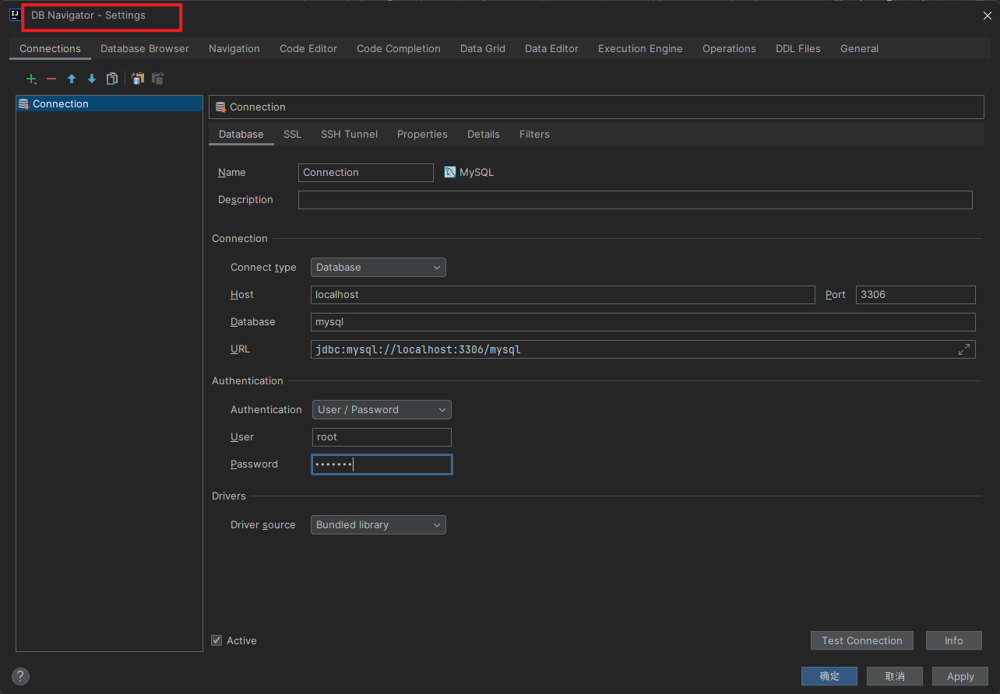 

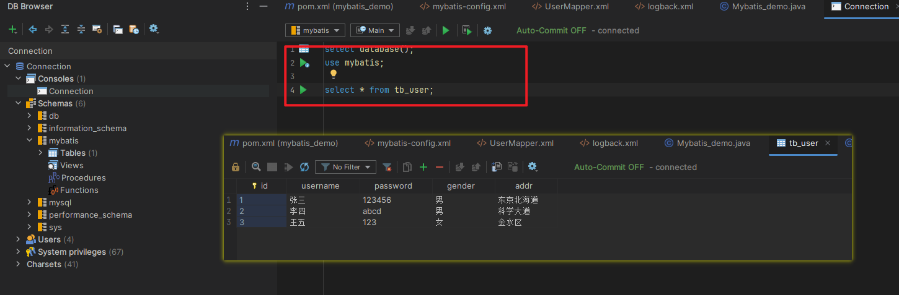 

## Mapper代理开发

解决原生方法中的硬编码

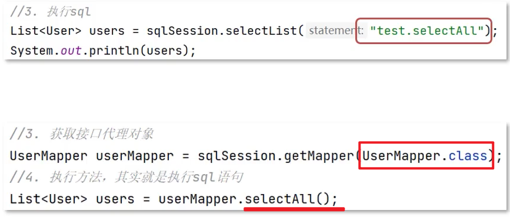 

在resource下面创建Directory的时候

就不能像的类里面简单的com.hello.UserMapper了

而是com/hello/UserMapper

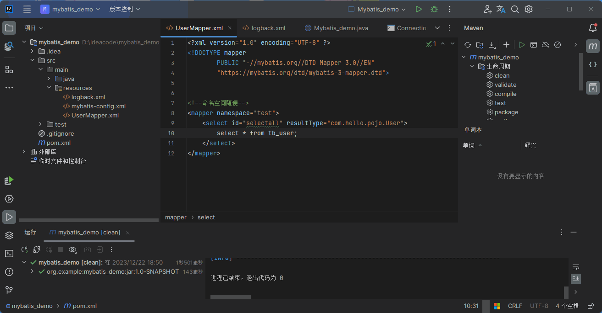

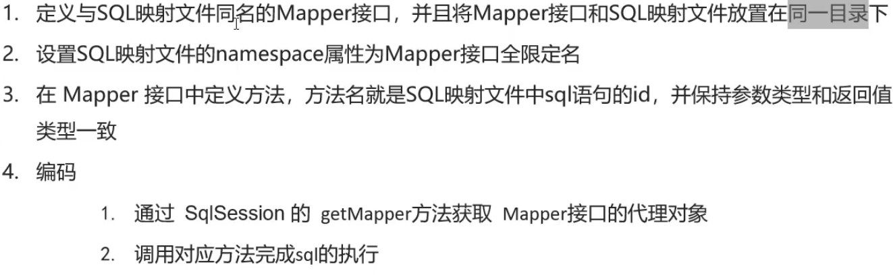

#### 定义与SQL映射文件同名的Mapper接口

实现同名的接口和xml配置文件在同一个目录下

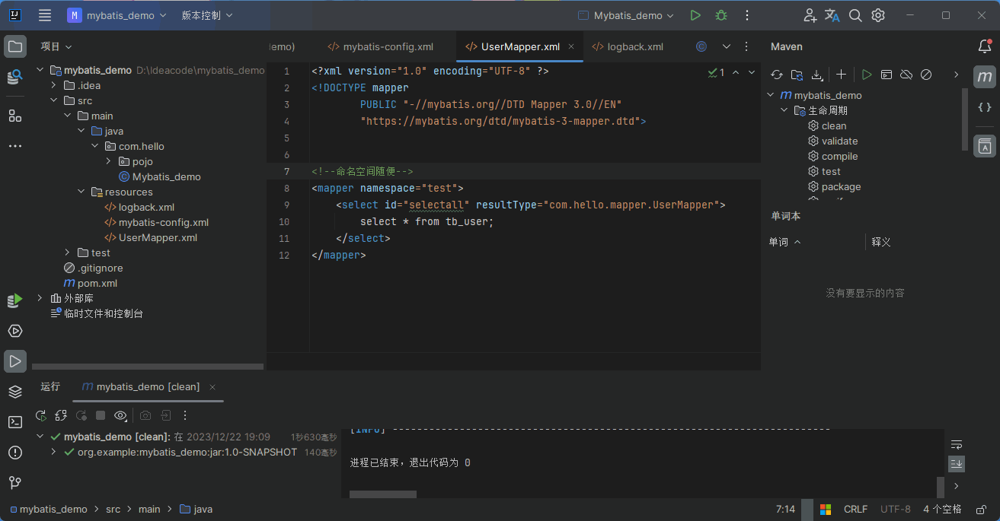

#### 设置SQL映射文件的namespace属性为Mapper接口全限定名

r返回类型是实体类:esulttype是实体类

命名空间就是Mapper接口的的限定名

```xml
<!--命名空间随便-->
<!--现在要用Mapper接口的全限定名-->
<mapper namespace="com.hello.mapper.UserMapper">
    <select id="selectall" resultType="com.hello.pojo.User">
        select * from tb_user;
    </select>
</mapper>
```


#### Mapper接口定义方法

定义一个方法名是SQL映射文件中华sql语句的id，并且保持参数类型和返回值类型一致

```java
package com.hello.mapper;

import com.hello.pojo.User;

import java.util.List;

public interface UserMapper {
    
    List<User> select();
}

```


#### 注意maybatis配置的mapper路径发生了改变

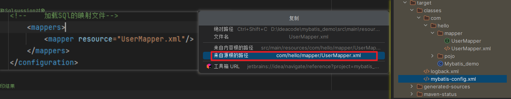 


#### 编码

```java
package com.hello;

import com.hello.mapper.UserMapper;
import com.hello.pojo.User;
import org.apache.ibatis.io.Resources;
import org.apache.ibatis.session.SqlSession;
import org.apache.ibatis.session.SqlSessionFactory;
import org.apache.ibatis.session.SqlSessionFactoryBuilder;

import java.io.IOException;
import java.io.InputStream;
import java.util.List;

public class Mybatis_demo {
    public static void main(String[] args) throws IOException {
        //加载mybatis的核心配置文件，获取
        String resource = "mybatis-config.xml";
        InputStream inputStream = Resources.getResourceAsStream(resource);
        SqlSessionFactory sqlSessionFactory = new SqlSessionFactoryBuilder().build(inputStream);


        //获取Sqlsussion对象
        SqlSession sqlSession=sqlSessionFactory.openSession();


        UserMapper usermapper=sqlSession.getMapper(UserMapper.class);


        //执行SQL
//        List<User> users=sqlSession.selectList("test.selectall");
        List<User> users=usermapper.selectall();


        //打印结果

        System.out.println(users);

        //清理资源

        sqlSession.close();
        System.out.println(System.getProperty("user.dir"));
    }
}

```

> - 它从 `SqlSessionFactory` 中获取了一个 `SqlSession`。
> - 使用 `sqlSession.getMapper(UserMapper.class)` 获取了`UserMapper`接口的代理对象。
> - 这就是所谓的 "代理对象"，MyBatis在运行时动态生成了`UserMapper`接口的实现。
> - 调用代理对象的 `selectall()` 方法，MyBatis将这个方法调用转换为XML文件中定义的SQL查询。
> - "代理对象"是MyBatis在运行时动态创建的一个对象，它实现了你的`UserMapper`接口。这个对象负责根据XML配置将方法调用转换为相应的SQL查询，提供了一种方便的方式与数据库交互。

效果和之前一样

##### 注意

MyBatis 使用接口和 XML 映射来提供 SQL 语句和 Java 代码之间的清晰分离。它充当 Java 应用程序和数据库之间的桥梁，XML 配置指定如何将 SQL 查询映射到 Java 方法。

> **UserMapper 接口 （UserMapper.java）：**
>
> - 此接口**定义将用于数据库操作的方法**。
> - 在您的例子中，它有一个单一的方法，旨在从“tb_user”表中检索所有用户。`selectall()`
>
> 1. 用户映射器 XML 配置 （UserMapper.xml）：
>    - **此 XML 文件包含在 UserMapper 接口中定义的方法的 SQL 映射**。
>    - **该元素指定命名空间，该命名空间是 UserMapper 接口的完全限定名称**。`<mapper>`
>    - 该元素将该方法映射到从“tb_user”表中检索所有列的 SQL 查询。`<select>``selectall()`


>  `<package name="com/hello/mapper"/>`
>
> /换成.也是ok的

```xml
<!--    加载SQl的映射文件-->
    <mappers>
<!--        <mapper resource="com/hello/mapper/UserMapper.xml"/>-->
        
<!--        这样就可以同时加载很多很多个映射sql-->
        <package name="com/hello/mapper"/>
    </mappers>
```


## Mybatis核心配置文件

`mybatis-config.xml`

[mybatis – MyBatis 3 | 配置](https://mybatis.org/mybatis-3/zh_CN/configuration.html) 

MyBatis配置文件是MyBatis框架的核心部分，用于配置整个框架的运行方式：

1. **`<configuration>` 元素：**
   - 根元素，包含整个MyBatis配置信息。

2. **`<environments>` 元素：**
   - 配置数据源和事务管理器。
   - `default` 属性指定默认的环境，这里是 "development"。

3. **`<environment>` 元素：**
   - 配置一个运行环境，包括事务管理器和数据源。
   - `id` 属性是环境的标识，这里是 "development"。
   - `transactionManager` 元素指定事务管理器的类型，这里是 "JDBC"。
   - `dataSource` 元素配置数据源的类型和相关属性，这里使用了连接池（"POOLED"）。

4. **`<dataSource>` 元素：**
   - 配置数据源的相关信息，包括数据库驱动、连接URL、用户名和密码。

5. **`<mappers>` 元素：**
   - 配置MyBatis映射器（Mapper）。
   - `<mapper>` 元素用于指定映射器文件的位置，你的代码中使用了 `<package>` 元素，表示通过包名加载所有映射器文件。

6. **`<package>` 元素：**
   - 通过包名加载所有映射器文件，指定的包名是 "com/hello/mapper"。
   - MyBatis将会扫描这个包下所有符合规范的接口，并动态创建对应的代理对象。

7. **映射器文件（Mapper XML）：**
   - 映射器文件包含了SQL语句和它们与接口方法的映射关系。
   - 注释中的 `<mapper>` 元素中的 `namespace` 属性指定了接口的全限定名，与接口关联。

作用是告诉MyBatis如何连接数据库、处理事务，并指定了映射器的位置。

映射器文件中的SQL语句与接口方法的映射关系由MyBatis框架自动管理，通过动态代理实现。


### 起别名

不区分大小写了，方便

[mybatis – MyBatis 3 | 配置](https://mybatis.org/mybatis-3/zh_CN/configuration.html#typeAliases)

```xml
<!--这样就能把所有实体类都起了别名，现在是类名不区分大小了，也不用带包名。
而且还要放在上面-->
<typeAliases>
    <package name="com.hello.pojo"/>
</typeAliases>
```

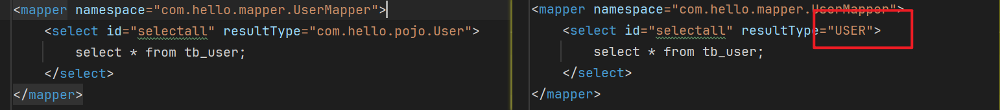

这样就实现了别名


## 配置文件/注解完成增删改查

#### 要求

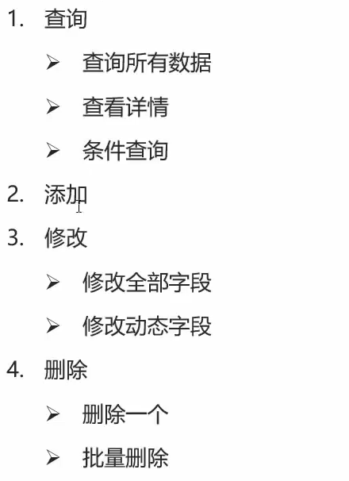 


#### 环境准备

> 创建tb_brand表
>
> ```sql
> create table tb_brand
> (
> id int primary key auto_increment,
> rand_name varchar(20),
> company_name varchar(20),
> ordered intr
> description varchar(100),
> 
> status int
> );
> insert into tb_brand(rand_name,company_name,ordered,description,status) values("小米","小米科技有限公司",5,"are you ok",1);
> insert into tb_brand(rand_name,company_name,ordered,description,status) values("三只松鼠","三只松鼠有限公司",5,"好吃不贵",0);
> insert into tb_brand(rand_name,company_name,ordered,description,status) values("华为","华为技术有限公司",5,"华为让生活更幸福",1);
> insert into tb_brand(rand_name,company_name,ordered,description,status) values("vivo","vivo有限公司",5,"vivo智能手坤",1);
> 
> select * from tb_brand;
> ```
>
> 实体brand
>
> ```java
> package com.hello.pojo;
> 
> //推荐使用包装的类型，因为没有M默认值
> public class Brand {
> 
>     private Integer  id           ;
>     private String  rand_name    ;
>     private String  company_name ;
>     private Integer ordered      ;
>     private String  description  ;
>     //0禁用，1正常
>     private Integer   status       ;
> 
>     public Brand(Integer id, String rand_name, String company_name, Integer ordered, String description, Integer status) {
>         this.id = id;
>         this.rand_name = rand_name;
>         this.company_name = company_name;
>         this.ordered = ordered;
>         this.description = description;
>         this.status = status;
>     }
> 
>     public Integer getId() {
>         return id;
>     }
> 
>     public void setId(Integer id) {
>         this.id = id;
>     }
> 
>     public String getRand_name() {
>         return rand_name;
>     }
> 
>     public void setRand_name(String rand_name) {
>         this.rand_name = rand_name;
>     }
> 
>     public String getCompany_name() {
>         return company_name;
>     }
> 
>     public void setCompany_name(String company_name) {
>         this.company_name = company_name;
>     }
> 
>     public Integer getOrdered() {
>         return ordered;
>     }
> 
>     public void setOrdered(Integer ordered) {
>         this.ordered = ordered;
>     }
> 
>     public String getDescription() {
>         return description;
>     }
> 
>     public void setDescription(String description) {
>         this.description = description;
>     }
> 
>     public Integer getStatus() {
>         return status;
>     }
> 
>     public void setStatus(Integer status) {
>         this.status = status;
>     }
> 
>     @Override
>     public String toString() {
>         return "Brand{" +
>                 "id=" + id +
>                 ", rand_name='" + rand_name + '\'' +
>                 ", company_name='" + company_name + '\'' +
>                 ", ordered=" + ordered +
>                 ", description='" + description + '\'' +
>                 ", status=" + status +
>                 '}';
>     }
> }
> 
> ```
>
> 测试用例
>
>  


> **安装MybatisX插件**
>
> 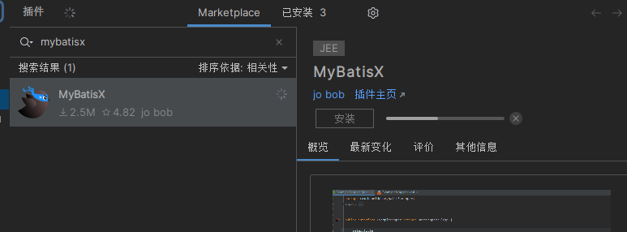
>
> 以后SQL映射文件和接口的方法可以快速的跳转
>
> 点击蓝鸟和红鸟互相跳转.
>
> 我们嗯在SQL映射文件写的相当于statement对象
>
> 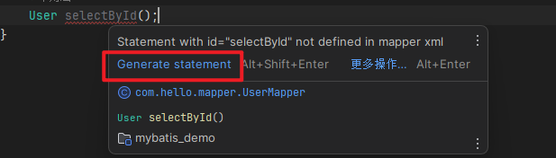 

#### 增

> 编写Mappper接口
>
> 参数：除了id意外的所有数据 `void add(Brand brand);`
>
> 结果void
>
> 编写SQL映射文件
>
> 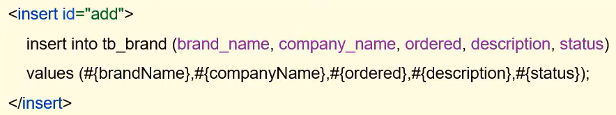 

执行方法测试``SqlSession sqlSession=sqlSessionFactory.openSession();`默认开启事务

进行增删改查操作后需要手动使用`sqlSession.commit();`提交事务

`SqlSession sqlSession=sqlSessionFactory.openSession(true);`可以设置自动提交事务(关闭事务);

开启了事务是不会自动提交的！

mybatis事务：没有自动提交（默认是开启事务的）

手动mapper对象commit()

代码实现:

手动提交

```java
 @Test
    public  void insert() throws IOException {
        //加载mybatis的核心配置文件，获取
        String resource = "mybatis-config.xml";
        InputStream inputStream = Resources.getResourceAsStream(resource);
        SqlSessionFactory sqlSessionFactory = new SqlSessionFactoryBuilder().build(inputStream);
        //获取Sqlsussion对象
        SqlSession sqlSession=sqlSessionFactory.openSession(false);
        sqlSession.commit(true);
        BrandMapper brandmapper=sqlSession.getMapper(BrandMapper.class);
        Brand brand=new Brand("紫米","紫米科技有限公司",9,"性价比手机",1);
        brandmapper.add(brand);
        sqlSession.commit();
        if(brand!=null)
            System.out.println("插入成功！");
        else
            System.out.println("插入失败！");
        List<Brand> brands=brandmapper.selectall();

        System.out.println(brands);
        sqlSession.close();
    }
```

下面是改为true自动提交

```java
 @Test
    public  void insert() throws IOException {
        //加载mybatis的核心配置文件，获取
        String resource = "mybatis-config.xml";
        InputStream inputStream = Resources.getResourceAsStream(resource);
        SqlSessionFactory sqlSessionFactory = new SqlSessionFactoryBuilder().build(inputStream);
        //获取Sqlsussion对象
        SqlSession sqlSession=sqlSessionFactory.openSession(true);
        sqlSession.commit(true);
        BrandMapper brandmapper=sqlSession.getMapper(BrandMapper.class);
        Brand brand=new Brand("紫米","紫米科技有限公司",9,"性价比手机",1);
        brandmapper.add(brand);
        if(brand!=null)
            System.out.println("插入成功！");
        else
            System.out.println("插入失败！");
        List<Brand> brands=brandmapper.selectall();

        System.out.println(brands);
        sqlSession.close();
    }
```

##### 主键返回

```java
 sqlSession.commit();

        if(brand!=null)
            System.out.println("插入成功！"+brand.getId());
        else
            System.out.println("插入失败！");
```

插入成功！null

现在是获取不到主键的！

修改sql映射文件

```xml
    <insert id="add" useGeneratedKeys="true" keyProperty="id">
<!--keyProperty是实体对象的id-->
        insert into tb_brand(rand_name,company_name,ordered,description,status)
        values(#{rand_name},#{company_name},#{ordered},#{description},#{status});

    </insert>
```

再次执行插入代码，就可以拿到id了！

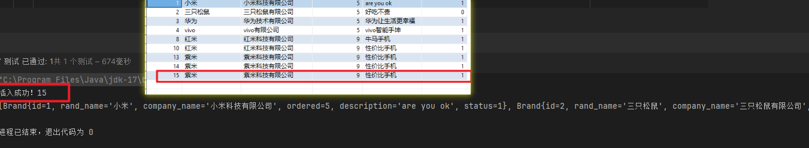 


#### 删

前端提供id

然后执行删除

sql映射文件

```xml
    <delete id="delete">
        delete from tb_brand where id=#{id};
    </delete>
```

Mapper接口

```java
    void delete(int id);
```

代码测试

```java
@Test
    public  void deletetest() throws IOException {
        //加载mybatis的核心配置文件，获取
        String resource = "mybatis-config.xml";
        InputStream inputStream = Resources.getResourceAsStream(resource);
        SqlSessionFactory sqlSessionFactory = new SqlSessionFactoryBuilder().build(inputStream);

        //获取Sqlsussion对象

        SqlSession sqlSession=sqlSessionFactory.openSession(true);
        sqlSession.commit(true);
        BrandMapper brandmapper=sqlSession.getMapper(BrandMapper.class);


        int id=15;
//        Brand brand=new Brand("紫色的米","紫色的米科技有限公司",9,"性价比手鸡",1);
        brandmapper.delete(id);

        List<Brand> brands=brandmapper.selectall();

        System.out.println(brands);


        sqlSession.close();
    }
```


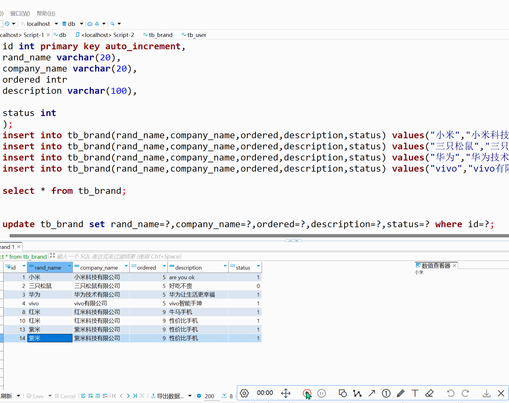

##### 批量删除

用户的选中的都要删除的，如何实现批量删除呢？

回得到一个id的数据，然后遍历这个数组，然后一一删除

`delete from tb_brand where id in (? ,? ,?);`

> 方法1：
>
> ​		mybatis:默认会把我们传入的数组
>
> ​		用Map的方式存储  array : 数组
>
> 方法2：
>
> ​		用param注解

代码演示

sql映射文件

==**没有注解是不能传入ids，也就是参数的名字的！**==

演示错误:


Mapper接口

```java
    void deletebyids(int[] ids);
```

```xml
    <delete id="deletebyids">

        delete from tb_brand where id
        in(
        <foreach collection="array" item="id" separator=",">
            #{id}
        </foreach>
        )
    </delete>
```

下面是自动拼();

```xml
    <delete id="deletebyids">

        delete from tb_brand where id
        in
        <foreach collection="array" item="id" separator="," open="(" close=")">
            #{id}
        </foreach>
        
    </delete>
```

注解

Mapper接口

```java
    void deletebyids(@Param("ids") int[] ids);
```

Sql映射文件

==唯一要注意的是`collection="ids"`可以用参数ids了==

没有的时候是只能用默认的array！！！！

```xml
    <delete id="deletebyids">

        delete from tb_brand where id
        in
        <foreach collection="ids" item="id" separator="," open="(" close=")">
            #{id}
        </foreach>

    </delete>
```


##### 注意

使用@Param注解！

> mybatis会将数组参数，封装为一个Map集合*默认：array=数组*
>
> 使用@Param注解改变map集合的默认key的名称


#### 改

##### 修改全部字段

---

编写Mapper接口

```java
    void update(Brand brand);
```

参数：所有数据

结果void

---

SQl映射文件

```xml
    <update id="update">
        update tb_brand
        set
        rand_name=#{rand_name},
        company_name=#{company_name},
        ordered=#{ordered},
        description=#{description},
        status=#{status}
        where id=#{id};
    </update>
```

执行方法测试：

代码演示：

```java
 @Test
    public  void updatetest() throws IOException {
        //加载mybatis的核心配置文件，获取
        String resource = "mybatis-config.xml";
        InputStream inputStream = Resources.getResourceAsStream(resource);
        SqlSessionFactory sqlSessionFactory = new SqlSessionFactoryBuilder().build(inputStream);

        //获取Sqlsussion对象

        SqlSession sqlSession=sqlSessionFactory.openSession(true);
        sqlSession.commit(true);
        BrandMapper brandmapper=sqlSession.getMapper(BrandMapper.class);
        
        Brand brand=new Brand("紫色的米","紫色的米科技有限公司",9,"性价比手鸡",1);
        //因为有参构造没有id,,自己设置
        brand.setId(15);
        brandmapper.update(brand);
        if(brand!=null)
            System.out.println("修改成功！"+brand.getId());
        else
            System.out.println("插入失败！");

        List<Brand> brands=brandmapper.selectall();

        System.out.println(brands);
        sqlSession.close();
    }
```

着用就把原来的15给首先该了，修改的是全部信息。

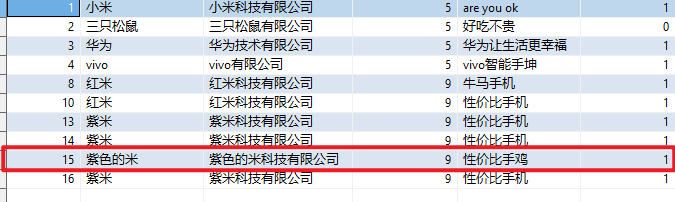 

如果

```xml
    int update(Brand brand);
```

并且

```java
 int count=brandmapper.update(brand);


//dsads
        if(brand!=null)
            System.out.println("修改成功！"+"影响了"+count+"行");
```

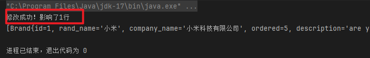 


##### 修改动态字段

实现：用户修改密码的时候，就只需要修改密码就可以了

sql映射修改为

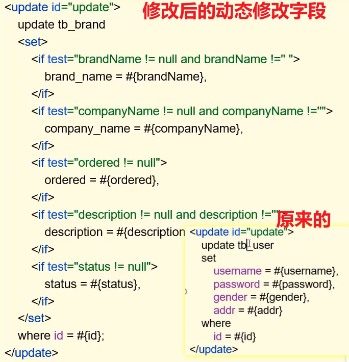 

如果其他属性不设置的时候默认是null

```xml
    <update id="update">
        update tb_brand
        <set>
            <if test="rand_name != null and rand_name!=''">
                rand_name=#{rand_name},
            </if>
            <if test="company_name != null and company_name != ''">
                company_name=#{company_name},
            </if>
            <if test="ordered != null">
                ordered=#{ordered},
            </if>
            <if test="description != null and description != ''">
                description=#{description},
            </if>
            <if test="status != null">
                status=#{status}
            </if>
        </set>
        where id=#{id};

    </update>
```

现在会有一个问题，如果用户没有提供status，是null，那么就会造成 前面的数据,null

这样必然要报错啊，所以我们用高级的mybatis提供的<set\>标签

这样就能动态的处理`，`的问题了

注意最后的` where id=#{id};`没有被set标签包裹

代码演示:!

实现修改局部字段，用户传递什么就修改什么！

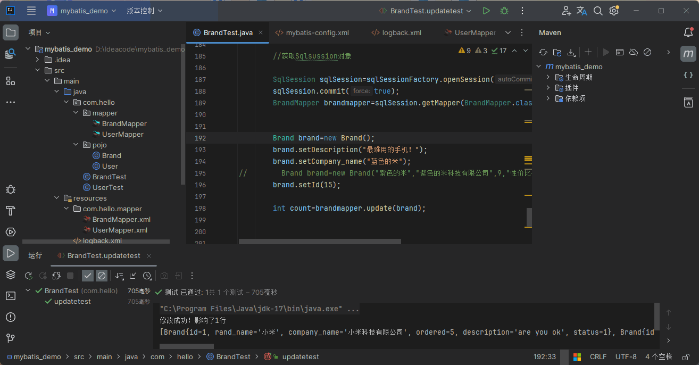

#### 查

##### 1查询所有数据

BrandMapper接口

```java
package com.hello.mapper;

import com.hello.pojo.Brand;

import java.util.List;

public interface BrandMapper {
    List<Brand> selectall();
}

```

SQL映射文件

```xml
<?xml version="1.0" encoding="UTF-8" ?>
<!DOCTYPE mapper
        PUBLIC "-//mybatis.org//DTD Mapper 3.0//EN"
        "https://mybatis.org/dtd/mybatis-3-mapper.dtd">


<!--命名空间随便-->
<!--现在要用Mapper接口的全限定名-->
<mapper namespace="com.hello.mapper.BrandMapper">


    <select id="selectall" resultType="com.hello.pojo.Brand">
        select * from tb_brand;
    </select>
</mapper>
```

BrandTest.java

```java
package com.hello;

//import com.hello.mapper.UserMapper;
import com.hello.mapper.BrandMapper;
import com.hello.pojo.Brand;
import org.apache.ibatis.io.Resources;
import org.apache.ibatis.session.SqlSession;
import org.apache.ibatis.session.SqlSessionFactory;
import org.apache.ibatis.session.SqlSessionFactoryBuilder;

import java.io.IOException;
import java.io.InputStream;
import java.util.List;

public class BrandTest {
    public static void main(String[] args) throws IOException {
        //加载mybatis的核心配置文件，获取
        String resource = "mybatis-config.xml";
        InputStream inputStream = Resources.getResourceAsStream(resource);
        SqlSessionFactory sqlSessionFactory = new SqlSessionFactoryBuilder().build(inputStream);


        //获取Sqlsussion对象
        SqlSession sqlSession=sqlSessionFactory.openSession();


        BrandMapper brandmapper=sqlSession.getMapper(BrandMapper.class);


        //执行SQL
//        List<User> users=sqlSession.selectList("test.selectall");
//        List<User> users=usermapper.selectall();
        List<Brand> brands=brandmapper.brandselectall();


        //打印结果

        System.out.println(brands);

        //清理资源

        sqlSession.close();
        System.out.println(System.getProperty("user.dir"));
    }
}

```

mybatis配置文件xml

```xml
<?xml version="1.0" encoding="UTF-8" ?>
<!DOCTYPE configuration
        PUBLIC "-//mybatis.org//DTD Config 3.0//EN"
        "https://mybatis.org/dtd/mybatis-3-config.dtd">
<configuration>

    <!--这样就能把所有实体类都起了别名，现在是类名不区分大小了，也不用带包名。
    而且还要放在上面-->
    <typeAliases>
        <package name="com.hello.pojo"/>
    </typeAliases>


    <environments default="development">
        <environment id="development">
            <transactionManager type="JDBC"/>

<!--            数据库的连接信息-->
            <dataSource type="POOLED">
                <property name="driver" value="com.mysql.cj.jdbc.Driver"/>
                <property name="url" value="jdbc:mysql:///db"/>
                <property name="username" value="root"/>
                <property name="password" value="xurunbo"/>
            </dataSource>


        </environment>

    </environments>


<!--    加载SQl的映射文件-->
    <mappers>
<!--        <mapper resource="com/hello/mapper/UserMapper.xml"/>-->

<!--        这样就可以同时加载很多很多个映射sql-->
        <package name="com/hello/mapper"/>
<!--        <mapper resource="com/hello/mapper/BrandMapper.xml"/>-->
    </mappers>
</configuration>
```

效果

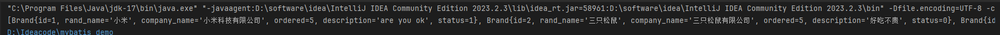 


不同命名空间的selectall是不一样的

##### 注意

数据库表的字段和实体类的属性名称不同的时候就不能自动封装数据

1. 起别名

    现在实体类的命名是驼峰，数据库是_

   如何实现封装数据？

   缺点:每次查询都定义别名

   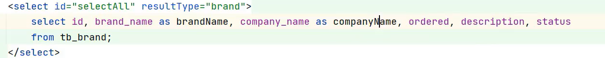

2. SQL片段 

   防止

   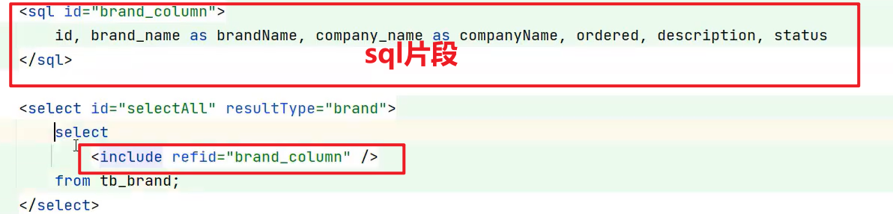

3. ResultMap

   映射别名

   > id:唯一标识
   >
   > type ：映射的别名，支持别名
   >
   > ---
   >
   > id的子标签====完成**主键字段**的映射
   >
   >  	column:是表的列名
   >
   > ​	property：实体类的属性名
   >
   >  
   >
   > result的子标签======完成**一般字段**的映射
   >
   > ​	column:是表的列名
   >
   > ​	property：实体类的属性名

   

   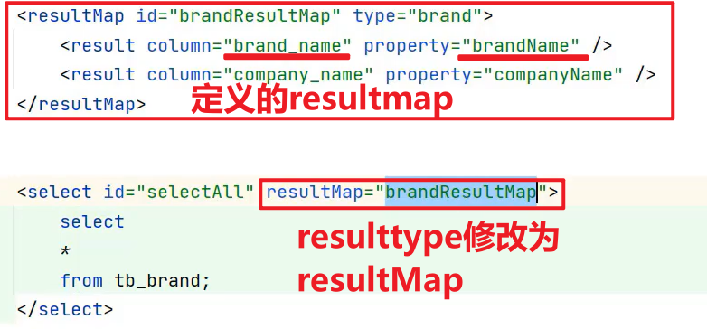 

    

##### 2查看详情

> 根据前端传来的id
>
> 进行select
>
> 然后返回Brand对象的信息

Sql映射文件添加

```xml
<select id="selectById" resultType="com.hello.pojo.Brand">
    select * from tb_brand where id=#{i};
</select>
```

对应BrandMapper接口添加方法

```java
    Brand selectById(int i);
```

然后对应的测试方法

```java
    public static void main(String[] args) throws IOException {
        //加载mybatis的核心配置文件，获取
        String resource = "mybatis-config.xml";
        InputStream inputStream = Resources.getResourceAsStream(resource);
        SqlSessionFactory sqlSessionFactory = new SqlSessionFactoryBuilder().build(inputStream);
        //获取Sqlsussion对象
        SqlSession sqlSession=sqlSessionFactory.openSession();
        BrandMapper brandmapper=sqlSession.getMapper(BrandMapper.class);
        Brand brand=brandmapper.selectById(1);
        //打印结果
        System.out.println("查询的信息是:\n"+brand);
        //清理资源
        sqlSession.close();
        System.out.println(System.getProperty("user.dir"));
    }
```

代码效果

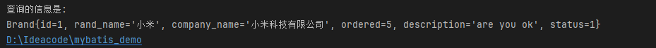

##### 注意

使用import org.junit.Test;

```java
package com.hello;

//import com.hello.mapper.UserMapper;
import com.hello.mapper.BrandMapper;
import com.hello.pojo.Brand;
import org.apache.ibatis.io.Resources;
import org.apache.ibatis.session.SqlSession;
import org.apache.ibatis.session.SqlSessionFactory;
import org.apache.ibatis.session.SqlSessionFactoryBuilder;
import org.junit.Test;

import java.io.IOException;
import java.io.InputStream;
import java.util.List;

public class BrandTest {


    @Test
    public  void test() throws IOException {
        //加载mybatis的核心配置文件，获取
        String resource = "mybatis-config.xml";
        InputStream inputStream = Resources.getResourceAsStream(resource);
        SqlSessionFactory sqlSessionFactory = new SqlSessionFactoryBuilder().build(inputStream);


        //获取Sqlsussion对象
        SqlSession sqlSession=sqlSessionFactory.openSession();


        BrandMapper brandmapper=sqlSession.getMapper(BrandMapper.class);


        //执行SQL
//        List<User> users=sqlSession.selectList("test.selectall");
//        List<User> users=usermapper.selectall();
        List<Brand> brands=brandmapper.selectall();

        //打印结果

        System.out.println(brands);

        //清理资源

        sqlSession.close();
        System.out.println(System.getProperty("user.dir"));
    }

    @Test
    public  void selectbyid() throws IOException {
        //加载mybatis的核心配置文件，获取
        String resource = "mybatis-config.xml";
        InputStream inputStream = Resources.getResourceAsStream(resource);
        SqlSessionFactory sqlSessionFactory = new SqlSessionFactoryBuilder().build(inputStream);


        //获取Sqlsussion对象
        SqlSession sqlSession=sqlSessionFactory.openSession();


        BrandMapper brandmapper=sqlSession.getMapper(BrandMapper.class);


        //执行SQL
//        List<User> users=sqlSession.selectList("test.selectall");
//        List<User> users=usermapper.selectall();
        List<Brand> brands=brandmapper.selectall();
        Brand brand=brandmapper.selectById(1);

        //打印结果
        System.out.println("查询的信息是:\n"+brand);

//        System.out.println(brands);

        //清理资源

        sqlSession.close();
        System.out.println(System.getProperty("user.dir"));
    }
}

```

1. 去掉static和args参数的声明

> 参数占位符
>
> #{}会将其替换为?  preparestatement,为了防止sql注入
>
> ${} ：拼SQl，会存在SQL注入问题,表名或者列名不固定的情况下
>
> 所以参数传递肯定用#{};安全！
>
> 用到拼字符串的时候采用${},也很少用
>
> ##########################################################################
>
> 特殊字符处理
>
> `&lt;`就i会变成<
>
> 或者 CDATA区:，内的符号会当作纯文本！
>
> 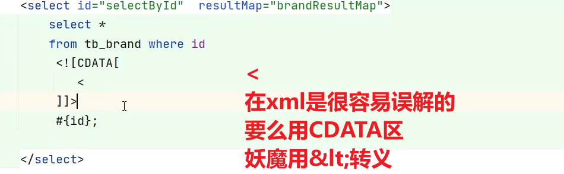
>
> 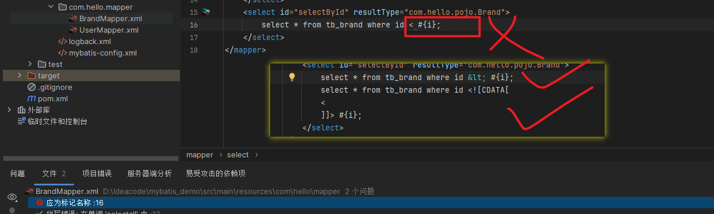  

##### <a name="条件查询">条件查询</a> 

> 三个条件，企业名称，品牌名称，当前状态是启动的
>
> 如何连接起来这三个条件？(模糊查询)
>
> select * from tb_brand  where status = ? and companyName like ? and bradName like ?;
>
> [如何接受多个参数？？？](#接收多个参数)

代码实现:三种实现

Test.java

```java

    @Test
    public  void selectbyCondition() throws IOException {
        //加载mybatis的核心配置文件，获取
        String resource = "mybatis-config.xml";
        InputStream inputStream = Resources.getResourceAsStream(resource);
        SqlSessionFactory sqlSessionFactory = new SqlSessionFactoryBuilder().build(inputStream);

        //获取Sqlsussion对象
        SqlSession sqlSession=sqlSessionFactory.openSession();
        BrandMapper brandmapper=sqlSession.getMapper(BrandMapper.class);

        int status=1;
        String companyName="小米";
        String brandName="小米";

//        数据处理
        companyName="%"+companyName+"%";
        brandName ="%"+brandName+"%";

        Brand brand=new Brand();
        brand.setStatus(1);
        brand.setCompany_name("%小米%");
        brand.setRand_name("%小米%");


        Map map=new HashMap();
        map.put("status",1);
        map.put("company_name","%小米%");
        map.put("rand_name","%小米%");
//        用注解实现11111111111
        List<Brand> brands= brandmapper.selectByCondition(status,companyName,brandName);
//        List<Brand> brands= brandmapper.selectByCondition(1,"%小米%","%小米%");

//        用对象实现222222222222
        List<Brand> brands1=brandmapper.selectByCondition1(brand);

//        用map实现3333333333333
        List<Brand> brands2=brandmapper.selectByCondition2(map);

        //打印结果
        System.out.println("查询的信息是:\n"+brands);
        System.out.println("查询的信息是:\n"+brands1);
        System.out.println("查询的信息是:\n"+brands2);

//        System.out.println(brands);

        //清理资源

        sqlSession.close();
        System.out.println(System.getProperty("user.dir"));
    }
}

```

sql映射文件

```xml
<?xml version="1.0" encoding="UTF-8" ?>
<!DOCTYPE mapper
        PUBLIC "-//mybatis.org//DTD Mapper 3.0//EN"
        "https://mybatis.org/dtd/mybatis-3-mapper.dtd">


<!--命名空间随便-->
<!--现在要用Mapper接口的全限定名-->
<mapper namespace="com.hello.mapper.BrandMapper">


    <select id="selectall" resultType="com.hello.pojo.Brand">
        select * from tb_brand;
    </select>
    <select id="selectById" resultType="com.hello.pojo.Brand">
        select * from tb_brand where id = #{i};
<!--        select * from tb_brand where id <![CDATA[-->
<!--        <-->
<!--        ]]> #{i};-->
    </select>

    <select id="selectByCondition" resultType="com.hello.pojo.Brand">
        select * from tb_brand where status = #{status} and company_Name like #{companyName} and rand_Name like #{brandName};
    </select>

    <select id="selectByCondition1" resultType="com.hello.pojo.Brand">
        select * from tb_brand where status = #{status} and company_Name like #{company_name} and rand_Name like #{rand_name};
    </select>

    <select id="selectByCondition2" resultType="com.hello.pojo.Brand">
        select * from tb_brand where status = #{status} and company_Name like #{company_name} and rand_Name like #{rand_name};
    </select>


</mapper>
```

brandMapper接口

```java
package com.hello.mapper;

import com.hello.pojo.Brand;
import org.apache.ibatis.annotations.Param;

import java.util.List;
import java.util.Map;

public interface BrandMapper {
    List<Brand> selectall();

    Brand selectById(int i);


    List<Brand>selectByCondition(@Param("status")int status, @Param("companyName")String companyName, @Param("brandName") String brandName);

    List<Brand>selectByCondition1(Brand brand);

    List<Brand>selectByCondition2(Map map);
}

```


##### 注意

```java
select * from tb_brand where status = #{status} and company_Name like #{company_name} and rand_Name like #{rand_name};
```

> 传入对象的时候，它内部会调用get方法，我们要保证{}里面的数据有对应的get方法就可以了
>
> 传入map的时候也一样，要保证{}里面的字符串和键要对应

[但是现在的条件查询还存在bug，用户不一定把三个条件都写，只写一个？怎么办?](#解决条件查询)


## Mybatis参数传递

MyBatis接口方法中可以接收各种各样的参数，MyBatis底层对于这些参数进行不同的封装处理方式

单个参数：

1.POJO类型：

2.Map集合:

3.Collection:

4.List:

5.Array:

6.其他类型：

==**MyBatis提供了ParamNameResolver类来进行参数封装**==

### 多个参数的封装


#### param是如何传递的

[条件查询](#条件查询)

SQL映射

```xml
    <select id="selectByCondition" resultType="com.hello.pojo.Brand">
        select * from tb_brand where status = #{status} and company_Name like #{companyName} and rand_Name like #{brandName};
    </select>
```

Mapper接口

```java
    List<Brand>selectByCondition(@Param("status")int status, @Param("companyName")String companyName, @Param("brandName") String brandName);
```

java测试代码

```java
List<Brand> brands= brandmapper.selectByCondition(status,companyName,brandName);
```

 

其实是

> `    List<Brand>selectByCondition(@Param("status")int status, @Param("companyName")String companyName, @Param("brandName") String brandName);`
>
> 多个参数：封装为Map集合map.put（"argo"，参数值1） ：==**使用@Param注解就是替换那些默认的键值**==
>
> map.put（"param1"，参数值1）
>
> map.put（"param2"，参数值2)
>
> map.put（"agr1"，参数值1）
>
> map.put（"agr2"，参数值2）
>
> 》》

原理：CTRL+SHIFT+n查找类

源码调试 

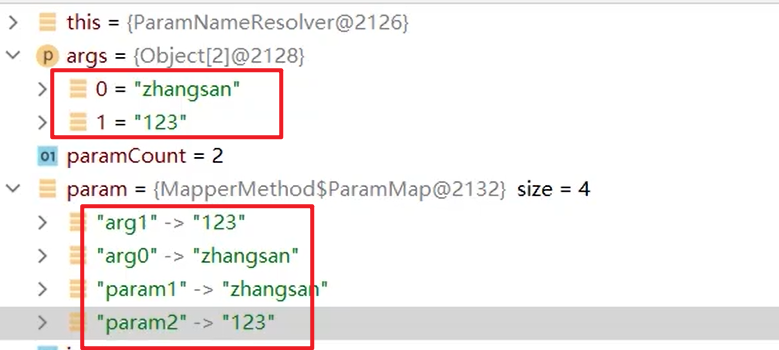 

[参数传递_哔哩哔哩_bilibili](https://www.bilibili.com/video/BV1Qf4y1T7Hx?p=59&vd_source=45cf0df1cf29fd12377b442a74b95876)

### 单个参数的传递

1.POJO类型： 》直接使用 保证 属性名 和 参数占位符一致

2.Map集合:   》 直接使用 保证 键名 和 参数占位符一致

3.Collection：封装为Map集合

​		map.put("argo",collection集合);

​		map.put("collection",collection集合);

4.List：封装为Map集合

​		map.put("argo",List集合);

​		map.put("collection",list集合);map.put（"list",List集合）；

5.Array：封装为Map集合

​		map.put("argo"，数组);

​		map.put（"array"，数组);

6.其他类型：直接使用，无所谓，sql里面写什么都ok，形参罢了 

结论，最终！我们用@Param注解！

》》》

> ==**建议：将来都使用@Param注解来修改Map集合中默认的键名，并使用修改后的名称来获取值，这样可读性更高！**==

### ==注解开发==

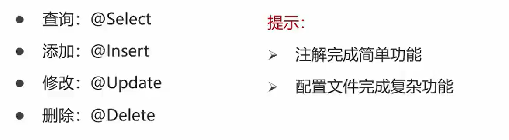 

原来的Mapper写一个方法

然后sql映射文件再写对应的sql

现在直接写在Mapper接口里

```java
    @Select("select * from tb_brand;")
    List<Brand> selectall();
```

> 一些简单的要求可以用注解开发
>
> 但是对于稍微复杂的sql
>
> 》》》官方回答
>
> > 使用注解来映射简单语句会使代码显得更加简洁，但对于稍微复杂一点的语句，Java注解不仅力不从心，还会让你本就复杂的 SQL语句更加混乱不堪。
> >
> > **因此，如果你需要做一些很复杂的操作，最好用XML来映射语句。**
> >
> > 选择何种方式来配置映射，以及认为是否应该要统一映射语句定义的形式，完全取决于你和你的团队。换句话说，永远不要拘泥于一种方式，你可以很轻松的在基于注解和XML的语句映射方式间自由移植和切换。


## [动态SQL](#解决条件查询)

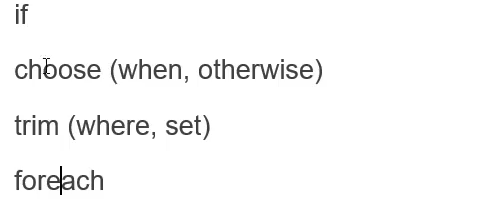 

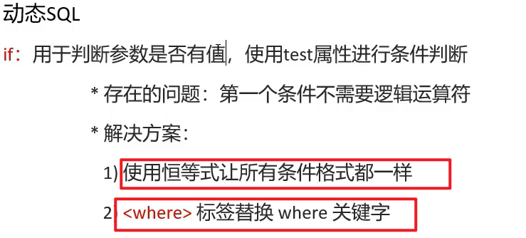 

### 单条件动态查询

choose:switch

when:case

otherwise : default

**只会有一个生效**

```xml
    <select id="selectByCondition2" resultType="com.hello.pojo.Brand">
        select *
        from tb_brand
        where
        <choose>
            <when test="status != null">
                status = #{status}
            </when>
        </choose>
        <choose>
            <when test="company_name != null and company_name!='' ">
                company_Name like #{company_name}
            </when>
        </choose>
        <choose>
            <when test="rand_name != null and rand_name!='' ">
                rand_Name like #{rand_name}
            </when>
        </choose>
        <-- 保证语法正常，当用户什么都不传入的时候</-->
        <otherwise>
            1= 1
        </otherwise>
    </select>
```

最后还是用<where\>自动帮我们修改语法多余的where

```xml
<select id="selectByCondition2" resultType="com.hello.pojo.Brand">
    select *
    from tb_brand
    <where>
            <choose>
            <when test="status != null">
                status = #{status}
            </when>
        </choose>
        <choose>
            <when test="company_name != null and company_name!='' ">
                company_Name like #{company_name}
            </when>
        </choose>
        <choose>
            <when test="rand_name != null and rand_name!='' ">
                rand_Name like #{rand_name}
            </when>
        </choose>
    </where>
    <-- 保证语法正常，当用户什么都不传入的时候</-->
</select>
```


# 问题


## <a name="接收多个参数">接收参数的问题</a>

1. 用**注解的方式**来标注-(散装参数)

   `List<Brand>selectByCondition(@Param("status")int status,@Param("companyName") StringcompanyName,@Param("brandName") String brandName);`

   对于sql映射文件：

   这样就知道传入的参数对应哪一个占位符了

   status穿来的参数status，一一对应

2. 利用对象组装参数

   `List<Brand>selectByCondition(Brand brand);`

   然后就在对象里面用get方法拿到对应的参数

3. 封装为map集合

   `List<Brand>selectByCondition(Map map);`

   map集合的键的名称和参数保持一致就好了


## <a name="解决条件查询">解决条件查询</a>

动态sql

 

用map演示

sql映射文件.xml

```xml
    <select id="selectByCondition2" resultType="com.hello.pojo.Brand">
        select *
        from tb_brand
        where
        <if test="status != null">
            status = #{status}
        </if>
        <if test="company_name != null and company_name!=''">
            and company_Name like #{company_name}
        </if>
        <if test="rand_name != null and rand_name!=''">
            and rand_Name like #{rand_name};
        </if>
    </select>
```


接口不变

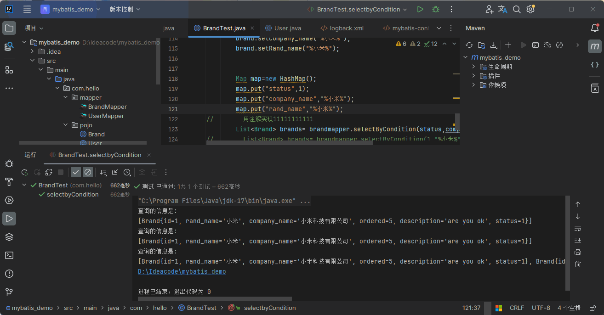

但是也有点小bug,==因为第一个条件不需要逻辑运算符==

最终解决问题

```xml
    <select id="selectByCondition2" resultType="com.hello.pojo.Brand">
        select *
        from tb_brand
        where
        <choose>
            <when test="status != null">
                status = #{status}
            </when>
            <otherwise>
                1=1
            </otherwise>
        </choose>
        <choose>
            <when test="company_name != null and company_name!='' ">
                and company_Name like #{company_name}
            </when>
            <otherwise>
                and 1=1
            </otherwise>
        </choose>
        <choose>
            <when test="rand_name != null and rand_name!='' ">
                and rand_Name like #{rand_name}
            </when>
            <otherwise>
                and 1=1
            </otherwise>
        </choose>
    </select>
```

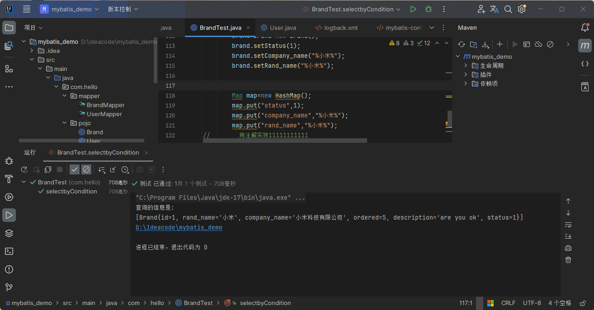

因为null被当作0，然后0 and 1也是0，所以就报错了。。。现在让如果是null的时候不执行数据但是是1让继续下一句.

```xml
    <select id="selectByCondition2" resultType="com.hello.pojo.Brand">
        select *
        from tb_brand
        where 1 = 1
        <if test="status != null">
            and status = #{status}
        </if>
        <if test="company_name != null and company_name!='' ">
            and company_Name like #{company_name}
        </if>
        <if test="rand_name != null and rand_name!='' ">
            and rand_Name like #{rand_name};
        </if>
    </select>
```


这一种用的最多，用mybatis提供的<wherere标签>

会根据用户提供的惨呼，如果只有一个会智能的去掉and

所以只需要全部加and 并且用<where\>就可以了

```xml
    <select id="selectByCondition2" resultType="com.hello.pojo.Brand">
        select *
        from tb_brand
        <where>
        <if test="status != null">
            and status = #{status}
        </if>
        <if test="company_name != null and company_name!='' ">
            and company_Name like #{company_name}
        </if>
        <if test="rand_name != null and rand_name!='' ">
            and rand_Name like #{rand_name};
        </if>
        </where>

    </select>
```

 
