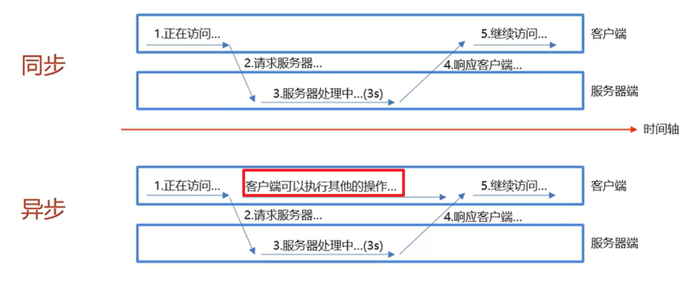
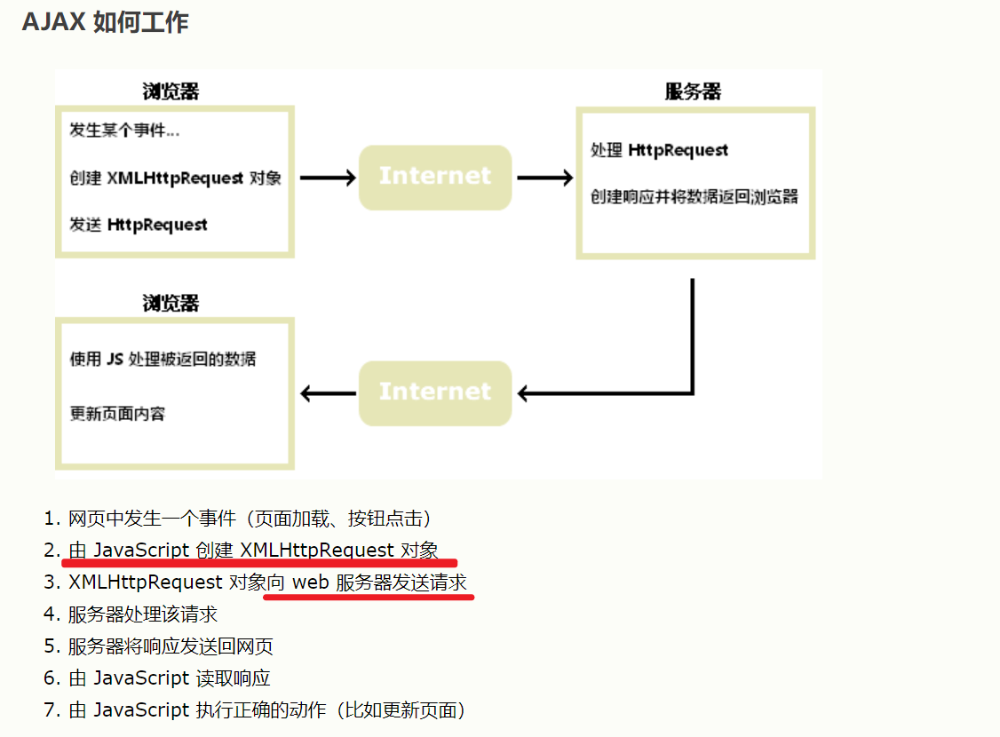
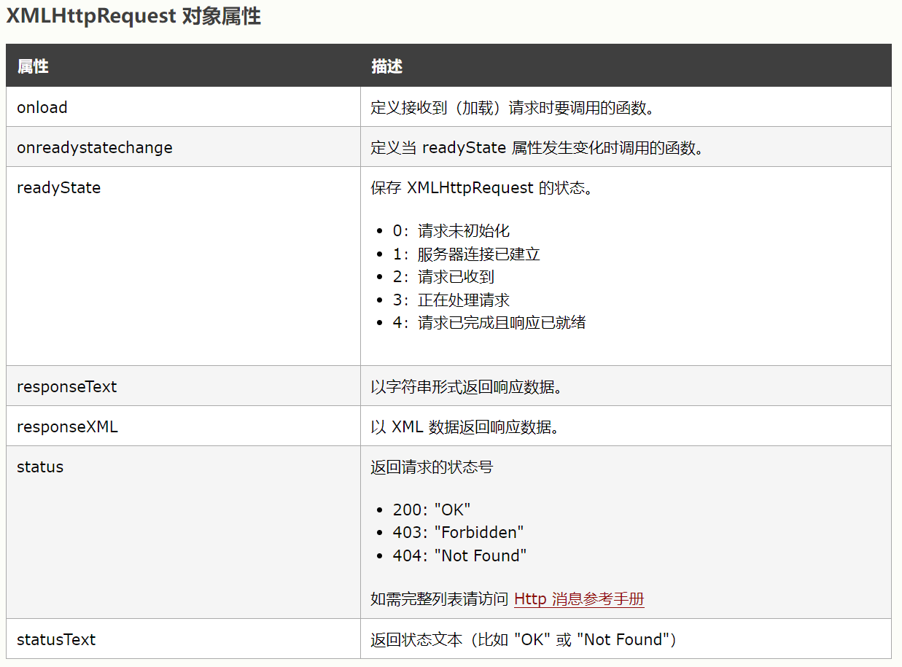
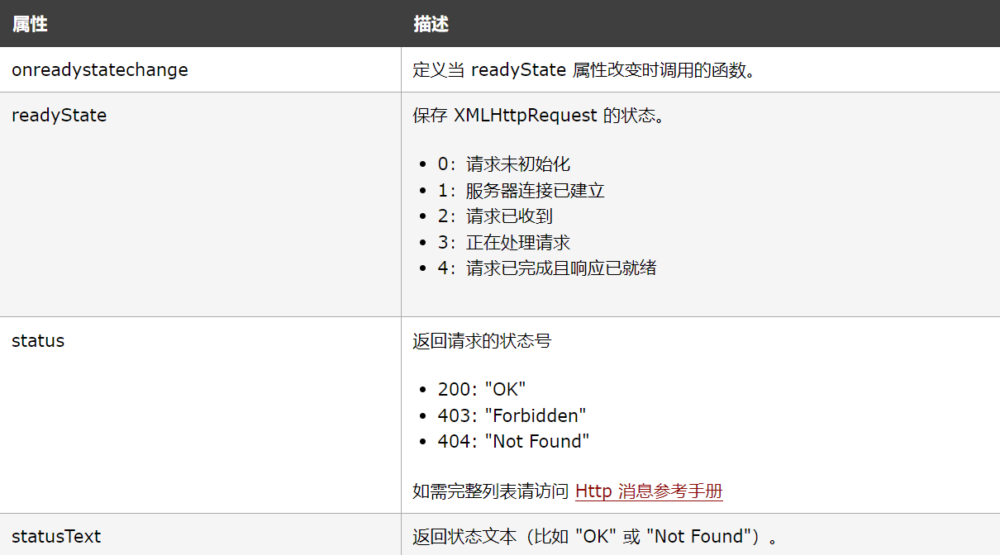
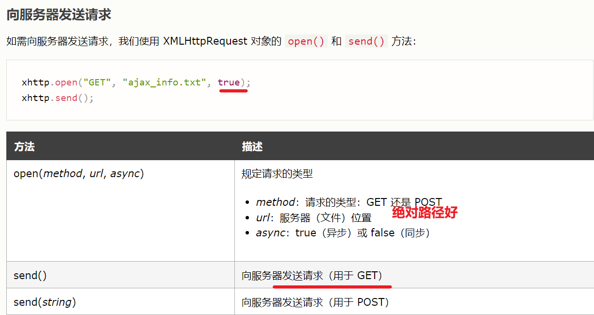
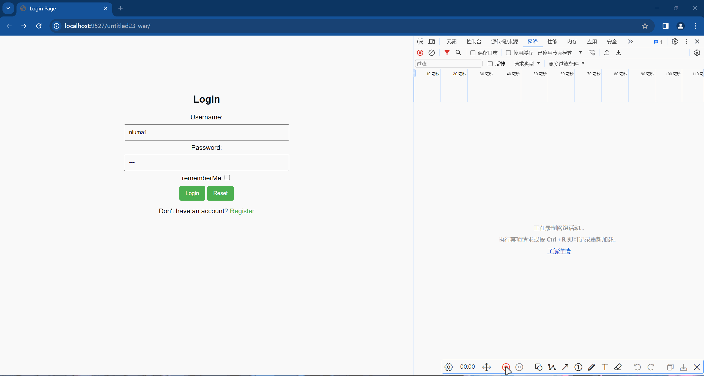
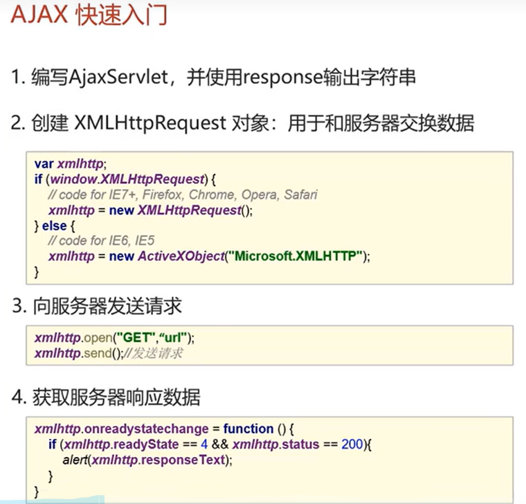

# AJAX


## 简介

> AJAX（Asynchronous JavaScript and XML）是一种**使用 JavaScript 和 XML（现在更常用 JSON）**来**创建异步请求**、**无需刷新页面即可更新内容**的网页开发技术。它通过在**后台与服务器进行数据交换**，**实现部分更新页面而无需重新加载整个页面的操作。**

概念：异步的Javascript和xml

作用:使用**AJAX和服务器进行数据交换**，通过**AJAX可以给服务器发送请求，并获取服务器响应的数据**

所以就**可以用HTML+AJAX来替换JSP页面了**


Ajax 允许通过与场景后面的 Web 服务器交换数据来异步更新网页。这意味着可以更新网页的部分，而不需要重新加载整个页面。


## 存在的意义

主流是分工，JSP是交给后端写的，现在可以ajax交给前端

异步交互：可以再不重新加载整个页面的情况下，与服务器进行数据交换并**更新部分网页**的技术	


## 比较

之前是把整个注册页面写完提交了才能去验证写的规范不规范，


## 同步和异步

 

就是同步请求会刷新浏览器，异步不会刷新浏览器也不用去等待服务端的处理

异步请求相当于悄悄的做，还可以在响应的时间段做其他事情。

## AJAX如何工作

 


## AJAX的核心对象

### XMLHttpRequest 对象

**XMLHttpRequest 对象是 AJAX 的基石。**

1. 创建 XMLHttpRequest 对象
2. 定义回调函数
3. 打开 XMLHttpRequest 对象
4. 向服务器发送请求

所有现代浏览器都支持 *XMLHttpRequest 对象*。

XMLHttpRequest 对象可用于在**后台与 Web 服务器交换数据**。这意味着可**以更新网页的部分内容，而无需重新加载整个页面。**

### XMLHttpRequest常用的方法

| 方法                    | 描述                           |
| :---------------------- | :----------------------------- |
| new XMLHttpRequest()    | 创建新的 XMLHttpRequest 对象。 |
| abort()                 | 取消当前请求。                 |
| getAllResponseHeaders() | 返回头部信息。                 |
| getResponseHeader()     | 返回特定的头部信息。           |
| send()             | 向服务器发送请求，用于 GET 请求。  |
| 更多操作status | 返回请求的状态号200: "OK"403: "Forbidden"404: "Not Found" |
| send(string)       | 向服务器发送请求，用于 POST 请求。 |
| setRequestHeader() | 将标签/值对添加到要发送的标头。    |

### XMLHttpRequest 对象属性




#### onload 属性

> 定义接收到（加载）请求时要调用的函数。

使用 XMLHttpRequest 对象时，您可以定义一个回调函数，以便在请求收到答复时执行。

请在 XMLHttpRequest 对象的 `onload` 属性中定义该函数：


先创建对象

```js
xhttp.onload = function() {
  document.getElementById("demo").innerHTML = this.responseText;
}

xhttp.open("GET", "ajax_info.txt");
xhttp.send();
```


#### onreadystatechange 属性

> 定义当 readyState 属性发生变化时调用的函数。

`readyState` 属性保存 XMLHttpRequest 的状态。

`onreadystatechange` 属性定义了一个回调函数，当 readyState 改变时执行该函数。

`status` 属性和 `statusText` 属性保存 XMLHttpRequest 对象的状态。

 

每次 readyState 改变时都会调用 onreadystatechange 函数。

当 readyState 为 `4` 且 status 为 `200` 时，响应就绪： 


### 创建 XMLHttpRequest 对象

所有现代浏览器（Chrome、Firefox、IE、Edge、Safari、Opera）都有内置的 *XMLHttpRequest 对象*。

创建 XMLHttpRequest 对象的语法：

```js
variable = new XMLHttpRequest();
```

### 定义回调函数

**回调函数是作为参数传递给另一个函数的函数。**

在这种情况下，回调函数应包含响应准备就绪时要执行的代码。

```js
xhttp.onload = function() {
  // 当响应准备就绪时要做什么
}
```

```js
    xmlhttp.onreadystatechange = function() {
        if (this.readyState == 4 && this.status == 200) {
            document.getElementById("demo").innerHTML =
                alert(this.responseText);
        }
    };
```


### 发送请求

 

如需向服务器发送请求，您可以使用 XMLHttpRequest 对象的 `open()` 和 `send()` 方法：

```js
//发送请求
xmlhttp.open("get","http://localhost:9527/untitled23_war/ajax");
xmlhttp.send();
```

写绝对路径是因为请求可能会涉及到跨域访问的问题。如果请求被发送到了不同的域名或者端口，那么浏览器默认情况下会阻止这种访问，从而导致请求失败


真正做到前后端分离的话就要写绝对路径//要写绝对路径


### 效果



xhr是异步请求


## AJAX的快速入门

 

1. XMLHttpRequest 对象：AJAX 的核心是 XMLHttpRequest 对象，它是在后台与服务器交换数据的关键对象。开发者可以通过它发送 HTTP 请求，并接收服务器返回的数据。在现代浏览器中，也可以使用 fetch API 替代 XMLHttpRequest。
2. 事件驱动型编程：AJAX 是事件驱动型编程，需要通过设置回调函数来处理服务器返回的数据。例如，当 XMLHttpRequest 对象的 readyState 属性发生变化时，就会触发 onreadystatechange 事件，从而执行设置的回调函数。
3. 跨域访问限制：由于安全原因，浏览器限制了 AJAX 请求只能访问同源的资源。如果需要跨域访问，可以使用 CORS（跨域资源共享）或 JSONP（JSON with Padding）等技术来解决。
4. 使用 jQuery 简化 AJAX：jQuery 提供了简单易用的 AJAX API，可以方便地进行 AJAX 请求，包括设置请求参数、处理响应结果等。


## 案例

## Axios异步框架

## JSON