# Filter


JavaWeb三大组件

> 1. Filter
> 2. Servlet
> 3. Listener

 


## 过滤器Filter

可以把对资源的请求

给拦截下来

从而实现一些特殊的功能

---

过滤器一般完成一些通用的操作，比如：权限控制、统一编码处理、敏感字符处理等等.

权限控制，我们现在的可以直接访问项目下的/index.jsp页面，直接可以去访问数据，我们的登录功能形同虚设。。。

我们的每个资源都要去判断用户是否登录

在过滤器里面去判断用户是否登录


## Filter的快速入门

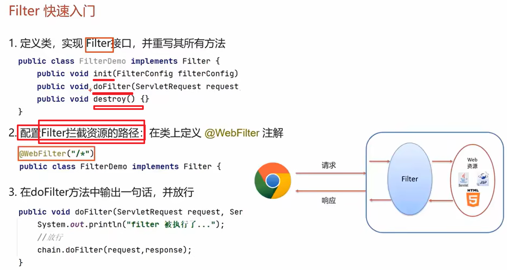

 代码实现

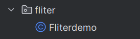 

```java
package com.hello.fliter;


import javax.servlet.*;
import javax.servlet.annotation.WebFilter;

import java.io.IOException;
//配置拦截路径
@WebFilter("/*")
public class Fliterdemo implements Filter {
    @Override
    public void init(FilterConfig filterConfig) throws ServletException {
        System.out.println("过滤器被初始化啦");

    }

    @Override
    public void doFilter(ServletRequest servletRequest, ServletResponse servletResponse, FilterChain filterChain) throws IOException, ServletException {
        //放行前的逻辑
        System.out.println("1");


        //过滤器的内容
        System.out.println("2");

        //放行 ！
        filterChain.doFilter(servletRequest, servletResponse);


        //放行后的逻辑
        System.out.println("3");
    }

    @Override
    public void destroy() {
        System.out.println("过滤器被销毁啦");
    }
}

```

注意导包，然后重写她的所有方法


主要是写doFilter方法

## Filter的使用细节

### Filter的执行流程

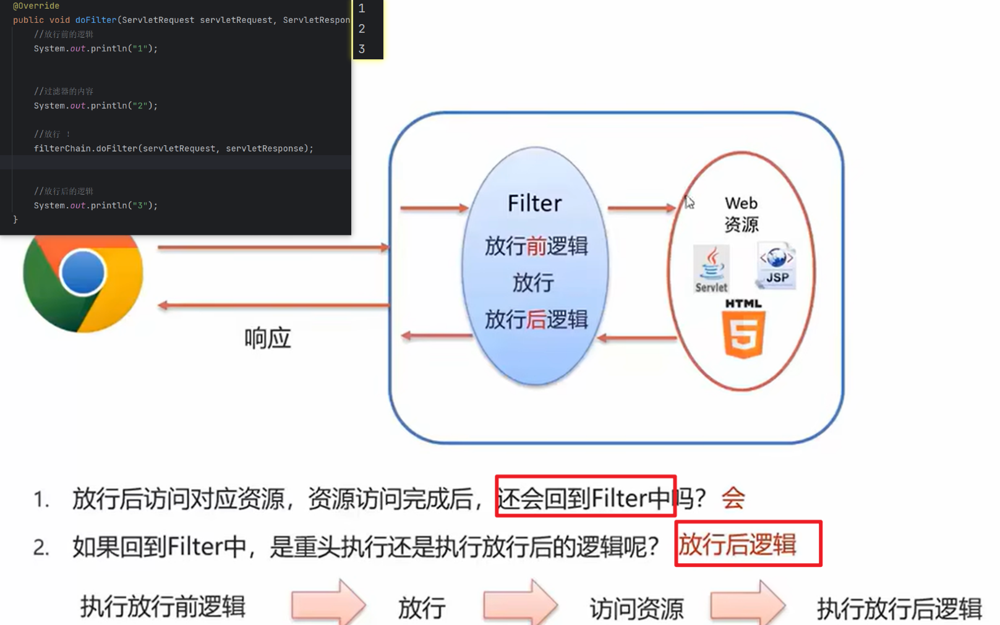 

### Filter拦截路径配置

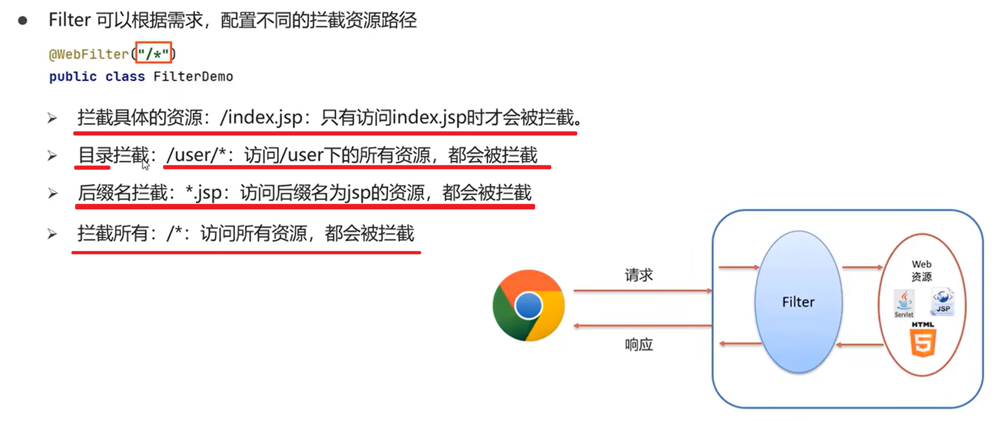 

### 过滤器链

结合拦截路径配置

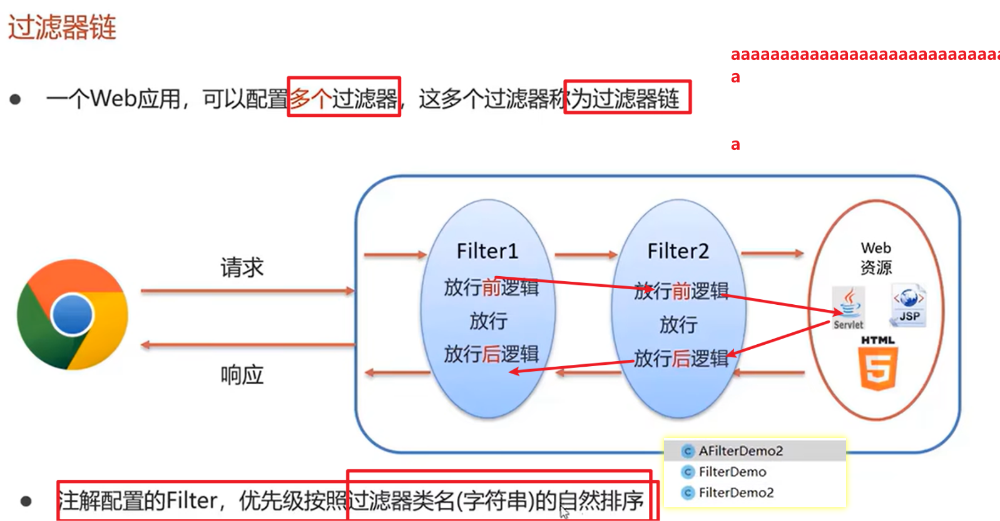   

### Filter的生命周期

---

```java

import javax.servlet.*;
import javax.servlet.annotation.WebFilter;
import java.io.IOException;

@WebFilter("/*") // 注解方式
public class Filter1 implements Filter {
  /*
    * 1. Filter的创建时机是 服务器启动的时候
    * 2. init方法只调用一次，并紧跟构造器方法调用之后
    * 3. doFilter 方法，每次请求都会进入 该方法 ,并且 是在调用service之前，能不能进入service 方法，就要看 doFilter 方法有没有放行
    * 4. destroy 方法，在服务器正常关闭的请情况下，调用
    *
    * */
    // 构造器
   public Filter1 (){
       System.out.println("我是构造器！");
    }
    @Override
    public void init(FilterConfig filterConfig) throws ServletException {
        System.out.println("init()"); // 这个是初始化方法，在服务器启动的时候就会执行

    }

    @Override
    public void doFilter(ServletRequest servletRequest, ServletResponse servletResponse, FilterChain filterChain) throws IOException, ServletException {
        //这个方法就是过滤和拦截的方法，当请求和拦截匹配时调用
        System.out.println("doFilter");

    }

    @Override
    public void destroy() {
       // 这个方法是销毁方法，只有在项目正常关闭的情况下才会执行
        System.out.println("destroy");

    }
}


```

---


#### **初始化方法:**

`public void init(FilterConfig filterConfig);`

和我们编写的Servlet程序一样，==**Filter的创建和销毁由WEB服务器负责**==。

 web 应用程序启动时，web 服务器将创建Filter 的实例对象，并调用其init方法，读取web.xml配置，完成对象的初始化功能，从而为后续的用户请求作好拦截的准备工作

（filter对象只会创建一次，init方法也只会执行一次）。

开发人员通过init方法的参数，可获得代表当前filter配置信息的FilterConfig对象。


#### **拦截请求方法**

`public void doFilter`

这个方法完成实际的过滤操作。**当客户请求访问与过滤器关联的URL的时候，Servlet过滤器将先执行doFilter方法。****FilterChain参数用于访问后续过滤器**。

---

例如过滤后的放行行为

```java
//放行 ！
filterChain.doFilter(servletRequest, servletResponse);
```


#### **销毁方法**

`public void destroy();`

Filter对象创建后会驻留在内存，当**web应用移除或服务器停止时才销毁。**在Web容器卸载 Filter 对象之前被调用。**该方法在Filter的生命周期中仅执行一次。在这个方法中，可以释放过滤器使用的资源。**


#### FilterConfig

FilterConfig 类见名知义， 它是 **Filter 过滤器的配置文件类。**
Tomcat 每次创建 Filter 的时候， 也会**同时创建一个 FilterConfig 类**， 这里包含了 **Filter 配置文件的配置信息**。
FilterConfig 类的作用是**获取 filter 过滤器的配置内容**
1、 获取 Filter 的名称 filter-name 的内容
2、 获取在 Filter 中配置的 init-param 初始化参数
3、 获取 ServletContext 对象

FilterConfig的四个方法
`getFilterName()：获取filter的名称`
`getServletContext()：获取ServletContext`
`getInitparamter(String var1)：获取配置的初始参数的值`
`getInitParamterNames()：获取配置的所有参数名称`

## 案例


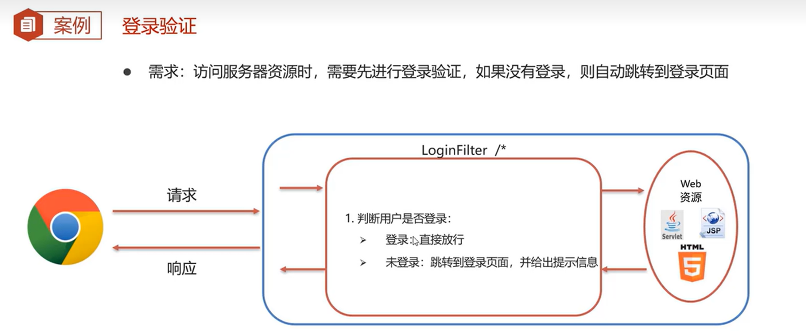


因为我们登陆成功会把用户对象存储倒session里

```java
package com.hello.web.fliter;


import com.hello.pojo.User;
import com.sun.deploy.net.HttpRequest;

import javax.servlet.*;
import javax.servlet.annotation.WebFilter;
import javax.servlet.http.HttpServletRequest;
import javax.servlet.http.HttpSession;

import java.io.IOException;

//配置拦截路径
@WebFilter("/*")
public class Fliterdemo implements Filter {
    @Override
    public void init(FilterConfig filterConfig) throws ServletException {
        System.out.println("过滤器被初始化啦");
    }

    @Override
    public void doFilter(ServletRequest servletRequest, ServletResponse servletResponse, FilterChain filterChain) throws IOException, ServletException {
        //放行前的逻辑判断用户是否登录
        HttpServletRequest req = (HttpServletRequest) servletRequest;
        String [] urls={"/login","/login.jsp","/register","/register.jsp"};
        
        String url=req.getRequestURL().toString();

//        ----
        String test1=req.getRequestURL().toString();
        String test2=req.getRequestURI().toString();
        System.out.println("url是什么"+test1+"\n"+"uri是什么"+test2);
//        url是什么http://localhost:9527/untitled23_war/selectall
//        uri是什么/untitled23_war/selectall
//        ------
        for (String u : urls) {
            if(url.contains(u))
            {
                //这些找到的要被放行
                //放行 ！
                filterChain.doFilter(servletRequest, servletResponse);

                //break结束循环，return结束方法
                return;
            }
        }
        
        //user不能直接拿到那就手动拿


//        iter
        HttpSession session = req.getSession();
        Object object = session.getAttribute("user");

        System.out.println(object);


        if (object != null) {
            System.out.println("登陆成功");
            //放行 ！
            filterChain.doFilter(servletRequest, servletResponse);
        } else {
            System.out.println("登录失败！");
//            拦截下来并且跳转到登陆页面，用到请求转发
            req.setAttribute("login_msg", "您没有登录啊");
            req.getRequestDispatcher("/login.jsp").forward(servletRequest, servletResponse);
        }


    }

    @Override
    public void destroy() {
        System.out.println("过滤器被销毁啦");
    }
}

```

> 跟登录/注册有关的就要让行
>
> iter可以快速迭代
>
> 

代码效果：就是实现登录后才能访问brand.jsp下的数据

不登陆的时候访问任何（除了登录注册以外的）其他资源都会跳转到让你登录

但是我们登录后访问brand.jsp没有设置对应的servlet也没用去selectall数据所以只是空页面

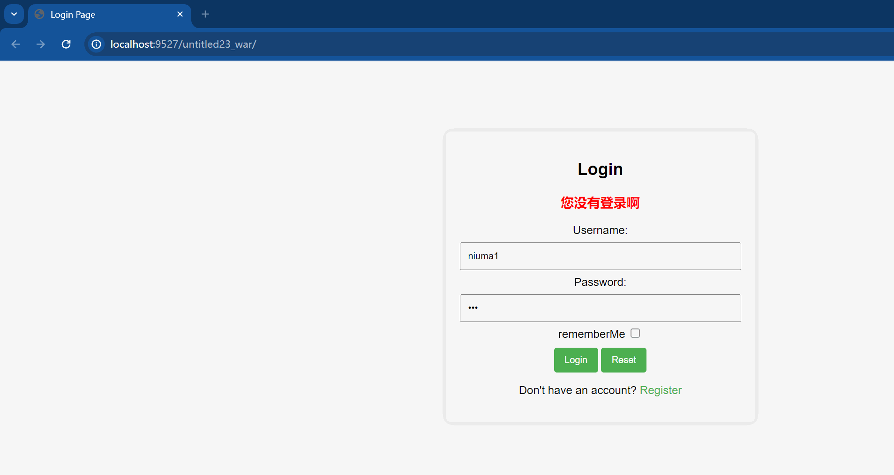

项目结构: 

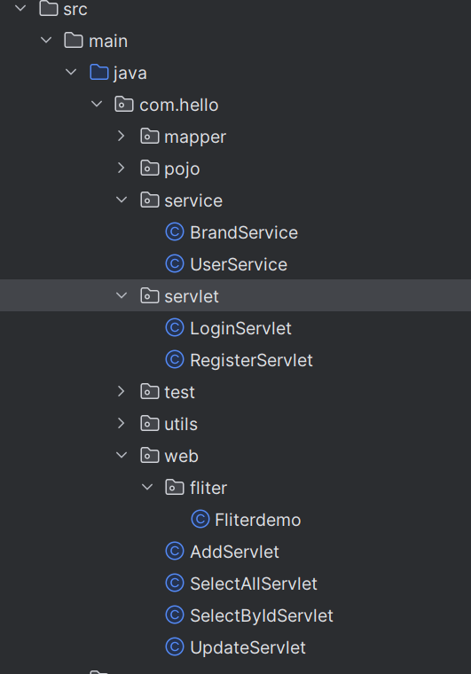 


## Listener

用的并不多

简单介绍

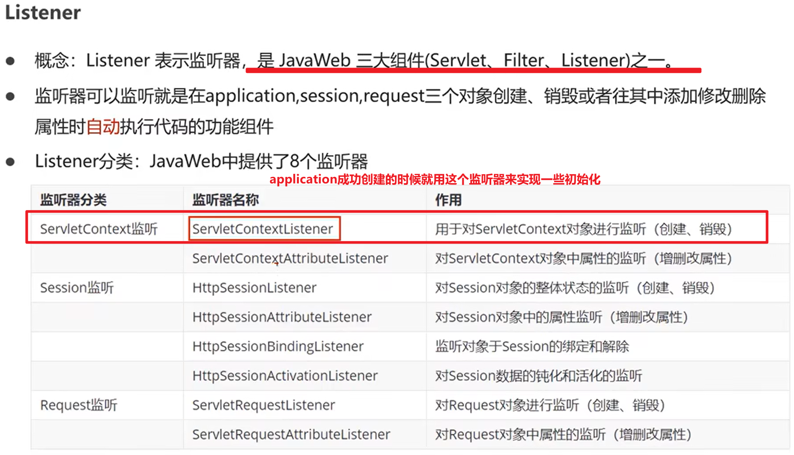 

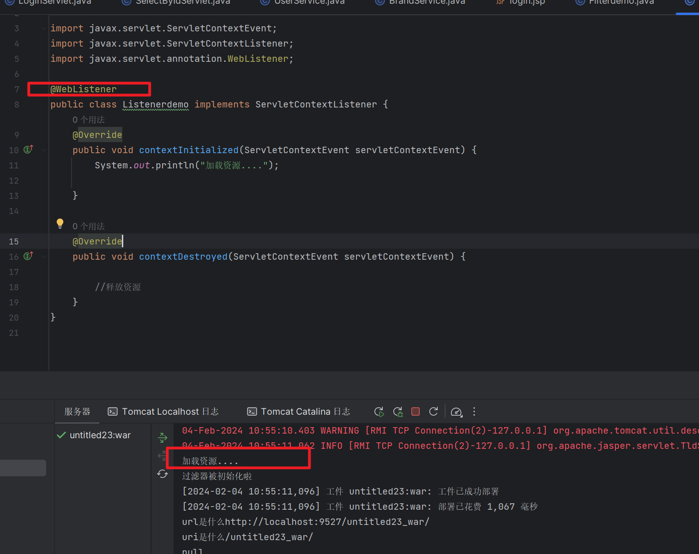 

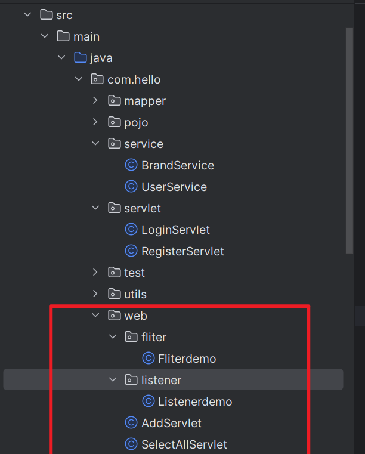 

```java
package com.hello.web.listener;

import javax.servlet.ServletContextEvent;
import javax.servlet.ServletContextListener;
import javax.servlet.annotation.WebListener;

@WebListener
public class Listenerdemo implements ServletContextListener {
    @Override
    public void contextInitialized(ServletContextEvent servletContextEvent) {
        System.out.println("加载资源....");

    }

    @Override
    public void contextDestroyed(ServletContextEvent servletContextEvent) {

        //释放资源
    }
}

```

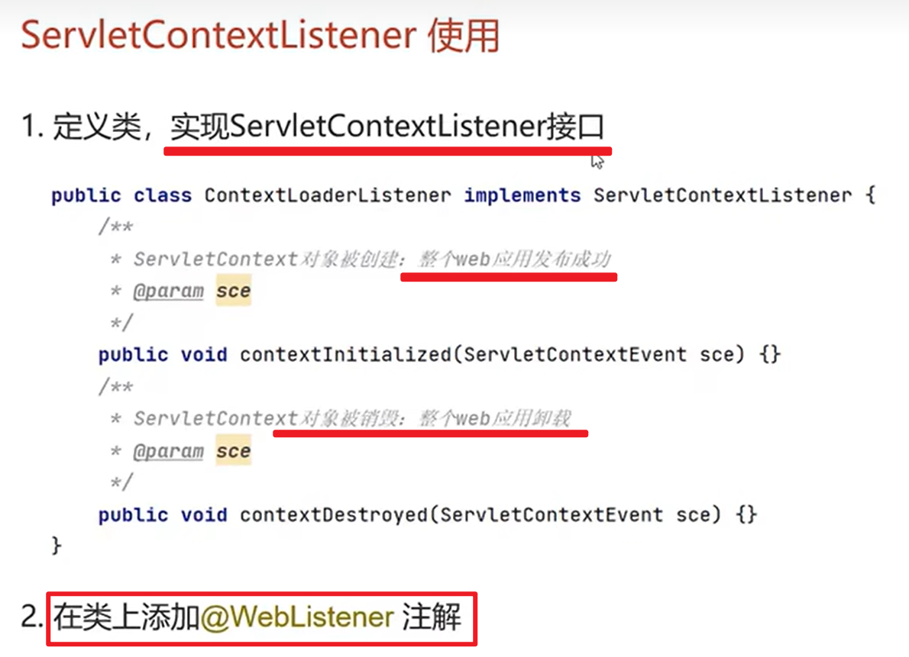 
