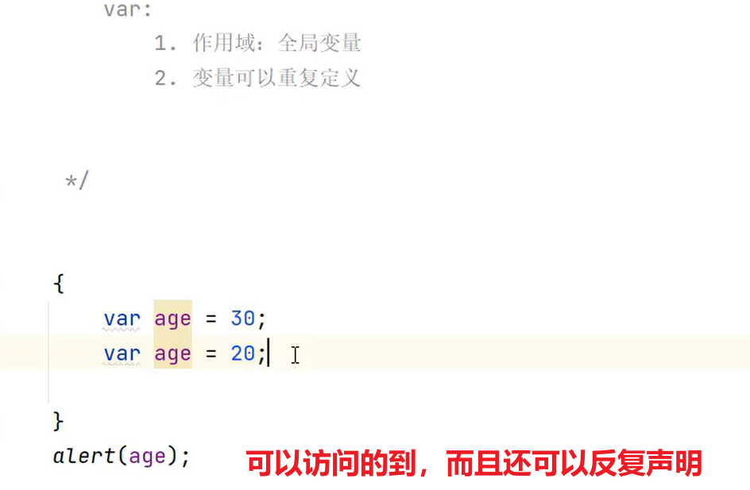
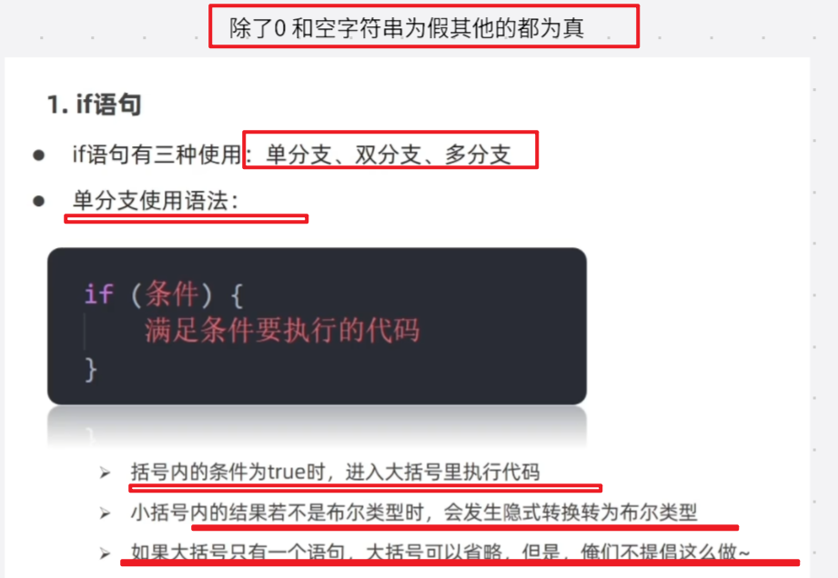
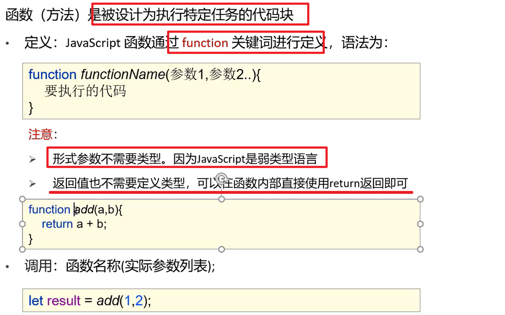

# Javascript快速入土

 

## 什么是javascript

javaScript 是一种脚本编程语言，它可以在网页上实现复杂的功能，网页展现给你的不再是简单的静态信息，而是实时的内容更新——交互式的地图、2D/3D 动画、滚动播放的视频等等——JavaScript 就在其中。

> 结构 ：HTML
>
> 表现 ： CSS
>
> 行为 ：JavaScript

JavaScript和Java是完全不同的语言。

ECMAScrpt是最新的javascript的版本;


## javascript引入方式

### 内部式：

HTML内部嵌入

对于位置和数量没有限制

但是不能放在body里面

推荐放在body下面


```html
<script>
  // 在此编写 JavaScript 代码
</script>
```


### 外部式：

写在js文件里，然后引入。

```html
<script src="script.js" defer></script>
```


## javascript基础语法

### 书写语法

> 去分大小写
>
> 分号有无都可以
>
> 注释:	 
>
> {}代表代码块
>
> 内部

 

外部：

 

嵌入

 


### 输入输出语句

输出语句


window.alert(）警告

document.write()写入html输出

console.log()写入浏览器控制台


==alert和prompt他们会跳过页面渲染鲜卑执行而且啊，prompt优先执行==

### 变量

 



let声明的也就比较严格了。而且不可以重复声明更好接受  

let var

var不用了，会出bug

 

命名方法和规则

 

数组：


常量：

  

### 数据类型

 

 


   


typeof

  

### 运算符

赋值运算符

 

一元运算符

 

比较运算符


逻辑运算符

 

### 运算符优先级

 

 

 

### 类型转换


  

  

 


小结：

   

### 流程控制语句

 

#### 分支语句

 


 

#### 循环语句

 

 

### 函数

 

 


无参函数


      

### 作用域

 

### 数组

  

arry.length获得数组的长度 

类似java的集合，是变长课类型可变的数据，可以自动扩大

 


  

## javascript常用对象

Array数组对象

[JavaScript 数组 (w3school.com.cn)](https://www.w3school.com.cn/js/js_arrays.asp)

String字符串对象

[JavaScript 字符串 (w3school.com.cn)](https://www.w3school.com.cn/js/js_strings.asp) 

Object对象

[JavaScript 对象定义 (w3school.com.cn)](https://www.w3school.com.cn/js/js_object_definition.asp)

 


## DOM

 

### 获取elements！


## BOM

[JavaScript Window - 浏览器对象模型 (w3school.com.cn)](https://www.w3school.com.cn/js/js_window.asp)  


  

 


#### History 


 

**window.location 对象可用于获取当前页面地址（URL）并把浏览器重定向到新页面。** 

 ## Cookie

 [JavaScript Cookies (w3school.com.cn)](https://www.w3school.com.cn/js/js_cookies.asp) 

## 事件监听

[JavaScript 事件 (w3school.com.cn)](https://www.w3school.com.cn/js/js_events.asp) 

 

 


## 表单验证

 

```html
<form id="registerForm" action="" method="get">

    <input type="text" id="Username" placeholder="用户名">
    <span id="wrong1">用户名错误</span>


    <input type="password" id="Password" placeholder="密码">
    <span id="wrong2">密码错误</span>


    <input type="password" id="Phonenum" placeholder="手机号！">
    <span id="wrong3">手机号错误</span>


    <button type="submit">Register</button>
  </form>
```

```javascript

let userinput1=document.getElementById("Username");

let userinput2=document.getElementById("Password");

let userinput3=document.getElementById("Phonenum");
userinput1.onblur=usercheck;

function usercheck(){

    //获取密码
    let name=userinput1.value.trim();
    // alert(name);
    const ip1=document.getElementById("wrong1");
    let flag=name.length>6&&name.length<12;
    if(flag)
    {
        ip1.style.display="none";
    }
    else{
        ip1.style.display="block";
    } 
    return flag;

}


userinput2.onblur=passwordcheck;

function passwordcheck(){

    //获取密码
    let password=userinput2.value.trim();
    // alert(password);
    const ip2=document.getElementById("wrong2");
    let flag=password.length>=6;
    if(flag)
    {
        ip2.style.display="none";
    }
    else{
        ip2.style.display="block";
    } 
    return flag;

}
userinput3.onblur=phonecheck;

function phonecheck(){

    //获取密码
    let phonenum=userinput3.value.trim();
    // alert(phonenum);
    const ip3=document.getElementById("wrong3");
    let flag=phonenum.length==11;
    if(flag)
    {
        ip3.style.display="none";
    }
    else{
        ip3.style.display="block";
    } 
    return flag;

}

let ok=document.getElementById("registerForm");

ok.onsubmit=function(){
    // event.preventDefault();
    let flag=passwordcheck()&&usercheck()&&phonecheck();
    alert("提交成功！")
    return flag;
}
```

