# Javaweb_JDBC

什么是JDBC

> 用java操作数据库的AIPI
>
> JDBC是Java数据库连接（Java Database Connectivity）的缩写，它是一种**用于在Java应用程序和数据库之间建立连接的API（应用程序接口）**。 
>
> JDBC允许**Java应用程序通过标准的数据库访问方式来访问各种数据库**，包括MySQL、Oracle、SQL Server等。通过JDBC，J**ava应用程序可以执行SQL查询、更新数据库记录、存储过程等操作**。

阴图

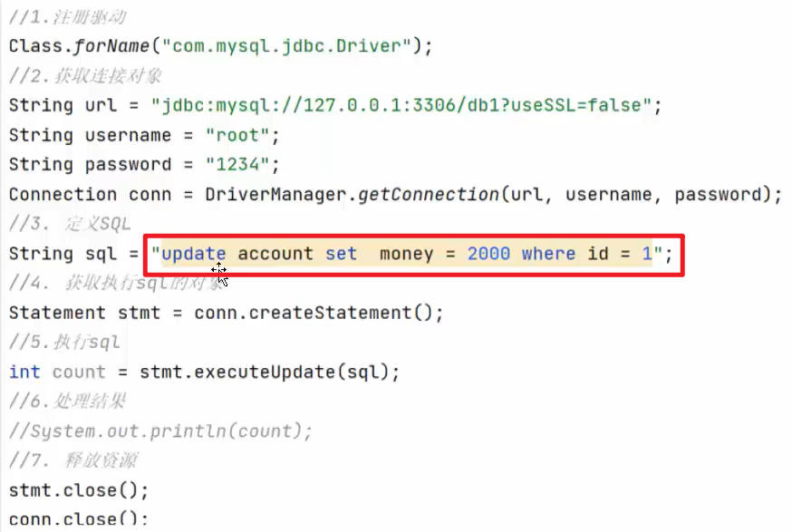 


## JDBC简介

### JDBC简介

+ JDBC是用JAVA语言操作关系型数据库的一套AIPI
+ 全程 Java DataBAseConnectivity

JDBC定义了操作各种数据库的规则---------->>>>>>接口！

只定义了接口，想用就自己实现类。

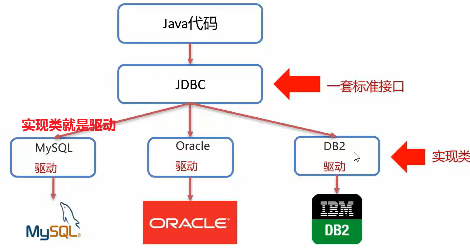 


### JDBC本质

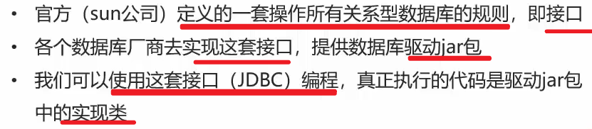 

### JDBC的好处

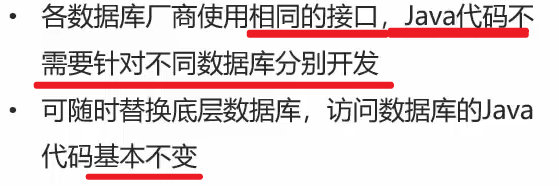 


## JDBC快速入门

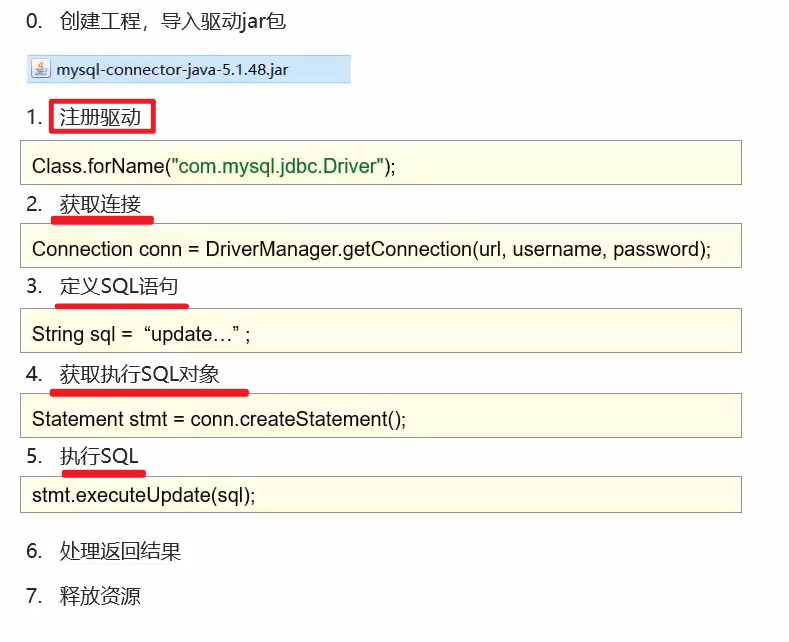 

### 下载jar包教程

[MySQL :: MySQL Community Downloads](https://dev.mysql.com/downloads/)

查看自己的mysql版本

 

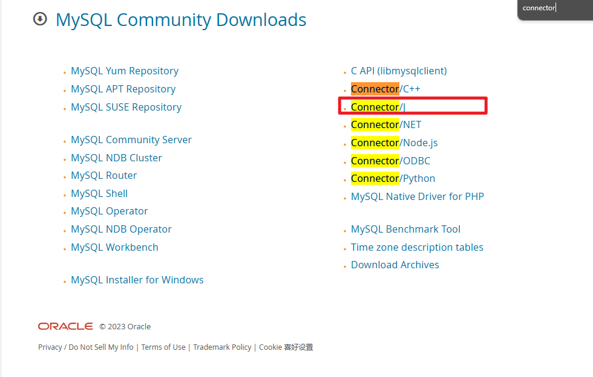 

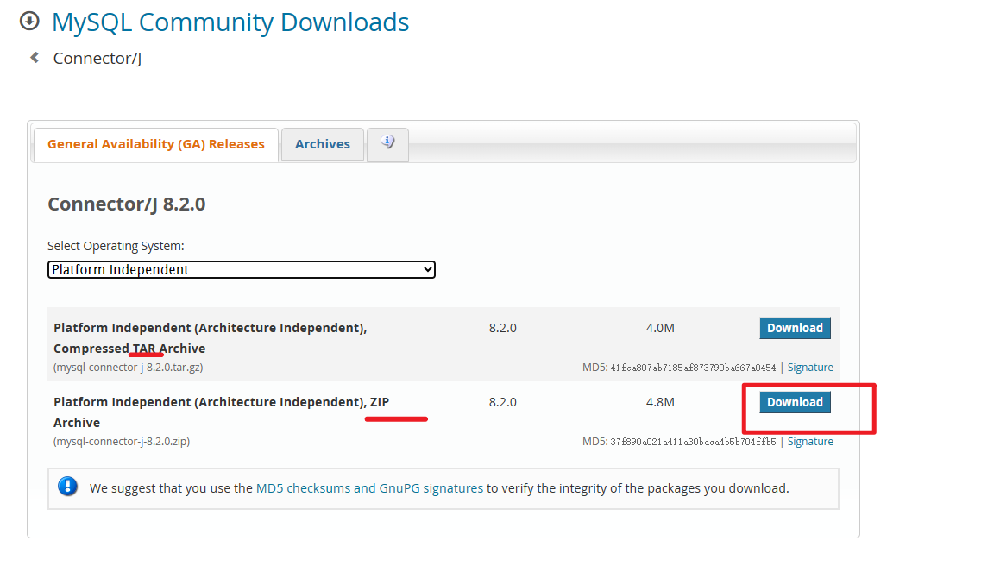 

下载好并且解压

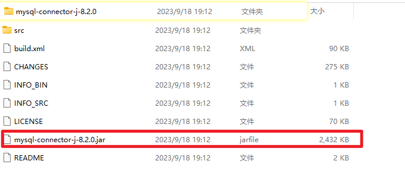 

### 快速上手

 

快速入门：

1. 创建空项目

   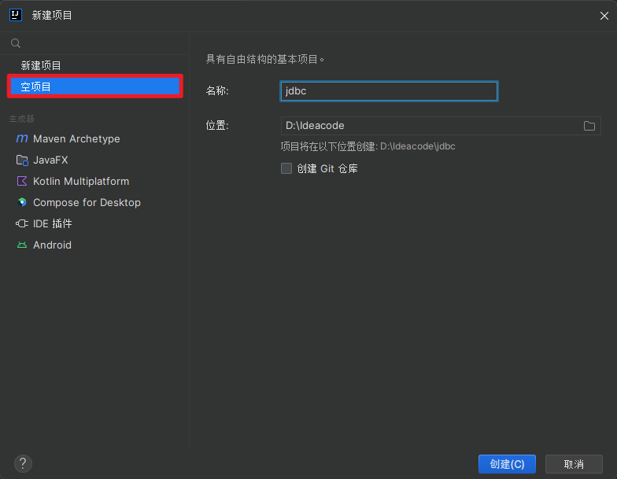 

2. 创建新模块

   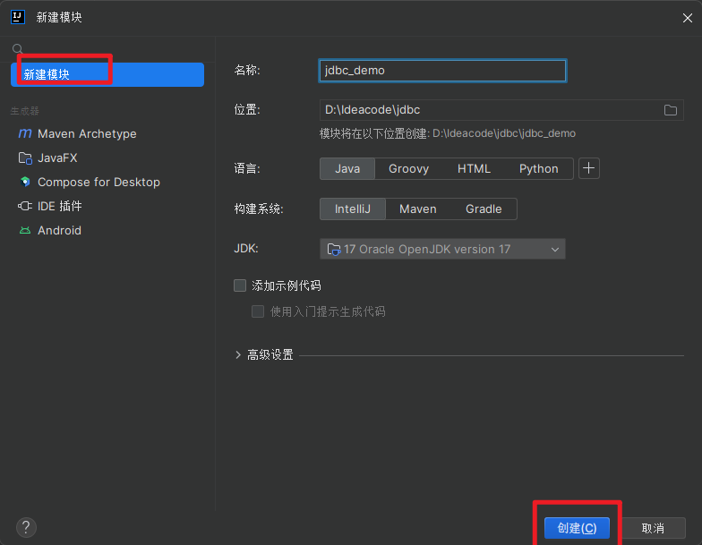 

3. 在模块下新建目录lib

    

4. 把jar包放到lib下面

   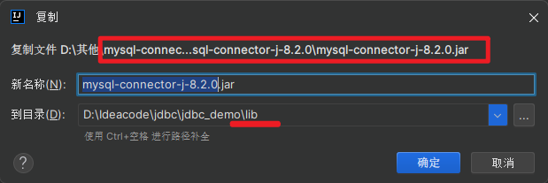 

5. 设置jar包生效的范围

   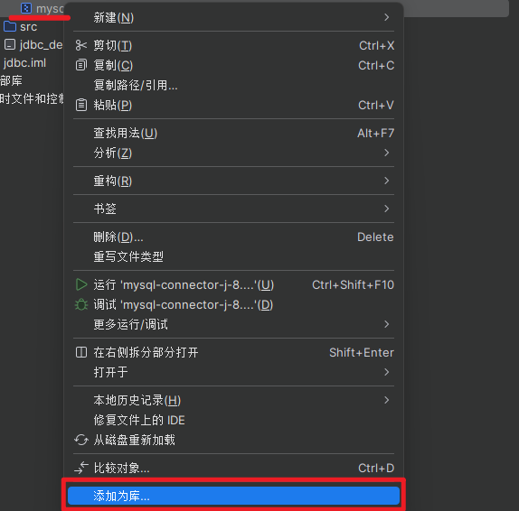 

   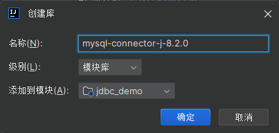 

6. 创建包和 类

   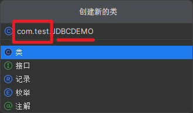 

   最后是类，前面的默认为包。


代码演示:

```java
package com.test;

import java.sql.Connection;
import java.sql.DriverManager;
import java.sql.SQLException;
import java.sql.Statement;

public class JDBCDEMO {

    public static void main(String[] args) throws ClassNotFoundException, SQLException {
        //1.注册驱动
        Class.forName("com.mysql.jdbc.Driver");

        //2.获取连接
        String url="jdbc:mysql://127.0.0.1:3306/db";
        String username="root";
        String password="xurunbo";
        Connection conn=DriverManager.getConnection(url,username,password);
        //3定义sql语句
        String sql="update account set money=money-500 where name=\"李四\";";
//        String sql="select * from account";

        //获取执行sql的对象 statement
        Statement stmt=conn.createStatement();


        //执行sql并且返回受影响的行数
        int count=stmt.executeUpdate(sql);
        //处理结果
        System.out.println("受影响的行数"+count);

        //释放资源我们掀开的conn 后是stmt
        stmt.close();
        conn.close();

    }
}

```

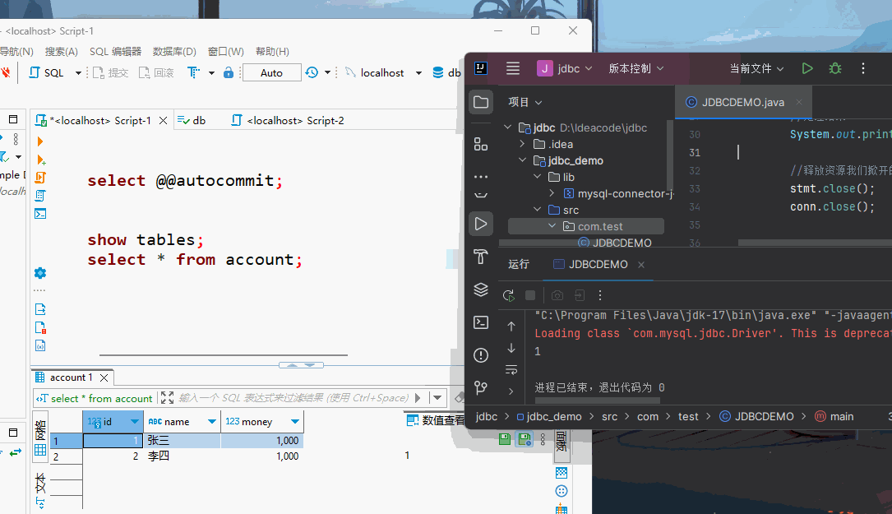

> Class.forName是Java中的一个静态方法，用于**动态加载类**。它接受一个字符串参数，该参数是要加载的类的全限定名（包括包名）。
>
> 当调用Class.forName方法时，它会尝试加载指定的类，并返回一个Class对象，可以用于创建该类的实例或访问该类的静态成员。

## JDBC API详解

### DriverManager

> 翻译：驱动管理类
>
> 1. 注册驱动Class.forName(str)
>
>    我们用的是` Class.forName("com.mysql.jdbc.Driver");`
>
>    查看Driver的源码
>
>    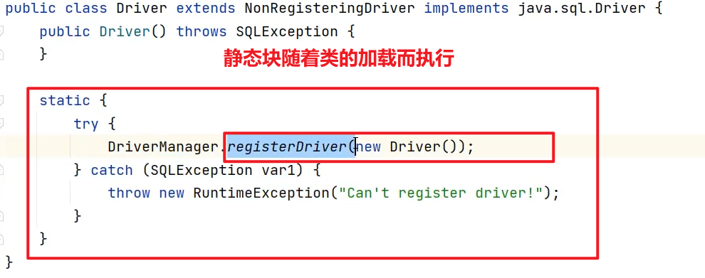
>
>     
>
>     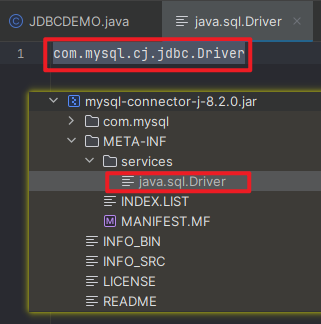 
>
> 2. 获取数据库连接DriverManager.getConnection(String m1,String m2,String m3);
>
>    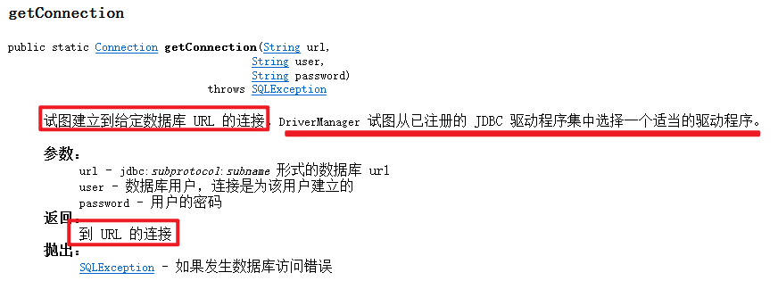
>
>    url的语法：
>
>    `jdbc:mysql://ip地址(域名):端口号/数据库名称?参数键值对1&键值对2。。。`
>
>    我们现在用的`jdbc:mysql://127.0.0.1:3306/db` 
>
>    如果是本机的端口，而且端口默认是3306可以用省去ip和端口                                                                                                                                                                                                                                                                                                                                                                                                                                                                           
>
>    `jdbc:mysql:///db` 
>
>    代码测试:
>
>    ```java
>    package com.test;
>          
>    import java.sql.Connection;
>    import java.sql.DriverManager;
>    import java.sql.SQLException;
>    import java.sql.Statement;
>          
>    public class JDBCDEMO {
>          
>        public static void main(String[] args) throws ClassNotFoundException, SQLException {
>            //2.获取连接
>            String url="jdbc:mysql:///db";
>            String username="root";
>            String password="xurunbo";
>            Connection conn=DriverManager.getConnection(url,username,password);
>            //3定义sql语句
>            String sql="update account set money=money-500 where name=\"李四\";";
>    //        String sql="select * from account";
>            //获取执行sql的对象 statement
>            Statement stmt=conn.createStatement();
>            //执行sql并且返回受影响的行数
>            int count=stmt.executeUpdate(sql);
>            //处理结果
>            System.out.println("受影响的行数"+count);
>            //释放资源我们掀开的conn 后是stmt
>            stmt.close();
>            conn.close();
>        }
>    }
>    ```
>
>    有一个安全的连接方式SSL
>
>    ``jdbc:mysql://127.0.0.1:3306/db?useSSL=false`
>
>    加参数用&隔开。。。。

### Connection

> Connection数据库连接对象
>
> 1. 获取执行SQL的对象
>
>    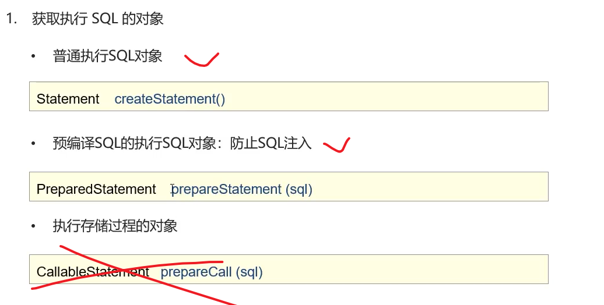 
>
> 2. 管理事务
>
>    CTRL+ALT+T可以快速把选中代码用异常框架抱起来
>
>    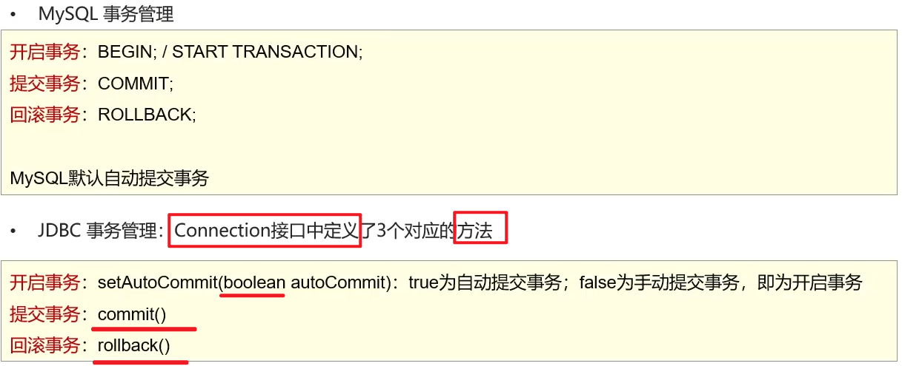 

代码演示::

```java
package com.test;

import java.sql.Connection;
import java.sql.DriverManager;
import java.sql.SQLException;
import java.sql.Statement;

public class JDBCDEMO {

    public static void main(String[] args) throws ClassNotFoundException, SQLException {
        //1.注册驱动
//        Class.forName("com.mysql.jdbc.Driver");

        //2.获取连接
        String url="jdbc:mysql:///db";
        String username="root";
        String password="xurunbo";
        Connection conn=DriverManager.getConnection(url,username,password);
        //3定义sql语句
        String sql1="update account set money=money-500 where name=\"李四\";";
        String sql2="update account set money=money-500 where name=\"张三\";";
//        String sql="select * from account";

        //获取执行sql的对象 statement
        Statement stmt=conn.createStatement();
        //执行sql并且返回受影响的行数
        try {
            //开启事务,前提就是不能每一句都commit
            conn.setAutoCommit(false);

            int count1=stmt.executeUpdate(sql1);
            //处理结果
            System.out.println("受影响的行数"+count1);
//            int a=10/0;

            int count2=stmt.executeUpdate(sql2);
            System.out.println("受影响的行数"+count2);
            //事务的过程中没有发现任何异常就commit上面的sql语句
            conn.commit();

        } catch (Exception e) {
            //发现任何异常就回滚到初始状态
            conn.rollback();
            throw new RuntimeException(e);
        }

        //释放资源我们掀开的conn 后是stmt
        stmt.close();
        conn.close();
    }
}
```

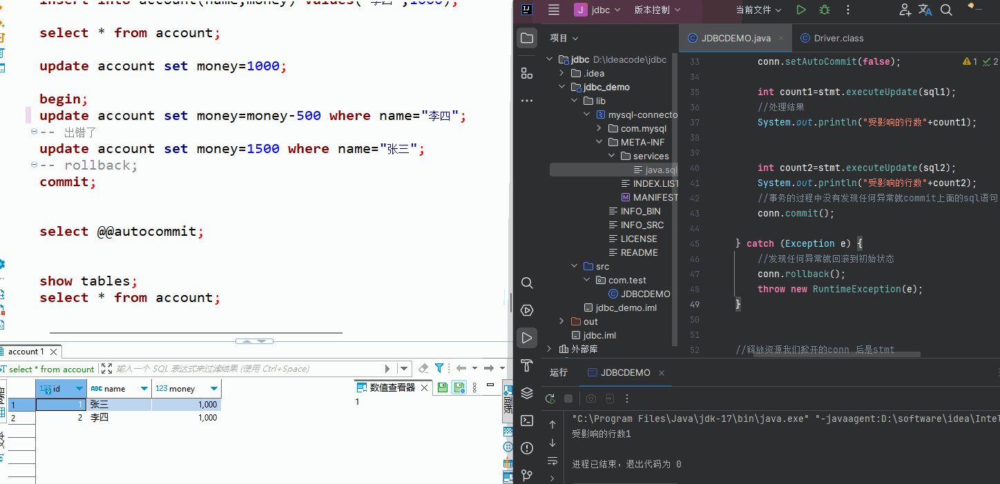 


### Statement

> 作用：
>
> **执行sql语句！**
>
> 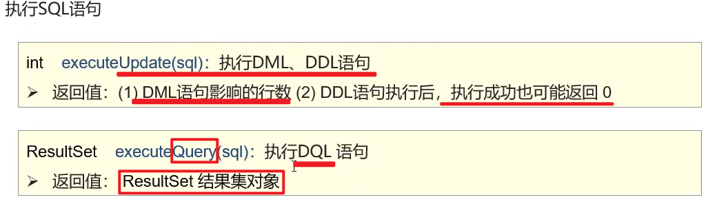
>
> `int executeUpdate(String sql);`
>
> 拿到这个结果不是要输出
>
> 而是判断
>
> >```java
> >if(ret>0)
> >	System.out.println("修改成功");
> >
> >else
> >	System.out.println("修改失败");
> >```
>
> 执行DML返回受影响的行函数，**DDL执行成功也可能会返回0**
>
> `Result Set executeQuery(String sql);`
>
> 返回的是结果集对象 

代码演示看下面ResultSet

### ==ResultSet//对查询结果的封装==

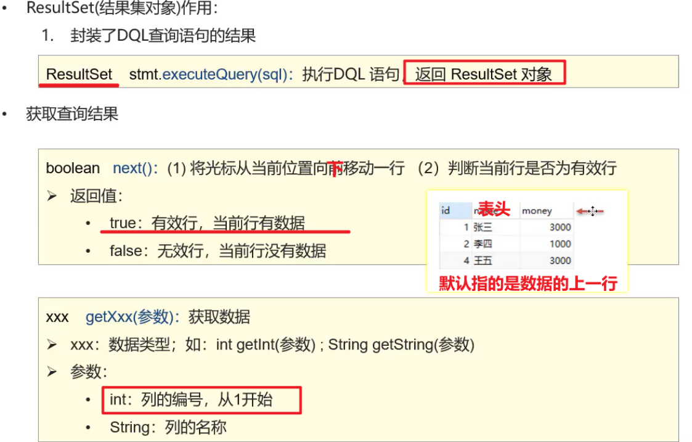 

所以使用的框架

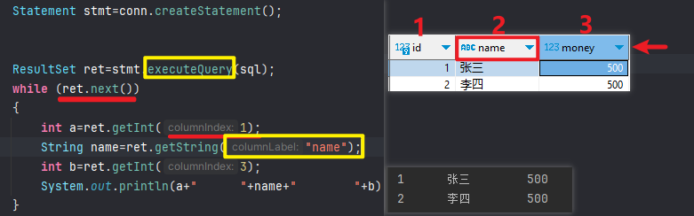 

代码演示:

```java
package com.test;

import java.sql.*;

public class JDBCDEMO {

    public static void main(String[] args) throws ClassNotFoundException, SQLException {
        //1.注册驱动
//        Class.forName("com.mysql.jdbc.Driver");

        //2.获取连接
        String url="jdbc:mysql:///db";
        String username="root";
        String password="xurunbo";
        Connection conn=DriverManager.getConnection(url,username,password);
        //3定义sql语句
//        String sql="update account set money=money-500 where name=\"李四\";";
        String sql="select * from account";
        //获取执行sql的对象 statement
        Statement stmt=conn.createStatement();

        ResultSet ret=stmt.executeQuery(sql);
        //光标向下移动一行，并且判断当前行是否有数据
        while (ret.next())
        {
            int a=ret.getInt(1);
            String name=ret.getString("name");
            //String name=ret.getString(2);等价的
            int b=ret.getInt(3);
            System.out.printf("%5d       %5s        %5d\n",a,name,b);
        }
        System.out.println("--------------------");

        //释放资源我们掀开的conn 后是stmt
        stmt.close();
        conn.close();

    }
}

```

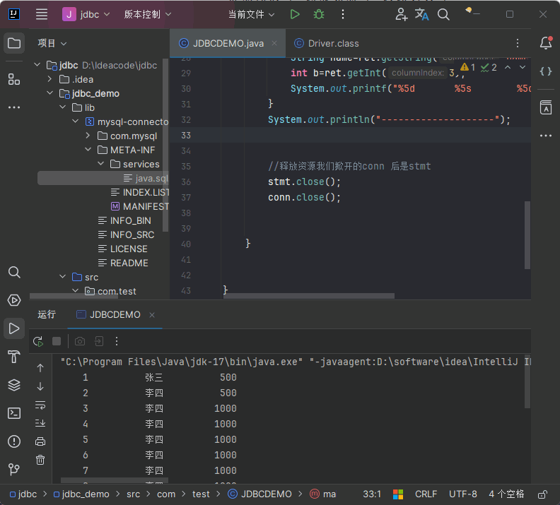


### ResultSet案例

> 查询到了account账户表数据
>
> 封装到ACCOunt对象中
>
> 并且存储到ARRayList集合中
>
> 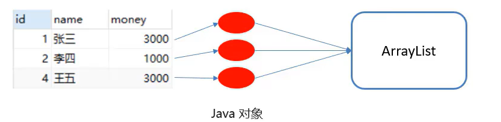
>
> 一行数据就是一个对象
>
> ArrayList就是来放对象的集合

代码实现:

```java
package com.test;

import pojo.Account;

import java.sql.*;
import java.util.ArrayList;
import java.util.List;

public class JDBCDEMO {
    public static void main(String[] args) throws ClassNotFoundException, SQLException {
        //1.注册驱动
//        Class.forName("com.mysql.jdbc.Driver");

        //2.获取连接
        String url="jdbc:mysql:///db";
        String username="root";
        String password="xurunbo";
        Connection conn=DriverManager.getConnection(url,username,password);
        //3定义sql语句
//        String sql="update account set money=money-500 where name=\"李四\";";
        String sql="select * from account";
        //获取执行sql的对象 statement
        Statement stmt=conn.createStatement();
        ResultSet ret=stmt.executeQuery(sql);
        
        //创建对象集合！！！
        List<Account> array=new ArrayList<>();
        while (ret.next())
        {
            int a=ret.getInt(1);
            String name=ret.getString("name");
//            String name=ret.getString(2);//等价的
            int b=ret.getInt(3);
            //把对象添加到集合里
            array.add(new Account(a,name,b));
        }
        for (Account a:array) {
            //遍历！！
            System.out.println(a.toString());
        }

        //释放资源我们掀开的conn 后是stmt
        stmt.close();
        conn.close();
    }
}

```

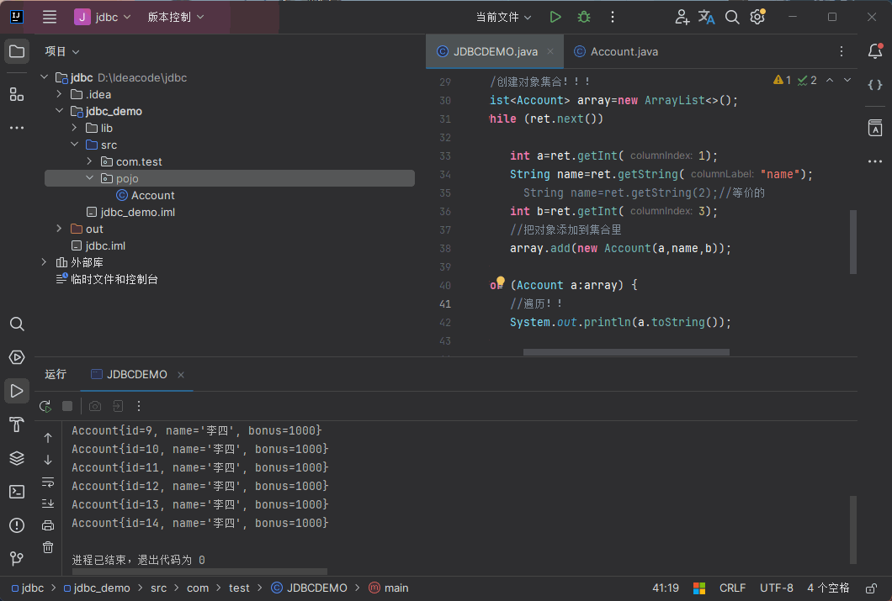

 

```java
System.out.println(array);
```

[Account{id=1, name='张三', bonus=500}, Account{id=2, name='李四', bonus=500}, Account{id=3, name='李四', bonus=1000}....]


### PreparedStatement//Statement的增强版

> 继承自Statement！
>
> 是增强版
>
> 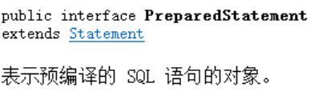 
>
> 预编译SQL语句并执行：预防SQL注入问题

#### SQL注入

+ 通过操作实现定义好的SQL语句，达到执行代码对服务器进行攻击的方法.

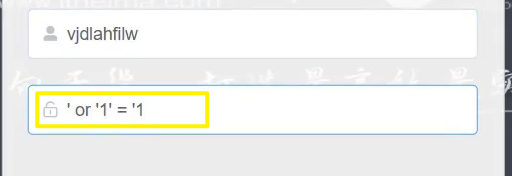 

用户登录的验证

`select * from where name="张三"andpassword="123456";`

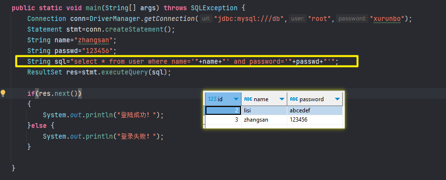 

代码实现:

```java
    public static void main(String[] args) throws SQLException {
        Connection conn=DriverManager.getConnection("jdbc:mysql:///db","root","xurunbo");
        Statement stmt=conn.createStatement();
        String name="zhangsan";
        String passwd="123456";
        String sql="select * from user where name='"+name+"' and password='"+passwd+"'";
        ResultSet res=stmt.executeQuery(sql);

        if(res.next())
        {
            System.out.println("登陆成功！");
        }else {
            System.out.println("登录失败！");
        }

    }
```

演示SQL注入

`String passwd="' or '1' ='1";`

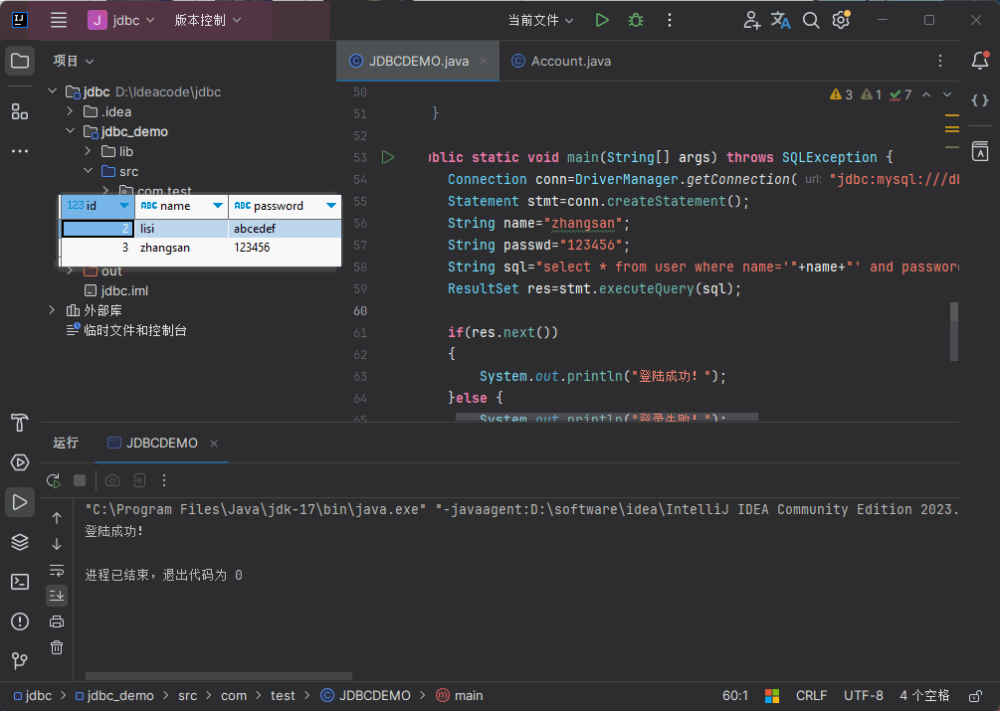

> 核心的与原因就是
>
> ```sql
> ' or '1' ='1
>  String sql="select * from user where name='"+name+"' and password='"+passwd+"'";
> 输出一下sql
> select * from user where name='zhangsan' and password='' or '1' ='1'
> ```
>
> 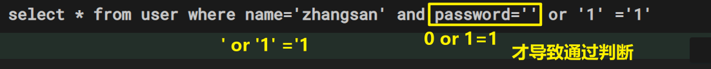

#### PrepareStatement使用

现在禁止了拼字符串让你注入

参数也是从1开始的

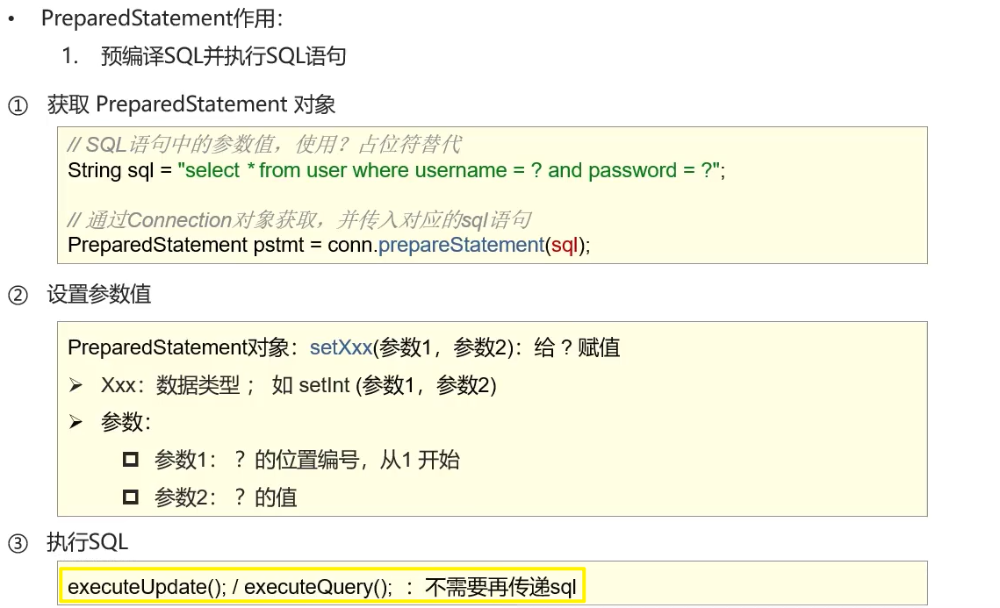 

代码实现：

```java
    public static void main(String[] args) throws SQLException {
        Connection conn=DriverManager.getConnection("jdbc:mysql:///db","root","xurunbo");
        String sql="select * from user where name=? and password=?";
        //获取PreparedStatement对象
        PreparedStatement stmt=conn.prepareStatement(sql);

        //设置参数值
        stmt.setString(1,"zhangsan");
        stmt.setString(2,"123456");
        
        
        //3执行SQL
        ResultSet res=stmt.executeQuery();
        System.out.println(sql);


        if(res.next())
        {
            System.out.println("登陆成功！");
        }else {
            System.out.println("登录失败！");
        }

    }
```

set的时候会对我们传入的东西进行转义

写个'就给你转义为真正的\'也就是当作文本来看，不让你去和我外面的'来恶意拼接.

#### Preparestatement的原理

+ 预编译sql，性能更高
+ 防止SQL注入，==**将敏感字符进行转义**==

> 预编译功能开启 useServerPrepstmts=true；

`Connection conn=DriverManager.getConnection("jdbc:mysql:///db?useServerPrepStmts=true","root","xurunbo");`

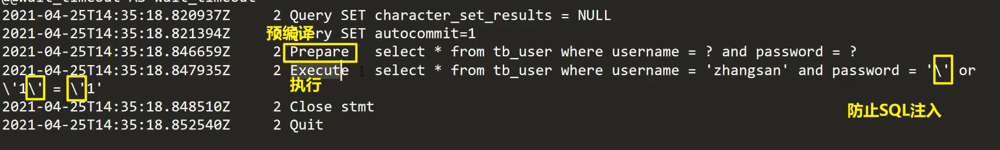 

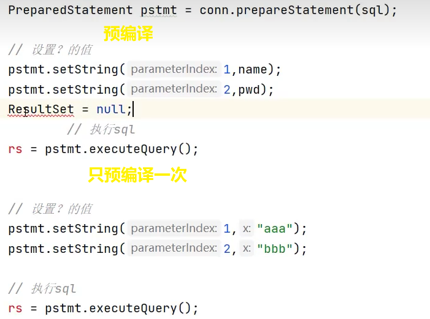 

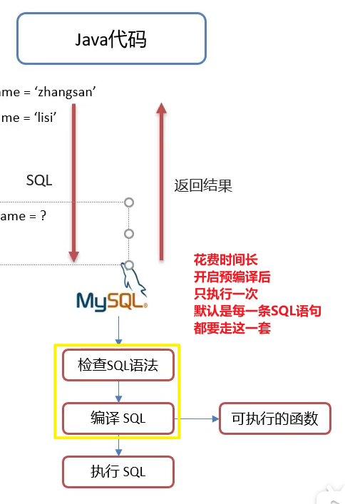 

> PreparedStatement原理：
>
> 1. 在获取PreparedStatement对象时，将sql语句发送给mysql服务器进行检查，编译 (这些步骤很耗时)
>
> 2. 执行时就不用再进行这些步骤了，速度更快
>
> 3. **如果sql模板一样，则只需要进行一次检查、编译**
>
>    什么是模板一样？
>
>    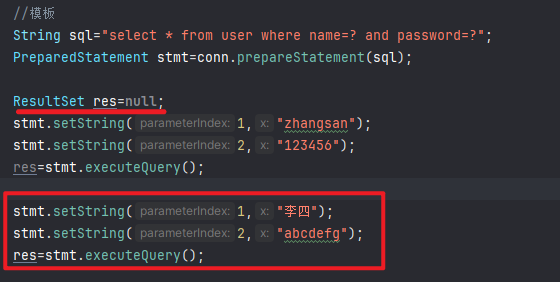 

## 数据库连接池(容器)

### 数据库连接池简介

 

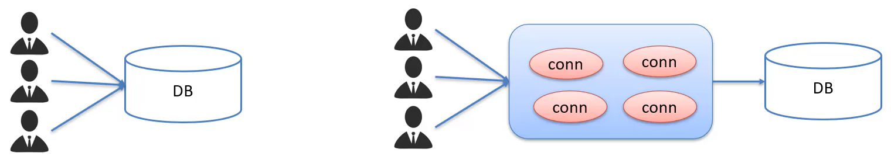 

传统是。用一个conn连接，就close，用一个conn连接，就close。

没有达到资源回收，性能低。

---

现在又了数据库连接池

里面放若干个连接，谁来了谁用

用完了，没有close，而是归还。这样就实现了资源宠用，提升了响应速度。

如果用户已经把所有连接都占用了，然后又来一个新人，发现没有连接，然后连接池就会检测到有人在浪费资源，强制把连接归还。然后就==避免了数据库连接遗漏==

> 标准接口：**DateSource**
>
> sun提供的数据库连接池标准接口，常常由第三方组织来实现接口
>
> 功能:获取连接
>
> `Connection getConnection();`
>
> 常见的税局库连接池:
>
> + DBCP
> + C3P0
> + Druid(德鲁伊)
>
> > 德鲁伊是阿里巴巴开源的数据库连接池
> >
> > 功能强大。。。。。很好


### Druid数据库连接池实现

druid的jar包下载

[druid-1.1.12.jar下载)](https://nowjava.com/jar/detail/m00170223/druid-1.1.12.jar.html)

1. 导入jar包并添加到库

2. 定义配置文件

   ```properties
   driverClassName=com.mysql.cj.jdbc.Driver
   url=jdbc:mysql://127.0.0.1:3306/db
   username=root
   password=xurunbo
   
   #初始化数量
   initialSize=5
   
   
   #最大连接数
   maxActive=10
   
   #最大等待时间
   maxWait=3000
   ```

3. 加载配置文件

   ```java
           Properties prop=new Properties();
           prop.load(new FileInputStream("jdbc_demo/src/druid.properties")); 
   ```

4. 获取数据库连接池对象

   ```java
           DataSource datasource=DruidDataSourceFactory.createDataSource(prop);
   ```

5. 获取连接

   ```java
    Connection conn=datasource.getConnection();
   ```

   

FileInputStream是**Java中用于读取文件的输入流对象**。

它可以用来从文件中读取字节数据，并将数据传输到程序中进行处理。

```java
FileInputStream fis = new FileInputStream("file.txt");
```


#### 路径问题

```java
        System.out.println(System.getProperty("user.dir"));
```

可以得到我们当前文件针对的路径

 

然后再拼接好我们的properties文件的路径，然后成功加载


代码实现: 

> ```java
> package com.test;
> 
> import com.alibaba.druid.pool.DruidDataSourceFactory;
> 
> import javax.sql.DataSource;
> import java.io.FileInputStream;
> import java.sql.Connection;
> import java.util.Properties;
> 
> public class Test {
>     public static void main(String[] args) throws Exception {
> 
> 
>         //导入jar包
> 
> 
>         //2定义配置文件
> 
> 
>         //3加载配置文件
>         Properties prop=new Properties();
>         prop.load(new FileInputStream("jdbc_demo/src/druid.properties"));
> 
>         //4 获取连接池对象
>         DataSource datasource=DruidDataSourceFactory.createDataSource(prop);
> 
>         //5获取数据库连接
>         Connection conn=datasource.getConnection();
> 
> //        它表示数据源dataSource-1已经成功初始化。在Druid连接池中，数据源会被赋予一个唯一的标识符，这里标识符为dataSource-1。当这条信息出现时，表示数据源已经被成功初始化并准备好提供数据库连接。
>         System.out.println(conn);
>         System.out.println(System.getProperty("user.dir"));
>     }
> }
> 
> ```
>
> 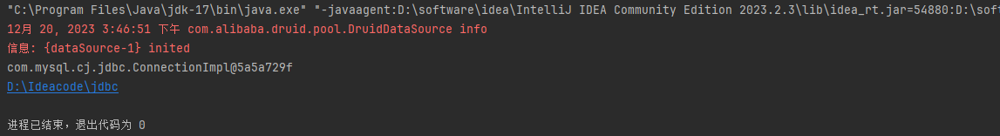 
>
> 运行结果
>
> "{dataSource-1} inited"是Druid连接池初始化时打印的日志信息。它表示数据源dataSource-1已经成功初始化。在Druid连接池中，数据源会被赋予一个唯一的标识符，这里标识符为dataSource-1。当这条信息出现时，表示数据源已经被成功初始化并准备好提供数据库连接。


## JDBC练习

 

> 1. 准备环境：
> 2. 数据库表 tb_brand
> 3. 实体类Brand
> 4. 测试用例

代码实现

```sql
create table tb_brand
(
id int primary key auto_increment,
rand_name varchar(20),
company_name varchar(20),
ordered intr
description varchar(100),

status int
);
insert into tb_brand(rand_name,company_name,ordered,description,status) values("小米","小米科技有限公司",5,"are you ok",1);
insert into tb_brand(rand_name,company_name,ordered,description,status) values("三只松鼠","三只松鼠有限公司",5,"好吃不贵",0);
insert into tb_brand(rand_name,company_name,ordered,description,status) values("华为","华为技术有限公司",5,"华为让生活更幸福",1);
insert into tb_brand(rand_name,company_name,ordered,description,status) values("vivo","vivo有限公司",5,"vivo智能手坤",1);

select * from tb_brand;
#测试代码
update tb_brand set rand_name=?,company_name=?,ordered=?,description=?,status=? where id=?;
delete  from tb_brand where id=?;

```

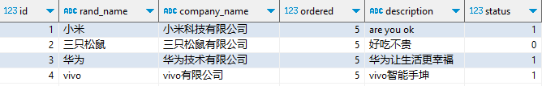 


实体类

```java
package pojo;

//推荐使用包装的类型，因为没有M默认值
public class Brand {

    private Integer  id           ;
    private String  rand_name    ;
    private String  company_name ;
    private Integer ordered      ;
    private String  description  ;
    //0禁用，1正常
    private Integer   status       ;

    public Brand(Integer id, String rand_name, String company_name, Integer ordered, String description, Integer status) {
        this.id = id;
        this.rand_name = rand_name;
        this.company_name = company_name;
        this.ordered = ordered;
        this.description = description;
        this.status = status;
    }

    public Integer getId() {
        return id;
    }

    public void setId(Integer id) {
        this.id = id;
    }

    public String getRand_name() {
        return rand_name;
    }

    public void setRand_name(String rand_name) {
        this.rand_name = rand_name;
    }

    public String getCompany_name() {
        return company_name;
    }

    public void setCompany_name(String company_name) {
        this.company_name = company_name;
    }

    public Integer getOrdered() {
        return ordered;
    }

    public void setOrdered(Integer ordered) {
        this.ordered = ordered;
    }

    public String getDescription() {
        return description;
    }

    public void setDescription(String description) {
        this.description = description;
    }

    public Integer getStatus() {
        return status;
    }

    public void setStatus(Integer status) {
        this.status = status;
    }

    @Override
    public String toString() {
        return "Brand{" +
                "id=" + id +
                ", rand_name='" + rand_name + '\'' +
                ", company_name='" + company_name + '\'' +
                ", ordered=" + ordered +
                ", description='" + description + '\'' +
                ", status=" + status +
                '}';
    }
}

```


### 查询数据

1. 获取connection
2. **定义SQL**
3. 获取prepreStatement对象
4. **设置参数**
5. 执行SQL
6. **处理结果**：list\<Brand\>
7. 释放资源

代码演示:

```java
package brand;

import pojo.Brand;

import java.sql.*;
import java.util.ArrayList;
import java.util.List;

public class BradTest {
    public static void main(String[] args) throws SQLException {
        String url="jdbc:mysql:///db";
        String user="root";
        String password="xurunbo";
        Connection conn=DriverManager.getConnection(url,user,password);
        //获取了connection

        //定义Sql+++++++++++++++++++++++++++++++++++++++++++++++++
        String sql="select * from tb_brand";//查询数据
        //得到preparestatement对象
        PreparedStatement stmt=conn.prepareStatement(sql);
        ResultSet res=null;
        res=stmt.executeQuery();
        //处理结果
        List<Brand> arraylist=new ArrayList<>();
        while (res.next())
        {
            int id=res.getInt(1);
            String randName=res.getString(2);
            String companyName=res.getString(3);
            int ordered=res.getInt(4);
            String desc=res.getString(5);
            int status=res.getInt(6);
            arraylist.add(new Brand(id,randName,companyName,ordered,desc,status));
        }
        for (Brand i:arraylist) {
            System.out.println(i);
        }
        //释放资源
        res.close
        stmt.close();
        conn.close();
    }
}

```

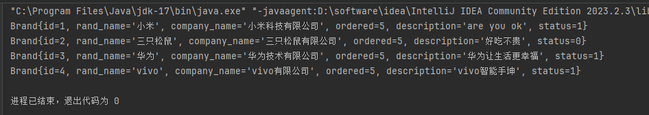


### 添加数据

代码实现

``` java
    public static void main(String[] args) throws SQLException {
        String url="jdbc:mysql:///db";
        String user="root";
        String password="xurunbo";
        //获取了connection
        Connection conn=DriverManager.getConnection(url,user,password);

        String newbrandName="三星";
        String newCompanyName="三星科技有限公司";
        int neworder=10;
        String newdesc="三星的固态真好";
        int newstatus=1;
        //定义Sql+++++++++++++++++++++++++++++++++++++++++++++++++
        String sql="insert into tb_brand(rand_name,company_name,ordered,description,status) values(?,?,?,?,?)";//添加品牌
        //得到preparestatement对象
        PreparedStatement stmt=conn.prepareStatement(sql);
        ResultSet res=null;
//        设置参数

        stmt.setString(1,newbrandName);
        stmt.setString(2,newCompanyName);
        stmt.setInt(3,neworder);
        stmt.setString(4,newdesc);
        stmt.setInt(5,newstatus);

        //执行SQL；
        int count=stmt.executeUpdate();

        if(count>0)
        {
            System.out.println("添加成功并且受影响的行数是"+count);
        }
        else
            System.out.println("添加失败！");

        //释放资源
        stmt.close();
        conn.close();
    }
```

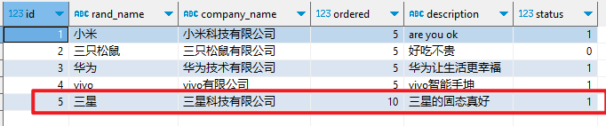

id咱就不自己设置，数据库自动增加


### 根据id来修改数据

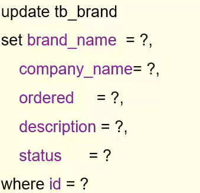 

代码实现

```java
    public static void main(String[] args) throws SQLException {
        String url="jdbc:mysql:///db";
        String user="root";
        String password="xurunbo";
        //获取了connection
        Connection conn=DriverManager.getConnection(url,user,password);

        String newbrandName="四星";
        String newCompanyName="四星科技有限公司";
        int neworder=1230;
        String newdesc="四星的固态真好";
        int newstatus=1;
        int id=5;//要修改的id，前端传来的
        //定义Sql+++++++++++++++++++++++++++++++++++++++++++++++++
        String sql="update tb_brand set rand_name=?,company_name=?,ordered=?,description=?,status=? where id=?";//修改后的信息
        //得到preparestatement对象
        PreparedStatement stmt=conn.prepareStatement(sql);
        ResultSet res=null;
//        设置参数

        stmt.setString(1,newbrandName);
        stmt.setString(2,newCompanyName);
        stmt.setInt(3,neworder);
        stmt.setString(4,newdesc);
        stmt.setInt(5,newstatus);
        stmt.setInt(6,id);

        //执行SQL；
        int count=stmt.executeUpdate();

        if(count>0)
        {
            System.out.println("修改并且受影响的行数是"+count);
        }
        else
            System.out.println("修改失败！");

        //释放资源
        stmt.close();
        conn.close();


    }
```

实现效果

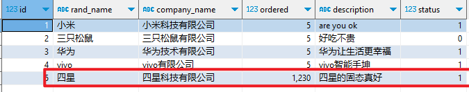 

### 根据id删除


代码实现

```java
public static void main(String[] args) throws SQLException {
        String url="jdbc:mysql:///db";
        String user="root";
        String password="xurunbo";
        //获取了connection
        Connection conn=DriverManager.getConnection(url,user,password);


        int id=5;//要修改的id，前端传来的
        //定义Sql+++++++++++++++++++++++++++++++++++++++++++++++++
        String sql="delete  from tb_brand where id=?;";//删除的id
        //得到preparestatement对象
        PreparedStatement stmt=conn.prepareStatement(sql);
        ResultSet res=null;
//        设置参数
        stmt.setInt(1,id);

        //执行SQL；
        int count=stmt.executeUpdate();

        if(count>0)
        {
            System.out.println("删除成功并且受影响的行数是"+count);
        }
        else
            System.out.println("删除失败！");

        //释放资源
        stmt.close();
        conn.close();


    }
```

实现效果

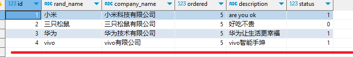 
