# 继Servlet的Request请求和Response响应

## Request请求和Response响应


## 导言

用户，请求，service（服务对象），响应他们之间的关系：

`service(request,response);`

request:获取数据

response：响应数据

> 1. **用户：** 你是顾客，坐在餐厅里，想要点一份菜单上的食物。
>
> 2. **请求（Request）：** 你把点菜单上的食物要求告诉了服务员，这就是你的请求。请求包含了你想要的信息，比如你想点的菜品和可能的特殊要求。
>
> 3. **服务对象（服务员）：** 服务对象就像是服务员，接收到你的请求后，它负责**将请求传达给厨房（服务器）**并协调整个点餐过程。服务对象**可以检查你的请求，确保它符合规范，并处理与点餐相关的事务**，比如确认菜品是否可用，检查有无特殊要求。
>
> 4. **服务器（厨房）：** 服务器就像是厨房，它接收到服务对象传来的请求，开始准备食物。**服务器执行一些操作，可能需要从数据库（食材库存）中检索信息**，处理一些逻辑（烹饪过程），最终生成一个菜品（响应）。
>
> 5. **响应（食物）：** 响应就像是你点的菜品，是服务器对你请求的回应。响应包含了你点的菜品，可能有一些额外的信息，比如是否有特殊处理或是否有菜品不可用等。
>
> 整个过程可以概括为：用户提出请求（点菜），**服务对象接收请求并协调整个过程**，服务器处理请求并生成响应（准备食物），最终用户得到了他们想要的东西（享受美食）。

## Request对象

### Request继承体系

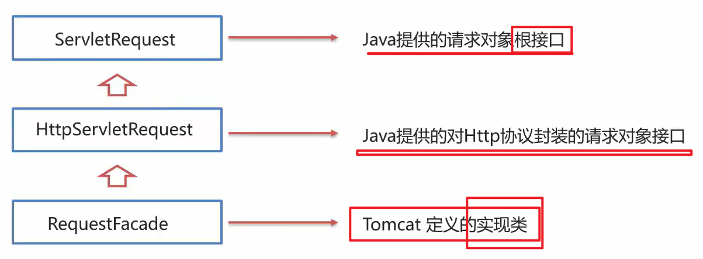 

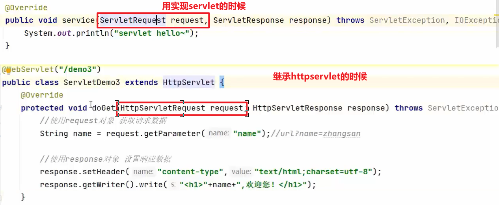

**tomcat解析请求数据，封装为request对象，并且创建request对象传递到service方法中** 

使用request对象就是看HttpservletRequest接口的...


### Request获取请求数据

#### Request获取请求数据的方法

##### 请求行：

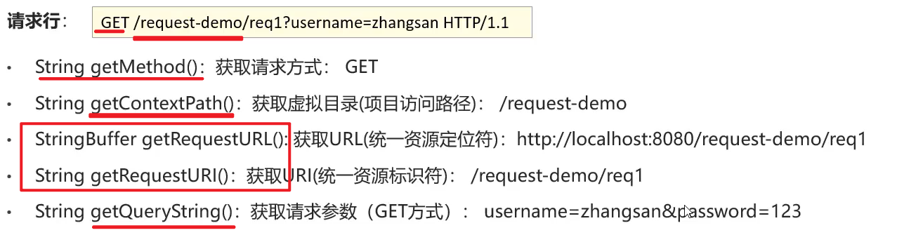 

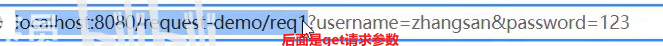 

代码演示：

```java
package com.hello;

import javax.servlet.ServletException;
import javax.servlet.annotation.WebServlet;
import javax.servlet.http.HttpServlet;
import javax.servlet.http.HttpServletRequest;
import javax.servlet.http.HttpServletResponse;
import java.io.IOException;
@WebServlet("/demo4")
public class Servlethttp extends HttpServlet {
    @Override
    protected void doGet(HttpServletRequest req, HttpServletResponse resp) throws ServletException, IOException {
        System.out.println("请求方式是"+req.getMethod());

        System.out.println("项目访问路径是"+req.getContextPath());

         System.out.println("项目url是"+req.getRequestURL().toString());

        System.out.println("项目的uri是"+req.getRequestURI());

        System.out.println("项目的请求参数是"+req.getQueryString());
    }
}

```

访问[localhost:9527/untitled19_war/demo4](http://localhost:9527/untitled19_war/demo4)

和[localhost:9527/untitled19_war/demo4](http://localhost:9527/untitled19_war/demo4?name=sda)

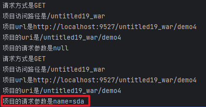 

多个参数

[localhost:9527/untitled19_war/demo4?name=sda&age=20&sex=男](http://localhost:9527/untitled19_war/demo4?name=sda&age=20&sex=男)

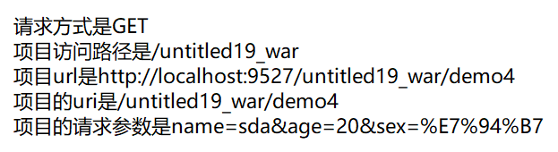  

 ##### 请求头

`String getHeader(String name);`

根据请求头名称获取值！

代码演示:

```java
  System.out.println("浏览器的版本是？"+req.getHeader("user-agent"));
```

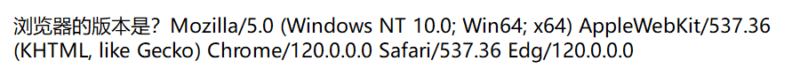 

##### 请求体

**`ServletInputStream getInputStream()`：**获取字节输入流

**`BufferedReader getReader()`：**获取字符输入流 

> 这两个方法都是用于获取HTTP请求的请求体（body）中的数据，但它们**提供不同类型的输入流**
>
> 一个是字节输入流,另一个是字符输入流。
>
> 1. **`ServletInputStream getInputStream()`：**
>
>    - 这个方法返回一个`ServletInputStream`对象，它是**字节输入流**。你可以使用这个流来读取HTTP请求体中的原始字节数据。
>    - 通常，在处理**二进制数据**或**文件上传**等场景时，使用这个方法可以**更直接地获取请求体的原始字节数据**。
>
>    ```java
>    ServletInputStream inputStream = request.getInputStream();
>    // 使用 inputStream 读取字节数据
>    ```
>
> 2. **`BufferedReader getReader()`：**
>
>    - 这个方法返回一个`BufferedReader`对象，它是**字符输入流**。你可以使用这个流来读取HTTP请求体中的字符数据。
>    - 当请求体中**包含文本数据（比如表单数据或JSON数据）时**，使用这个方法可以方便地以字符形式读取数据。
>
>    ```java
>    BufferedReader reader = request.getReader();
>    // 使用 reader 读取字符数据
>    ```
>
> 选择使用哪个方法取决于请求体中的数据类型和你处理数据的方式。如果你处理的是二进制数据，比如文件上传，通常会使用`getInputStream()`。如果处理的是文本数据，可能会更方便地使用`getReader()`。
>
> 需要注意的是，一旦你使用了其中一个方法，就不能再使用另一个方法，因为这两个方法都会读取请求体的数据流，而HTTP**请求的主体数据只能被读取一次**。

form的数据其实就是uri？

表单数据将被提交到的完整 URI 是由**你的 Web 应用的基本 URL** 和 **`action` 属性的值 (**"/untitled19_war/demo4") 拼接而成的。

代码演示：

```html
<!DOCTYPE html>
<html lang="en">
<head>
    <meta charset="UTF-8">
    <meta name="viewport" content="width=device-width, initial-scale=1.0">
    <title>Document</title>
</head>
<body>
<form action="/untitled19_war/demo4" method="post">
    <input name="username">
    <input name="passwd">
    <input type="submit">
</form>
</body>
</html>
```

```java
    @Override
    protected void doPost(HttpServletRequest req, HttpServletResponse resp) throws ServletException, IOException {
        System.out.println("......post");
        System.out.println("只有post有请求体下面是请求体----------------");

//        System.out.println("请求体的字节输入流"+req.getInputStream().toString());
//        System.out.println("请求体的字节输入流"+req.getReader().toString());


        System.out.println("读取数据");
        System.out.println("请求体的字符输入流"+req.getReader().readLine());
    }
```

访问

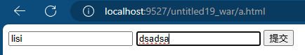 

提交到了demo4 

 

代码效果

 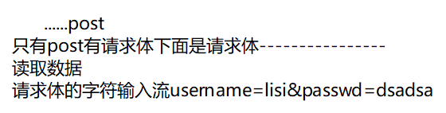 

> **当在同一个servlet请求生命周期内两次调用`HttpServletRequest`对象的`getInputStream()`和`getReader()`方法时，就会出现"getInputStream() has already been called for this request"的错误。这是因为Servlet容器只允许读取请求体一次。**


#### Request通用方式获取请求参数

GET请求方式和POST请求方式区别主要在于获取请求参数的方式不一样，是否可以提供一种统一获取请求参数的方式，从而统一doGet和doPost方法内的代码？

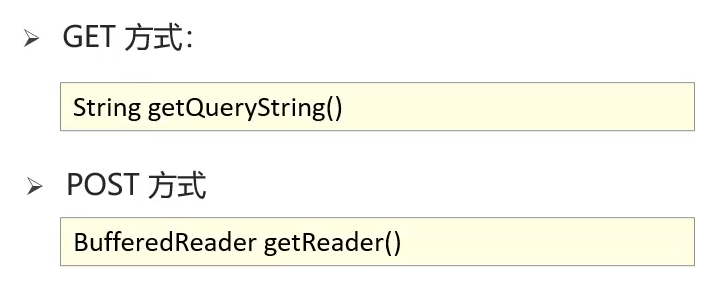 

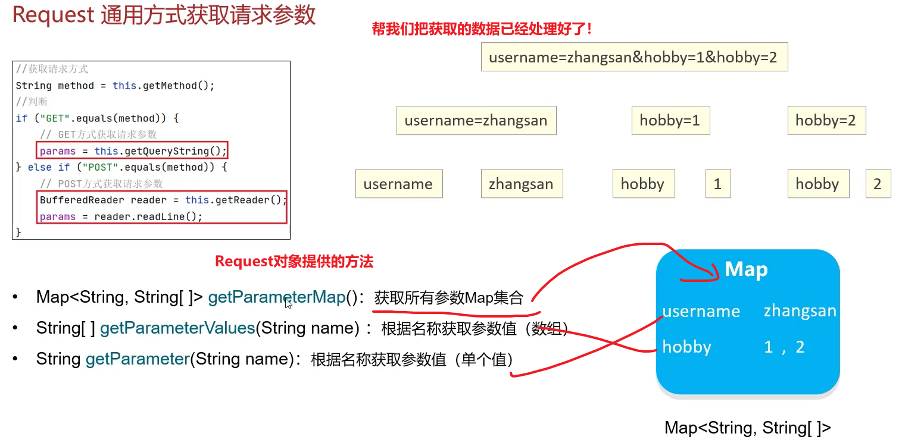

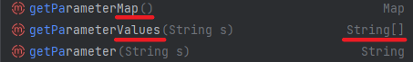  

##### Map


> 1. **概念：**
>    - `Map`是Java集合框架中的一种数据结构，用于存储键值对。每个键都映射到一个值。
>    - `Map`接口的常见实现包括`HashMap`，`TreeMap`，`LinkedHashMap`等。
>
> 2. **基本操作：**
>    - **插入键值对：** 使用`put(key, value)`方法将键值对插入到`Map`中。
>    - **获取值：** 使用`get(key)`方法通过键获取对应的值。
>    - **删除键值对：** 使用`remove(key)`方法删除指 定键的映射。
>    - **判断键是否存在：** 使用`containsKey(key)`方法判断`Map`中是否包含指定的键。
>
> 3. **遍历：**
>    - **遍历键集：** 使用`keySet()`方法获取键的集合，然后可以使用增强型for循环遍历键。
>    - **遍历值集：** 使用`values()`方法获取值的集合，然后可以使用增强型for循环遍历值。
>    - **遍历键值对：** 使用`entrySet()`方法获取键值对的集合，然后可以使用增强型for循环遍历`Map.Entry`对象。
>
> 4. **实现类：**
>    - `HashMap`：基于哈希表实现，提供快速的插入和查找操作，不保证有序性。
>    - `TreeMap`：基于红黑树实现，键值对按照键的自然顺序或自定义顺序进行排序。
>    - `LinkedHashMap`：继承自`HashMap`，但保留了插入元素的顺序。
>
> 5. **注意事项：**
>    - 键必须是唯一的，但值可以重复。
>    - `null`可以作为键，但在一般情况下应该避免使用`null`作为键，因为它可能导致不可预测的行为。
>
> 6. **性能：**
>    - `HashMap`通常提供了很好的性能，但在某些情况下，`TreeMap`可能更适合，具体取决于你的需求。
>

```html
<!DOCTYPE html>
<html lang="en">
<head>
    <meta charset="UTF-8">
    <meta name="viewport" content="width=device-width, initial-scale=1.0">
    <title>Document</title>
</head>
<body>
<form action="/untitled19_war/demo5" method="get">
    <input type="text" name="username"><br>

    <input type="password" name="pssword"><br>

    <input type="checkbox" name="hobby" value="1">游泳
    <input type="checkbox" name="hobby" value="1">爬山<br>
    <input type="submit">


</form>
</body>
</html>
```

测试代码

```java
package com.hello;

import javax.servlet.ServletException;
import javax.servlet.annotation.WebServlet;
import javax.servlet.http.HttpServlet;
import javax.servlet.http.HttpServletRequest;
import javax.servlet.http.HttpServletResponse;
import java.io.IOException;
import java.util.Map;

@WebServlet("/demo5")
public class Servlethttp1 extends HttpServlet {
    @Override
    protected void doGet(HttpServletRequest req, HttpServletResponse resp) throws ServletException, IOException {

        System.out.println("get....");
        System.out.println("获取所有参数的map集合");
        Map<String,String[]> map=req.getParameterMap();

        System.out.println("遍历map");


        for(String key:map.keySet())
        {
            System.out.print("key:"+key+" value:");

            String[] str=map.get(key);
            for(String i:str)
            {
                System.out.print(i);
            }
            System.out.println();
        }

        System.out.println("获取对应的数组");

        String[] strarray=req.getParameterValues("hobby");
        for (String i :strarray)
        {
            System.out.println(i);
        }

        System.out.println("获取对应的值");

        String res= req.getParameter("username");
        System.out.println(res);


    }

        @Override
        protected void doPost(HttpServletRequest req, HttpServletResponse resp) throws ServletException, IOException {

        }
}

```

==这个时候url是能看到我们提交的密码的==

[localhost:9527/untitled19_war/demo5?username=xrv&pssword=dsadas&hobby=1&hobby=1](http://localhost:9527/untitled19_war/demo5?username=xrv&pssword=dsadas&hobby=1&hobby=1)

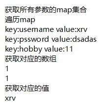 

##### post请求的时候只需要：

```html
<form action="/untitled19_war/demo5" method="post">
    <input type="text" name="username"><br>

    <input type="password" name="pssword"><br>

    <input type="checkbox" name="hobby" value="1">游泳
    <input type="checkbox" name="hobby" value="1">爬山<br>
    <input type="submit">

</form>
```

 测试代码

这次提交后就不再在url那显示我们提交的数据了

[localhost:9527/untitled19_war/demo5](http://localhost:9527/untitled19_war/demo5)

```java
package com.hello;

import javax.servlet.ServletException;
import javax.servlet.annotation.WebServlet;
import javax.servlet.http.HttpServlet;
import javax.servlet.http.HttpServletRequest;
import javax.servlet.http.HttpServletResponse;
import java.io.IOException;
import java.util.Map;

@WebServlet("/demo5")
public class Servlethttp1 extends HttpServlet {
    @Override
    protected void doGet(HttpServletRequest req, HttpServletResponse resp) throws ServletException, IOException {

        System.out.println("post....");
        System.out.println("获取所有参数的map集合");
        Map<String,String[]> map=req.getParameterMap();

        System.out.println("遍历map");


        for(String key:map.keySet())
        {
            System.out.print("key:"+key+" value:");

            String[] str=map.get(key);
            for(String i:str)
            {
                System.out.print(i);
            }
            System.out.println();
        }

        System.out.println("获取对应的数组");

        String[] strarray=req.getParameterValues("hobby");
        for (String i :strarray)
        {
            System.out.println(i);
        }

        System.out.println("获取对应的值");

        String res= req.getParameter("username");
        System.out.println(res);


    }

        @Override
        protected void doPost(HttpServletRequest req, HttpServletResponse resp) throws ServletException, IOException {
        doGet(req, resp);
        }
}

```

最后，可以看出这几个方法是通用的！

走post就去调用doget就ok了 

最常用的就是getparameter获取单个键值


##### IDEA创建Request通用方式

新版本除了自己创建模板

自己手动添加把

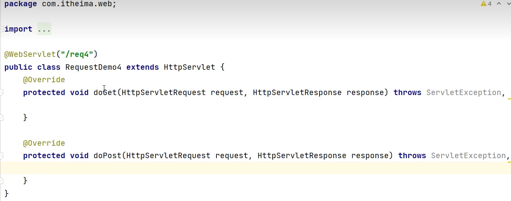 


##### post请参数中文乱码处理

get

当传入中文的时候

[localhost:9527/untitled19_war/demo5?username=许闰博&pssword=dsadas&hobby=1&hobby=1](http://localhost:9527/untitled19_war/demo5?username=许闰博&pssword=dsadas&hobby=1&hobby=1)

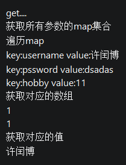 

post

当传入中文的时候

[localhost:9527/untitled19_war/demo5](http://localhost:9527/untitled19_war/demo5) 

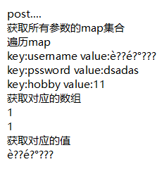 

> 在处理 POST 请求时，如果传入的中文出现乱码，可能是由于编码格式不匹配导致的。常见的编码格式有UTF-8、GBK、ISO-8859-1等。如果你将编码修改为UTF-8后问题得以解决，说明原始的编码格式可能不是UTF-8。
>
> 在处理 POST 请求时，服务器端需要对请求中的数据进行解码。常见的解码方式有：
>
> 1. **ISO-8859-1（Latin-1）**：这是 HTTP/1.1 规范中默认的字符编码，如果未指定字符编码，通常会默认使用ISO-8859-1。但是对于包含中文等非拉丁字符的文本，使用ISO-8859-1可能导致乱码。
>
> 2. **UTF-8**：这是一种广泛使用的字符编码，支持多种语言，包括中文。如果 POST 请求中包含中文，通常建议使用UTF-8编码。
>
> 在修改编码为UTF-8后，服务器端应该使用UTF-8来解码请求中的数据。在Java中，可以使用以下方式：
>
> ```java
> req.setCharacterEncoding("utf-8");
> ```
>
> 上述代码中，通过`InputStreamReader`指定了UTF-8编码进行解码。这确保了在读取 POST 请求的输入流时，中文等字符能够正确地被解析。
>

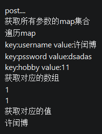 

##### 低版本get也会有乱码的问题 

原因是：tomcat的解码方式和浏览器编码的方式不一致

> 有些特殊的汉字可能会占用4个字节。UTF-8使用变长编码，不同的字符占用不同数量的字节，ASCII字符占用1个字节，拉丁字符占用2个字节，而汉字通常占用3个字节。Unicode编码规范定义了各种字符的编码方式，UTF-8是其中一种实现。

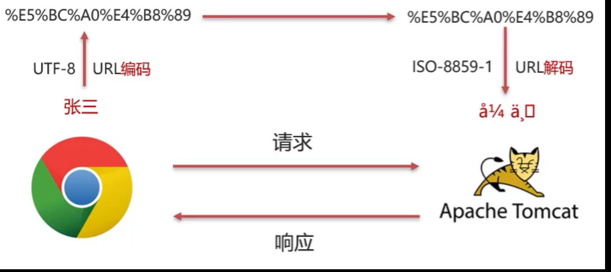 

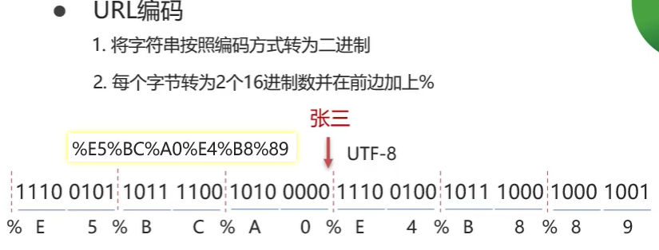 

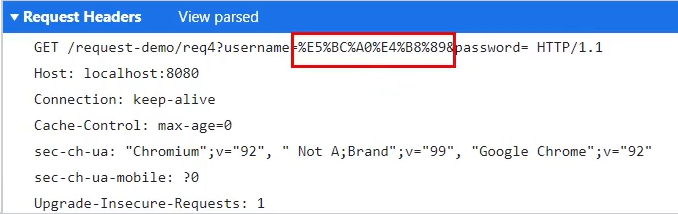 

```java
package com.hello;

import java.io.UnsupportedEncodingException;
import java.net.URLEncoder;

public class test {
    public static void main(String[] args) throws UnsupportedEncodingException {
        String username="张三";

        String res= URLEncoder.encode(username,"utf-8");

        System.out.println("编码后的"+res);
//        编码后的%E5%BC%A0%E4%B8%89
         String res1= URLEncoder.decode(res,"utf-8");
        //还原回来了！


    }
}
```

> 演示了**对字符串进行URL编码（percent encoding）的过程**。URL编码是一种将**URL中的特殊字符转换为%后跟两位十六进制数**的过程。这样可以确保在URL中传递参数时不会出现歧义或错误。

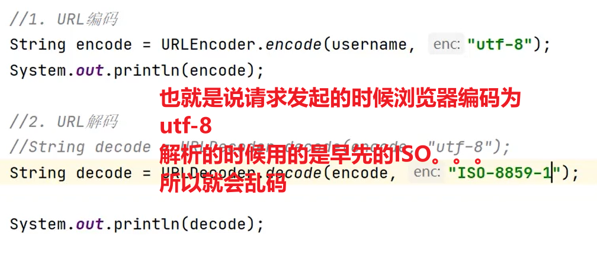

解决方法：

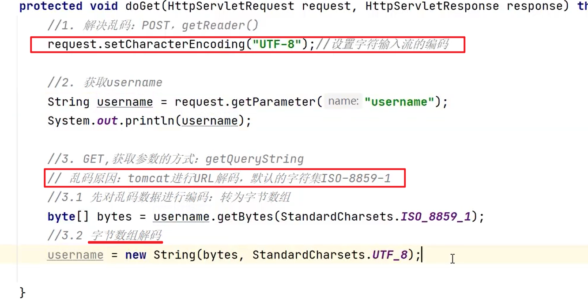

> post设置流的编码就ok了
>
> get乱码稍微麻烦一点，但是tomcat8+就不会乱码了/
>
> 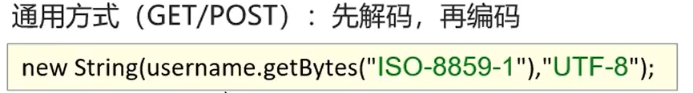 

#### Request请求转发

请求转发：在服务器内部资源跳转的跳转方式

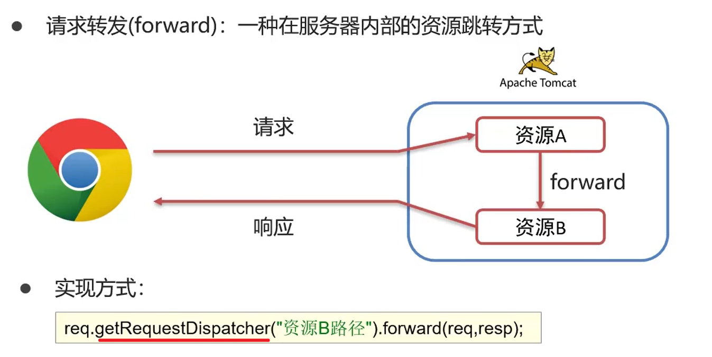

资源A和B是共享的！

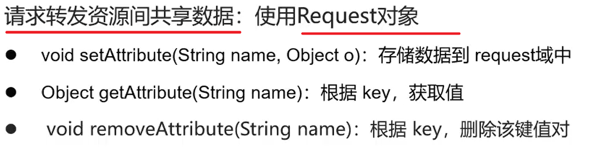 

代码演示:

> ```java
> package com.hello;
> 
> import javax.servlet.ServletException;
> import javax.servlet.annotation.WebServlet;
> import javax.servlet.http.HttpServlet;
> import javax.servlet.http.HttpServletRequest;
> import javax.servlet.http.HttpServletResponse;
> import java.io.IOException;
> 
> @WebServlet("/d1")
> public class Servlethttp2 extends HttpServlet {
>     @Override
>     protected void doGet(HttpServletRequest req, HttpServletResponse resp) throws ServletException, IOException {
>         req.setAttribute("temp",new String("xrb"));
>         System.out.println("哦哦哦d1");
> 
> 
>         //转发给d2处理，共享资源
> 
>         req.getRequestDispatcher("/d2").forward(req,resp);
> 
> 
>     }
> 
>         @Override
>         protected void doPost(HttpServletRequest req, HttpServletResponse resp) throws ServletException, IOException {
>         }
> }
> 
> ```
>
> ---
>
> ```java
> package com.hello;
> 
> import javax.servlet.ServletException;
> import javax.servlet.annotation.WebServlet;
> import javax.servlet.http.HttpServlet;
> import javax.servlet.http.HttpServletRequest;
> import javax.servlet.http.HttpServletResponse;
> import java.io.IOException;
> 
> @WebServlet("/d2")
> public class Servlethttp3 extends HttpServlet {
>     @Override
>     protected void doGet(HttpServletRequest req, HttpServletResponse resp) throws ServletException, IOException {
> 
>         System.out.println("哦哦哦d2");
> 
>         String newstr= (String) req.getAttribute("temp");
>         System.out.println("拿到传递的数据是"+newstr);
> 
>     }
> 
>         @Override
>         protected void doPost(HttpServletRequest req, HttpServletResponse resp) throws ServletException, IOException {
>         }
> }
> 
> ```
>
> 访问[localhost:9527/untitled19_war/d1](http://localhost:9527/untitled19_war/d1)
>
> 输出
>
> 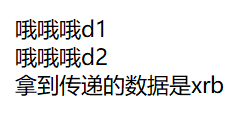 

---

注意:

> 请求转发特点：
>
> +  	浏览器地址栏路径不发生变化(用户还以为是d1在处理。。。)
>
> + 只能转发到当前服务器的内部资源
>
> + 一次请求,可以在转发的资源间使用request共享数据


## Respose

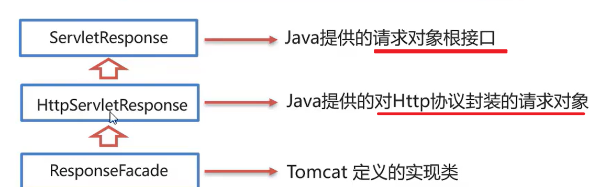 

### Response设置响应数据功能

#### 响应数据

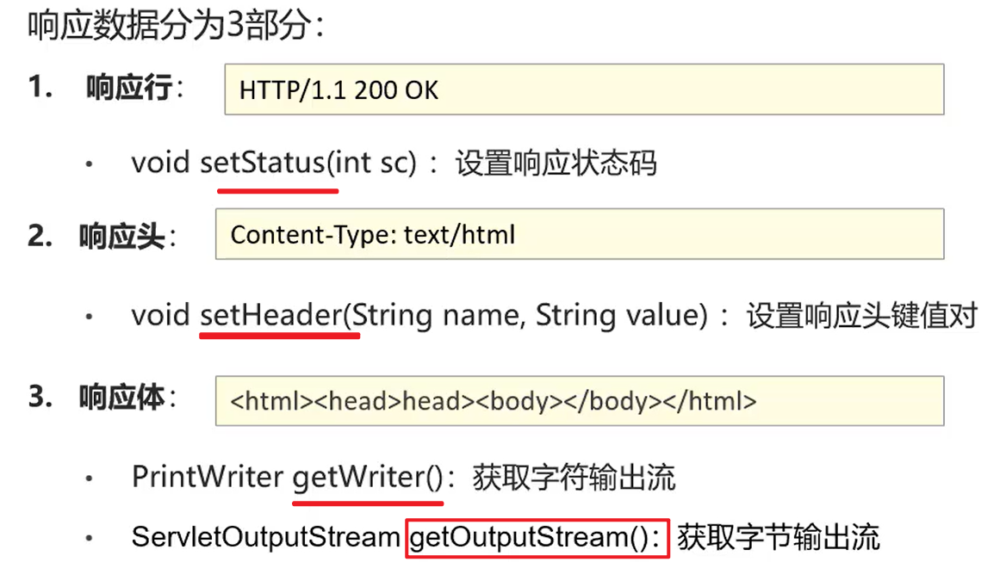 

### Response完成重定向

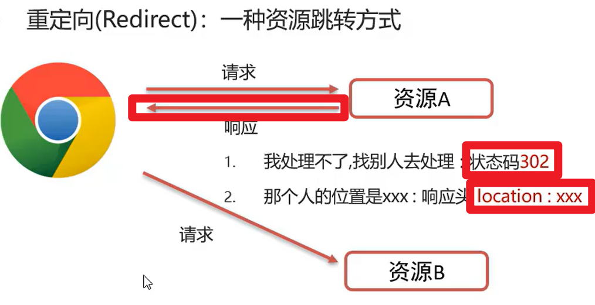 

> 代码演示:
>
> ```java
> package com.hello;
> 
> import javax.servlet.ServletException;
> import javax.servlet.annotation.WebServlet;
> import javax.servlet.http.HttpServlet;
> import javax.servlet.http.HttpServletRequest;
> import javax.servlet.http.HttpServletResponse;
> import java.io.IOException;
> @WebServlet("/resp1")
> public class response extends HttpServlet {
>     @Override
>     protected void doGet(HttpServletRequest req, HttpServletResponse resp) throws ServletException, IOException {
>         System.out.println("我处理不了，我给resp2处理");
> 
>         //设置响应状态
>         resp.setStatus(302);
> 
>         //设置响应头
>         resp.setHeader("Location","/untitled19_war/resp2");
>     }
> 
>     @Override
>     protected void doPost(HttpServletRequest req, HttpServletResponse resp) throws ServletException, IOException {
>     }
> }
> 
> ```
>
> ---
>
> ```java
> package com.hello;
> 
> import javax.servlet.ServletException;
> import javax.servlet.annotation.WebServlet;
> import javax.servlet.http.HttpServlet;
> import javax.servlet.http.HttpServletRequest;
> import javax.servlet.http.HttpServletResponse;
> import java.io.IOException;
> 
> @WebServlet("/resp2")
> public class response1 extends HttpServlet {
>     @Override
>     protected void doGet(HttpServletRequest req, HttpServletResponse resp) throws ServletException, IOException {
>         System.out.println("resp2正在处理！！！");
>     }
> 
>     @Override
>     protected void doPost(HttpServletRequest req, HttpServletResponse resp) throws ServletException, IOException {
>     }
> }
> 
> ```
>
> 访问http://localhost:9527/untitled19_war/resp1
>
> 效果:
>
> 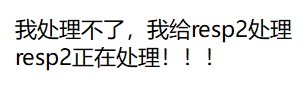 
>
> 而且跳转到[localhost:9527/untitled19_war/resp2](http://localhost:9527/untitled19_war/resp2)

注意重定向location的时候，要跟上虚拟路径！

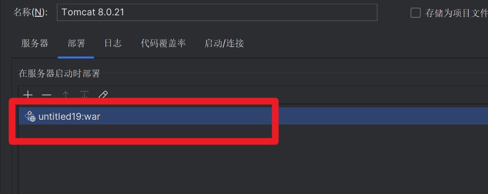 

----

> ```java
>     //设置响应状态
>     resp.setStatus(302);
> 
>     //设置响应头
>     resp.setHeader("Location","/untitled19_war/resp2");
> ```
>
> 取而代之的是
>
> ```java
>         resp.sendRedirect("/untitled19_war/resp2");
> ```
>
> 一样的效果

### 重定向和请求转发的区别

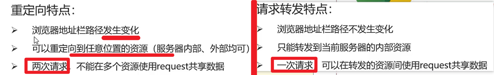 

### ==资源路径的问题==

问题导入：

请求转发的时候我们没用写虚拟路径只是简单的`"/d2"`

重定向的时候我们用了虚拟路径 `/undefined_war/d2`

所以什么时候该用哪一个??/

---

> 金言玉律
>
> 浏览器使用：**虚拟路径**
>
> 服务器内部使用：**普通路径**

---

小test：

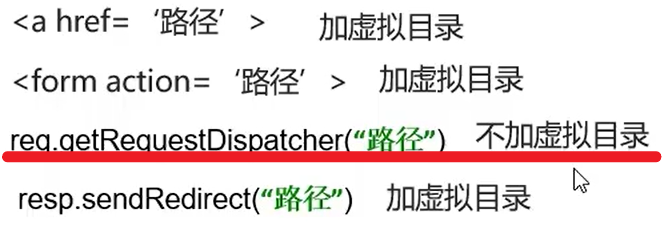  

如果要写虚拟路径：

如果用的maven tomcat插件，可以修改虚拟路径

如何动态的获取虚拟路径呢？

```java
        String path=req.getContextPath();
        resp.getWriter().println(path);
```

测试效果

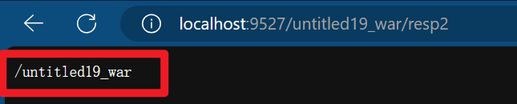 

### Response响应字符数据

`resp.getWriter()`

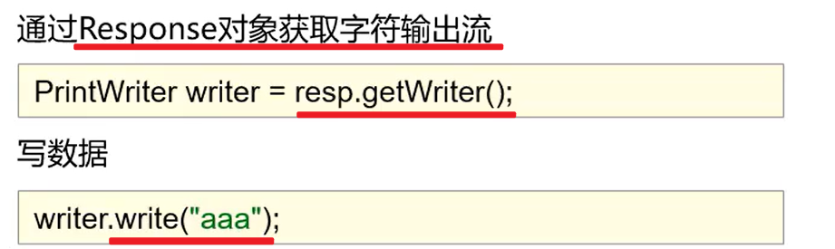

 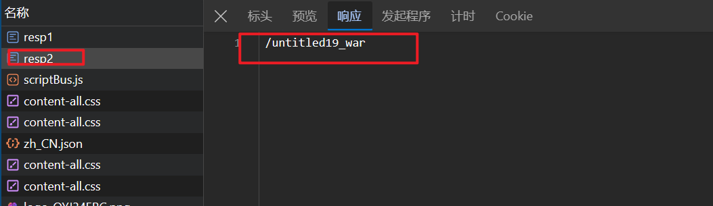 

但是现在浏览器默认是不解析我们的html标签了

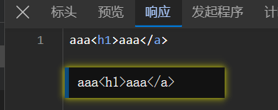 

设置:先设置后获取字符输出流对象

```java
resp.setHeader("content-type","text/html");
```

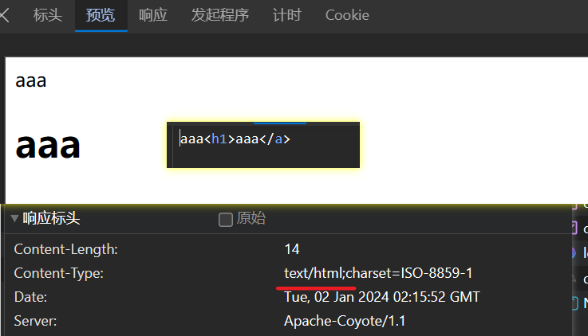 

#### 传入中文是什么情况呢？

> 默认响应头
>
> `Content-Type` 表示响应主体的媒体类型以及字符集（如果有的话）。在这里，`Content-Type: text/html;charset=ISO-8859-1` 意味着响应的主体类型是 HTML，并且使用的字符集是 ISO-8859-1。
>
> ISO-8859-1（也称为 Latin-1）是一个字符集，涵盖了西欧语言，包括英语、法语、德语等。这个字符集是单字节的，每个字符占用一个字节。在这个字符集中，每个字节对应一个字符。
>
> **对于 HTML 文档，通常建议使用 UTF-8 字符集，因为它支持更广泛的字符，适用于多种语言。**推荐使用如下的 `Content-Type` 设置：
>
> ```java
> Content-Type: text/html;charset=UTF-8
> ```
>
> 这将使用 UTF-8 字符集来编码 HTML 文档，以便更好地支持国际化。
>
> ```java
>  resp.setHeader("Content-Type", "text/html;charset=utf-8"); 
> ```
>
> 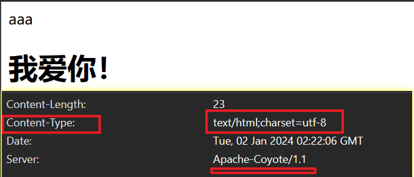 、

#### 细节

> 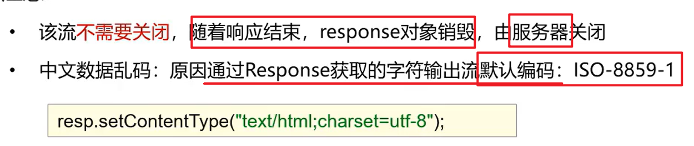 

### Response 响应字节数据

`        //获取字节输出流
        ServletOutputStream os=resp.getOutputStream();`

代码演示

```java
package com.hello;

import javax.servlet.ServletException;
import javax.servlet.annotation.WebServlet;
import javax.servlet.http.HttpServlet;
import javax.servlet.http.HttpServletRequest;
import javax.servlet.http.HttpServletResponse;
import java.io.IOException;
@WebServlet("/resp1")
public class response extends HttpServlet {
    @Override
    protected void doGet(HttpServletRequest req, HttpServletResponse resp) throws ServletException, IOException {
        System.out.println("我处理不了，我给resp2处理");

        resp.sendRedirect("/untitled19_war/resp3");

    }

    @Override
    protected void doPost(HttpServletRequest req, HttpServletResponse resp) throws ServletException, IOException {
    }
}

```

----

```java
package com.hello;

import javax.servlet.ServletException;
import javax.servlet.ServletOutputStream;
import javax.servlet.annotation.WebServlet;
import javax.servlet.http.HttpServlet;
import javax.servlet.http.HttpServletRequest;
import javax.servlet.http.HttpServletResponse;
import java.io.FileInputStream;
import java.io.IOException;

@WebServlet("/resp3")
public class response2 extends HttpServlet {
    @Override
    protected void doGet(HttpServletRequest req, HttpServletResponse resp) throws ServletException, IOException {

//
        //读取文件
        FileInputStream fileInputStream=new FileInputStream("D://pixpinGif//PixPin_2023-12-13_21-48-23.gif");


        //获取字节输出流
        ServletOutputStream os=resp.getOutputStream();

        //完成流的copy
        byte[] byrray=new byte[1024];
        int len=0;

        while ((len=fileInputStream.read(byrray))!=-1)
        {
            os.write(byrray,0,len);
        }
        fileInputStream.close();

    }

    @Override
    protected void doPost(HttpServletRequest req, HttpServletResponse resp) throws ServletException, IOException {
    }
}

```

代码效果

访问http://localhost:9527/untitled19_war/resp1

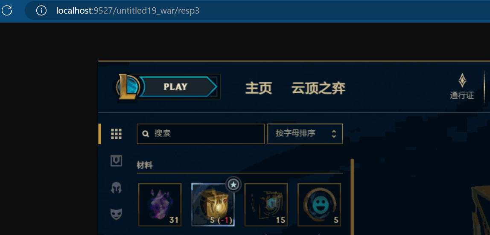 

#### 代码解释

对于代码的解释

> 这段代码是用于读取一个GIF文件并将其写入 Servlet 的响应输出流中，以便将文件内容发送到客户端。
>
> 1. **路径转义问题：**
>    
>    ```java
>    FileInputStream fileInputStream = new FileInputStream("D://pixpinGif//PixPin_2023-12-13_21-48-23.gif");
>    ```
>    在Java中，反斜杠（`\`）是一个转义字符，因此在字符串中表示一个反斜杠需要使用两个反斜杠，或者直接使用正斜杠。因此，上述路径可以写成：
>    ```java
>    FileInputStream fileInputStream = new FileInputStream("D:/pixpinGif/PixPin_2023-12-13_21-48-23.gif");
>    ```
>    
> 2. **IO输入流和输出流的理解：**
>    ```java
>    FileInputStream fileInputStream = new FileInputStream("D:/pixpinGif/PixPin_2023-12-13_21-48-23.gif");
>    ServletOutputStream os = resp.getOutputStream();
>    ```
>    - `FileInputStream` 是用于**从文件中读取字节的输入流。**
>    - `ServletOutputStream` 是用于**向客户端发送二进制数据的输出流。**
>
> 3. **流的复制：**
>    ```java
>    byte[] byrray = new byte[1024];
>    int len = 0;
>    while ((len = fileInputStream.read(byrray)) != -1) {
>        os.write(byrray, 0, len);
>    }
>    ```
>    这段代码通过一个循环从输入流中读取字节数据，然后将其写入输出流中。这是一种基本的流复制模式。
>
>    `read` 方法返回读取的字节数，当到达文件末尾时返回 -1。`write` 方法将字节数组的内容写入输出流。
>    
> 4. **write 方法的三个参数：**
>    
>    - `os.write(byrray, 0, len);`
>      - `byrray` 是要写入的字节数组。
>      - `0` 是起始偏移量，表示从数组的第一个元素开始写入。
>      - `len` 是要写入的字节数。
>    
> 5. 最后关闭文件的输入流
>
>    `fileInputStream.close();`
>


#### 进阶

如果流的copy写的很熟悉了

我们使用工具类来实现

> 1. 导入对应的maven坐标
>
>    ```xml
>            <dependency>
>                <groupId>commons-io</groupId>
>                <artifactId>commons-io</artifactId>
>                <version>2.13.0</version>
>            </dependency>
>    ```
>
> 2. 使用！
>
>    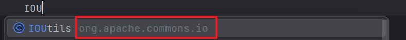
>
>    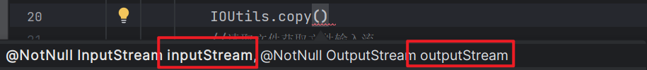  
>
>    ```java
>            @Override
>            protected void doGet(HttpServletRequest req, HttpServletResponse resp) throws ServletException, IOException {
>       
>        //
>                //读取文件获取文件输入流
>                FileInputStream fileInputStream=new FileInputStream("D://pixpinGif//PixPin_2023-12-13_21-48-23.gif");
>       
>                //获取字节输出流
>                ServletOutputStream os=resp.getOutputStream();
>       
>                IOUtils.copy(fileInputStream,os);
>                fileInputStream.close();
>       
>            }
>    ```
>
>    现在可以简化为这样，帮助我们省去 了我们自己写copy代码lll‘
>
>    一样可以显示那一张GIF图片


### 如果你的F12设置错了

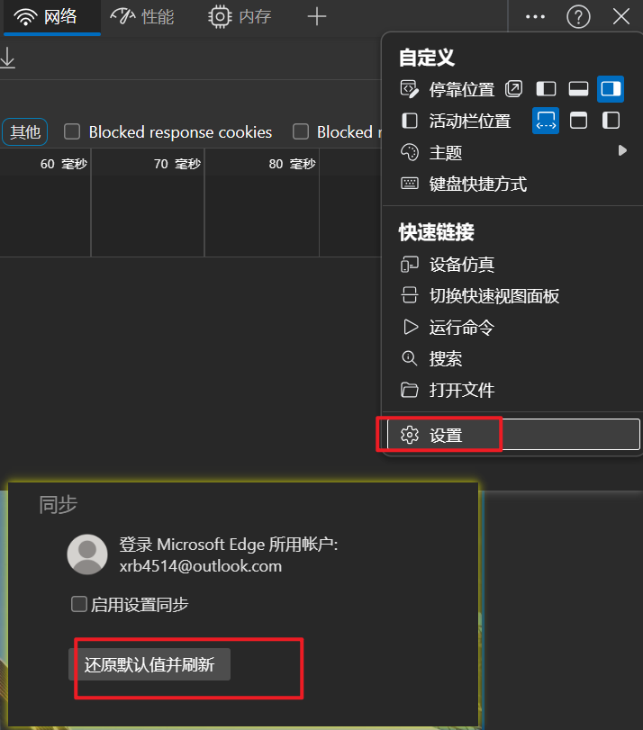

还原新的浏览器f12工具 


## 用户登录案例

### 用户登录

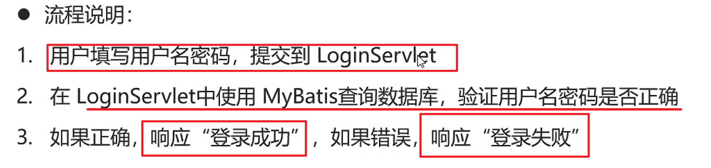

#### 准备静态登录页面

```html
<!DOCTYPE html>
<html lang="en">
<head>
    <meta charset="UTF-8">
    <meta name="viewport" content="width=device-width, initial-scale=1.0">
    <title>Login Page</title>
    <style>
        body {
            font-family: Arial, sans-serif;
            background-color: #f4f4f4;
            text-align: center;
            margin: 100px;
        }
        .login-container {
            max-width: 400px;
            margin: auto;
            background: #fff;
            padding: 20px;
            border-radius: 8px;
            box-shadow: 0 0 10px rgba(0, 0, 0, 0.1);
        }
        input {
            width: 100%;
            padding: 10px;
            margin: 8px 0;
            box-sizing: border-box;
        }
        button {
            background-color: #4caf50;
            color: #fff;
            padding: 10px 15px;
            border: none;
            border-radius: 4px;
            cursor: pointer;
        }
        button:hover {
            background-color: #45a049;
        }
        a {
            text-decoration: none;
            color: #4caf50;
        }
    </style>
</head>
<body>
<div class="login-container">
    <h2>Login</h2>
    <form id="loginForm">
        <label for="username">Username:</label>
        <input type="text" id="username" name="username" required>

        <label for="password">Password:</label>
        <input type="password" id="password" name="password" required>

        <button type="submit">Login</button>
        <button type="reset">Reset</button>
    </form>
    <p>Don't have an account? <a href="register.html">Register</a></p>
</div>
</body>
</html>

```

 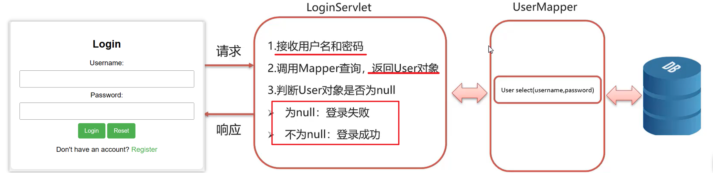 

#### 配置

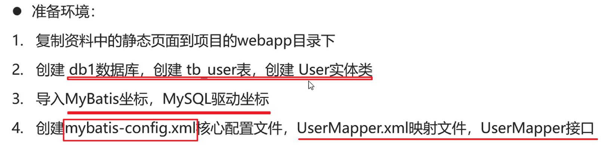

####  导入Mybatis的配置坐标

```xml
<dependency>
    <groupId>org.mybatis</groupId>
    <artifactId>mybatis</artifactId>
    <version>3.5.13</version>
</dependency>
<dependency>
    <groupId>mysql</groupId>
    <artifactId>mysql-connector-java</artifactId>
    <version>8.0.32</version>
</dependency>
<dependency>
    <groupId>junit</groupId>
    <artifactId>junit</artifactId>
    <version>4.13.2</version>
</dependency>
```

#### mybatis-config.xml

```xml
<?xml version="1.0" encoding="UTF-8" ?>
<!DOCTYPE configuration
        PUBLIC "-//mybatis.org//DTD Config 3.0//EN"
        "https://mybatis.org/dtd/mybatis-3-config.dtd">
<configuration>
    <environments default="development">
        <environment id="development">
            <transactionManager type="JDBC"/>

            <!--            数据库的连接信息-->
            <dataSource type="POOLED">
                <property name="driver" value="com.mysql.cj.jdbc.Driver"/>
                <property name="url" value="jdbc:mysql:///tb"/>
                <property name="username" value="root"/>
                <property name="password" value="xurunbo"/>
            </dataSource>


        </environment>
    </environments>

    <!--    加载SQl的映射文件-->
    <mappers>
        <package name="com.hello.mapper"/>
    </mappers>
</configuration>
```


#### pojo的User类

```java
package com.hello.pojo;

public class User {
    Integer id;

    @Override
    public String toString() {
        return "User{" +
                "id=" + id +
                ", username='" + username + '\'' +
                ", password='" + password + '\'' +
                '}';
    }

    public Integer getId() {
        return id;
    }

    public void setId(Integer id) {
        this.id = id;
    }

    public String getUsername() {
        return username;
    }

    public void setUsername(String username) {
        this.username = username;
    }

    public String getPassword() {
        return password;
    }

    public void setPassword(String password) {
        this.password = password;
    }

    String username ;
    String password ;
}

```

#### UserMapper.xml

```xml
<?xml version="1.0" encoding="UTF-8" ?>
<!DOCTYPE mapper
        PUBLIC "-//mybatis.org//DTD Mapper 3.0//EN"
        "https://mybatis.org/dtd/mybatis-3-mapper.dtd">


<mapper namespace="com.hello.mapper.UserMapper">
    <select id="selectall" resultType="com.hello.pojo.User">
        select * from tb_user;
    </select>
</mapper>
```

#### UserMapper接口

```java
package com.hello.mapper;

import com.hello.pojo.User;
import org.apache.ibatis.annotations.Param;
import org.apache.ibatis.annotations.Select;

import java.util.List;

public interface UserMapper {
    @Select("select * from tb_user where username=#{username} and password=#{password}")
    User select(@Param("username") String username, @Param("password") String password);

    List<User> selectall();

}
```

#### 测试mybatis代码

```java
package com.hello.main;

import com.hello.mapper.UserMapper;
import com.hello.pojo.User;
import org.apache.ibatis.io.Resources;
import org.apache.ibatis.session.SqlSession;
import org.apache.ibatis.session.SqlSessionFactory;
import org.apache.ibatis.session.SqlSessionFactoryBuilder;

import java.io.IOException;
import java.io.InputStream;
import java.util.List;

public class test1 {
    public static void main(String[] args) throws IOException {
        //加载mybatis的核心配置文件，获取
        String resource = "mybatis-config.xml";
        InputStream inputStream = Resources.getResourceAsStream(resource);
        SqlSessionFactory sqlSessionFactory = new SqlSessionFactoryBuilder().build(inputStream);


        //获取Sqlsussion对象
        SqlSession sqlSession=sqlSessionFactory.openSession();


        UserMapper userMapper=sqlSession.getMapper(UserMapper.class);

        List<User> users= userMapper.selectall();
        System.out.println(users);


    }
}

```

#### Servletlogin.java

```java
package com.hello.servlet;

import com.hello.mapper.UserMapper;
import com.hello.pojo.User;
import org.apache.ibatis.io.Resources;
import org.apache.ibatis.session.SqlSession;
import org.apache.ibatis.session.SqlSessionFactory;
import org.apache.ibatis.session.SqlSessionFactoryBuilder;

import javax.servlet.ServletException;
import javax.servlet.annotation.WebServlet;
import javax.servlet.http.HttpServlet;
import javax.servlet.http.HttpServletRequest;
import javax.servlet.http.HttpServletResponse;
import java.io.IOException;
import java.io.InputStream;
import java.util.Map;

@WebServlet("/login")
public class Login extends HttpServlet {
    @Override
    protected void doGet(HttpServletRequest req, HttpServletResponse resp) throws ServletException, IOException {
        System.out.println("先获取信息");
        resp.setHeader("Content-Type", "text/html;charset=utf-8");
        String username=req.getParameter("username");
        String password=req.getParameter("password");
        String resource = "mybatis-config.xml";
        InputStream inputStream = Resources.getResourceAsStream(resource);
        SqlSessionFactory sqlSessionFactory = new SqlSessionFactoryBuilder().build(inputStream);

        //获取Sqlsussion对象
        SqlSession sqlSession=sqlSessionFactory.openSession();
        UserMapper userMapper=sqlSession.getMapper(UserMapper.class);
        User user=userMapper.select(username,password);
        //调用完SQL就可以关闭了
        sqlSession.close();
        System.out.println("username:"+username);
        System.out.println("password:"+password);
        if(user==null)
        {
            resp.getWriter().write("密码错误！");
        }
        else
        {
            resp.getWriter().write("登录成功！！");
        }

    }

    @Override
    protected void doPost(HttpServletRequest req, HttpServletResponse resp) throws ServletException, IOException {
        System.out.println("post!");
       doGet(req, resp);
    }
}

```

#### 项目结构

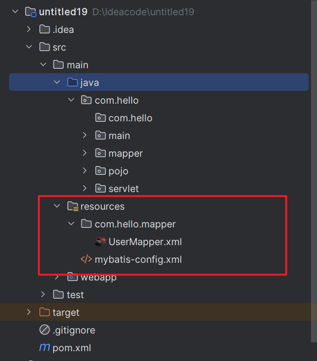 

#### 注意事项

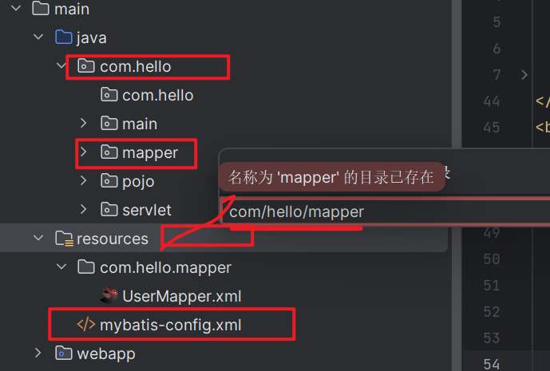 

#### 代码效果

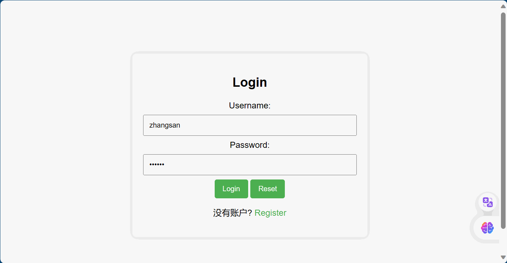 

### 用户注册

#### 流程准备

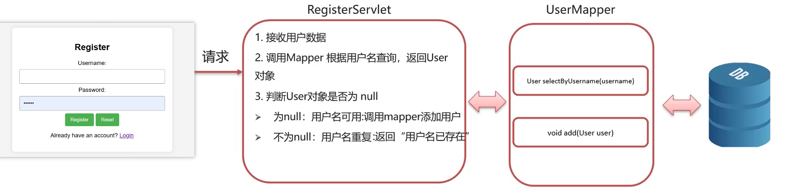 

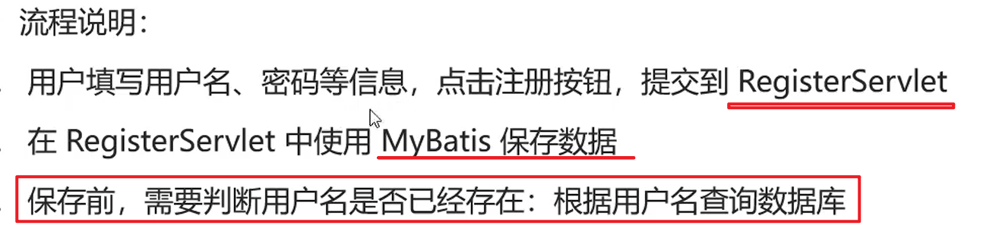 

#### 静态页面准备

```html
<!DOCTYPE html>
<html lang="en">
<head>
    <meta charset="UTF-8">
    <meta name="viewport" content="width=device-width, initial-scale=1.0">
    <title>Register Page</title>
    <style>
        body {
            font-family: Arial, sans-serif;
            background-color: #f4f4f4;
            text-align: center;
            margin: 100px;
        }
        .register-container {
            max-width: 400px;
            margin: auto;
            background: #fff;
            padding: 20px;
            border-radius: 8px;
            box-shadow: 0 0 10px rgba(0, 0, 0, 0.1);
        }
        input {
            width: 100%;
            padding: 10px;
            margin: 8px 0;
            box-sizing: border-box;
        }
        button {
            background-color: #4caf50;
            color: #fff;
            padding: 10px 15px;
            border: none;
            border-radius: 4px;
            cursor: pointer;
        }
        button:hover {
            background-color: #45a049;
        }
    </style>
</head>
<body>
<div class="register-container">
    <h2>Register</h2>
    <form id="registerForm">
        <label for="username">Username:</label>
        <input type="text" id="username" name="username" required>

        <label for="password">Password:</label>
        <input type="password" id="password" name="password" required>

        <button type="submit">Register</button>
        <button type="reset">Reset</button>
    </form>
    <p>Already have an account? <a href="login.html">Login</a></p>
</div>
</body>
</html>

```

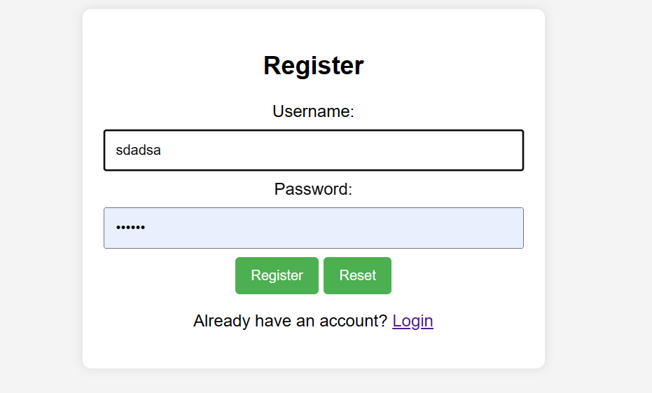 

#### UserMapper接口

```java
package com.hello.mapper;

import com.hello.pojo.User;
import org.apache.ibatis.annotations.Insert;
import org.apache.ibatis.annotations.Param;
import org.apache.ibatis.annotations.Select;

import java.util.List;

public interface UserMapper {
    @Select("select * from tb_user where username=#{username} and password=#{password}")
    User select(@Param("username") String username, @Param("password") String password);

    List<User> selectall();
    @Insert("insert into tb_user(username,password) values(#{username},#{password});")
    void adduser(@Param("username") String username, @Param("password") String password);

}

```

UserMapper.xml

```xml
<?xml version="1.0" encoding="UTF-8" ?>
<!DOCTYPE mapper
        PUBLIC "-//mybatis.org//DTD Mapper 3.0//EN"
        "https://mybatis.org/dtd/mybatis-3-mapper.dtd">


<mapper namespace="com.hello.mapper.UserMapper">
    <insert id="adduser">
        insert into tb_user(username,password) values(#{username},#{password});
    </insert>
    <select id="selectall" resultType="com.hello.pojo.User">
        select * from tb_user;
    </select>
</mapper>

```

这两种方法我知道你会。。。

#### ServletLogin.java

```java
package com.hello.servlet;

import com.hello.mapper.UserMapper;
import com.hello.pojo.User;
import org.apache.ibatis.io.Resources;
import org.apache.ibatis.session.SqlSession;
import org.apache.ibatis.session.SqlSessionFactory;
import org.apache.ibatis.session.SqlSessionFactoryBuilder;

import javax.servlet.ServletException;
import javax.servlet.annotation.WebServlet;
import javax.servlet.http.HttpServlet;
import javax.servlet.http.HttpServletRequest;
import javax.servlet.http.HttpServletResponse;
import java.io.IOException;
import java.io.InputStream;

@WebServlet("/register")
public class Register extends HttpServlet {
    @Override
    protected void doGet(HttpServletRequest req, HttpServletResponse resp) throws ServletException, IOException {
        System.out.println("先获取用户填写的信息");
        resp.setHeader("Content-Type", "text/html;charset=utf-8");
        String username=req.getParameter("username");
        String password=req.getParameter("password");
        String resource = "mybatis-config.xml";
        InputStream inputStream = Resources.getResourceAsStream(resource);
        SqlSessionFactory sqlSessionFactory = new SqlSessionFactoryBuilder().build(inputStream);

        //获取Sqlsussion对象
        SqlSession sqlSession=sqlSessionFactory.openSession(true);

        UserMapper userMapper=sqlSession.getMapper(UserMapper.class);
        //检查是否已经有这个用户了
        User user=userMapper.select(username,password);

        if(user==null)
        {
            //没有这个用户就创建这个用户
            userMapper.adduser(username,password);
            resp.getWriter().write("创建成功！");
        }
        else {
            //注册失败！
            resp.getWriter().write("已经有这个账户拉");
        }
    }

    @Override
    protected void doPost(HttpServletRequest req, HttpServletResponse resp) throws ServletException, IOException {
        doGet(req, resp);
    }
}

```

#### 欢迎页面web.xml

```xml
<?xml version="1.0" encoding="UTF-8"?>
<web-app xmlns="http://xmlns.jcp.org/xml/ns/javaee"
         xmlns:xsi="http://www.w3.org/2001/XMLSchema-instance"
         xsi:schemaLocation="http://xmlns.jcp.org/xml/ns/javaee http://xmlns.jcp.org/xml/ns/javaee/web-app_4_0.xsd"
         version="4.0">
    <welcome-file-list>
        <welcome-file>login.html</welcome-file>
    </welcome-file-list>
</web-app>
```

#### 项目结构

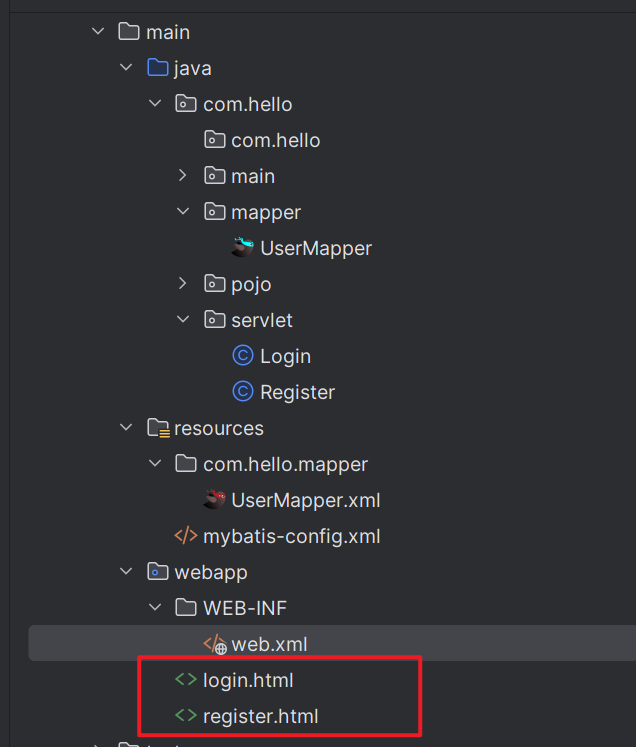 

#### 代码效果

我用的是get

[localhost:9527/untitled19_war/register?username=许闰博dsasad&password=dsadas](http://localhost:9527/untitled19_war/register?username=许闰博dsasad&password=dsadas)

如果是post就不会在请求行显示用户输入的信息了

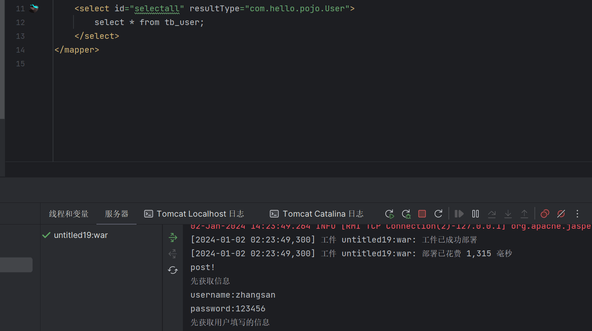

## SqlSessionFactory工具类抽取

### 问题导入

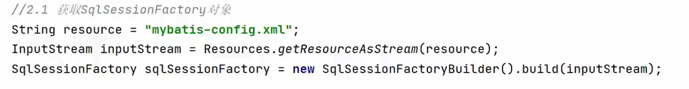 

问题:

> 每一个Servlet服务都要写这些东西
>
> 多个工厂就意味着多个连接池，非常消耗性能
>
> 代码重复

### 解决问题

#### 创建utils包下的获取工厂类

```java
package com.hello.utils;

import org.apache.ibatis.io.Resources;
import org.apache.ibatis.session.SqlSessionFactory;
import org.apache.ibatis.session.SqlSessionFactoryBuilder;

import java.io.IOException;
import java.io.InputStream;

public class Getfactory {
    private static SqlSessionFactory sqlSessionFactory;
    static {

        String resource = "mybatis-config.xml";
        InputStream inputStream = null;
        try {
            inputStream = Resources.getResourceAsStream(resource);
        } catch (IOException e) {
            throw new RuntimeException(e);
        }
        sqlSessionFactory = new SqlSessionFactoryBuilder().build(inputStream);

    }

    public static SqlSessionFactory getsqlsessionfactory(){
        return  sqlSessionFactory;
    }
}

```

#### 优化前

```java
@Override
    protected void doGet(HttpServletRequest req, HttpServletResponse resp) throws ServletException, IOException {
        System.out.println("先获取信息");
        resp.setHeader("Content-Type", "text/html;charset=utf-8");
        String username=req.getParameter("username");
        String password=req.getParameter("password");
        String resource = "mybatis-config.xml";
        InputStream inputStream = Resources.getResourceAsStream(resource);
        SqlSessionFactory sqlSessionFactory = new SqlSessionFactoryBuilder().build(inputStream);

        //获取Sqlsussion对象
        SqlSession sqlSession=sqlSessionFactory.openSession();
        UserMapper userMapper=sqlSession.getMapper(UserMapper.class);
        User user=userMapper.select(username,password);
        //调用完SQL就可以关闭了
        sqlSession.close();

    }


```

#### 优化后；

```java
@Override
    protected void doGet(HttpServletRequest req, HttpServletResponse resp) throws ServletException, IOException {
        System.out.println("先获取信息");
        resp.setHeader("Content-Type", "text/html;charset=utf-8");
        String username=req.getParameter("username");
        String password=req.getParameter("password");
        SqlSession sqlSession= Getfactory.getsqlsessionfactory().openSession(true);
        UserMapper userMapper=sqlSession.getMapper(UserMapper.class);
        User user=userMapper.select(username,password);
        //调用完SQL就可以关闭了
        sqlSession.close();

    }
```

#### 总结一下

> 使用 MyBatis 框架的 Java 类，主要涉及 MyBatis 的 `SqlSessionFactory` 的创建，以及将局部变量提升为成员变量的处理。
>
> 1. **创建 SqlSessionFactory:**
>
>    ```java
>    String resource = "mybatis-config.xml";
>    InputStream inputStream = null;
>    try {
>        inputStream = Resources.getResourceAsStream(resource);
>    } catch (IOException e) {
>        throw new RuntimeException(e);
>    }
>    sqlSessionFactory = new SqlSessionFactoryBuilder().build(inputStream);
>    ```
>
>    - `mybatis-config.xml` 是 MyBatis 的配置文件，它包含有关数据源、事务管理等的配置信息。
>    - `Resources.getResourceAsStream(resource)` 用于获取配置文件的输入流。
>    - `SqlSessionFactoryBuilder().build(inputStream)` 用于构建 `SqlSessionFactory` 实例。`SqlSessionFactory` 是 MyBatis 中负责创建 `SqlSession` 实例的工厂。
>    - ==用try/catch包裹起来是因为静态代码块不能抛出异常==
>
> 2. **将局部变量提升为成员变量:**
>
>    ```java
>    private static SqlSessionFactory sqlSessionFactory;
>    ```
>
>    - `sqlSessionFactory` 是一个静态成员变量，被声明为 `private static`，**这意味着它属于类级别，而不是实例级别。这样的设计使得该工厂在整个类中都可以被访问，而不仅仅是在构造方法中。**
>
> 3. **提供访问 SqlSessionFactory 的方法:**
>
>    ```java
>    public static SqlSessionFactory getSqlSessionFactory() {
>        return sqlSessionFactory;
>    }
>    ```
>
>    - `getSqlSessionFactory` 方法用于获取 `SqlSessionFactory` 实例。由于 `sqlSessionFactory` 是私有的，这个方法提供了对其访问的公共接口。
>
> 4. **关于思想:**
>
>    - 这段代码体现了单例模式的思想，通过静态成员变量和静态方法，确保在应用程序中只有一个 `SqlSessionFactory` 实例。
>    - 提升局部变量为成员变量可以在整个类中重复使用，避免了多次创建 `SqlSessionFactory` 的开销，提高了效率。
>    - 使用异常处理来处理 `IOException`，并将其转换为 `RuntimeException`，这样的设计使得代码更加健壮，减少了编写代码时的错误。
>
> 总体来说，这是一个典型的 MyBatis 配置管理类，负责创建和提供全局唯一的 `SqlSessionFactory` 实例，方便其他地方**获取并使用该实例进行数据库操作**。
>
> ---
>
> sqlsession对象是坚决不能抽取出来的，这个相当于一个连接，所有功能都用同一个连接，那还怎么管理事务？

代码替换后仍然正常的。

