# Linux


[Centos](http://mirrors.aliyun.com/centos/7.9.2009/isos/x86_64/)

---

[VMware16的安装及VMware配置Linux虚拟机(详解版)_vmware16安装-CSDN博客](https://blog.csdn.net/m0_50519965/article/details/116175873?ops_request_misc=%7B%22request%5Fid%22%3A%22169465038316800188541621%22%2C%22scm%22%3A%2220140713.130102334..%22%7D&request_id=169465038316800188541621&biz_id=0&utm_medium=distribute.pc_search_result.none-task-blog-2~all~top_positive~default-1-116175873-null-null.142^v93^control&utm_term=vmware16虚拟机安装教程&spm=1018.2226.3001.4187)

## Linux导言

Linux 是一种自由和开放源码的类 UNIX 操作系统。

Linux 英文解释为 **Linux is not Unix**。

Linux 是在 1991 由林纳斯·托瓦兹在赫尔辛基大学上学时创立的，主要受到 Minix 和 Unix 思想的启发。

本教程，我们将为大家介绍如何使用 Linux。

Linux 其实很容易学，相信你们能很快学会。


## 适配

 Linux 的发行版本 Centos 为例来为大家介绍 Linux 系统的应用。

## 开源 的linux

Linux 遵循 GNU 通用公共许可证（GPL），任何个人和机构都可以自由地使用 Linux 的所有底层源代码，也可以自由地修改和再发布。

由于 Linux 是自由软件，任何人都可以创建一个符合自己需求的 Linux 发行版。

目前市面上较知名的发行版有：Ubuntu、RedHat、CentOS、Debian、Fedora、SuSE、OpenSUSE、Arch Linux、SolusOS 等。


## Linux简介

Linux 内核最初只是由芬兰人==林纳斯·托瓦兹==（Linus Torvalds）在赫尔辛基大学上学时出于个人爱好而编写的。

Linux 是一套免费使用和自由传播的类 Unix 操作系统，是一个基于 POSIX 和 UNIX 的多用户、多任务、支持多线程和多 CPU 的操作系统。

Linux 能运行主要的 UNIX 工具软件、应用程序和网络协议。它支持 32 位和 64 位硬件。Linux 继承了 Unix 以网络为核心的设计思想，是一个性能稳定的多用户网络操作系统。

### Linux

1. Linux内核（最核心的功能）
2. 系统级应用程序（出厂自带的程序）
3. 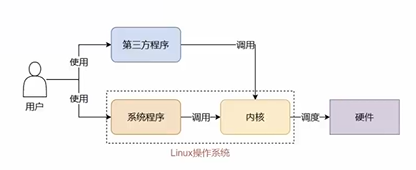

www.kernel.org内核

## Linux应用领域

今天各种场合都有使用各种 Linux 发行版，从嵌入式设备到超级计算机，并且在服务器领域确定了地位，通常服务器使用 LAMP（Linux + Apache + MySQL + PHP）或 LNMP（Linux + Nginx+ MySQL + PHP）组合。

目前 Linux 不仅在家庭与企业中使用，并且在政府中也很受欢迎。

- 巴西联邦政府由于支持 Linux 而世界闻名。
- 有新闻报道俄罗斯军队自己制造的 Linux 发布版的，做为 G.H.ost 项目已经取得成果。
- 印度的 Kerala 联邦计划在向全联邦的高中推广使用 Linux。
- 中华人民共和国为取得技术独立，在龙芯处理器中排他性地使用 Linux。
- 在西班牙的一些地区开发了自己的 Linux 发布版，并且在政府与教育领域广泛使用，如 Extremadura 地区的 gnuLinEx 和 Andalusia 地区的 Guadalinex。
- 葡萄牙同样使用自己的 Linux 发布版 Caixa Mágica，用于 Magalh?es 笔记本电脑和 e-escola 政府软件。
- 法国和德国同样开始逐步采用 Linux。

## Linux&Windows

目前国内 Linux 更多的是应用于服务器上，而桌面操作系统更多使用的是 Windows。主要区别如下


## Linux 系统启动过程

linux启动时我们会看到许多启动信息。

Linux系统的启动过程并不是大家想象中的那么复杂，其过程可以分为5个阶段：

- 内核的引导。
- 运行 init。
- 系统初始化。
- 建立终端 。
- 用户登录系统。

>init程序的类型：

> - **SysV:** init, CentOS 5之前, 配置文件： /etc/inittab。
> - **Upstart:** init,CentOS 6, 配置文件： /etc/inittab, /etc/init/*.conf。
> - **Systemd：** systemd, CentOS 7,配置文件： /usr/lib/systemd/system、 /etc/systemd/system。

### 内核引导

当计算机打开电源后，首先是==BIOS开机自检，==按照BIOS中设置的启动设备（通常是硬盘）来启动。

操作系统接管硬件以后，==首先读入 /boot 目录下的内核文件。==

### 运行Init

==init 进程是系统所有进程的起点==，你可以把它比拟成==系统所有进程的老祖宗==，==没有这个进程，系统中任何进程都不会启动。==

init 程序首先是需要读取配置文件 /etc/inittab。


==真正的rc启动脚本实际上都是放在/etc/rc.d/init.d/目录下。==

#### 运行级别

> 1. 运行级别0（halt）：系统关机，无法执行任何任务。
> 2. 运行级别1（single user）：单用户模式，系统进入最小化的运行环境，只有root用户可以登录。用于系统维护和故障排除。
> 3. 运行级别2（multi-user）：多用户模式，没有图形界面（GUI），支持网络服务。这是命令行模式下的标准运行级别。
> 4. 运行级别3（multi-user with networking）：和运行级别2类似，但同时启动网络服务，适用于服务器环境。
> 5. 运行级别4（unused）：保留给用户自定义的运行级别。
> 6. 运行级别5（graphical）：图形界面（GUI）模式，通常基于X Window系统。适用于桌面系统。
> 7. 运行级别6（reboot）：系统重启。

许多程序需要开机启动。它们在Windows叫做"服务"（service），在Linux就叫做"守护进程"（daemon）。

==init进程的一大任务，就是去运行这些开机启动的程序。==

但是，==不同的场合需要启动不同的程序==，比如用作服务器时，需要启动Apache，用作桌面就不需要。

Linux允许为不同的场合，分配不同的开机启动程序，这就叫做"运行级别"（runlevel）。也就是说，启动时根据"运行级别"，确定要运行哪些程序。

### 系统初始化

在init的配置文件中有这么一行： si::sysinit:/etc/rc.d/rc.sysinit　它调用执行了/etc/rc.d/rc.sysinit，而rc.sysinit是一个bash shell的脚本，它主要是完成一些系统初始化的工作，rc.sysinit是每一个运行级别都要首先运行的重要脚本。

==它主要完成的工作有：激活交换分区，检查磁盘，加载硬件模块以及其它一些需要优先执行任务。==

```
l5:5:wait:/etc/rc.d/rc 5
```

### 建立终端

rc执行完毕后，返回init。这时基本系统环境已经设置好了，各种守护进程也已经启动了。

init接下来会打开6个终端，以便用户登录系统。在inittab中的以下6行就是定义了6个终端

```
1:2345:respawn:/sbin/mingetty tty1
2:2345:respawn:/sbin/mingetty tty2
3:2345:respawn:/sbin/mingetty tty3
4:2345:respawn:/sbin/mingetty tty4
5:2345:respawn:/sbin/mingetty tty5
6:2345:respawn:/sbin/mingetty tty6

```

同时它会显示一个文本登录界面，这个界面就是我们经常看到的登录界面，在这个登录界面中会提示用户输入用户名，而用户输入的用户将作为参数传给login程序来验证用户的身份。

### 用户登录系统

一般来说，用户的登录方式有三种：

- （1）命令行登录
- （2）ssh登录
- （3）图形界面登录

对于运行级别为5的图形方式用户来说，他们的登录是通过一个图形化的登录界面。登录成功后可以直接进入 KDE、Gnome 等窗口管理器。

而本文主要讲的还是文本方式登录的情况：当我们看到mingetty的登录界面时，我们就可以输入用户名和密码来登录系统了。

Linux 的账号验证程序是 login，login 会接收 mingetty 传来的用户名作为用户名参数。

然后 login 会对用户名进行分析：如果用户名不是 root，且存在 /etc/nologin 文件，login 将输出 nologin 文件的内容，然后退出。

这通常用来系统维护时防止非root用户登录。只有/etc/securetty中登记了的终端才允许 root 用户登录，如果不存在这个文件，则 root 用户可以在任何终端上登录。

/etc/usertty文件用于对用户作出附加访问限制，如果不存在这个文件，则没有其他限制。

#### 图形模式与文字模式的切换方式

Linux预设提供了六个命令窗口终端机让我们来登录。

默认我们登录的就是第一个窗口，也就是tty1，这个六个窗口分别为tty1,tty2 … tty6，你可以按下Ctrl + Alt + F1 ~ F6 来切换它们。

如果你安装了图形界面，默认情况下是进入图形界面的，此时你就可以按Ctrl + Alt + F1 ~ F6来进入其中一个命令窗口界面。

当你进入命令窗口界面后再返回图形界面只要按下Ctrl + Alt + F7 就回来了。

==如果你用的vmware 虚拟机，命令窗口切换的快捷键为 Alt + Space + F1~F6. 如果你在图形界面下请按Alt + Shift + Ctrl + F1~F6 切换至命令窗口。==


### Linux 关机

在linux领域内大多用在服务器上，很少遇到关机的操作。毕竟服务器上跑一个服务是永无止境的，除非特殊情况下，不得已才会关机。

正确的关机流程为：sync > shutdown > reboot > halt

关机指令为：shutdown ，`你可以man shutdown 来看一下帮助文档。`

```
sync 将数据由内存同步到硬盘中。

shutdown 关机指令，你可以man shutdown 来看一下帮助文档。例如你可以运行如下命令关机：

shutdown –h 10 ‘This server will shutdown after 10 mins’ 这个命令告诉大家，计算机将在10分钟后关机，并且会显示在登陆用户的当前屏幕中。

shutdown –h now 立马关机

shutdown –h 20:25 系统会在今天20:25关机

shutdown –h +10 十分钟后关机

shutdown –r now 系统立马重启

shutdown –r +10 系统十分钟后重启

reboot 就是重启，等同于 shutdown –r now

halt 关闭系统，等同于shutdown –h now 和 poweroff

```

==不管是重启系统还是关闭系统，首先要运行 **sync** 命令，把内存中的数据写到磁盘中==

## Linux系统目录结构

登录系统后，在当前命令窗口下输入命令：

```
ls /
```


以下是对这些目录的解释：

- **/bin**：
  bin 是 ==Binaries (二进制文件) 的缩写==, 这个目录存放着最经常使用的命令。

- **/boot：**
  这里存放的是==启动 Linux 时使用的一些核心文件，包括一些连接文件以及镜像文件==。

- **/dev ：**
  dev 是 Device(设备) 的缩写, 该目录下存放的是 Linux 的外部设备，在 Linux 中访问设备的方式和访问文件的方式是相同的。

- **/etc：**
  etc 是 Etcetera(等等) 的缩写,这个目录用来存放所有的==系统管理所需要的配置文件和子目录==。

- **/home**：
  用户的主目录，在 Linux 中，==每个用户都有一个自己的目录==，一般该目录名是以用户的账号命名的，如上图中的 alice、bob 和 eve。

- **/lib**：
  lib 是 Library(库) 的缩写这个目录里存放着系统最基本的动态连接共享库，其作用类似于 Windows 里的 DLL 文件。几乎所有的应用程序都需要用到这些共享库。

- **/lost+found**：
  这个目录一般情况下是空的，当系统非法关机后，这里就存放了一些文件。

- **/media**：
  linux 系统会自动识别一些设备，例如U盘、光驱等等，当识别后，Linux 会把识别的设备挂载到这个目录下。

- **/mnt**：
  系统提供该目录是为了让用户临时挂载别的文件系统的，我们可以将光驱挂载在 /mnt/ 上，然后进入该目录就可以查看光驱里的内容了。

- **/opt**：
  opt 是 optional(可选) 的缩写，这是给主机额外安装软件所摆放的目录。比如你安装一个ORACLE数据库则就可以放到这个目录下。默认是空的。

- **/proc**：
  proc 是 Processes(进程) 的缩写，/proc 是一种伪文件系统（也即虚拟文件系统），存储的是当前内核运行状态的一系列特殊文件，这个目录是一个虚拟的目录，它是系统内存的映射，我们可以通过直接访问这个目录来获取系统信息。
  这个目录的内容不在硬盘上而是在内存里，我们也可以直接修改里面的某些文件，比如可以通过下面的命令来屏蔽主机的ping命令，使别人无法ping你的机器：

  ```
  echo 1 > /proc/sys/net/ipv4/icmp_echo_ignore_all
  ```

- **/root**：
  ==该目录为系统管理员，也称作超级权限者的用户主目录。==

- **/sbin**：
  s 就是 Super User 的意思，是 Superuser Binaries (超级用户的二进制文件) 的缩写，这里存放的是系统管理员使用的系统管理程序。

- **/selinux**：
   这个目录是 Redhat/CentOS 所特有的目录，Selinux 是一个安全机制，类似于 windows 的防火墙，但是这套机制比较复杂，这个目录就是存放selinux相关的文件的。

- **/srv**：
   该目录存放一些服务启动之后需要提取的数据。

- **/sys**：

  这是 Linux2.6 内核的一个很大的变化。该目录下安装了 2.6 内核中新出现的一个文件系统 sysfs 。

  sysfs 文件系统集成了下面3种文件系统的信息：针对进程信息的 proc 文件系统、针对设备的 devfs 文件系统以及针对伪终端的 devpts 文件系统。

  该文件系统是内核设备树的一个直观反映。

  当一个内核对象被创建的时候，对应的文件和目录也在内核对象子系统中被创建。

- **/tmp**：
  tmp 是 temporary(临时) 的缩写这个目录是用来存放一些临时文件的。

- **/usr**：
   usr 是 unix shared resources(共享资源) 的缩写，这是一个非常重要的目录，用户的很多应用程序和文件都放在这个目录下，类似于 windows 下的 program files 目录。

- **/usr/bin：**
  系统用户使用的应用程序。

- **/usr/sbin：**
  超级用户使用的比较高级的管理程序和系统守护程序。

- **/usr/src：**
  内核源代码默认的放置目录。

- **/var**：
  var 是 variable(变量) 的缩写，这个目录中存放着在不断扩充着的东西，我们习惯将那些经常被修改的目录放在这个目录下。包括各种日志文件。

- **/run**：
  是一个临时文件系统，存储系统启动以来的信息。当系统重启时，这个目录下的文件应该被删掉或清除。如果你的系统上有 /var/run 目录，应该让它指向 run。

在 Linux 系统中，有几个目录是比较重要的，平时需要注意不要误删除或者随意更改内部文件。

**/etc**： 上边也提到了，这个是系统中的配置文件，如果你更改了该目录下的某个文件可能会导致系统不能启动。

**/bin, /sbin, /usr/bin, /usr/sbin**: 这是系统预设的执行文件的放置目录，比如 **ls** 就是在 **/bin/ls** 目录下的。

值得提出的是 **/bin**、**/usr/bin** 是给系统用户使用的指令（除 root 外的通用用户），而/sbin, /usr/sbin 则是给 root 使用的指令。

**/var**： 这是一个非常重要的目录，系统上跑了很多程序，那么每个程序都会有相应的日志产生，而这些日志就被记录到这个目录下，具体在 /var/log 目录下，另外 mail 的预设放置也是在这里。

## ==学会使用帮助==

```
不会的 --help
man 不会的
```

## Linux忘记密码解决办法

1. ==在开机时按下Shift键==，进入grub菜单。

2. 在grub菜单中选择要启动的CentOS内核版本，==并按下"e"键进入编辑模式。edit==

3. 在编辑模式中，找到以"linux16"开头的行，然后在该行的末尾添加以下内容：

```
rd.break enforcing=0
```

添加完毕后，按下Ctrl+X或F10来启动系统。

4. 系统启动后，进入emergency mode，并且会挂载根文件系统为只读模式。

5. 输入以下命令来重新挂载根文件系统为可写模式：

```
mount -o remount,rw /sysroot
```

6. 输入以下命令来切换到chroot环境：

```
chroot /sysroot
```

7. 输入以下命令来重置密码：

```
passwd username
```

其中，"username"为您忘记密码的账户名。

8. 输入以下命令来重新生成SELinux策略：

```
touch /.autorelabel
```

9. 输入以下命令来退出chroot环境：

```
exit
```

10. 输入以下命令来重新挂载根文件系统为只读模式：

```
mount -o remount,ro /sysroot
```

11. 输入以下命令来重启系统：

```
reboot
```

系统将会重新启动，并且您可以使用新密码登录您的CentOS Linux系统。请注意，这种方法只适用于您有root权限的情况。如果您没有root权限，您需要联系系统管理员或使用其他方法来重置密码。

## 使用命令行学习Linux

Linux大多使用命令行而不使用图形界面

==命令：本质上就是执行的二进制可执行程序==

优点:快，资源占用少

### FInalShell

[FinalShell官网 (hostbuf.com)](http://www.hostbuf.com/?install_fs)

第三方软件操控Linux

SSH

1. 在Vmware里输入ifconfig看到我们虚拟机的[IP](#ip)
2. 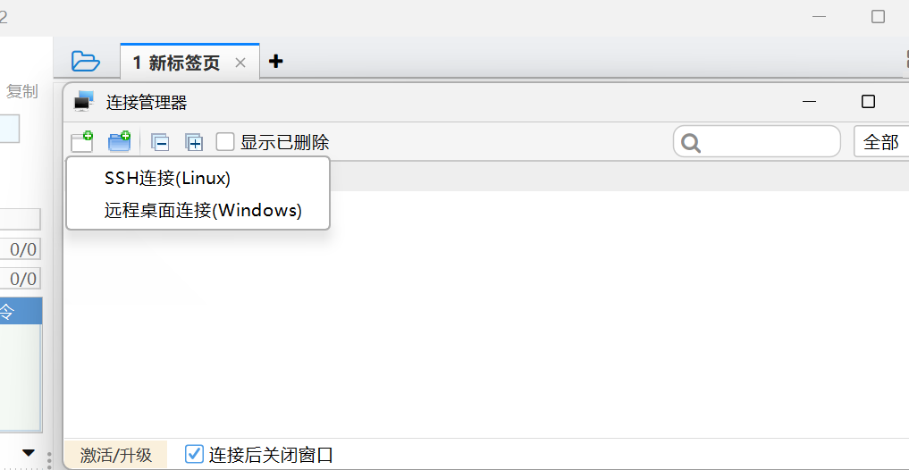
3. 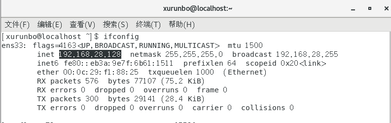
4. 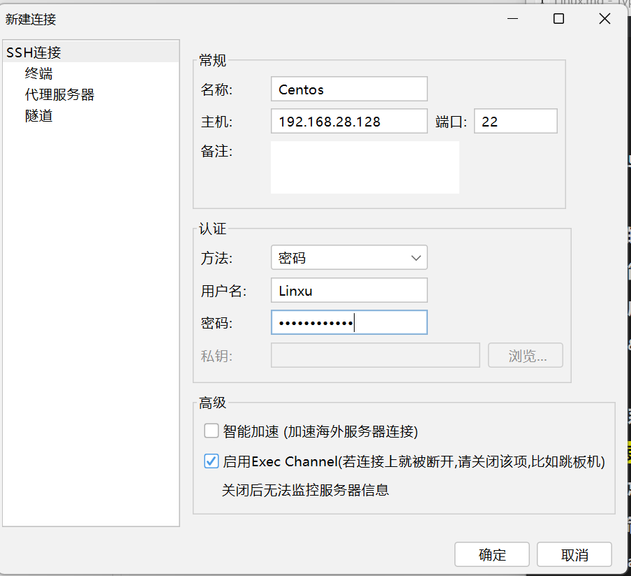
5. 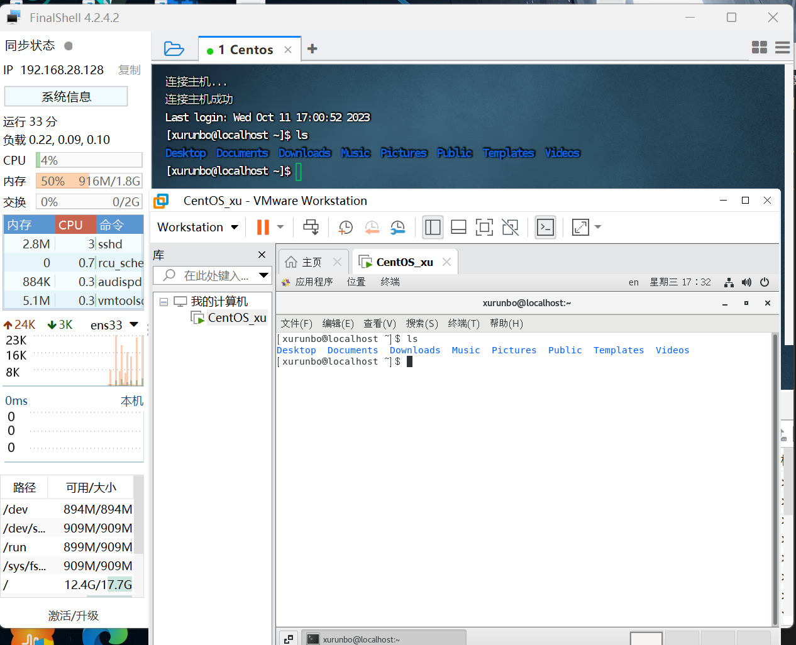

验证是否连接，二者都输入ls，结果一样！

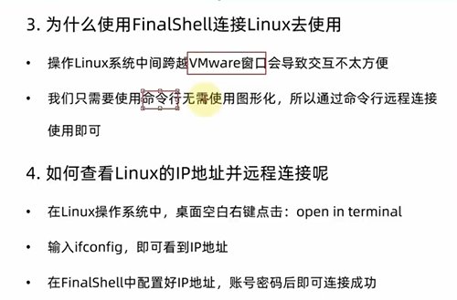

### ==虚拟机快照（后悔药）==

通过将当前的虚拟机的状态保存下来，在以后开源通过快照回复虚拟机到保存的状态。

==推荐在关机状态下进行快照==

make: 

1. 在Vmware里右键我们的虚拟机，快照管理器，然后
2. 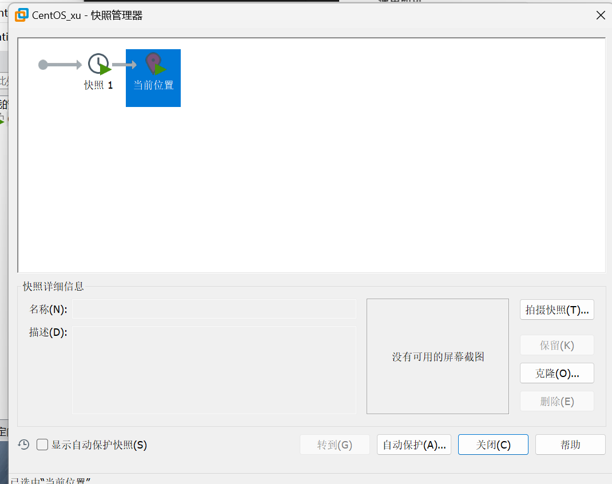
3. 转到拍照，然后转到想去的状态。

## Linux的目录结构

1. 没有盘符，==只有一个跟目录 / 所有的文件都在它下面==，windows可以由多个顶级目录CDE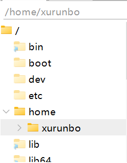

2. ==在Linux里路径的层级关系用   /  表示==，在window里用   \   表示

   > 形象记忆：windows的w的第一笔画
   >
   > Linux右边重变成了/-

   /home/xurunbo

3. 永远以/开始，/有两种含义

   1. 根目录
   2. 层次关系

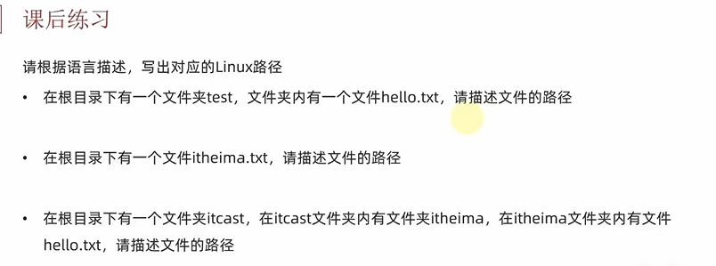

> 1. /test/hello.txt
> 2. /itheima.txt
> 3. /itcast/itheima/hello.txt

## ★★★Linux命令入门

### Linux命令基础

> 1. 什么是命令？
> 2. 命令的基本格式？

命令行：Linux的终端，用纯字符的形式操作系统，用各种命令去操作操作系统

给命令，它给我们字符化反馈

基础格式：

```
command [-options] [parametet]
```

**command: 命令本身**

**-options：可选的一些选项，控制命令的行为细节**

**parameter：命令的参数，多数用于命令的指向目标等**

==命令，选项，参数==

### ls命令

#### ls命令简介

> ls作用？
>
> 当前工作目录？
>
> HOME目录？
>
> 如何形象记忆？

function：列出目录下的内容

```
ls [-a -l -h] [linux路径]
```

默认情况下ls得到使当前==工作目录==下的内容（当前路径）


==当前登录用户的HOME目录作为工作目录，每一个用后都有这个HOME==

ls和ls /home/xurunbo是等价的


HOME目录：每一个用户在Linux系统的专属目录/home/用户

#### ls的参数和选项

> -a？
>
> -l？
>
> -h？

1. -a是all的意思,[==可以看到隐藏的文件/文件夹==]

   

2. **-l是list的意思，==以列表的形式表示==，并展示更多的信息，创建时间**

   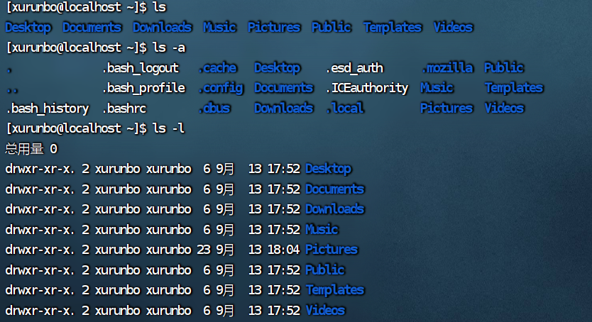

   > 二者的混合使用，既可以看到隐藏的东西，又以list的形式看、
   >
   > ```
   > ls -a -l /
   > ls -al /
   > ```
   >
   > 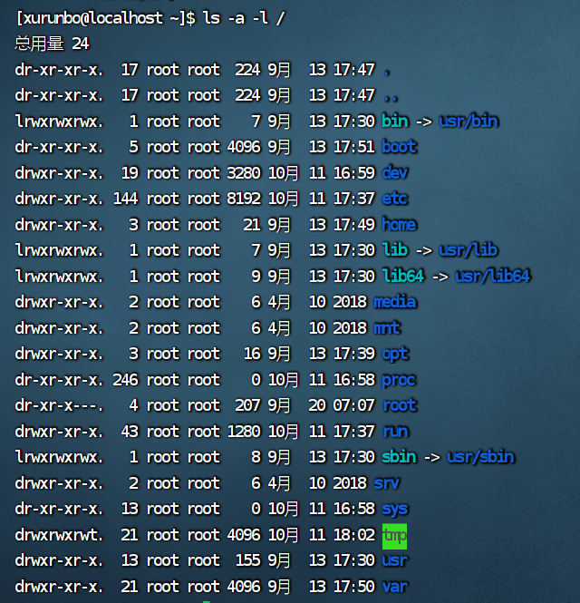

3. ==-h和-l一般一起出现，显示文件的大小信息==

   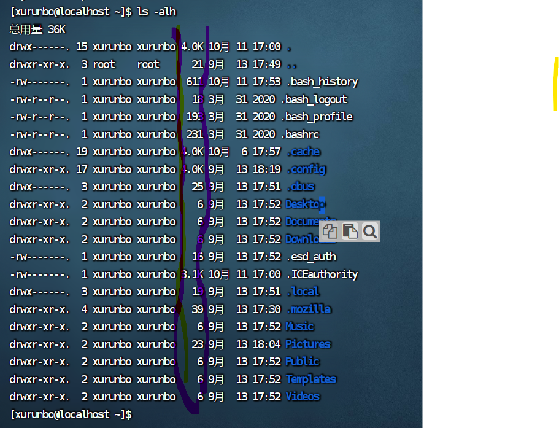

总结ls -alh一气呵成

list:动词，列出

### cd-pwd命令

#### cd切换工作目录

> cd如何切换工作目录？
>
> cd命令格式？有选项吗？

```
cd [Linux路径]
```

默认我们是在当前用户的工作目录如果想切换该怎么办呢?


```
cd 空格
```

回到我们当前用户的工作目录也就是/home/xurunbo

#### pwd命令

> pwd命令的作用？
>
> pwd命令格式？有选项和参数吗？
>
> pwd如何记忆？

function：==查看当前的目录==

```
pwd
```

==没有选项和参数==


pwd："Print Working Directory"打印工作中(当前)的目录

### 相对/绝对路径，和特殊路径符

> 相对和绝对路径的概念和写法？
>
> 掌握几种特殊的路径写法？
>
> 当前，上一级如何写？

绝对目录：==以 根目录/ 为起点找到目标文件==，路径以/开头

相对路径：==从当前目录为起点==，找目标文件


前面的 ~代表当前的工作目录/home/xurunbo

/ 代表根目录

文件夹名字 代表在这个文件夹下


特殊路径符

> 1. .      表示当前目录
> 2. ..           上一级 cd ..
> 3. ~       Home目录   ==/home/xurunbo  cd  

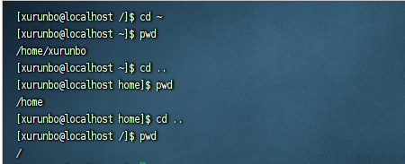

==相对路径方便==

例题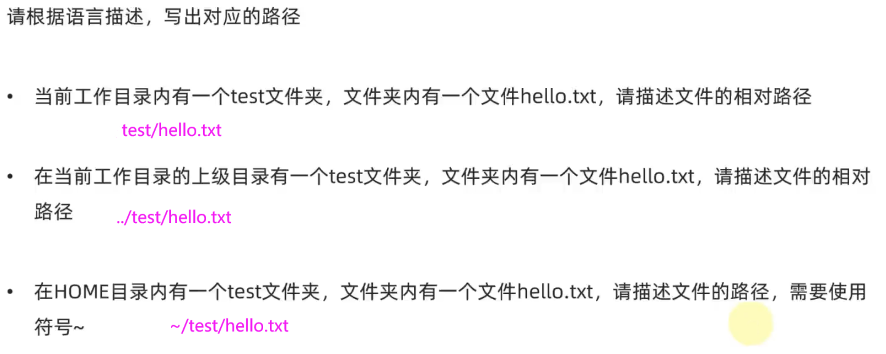

### mkdir命令 -p

> 1. mkdir是干什么的？
> 2. 如何使用？
> 3. 如何记忆-p mkdir？
> 4. 什么是权限问题？

function：创建新的目录（文件夹）

```
mkdir [-p] Linux路径
```

==-p表示自动创建不存在的父目录，用于创建连续多层级的目录==

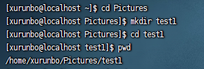


问题引入；

1. 创建连续的文件，或者说嵌套的。就无法成功
2. 需要加-p来完成


将其理解为 "parents"（父级目录）的缩写。通过使用 `-p` 参数，`mkdir` 命令会==自动创建指定路径上的所有父级目录，而不需要手动逐级创建。==

==注意权限问题，当我们出了home去操作就无法成功了==


### touch-cat-more命令

> 1. touch是干嘛的？有选项吗？
> 2. cat是干嘛的？有选项吗？
> 3. more是干嘛的？有选项吗？

#### touch命令(创文件)

> 1. 如何使用touch创建文件？
> 2. 语法格式？
> 3. 如何记忆？
> 4. 有选项吗？

function：创建文件.txt.............

```
touch Linux路径
```

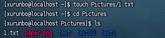

ls -h前缀是d的是文件夹，是-的代表文件

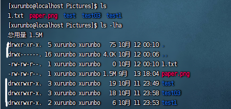

理解为 "touch"（触摸）文件的意思。通过使用 `touch` 命令，你可以 "触摸" 文件，即创建一个新的空文件或者更新文件的时间戳，而不改变文件的内容。

#### ==cat命令(查看文件)==

> 如何使用cat查看文件内容？
>
> 如何记忆？

```
cat Linux路径
```

`cat` 命令是用来查看文件内容的命令。它的名字 "cat" 是 "concatenate"（连接）的缩写。通过使用 `cat` 命令，你可以将一个或多个文件的内容连接起来，并将结果输出到标准输出（通常是终端）。


#### ==more命令(翻页查看文件)==

> 1. 和cat的区别？
> 2. 语法使用？
> 3. 如何往下加载？如何退出？

```
more Linux路径
```

cat是显示全部内容

more可以像电子书一样看一页一页，空格或者回车往下翻

q退出

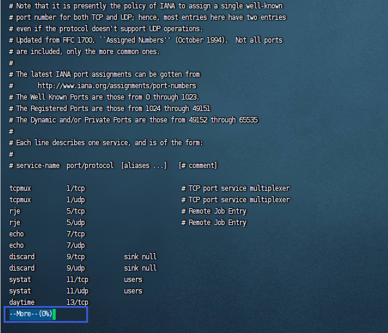

### cp-mv-rm命令

> 1. cp是干嘛的？


#### cp命令(复制)  -r

> 1. 语法格式？
> 2. 作用？
> 3. 如何记忆-r参数？

function：复制文件夹使用

```
cp [-r] 参数1 参数2
参数以是别人的作业，参数2是抄到哪里？target
```

如果目标不存在就创建并copy


==-r：代表当复制文件夹的时候递归！==recursively（递归地）


#### mv命令(移动文件)

> 1. 语法格式？
> 2. 有选项吗？
> 3. 改名效果是什么？》

```
mv 参数1 参数2
```

参数一是原来的位置，参数二是新的位置

==参数二是否存在的影响==

移动文件

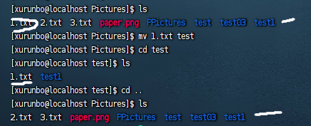

改名效果

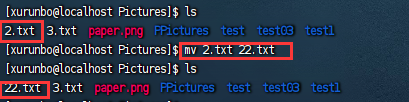

移动文件夹

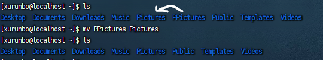

改名效果“当在同一个路径下移动且  == **目标不存在**==，也就是参数二不存在的时候就是改名效果

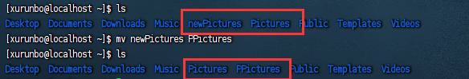

#### ==rm命令(删除文件)== -r -f

> 1. 语法格式？
> 2. 参数 -r -f作用？记忆方式？
> 2. r是recursively

```
rm [-r -f] 参数1 参数2 参数3 参数4。。。。。。。。。。。。。。。参数n
```

参数是被删除的文件

-r用于删除文件夹

-f是force是强制删除 而且一般用户的强力删除是没有确认信息的，root跟用户的删除有提示。

删除文件：

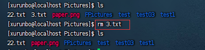

删除文件夹==-r也相当于递归recursively==

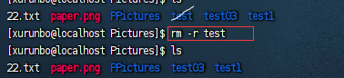

删除多个==追加多个参数就好了==

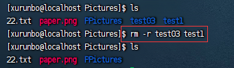

#### 通配符

rm命令支持通配符*用来模糊匹配

*可以匹配任意内容包括空

test*表示匹配任何以test结尾的内容

*test表示匹配任何以test开头的内容

*test表示匹配任何包含test的内容

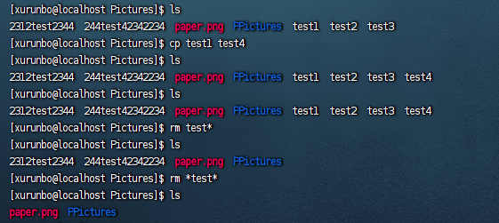

-f（提示给超级用户看的，当你不强力删除的时候）

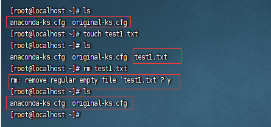

超级用户的登录 

> 1. ```
>    su - root
>    su -
>    输入密码
>    进入了
>    ```
>    
> 2. 想退出了直接exit
>
> 3. 删库跑路牢饭管饱
>
>    rm -rf /*
>
>    强制删除根目录下的所有文件

### which-find命令

> 1. which如何使用
> 2. find如何使用？

#### which(查找命令)

==命令cd，ls[其实本质就是二进制的可执行程序](#环境变量)==

> 1. 语法格式？
> 2. 查找什么的？

function找命令的位置

```
which 要查找的命令
```

#### find(查找文件)

==按照文件名==查找

1. ==(-name)按照文件名查找==

   ```
   find 起始路径 -name 所查找的文件名
   ```

   在使用 `find` 命令时， `-name` 选项用于指定要查找的文件名。

   ==如果文件名中不含有空格或其他特殊字符==，则不加双引号和加双引号的效果是相同的。

   所以最好还是带上

2. 全盘搜索(/)

   ```
   find / -name "test"
   ```

3. 配合通配符查找

   ```
    find / -name "test*"
   ```

==按照文件大小查找==

1. (-size)按照问年间大小查找

   ```
   find 起始路径 -size +|-n[kMG]
   ```

   -size通过文件大小查找，+|-代表大于和小于，n代表大小数字，kMG分别代表kB，MB，GB

2. ```
   find / -size +10k
   find / -size 10k找的是size=10kb的
   小写k
   find / -size +10M
   find / -size +10G
   ```


### grep-wc-管道符

> 1. 如何用grep命令过滤文件内容？
> 2. 如何用wc命令统计内容数量?
> 3. 管道符是什么？如何使用？


#### grep命令(过滤文件行)-n

> 如何使用和记忆？
>
> ==可以作为输入端口?==

function:从文件中通过指定关键字过滤文件行，哪一行包含关键字就被过滤出来了

```
grep [-n] "关键字" Linux文件路径(可以作为内容的输入端口)
```

关键字中不带空格和特殊符号的时候加不加“”都是ok的

==推荐加""这个习惯==

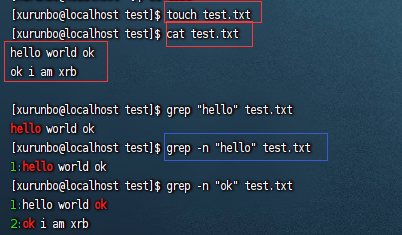

只要行中包含这个关键字就被过滤出来了

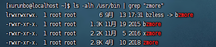

“g”、“r”、“e”、“p”，然后为每个字母找到一个关键词。例如，“g”可以代表“global”（全局），“r”可以代表“regular”（正则表达式），“e”可以代表“expression”（表达式），“p”可以代表“pattern”（模式）。这样，你可以将grep命令记忆为“全局正则表达式模式”。


==可以作为内容的输入端口)==

和管道符配合使用


#### wc命令(文件内容统计)★★★★★

> 如何使用和记忆？
>
> 也可以

function：统计文件内容的信息：

```
wc [-c|-w|-l-m] Linux文件路径
```

==字节数是代表的大小，字符数代表的是字母个数，==

 -c, --bytes            print the byte counts
  -m, --chars            print the character counts
  -l, --lines            print the newline counts

 -L, --max-line-length 显示最长行的长度

 -w, --words                   显示单词计数

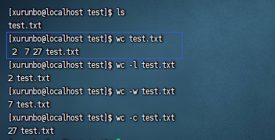

==默认是得到，行数，单词数，字节数.==

w是word    c是character，统计单词字符的

#### 管道符

==|==

左边|右边

左边 | 右边

都是ok的

==将左边命令得到的结果作为右边命令的输入==


只要能产生内容输入的命令都可以和管道符配合使用

==Linux文件路径(可以作为内容的输入端口)==

嵌套使用

```
cat test.txt | grep -n "ok" | wc -l
```

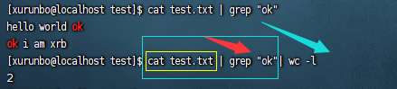

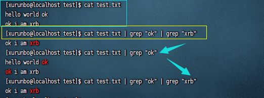

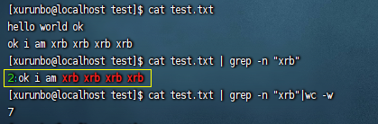


### echo-tali命令-重定向符号

> 1. echo如何使用？
> 2. tail如何使用？
> 3. 什么是重定向符号?
> 4. 加不加"" 有区别吗？

#### echo命令

> echo是干什么的如何使用？

function:打印语句

```
echo "要输出的内容"
```

==内容比较复制的时候加上""更好==

```
echo "hello world"
echo hello world
虽然二者都一样但是后者容易误解为参数
```

 

计算

 

#### 反引号``(模板字符)

> 类似python的模板字符串

function :当我们想echo输出命令的内容的时候而不是输出命令的文本

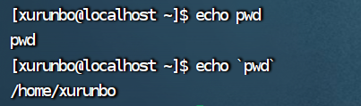


#### 重定向>和>>(写入)

> 如何使用？区分> 和 >>

function:向文件写入内容，修改内容

\> 的时候会覆盖掉原来的内容


\>\>的时候会追加在原来的内容的后面

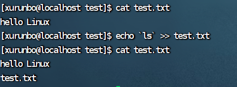

==只要是能产生输出的命令都可以作为>和>>的左值==

#### tail命令(查看尾) -f -num

> 如何使用？
>
> 两个参数都代表什么意思？
>
> num是简单的-num吗还是-一个确实的参数？

==(持续)function:查看一个文件的尾巴的倒数num行数据==

`tail -num text.txt`

num要写一个实际的数

```
tail -20 text.txt
而不是
tail -num text.txt
```

默认是看倒数10条数据

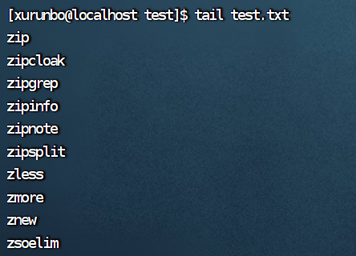

==-f监听开始==

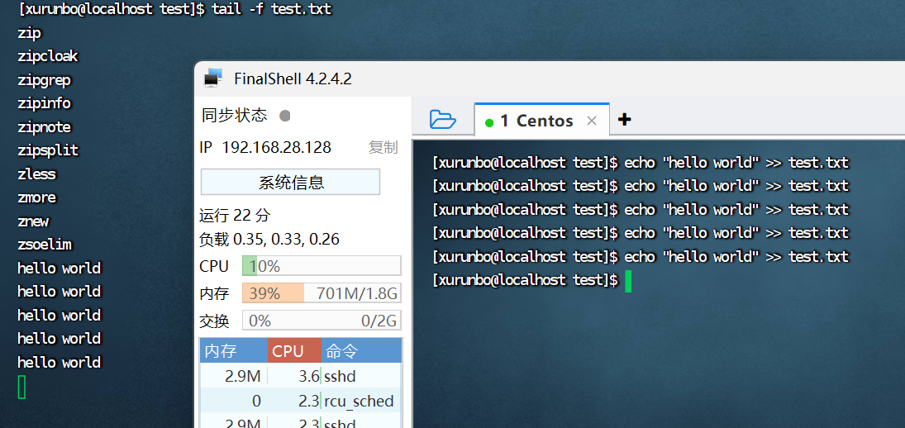

就可以实时看新的信息了

==开始监听	和指定倒数多少行已经没意义了==

```
tail -f Linux路径
```

想要退出就CTRL+C

### VI编辑器


> 1. ==命令模式==
>
>    所敲的案件编译器都理解为命令，驱动执行不同的功能，不能自由的编辑文本
>
> 2. ==输入模式==
>
>    也就是所谓的编辑模式，可以自由的文本便辑
>
> 3. ==底线命令模式==
>
>    以：开始，通常用于文件的保存，退出

vim=vi++

```
vi Linux文件路径
vim Linux文件路径
```

==如果文件路径表示文件就用于编辑已有文件==

==如果文件路径的文件不存在吗就用于编辑新文件==

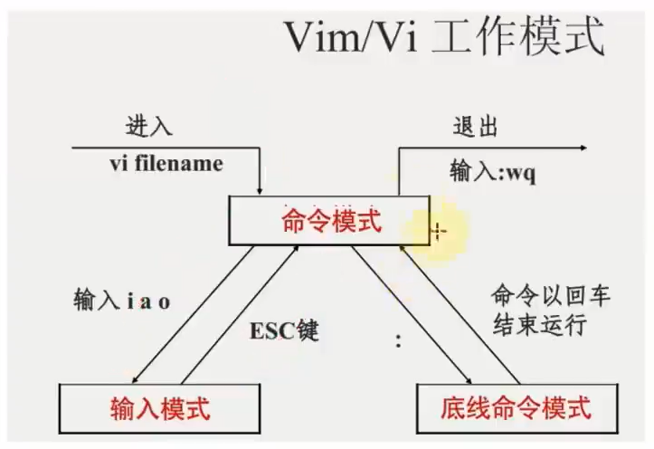

> 1. 默认进入的是命令模式
>
>    1. i，进入输入模式。ESC回到命令模式
>    2. 在命令模式下，输入dd删除一行的内容，u是撤销CTRL是反向撤销
>
> 2. 输入:进入底线命令模式
>
>    wq：保存并退出
>
>    w是写入并保存，但是不退出
>
>    q单独退出，不保存
>
>    输入wq再按下enter
>
> 3. 默认情况下修改了内容但是不保存想直接退出，是会提示的
>
>    
>
>    ==强制退出!q==
>
>    
>
>    命令模式下的快捷键
>
>    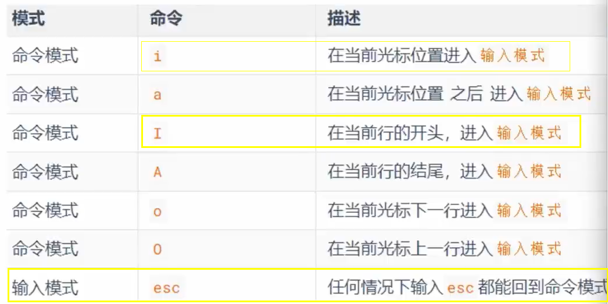
>
>    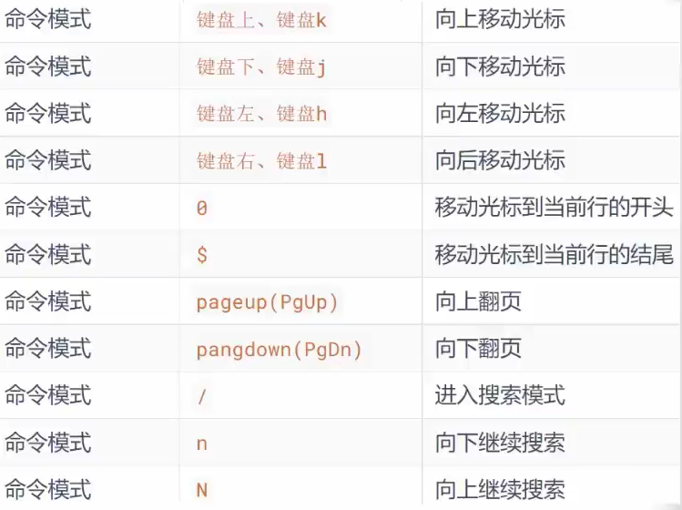
>
>    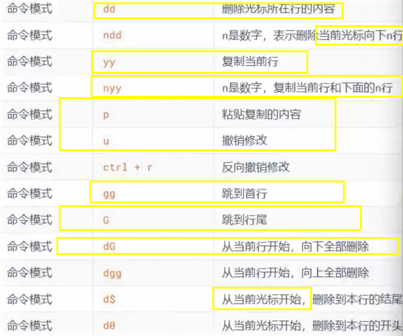
>
>    gg,G
>
>    dgg,dG
>
>    删除的包含当前行
>
>    底线命令模式下:
>
>    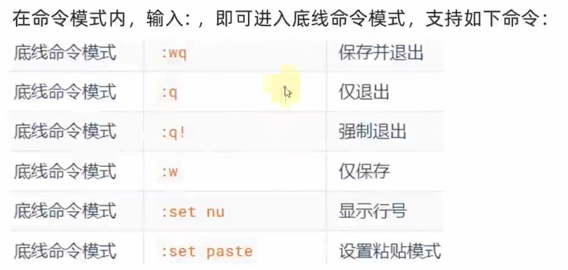
>
>    set paste用于保证i输入的时候粘贴的内容不会错乱
>    

### Linux的root用户

windows和mac，Linux都是采用多用户的管理模式进行权限管理

root用户有最大的系统从操作权限

也就是有的手机root是干嘛的了

```
su - root
```

==su-------------S(switch)----W(which)==

### ==选择用户==

进入root用户

```
su [-] 用户名
```

==-可选，表示是否在切换环境后是否加载环境变量==

==想要退出当前用户，就用exit或者CTRL+D==

》》》》

> 一般情况下，普通用户在home内权限是不受限制的
>
> 但是出来home大多数都只有制度和执行权限，没有修改权限

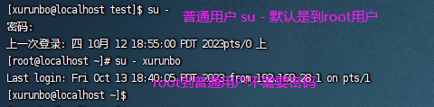

### ==sudo命令==

> 是干什么的？
>
> 每个用户都可以随便使用sudo吗？
>
> 如何给用户添加认证?
>
> 有了sudo认证的普通用户可以方便的进入root吗？如何输？

普通用户出了home就很弱鸡了

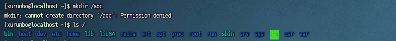

因为sudo是给普通用户的当前命令添加临时的root权限

但是也不是随便每个用户都可以随便使用sudo的，得有root的认证

如何认证呢？

```
进入root里面
visudo
命令模式下输入G到最下面
用户名 ALL=(ALL)	NOPASSWD: ALL
:wq
```

就实现了给用户名添加了sudu认证

 

==当一个用户有了sudu认证之后，也就是说有了root的钥匙 了，也可以进入root的家==

```
sudo su -
就进入了root的家
```

### 用户&用户组

> 1. 用户和用户组和root的关系
> 2. 如何创建和删除组？
> 3. 普通用户可以创建组吗？
> 3. ==Linux权限管控的单元式用户级别和用户组级别==

Linux：可以配置多个用户

​	可以配置多个用户组

用户可以加入到多个用户组中

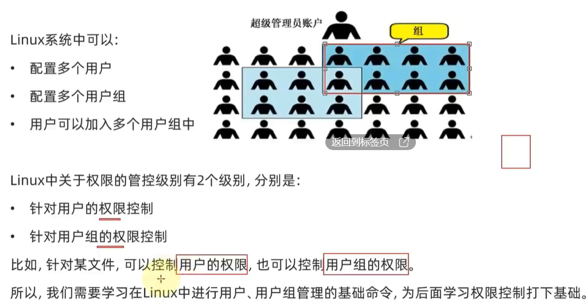

> 创建用户组
>
> ```
> groupadd 用户组名
> ```
>
> 删除用户组
>
> ```
> groupdel 用户组名
> ```
>
> ==二者必须在root用户执行==

### 用户管理

> 有了用户组后，如何创建用户？
>
> 如何删除用户呢？
>
> 如何查看用户是哪一个组的呢？
>
> 如何修改用户的组呢？
>
> 如何形象记忆-g和-d和-r呢

==都得在root下或者sudo执行==

1. 创建用户

   ```
   useradd [-g -d] 用户名
   ```

   -g是用来指定用户的组的，如果没有那就是默认创建一个用户名的组并且加入一个用户。

   -d是用来指定用户home路径，默认是在/home/用户的

   > 默认创建
   >
   > 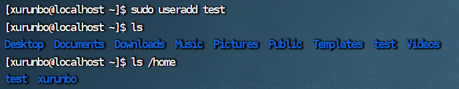
   >
   > 使用-g指定用户的组和使用-d指定用户的home路径
   >
   > 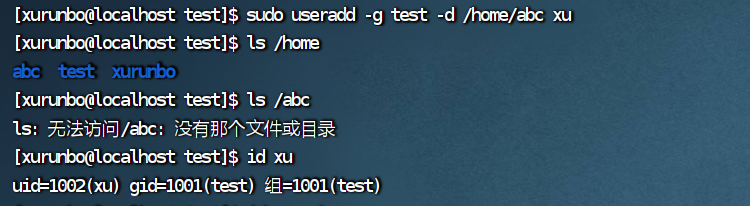
   >
   > ==-g（group组指定用户的组的）==
   >
   > ==-d（directory目录指定用户的home路径）==

2. 删除用户

   > ```
   > userdel 用户名
   > ```
   >
   > 这样是删除了这个用户，但是没有删除用户在home目录
   >
   > 
   >
   > 删除彻底
   >
   > ==-r就是recursively删除一个目录（文件夹)就得迭代！==

3. 查看用户所属的组

   > ```
   > id 用户名
   > ```
   >
   > 
   >
   > 得到用户名，用户的所属组

4. 修改用户所属的组

   -a 是add添加到G的组下面

   ==原来的还在那个组里面，一个用户可以在多个组==[【2023最新版】Hexo+github搭建个人博客并绑定个人域名_hexo部署github绑定自定义域名-CSDN博客](https://blog.csdn.net/wushibo123/article/details/124619123)

   -G也就是group咯

   这个顺序没必要记忆用-h查看帮助文档

   ```
   usermod -aG 新的组 要被修改的用户名
   ```

   

5. 查看所有用户

   ```
   cat /etc/passwd
   ```

   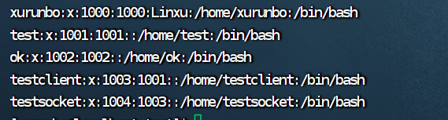

6. 查看所有的组

   ```
   ls /etc/group
   ```


**查看组和用户的另一种方法**

> 查看组
>
> ```
> getent group
> 等价于
> cat /etc/group
> ```
>
> 查看用户
>
> ```
> getent passwd
> cat /etc/passwd
> ```
>
> 


### 查看Linux权限管控信息

> 如何查看权限？
>
> 认知权限信息?

```
ls -al
```

1. 第一列代表文件/目录的权限。
2. ==第二列代表文件/目录的硬链接数==。
3. 第三列代表文件/目录的所有者。   **==所属用户==**
4. 第四列代表文件/目录的所属组。
5. 第五列代表文件/目录的大小（以字节为单位）。
6. 第六列代表文件/目录的修改日期和时间。
7. 第七列代表文件/目录的名称。

> 硬链接数是一个重要的属性，它表示有多少个文件名指向同一个文件或目录。
>
> [当硬链接数为0时，文件或目录被认为是删除的，占用的磁盘空间会被释放。](#硬连接&删除)
>
> 只有当所有硬链接都被删除时，文件或目录才会真正被删除。

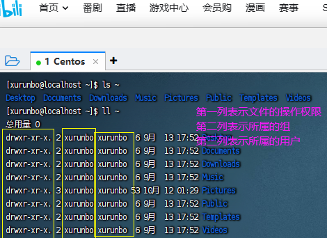

==认知权限信息==


分为10个槽位

x   xyz  xyz xyz

==从左到右，由近到远==

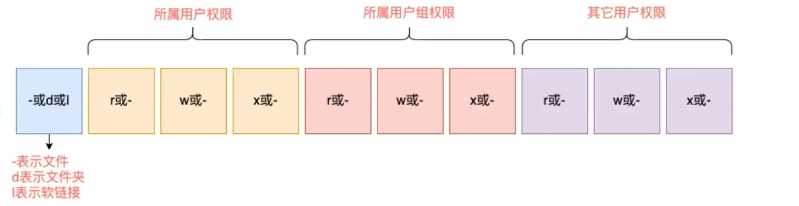

l:表示是[软连接](#权限l)/硬连接

**d:directory表示是一个文件夹**

**-:表示是一个文件**

==r：读，w：写，x：执行==

x------excute

>  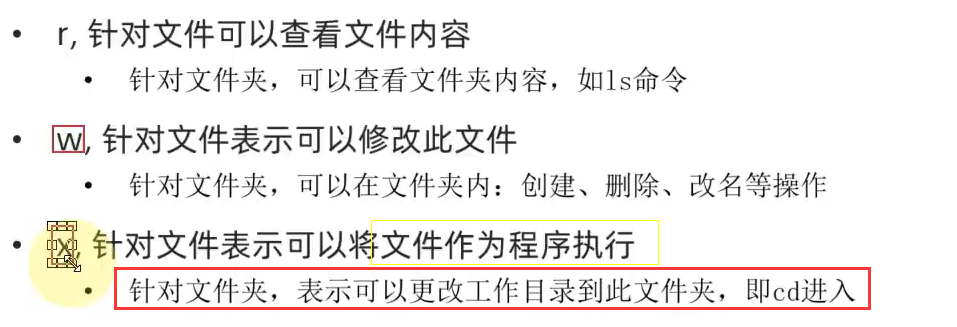
>
> 


### chmod命令

> 需要iroot权限吗
>
> -R是干嘛的
>
> chmod如何形象记忆？（change）（mode）
>
> 谁都可以修改吗？


==需要是root或者文件/文件夹的所属用户==


》》》《《《

#### 所属用户

所属用户是指创建该文件或文件夹的用户，也就是该文件或文件夹的所有者。每个用户都有一个唯一的用户ID（UID）来标识自己。

所属用户对文件或文件夹有特定的权限，可以控制对其的访问、修改和执行操作。只有所属用户或具有特定权限的用户才能对文件或文件夹进行操作。

》》》《《《

function：修改文件，文件夹的权限信息

```
chmod [-R] 权限 文件或文件夹
```

`权限:u(user)=       ,g(group)=        ,o(other)=   `

==用，号隔开==

 

 

 

 

 

rwx

-必须出现在最后面

例如你想要rx

不能写r-x

遇到-就停止了

 

 

---

==加了-R就可以迭代的修改文件夹里的所有文件==

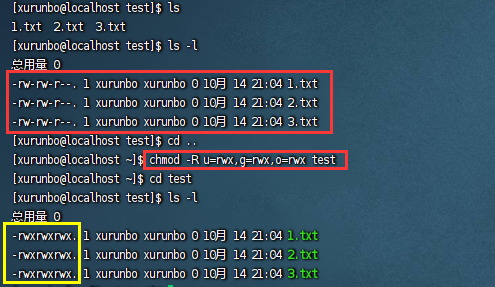 

### chmodPlus

==RWX:4 2 1==

ugo:x y z

```
chmod xyz [-R] 文件或者文件夹
```

| 0    | 没有任何权限 | ---  |
| ---- | ------------ | ---- |
| 1    | 只有x权限    | --x  |
| 2    | 只有w权限    | -w-  |
| 3    | 有wx权限     | -wx  |
| 4    | 只有r权限    | r--  |
| 5    | 有r和x权限   | r-x  |
| 6    | 有r和w权限   | rw-  |
| 7    | 全都有！     | rwx  |

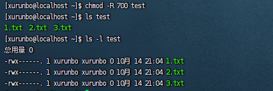 

chmod-------Change Mode

### chown命令

> 是干什么的？
>
> 如何使用？
>
> 如何形象记忆？[]:[] 类比ls -l得到的每一列的信息
>
> 谁都可以修改吗？

==普通用户是没有办法使用chown的==

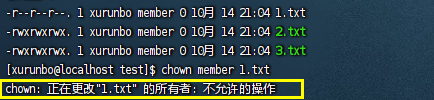 

人家要不要呢？是没有办法强加的。

function：修改文件或者文件夹的所属用户或者用户组

```
chown [-R] [用户名]:[用户组] 文件或者文件夹的Linux路径
```

修改所属用户

 

 

 

修改用户组

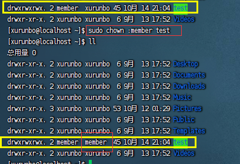 

**==-R的修改其子文件都同步修改==**

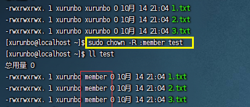 


## 各类小技巧快捷键CTRL+cd<-->ae

> 如何看历史命令？
>
> 强制停止？ CTRL+C
>
> 退出，登出？ CTRL+D
>
> 历史命令搜索的两种方法？!+命令和CTRL+R
>
> 光标移动？
>
> 如何形象记忆CTRL+a和e呢

1. CTRL+C强制停止（程序运行）

   命令写错了直接CTRL+C就是取消掉改行命令了

2. CTRL+D退出，登出，退出账户的登录

   ```
   python就直接进入python的罕井中了
   ```

   CTRL+D可以==退出某些特定程序的专属页面==

   `但是不能用于退出VI/VIM`

3. history 查看我们输入过的

   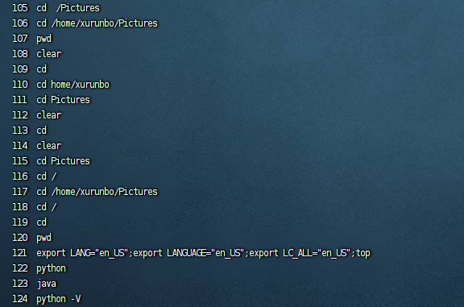 

   序号越大的是最新的

   配合grep和管道符查筛选

   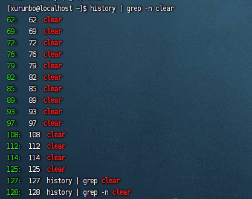 

   > 1. !+命令前缀
   >
   >    !p
   >
   >  		 他会从history的结果从下往上开始找到第一个开始匹配就执行了
   >
   > ==历史命令搜索==
   >
   > 2. CTRL+R
   >
   >     
   >
   >    1. 按下<-或者->就可以得到所显示的命令了
   >    2. 回车直接执行所显示的命令
   >
   >  

4. 光标移动CTRL+->/<-

   > CTRL+>光标向右跳过一个单词
   >
   > CTRL+<光标向左跳过一个单词
   >
   > 上面二者也适用于md文档
   >
   > CTRL+a光标跳到开头
   >
   > CTRL+e光标跳到结尾
   >
   > `a==（ahead向前）,e==(end末尾)`

5. 清屏

   `clear`

   或者

   CTRL+L

   **==l=（clean）==**


## 软件安装

> 如何使用yum为centos系统安装软件？
>
> 如何使用apt为ubuntu安装软件？

操作系统安装软件的方式

1. 下载安装包自行安装

   > windows用.exe文件.msi等
   >
   > mac用dmg.pkg等

2. 系统的应用商店内安装

   > windows的Microsoft Store商店
   >
   > Mac的appstore

3. ==Linux系统也同样支持这两种方式==

   > **`centos用yum管理器,ubuntu用apk管理器==`**
   >
   > 1. 用Linux命令行内的==“应用商店”==----**yum命令安装软件**
   >
   >    [yum命令安装软件](#yum命令)
   >
   >    [apt为ubuntu安装软件](#apt为ubuntu安装软件)
   >
   > 2. 在Linux中，常见的安装包格式有以下几种：
   >
   >    1. DEB包：DEB（Debian）是Debian及其衍生发行版（如Ubuntu、Linux Mint等）使用的安装包格式。DEB包以.deb为扩展名，可以使用dpkg命令进行安装、升级和移除。
   >    2. ==RPM包==：RPM（Red Hat Package Manager）是Red Hat及其衍生发行版（如Fedora、CentOS等）使用的安装包格式。RPM包以.rpm为扩展名，可以使用yum或dnf命令进行安装、升级和移除。
   >    3. ==TAR包==：TAR（Tape Archive）是一种常见的归档文件格式，在Linux中经常用于打包和压缩文件。TAR包通常以.tar为扩展名，可以使用tar命令进行解压和提取。
   >    4. 压缩包：常见的压缩包格式如GZ、BZ2、XZ等，通常用于将多个文件或目录进行压缩和归档。这些压缩包可以使用相应的解压命令（如gzip、bzip2、xz等）进行解压缩。
   >
   >    **==Linux上的软件包管理系统（如yum、apt等）通常会自动处理软件包的依赖关系，因此安装软件时不需要手动下载和安装依赖的软件包。==**

==简单总结==

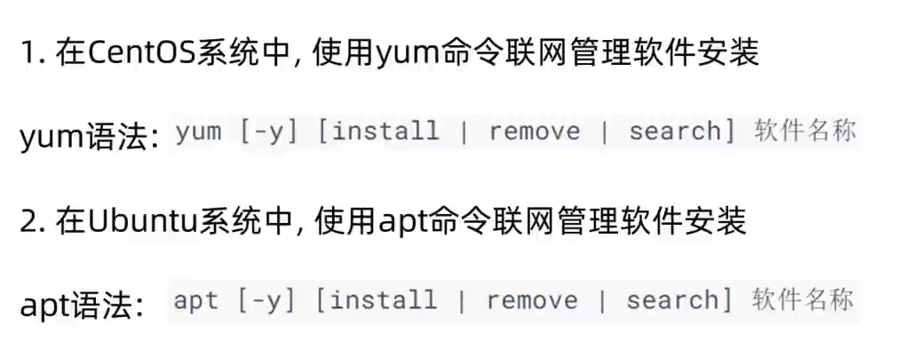

---

### <a name="yum命令">yum命令</a>

> 干嘛的？
>
> 如何用？
>
> yum如何形象记忆》？
>
> 和[curl -O](#curl-O)的区别？

#### yum命令语法和作用

funtion：RPM**包软件管理器**，用于**自动化安装配置LInux的软件，并可以自动解决依赖问题**

`yum下载的会默认写入环境变量，并且通常可以用systemctl去操作服务状态`

```
yum -y [install |remove | search] 软件名称
```

1. install ：安装
2. remove :卸载
3. search：搜索
4. ==update: 更新==

---

+ ==安装软件需要切换到root或者有sudo权限才能正常安装Linux的软件==

+ ==yum需要先联网==

---

（（（（（（（（（（（yum=yummy（美味的）`操作系统饮用软件`））））））））

#### install安装一个拓展

（如果这个过程包含的依赖项也会帮我们安装上）

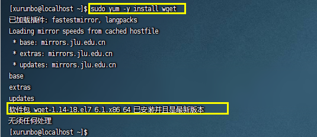 

#### serach查找==“应用商店”==里面是否有这个软件？

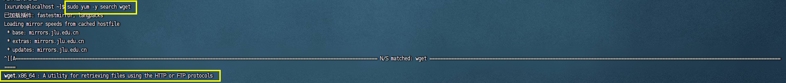

#### remove卸载掉刚刚安装的wget程序

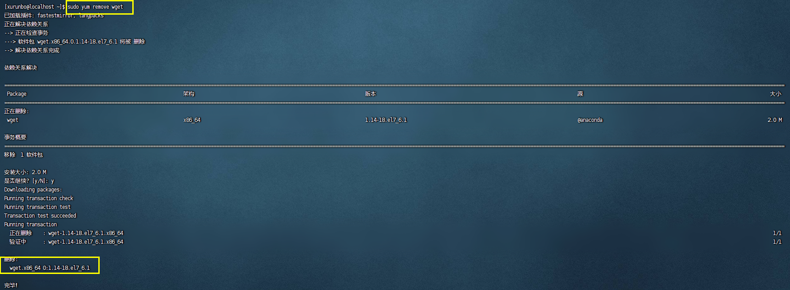

 

验证删除掉了

#### update更新我们的软件

 


### <a name="apt为ubuntu安装软件">ubuntu的apt命令（拓展）</a>

和centos差不多

``` 
apk [-y] [install | search | update| remove] 软件名字
```

## systmctl命令

> 如何使用systemctl命令控制软件的启动和关闭
>
> 如何形象记忆Systmctl呢

#### <a name="systemctl">systmctl命令</a>

==能够被systemctl管理的软件，一般也称之为`服务`==

==***systemctl：：system（系统）ctl（control控制）***==

function:管理软件的启动停止，开机自启

```
systemctl start|stop|restart|status|enable|disable 服务名
```

+ 系统内置的服务很多
+ +   Networkmanagers
  + network
  + firewalld
  + sshd，ssh服务

---

#### statues查看服务

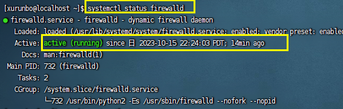 

#### stop关闭服务==需要sudo权限==

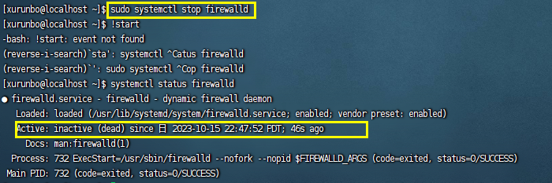 

#### 再次启动==需要sudo权限==

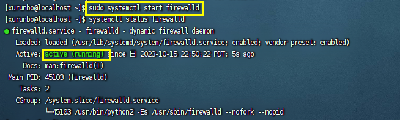 

#### 启动自启动==需要sudo权限==

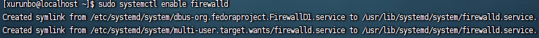

#### 关闭自启动==需要sudo权限==

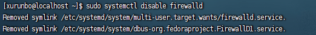 

---

很多软件安装完后都会自动集成到systmctl中

对于哪些不自动集成到systemctl的软件呢？

==软件!=服务==

当然我们也可以[手动（注册）添加](#手动添加)

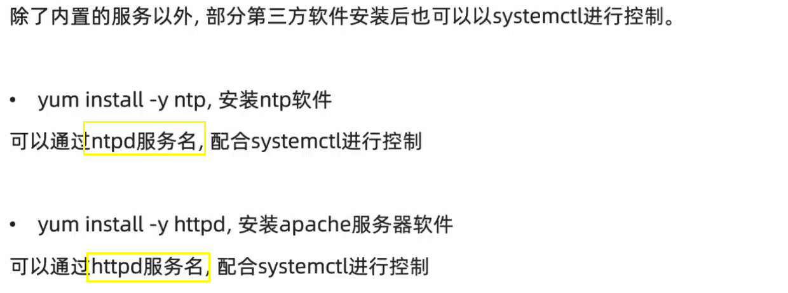

## 软连接

> 什么是软连接？
>
> 如何使用==ln命令==创建软连接？
>
> 如何形象记忆ln呢？

#### 软连接ln -s

**function：类似Windows的快捷方式，可以将文件，文件夹链接到其他位置**

软链接，它实际上是一个指向原始文件的符号链接，也就是一个**指针**

==**ln：（link）（new）**==\

==-s:：：（source）/set==

**`指定源文件或目录。软链接是指向源文件或目录的特殊文件`**

用于更新链接的命令

```
ln -s 参数1 参数2
```

+ -s选项，创建软连接
+ 参数1是被链接的文件/文件夹
+ 参数2是要链接到哪?

---

#### -s为文件/文件夹添加new link<a name="权限l"></a>

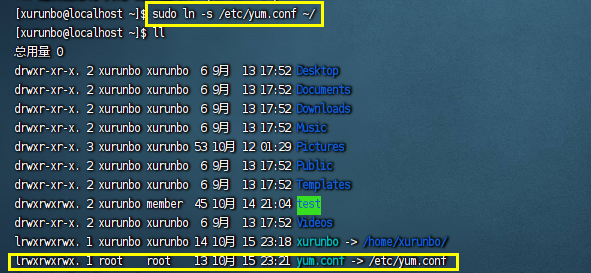 

---

  

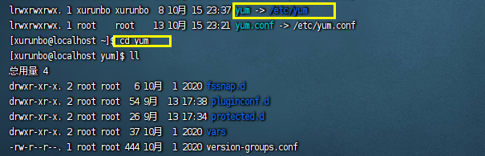 

==不要忘记加-s==

创建一个硬链接。硬链接是指向同一个文件的多个文件名，它们共享同样的数据块。在这个命令中，`/etc/yum.conf`是源文件，`~/yum.conf`是目标文件，通过执行这条命令，会在当前用户的主目录下创建一个名为`yum.conf`的硬链接，指向`/etc/yum.conf`文件。

硬链接只能在同一个文件系统中创建，而软链接（使用`-s`选项）可以跨越不同的文件系统。

#### 软连接和硬连接的区别

> 软链接和硬链接都是==用于创建文件链接的方式==它们有以下区别：
>
> 1. 软链接是一个特殊的文件，它指向另一个文件或目录，类似于快捷方式。而==硬链接是多个文件名指向同一个文件的不同入口，它们共享同样的数据块。==
>
> 2. **软链接可以跨越不同的文件系统，而硬链接只能在同一个文件系统中创建。**
>
> 3. 软链接可以指向目录，而硬链接只能指向文件。==软的更灵活==
>
> 4. 当原始文件被删除时，软链接会失效，而硬链接不会受到影响，因为它们共享同样的数据块。
>
>    > <a name="硬连接&删除">硬连接&删除</a>:
>    >
>    > 当一个文件被删除时，实际上是删除了该文件在文件系统中的目录项，也就是**该文件的文件名和它的数据块之间的映射关系**。
>    >
>    > **当原始文件被删除时，物理数据块并没有立即被删除。**实际上，文件系统会在**文件的所有硬链接都被删除后，才会释放该文件占用的物理空间**。这是因为文件系统会维护一个引用计数，记录每个文件的硬链接数量。只有当引用计数为0时，文件系统才会释放对应的数据块。
>    >
>    > 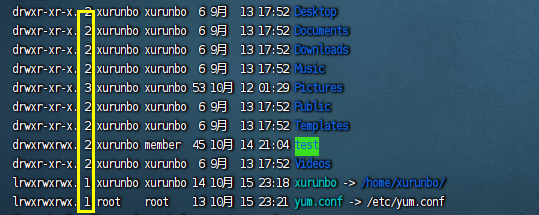 
>    >
>    > ==此列就是硬链接数==
>    >
>    > 即使删除了原始文件，只要还有其他硬链接指向相同的数据块，该数据块就不会被释放。只有当所有硬链接都被删除后，文件系统才会回收相应的物理空间。
>
> 5. 软链接可以使用相对路径或绝对路径创建，而硬链接只能使用相对路径创建。->==相对赢==
>
> 软链接是一种更加灵活的文件链接方式，而硬链接则更加节省空间，因为多个链接共享同样的数据块。

## 日期和时区

> 掌握date命令查看和修改日期时间
>
> 掌握修改Linux系统的时区
>
> 掌握使用ntp进行时间同步和校准

#### date命令

function:查看系统的时间

==-d：-d选项用于指定要显示或设置的日期和时间==

==-s设置当前系统的时期==

 

#### -d+格式化字符串简单的日期计算

 

> date -d "+x year|month|date|month|hour|second"  +%...................................
>
> ==显示标志的时间

#### -s(set)设置当前系统的时期和时间

- 设置系统的日期和时间为指定日期和时间：`date -s "2022-01-01 12:00:00"`
- 显示指定日期和时间的格式化输出`date -d "2022-01-01 12:00:00" +"%Y-%m-%d %H:%M:%S"`

---

==**格式化字符串含有空格等特殊符号的话加上“”**==

---

#### 时区

默认是中国UTC东八区

》》》

PDT和CST是时区的缩写，分别代表太平洋夏令时（Pacific Daylight Time）和中部标准时间（Central Standard Time）。

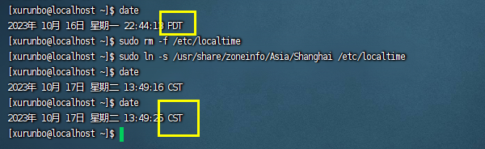 

#### Network Time Protocol::ntp|ntpd自动校准时间

1. 用[yum](#yum命令)安装npt

   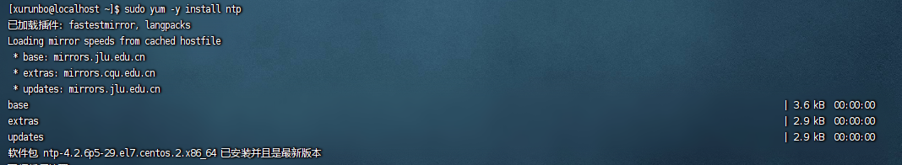

2. 启动yumd服务

   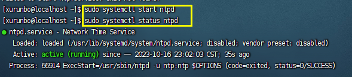 

3. 启动yumd的自启动服务

   ==**当ntpd启动后会定期的帮助我们联网校准系统的时间**==

   

4. 手动校准

   > ntpdate -u ntp.aliyun.com
   >
   > 等待5，6S
   >
   > 就校准好了！还有偏差
   >
   >  

## <a name="ip">IP</a>地址主机名

### IP和主机名

> 1. 什么是IP地址
> 2. 什么是主机名
> 3. 什么是 ==域名解析==


#### IPV4和IPV的区别

IPv4和IPv6是互联网协议（Internet Protocol）的两个版本。

1. 地址空间：==IPv4使用32位地址，最多可分配40亿个地址，==而I==Pv6使用128位地址，可分配的地址数量极其巨大，足以满足未来互联网的需求。==

2. 地址表示：==IPv4地址使用点分十进制表示==，如192.168.0.1，而==IPv6地址使用冒号分隔的十六进制==表示，如2001:0db8:85a3:0000:0000:8a2e:0370:7334。

   > ipv4:
   >
   > a.b.c.d--------192.168.0.1
   >
   > a,b,c,d是0-255的数字

3. 地址配置：IPv4地址通常由网络管理员==手动配置或通过动态主机配置协议（DHCP）自动分配==，而IPv6地址通常通过无状态地址自动配置（SLAAC）或动态主机配置协议（DHCPv6）自动分配。

4. 安全性：IPv6在设计时考虑了安全性，支持IPsec（Internet Protocol Security）协议，可以提供端到端的加密和认证功能。而==IPv4需要额外的协议来实现类似的安全性。==

5. 支持的协议：IPv4支持的协议有限，而IPv6支持更多的协议，如移动IP（Mobile IP）、多播（Multicast）等。

6. 网络性能：由于IPv6地址空间更大，IPv6可以减少网络地址转换（NAT）的使用，提高网络性能和连接质量。

总的来说，IPv6相对于IPv4具有更大的地址空间、更好的安全性、更多的协议支持和更好的网络性能，是未来互联网的发展方向。然而，==**由于IPv4的广泛应用和设备的兼容性问题，目前IPv4仍然是主要的互联网协议。**==

#### IP地址

==因为每一台联网的电脑都会有一个地址，相当于电脑的身份证？==

> IP地址是互联网中**用于标识设备的一串数字**。可以将其类比为房子的地址
>
> 用来确定设备在网络中的位置和通信的目标。

ipv4:

a.b.c.d--------192.168.0.1

a,b,c,d是0-255的数字

#### 查看虚拟机的IP地址

```
ifconfig
```

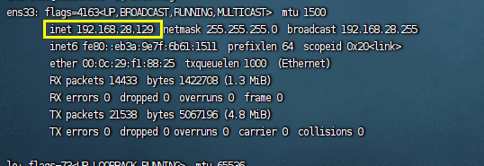 ens33：主网卡

#### 特殊的IP地址

**`127.0.0.1==本机`**==回环IP==

0.0.0.0

+ **可以指代本机**，
+ 确定绑定关系,
+ 表示所有IP的意思（放行规则设置位0.0.0.表示允许任意IP访问）

---

#### 主机名

function：标识一个计算机

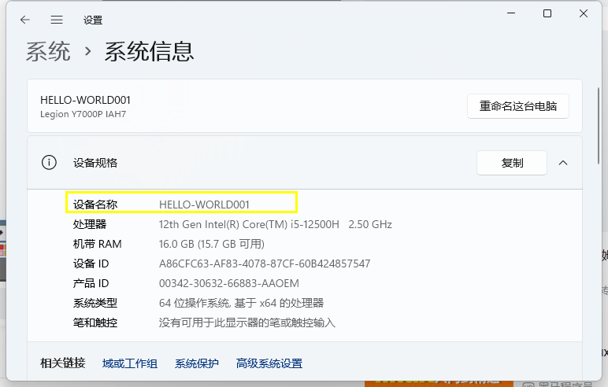 

#### 修改主机名

查看主机

```
hostname
```

就显示了

```
hostnamectl set-hostname 新的主机名
```

 

重新登录后就可以了

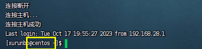 

#### 域名

**ip地址记不住，记住域名就ok了**

baidu

`IP地址和域名的映射关系`

#### 域名解析

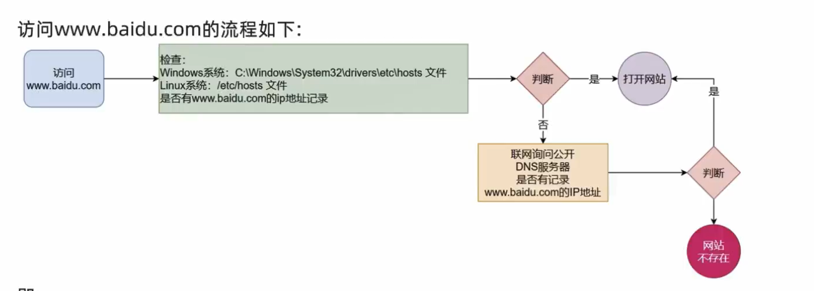

> 1. 先看自己本机是否记录有对应网站的IP地址==**首先**==
>
>    
>
> 2. 如果没有再联网去DNS服务器找到www.baidu.com的IP地址

#### 自己添加域名映射

==不用IP地址而是用主机名==

因为finalshell是通过Windows访问Linux

> 1. 管理员身份运行记事本
>
> 2. 打开hosts文件
>
>    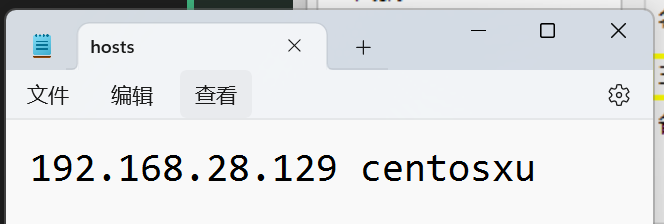 
>
> 3. 加上虚拟机的IP地址加上空格和域名
>
> 4. 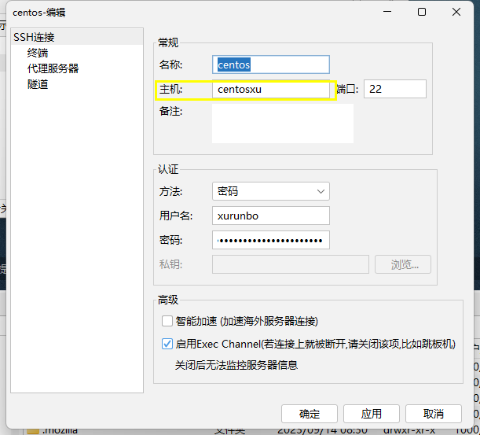 
>
> 5. 就可以实现域名到IP地址的映射啦
>
> WIN+R输入 ping 和网页地址就可以得到网页的IP地址啦

#### DHCP自动分配IP地址和其他网络配置信息

DHCP（Dynamic Host Configuration Protocol）是一种网络协议，用于==自动分配IP地址和其他网络配置信息给计算机和其他设备。==

作用类似于租房中介，==帮助设备在网络中找到可用的IP地址，并提供其他必要的网络配置==。

》》》

在DHCP中，你的计算机就是租房的需求方，DHCP服务器就是租房中介。当你的计算机连接到网络时，它会向DHCP服务器发送一个请求，请求一个可用的IP地址和其他网络配置信息。DHCP服务器会检查可用的IP地址池，并为你的计算机分配一个IP地址，并提供其他必要的网络配置，比如子网掩码、默认网关、DNS服务器等。

此后，你的计算机就能够在网络中正常通信了。

### 虚拟机配置固定IP地址

> windows如何在VMware中配置Linux的固定IP地址


1. 为什么需要固定的IP呢？

   因为我们的虚拟机是通过DHCP服务获取的，会频繁变更

   个人，办公电脑的IP变化与否无所谓，但是我们要远程链接我们的虚拟机，IP地址经常变换就不方便

2. 还有我们自己添加的==虚拟机的IP地址和主机名的映射==如果IP地址频繁更改就需要频繁的在hosts 中修改

---

#### Vmware Workstation配置固定IP 

1. 在VMware中设置

   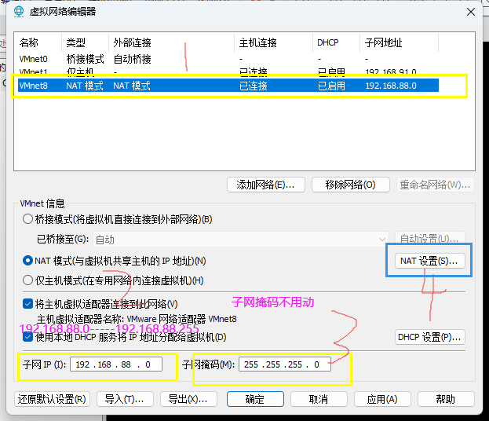 

   > 子网IP为192.168.88.0，这表示该局域网中的设备可以使用从192.168.88.1到192.168.88.254的IP地址。
   >
   > ---
   >
   > 网关的IP地址可以是该局域网中的任何设备的IP地址，通常是路由器的IP地址。将网关设置为192.168.88.1意味着你将局域网中的路由器指定为网关。

2. NAT设置

   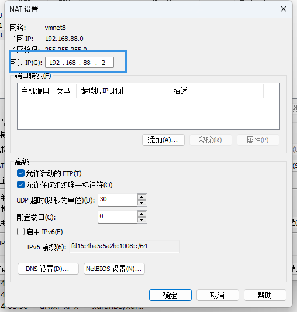 

   ---

3. 在LInux的配置文件里配置

   /etc/sysconfig/network-scripts/ifcfg-ens33

   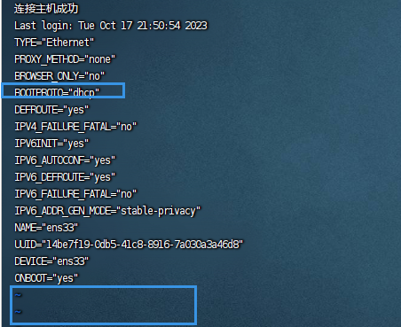 

   ==目标：把ip修改为192.168.88.86==

   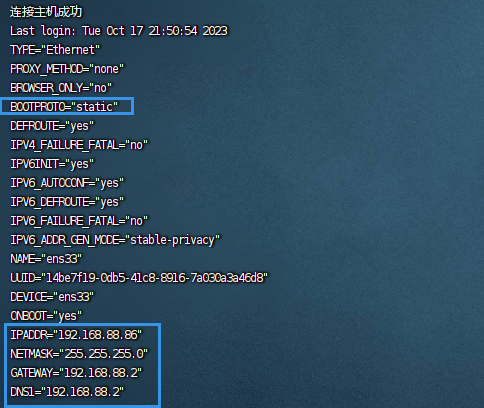 

   网关是GATEWAY不是NETWAY。。。。。可以设置多个DNS服务器，以备份或提高解析速度。在设置DNS时，你可以指定多个DNS服务器的IP地址，设备将按顺序尝试连接这些服务器，直到成功解析域名或达到超时。

   然后用到[systemctl](#systmctl命令)的重启network服务就可以啦

   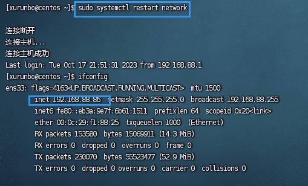 

#### DNS

> DNS（Domain Name System）是用于==**将域名转换为相应IP地址的系统**==。它充当了互联网上的电话簿，将用户输入的==域名翻译成计算机可以理解的IP地址==，以便正确地连接到目标服务器。
>
> 网关是192.168.88.2。==**通常可以将该网关设置为你的设备的默认DNS服务器**==。这样，当你的设备需要解析域名时，它将向网关发出DNS查询请求。
>
> 2.==**还可以使用其他可用的公共DNS服务器，如114.114.114.114**==。你可以将该IP地址设置为你的设备的DNS服务器，以便使用该服务器来解析域名。
>
> 可以==**设置多个DNS服务器，以备份或提高解析速度**。==在设置DNS时，你可以指定多个DNS服务器的IP地址，设备将按顺序尝试连接这些服务器，直到成功解析域名或达到超时。

就得到啦固定的IP地址

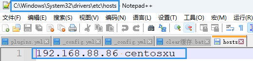 

再利用域名解析，就可以实现自己添加域名映射啦

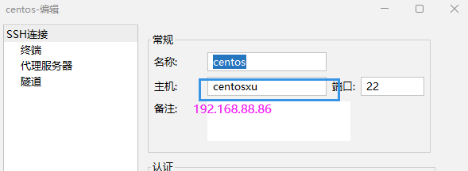 


## 网络请求和下载

> 使用ping测试网络连接的延迟和稳定性。
>
> 使用
>
> 使用

### ping命令 -c

function ：用于测试网络连接的延迟和稳定性。


测试一个网站或者IP服务器的状态是否正常


```
ping [-c num] 网址(ip或者主机名)
网址可以是一个IP地址或一个域名。
```

> **ping命令比喻为发送一个小信使去询问目标主机是否能够回答，并测量信使返回的时间。**
>
> 如果目标主机能够回答，那么ping命令会显示往返时间，这表示网络连接正常。
>
> 如果目标主机无法回答，或者往返时间非常长，那么ping命令会显示超时或延迟较高的信息，这表示网络连接存在问题。

==-c：：：count---------指定测试次数==


### wget命令 -b

funtion：非交互式的下载文件==用于从指定的URL下载文件。==


 http://archive.apache.org/dist/hadoop/common/hadoop-3.3.0/hadoop-3.3.0.tar.gz

阿帕奇hadoop的安装包

```
wget [-b] url
```

==**-b：是在后台下载**==并且下载日志保存在wget-log文件下面

----

常用选项：

- `-O`：指定下载文件的保存路径和文件名。
- `-P`：指定下载文件的保存路径。
- `-c`：断点续传，如果下载中断，可以从中断的地方继续下载。
- `-r`：递归下载，下载指定URL中的所有文件。
- `-np`：不下载上级目录。
- `-nH`：不创建主机目录。
- `-nd`：不创建目录。
- `-A`：只下载指定后缀名的文件。
- `-U`：设置User-Agent标头，模拟浏览器请求。
- `-q`：静默模式，不显示下载进度。
- `-h`：显示wget命令的帮助信息。

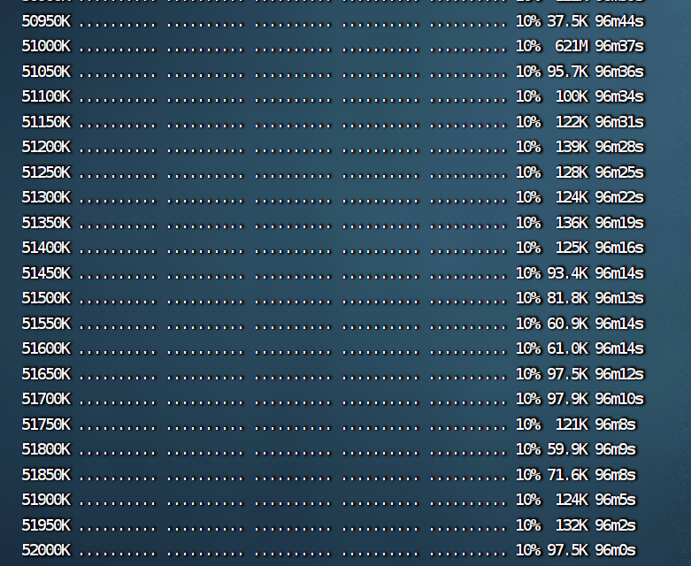 

### curl命令 -O

function：用于==从指定的URL获取数据并输出到终端或保存到文件中。==

可以发起网络请求

可以下载文件

```
curl [-O] url
```

`curl url`获取的是url页面的源代码

`cur -O url`下载文件，也有对应的进度条

==其中O代表Output（输出）。这是因为使用curl -O命令时，curl会将从URL下载的文件保存到当前目录下，==

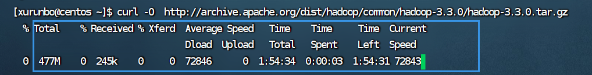 

==**默认是放在当前工作目录下面的**==


==获取主机的公网IP地址==

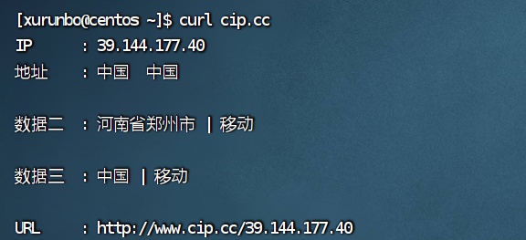 

### <a name="curl-O">curl和yum的区别</a>

> 在Linux中，yum和curl -O==都可以用于下载文件，但它们的使用场景和功能略有不同。==
>
> 1. yum下载文件：
> yum是Linux系统中的==包管理器==，==主要用于安装、更新和删除软件包==。它可以从软件源中下载软件包及其依赖项，==并自动解决依赖关系==。yum下载文件的主要目的是为了安装软件包，==下载的文件通常是软件包的**二进制文件或安装脚本**==。使用yum下载文件时，可以使用以下命令：
> ```
> yum install package_name
> ```
> yum会根据软件源中的配置文件，从指定的软件源中下载软件包及其依赖项，并自动进行安装。
>
> 2. curl -O下载文件：
> curl是一个强大的命令行工具，==**用于与网络服务进行数据交互**==。它支持各种协议，包括HTTP、HTTPS、FTP等。==**curl -O命令用于从指定的URL下载文件，并将文件保存在当前目录下，文件名与URL中的文件名相同**==。使用curl -O下载文件时，可以使用以下命令：
> ```
> curl -O http://example.com/file.txt
> ```
> curl -O命令适用于从任何支持的协议下载文件，无论是软件包、文本文件还是其他类型的文件。==**它不会自动解决依赖关系，只是简单地下载文件并保存到本地。**==
>
> 总结：
> - yum下载文件主要用于安装软件包，下载的文件通常是软件包的二进制文件或安装脚本。
> - curl -O下载文件适用于从任何支持的协议下载文件，无论是软件包、文本文件还是其他类型的文件。它==不会自动解决依赖关系，只是简单地下载文件并保存到本地。==

## 端口

> 什么是端口
>
> netstat命令如何使用

==IP==是用来在互联网上找到这个计算机

==端口==就是这台电脑上面的住户（程序）

Linux支持六万个端口

+ 公认端口 用于：==系统内置和知名程序使用==
+ **注册端口** 1024-五万 随意使用，用于松散的绑定一些程序/服务
+ 动态端口 ：5w-6w 通常不会固定绑定程序，而是当程序对外网络连接的时候使用

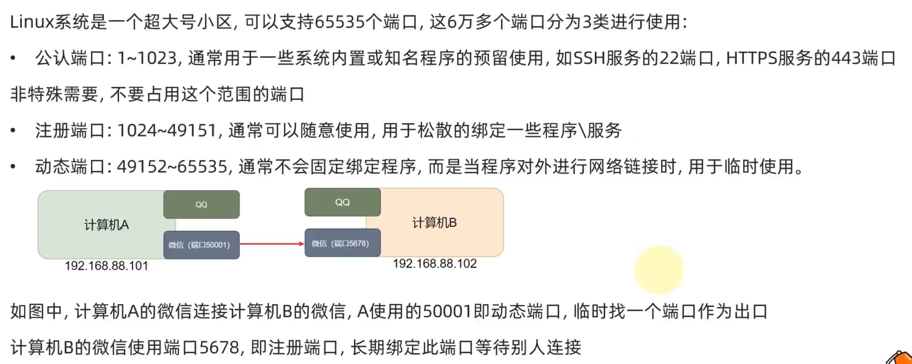

### nmap程序

**扫描指定IP对外暴露的端口**

1. ```
   sudo yum -y install nmap
   
   ```

2. ```
   nmap 127.0.0.1(IP)
   ```

nmap查看系统的端口使用情况

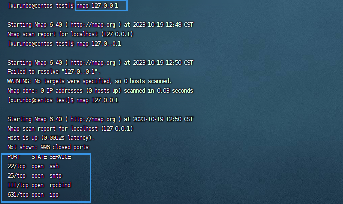

### netstat程序

> netstat查看**本机端口**的占用情况

1. ```
   sudo yum -y install netstat
   ```

2. ```
   netstat -anp 端口
   ```

3. 可以配合管道符和grep

   ```
   netstat -anp | grep 22
   ```

   ==anp==

   > a:all 所有链接TCP，UDP。。
   >
   > n：numeric数字格式的IP
   >
   > p：process进程信息

 

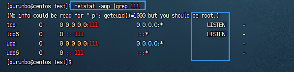 

具体来说，"netstat -anp"会显示以下内容：

- "Proto"列显示网络连接所使用的==协议==，如TCP或UDP。
- "Recv-Q"和"Send-Q"列显示==接收队列和发送队列中的数据量。==
- "Local Address"列显示==本地计算机的IP地址和端口号。==
- "Foreign Address"列显示==远程计算机的IP地址和端口号。==
- "State"列显示连接的状态，==如ESTABLISHED（已建立）、LISTEN（监听）等。==
- "PID/Program name"列显示**与连接相关的进程ID和进程名称**。

查看当前系统上所有的网络连接，并了解与这些连接相关的进程和端口信息。

## 进程管理

> 进程是什么？
>
> 如何查看进程？关闭进程？


程序运行在操作系统中，是呗操作系统所管理的。


每个程序在运行的时候，操作系统注册为系统中的一个进程

**并位每个进程都分配一个独有的==进程ID==**


### Linux查看系统的进程信息

function:查看Linux系统的进程信息

```
ps [-f -e]
```

```
ps -ef |grep 进程名
```

> p : process  进程
>
> s :snapshot   快照
>
> 进程快照

> -f ：full，-e：everything
>
> -f ==full== format 显示全部的进程
>
> -e ==everythiing ==processes   以完全格式化的形式展示信息

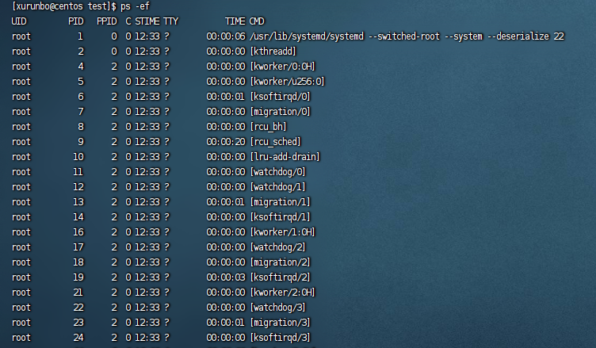

依次为

1. UID是进程所属的用户ID

2. PID是进程号

3. PPID进程的父PID

   程序不一定是由==用户启动的==也可能是==程序启动程序==

4. C是CPU占用率

5. STIME是进程的启动时间  start time

6. TIME是进程占用CPU时间**，累计**

7. CMD表示==启动路径==

### 查看进程 ps -ef

> Process Snapshot - Every Field
>
> 代表显示所有进程（Every Field），用于显示所有进程的详细信息，包括进程的PID（Process ID）、PPID（Parent Process ID）、CPU使用率、内存使用情况、进程状态、启动时间等。

先输入"tail"命令会启动一个进程，等待用户输入要查看的文件名或路径。由于没有输入文件名或路径，该进程会一直等待用户输入，因此会阻塞住。

```
tail
```

再复制一个标签输入

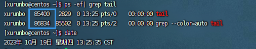 


==**我们输入的命令本身也是一个程序，所以一般不看过滤出来的最后一条结果**==

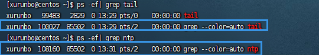 

### 关闭进程  kill [-9]

function：关闭进程

```
kill [-9] 进程ID
```

==**-9强制关闭掉**==

没有-9就是自我了断，发送信号。

 

复制一个窗口

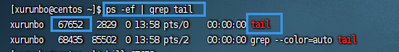 

查看到该进程的进程ID

 

文明催关

 

一般都是关闭的，收到要关闭的信号了，就关闭。

但有一些流氓

 

暴力关闭

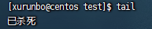 


## 主机状态监控

### 系统资源状态监控

#### top命令

```
top
```

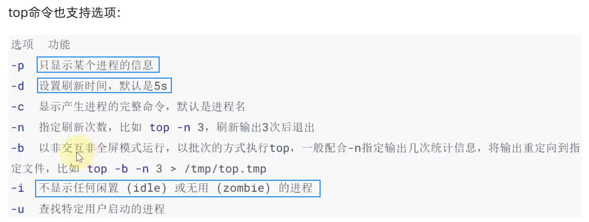

> -p:  person指定进程好好看
>
> -d  delay：时间间隔
>
> -c：command：摄像头仔细的观察完整的命令
>
> -n ：number设置固定的刷新次数
>
> -b："background"，即在后台非交互式地运行。一般配合重定向到指定文件
>
> -i : inspect 检查，正在运行的进程
>
> -u：查看指定用户的进程
>
> ```
> top -b >1.txt
> ```
>
> 就可以看到整张，然后more一页一页观看

#### top的交互式选项

> h : help 能看到一些帮助文档
>
> c :等价于-c  command能让我们看更全面的 启动路径
>
> i 等价于 inspect 查看正在运行的进程信息
>
> ---
>
> l :load  ：切换显示平均负载和启动时间信息
>
> m: mem内存  ：切换显示内存信息
>
> t : toggle (切换)切换显示CPu的使用情（控制1，2行的显示）
>
> ---
>
> P : ppercentage根据CPU使用==率==进行排序
>
> M:Mem，根据内存大小RES排序
>
> T:根据时间使用来排序
>
> ---
>
> E ：切换顶部内存显示单位//
>
> e:切换进程内存显示单位//
>
> f :fields selection 选择要展示的项目==**用空格来选择**==

==PMT,lmt,f,hic==

当然仅仅top就很好用了


#### top的实例解释

==默认每5minute刷新一次==

---

 

top：命令名称

12：33：06：系统时间

up 6minuts：启动了6分钟

2users：有两个用户登录

Load average：==系统平均负载：分**别代表1，5，15分钟的平均负载**==

---

 ==

task：185total：总计有185个子进程

1 running：有一个进程正在进行

184sleeping：184个正在睡觉

stoppped：0个停止了

0 zomibe：0个是[僵尸进程](#僵尸进程)

---

 ==t==

CPU占用率

13.7us:代表用户cpu占用率

15.6sy:系统占用cpu占用率

---

 

==物理内存==

free：剩多少

used：用了多少

buff/cache：系统缓存


 

==虚拟内存==

总量

剩余

用了

可用

不太关心

---

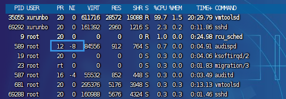 

PID:（process ID）：进程ID

USER：所属用户

PR：进程优先级

NI：进程负优先级

VIRT：所占用的==虚拟内存==

RES: 所占用的物理内存

SHR：所占用的共享内存

%CPU：所占用的==CPU率==

%MEM：进程占用==内存率==

TIME+：进程的启动时间

COMMAND：是进程的==启动路径==或者==文件路径==

#### <a name="僵尸进程">僵尸进程</a>

》》》

> 僵尸进程是指在操作系统中:
>
> 一个子进程在**完成任务后**，但是其父进程**没有及时回收其资源**，导致子进程的进程描述符仍然存在于进程表中，**但是已经没有运行的实体进程与之对应。这样的进程称为僵尸进程。**==僵尸进程不占用系统资源，但是会占用进程表中的一个条目==，如果大量的僵尸进程存在，可能会==**导致进程表耗尽**，==**从而影响系统的正常运行**。


### 磁盘的信息监控

> df如何形象化记忆？
>
> iostat命令

#### df命令-h

function：查看硬盘的使用情况：磁盘空间查看命令，用于显示文件系统的磁盘使用情况，包括磁盘总大小、已用空间、可用空间和文件系统的挂载点等信息。

+ d disk
+ f free
+ ==查看磁盘的剩余情况===
+ -h参数则是用来以人类可读的方式显示磁盘空间信息
+ h:human人类

```
df [-h]
```

> - -h：以易读的方式显示磁盘空间大小；
> - -T：显示文件系统类型；
> - -i：显示inode的使用情况。

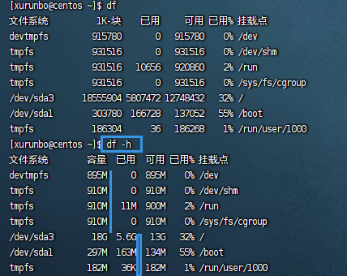 


#### iostat命令 -x num1 num2

> 查看系统

```
iostat [-x] [num1 nun2]
num1是delay刷新间隔
num2是刷新次数
```

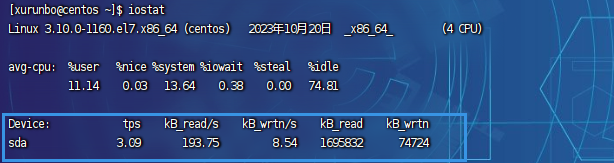 

+ sda:虚拟机的硬盘
+ tps:每秒传输次数
+ 每秒读
+ 每秒写
+ 总读取
+ 总写出

```
iostat -x
```

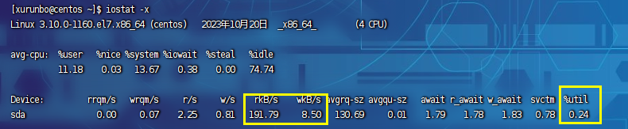

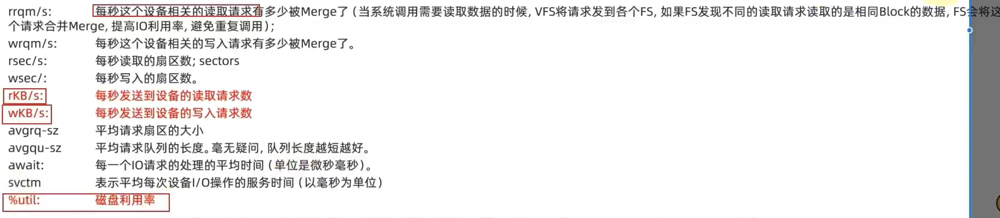

主要看这三个


### 网络状态监控

#### sar命令

> 如何形象化记忆？

function：查看网络状态的相关信息

```
sar -n 设备 [num1 num2]
```

> -n :查看网络
>
> DEV：表示查看网络接口
>
> nmu1；是刷新间隔
>
> num2：是查看次数

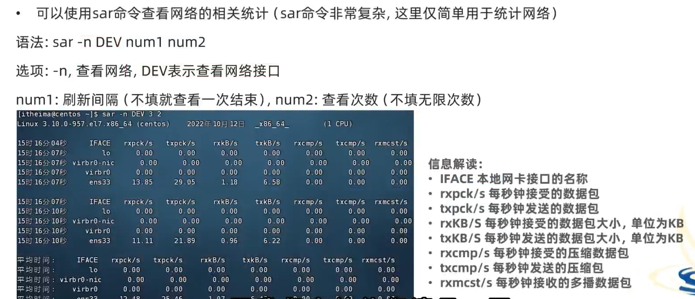

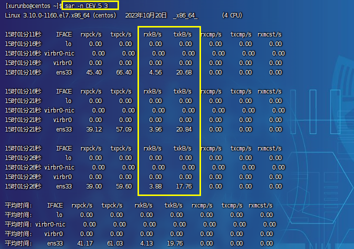 

> rxKB/s：是我们下载的时候接受的数据包大小
>
> txKB/s 是我们上传的时候发送的数据包的大小

还有最后一次的统计数据


#### 》》》

Linux中的sar -n 设备 [num1 num2]命令：

1. 将sar视为**“系统活动报告**”（System Activity Report）**，而-n代表“网络”（Network）。**
2. **设备可以被视为网络接口（例如eth0，eth1等）。**
3. [num1 num2]表示可选的两个数字参数，可以将其视为==时间间隔==和==刷新次数==。

> 系统活动报告中的网络接口活动情况（System Activity Report）+-n(network)


## <a name="环境变量">环境变量</a>

> 环境变量是干嘛的？
>
> 如何表示的？
>
> 为什么我们在任何目录下都可以使用cd命令呢?

### 环境变量

Linux环境变量是一种==**存储在操作系统中的字符串，用于指定操作系统运行程序时所需的各种信息。**==

操作系统在运行的时候，记录的一些关键性信息，**用于辅助系统运行。**

》》

常见的环境变量包括

PATH（指定可执行文件的搜索路径）

HOME（指定当前用户的主目录）

LANG（指定默认的语言设置）

---

当在Linux中运行一个程序时，它会自动读取指定的环境变量

### env命令

function：查看Linux==**系统中的系统变量**==

`env命令只能查看当前环境中的全局环境变量，而不会显示用户级别的环境变量。`

```
env
```

> env命令用于显示当前系统的环境变量。
>
> 语法：
> env [选项] [键值对]... [命令]
>
> 选项：
> -i，==清除现有的环境变量，只使用指定的键值对==
> -u，==移除指定的环境变量==
> -h，显示帮助信息
>
> 示例：
> 1. 显示所有环境变量：
>    env
>
> 2. 显示指定环境变量的值：
>    env 变量名
>
> 3. 设置新的环境变量：
>    env 变量名=值 命令
>
> 4. 清除现有的环境变量，只使用指定的键值对：
>    env -i 变量名=值 命令
>
> 5. 移除指定的环境变量：
>    env -u 变量名 命令

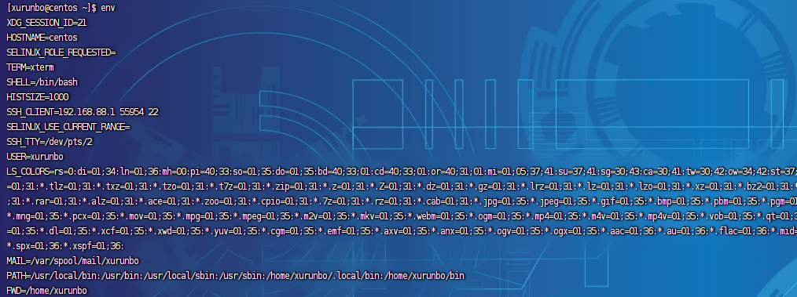 

得到的是键值对的数据


### <a name="PATH">PATH</a>

为什么我们在任何目录下都可以使用cd命令呢？这就是借助环境变量PAth这个项目的值做到的

> PATH环境变量是一个用冒号分隔的目录列表，用于指示系统在哪些路径中查找可执行程序。
>
> 当在命令行上输入一个命令时，系统会按照PATH环境变量所列出的路径顺序==**去查找对应的可执行文件**==，并执行找到的第一个匹配项。
>
> ---
>
> 这意味着，如果一个可执行文件的路径没有包含在PATH环境变量中，就需要使用完整路径或切换到包含该文件的目录来执行它。
>
> 通过将常用的可执行文件所在的目录添加到PATH环境变量中，可以方便地在任何位置执行这些命令，而不必每次都输入完整的路径

 

```
cd
```

==**PATH指定了默认搜索路径**==

当我们执行cd命令到时候，他就会从PATH里的一个个搜索路径下去找对应的可执行文件


### $符号

> $符号呗用于==**取”变量“**==
>
> 环境变量记录的信息，除了给操作系统自己使用外，如果我们想取用，就用到了$符号
>
> 取得环境变量的值就可以
>
> ```
> $ 环境变量名
> ```
>
> 进阶
>
> 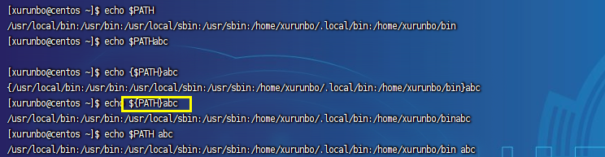

### 自定义环境变量

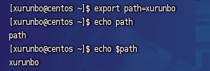 

#### ==**创建临时变量**==

```
export 变量名=变量值
```

> 重启虚拟机，或者切换用户，都看不到这个变量


#### 创建长久环境变量

==重启不影响==

souce 配置文件

重新读取

1. 在当前用户下创建

   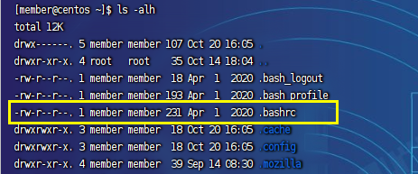 

   编辑.bashrc

   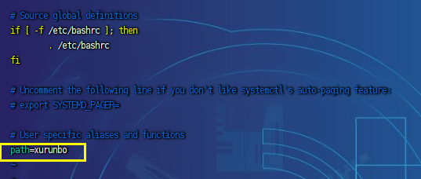 

   ==**source ~/.bashr**c==

   就创建了一个长久的变量

2. 在全局用户下创建一个==**全局环境变量**==

   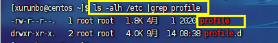 

   编辑/etc/profile

   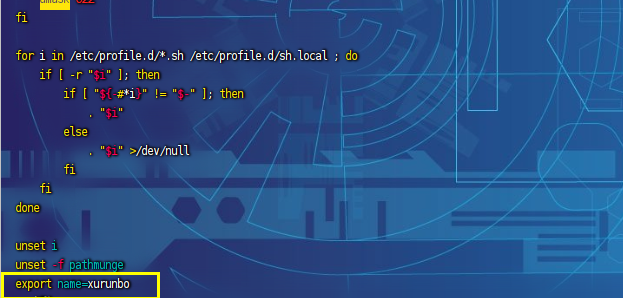 

   ==**source /etc/profile**==

    

全局环境变量可以在env中筛选到

全局环境变量是在系统范围内定义的，对所有用户都可见。

source 配置文件

让自定义的变量生效

### [自定义环境变量PATH](#PATH)

1. 创建一个文件

   并且写入简单的命令

   ```
   vim mv
   ```

   > echo "哈哈哈"

   然后修改其权限

   因为默认是不可以执行的

   ```
   sudo chmod 777 mv
   ```

2. 开始执行

   ```
   ./mv
   ```

3. `./`在Linux中表示当前目录。当您在命令行上运行某个可执行文件时，如果该文件位于当前目录下，那么您需要在命令前==**加上`./`来告诉系统去当前目录中查找该文件并且执行它。**==

   ./文件 表示使用路径的方式执行文件，需要文件有‘x’执行权限

    

==这样知识简单的执行这个文件==

我们输入mv是不可以执行的

---


----


真正是要添加到文件夹下面

1. 我们进入root用户

   ```
   mkdir myenv
   ```

   ```
   vim myenv/myenv
   ```

   ```
   echo "hello world"
   ```

2. 修改可执行权限

   ```
   chmod 777 myenv
   ```

3. 使用上面的./可以执行

4. 添加到临时环境变量

   ```
   export PATH=$PATH:/root/myenv
   ```

   ==**添加到文件夹下就好了，他是在这个目录下找我们写的可执行文件**==

5. 测试

   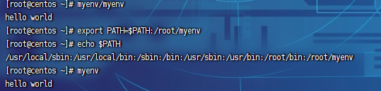 

6. ---

   现在重启后(临时环境变量没有啦)

   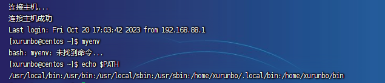 

   ---

   创建全局环境变量PATH

   ```
   sudo vim /etc/profile
   ```

   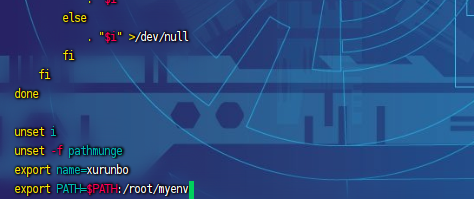 

   就可以在root，任意位置输入myenv就可以输出helloworld


## 文件上传和下载

> rz,sz命令？
>
> 如何上传和下载文件？
>
> 如何形象化记忆lrzsz

### 文件的下载

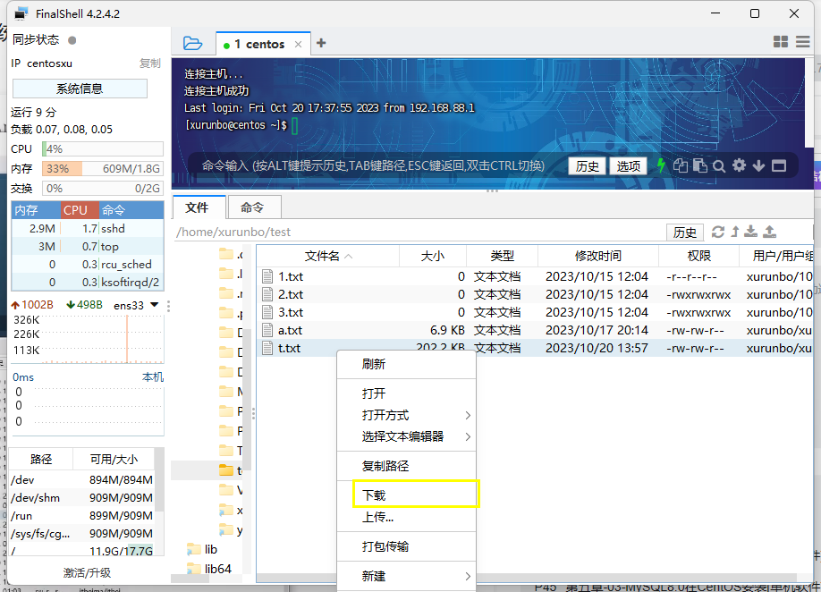 


下面的目录是根据finalshell登录的信息xurunbo

那就是普通用户

如果想得到root用户的文件夹

就root登录

而不是再shell中简单的切换到root里面


### 上传文件

就从我们主机拖拽文件拖进去就好了


### rz,sz命令

> 如何形象化记忆？rz和sz
>
> 如何使用呢？

---


----


> 不用finalshell的进行传输文件
>
> 而是用命令
>
> 1. 安装 
>
>    ```
>    yum -y install lrzsz
>    ```
>
>    > - **R**eceive **Z**ipped（rz）：rz命令是将文件从远程计算机发送到本地计算机，可以将字母R理解为“接收”或“接受”。另外，“Zipped”表示传输的文件通常都是经过压缩处理的，因此将字母Z与rz相关联也有助于记忆。
>    > - **S**end **Z**ipped（sz）：sz命令是将文件从本地计算机发送到远程计算机，可以将字母S理解为“发送”或“发出”。同样，“Zipped”表示传输的文件通常都是经过压缩处理的，因此将字母Z与sz相关联也有助于记忆
>
> 2. rz.sz都需要再findshell里面进行
>
>    1. rz的使用
>
>       ```
>       rz
>       ```
>
>       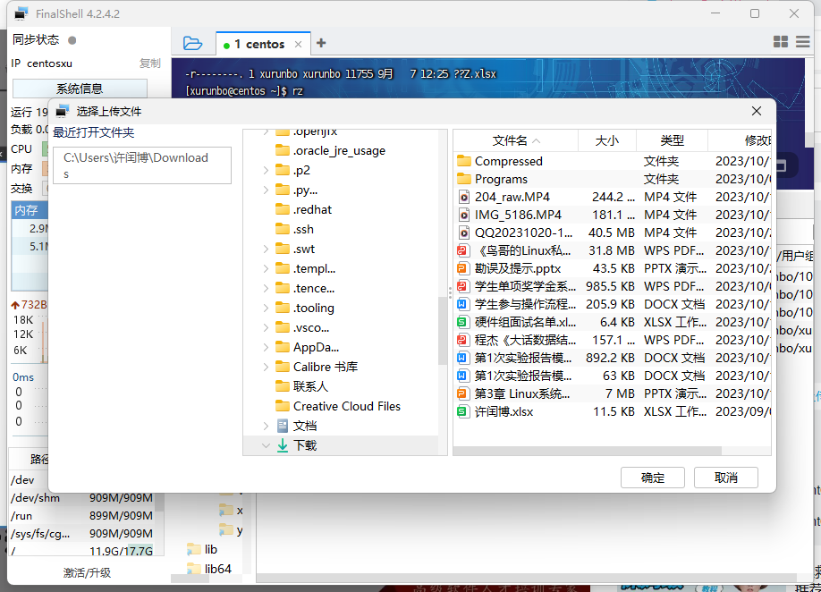
>
>       ==**会默认的下载到当前工作目录下也就是~/**== 
>
>    2. sz的使用
>
>       ```
>       sz Linux文件
>       ```
>
>       默认会在我们主机的桌面创建一个fsdownload的文件夹，放在里面
>
>    ==**拖拽的形式会更快一些**==
>
>    


## 压缩和解压

> 如何tar命令==压缩或者解压==tar/gzip文件？
>
> 如何用zip，unzip命令==压缩或解压==zip文件？

Linux常用:tar，和gzip 和zip

windows常常用：zip，7zip，rar

---


+ .tar是归档文件，简单的组装到.tar的文件夹内，没有减少太多体积，简单的封装
+ .gz常见额外i.tar.gz,gzip使用gzip压缩算法，将文件压缩到一个文件内，可以极大的减少压缩后的体积


### tar命令

function：压缩文件

```
tar [-c -v -z -x -f ]
```

> -c :（creat创建）创建压缩文件  ---压缩模式
>
> -x  ：(extract提取)创建解压文件-----解压模式
>
> -z 用gzip的压缩方式,==**后缀是.gz或者.tar.gz**==
>
> -v （visual）可视化
>
> -f 指定==压缩的目的地==，或者==要解压的文件==
>
> -C：指定解压的位置，因为此时f指定的是要解压的文件,所以-C是和解压配合使用的


### tar压缩文件

1. 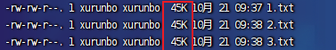 

2. ```
   tar -cvf cvf.tar 1.txt 2.txt 3.txt
   ```

    

3.  

   > 就得到了一个tar的简单压缩文件，默认是在当前工作目录下
   >
   > f的参数就是指定压缩到哪里
   >
   > ==**f一定在最后,且第一个参数对应的是f的参数**==

---

gzip的压缩方式

1. ```
   tar -zcvf zcvf.gz 1.txt 2.txt 3.txt
   ```

2. 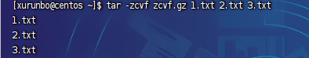 

3.  

   解压效果非常显著


### tar解压文件

1. 解压简单.tar 文件

2. ```
   tar -xvf cvf.tar
   ```

   默认是在当前目录下

3. ```
   tar -xvf cvf.tar -C /test/xvf
   ```

   指定解压到哪里

4. 如何解压的是gzip问格式的文件

   ```
   tar -zxvf cvf.tar
   tar -zxvf cvf.gz -C /test/xvf
   ```

   > z一定要在前面，告诉他我是解压gzip文件的
   >
   > f一定在后面，用来指定**==被解压的文件==**，和**==压缩到哪的文件==**
   >
   > -C必须单独使用，指定我解压的目的地，和其他参数分开，但是不能帮助创建文件夹


### zip命令

==好用==

用来zip

```
zip [-r] 参数1，2，3，4，
参数一就是要y的位置
默认是在当前工作目录下
```

-r就是recursive迭代

被压缩的目标内有文件夹的时候使用

```
zip test.zip 1.txt 2.txt 3.txt
```

```
zip -r test.zip abc 1.txt
```

### unzip命令

```
unzip 文件.zip [-d]
```

默认解压到当前工作目录下

```
unzip 文件.zip -d 指定目录
```

> 比tar好用
>
> 没有zip严格
>
> 可以帮忙创建文件夹
>
> -C用法和tar一样(单独指出)
>
> ==**解压的时候同名的文件会被覆盖！**==

seeyouagain

 


## 附加++

#### alias别名

> 使用`alias`命令来创建、查看和删除别名。
>
> 1. 设计别名的取法:
>    - 别名可以是任何有效的命令或命令序列。
>    - 别名可以包含空格，但是如果包含空格，需要使用引号将其括起来。
>    - 别名不能与已有的命令或系统保留关键字重名。
>
> 2. 查看别名:
>
>    ```shell
>    alias
>    ```
>
>    - 要查看当前已定义的别名，可以直接运行`alias`命令，它会列出所有别名及其对应的命令序列。
>
> 3. 创建别名:
>    
>    ```
>    alias 别名=命令串
>    ```
>    
>    - 要创建别名，可以使用`alias`命令后面跟上别名和对应的命令序列，使用等号（=）将它们连接起来。
>    - 例如，要将`ls -l`命令创建为别名`ll`，可以运行以下命令: `alias ll='ls -l'`
>    
> 4. 删除别名:
>    
>    ```
>    unalias 别名
>    ```
>    
>    - 要删除别名，可以使用`unalias`命令后面跟上要删除的别名。
>    - 例如，要删除别名`ll`，可以运行以下命令: `unalias ll`

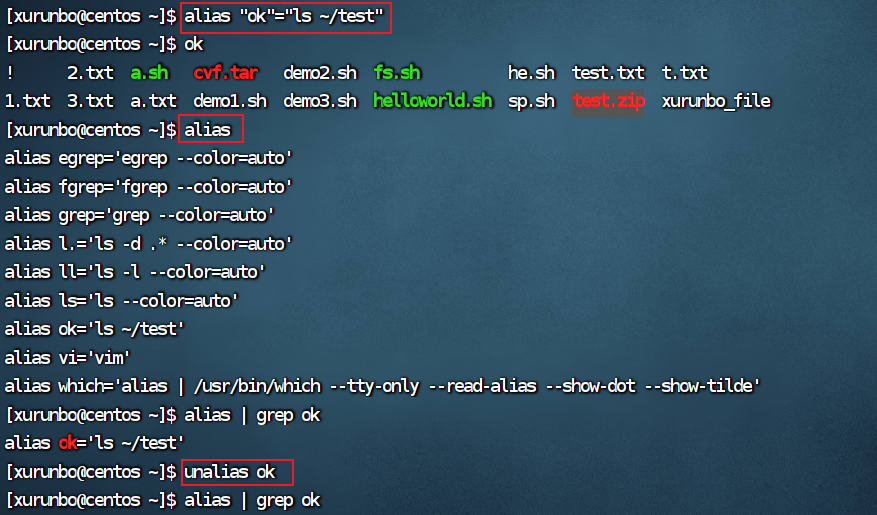 


#### Linux安装应用

> 1. 下载rpm包
>
> 2. ```c++
>    rpm -ivh 包名
>    ```
>
> 3. ​       -i    安装软件
>
>    
>
>    　　       -t     测试安装，不是真的安装
>
>    
>
>    　　       -p   显示安装进度
>
>    
>
>    　　       -f     忽略任何错误
>
>    
>
>    　　       -U   升级安装
>
>    
>
>    　　       -v    检测套件是否正确安装

