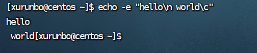
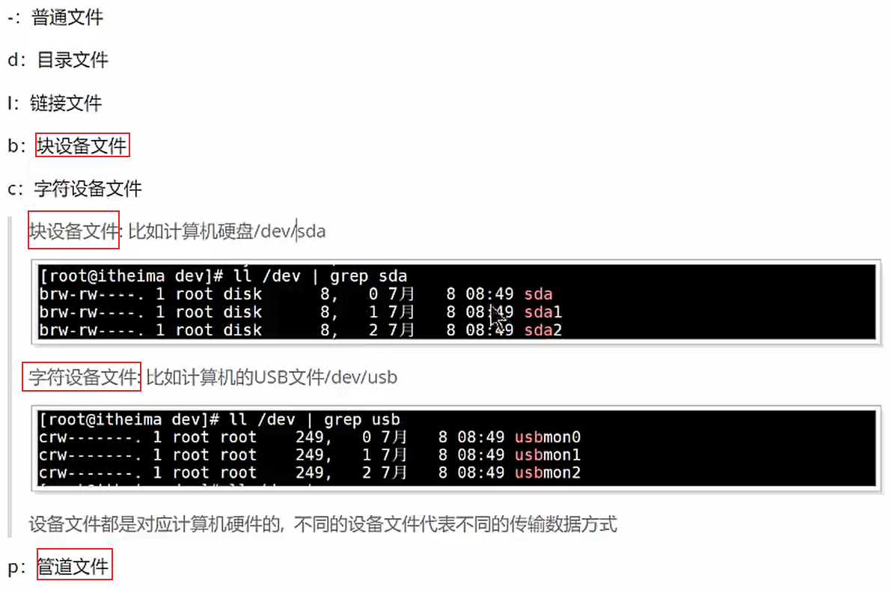

# Shell

## Linux是如何操作计算机的硬件？

> 用linux的内核操作

---

## Shell脚本

是一个文本文件，可以编写shell命令，或者变成，形成一个可以重复执行的脚本文件


## shell介绍

> 编写shell命令发送给linux内核取执行，操作的是计算机硬件，是==**用户和操作计算机硬件的桥梁**==

> shell是命令，也是程序设计语言。
>
> 我们编写shell命令程序，shell
>
> 

## shell脚本作用

提高Linux系统的管理工作效率

## shell的运行过程


## shell解析器

 


```
echo $SHELL
```

打印当前系统环境使用的shell解析器类型

 


## Shell脚本的编写格式和执行方式

> Shell脚本的编写规范
>
> 如何执行Shell脚本呢？

### 后缀:   .sh

首航格式规范 : 需要指出Shell解析器的类型

```shell
#!/bin/bash
```

> 当前shell脚本文件采用bash解析器运行脚本代码


### 注释格式

```
# 注释内容
```

```
:<<!
注释
注释
!
```


### Shell hello world

》》》

```
touch hello.sh
vim hello.sh
------------------
vim hello.sh
创建加编辑
```

 


### 如何执行呢？三种方式

1. sh解析器执行方式

   > ```
   > sh 脚本文件
   > ```
   >
   > 本质：用**shell解析器运行脚本文件**
   >
   >  

2. bash解析器执行方式

   > ```
   > bash 脚本文件
   > ```
   >
   > 本质：用bash命令执行脚本文件，使**用shell解析器运行脚本文件**

3. 路径执行方式

   > ```
   > ./脚本文件
   > ```
   >
   >  
   >
   > ==前提需要脚本文件有执行的权限x==
   >
   > 脚本文件添加执行权限
   >
   > ```
   > chmod +x 脚本文件
   > ```
   >
   > 执行
   >
   >  
   >
   > `./`前缀是Linux/Unix系统中用于运行当前目录下的可执行文件的一种方式，但前提是文件具有执行权限。

   

## 多命令处理

Shell（外壳）是计算机操作系统的用户界面，用于与操作系统内核进行交互。

Shell 可以执行单个命令，也可以执行多个命令，通常使用分号、逻辑运算符和管道等方法来处理多个命令。

以下是一些关于在Shell中处理多个命令的知识：

1. 命令分隔符：
   - 分号 `;`：分号用于将多个命令分隔开，按顺序执行。例如：`command1 ; command2`
   - 换行符（换行）：通常，==每行代表一个命令==，可以按==顺序==执行。
   
2. 逻辑运算符：
   - 逻辑与 `&&`：只有在前一个命令成功执行（返回0）时，才执行下一个命令。例如：`command1 && command2`
   - 逻辑或 `||`：只有在前一个命令执行失败（返回非0）时，才执行下一个命令。例如：`command1 || command2`

3. 管道 `|`：
   - 管道允许将一个命令的输出传递给另一个命令的输入。例如：`command1 | command2`，其中 `command1` 的输出作为 `command2` 的输入。

4. 后台执行 `&`：
   - ==在命令末尾加上 `&` 符号可以使命令在后台执行==，而不会阻塞Shell。例如：`command &`

5. 子Shell `( )`：
   - 使用括号可以创建子Shell，其中的命令在一个独立的Shell环境中执行。这对于创建临时环境或限定变量范围很有用。例如：`(command1; command2)`

6. 控制结构：
   - Shell 脚本可以包含条件语句（if-else）、循环（for、while）等控制结构，以便根据条件执行多个命令。

7. 脚本文件：
   - 您可以将多个命令保存在脚本文件中，并通过执行脚本文件来依次运行这些命令。脚本文件通常以 `.sh` 扩展名。


## Shell变量

> 什么是系统环境变量
>
> 撞我常用的系统环境变量有哪些。

### 系统环境变量

1. **PATH**：`PATH` 环境变量指定了系统在哪些目录中查找可执行文件。当您在终端中输入命令时，系统会依次查找 `PATH` 中列出的目录，以找到要执行的命令。
2. **HOME**：`HOME` 环境变量包含了当前用户的主目录的路径。通常，用户的个人文件和配置文件存储在该目录下。
3. **USER**：`USER` 环境变量包含了当前登录用户的用户名。
4. **SHELL**：`SHELL` 环境变量指定了当前用户所使用的默认Shell。
5. **PWD**：`PWD` 环境变量表示当前工作目录（即，用户当前所在的目录）的路径。
6. **LANG** 和 **LC_* **：这些环境变量控制系统的语言和区域设置，包括日期格式、货币符号等。
7. **TERM**：`TERM` 环境变量定义了终端类型，以便应用程序知道如何与终端进行交互。
8. **PS1** 和 **PS2**：这些环境变量定义了Shell提示符的外观，`PS1` 用于主提示符，`PS2` 用于次级提示符（通常出现在多行命令中）。
9. **TMP** 和 **TEMP**：这些环境变量指定了用于临时文件的目录路径。
10. **LD_LIBRARY_PATH**：`LD_LIBRARY_PATH` 环境变量用于指定动态链接库的搜索路径，以便应用程序可以正确地加载共享库。
11. **EDITOR**：`EDITOR` 环境变量定义了默认的文本编辑器，通常在编辑文件时使用。
12. **DISPLAY**：`DISPLAY` 环境变量用于指定X Window系统的显示器（用于图形用户界面应用程序）。
13. **MAIL**：`MAIL` 环境变量包含了用户的邮件存储路径。

系统环境变量是一种全局性的变量，它们对整个操作系统以及用户环境起着重要的作用。这些变量包括了有关系统配置、用户信息、路径设置以及其他重要信息。


### 全局配置文件

/etc/profile

### 个人用户配置文件

/.bashrc

```
echo $HISTFILE
```

得到历史命令

### set命令

`set` 命令主要用于显示和设置Shell环境变量。具体来说，`set` 命令有以下几个用途：

1. **显示环境变量和Shell参数**：显示当前Shell会话中定义的所有环境变量和Shell参数。这包括系统环境变量、用户定义的环境变量以及命令行参数。
2. **设置局部变量**：您可以使用 `set` 命令来设置局部变量，这些变量仅在当前Shell会话中可见。例如，`set myvar=value` 会创建一个名为 `myvar` 的局部变量，并将其值设置为 `value`。
3. **修改环境变量**：通过 `set` 命令，您可以修改已存在的环境变量的值。例如，`set PATH=/new/path:$PATH` 可以将 `PATH` 环境变量的值更新为新的路径。
4. **取消变量**：使用 `set` 命令，您可以取消已定义的环境变量或局部变量。例如，`set -e myvar` 可以删除名为 `myvar` 的变量。
5. **设置位置参数**：`set` 命令还可用于设置位置参数，这些参数通常用在Shell脚本中。例如，`set arg1 arg2 arg3` 将设置位置参数为 `arg1`、`arg2` 和 `arg3`，这些参数可以在脚本中使用。

### env命令

查看系统环境变量,没有set那么详细


## 自定义变量

### 什么是自定义变量

> 自己定义的变量
>
> > 自定义全局变量
> >
> > 自定义局部变量
> >
> > 自定义常量


### 介绍：

定义在一个脚本文件中的变量，只能在脚本文件内使用。


### 定义规则

```
变量名称(不可以数字开头)=value
```

> 等号两侧不能有空格
>
> bash环境中，变量的默认类型是字符串
>
> 如果有空格等特殊符号要用双引号引起来
>
> 不能用关键字作为变量名 

### 变量的使用(增添)

```shell
$var_name 
${var_name}拼接字符串
```

 

测试

```shell
echo $path
```

```shell
echo "123${name}333"
```

### 修改变量

```
新的复制就好了
```

 


### 删除变量unset

```shell
unset 变量
```

 


> 这样创建的是一个**局部变量**。
>
> 局部变量只在当前Shell会话中有效，不会在重新启动系统后保留。
>
> 它们通常在**当前终端窗口或Shell会话中使用**，并在会话结束时被销毁。
>
> ---
>
> 要在全局范围内设置变量，以便在系统重启后仍然可用，您通常需要将这些变量添加到Shell的启动文件（如`~/.bashrc`或`~/.bash_profile`）或系统范围的配置文件中
>
> ---
>
> `unset` 命令，它用于删除环境变量或局部变量。您可以使用 `unset` 命令来删除局部变量，但不能用它来删除全局变量

`unset myvar` 将删除局部变量 `myvar`，

==该变量将不再在当前Shell会话中可用==。

如果要删除全局变量:

需要编辑相关的Shell配置文件并将其删除或注释掉，然后重新加载配置文件或重新启动Shell才能生效。


## 自定义常量

```shell
readonly var_name=value
```

 

> `readonly` 命令将一个变量标记为只读（常量）后，
>
> **该变量将不能被修改或恢复为可写变量，**
>
> 除非您启动一个**新的Shell会话**。
>
> ==只读变量在当前Shell会话中是不可更改的。==

1. **在新的Shell子进程中修改**：您可以启动一个新的子Shell进程，在子Shell中修改变量。变化不会影响父Shell。

2. **使用`unset`命令删除只读变量**：您可以使用`unset`命令来删除只读变量。这将从当前Shell中删除该变量，然后您可以重新定义它为一个可写变量。请注意，这仅适用于Bash Shell。

## 自定义全局变量

### 父子shell


==父Shell是启动子Shell的Shell，而子Shell是由父Shell启动的新Shell会话。==

### 定义全局变量

```shell
export var_name=value
```

**全局环境变量会一直存在，直到系统重启或手动取消它们的导出。

==如果要永久导出变量==，

通常需要将相应的 `export` 命令添加到Shell配置文件中，以便在每次登录时自动加载。

> 全局变量是在Shell脚本中声明的变量，可以在整个脚本中访问，包括在不同的脚本文件中。
>
> 全局变量可以在脚本中的任何地方**访问和修改。**
>
> ---
>
> 全局变量的生命周期从它们被声明开始，一直持续到Shell会话结束，或者在某个地方被显式删除。这意味着全局变量在脚本文件执行期间一直存在，并且可以在多个脚本文件中共享。
>
> ==**全局变量的生命周期仅限于Shell会话的持续时间**。==
>
> 

### 案例测试

测试全局变量在子shell中是否可以使用

 

```shell
sh demo1.sh
```

无效

修改demo1.sh

`apple=123`->`export apple=123`

 

> 在父Shell中设置一个`export`全局变量，然后在启动的任何子Shell中访问相同的变量
>
> 但是不能在子shell里面试图修改父shell的全局变量,
>
> 在子Shell中尝试修改父Shell创建的全局变量，==实际上是在子Shell的环境中创建了一个新的同名局部变量，==而不是修改父Shell的全局变量。
>
> 每个Shell会话都有其自己的环境和变量空间，子Shell的环境是相对独立的。


## 特殊变量


### shell脚本传入参数语法

```shell
bash 脚本文件 参数1 参数2 》。。。。。。。。。
```

### `$n`

```shell
$n
```

> 得到第n个输入参数
>
> $1-$9得到的是第1----9输入参数
>
> 10以后用${10,11.......}
>
> ==特殊的$0代表shell脚本的名称==

测试

 

 

**最好加上{}，也方便拼接字符串**

默认只识别$后一个数字$10相当于${1}0

​	

### `$#`

```shell
$#
```

> 显示我们传入参数的个数

测试
	 

 


### `$*和$@`

==`$*`和`$@`都表示所有**命令行参数的列表**。它们的区别在于**对待参数中的空格和引号的方式。**==

```shell
$*
$@
```

> 以列表的形式组织我们的输入的参数
>
> $*和$@都是$1 $2.........................$n
>
> 用双引号括起来$*是"$1 $2 $3..........$n"
>
> $@是"$1" "$2"  "$3",............"$n"


测试

  

 


加入循环

```shell
for 循环变量 in 可循环对象
do
循环体
done
```

 

  


#### 加入""的区别

 

 

> - `$*`将**所有的命令行参数当作一个单词**（字符串）处理，参数之间由IFS分隔，会忽略参数中的引号。
> - `$@`将**每个命令行参数当作独立的单词**（字符串）处理，参数之间不会被拆分，会保留参数中的引号。

### `$?`

查看上一次命令的返回值。返回0代表成功

```shell
$?
```

测试


 


### `$$`

得到当前shell的进程ID

```shell
$$
```

测试


 

## 自定义系统环境变量

​	编辑配置文件
/etc/profile

 

```shell
source /etc/profile
```

 

加载一下新的配置文件

就实现啦一个自定义的系统变量

### `ABC=abcdef和export ABC=abcdef的区别`

> `ABC=abcdef`这将创建一个名为`ABC`的自定义系统变量并将其值设置为`abcdef`。
>
> ==这个变量只在当前shell环境中可见，对于其他的子进程或新开的shell是不可见的。==
>
> ---
>
> 新的shell会话会==继承之前设置的系统环境变量==。所以即使你在重启后的新shell会话中，你仍然可以使用之前设置的自定义系统变量`ABC`。
>
> ---
>
> `export ABC=abcddef`导出系统变量之后
>
> ==使得该变量在当前shell环境中可见，并且对于子进程和新开的shell也是可见的。==

新开一个shell也能访问的到。

 


## 加载流程原理介绍


### 交互shell和非交互shell环境的区别

> 交互shell和非交互shell环境的区别主要体现在以下几个方面：
>
> 1. 输入输出：==交互shell环境是指用户可以直接与shell进行交互==，**通过键盘输入命令并实时查看命令的输出结果**。
>
>    而非交互shell环境是==指命令在后台运行==，==没有实时的输入输出交互。==
>
> 2. 环境变量：==交互shell环境通常会加载用户的环境变量，包括用户的个人配置文件、别名和函数等，以便用户可以方便地使用和管理。==而非交互shell环境通常不加载这些环境变量，因为==**它们通常是在脚本中使用**==，不需要用户的交互和配置。
>
> 3. 执行方式：交互shell环境》》》是通过终端或命令行界面**直接**执行命令
>
>    而非交互shell环境》》》是通过执行脚本文件或者其他程序来**间接**执行命令。
>
> 4. 运行环境：交互shell环境》》》通常是在用户登录系统后启动的，用户可以通过shell界面来执行命令和操作系统。
>
>    而非交互shell环境》》在系**统启动时自动执行脚本**，或者由其他程序调用执行。
>
> ---
>
> 交互shell环境适合用户直接操作和交互，可以实时查看和调试命令的输出结果
>
> 而非交互shell环境适合在脚本或程序中执行命令，不需要用户的实时交互和输入输出。

### 登录Shell和非登录Shell

登录Shell（login shell）和非登录Shell（non-login shell）是两种不同的运行环境，它们之间有以下区别：

1. 加载配置文件：==登录Shell除了加载系统配置文件还会加载用户的个性化配置文件==，例如/etc/profile,/.bash_login和~/.profile。~

   而==非登录Shell只会加载~/.bashrc文件。==

2. 执行顺序：登录Shell会按照特定的顺序执行配置文件。一般来说，先加载/etc/profile，然后根据用户的身份和登录方式加载适当的个人配置文件。而非登录Shell只会加载~/.bashrc文件。

3. 环境变量的可用性：==登录Shell中定义的环境变量在整个登录会话中都是可用的，包括子Shell和子进程。==

   非登录Shell中定义的环境变量只在当前Shell会话中可用，不会传递给子Shell和子进程。

==登录Shell加载更多的配置文件，可以设置全局的环境变量==，而非登录Shell只加载少量的配置文件，主要用于用户自定义的个人设置。

> 可以运行Shell脚本
>
> 使用Shell内置命令
>
> 导入环境变量
>
> 执行命令：可以在非登录Shell中执行各种Shell命令，如`ls`、`cd`、`mkdir`等。这些命令将在当前Shell环境中执行，并且不会影响到父Shell或其他子Shell。

==在某些系统中，非登录Shell也可以读取系统配置文件。==


登录环境和非登录环境的区别在于是否读取用户级别的登录环境变量文件。登录环境会读取这些文件，而非登录环境不会。

 

### 测试


/etc/profile

`export V1=123`

~/.bashrc

`export V2=345`

demo.sh

```shell
echo $V1
echo $V2
```

 

> 当执行`sh -l demo.sh`时，在登录状态下执行脚本。
>
> 在登录状态下，shell会加载.bashrc和/etc/profile文件。两个环境变量V1和V2都会在脚本中可用，所以你会看到输出123和345。
>
> 在非登录状态下，shell只会加载~/.bashrc文件，而不会加载系统的...../etc/profile文件。


### 删除环境变量

 

直接删掉`VAR!=VAR1`是不可以的

 简单的删除还能使用这个变量

 

`unset 变量`

+重新加载我们的配置文件

才能真正删掉这个变量


### 判断当前是登录shell还是非登录shell

```shell
echo $0
```

如果是-bash是登录shell环境

bash就是非登录shell

但是

> 在脚本文件里使用就是脚本文件的名字。

### 切换shell环境命令


 


```shell
sudo su - 用户
默认是非登录shell
sudo su - 用户 -l
登录shell
```

但是`-`

> **切换后的shell会加载目标用户的配置文件（如`.bashrc`或`.profile`），并使用目标用户的环境变量。**

 

`sudo su - 用户`命令可以确保切换到目标用户的登录shell，并使用目标用户的环境配置。


```shell
bash
。。。。
exit
```

```shell
bash -l 脚本文件
sh -l 脚本文件
使用bash/sh -l命令来执行脚本文件相当于在一个新的bash登录shell中执行脚本，然后在脚本执行完毕后退出登录shell
```

## 字符串

```shell
temp=123//right


temp =123//wrong
temp= "234"//wrong
```

### 字符串的表达方式3种

1. 用`''`包起来的

   ```shell
   'abc'
   var1='hello world'
   ```

    

   ==不会解析${}，什么都原样输出==

    

   甚至连转义符号都不管用

2. 用`""`包起来的

   ```shell
   "ewdasdas"
   var2="hello world" 
   ```

    

   ==会解析变量，转义字符。。。。==

3. 裸的字符串

   ```shell
   var3=dasdad234
   ```

    

   ==也会像""一样会解析变量==但是不能遇到空格，遇到空格就断了////

   空格后面的当作参数。/命令；了。。。

   ```shell
   var3=hello world
   ```

    

> 使用""是最好的。。。

### 得到字符串的长度

```shell
echo ${#字符串的变量名}
```

 

### 字符串的拼接3种

```shell
var1='abc'
var2="hello world"
```


1. 无符号拼接

   ```shell
   var3=${var1}${var2}
   ```

    

   ==但是注意中间不能有空格==，可以有符号

   因为无符号的字符串就是不可以有空格

2. `""`拼接

   ```shell
   var3="${var1}   $ {var2}"
   ```

   很好拼接，很推荐使用。

3. 混合拼接

    

   字符串加字符串。。

> 但是echo i am a big apple
>
> 这样是没问题的


### 字符串截取


> 常用的有
>
> `${变量名:start:length}`
>
> `${变量名:start}`
>
> `${变量名#*char}`
>
> `${变量名##*char}`
>
> `${变量名%char*}`
>
> `${变量名%%char*}`

 

 0-5取不到5


## shell数组

### 数组的定义

之间用的是`    `来间隔的，不是`,`

> 第一种方式创建的数组是一个连续的索引数组，下标从0开始递增。
>
> 第二种方式创建的数组是一个关联数组或者称为哈希数组。==数组arry1的**下标不再是连续的**，而是显式指定了某些元素的下标。==

```shell
arry=(1 2 3 4 5 6)
arry1=([0]=1 [1]=2 [9]=3)
```

 

### 数组的语法

 

 

测试

 

> 第一种方式创建的数组是一个连续的索引数组，下标从0开始递增；
>
> 而第二种方式创建的数组是一个关联数组，可以显式指定元素的下标，下标不一定连续。

### 数组的拼接

```shell
newarrt=(${arry1[*]} ${arry2[*]})
```

 


### 数组的删除

```shell
unset 数组名[index]
unset 数组名
```

 


## alias命令

==/home/xurunbo和~是一个地==

```shell
type 命令/别名
```

> 判断命令是shell内置的还是我们起的别名
>
> 是内嵌命令还是可执行文件


 **这就是一个可执行文件**

> 
>
> 使用`alias`命令来创建、查看和删除别名。
>
> 1. 设计别名的取法:
>    - 别名可以是任何有效的命令或命令序列。
>    - 别名可以包含空格，但是如果包含空格，需要使用引号将其括起来。
>    - 别名不能与已有的命令或系统保留关键字重名。
>
> 2. 查看别名:
>
>    ```shell
>    alias
>    ```
>
>    - 要查看当前已定义的别名，可以直接运行`alias`命令，它会列出所有别名及其对应的命令序列。
>
> 3. 创建别名:
>
>    ```
>    alias 别名=命令串
>    ```
>
>    - 要创建别名，可以使用`alias`命令后面跟上别名和对应的命令序列，使用等号（=）将它们连接起来。
>    - 例如，要将`ls -l`命令创建为别名`ll`，可以运行以下命令: `alias ll='ls -l'`
>
> 4. 删除别名:
>
>    ```
>    unalias 别名
>    ```
>
>    - 要删除别名，可以使用`unalias`命令后面跟上要删除的别名。
>    - 例如，要删除别名`ll`，可以运行以下命令: `unalias ll`

 

> 总之L:


## echo

```
echo 内容
```

默认给我们换行

```shell
\c -e
```

**-e可以让echo识别转义字符**

 

==**\c是清除末尾的换行符**==

 


## read读取控制台输入

```shell
read
默认读入了$REPLY
read [选项] var1 var2/。。。。。。
```

==**多个变量用空格隔开输入，不是用换行来间隔的**==


 

 $REPLY保留我们读入的最后一个数据


 

 

3s后没用输入就结束输入

### 案例测试

 

 

2

 

 


## exit退出

 

```
$?可得到上一个命令 的执行状态码
```


正确退出

`exit`

错误退出非法退出

`exit 非零数字0----255`


 


 

 

注意`#!/bin/bash很有必要奥`


## declare设置变量

 

 

### 作用：

==操作一个变量属性，设置为整形，取消整形。设置为只读操作，，，，==

### 语法


```shell
declare -i age=20
限制 了age的只能为整形

```

+-相反....


### 实现关联数组变量

==下标是字符串==

key-value字典！

```shell
declare -A 字典名([key1]=value [key2]=value2/...............)
```


获取指定key的value

```shell
${字典名[key]}
```


### 获取所有值

```shell
${字典名[*/@]}
```

 


## 运算符

### 算数运算符

#### expr命令

**反引号里面的命令是要执行**

                                                                                     

求值表达式

语法

```
expr 算术运算符表达式
expr 1 + 1//right
expr 1+1//wrong
```

 

> **(    )    *都是要转义的\**

案例--运算

 

 

### 比较运算符

==**只能用来比较整数**==

#### 整数比较运算符\*\()

Shell 中通常使用以下整数比较运算符来比较整数值：

1. `-eq`：相等，用于检查两个整数是否相等。

2. `-ne`：不相等，用于检查两个整数是否不相等。

3. `-lt`：小于，用于检查一个整数是否小于另一个整数。

4. `-le`：小于或等于，用于检查一个整数是否小于或等于另一个整数。

5. `-gt`：大于，用于检查一个整数是否大于另一个整数。

6. `-ge`：大于或等于，用于检查一个整数是否大于或等于另一个整数。

   > 1. `-eq`（Equal）：缩写 "Equal"，表示相等。
   > 2. `-ne`（Not Equal）：缩写 "Not Equal"，表示不相等。
   > 3. `-lt`（Less Than）：缩写 "Less Than"，表示小于。
   > 4. `-le`（Less or Equal）：缩写 "Less or Equal"，表示小于或等于。
   > 5. `-gt`（Greater Than）：缩写 "Greater Than"，表示大于。
   > 6. `-ge`（Greater or Equal）：缩写 "Greater or Equal"，表示大于或等于。

这些比较运算符通常用于条件语句，例如 `if` 语句，以根据比较结果执行不同的操作。以下是一个示例，演示如何在 Shell 脚本中使用整数比较运算符：

```shell
#!/bin/bash

# 定义两个整数变量
a=10
b=20

# 使用比较运算符进行比较
if [ $a -eq $b ]; then
    echo "$a 等于 $b"
elif [ $a -ne $b ]; then
    echo "$a 不等于 $b"
fi

if [ $a -lt $b ]; then
    echo "$a 小于 $b"
fi

if [ $a -le $b ]; then
    echo "$a 小于或等于 $b"
fi

if [ $a -gt $b ]; then
    echo "$a 大于 $b"
fi

if [ $a -ge $b ]; then
    echo "$a 大于或等于 $b"
fi

```

 

 

还有

> \>
>
> \<
>
> \>=
>
> \<=
>
> ==
>
> ```
> (( 1 < 2))
> ```
>
>  
>
> **整数的比较没有单等，字符串有=和==**


> > 括号括号的方式(())
> >
> >  
> >
> > 多空格吧
> >
> > ```
> > (( 1 > 2 ))
> > ```
> >
> > 

==以上都是比较整数的==


#### if语句

> if后必须有空格
>
> -gt条件左右也要有空格
>
> if [ $score -gt 90 ]
>
>  
>
> 

```shell
if [条件]
then
做这个东西
else
不成立做这个东西
fi
----------
if [条件]
then
代码1
elif [条件]
then
代码1
else
扫尾代码
fi

```

 


> 优先使用空格隔开的方式吧
>
> ((  1 > 2 ))


#### 字符串比较运算>\<

可以

字符串+数字比较

 

用`[]或者[[]]`两种方式


  

> \<=是[[ "a" > "b" && "a" == "b" ]]

==**\>和\<需要反引号**==

> > \>=类比

```shell
#!/bin/bash

# 比较两个字符串是否相等
str1="hello"
str2="world"
if [ $str1 = $str2 ]; then
  echo "字符串相等"
else
  echo "字符串不相等"
fi

# 检查字符串是否为空
str3=""
if [ -z $str3 ]; then
  echo "字符串为空"
else
  echo "字符串不为空"
fi

# 检查字符串是否非空
str4="hello"
if [ -n $str4 ]; then
  echo "字符串非空"
else
  echo "字符串为空"
fi

# 比较字符串的大小关系
str5="abc"
str6="def"
if [ $str5 \< $str6 ]; then
  echo "str5小于str6"
else
  echo "str5大于等于str6"
fi

```

  

```
str="dasdas"
=左右不可有空格
```


#### `[[]]和[]`


(())只能用来比较整数

 

 

 

> 最终推荐使用`[[]]`
>
> 不用转义\<和\>\
>
>  
>
> **整数有>=和<=**
>
> **字符串要用逻辑来表示**


### 布尔运算符

 

> 布尔只能放在`[]`或者test命令使用才有效

 


 

> 再次强调bool只能在`[]`和test命令里面用


### 短路原则

一个表达式成立

> 如果是或，下一个就不用看了
>
> 如果是与，下一个也要看

### 逻辑运算符

 


 


### 文件测试运算符


#### 文件类型介绍

 

#### 文件测试运算符

 

 

 

 

 

#### 语法

```shell
[[选项 文件字符路径]]
[选项 文件字符路径]
```

```shell
  1 #!/bin/bash
  2 
  3 file1="~/test/fileoperator/s1.sh"
  4 
  5 file2="~/test/fileoperator/s2.sh"
  6 
  7 if [ -r $file1 ]
  8 then
  9         echo "文件是可以读的"
 10 else
 11         echo "文件不可以读"
 12 fi
 13 
 14 if [ -w $file1 ]
 15 then
 16         echo "文件是可以写的"
 17 else
 
 if [ $file1 -ot $file2]
   then
          echo "文件1比 文件2 l"
  else
```

